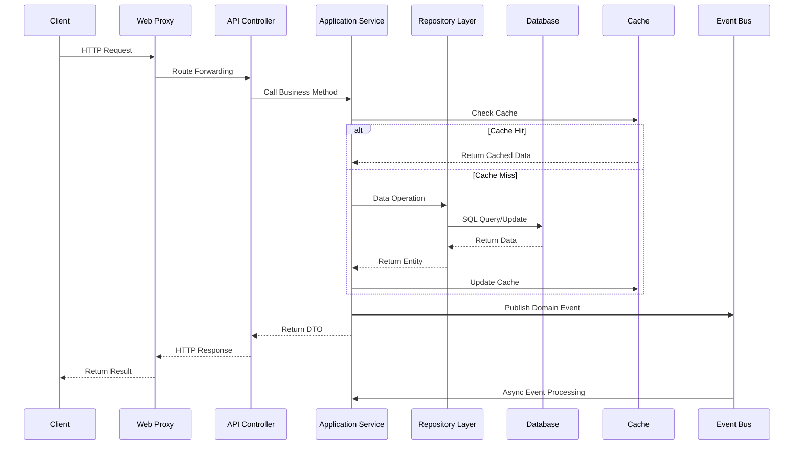
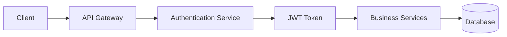

# CodeSpirit Project Overall Architecture Design

## Overview

CodeSpirit (码灵) adopts Clean Architecture design pattern, combined with DDD (Domain-Driven Design) concepts, to build a highly modular and extensible low-code development framework. The entire architecture follows the Dependency Inversion Principle, ensuring core business logic does not depend on external technical implementations.

**Last Updated**: December 2025  
**Framework Version**: v2.0.0  
**Technology Stack**: .NET 10 + Aspire 13.0

## Architecture Layer Design

### 1. Overall Architecture Diagram

```mermaid
graph TB
    subgraph "Presentation Layer"
        Web[CodeSpirit.Web]
        IdentityAPI[CodeSpirit.IdentityApi]
        ExamAPI[CodeSpirit.ExamApi]
        MessagingAPI[CodeSpirit.MessagingApi]
        FileStorageAPI[CodeSpirit.FileStorageApi]
        ConfigCenter[CodeSpirit.ConfigCenter]
        SurveyAPI[CodeSpirit.SurveyApi]
        ApprovalAPI[CodeSpirit.ApprovalApi]
        PathfinderAPI[CodeSpirit.PathfinderApi]
        AiCardsAPI[CodeSpirit.AiCardsApi]
    end
    
    subgraph "Application Layer"
        Services[Application Services]
        DTOs[Data Transfer Objects]
        Handlers[Event Handlers]
        Mappings[AutoMapper Profiles]
    end
    
    subgraph "Domain Layer"
        Core[CodeSpirit.Core]
        Entities[Domain Entities]
        Interfaces[Domain Interfaces]
        Events[Domain Events]
        Exceptions[Domain Exceptions]
    end
    
    subgraph "Infrastructure Layer"
        Shared[CodeSpirit.Shared]
        ServiceDefaults[CodeSpirit.ServiceDefaults]
        Messaging[CodeSpirit.Messaging]
        Data[Entity Framework DbContext]
        Repositories[Repository Pattern]
    end
    
    subgraph "Cross-Cutting Concerns"
        Authorization[CodeSpirit.Authorization]
        Audit[CodeSpirit.Audit]
        Navigation[CodeSpirit.Navigation]
        Amis[CodeSpirit.Amis]
        Charts[CodeSpirit.Charts]
        Aggregator[CodeSpirit.Aggregator]
        Settings[CodeSpirit.Settings]
        PdfGeneration[CodeSpirit.PdfGeneration]
        LLM[CodeSpirit.LLM]
        AiFormFill[CodeSpirit.AiFormFill]
        UdlCards[CodeSpirit.UdlCards]
        ScheduledTasks[CodeSpirit.ScheduledTasks]
        ConfigClient[CodeSpirit.ConfigCenter.Client]
        Caching[CodeSpirit.Caching]
        MultiTenant[CodeSpirit.MultiTenant]
    end
    
    subgraph "Orchestration Layer"
        AppHost[CodeSpirit.AppHost]
    end
    
    %% Main data flow
    Web --> Services
    IdentityAPI --> Services
    ExamAPI --> Services
    MessagingAPI --> Services
    FileStorageAPI --> Services
    ConfigCenter --> Services
    SurveyAPI --> Services
    ApprovalAPI --> Services
    PathfinderAPI --> Services
    
    Services --> Core
    Services --> DTOs
    Services --> Handlers
    Services --> Mappings
    
    Core --> Entities
    Core --> Interfaces
    Core --> Events
    Core --> Exceptions
    
    Services --> Shared
    Services --> Data
    Services --> Repositories
    Data --> Shared
    
    %% Cross-cutting concerns dependencies
    Authorization -.-> Services
    Audit -.-> Services
    Navigation -.-> Web
    Amis -.-> Web
    Charts -.-> Web
    Aggregator -.-> Services
    Settings -.-> Services
    PdfGeneration -.-> Services
    LLM -.-> Services
    AiFormFill -.-> Services
    UdlCards -.-> Web
    ScheduledTasks -.-> Services
    ConfigClient -.-> Services
    Caching -.-> Services
    MultiTenant -.-> Services
    
    %% Aspire orchestration
    AppHost --> IdentityAPI
    AppHost --> ExamAPI
    AppHost --> MessagingAPI
    AppHost --> FileStorageAPI
    AppHost --> ConfigCenter
    AppHost --> SurveyAPI
    AppHost --> ApprovalAPI
    AppHost --> PathfinderAPI
    AppHost --> Web
```



### 2. Project Structure Mapping

| Architecture Layer | Project/Component | Responsibility Description |
|---------|-----------|----------|
| **Presentation Layer** | `CodeSpirit.Web` | Web frontend proxy and routing |
| | `CodeSpirit.IdentityApi` | Identity authentication API service |
| | `CodeSpirit.ExamApi` | Exam system API service |
| | `CodeSpirit.MessagingApi` | Messaging service API |
| | `CodeSpirit.ConfigCenter` | Config center API service |
| | `CodeSpirit.FileStorageApi` | File storage API service |
| | `CodeSpirit.SurveyApi` | Survey API service |
| | `CodeSpirit.ApprovalApi` | Approval workflow API service |
| | `CodeSpirit.PathfinderApi` | AI goal management API service |
| | `CodeSpirit.AiCardsApi` | AI cards API service |
| **Application Layer** | `Services/` | Application service implementation |
| | `Dtos/` | Data transfer objects |
| | `EventHandlers/` | Event handlers |
| **Domain Layer** | `CodeSpirit.Core` | Core domain definitions |
| | `Models/` | Domain models |
| | `Entities/` | Domain entities |
| **Infrastructure Layer** | `CodeSpirit.Shared` | Shared infrastructure |
| | `CodeSpirit.ServiceDefaults` | Service default configuration |
| | `CodeSpirit.Messaging` | Messaging library |
| | `Data/` | Data access layer |
| | `Components/` | Framework components |
| **Cross-Cutting Concerns** | `CodeSpirit.Authorization` | Authorization management |
| | `CodeSpirit.Audit` | Audit logging |
| | `CodeSpirit.Navigation` | Navigation management |
| | `CodeSpirit.Amis` | UI generation engine |
| | `CodeSpirit.Charts` | Smart charts component |
| | `CodeSpirit.Aggregator` | Aggregator component |
| | `CodeSpirit.Settings` | Settings management component |
| | `CodeSpirit.PdfGeneration` | PDF generation component |
| | `CodeSpirit.LLM` | Large language model component |
| | `CodeSpirit.AiFormFill` | AI form smart fill component |
| | `CodeSpirit.UdlCards` | UDL cards component |
| | `CodeSpirit.ScheduledTasks` | Scheduled tasks component |
| | `CodeSpirit.ConfigCenter.Client` | Config center client |
| | `CodeSpirit.Caching` | Distributed cache component |
| | `CodeSpirit.MultiTenant` | Multi-tenant component |
| | `CodeSpirit.Shared/Services` | Enhanced batch import service |
| | `CodeSpirit.Amis/Attributes` | Enhanced import field attributes |

## Core Design Principles

### 1. Dependency Inversion Principle (DIP)

```csharp
// Domain layer defines interfaces
namespace CodeSpirit.Core
{
    public interface IRepository<T> where T : class
    {
        Task<T> GetByIdAsync(object id);
        Task<IEnumerable<T>> GetAllAsync();
        Task AddAsync(T entity);
        Task UpdateAsync(T entity);
        Task DeleteAsync(object id);
    }
}

// Infrastructure layer implements interfaces
namespace CodeSpirit.Shared.Repositories
{
    public class Repository<T> : IRepository<T> where T : class
    {
        // Specific implementation...
    }
}
```

### 2. Single Responsibility Principle (SRP)

Each component has clear responsibility boundaries:

- **CodeSpirit.Core**: Core business rules and domain models
- **CodeSpirit.Amis**: UI generation engine, implements low-code interface generation
- **CodeSpirit.Authorization**: Authorization management, unified authorization based on RBAC and ABAC
- **CodeSpirit.Audit**: Audit tracking, records user operations and system changes, uses GreptimeDB for storage
- **CodeSpirit.LLM**: Large language model component, supports OpenAI, Alibaba Cloud, and other APIs
- **CodeSpirit.AiFormFill**: AI form smart fill component, implements intelligent form filling based on LLM
- **CodeSpirit.FileStorageApi**: File storage service, supports local and cloud storage
- **CodeSpirit.UdlCards**: UDL cards component, supports multiple card types and layouts
- **CodeSpirit.ScheduledTasks**: Scheduled tasks component, supports Cron expression scheduling

### 3. Open-Closed Principle (OCP)

Supports extension through interfaces and abstract classes:

```csharp
// Extensible dependency injection marker interfaces
public interface IScopedDependency { }
public interface ITransientDependency { }
public interface ISingletonDependency { }

// Auto-registration implementation
services.Scan(scan => scan
    .FromAssemblies(assemblies)
    .AddClasses(classes => classes.AssignableTo<IScopedDependency>())
    .AsImplementedInterfaces()
    .WithScopedLifetime());
```

## Modular Design

### 1. Core Module (CodeSpirit.Core)

**Responsibility**: Define system's core concepts, interfaces, and base types

**Main Components**:
- `ApiResponse<T>`: Unified API response format
- `ICurrentUser`: Current user context interface
- `PageList<T>`: Paginated data wrapper
- Exception types: `BusinessException`, `AppServiceException`, `ValidationException`
- Dependency injection marker interfaces: `IScopedDependency`, `ITransientDependency`, `ISingletonDependency`
- Authorization attributes: `RequirePermissionAttribute`, `RequireRoleAttribute`
- Event system: `IDomainEvent`, `IEventHandler<T>`

**Design Characteristics**:
- Does not depend on any external frameworks
- Defines system's core abstractions
- Provides common base types
- Supports modular design for large-scale applications

### 2. Application Service Module

**Responsibility**: Implement specific business use cases and application logic

**Design Pattern**:
```csharp
public class UserService : IUserService
{
    private readonly IRepository<ApplicationUser> _userRepository;
    private readonly ICurrentUser _currentUser;
    
    public UserService(
        IRepository<ApplicationUser> userRepository,
        ICurrentUser currentUser)
    {
        _userRepository = userRepository;
        _currentUser = currentUser;
    }
    
    public async Task<UserDto> CreateUserAsync(CreateUserDto dto)
    {
        // Business logic implementation
    }
}
```

### 3. Infrastructure Module

**Responsibility**: Provide technical implementations and external system integration

**Main Components**:
- Data access layer (Entity Framework Core)
- Cache service (Redis)
- Message queue (RabbitMQ)
- File storage (local/cloud storage)
- Distributed lock (Redis-based)
- Config center client (SignalR)
- Multi-tenant data filter

### 4. Cross-Cutting Concerns Modules

#### 4.1 CodeSpirit.LLM - Large Language Model Component

**Features**:
- Supports multiple LLM APIs (OpenAI, Alibaba Cloud, etc.)
- Unified interface design
- Streaming response processing
- Proxy settings support
- Flexible configuration management

```csharp
// Usage example
public class QuestionGeneratorService
{
    private readonly ILLMClientFactory _llmFactory;
    
    public async Task<string> GenerateQuestionAsync(string topic)
    {
        var client = await _llmFactory.CreateClientAsync();
        return await client.GenerateContentAsync(
            $"Generate a multiple-choice question based on topic '{topic}'");
    }
}
```

#### 4.1.1 Enhanced Batch Import Component

**Features**:
- Intelligent Excel template generation, supports field validation and sample data
- Enhanced batch import processing, supports data validation and error tracking
- Distributed cache support, can track import progress and results
- Failed record export, facilitates user data correction
- Extensible validator architecture, supports custom business validation

**Core Components**:

```csharp
// Import template service - automatically generates Excel import templates
public interface IImportTemplateService
{
    Task<byte[]> GenerateExcelTemplateAsync<T>(string? fileName = null) where T : class;
    Task<byte[]> GenerateExcelTemplateByTypeNameAsync(string typeName, string? fileName = null);
    List<ImportColumnInfo> GetImportColumns<T>() where T : class;
}

// Enhanced batch import helper - handles batch import logic
public class EnhancedBatchImportHelper<TBatchImportDto> where TBatchImportDto : class
{
    public async Task<BatchImportResultDto> EnhancedBatchImportAsync(
        IEnumerable<TBatchImportDto> importData,
        Func<TBatchImportDto, int, Task<string?>> importProcessor,
        Func<TBatchImportDto, int, Task<List<ValidationError>>>? validator = null);
        
    public async Task<BatchImportResultDto?> GetImportResultAsync(string importId);
    public async Task<byte[]> ExportFailedRecordsAsync(List<ImportFailedRecord> failedRecords);
}

// Enhanced batch import service mixin - provides standardized import interface
public interface IEnhancedBatchImportService<TBatchImportDto> where TBatchImportDto : class
{
    Task<BatchImportResultDto> EnhancedBatchImportAsync(IEnumerable<TBatchImportDto> importData);
    Task<BatchImportResultDto?> GetImportResultAsync(string importId);
    Task<byte[]> ExportFailedRecordsAsync(List<ImportFailedRecord> failedRecords);
}
```

**AMIS Frontend Integration**:

```csharp
// Enhanced import field attribute - automatically generates frontend import component
[AmisEnhancedImportField(
    Label = "Batch Import Data", 
    Placeholder = "Please download the template first, fill in the data and upload the Excel file",
    MaxLength = 1000,
    ShowTemplateDownload = true,
    ShowImportResult = true,
    TemplateDownloadText = "Download Import Template",
    ImportButtonText = "Start Import"
)]
public List<StudentBatchImportItemDto> ImportData { get; set; } = new List<StudentBatchImportItemDto>();
```

**Usage Example**:

```csharp
// Implement enhanced batch import in service
public class StudentService : BaseCRUDService<Student, StudentDto, long, CreateStudentDto, UpdateStudentDto>, 
    IStudentService, IEnhancedBatchImportService<StudentBatchImportItemDto>
{
    private readonly EnhancedBatchImportHelper<StudentBatchImportItemDto> _importHelper;
    
    public async Task<BatchImportResultDto> EnhancedBatchImportAsync(IEnumerable<StudentBatchImportItemDto> importData)
    {
        return await _importHelper.EnhancedBatchImportAsync(importData, async (dto, index) =>
        {
            // Custom import logic
            var existingStudent = await Repository.FirstOrDefaultAsync(s => s.StudentNumber == dto.StudentNumber);
            if (existingStudent != null)
            {
                return $"Student number {dto.StudentNumber} already exists";
            }
            
            var student = Mapper.Map<Student>(dto);
            await Repository.AddAsync(student);
            return null; // Return null on success
        });
    }
}
```

#### 4.2 CodeSpirit.FileStorageApi - File Storage Service

**Features**:
- Unified file management interface
- Supports multiple storage backend interfaces
- File reference counting and lifecycle management
- Image processing and thumbnail generation
- Storage bucket management and configuration

```csharp
// File upload example
var uploadRequest = new FileUploadRequest
{
    FileName = "document.pdf",
    FileStream = fileStream,
    ContentType = "application/pdf",
    BucketName = "documents",
    IsPublic = false
};

var fileInfo = await _fileStorageService.UploadFileAsync(uploadRequest);
```

#### 4.3 CodeSpirit.Generator - Code Generation Component

**Features**:
- Template-based code generation
- Supports T4 template engine
- Automatic entity class and DTO generation
- API controller scaffolding generation

## Data Flow Design

### 1. Request Processing Flow



### 2. Event-Driven Architecture

```csharp
// Domain event definition
public class UserCreatedEvent : IDomainEvent
{
    public long UserId { get; set; }
    public string UserName { get; set; }
    public string TenantId { get; set; }
    public DateTime CreatedAt { get; set; }
}

// Event handler
public class UserCreatedEventHandler : IEventHandler<UserCreatedEvent>
{
    private readonly INotificationService _notificationService;
    private readonly IPermissionService _permissionService;
    
    public async Task HandleAsync(UserCreatedEvent @event)
    {
        // Send welcome notification
        await _notificationService.SendWelcomeNotificationAsync(@event.UserId);
        
        // Initialize default permissions
        await _permissionService.AssignDefaultPermissionsAsync(@event.UserId);
        
        // Audit logging
        await _auditService.LogUserCreationAsync(@event);
    }
}

// File reference event example
public class FileReferenceEvent : IDomainEvent
{
    public long FileId { get; set; }
    public string SourceService { get; set; }
    public string SourceEntityType { get; set; }
    public string SourceEntityId { get; set; }
    public FileReferenceAction Action { get; set; } // Create, Confirm, Cancel
}
```

## Configuration Management Architecture

### 1. Layered Configuration

```json
{
  "ConnectionStrings": {
    "identity-api": "Server=localhost;Database=CodeSpirit_Identity;...",
    "exam-api": "Server=localhost;Database=CodeSpirit_Exam;..."
  },
  "Jwt": {
    "SecretKey": "your-secret-key",
    "Issuer": "CodeSpirit",
    "Audience": "CodeSpirit.Client",
    "ExpirationMinutes": 60
  },
  "User": {
    "Password": {
      "RequireDigit": true,
      "RequireLowercase": true,
      "RequireUppercase": true,
      "RequiredLength": 6
    },
    "Lockout": {
      "DefaultLockoutMinutes": 5,
      "MaxFailedAttempts": 5
    }
  }
}
```

### 2. Environment-Specific Configuration

- `appsettings.json`: Base configuration
- `appsettings.Development.json`: Development environment configuration
- `appsettings.Production.json`: Production environment configuration

## Security Architecture Design

### 1. Authentication Architecture



### 2. Authorization Architecture

- **Role-Based Access Control (RBAC)**
- **Attribute-Based Access Control (ABAC)**
- **Dynamic Permission Validation**

```csharp
[Authorize]
[RequirePermission("User.Create")]
public async Task<IActionResult> CreateUser(CreateUserDto dto)
{
    // Business logic
}
```

## Performance Optimization Architecture

### 1. Caching Strategy

- **Level 1 Cache**: Memory cache (IMemoryCache)
- **Level 2 Cache**: Distributed cache (Redis)
- **Query Cache**: Entity Framework query cache

### 2. Database Optimization

- **Read-Write Separation**: Master-slave database configuration
- **Connection Pool Management**: Database connection pool optimization
- **Index Strategy**: Automatic index creation and optimization

## Monitoring and Diagnostics

### 1. Health Checks

```csharp
builder.Services.AddHealthChecks()
    .AddDbContext<ApplicationDbContext>()
    .AddRedis(connectionString)
    .AddRabbitMQ(rabbitConnectionString);
```

### 2. Logging Architecture

- **Structured Logging**: Serilog + Seq
- **Performance Monitoring**: Application Insights
- **Error Tracking**: Custom exception handling middleware

## Deployment Architecture

### 1. .NET Aspire Distributed Application Architecture

**CodeSpirit.AppHost** serves as the Aspire application host, unified management of all services and dependencies:

```csharp
var builder = DistributedApplication.CreateBuilder(args);

// Infrastructure services
var cache = builder.AddRedis("cache")
                   .WithLifetime(ContainerLifetime.Persistent)
                   .WithHostPort(6380)
                   .WithRedisCommander();

var seqService = builder.AddSeq("seq")
                    .WithDataVolume()
                    .ExcludeFromManifest()
                    .WithLifetime(ContainerLifetime.Persistent)
                    .WithUrlForEndpoint("seq", url => url.DisplayLocation = UrlDisplayLocation.SummaryAndDetails)
                    .WithEnvironment("ACCEPT_EULA", "Y");

var rabbitmqService = builder.AddRabbitMQ("rabbitmq", username, password)
                     .WithManagementPlugin()
                     .WithLifetime(ContainerLifetime.Persistent);

var greptimedbService = builder.AddContainer("greptimedb", "greptime/greptimedb", "latest")
                              .WithArgs("standalone", "start", "--http-addr", "0.0.0.0:4000", "--rpc-addr", "0.0.0.0:4001")
                              .WithHttpEndpoint(port: 4000, targetPort: 4000, name: "greptimedb-http")
                              .WithHttpEndpoint(port: 4001, targetPort: 4001, name: "greptimedb-grpc")
                              .WithLifetime(ContainerLifetime.Persistent)
                              .WithEnvironment("GREPTIME_OPTS", "--log-level=info");

// Database instances
var identityDb = sqlserver.AddDatabase("identity-api");
var examDb = sqlserver.AddDatabase("exam-api");
var fileStorageDb = sqlserver.AddDatabase("file-api");
var configCenterDb = sqlserver.AddDatabase("config-center");
var messagingDb = sqlserver.AddDatabase("messaging-api");

// API services
var identityApi = builder.AddProject<Projects.CodeSpirit_IdentityApi>("identity-api")
    .WithReference(identityDb)
    .WithReference(redis)
    .WithReference(rabbitmq)
    .WithReference(elasticsearch)
    .WithReference(seq);

var examApi = builder.AddProject<Projects.CodeSpirit_ExamApi>("exam-api")
    .WithReference(examDb)
    .WithReference(redis)
    .WithReference(rabbitmq)
    .WithReference(identityApi)
    .WithReference(seq);

var fileStorageApi = builder.AddProject<Projects.CodeSpirit_FileStorageApi>("file-api")
    .WithReference(fileStorageDb)
    .WithReference(redis)
    .WithReference(rabbitmq)
    .WithReference(seq);

var configCenter = builder.AddProject<Projects.CodeSpirit_ConfigCenter>("config-center")
    .WithReference(configCenterDb)
    .WithReference(redis)
    .WithReference(seq);

var messagingApi = builder.AddProject<Projects.CodeSpirit_MessagingApi>("messaging-api")
    .WithReference(messagingDb)
    .WithReference(redis)
    .WithReference(rabbitmq)
    .WithReference(seq);

// Web frontend
var web = builder.AddProject<Projects.CodeSpirit_Web>("web")
    .WithReference(identityApi)
    .WithReference(examApi)
    .WithReference(fileStorageApi)
    .WithReference(configCenter)
    .WithReference(messagingApi)
    .WithReference(redis)
    .WithReference(seq);

builder.Build().Run();
```

### 2. Service Discovery and Load Balancing

- **Service Discovery**: Aspire automatically handles service registration and discovery
- **Load Balancing**: Supports multi-instance deployment and automatic load balancing
- **Health Checks**: Automatically monitors service health status
- **Telemetry and Metrics**: Built-in OpenTelemetry support

### 3. Containerized Deployment

**Dockerfile Example** (for each API service):

```dockerfile
FROM mcr.microsoft.com/dotnet/aspnet:10.0 AS base
WORKDIR /app
EXPOSE 8080
EXPOSE 8081

FROM mcr.microsoft.com/dotnet/sdk:10.0 AS build
WORKDIR /src

# Copy project files
COPY ["Src/ApiServices/CodeSpirit.IdentityApi/CodeSpirit.IdentityApi.csproj", "Src/ApiServices/CodeSpirit.IdentityApi/"]
COPY ["Src/CodeSpirit.Core/CodeSpirit.Core.csproj", "Src/CodeSpirit.Core/"]
COPY ["Src/CodeSpirit.Shared/CodeSpirit.Shared.csproj", "Src/CodeSpirit.Shared/"]
COPY ["Src/CodeSpirit.ServiceDefaults/CodeSpirit.ServiceDefaults.csproj", "Src/CodeSpirit.ServiceDefaults/"]

# Restore dependencies
RUN dotnet restore "Src/ApiServices/CodeSpirit.IdentityApi/CodeSpirit.IdentityApi.csproj"

# Copy all source code
COPY . .

# Build application
WORKDIR "/src/Src/ApiServices/CodeSpirit.IdentityApi"
RUN dotnet build "CodeSpirit.IdentityApi.csproj" -c Release -o /app/build

FROM build AS publish
RUN dotnet publish "CodeSpirit.IdentityApi.csproj" -c Release -o /app/publish

FROM base AS final
WORKDIR /app
COPY --from=publish /app/publish .
ENTRYPOINT ["dotnet", "CodeSpirit.IdentityApi.dll"]
```

### 4. Kubernetes Deployment Support

```yaml
apiVersion: apps/v1
kind: Deployment
metadata:
  name: codespirit-identity-api
spec:
  replicas: 3
  selector:
    matchLabels:
      app: codespirit-identity-api
  template:
    metadata:
      labels:
        app: codespirit-identity-api
    spec:
      containers:
      - name: identity-api
        image: codespirit/identity-api:latest
        ports:
        - containerPort: 8080
        env:
        - name: ASPNETCORE_ENVIRONMENT
          value: "Production"
        - name: ConnectionStrings__DefaultConnection
          valueFrom:
            secretKeyRef:
              name: database-secret
              key: connection-string
        resources:
          limits:
            memory: "512Mi"
            cpu: "500m"
          requests:
            memory: "256Mi"
            cpu: "250m"
        livenessProbe:
          httpGet:
            path: /health
            port: 8080
          initialDelaySeconds: 30
          periodSeconds: 10
        readinessProbe:
          httpGet:
            path: /health/ready
            port: 8080
          initialDelaySeconds: 5
          periodSeconds: 5
```

## Extensibility Design

### 1. Plugin Architecture

Supports extending system functionality through plugins:

```csharp
public interface IPlugin
{
    string Name { get; }
    string Version { get; }
    void Initialize(IServiceCollection services);
    void Configure(IApplicationBuilder app);
}

// Plugin loader
public class PluginLoader
{
    public static void LoadPlugins(IServiceCollection services, string pluginPath)
    {
        var pluginAssemblies = Directory.GetFiles(pluginPath, "*.dll")
            .Select(Assembly.LoadFrom);
            
        foreach (var assembly in pluginAssemblies)
        {
            var pluginTypes = assembly.GetTypes()
                .Where(t => typeof(IPlugin).IsAssignableFrom(t) && !t.IsInterface);
                
            foreach (var pluginType in pluginTypes)
            {
                var plugin = Activator.CreateInstance(pluginType) as IPlugin;
                plugin?.Initialize(services);
            }
        }
    }
}
```

### 2. Multi-Tenant Support

- **Data Isolation**: TenantId-based data filtering
- **Configuration Isolation**: Tenant-specific configuration management
- **Resource Isolation**: Tenant-level resource limits
- **Tenant Resolution**: Supports domain name, subdomain, and path resolution

```csharp
// Tenant-aware data filter
public class TenantDataFilter : IDataFilter
{
    public void ApplyFilter<T>(IQueryable<T> query) where T : ITenantEntity
    {
        var currentTenantId = _tenantResolver.GetCurrentTenantId();
        if (!string.IsNullOrEmpty(currentTenantId))
        {
            query = query.Where(e => e.TenantId == currentTenantId);
        }
    }
}
```

### 3. Microservice Extension

- **Horizontal Scaling**: Supports scaling individual API services on demand
- **Vertical Scaling**: Supports increasing service instance resources
- **Service Mesh**: Supports service mesh technologies like Istio
- **Auto-Scaling**: Automatic scaling based on load

## Summary

CodeSpirit's architecture design fully reflects best practices of modern software architecture:

### Core Highlights

1. **Clear Layer Separation**: Clean Architecture-based layered design ensures separation of concerns and maintainability
2. **Highly Modular**: Supports independent development, testing, and deployment, improving development efficiency
3. **Extensible**: Supports functional extension through interfaces and abstractions, supports plugin architecture
4. **Cloud-Native Support**: Modern containerized and microservice architecture based on .NET Aspire
5. **Performance Optimization**: Multi-level caching, read-write separation, and database optimization
6. **Security Assurance**: Complete authentication and authorization system, supports RBAC and ABAC
7. **Multi-Tenant Support**: Comprehensive multi-tenant data isolation and resource management
8. **AI Capability Integration**: Integrates large language model capabilities through CodeSpirit.LLM component
9. **Unified Startup Framework**: Unified API service configuration through BaseApiConfiguration
10. **Comprehensive Monitoring**: Integrated OpenTelemetry, health checks, and structured logging
11. **Enhanced Batch Import**: Intelligent Excel template generation, data validation, error tracking, and failed record export

### Technical Features

- **.NET 10 + Aspire 13.0**: Uses latest .NET technology stack and Aspire platform
- **Entity Framework Core**: Modern ORM data access, supports MySQL and SQL Server
- **SignalR**: Real-time communication support (config center config push)
- **Redis**: High-performance caching and distributed locks
- **RabbitMQ**: Async message processing
- **GreptimeDB**: Time-series database for audit log storage and analysis
- **Seq**: Structured log aggregation and analysis
- **AutoMapper**: Automated object mapping

### Business Value

This architecture design enables CodeSpirit to meet rapid development needs while ensuring system stability and extensibility. Through unified architecture patterns, development teams can:

- **Rapid Development**: Accelerate business development through componentization and low-code platform
- **Flexible Extension**: Add new business modules and API services as needed
- **Stable Operation**: Ensure system stability through comprehensive monitoring and fault tolerance mechanisms
- **Efficient Maintenance**: Reduce maintenance costs through clear code structure and unified development standards
