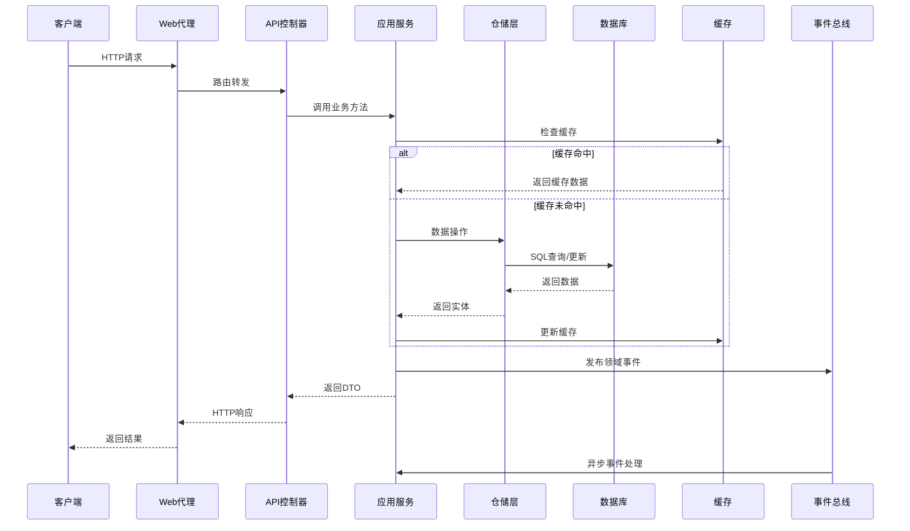
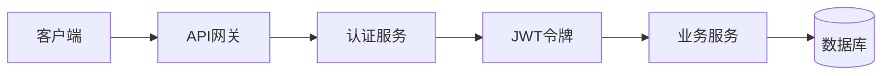

# CodeSpirit 项目整体架构设计

## 概述

CodeSpirit（码灵）采用Clean Architecture（整洁架构）设计模式，结合DDD（领域驱动设计）理念，构建了一个高度模块化、可扩展的低代码开发框架。整个架构遵循依赖倒置原则，确保核心业务逻辑不依赖于外部技术实现。

**最后更新**: 2025年12月25日  
**框架版本**: v2.0.0  
**技术栈**: .NET 10 + Aspire 13.0

## 架构层次设计

### 1. 整体架构图

```mermaid
graph TB
    subgraph "表示层 (Presentation Layer)"
        Web[CodeSpirit.Web]
        IdentityAPI[CodeSpirit.IdentityApi]
        ExamAPI[CodeSpirit.ExamApi]
        MessagingAPI[CodeSpirit.MessagingApi]
        FileStorageAPI[CodeSpirit.FileStorageApi]
        ConfigCenter[CodeSpirit.ConfigCenter]
        SurveyAPI[CodeSpirit.SurveyApi]
        ApprovalAPI[CodeSpirit.ApprovalApi]
        PathfinderAPI[CodeSpirit.PathfinderApi]
        PathfinderAgent[CodeSpirit.PathfinderAgent]
        PartnerAPI[CodeSpirit.PartnerApi]
        AiCardsAPI[CodeSpirit.AiCardsApi]
        ContentAPI[CodeSpirit.ContentApi]
    end
    
    subgraph "应用层 (Application Layer)"
        Services[Application Services]
        DTOs[Data Transfer Objects]
        Handlers[Event Handlers]
        Mappings[AutoMapper Profiles]
    end
    
    subgraph "领域层 (Domain Layer)"
        Core[CodeSpirit.Core]
        Entities[Domain Entities]
        Interfaces[Domain Interfaces]
        Events[Domain Events]
        Exceptions[Domain Exceptions]
    end
    
    subgraph "基础设施层 (Infrastructure Layer)"
        Shared[CodeSpirit.Shared]
        ServiceDefaults[CodeSpirit.ServiceDefaults]
        Messaging[CodeSpirit.Messaging]
        Data[Entity Framework DbContext]
        Repositories[Repository Pattern]
    end
    
    subgraph "横切关注点 (Cross-Cutting Concerns)"
        Authorization[CodeSpirit.Authorization]
        Audit[CodeSpirit.Audit]
        Navigation[CodeSpirit.Navigation]
        Amis[CodeSpirit.Amis]
        Charts[CodeSpirit.Charts]
        Aggregator[CodeSpirit.Aggregator]
        Settings[CodeSpirit.Settings]
        PdfGeneration[CodeSpirit.PdfGeneration]
        LLM[CodeSpirit.LLM]
        AiFormFill[CodeSpirit.AiFormFill]
        UdlCards[CodeSpirit.UdlCards]
        ScheduledTasks[CodeSpirit.ScheduledTasks]
        ConfigClient[CodeSpirit.ConfigCenter.Client]
        Caching[CodeSpirit.Caching]
        MultiTenant[CodeSpirit.MultiTenant]
    end
    
    subgraph "引擎层 (Orchestration Layer)"
        AppHost[CodeSpirit.AppHost]
    end
    
    %% 主要数据流
    Web --> Services
    IdentityAPI --> Services
    ExamAPI --> Services
    MessagingAPI --> Services
    FileStorageAPI --> Services
    ConfigCenter --> Services
    SurveyAPI --> Services
    ApprovalAPI --> Services
    PathfinderAPI --> Services
    PathfinderAgent --> Services
    PartnerAPI --> Services
    AiCardsAPI --> Services
    ContentAPI --> Services
    
    Services --> Core
    Services --> DTOs
    Services --> Handlers
    Services --> Mappings
    
    Core --> Entities
    Core --> Interfaces
    Core --> Events
    Core --> Exceptions
    
    Services --> Shared
    Services --> Data
    Services --> Repositories
    Data --> Shared
    
    %% 横切关注点依赖
    Authorization -.-> Services
    Audit -.-> Services
    Navigation -.-> Web
    Amis -.-> Web
    Charts -.-> Web
    Aggregator -.-> Services
    Settings -.-> Services
    PdfGeneration -.-> Services
    LLM -.-> Services
    AiFormFill -.-> Services
    UdlCards -.-> Web
    ScheduledTasks -.-> Services
    ConfigClient -.-> Services
    Caching -.-> Services
    MultiTenant -.-> Services
    
    %% Aspire 编排
    AppHost --> IdentityAPI
    AppHost --> ExamAPI
    AppHost --> MessagingAPI
    AppHost --> FileStorageAPI
    AppHost --> ConfigCenter
    AppHost --> SurveyAPI
    AppHost --> ApprovalAPI
    AppHost --> PathfinderAPI
    AppHost --> PathfinderAgent
    AppHost --> PartnerAPI
    AppHost --> AiCardsAPI
    AppHost --> ContentAPI
    AppHost --> Web
```

### 2. 项目结构映射

| 架构层次 | 项目/组件 | 职责描述 |
|---------|-----------|----------|
| **表示层** | `CodeSpirit.Web` | Web前端代理和路由 |
| | `CodeSpirit.IdentityApi` | 身份认证API服务 |
| | `CodeSpirit.ExamApi` | 考试系统API服务 |
| | `CodeSpirit.MessagingApi` | 消息服务API |
| | `CodeSpirit.ConfigCenter` | 配置中心API服务 |
| | `CodeSpirit.FileStorageApi` | 文件存储API服务 |
| | `CodeSpirit.SurveyApi` | 问卷调查API服务 |
| | `CodeSpirit.ApprovalApi` | 审批工作流API服务 |
| | `CodeSpirit.PathfinderApi` | AI目标管理API服务 |
| | `CodeSpirit.PathfinderAgent` | AI目标管理智能体服务 |
| | `CodeSpirit.PartnerApi` | AI伙伴平台API服务 |
| | `CodeSpirit.AiCardsApi` | AI卡片API服务 |
| | `CodeSpirit.ContentApi` | 内容管理API服务 |
| **应用层** | `Services/` | 应用服务实现 |
| | `Dtos/` | 数据传输对象 |
| | `EventHandlers/` | 事件处理器 |
| **领域层** | `CodeSpirit.Core` | 核心领域定义 |
| | `Models/` | 领域模型 |
| | `Entities/` | 领域实体 |
| **基础设施层** | `CodeSpirit.Shared` | 共享基础设施 |
| | `CodeSpirit.ServiceDefaults` | 服务默认配置 |
| | `CodeSpirit.Messaging` | 消息传递库 |
| | `Data/` | 数据访问层 |
| | `Components/` | 框架组件 |
| **横切关注点** | `CodeSpirit.Authorization` | 权限管理 |
| | `CodeSpirit.Audit` | 审计日志 |
| | `CodeSpirit.Navigation` | 导航管理 |
| | `CodeSpirit.Amis` | UI生成引擎 |
| | `CodeSpirit.Charts` | 智能图表组件 |
| | `CodeSpirit.Aggregator` | 聚合器组件 |
| | `CodeSpirit.Settings` | 设置管理组件 |
| | `CodeSpirit.PdfGeneration` | PDF生成组件 |
| | `CodeSpirit.LLM` | 大语言模型组件 |
| | `CodeSpirit.AiFormFill` | AI表单智能填充组件 |
| | `CodeSpirit.UdlCards` | UDL卡片组件 |
| | `CodeSpirit.ScheduledTasks` | 定时任务组件 |
| | `CodeSpirit.ConfigCenter.Client` | 配置中心客户端 |
| | `CodeSpirit.Caching` | 分布式缓存组件 |
| | `CodeSpirit.MultiTenant` | 多租户组件 |
| | `CodeSpirit.OData` | OData查询和导出 |
| | `CodeSpirit.PartnerSdk` | AI伙伴SDK |
| | `CodeSpirit.PathfinderTools` | Pathfinder工具集 |
| | `CodeSpirit.VectorSearch` | 向量搜索组件 |

## 核心设计原则

### 1. 依赖倒置原则 (DIP)

核心业务逻辑依赖于抽象接口，而不依赖于具体实现。`CodeSpirit.Core` 定义核心接口，`CodeSpirit.Shared` 提供通用实现，各API服务实现具体业务逻辑。通过依赖注入容器（ASP.NET Core DI）自动注册和解析依赖关系。

### 2. 单一职责原则 (SRP)

每个组件都有明确的职责边界，确保关注点分离：

- **CodeSpirit.Core**: 核心领域模型和接口定义
- **CodeSpirit.Amis**: UI界面自动生成引擎
- **CodeSpirit.Authorization**: 权限管理（RBAC + ABAC）
- **CodeSpirit.Audit**: 审计追踪（GreptimeDB存储）
- **CodeSpirit.LLM**: 大语言模型集成
- **CodeSpirit.AiFormFill**: AI智能表单填充
- **CodeSpirit.Caching**: 分布式缓存（Redis）
- **CodeSpirit.MultiTenant**: 多租户数据隔离
- **CodeSpirit.OData**: OData查询和Excel导出
- **CodeSpirit.VectorSearch**: 向量搜索和语义检索

### 3. 开闭原则 (OCP)

通过依赖注入标记接口（`IScopedDependency`、`ITransientDependency`、`ISingletonDependency`）支持自动服务注册，新增服务只需实现对应接口即可自动注册到DI容器，无需修改启动配置。

## 模块化设计

### 1. 核心模块 (CodeSpirit.Core)

**职责**: 定义系统的核心概念、接口和基础类型

**主要组件**:
- `ApiResponse<T>`: 统一API响应格式
- `ICurrentUser`: 当前用户上下文接口
- `PageList<T>`: 分页数据封装
- 异常类型: `BusinessException`, `AppServiceException`, `ValidationException`
- 依赖注入标记接口: `IScopedDependency`, `ITransientDependency`, `ISingletonDependency`
- 授权属性: `PermissionAttribute`, `PlatformAttribute`
- 其他核心接口: `IMultiTenant`, `ISettableCurrentUser`, `IHasId<T>`

**设计特点**:
- 不依赖任何外部框架
- 定义系统的核心抽象
- 提供通用的基础类型
- 支持大规模应用的模块化设计

### 2. 应用服务模块

**职责**: 实现具体的业务用例和应用逻辑

**设计模式**: 
- 继承 `BaseCRUDService` 提供标准CRUD操作
- 使用仓储模式（`IRepository<T>`）进行数据访问
- 通过AutoMapper实现DTO与实体的映射
- 支持事件驱动架构，发布领域事件

### 3. 基础设施模块

**职责**: 提供技术实现和外部系统集成

**主要组件**:
- **数据访问**: Entity Framework Core（支持MySQL/SQL Server）
- **缓存服务**: Redis分布式缓存和分布式锁
- **消息队列**: RabbitMQ异步消息处理
- **时序数据库**: GreptimeDB审计日志存储
- **日志聚合**: Seq结构化日志
- **文件存储**: 本地文件系统和云存储
- **实时通信**: SignalR（配置推送、消息通知）
- **MQTT Broker**: Mosquitto（IoT通信）

### 4. 横切关注点模块

#### 4.1 CodeSpirit.LLM - 大语言模型组件

**功能特性**:
- 支持多种LLM API（OpenAI、阿里云通义千问等）
- 统一的接口设计（`ILLMClientFactory`、`ILLMClient`）
- 流式响应处理
- HTTP代理支持
- 灵活的配置管理
- 提示词模板管理

#### 4.1.1 增强批量导入组件

**功能特性**:
- 智能Excel模板生成，支持字段验证和示例数据
- 增强的批量导入处理，支持数据验证和错误追踪
- 分布式缓存支持，可跟踪导入进度和结果
- 失败记录导出，便于用户修正数据
- 可扩展的验证器架构，支持自定义业务验证

**核心组件**:
- **导入模板服务** (`IImportTemplateService`): 自动生成Excel导入模板
- **增强批量导入助手** (`EnhancedBatchImportHelper<T>`): 处理批量导入逻辑
- **增强批量导入服务接口** (`IEnhancedBatchImportService<T>`): 标准化导入接口

**AMIS前端集成**:
通过 `AmisEnhancedImportField` 特性自动生成前端导入组件，支持模板下载、数据导入、进度跟踪和失败记录导出。

**使用流程**:
1. 服务实现 `IEnhancedBatchImportService<T>` 接口
2. 在DTO中使用 `AmisEnhancedImportField` 特性
3. 前端自动生成导入界面
4. 支持导入进度跟踪和失败记录下载

#### 4.2 CodeSpirit.FileStorageApi - 文件存储服务

**功能特性**:
- 统一的文件管理接口
- 支持本地文件系统和云存储
- 文件引用计数和生命周期管理
- 图片处理和缩略图生成
- 存储桶管理和访问控制
- 临时文件和永久文件管理

## 数据流设计

### 1. 请求处理流程

### 2. 事件驱动架构

**设计模式**: 基于RabbitMQ的分布式事件总线

**事件流程**:
1. 服务发布领域事件到事件总线
2. 事件总线通过RabbitMQ分发事件
3. 订阅者异步处理事件
4. 支持事件重试和死信队列

**常见事件类型**:
- 用户事件（创建、更新、删除）
- 文件引用事件（创建、确认、取消）
- 权限变更事件
- 租户事件（租户感知）
- 审计事件

## 配置管理架构

### 1. 分层配置

**配置来源**（按优先级从低到高）:
1. `appsettings.json`: 基础配置
2. `appsettings.{Environment}.json`: 环境特定配置
3. 配置中心（CodeSpirit.ConfigCenter）: 动态配置
4. 环境变量: Aspire注入的服务配置
5. 命令行参数

### 2. 配置中心

**功能特性**:
- 集中式配置管理
- 实时配置推送（SignalR）
- 配置版本控制
- 配置审计追踪
- 支持多环境配置

## 安全架构设计

### 1. 认证架构

### 2. 授权架构

**多层授权机制**:
- **JWT Token认证**: Bearer Token验证
- **API Key认证**: 服务间调用
- **内部服务认证**: 服务间安全通信
- **基于角色的访问控制 (RBAC)**: 角色和权限管理
- **基于属性的访问控制 (ABAC)**: 动态权限验证
- **权限继承**: 支持角色权限继承

**实现方式**:
- 通过 `RequirePermission` 特性标记控制器方法
- 权限验证集成到ASP.NET Core授权管道
- 支持细粒度的操作权限控制

## 性能优化架构

### 1. 缓存策略

- **分布式缓存**: Redis缓存（支持序列化和JSON）
- **缓存键管理**: 统一的缓存键命名规范
- **缓存失效**: 支持过期时间和主动失效
- **缓存预热**: 应用启动时预加载热点数据

### 2. 数据库优化

- **异步查询**: 所有数据库操作使用异步方法
- **只读查询**: 使用 `AsNoTracking()` 优化查询性能
- **索引优化**: 通过EF Core配置索引
- **连接池**: 自动管理数据库连接池
- **批量操作**: 支持批量插入和更新

### 3. 分布式锁

- 基于Redis的分布式锁实现
- 防止并发操作冲突
- 自动超时和释放机制

## 监控和诊断

### 1. 健康检查

- 数据库健康检查
- Redis健康检查
- RabbitMQ健康检查
- 自定义服务健康检查
- Aspire Dashboard实时监控

### 2. 日志架构

- **结构化日志**: Seq日志聚合和查询
- **审计日志**: GreptimeDB时序数据存储
- **应用日志**: 统一的日志中间件
- **错误追踪**: 自定义异常处理过滤器
- **性能追踪**: OpenTelemetry支持

### 3. 遥测和指标

- **OpenTelemetry**: 分布式追踪
- **Aspire Dashboard**: 实时服务监控
- **指标收集**: 服务性能指标
- **链路追踪**: 跨服务调用追踪

## 部署架构

### 1. .NET Aspire 分布式应用架构

**CodeSpirit.AppHost** 作为 Aspire 应用宿主，统一管理所有服务和依赖项。

**基础设施服务**:
- **Redis**: 分布式缓存和SignalR Backplane (端口6380)
- **Seq**: 结构化日志聚合和查询
- **RabbitMQ**: 消息队列（带管理界面）
- **GreptimeDB**: 时序数据库（HTTP:4000, gRPC:4001）
- **Mosquitto**: MQTT Broker (端口1883)

**数据库配置**:
- 支持MySQL和SQL Server
- 每个API服务独立数据库
- 数据卷持久化
- 自动迁移支持

**API 服务编排**:
- **Config Center**: 配置中心（无依赖，首先启动）
- **Identity API**: 身份认证服务
- **Exam API**: 考试系统（依赖Identity和Partner）
- **Messaging API**: 消息服务
- **File Storage API**: 文件存储服务
- **Survey API**: 问卷调查服务
- **Approval API**: 审批工作流服务
- **Pathfinder API**: AI目标管理服务
- **Partner API**: AI伙伴平台服务
- **Web Frontend**: Web前端应用

**服务间依赖**:
- 所有API服务依赖Config Center和Identity API
- 通过Aspire自动服务发现和环境变量注入
- 统一的JWT、LLM和数据库配置
- 健康检查和自动重启

### 2. 服务发现和负载均衡

- **服务发现**: Aspire 自动处理服务注册和发现
- **负载均衡**: 支持多实例部署和自动负载均衡
- **健康检查**: 自动监控服务健康状态
- **遥测和指标**: 内置OpenTelemetry支持

### 3. 容器化部署

**容器支持**:
- 每个API服务都提供Dockerfile
- 基于 `.NET 10` 运行时镜像
- 多阶段构建优化镜像大小
- 支持Docker Compose和Kubernetes部署
- Aspire自动生成容器清单

### 4. Kubernetes 部署支持

**K8s 特性**:
- Deployment配置管理
- Service和Ingress配置
- ConfigMap和Secret管理
- 健康检查（Liveness/Readiness Probe）
- 资源限制和请求
- 水平自动伸缩（HPA）
- 持久化存储（PVC）

## 扩展性设计

### 1. 模块化扩展

**扩展方式**:
- 通过依赖注入标记接口自动注册服务
- 组件化设计，支持按需引用
- 标准化的服务接口和实现
- 支持自定义组件开发

### 2. 多租户支持

**多租户特性**:
- **数据隔离**: 基于 `IMultiTenant` 接口的自动数据过滤
- **租户解析**: 支持域名、子域名、请求头和路径解析
- **租户感知事件**: 事件系统自动注入租户上下文
- **配置隔离**: 租户特定的配置管理
- **资源隔离**: 租户级别的资源限制

### 3. 微服务扩展

**扩展能力**:
- **水平扩展**: Aspire支持多实例部署
- **服务发现**: 自动服务注册和发现
- **负载均衡**: 内置负载均衡支持
- **健康检查**: 自动健康监控和故障转移
- **灰度发布**: 支持版本化部署

## 总结

CodeSpirit的架构设计充分体现了现代软件架构的最佳实践：

### 核心亮点

1. **清晰的层次分离**: 基于Clean Architecture的层次设计，确保关注点分离和可维护性
2. **高度模块化**: 20+独立组件，支持独立开发、测试和按需引用
3. **可扩展性**: 依赖注入标记接口自动注册，支持灵活扩展
4. **云原生架构**: Aspire编排平台，容器化部署，服务发现和健康检查
5. **性能优化**: Redis分布式缓存、分布式锁、异步查询优化
6. **安全保障**: JWT+API Key混合认证，RBAC+ABAC授权，权限继承
7. **多租户支持**: 自动数据过滤、租户感知事件、灵活的租户解析
8. **AI能力集成**: LLM抽象层、AI表单填充、AI伙伴平台、向量搜索
9. **低代码平台**: AMIS UI自动生成、智能图表、OData查询和导出
10. **完善的监控**: OpenTelemetry追踪、Seq日志、GreptimeDB审计、Aspire Dashboard
11. **增强批量导入**: Excel模板生成、数据验证、进度跟踪、失败记录导出
12. **实时通信**: SignalR配置推送、消息通知、AI伙伴实时交互

### 技术特性

- **.NET 10 + Aspire 13.0**: 使用最新的.NET技术栈和Aspire编排平台
- **Entity Framework Core**: 现代化ORM，支持MySQL和SQL Server多数据库
- **SignalR**: 实时通信（配置推送、消息通知、AI伙伴）
- **Redis**: 分布式缓存、分布式锁、SignalR Backplane
- **RabbitMQ**: 异步消息队列和事件总线
- **GreptimeDB**: 时序数据库，审计日志存储和分析
- **Seq**: 结构化日志聚合和查询
- **Mosquitto**: MQTT Broker，支持IoT通信
- **AutoMapper**: 对象映射自动化
- **OpenTelemetry**: 分布式追踪和遥测

### 业务价值

这种架构设计使得CodeSpirit既能满足快速开发的需求，又能保证系统的稳定性和可扩展性。通过统一的架构模式，开发团队可以：

- **快速开发**: 通过组件化和低代码平台加速业务开发
- **灵活扩展**: 按需添加新的业务模块和API服务
- **稳定运行**: 通过完善的监控和容错机制保障系统稳定
- **高效维护**: 清晰的代码结构和统一的开发规范降低维护成本 