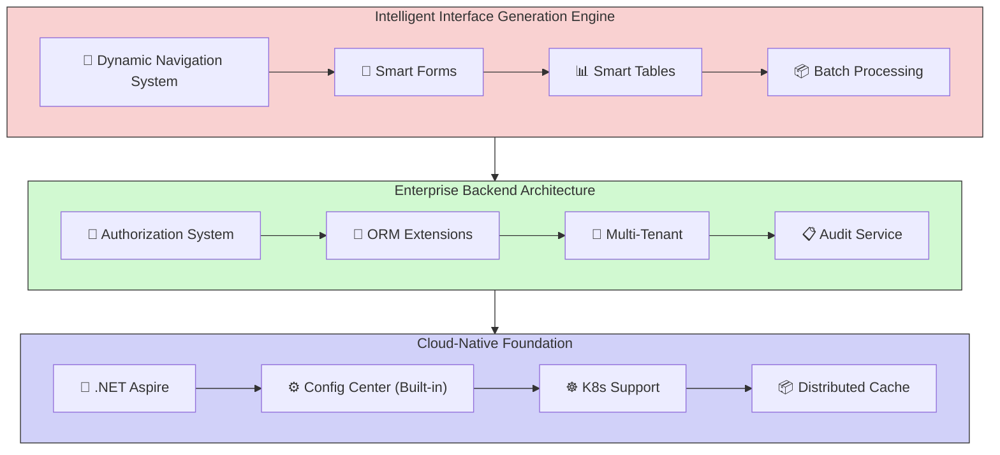

## Overall Technical System Overview

**Last Updated**: January 2025  
**Framework Version**: v2.0.0

## 1. Architecture Overview

CodeSpirit (码灵) is a full-stack low-code development framework built on .NET 10, achieving backend-driven full-stack development paradigm through intelligent code generation engine and deep AI collaboration. The framework adopts Clean Architecture layered design, providing full lifecycle support from interface generation, business logic orchestration to system operations.

### 1.1 Architecture Diagram



## 2. Core Technology Stack

| Category         | Technology Selection                                    |
| :----------- | :------------------------------------------ |
| **Framework**     | .NET 10                                     |
| **Language**     | C# 13 (supports Primary Constructor and other new features)    |
| **Backend Architecture** | Clean Architecture + DDD                    |
| **ORM**      | Entity Framework Core (with soft delete, audit tracking) |
| **Frontend Generation** | AMIS (dynamic form/table generation)                   |
| **Microservices**   | Aspire 13.0 (service discovery, health checks)           |
| **Container Orchestration** | Kubernetes (supports auto-scaling)                |
| **Identity Authentication** | JWT + OAuth2.0 (RBAC/ABAC hybrid model)         |
| **Data Access** | Repository Pattern + CQRS (partial modules)       |
| **Database**   | MySQL 8.0 / SQL Server 2022 (multi-database support) |
| **Time-Series Database** | GreptimeDB (audit log storage)                |

## 3. Main Technical Components

#### Dynamic Navigation System

- **Permission Synchronization**: Automatically generates menu tree based on RBAC model, supports `PageAttribute` annotation configuration for visibility
- **Multi-Level Navigation**: Supports unlimited nested menus, automatically handles route lazy loading

#### CRUD Generation

- **Automated Forms**: Generate query conditions based on `QueryDto` (supports 20+ field types, such as date ranges, dropdown selections)
- **Validation Integration**: Automatically generates frontend validation rules based on data annotations (e.g., `[Required]` → required prompt)
- **Batch Processing**: Excel import/export template auto-generation, supports data validation and async tasks

#### Authorization System (RBAC+ABAC)

- **Permission Tree Management**: Dynamically loads permission nodes through `IPermissionService`
- **Fine-Grained Control**: Supports dynamic permission determination based on attributes (such as user department, data scope)

#### Audit Logging

- **Full-Link Tracking**: Records operator, time, IP address, and data change details
- **Entity Base Class**: `AuditableEntityBase<TKey>` automatically records creation/modification information
- **Time-Series Database**: Uses GreptimeDB to store audit logs, supports efficient querying and analysis

#### Entity Framework Extensions

- **Global Filters**: Automatically injects multi-tenant isolation (`TenantId`) and soft delete (`IsDeleted`)
- **Snowflake ID Generation**: Distributed environment unique primary key support
- **Multi-Database Support**: Simultaneously supports MySQL and SQL Server, switchable via configuration

#### Service Auto-Registration

Implements dependency injection automation through marker interfaces:

- `IScopedDependency`: Such as database context (DbContext)
- `ITransientDependency`: Such as utility class services
- `ISingletonDependency`: Such as config center client

#### Config Center

- **Multi-Environment Configuration Management**: Supports development, testing, production, and other environment configurations
- **Config Item Entity**: ConfigItem (config item management)
- **Application Management**: App (application registration and management)
- **Config Publishing Management**: Supports config publishing and version control
- **Version Control and Rollback**: Config history version management and rollback functionality
- **Real-Time Push**: Real-time config change push based on SignalR

#### Generic CRUD Service

Provides generic CRUD service base class to simplify data operations:

```csharp
public abstract class BaseCRUDService<TEntity, TDto, TKey, TCreateDto, TUpdateDto> : 
  IBaseCRUDService<TEntity, TDto, TKey, TCreateDto, TUpdateDto> 
  where TEntity : class
  where TDto : class
  where TKey : IEquatable<TKey>
  where TCreateDto : class
  where TUpdateDto : class
{
  // Provides standard CRUD operation methods
  // Supports paginated queries, batch operations, soft delete, etc.
}
```

#### Enhanced Batch Import System

**Core Features:**

- **Intelligent Excel Template Generation**: Automatically generates Excel import templates with validation rules based on DTO properties
- **Data Validation and Error Tracking**: Supports DataAnnotations validation and custom business validation
- **Distributed Cache Support**: Can track import progress and results, supports large-scale concurrent imports
- **Failed Record Management**: Detailed failure reason recording, supports failed data export and correction

**Technical Implementation:**

```csharp
// Import template service - intelligently generates Excel templates
public interface IImportTemplateService
{
    Task<byte[]> GenerateExcelTemplateAsync<T>(string? fileName = null) where T : class;
    List<ImportColumnInfo> GetImportColumns<T>() where T : class;
}

// Enhanced batch import helper - handles import logic
public class EnhancedBatchImportHelper<TBatchImportDto>
{
    public async Task<BatchImportResultDto> EnhancedBatchImportAsync(
        IEnumerable<TBatchImportDto> importData,
        Func<TBatchImportDto, int, Task<string?>> importProcessor,
        Func<TBatchImportDto, int, Task<List<ValidationError>>>? validator = null);
}

// Enhanced batch import service mixin - standardized interface
public interface IEnhancedBatchImportService<TBatchImportDto>
{
    Task<BatchImportResultDto> EnhancedBatchImportAsync(IEnumerable<TBatchImportDto> importData);
    Task<BatchImportResultDto?> GetImportResultAsync(string importId);
    Task<byte[]> ExportFailedRecordsAsync(List<ImportFailedRecord> failedRecords);
}
```

**Frontend Integration:**

Through AMIS enhanced import field attributes, automatically generates complete import interface:

```csharp
[AmisEnhancedImportField(
    Label = "Batch Import Data", 
    Placeholder = "Please download the template first, fill in the data and upload the Excel file",
    MaxLength = 1000,
    ShowTemplateDownload = true,
    ShowImportResult = true
)]
public List<StudentBatchImportItemDto> ImportData { get; set; }
```

#### Aggregator (CodeSpirit.Aggregator)

**Provides Advanced Data Aggregation Capabilities:**

- **Dynamic Field Replacement**: Supports static and dynamic field replacement
- **Data Source Association**: Associates external data sources through HTTP API
- **Template Display**: Supports templated data display format

**Syntax Rules:**

- **Static Replacement**  
  Directly modify field values using templates without requesting external data sources:

  ```plaintext
  createdBy#User-{value}
  ```

  - **Effect**: `10001` → `User-10001`

- **Dynamic Replacement**  
  Get field values through data source and replace original value:

  ```plaintext
  updatedBy=/user/{value}.name
  ```

  - Request `/user/10002` to get `name` field value, e.g., `User-10002`
  - **Effect**: `10002` → `User-10002`

- **Dynamic Supplement**  
  Append data source fields after original value (default separator is space):

  ```plaintext
  items.createdBy=/user/{value}.fullName#{value} ({field})
  ```

  - If original value is `10003`, data source returns `fullName: "User-10003"`
  - **Effect**: `10003` → `10003 (User-10003)`

- **Ready to Use:**

  ```csharp
  /// <summary>
  /// Config publish history DTO
  /// </summary>
  public class ConfigPublishHistoryDto
  {
      /// <summary>
      /// Application ID
      /// </summary>
      [DisplayName("Application ID")]
      public string AppId { get; set; }
  
      /// <summary>
      /// Publish time
      /// </summary>
      [DisplayName("Publish Time")]
      [DisplayFormat(DataFormatString = "{0:yyyy-MM-dd HH:mm:ss}")]
      public DateTime CreatedAt { get; set; }
  
      /// <summary>
      /// Publisher (get user information through aggregator)
      /// </summary>
      [DisplayName("Publisher")]
      [AggregateField(dataSource: "http://identity/api/identity/users/{value}.data.name", template: "User: {field}")]
      public string CreatedBy { get; set; }
  }
  ```

#### AI Form Smart Fill (CodeSpirit.AiFormFill)

**Features**:
- **Smart Form Fill**: LLM-based intelligent form data filling
- **Context Understanding**: Understands form field semantics and relationships
- **Multi-LLM Support**: Supports OpenAI, Alibaba Cloud, and other LLM providers

#### UDL Cards Component (CodeSpirit.UdlCards)

**Features**:
- **Card Generator**: Supports multiple card types (statistics cards, info cards, chart cards, etc.)
- **Layout Management**: Flexible card layout configuration
- **Data Binding**: Supports dynamic data binding and updates

#### Scheduled Tasks Component (CodeSpirit.ScheduledTasks)

**Features**:
- **Task Scheduling**: Supports Cron expression-based scheduled task scheduling
- **Task Management**: Task creation, update, deletion, and pause
- **Execution Monitoring**: Task execution status monitoring and log recording

### 4. Project Structure

The CodeSpirit framework adopts the following project structure:

```c#
Src/
├── ApiServices/
│   ├── CodeSpirit.IdentityApi/           # Identity Authentication API
│   ├── CodeSpirit.OrderApi/              # Order Service API
│   └── CodeSpirit.ConfigCenter/          # Config Center
│       └── CodeSpirit.ConfigCenter.Client/ # Config Center Client
├── Components/
│   ├── CodeSpirit.Aggregator/            # Aggregator Component
│   ├── CodeSpirit.Amis/                  # UI Generation Engine
│   ├── CodeSpirit.Authorization/         # Authorization Component
│   ├── CodeSpirit.Navigation/            # Navigation Component
│   ├── CodeSpirit.LLM/                   # Large Language Model Component
│   ├── CodeSpirit.Charts/                # Smart Charts Component
│   ├── CodeSpirit.PdfGeneration/         # PDF Generation Component
│   ├── CodeSpirit.Settings/              # Settings Management Component
│   ├── CodeSpirit.Audit/                 # Audit Tracking Component
│   └── CodeSpirit.MultiTenant/           # Multi-Tenant Component
├── CodeSpirit.AppHost/                   # Aspire Application Host
├── CodeSpirit.Core/                      # Core Definitions
├── CodeSpirit.ServiceDefaults/           # Service Default Configuration
├── CodeSpirit.Shared/                    # Shared Library
├── CodeSpirit.Web/                       # Web Related Components
└── Tests/
    ├── Components/
    │   ├── CodeSpirit.Aggregator.Tests/
    │   ├── CodeSpirit.Authorization.Tests/
    │   └── CodeSpirit.Components.TestsBase/
    ├── ApiServices/
    │   └── CodeSpirit.IdentityApi.Tests/
    └── CodeSpirit.Tests/                 # General Tests
```
