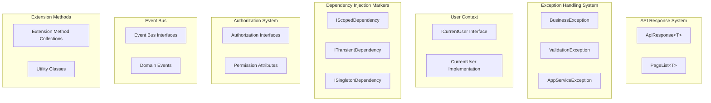

# CodeSpirit.Core Core Framework

## Overview

CodeSpirit.Core is the core module of the entire framework, defining the system's fundamental abstractions, common types, and core interfaces. It follows Clean Architecture's domain layer design principles, does not depend on any external frameworks, and provides a stable foundation for the entire system.

**Framework Version**: .NET 10  
**Last Updated**: December 2025

## Core Component Architecture



## 1. API Response System

### 1.1 ApiResponse<T> - Unified API Response Format

**Design Purpose**: Provide a unified response format for all APIs, ensuring consistency in frontend-backend interactions.

```csharp
/// <summary>
/// Redirect type enumeration
/// </summary>
public enum RedirectType
{
    /// <summary>
    /// Current window redirect
    /// </summary>
    Self = 0,
    
    /// <summary>
    /// New window open
    /// </summary>
    Blank = 1,
    
    /// <summary>
    /// Replace current page
    /// </summary>
    Replace = 2
}

/// <summary>
/// Redirect information
/// </summary>
public class RedirectInfo
{
    /// <summary>
    /// Redirect URL
    /// </summary>
    public string Url { get; set; }
    
    /// <summary>
    /// Redirect type
    /// </summary>
    public RedirectType Type { get; set; } = RedirectType.Self;
    
    /// <summary>
    /// Delay time (milliseconds)
    /// </summary>
    public int Delay { get; set; } = 0;
    
    /// <summary>
    /// Whether to show redirect prompt
    /// </summary>
    public bool ShowMessage { get; set; } = true;
    
    /// <summary>
    /// Redirect prompt text
    /// </summary>
    public string Message { get; set; } = "Redirecting...";
}

/// <summary>
/// Generic API response wrapper class
/// </summary>
/// <typeparam name="T">Data type</typeparam>
public class ApiResponse<T> where T : class
{
    /// <summary>
    /// Status code, 0 indicates success, non-zero indicates error
    /// </summary>
    public int Status { get; set; }

    /// <summary>
    /// Response message
    /// </summary>
    public string Msg { get; set; }

    /// <summary>
    /// Response data
    /// </summary>
    public T Data { get; set; }
    
    /// <summary>
    /// Redirect information
    /// </summary>
    public RedirectInfo Redirect { get; set; }

    /// <summary>
    /// Create success response
    /// </summary>
    public static ApiResponse<T> Success(T data, string msg = "Operation successful!")
    {
        return data == null ? throw new ArgumentNullException(nameof(data)) : new ApiResponse<T>(0, msg, data);
    }
    
    /// <summary>
    /// Create success response with redirect
    /// </summary>
    public static ApiResponse<T> SuccessWithRedirect(T data, string url, string msg = "Operation successful!", RedirectType redirectType = RedirectType.Self, int delay = 1500)
    {
        if (data == null) throw new ArgumentNullException(nameof(data));
        if (string.IsNullOrEmpty(url)) throw new ArgumentNullException(nameof(url));
        
        return new ApiResponse<T>(0, msg, data, new RedirectInfo
        {
            Url = url,
            Type = redirectType,
            Delay = delay,
            Message = msg
        });
    }

    /// <summary>
    /// Create error response
    /// </summary>
    public static ApiResponse<T> Error(int status, string msg, T data = null)
    {
        if (status == 0) throw new ArgumentException("Error status code cannot be 0.", nameof(status));
        if (string.IsNullOrWhiteSpace(msg)) throw new ArgumentException("Error message cannot be empty.", nameof(msg));
        return new ApiResponse<T>(status, msg, data);
    }
}

/// <summary>
/// Non-generic API response class
/// </summary>
public class ApiResponse : ApiResponse<string>
{
    /// <summary>
    /// Create success response
    /// </summary>
    public static ApiResponse Success(string msg = "Operation successful!")
    {
        return new ApiResponse(0, msg);
    }
    
    /// <summary>
    /// Create success response with redirect
    /// </summary>
    public static ApiResponse SuccessWithRedirect(string url, string msg = "Operation successful!", RedirectType redirectType = RedirectType.Self, int delay = 1500)
    {
        if (string.IsNullOrEmpty(url)) throw new ArgumentNullException(nameof(url));
        
        return new ApiResponse(0, msg, new RedirectInfo
        {
            Url = url,
            Type = redirectType,
            Delay = delay,
            Message = msg
        });
    }
    
    /// <summary>
    /// Create error response
    /// </summary>
    public static ApiResponse Error(int status, string msg)
    {
        if (status == 0) throw new ArgumentException("Error status code cannot be 0.", nameof(status));
        if (string.IsNullOrWhiteSpace(msg)) throw new ArgumentException("Error message cannot be empty.", nameof(msg));
        return new ApiResponse(status, msg);
    }
}
```

**Usage Example**:
```csharp
// Success response
return Ok(ApiResponse<UserDto>.Success(userDto, "User created successfully"));

// Error response
return BadRequest(ApiResponse<string>.Error(400, "Username already exists"));
```

### 1.2 PageList<T> - Paginated Data Wrapper

**Design Purpose**: Provide a unified paginated data structure, supporting frontend pagination components.

```csharp
/// <summary>
/// List data wrapper class
/// </summary>
/// <typeparam name="T">Data type</typeparam>
public class PageList<T>
{
    /// <summary>
    /// Data item list
    /// </summary>
    public List<T> Items { get; set; }

    /// <summary>
    /// Total count
    /// </summary>
    public int Total { get; set; }

    public PageList() { }

    public PageList(List<T> items, int total)
    {
        Items = items;
        Total = total;
    }
}
```

**Usage Example**:
```csharp
// Create paginated data
var users = await userRepository.GetUsersAsync(pageIndex, pageSize);
var totalCount = await userRepository.GetUserCountAsync();
var pageList = new PageList<UserDto>(users, totalCount);

return Ok(ApiResponse<PageList<UserDto>>.Success(pageList));
```

## 2. Exception Handling System

### 2.1 BusinessException - Business Exception

**Design Purpose**: Handle business logic-related exceptions.

```csharp
/// <summary>
/// Business exception class
/// </summary>
public class BusinessException : Exception
{
    public int ErrorCode { get; }

    public BusinessException(string message) : base(message)
    {
        ErrorCode = 400;
    }

    public BusinessException(int errorCode, string message) : base(message)
    {
        ErrorCode = errorCode;
    }

    public BusinessException(string message, Exception innerException) 
        : base(message, innerException)
    {
        ErrorCode = 400;
    }
}
```

### 2.2 ValidationException - Validation Exception

**Design Purpose**: Handle data validation-related exceptions.

```csharp
/// <summary>
/// Validation exception class
/// </summary>
public class ValidationException : Exception
{
    public Dictionary<string, string[]> Errors { get; }

    public ValidationException(string message) : base(message)
    {
        Errors = new Dictionary<string, string[]>();
    }

    public ValidationException(Dictionary<string, string[]> errors) 
        : base("Validation failed")
    {
        Errors = errors;
    }
}
```

### 2.3 AppServiceException - Application Service Exception

**Design Purpose**: Handle application service layer exceptions.

```csharp
/// <summary>
/// Application service exception class
/// </summary>
public class AppServiceException : Exception
{
    public AppServiceException(string message) : base(message) { }
    
    public AppServiceException(string message, Exception innerException) 
        : base(message, innerException) { }
}
```

## 3. User Context System

### 3.1 ICurrentUser - Current User Interface

**Design Purpose**: Provide an abstract interface for current logged-in user information.

```csharp
/// <summary>
/// Current user interface, defining basic operations for obtaining current user information
/// </summary>
public interface ICurrentUser : IScopedDependency
{
    /// <summary>
    /// Get user ID
    /// </summary>
    long? Id { get; }

    /// <summary>
    /// Get username
    /// </summary>
    string UserName { get; }

    /// <summary>
    /// Get user role list
    /// </summary>
    string[] Roles { get; }

    /// <summary>
    /// Determine if user is authenticated
    /// </summary>
    bool IsAuthenticated { get; }

    /// <summary>
    /// Get all user claims
    /// </summary>
    IEnumerable<Claim> Claims { get; }

    /// <summary>
    /// Get user permission collection
    /// </summary>
    HashSet<string> Permissions { get; }

    /// <summary>
    /// Get current user's tenant ID
    /// </summary>
    string? TenantId { get; }

    /// <summary>
    /// Get current user's tenant name
    /// </summary>
    string? TenantName { get; }

    /// <summary>
    /// Determine if user belongs to specified role
    /// </summary>
    /// <param name="role">Role name</param>
    /// <returns>Returns true if user belongs to the role, otherwise false</returns>
    bool IsInRole(string role);

    /// <summary>
    /// Determine if user belongs to specified tenant
    /// </summary>
    /// <param name="tenantId">Tenant ID</param>
    /// <returns>Returns true if user belongs to the tenant, otherwise false</returns>
    bool IsInTenant(string tenantId);
}
```

## 4. Dependency Injection Marker Interfaces

### 4.1 Lifecycle Marker Interfaces

**Design Purpose**: Automatically register services through marker interfaces, simplifying dependency injection configuration.

```csharp
/// <summary>
/// Scoped injection marker interface
/// Constructed instances are the same within the same scope
/// </summary>
public interface IScopedDependency
{
}

/// <summary>
/// Transient injection marker interface
/// Creates new instance on each request
/// </summary>
public interface ITransientDependency
{
}

/// <summary>
/// Singleton injection marker interface
/// Only one instance in the entire application lifecycle
/// </summary>
public interface ISingletonDependency
{
}
```

### 4.2 Auto-Registration Extension

```csharp
public static class ServiceCollectionExtensions
{
    /// <summary>
    /// Automatically register services with marker interfaces
    /// </summary>
    public static IServiceCollection AddAutoRegistration(
        this IServiceCollection services, 
        params Assembly[] assemblies)
    {
        // Register Scoped services
        services.Scan(scan => scan
            .FromAssemblies(assemblies)
            .AddClasses(classes => classes.AssignableTo<IScopedDependency>())
            .AsImplementedInterfaces()
            .WithScopedLifetime());

        // Register Transient services
        services.Scan(scan => scan
            .FromAssemblies(assemblies)
            .AddClasses(classes => classes.AssignableTo<ITransientDependency>())
            .AsImplementedInterfaces()
            .WithTransientLifetime());

        // Register Singleton services
        services.Scan(scan => scan
            .FromAssemblies(assemblies)
            .AddClasses(classes => classes.AssignableTo<ISingletonDependency>())
            .AsImplementedInterfaces()
            .WithSingletonLifetime());

        return services;
    }
}
```

## 5. Authorization System

### 5.1 Permission Interface Definition

```csharp
/// <summary>
/// Permission service interface: used for managing and querying application permissions
/// </summary>
public interface IHasPermissionService
{
    /// <summary>
    /// Check if permission code exists
    /// </summary>
    /// <param name="permissionCode">Permission code</param>
    /// <returns>true indicates permission exists, false indicates permission does not exist</returns>
    bool HasPermission(string permissionCode);

    /// <summary>
    /// Get permission code for specified method
    /// </summary>
    /// <param name="methodInfo">Method information</param>
    /// <returns>Permission code</returns>
    string GetPermissionCode(System.Reflection.MethodInfo methodInfo);

    /// <summary>
    /// Check if navigation permission code exists
    /// </summary>
    /// <param name="permissionCode">Navigation permission code</param>
    /// <returns>true indicates permission exists, false indicates permission does not exist</returns>
    /// <remarks>
    /// Navigation permissions only check first and second level permissions.
    /// For example, for permission "exam_examPapers_createExamPaper",
    /// only "exam" and "exam_examPapers" permissions are checked.
    /// </remarks>
    bool HasNavigationPermission(string permissionCode);
}
```

### 5.2 Permission Attributes

```csharp
/// <summary>
/// Permission requirement attribute
/// </summary>
[AttributeUsage(AttributeTargets.Class | AttributeTargets.Method)]
public class RequirePermissionAttribute : Attribute
{
    public string Permission { get; }

    public RequirePermissionAttribute(string permission)
    {
        Permission = permission;
    }
}
```

## 6. Multi-Tenant Support

### 6.1 IMultiTenant Interface

```csharp
/// <summary>
/// Multi-tenant interface, identifies entities that support tenant isolation
/// </summary>
public interface IMultiTenant
{
    /// <summary>
    /// Tenant ID
    /// </summary>
    string TenantId { get; set; }
}
```

### 6.2 Tenant Constants

```csharp
/// <summary>
/// Tenant-related constants
/// </summary>
public static class TenantConstants
{
    /// <summary>
    /// Default tenant ID
    /// </summary>
    public const string DefaultTenantId = "default";
}
```

## 7. Other Core Components

### 7.1 Uniqueness Validation Service

```csharp
/// <summary>
/// Uniqueness validation service interface
/// </summary>
public interface IUniqueValidationService
{
    /// <summary>
    /// Validate if field value is unique
    /// </summary>
    Task<bool> IsUniqueAsync<T>(string propertyName, object value, object? excludeId = null) where T : class;
}
```

### 7.2 Uniqueness Validation Attribute

```csharp
/// <summary>
/// Uniqueness validation attribute
/// </summary>
[AttributeUsage(AttributeTargets.Property)]
public class UniqueAttribute : ValidationAttribute
{
    /// <summary>
    /// Entity type
    /// </summary>
    public Type EntityType { get; set; }
    
    /// <summary>
    /// Validate if field value is unique
    /// </summary>
    protected override ValidationResult IsValid(object value, ValidationContext validationContext)
    {
        // Implement uniqueness validation logic
    }
}
```

## 8. Extension Method Collections

### 8.1 String Extensions

```csharp
public static class StringExtensions
{
    /// <summary>
    /// Determine if string is null or empty
    /// </summary>
    public static bool IsNullOrEmpty(this string str)
    {
        return string.IsNullOrEmpty(str);
    }

    /// <summary>
    /// Determine if string is whitespace or null
    /// </summary>
    public static bool IsNullOrWhiteSpace(this string str)
    {
        return string.IsNullOrWhiteSpace(str);
    }

    /// <summary>
    /// Safely substring
    /// </summary>
    public static string SafeSubstring(this string str, int startIndex, int length)
    {
        if (str.IsNullOrEmpty() || startIndex >= str.Length)
            return string.Empty;

        if (startIndex + length > str.Length)
            length = str.Length - startIndex;

        return str.Substring(startIndex, length);
    }
}
```

### 8.2 Collection Extensions

```csharp
public static class CollectionExtensions
{
    /// <summary>
    /// Determine if collection is null or empty
    /// </summary>
    public static bool IsNullOrEmpty<T>(this IEnumerable<T> source)
    {
        return source == null || !source.Any();
    }

    /// <summary>
    /// Safe ForEach operation
    /// </summary>
    public static void SafeForEach<T>(this IEnumerable<T> source, Action<T> action)
    {
        if (source.IsNullOrEmpty() || action == null)
            return;

        foreach (var item in source)
        {
            action(item);
        }
    }
}
```

## 9. Utility Classes

### 9.1 ID Generator

```csharp
/// <summary>
/// ID generator interface
/// </summary>
public interface IIdGenerator : ISingletonDependency
{
    /// <summary>
    /// Generate new ID
    /// </summary>
    /// <returns>Generated ID</returns>
    long NewId();
}

/// <summary>
/// Snowflake algorithm ID generator
/// </summary>
public class SnowflakeIdGenerator : IIdGenerator
{
    // Snowflake algorithm implementation...
}
```

### 9.2 Time Utilities

```csharp
/// <summary>
/// Time utility class
/// </summary>
public static class TimeHelper
{
    /// <summary>
    /// Get current timestamp (milliseconds)
    /// </summary>
    public static long GetCurrentTimestamp()
    {
        return DateTimeOffset.UtcNow.ToUnixTimeMilliseconds();
    }

    /// <summary>
    /// Convert timestamp to DateTime
    /// </summary>
    public static DateTime TimestampToDateTime(long timestamp)
    {
        return DateTimeOffset.FromUnixTimeMilliseconds(timestamp).DateTime;
    }

    /// <summary>
    /// Convert DateTime to timestamp
    /// </summary>
    public static long DateTimeToTimestamp(DateTime dateTime)
    {
        return new DateTimeOffset(dateTime).ToUnixTimeMilliseconds();
    }
}
```

## 10. Usage Examples

### 10.1 Creating Business Service

```csharp
public class UserService : IUserService, IScopedDependency
{
    private readonly IRepository<User> _userRepository;
    private readonly ICurrentUser _currentUser;
    private readonly IEventBus _eventBus;

    public UserService(
        IRepository<User> userRepository,
        ICurrentUser currentUser,
        IEventBus eventBus)
    {
        _userRepository = userRepository;
        _currentUser = currentUser;
        _eventBus = eventBus;
    }

    public async Task<ApiResponse<UserDto>> CreateUserAsync(CreateUserDto dto)
    {
        try
        {
            // Business validation
            if (await _userRepository.AnyAsync(u => u.UserName == dto.UserName))
            {
                throw new BusinessException("Username already exists");
            }

            // Create user
            var user = new User
            {
                UserName = dto.UserName,
                Email = dto.Email,
                CreatedBy = _currentUser.Id,
                CreatedAt = DateTime.UtcNow
            };

            await _userRepository.AddAsync(user);

            // Publish domain event
            await _eventBus.PublishAsync(new UserCreatedEvent
            {
                UserId = user.Id,
                UserName = user.UserName,
                OccurredOn = DateTime.UtcNow
            });

            var userDto = user.MapTo<UserDto>();
            return ApiResponse<UserDto>.Success(userDto, "User created successfully");
        }
        catch (BusinessException ex)
        {
            return ApiResponse<UserDto>.Error(ex.ErrorCode, ex.Message);
        }
    }
}
```

### 10.2 Controller Usage

```csharp
[ApiController]
[Route("api/[controller]")]
public class UsersController : ControllerBase
{
    private readonly IUserService _userService;

    public UsersController(IUserService userService)
    {
        _userService = userService;
    }

    [HttpPost]
    [RequirePermission("User.Create")]
    public async Task<IActionResult> CreateUser(CreateUserDto dto)
    {
        var result = await _userService.CreateUserAsync(dto);
        
        if (result.Status == 0)
            return Ok(result);
        else
            return BadRequest(result);
    }

    [HttpGet]
    public async Task<IActionResult> GetUsers([FromQuery] UserQueryDto query)
    {
        var result = await _userService.GetUsersAsync(query);
        return Ok(result);
    }
}
```

## 11. Best Practices

### 11.1 Exception Handling

1. **Use specific exception types**: Use appropriate exception types for different error scenarios
2. **Provide meaningful error messages**: Error messages should clearly describe the problem
3. **Avoid exposing sensitive information**: Do not include sensitive data in exception messages

### 11.2 Dependency Injection

1. **Prefer interfaces**: Define dependencies through interfaces
2. **Choose lifecycle appropriately**: Select appropriate lifecycle based on service characteristics
3. **Avoid circular dependencies**: Pay attention to avoiding circular dependencies between services during design

### 11.3 API Design

1. **Unified response format**: All APIs should use ApiResponse format
2. **Reasonable HTTP status codes**: Return appropriate status codes based on operation results
3. **Clear error information**: Provide error information helpful for debugging

## 12. Shared Service Components (CodeSpirit.Shared)

### 12.1 Enhanced Batch Import Service

**Design Purpose**: Provide a unified batch import solution, supporting Excel template generation, data validation, and error handling.

#### 12.1.1 Import Template Service (IImportTemplateService)

```csharp
/// <summary>
/// Import template service interface
/// </summary>
public interface IImportTemplateService
{
    /// <summary>
    /// Generate Excel import template
    /// </summary>
    /// <typeparam name="T">Import DTO type</typeparam>
    /// <param name="fileName">File name</param>
    /// <returns>Excel file byte array</returns>
    Task<byte[]> GenerateExcelTemplateAsync<T>(string? fileName = null) where T : class;

    /// <summary>
    /// Generate Excel import template by type name
    /// </summary>
    /// <param name="typeName">Type name</param>
    /// <param name="fileName">File name</param>
    /// <returns>Excel file byte array</returns>
    Task<byte[]> GenerateExcelTemplateByTypeNameAsync(string typeName, string? fileName = null);

    /// <summary>
    /// Get import template column information
    /// </summary>
    /// <typeparam name="T">Import DTO type</typeparam>
    /// <returns>Column information list</returns>
    List<ImportColumnInfo> GetImportColumns<T>() where T : class;
}
```

**Features**:
- Automatically generate Excel templates based on DTO properties
- Support field validation rules (Required, DisplayName, etc.)
- Automatically generate sample data and field descriptions
- Support Chinese column names and comments

#### 12.1.2 Enhanced Batch Import Helper (EnhancedBatchImportHelper)

```csharp
/// <summary>
/// Enhanced batch import helper class (using composition pattern)
/// </summary>
/// <typeparam name="TBatchImportDto">Batch import DTO type</typeparam>
public class EnhancedBatchImportHelper<TBatchImportDto> where TBatchImportDto : class
{
    /// <summary>
    /// Enhanced batch import
    /// </summary>
    /// <param name="importData">Import data</param>
    /// <param name="importProcessor">Import processor, returns null on success, error message on failure</param>
    /// <param name="validator">Custom validator</param>
    /// <returns>Import result</returns>
    public async Task<BatchImportResultDto> EnhancedBatchImportAsync(
        IEnumerable<TBatchImportDto> importData,
        Func<TBatchImportDto, int, Task<string?>> importProcessor,
        Func<TBatchImportDto, int, Task<List<ValidationError>>>? validator = null);
        
    /// <summary>
    /// Get import result
    /// </summary>
    /// <param name="importId">Import ID</param>
    /// <returns>Import result</returns>
    public async Task<BatchImportResultDto?> GetImportResultAsync(string importId);

    /// <summary>
    /// Export failed records
    /// </summary>
    /// <param name="failedRecords">Failed records</param>
    /// <returns>Excel file byte array</returns>
    public async Task<byte[]> ExportFailedRecordsAsync(List<ImportFailedRecord> failedRecords);
}
```

**Features**:
- Support DataAnnotations validation and custom validators
- Distributed cache support, can track import progress
- Detailed error records and failed data export
- Async processing, supports large-scale data import

#### 12.1.3 Batch Import DTO Base Class

```csharp
/// <summary>
/// Enhanced batch import data base DTO class
/// </summary>
/// <typeparam name="T">Data type to import</typeparam>
public class EnhancedBatchImportDtoBase<T>
{
    /// <summary>
    /// Excel import data collection
    /// </summary>
    [AmisEnhancedImportField(
        Label = "Batch Import Data", 
        Placeholder = "Please download the template first, fill in the data and upload the Excel file",
        MaxLength = 1000,
        ShowTemplateDownload = true,
        ShowImportResult = true,
        TemplateDownloadText = "Download Import Template",
        ImportButtonText = "Start Import"
    )]
    [DisplayName("Import Data")]
    public List<T> ImportData { get; set; } = new List<T>();
}
```

### 12.2 API Controller Base Class Enhancement

**New Features**:
- Support file download methods with Chinese file names
- Convenient methods for Excel and CSV file downloads
- Unified file response header handling

```csharp
/// <summary>
/// Download Excel file (supports Chinese file names)
/// </summary>
/// <param name="fileBytes">File byte array</param>
/// <param name="fileName">File name (supports Chinese)</param>
/// <returns>File download result</returns>
protected ActionResult DownloadExcelFile(byte[] fileBytes, string fileName)
{
    return DownloadFile(fileBytes, fileName, "application/vnd.openxmlformats-officedocument.spreadsheetml.sheet");
}

/// <summary>
/// Download file (supports Chinese file names)
/// </summary>
/// <param name="fileBytes">File byte array</param>
/// <param name="fileName">File name (supports Chinese)</param>
/// <param name="contentType">MIME type</param>
/// <returns>File download result</returns>
protected ActionResult DownloadFile(byte[] fileBytes, string fileName, string contentType)
{
    // Set correct Content-Disposition header to support Chinese file names
    Response.Headers["Content-Disposition"] = $"attachment; filename*=UTF-8''{Uri.EscapeDataString(fileName)}";
    
    return File(fileBytes, contentType);
}
```

## 13. AMIS Component Enhancements

### 13.1 Enhanced Import Field Attribute

```csharp
/// <summary>
/// Enhanced batch import field attribute, supporting template download, result display, etc.
/// </summary>
[AttributeUsage(AttributeTargets.Property | AttributeTargets.Parameter, AllowMultiple = false)]
public class AmisEnhancedImportFieldAttribute : AmisFormFieldAttribute
{
    /// <summary>
    /// Whether to create input table preview
    /// </summary>
    public bool CreateInputTable { get; set; } = true;

    /// <summary>
    /// Maximum import count limit
    /// </summary>
    public int MaxLength { get; set; } = 1000;

    /// <summary>
    /// Whether to show template download button
    /// </summary>
    public bool ShowTemplateDownload { get; set; } = true;

    /// <summary>
    /// Whether to show import result
    /// </summary>
    public bool ShowImportResult { get; set; } = true;

    /// <summary>
    /// Template download button text
    /// </summary>
    public string TemplateDownloadText { get; set; } = "Download Import Template";

    /// <summary>
    /// Import button text
    /// </summary>
    public string ImportButtonText { get; set; } = "Start Import";
}
```

### 13.2 AMIS CRUD Configuration Builder Enhancement

**New Features**:
- Support automatic recognition and configuration of enhanced import fields
- Automatically generate template download and import result query APIs
- Integrate failed record export functionality

## Summary

CodeSpirit.Core, as the core module of the framework, now provides:

1. **Unified API response format**: Ensures consistency in frontend-backend interactions, supports redirect information
2. **Complete exception handling system**: Supports different types of exception handling
3. **Flexible dependency injection mechanism**: Simplifies service registration through marker interfaces
4. **Powerful authorization system**: Supports fine-grained permission control and navigation permission checking
5. **Multi-tenant support**: Implements data isolation through IMultiTenant interface
6. **Rich extension methods**: Provides common utility methods
7. **Uniqueness validation service**: Supports data uniqueness validation
8. **Enhanced batch import service**: Intelligent Excel template generation, data validation, and error handling
9. **AMIS component enhancements**: Supports complex frontend interaction component generation
10. **ID generator**: Distributed ID generation based on Snowflake algorithm

These core components provide a solid foundation for the entire framework, ensuring system stability, scalability, and maintainability. Built on .NET 10, it fully utilizes the latest C# 13 features, providing developers with a better development experience.
