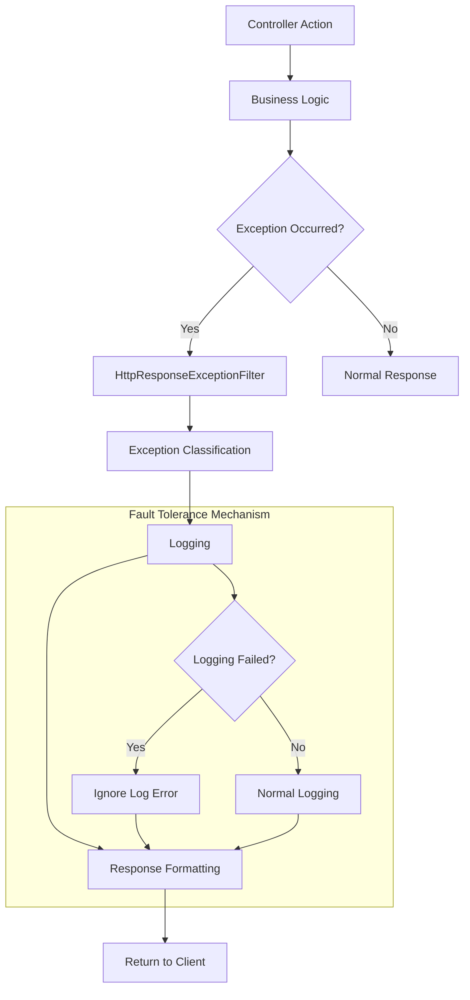

# CodeSpirit Unified Exception Handling Guide

## 📋 Overview

The CodeSpirit framework provides a unified exception handling mechanism, implementing standardized error handling and response formats through the `HttpResponseExceptionFilter` global exception filter. This document details the design principles, usage methods, and Amis API compatibility of exception handling.

**Last Updated**: December 2025  
**Responsible**: Development Team  
**Version**: v1.1.0  
**Framework Version**: CodeSpirit v2.0.0 (.NET 10)

## 🎯 Design Goals

### Core Goals
- **Unified**: Provide consistent error response formats
- **Traceable**: Each error has a unique tracking ID
- **Environment Adaptive**: Display different error details in development and production environments
- **Amis Compatible**: Fully compatible with [Amis API Response Format](https://aisuda.bce.baidu.com/amis/zh-CN/docs/types/api)
- **Extensible**: Support custom exception types and handling logic
- **High Availability**: The exception handler itself has fault tolerance capabilities

### Technical Features
- Based on ASP.NET Core exception filters
- Uses modern C# pattern matching syntax
- Supports structured logging
- Automatic error classification and status code mapping
- Logging fault tolerance mechanism
- 44 unit tests with 100% pass rate

## 🏗️ Architecture Design

### Core Components



### Exception Handling Flow

1. **Exception Capture**: Global filter captures all unhandled exceptions
2. **Exception Classification**: Classify and handle based on exception type
3. **Logging**: Record detailed exception information and request context (with fault tolerance mechanism)
4. **Response Generation**: Generate standardized error responses
5. **Client Return**: Return Amis-compatible response format

## 📊 Exception Classification System

### Business Exception Types

| Exception Type | HTTP Status Code | Error Code | Description | Log Level |
|---------|-----------|---------|------|---------|
| `BusinessException` | 400 | BUSINESS_ERROR | Business logic error | Information |
| `ValidationException` | 422 | VALIDATION_ERROR | Data validation error | Information |
| `AppServiceException` | Dynamic | BUSINESS_ERROR | Application service exception | Information |

### System Exception Types

| Exception Type | HTTP Status Code | Error Code | Description | Log Level |
|---------|-----------|---------|------|---------|
| `ArgumentNullException` | 400 | INVALID_ARGUMENT | Parameter is null | Warning |
| `ArgumentException` | 400 | INVALID_ARGUMENT | Invalid parameter | Warning |
| `UnauthorizedAccessException` | 403 | FORBIDDEN | Insufficient permissions | Warning |
| `FileNotFoundException` | 404 | NOT_FOUND | Resource not found | Warning |
| `KeyNotFoundException` | 404 | NOT_FOUND | Data not found | Warning |
| `NotImplementedException` | 501 | NOT_IMPLEMENTED | Feature not implemented | Error |
| `TimeoutException` | 504 | TIMEOUT | Request timeout | Error |
| `OperationCanceledException` | 499 | CANCELLED | Request cancelled | Information |
| `FormatException` | 400 | FORMAT_ERROR | Data format error | Warning |
| `InvalidOperationException` | 409 | INVALID_OPERATION | Current operation invalid | Error |

### Database Exception Types

| Exception Type | HTTP Status Code | Error Code | Description | Special Handling |
|---------|-----------|---------|------|---------|
| `DBConcurrencyException` | 409 | CONCURRENCY_CONFLICT | Concurrency conflict | - |
| `DbUpdateException` | 409 | DATABASE_ERROR | Database update error | - |
| `DbUpdateException`(Unique Constraint) | 409 | DUPLICATE_DATA | Duplicate data | Intelligently recognizes unique keyword |
| `DbUpdateException`(Foreign Key Constraint) | 409 | REFERENCE_CONSTRAINT | Reference constraint conflict | Intelligently recognizes foreign key keyword |

## 🔧 Response Format Specification

### Amis API Standard Response Format

According to the [Amis API Documentation](https://aisuda.bce.baidu.com/amis/zh-CN/docs/types/api), all API responses follow the following format:

#### Success Response
```json
{
  "status": 0,
  "msg": "",
  "data": {
    // Specific data
  }
}
```

#### Error Response
```json
{
  "status": 400,
  "msg": "Error message",
  "data": null,
  "errors": {
    // Error details (optional)
  },
  "traceId": "trace-id-12345",
  "timestamp": "2025-01-27 10:30:00"
}
```

### Response Field Description

| Field | Type | Required | Description |
|------|------|------|------|
| `status` | number | Yes | HTTP status code, 0 indicates success |
| `msg` | string | Yes | Response message |
| `data` | object | No | Response data, null on error |
| `errors` | object | No | Error details, provided only for validation errors |
| `traceId` | string | Yes | Request tracking ID |
| `timestamp` | string | Yes | Response timestamp (yyyy-MM-dd HH:mm:ss format) |

## 💻 Usage Examples

### 1. Business Exception Handling

```csharp
/// <summary>
/// Get user information
/// </summary>
/// <param name="id">User ID</param>
/// <returns>User information</returns>
public async Task<UserDto> GetUserAsync(long id)
{
    var user = await _userRepository.GetByIdAsync(id);
    if (user == null)
    {
        throw new BusinessException("User does not exist");
    }
    return _mapper.Map<UserDto>(user);
}
```

**Response Example**:
```json
{
  "status": 400,
  "msg": "User does not exist",
  "data": null,
  "traceId": "0HN7GHHM5K3QJ:00000001",
  "timestamp": "2025-01-27 10:30:00"
}
```

### 2. Validation Exception Handling

```csharp
/// <summary>
/// Create user
/// </summary>
/// <param name="dto">User creation DTO</param>
/// <returns>API response</returns>
public async Task<ApiResponse> CreateUserAsync(CreateUserDto dto)
{
    if (string.IsNullOrEmpty(dto.Email))
    {
        throw new ValidationException("Email address cannot be empty");
    }
    
    // Business logic...
    return ApiResponse.Success();
}
```

**Response Example**:
```json
{
  "status": 422,
  "msg": "Email address cannot be empty",
  "data": null,
  "traceId": "0HN7GHHM5K3QJ:00000002",
  "timestamp": "2025-01-27 10:30:00"
}
```

### 3. System Exception Handling

```csharp
/// <summary>
/// Download file
/// </summary>
/// <param name="fileName">File name</param>
/// <returns>File DTO</returns>
public async Task<FileDto> DownloadFileAsync(string fileName)
{
    // If file does not exist, FileNotFoundException will be automatically thrown
    var fileBytes = await File.ReadAllBytesAsync(fileName);
    return new FileDto { Content = fileBytes };
}
```

**Response Example**:
```json
{
  "status": 404,
  "msg": "Requested resource not found",
  "data": null,
  "traceId": "0HN7GHHM5K3QJ:00000003",
  "timestamp": "2025-01-27 10:30:00"
}
```

### 4. Database Exception Intelligent Handling

```csharp
/// <summary>
/// Create user (demonstrating database constraint exception)
/// </summary>
/// <param name="user">User entity</param>
/// <returns>Creation result</returns>
public async Task<User> CreateUserAsync(User user)
{
    try
    {
        await _context.Users.AddAsync(user);
        await _context.SaveChangesAsync();
        return user;
    }
    catch (DbUpdateException ex) when (ex.InnerException?.Message.Contains("UNIQUE") == true)
    {
        // Framework will automatically handle as:
        // status: 409, msg: "Data already exists, cannot add duplicate", errorCode: "DUPLICATE_DATA"
        throw;
    }
}
```

## 🔍 Logging Mechanism

### Log Level Strategy

The exception handler automatically sets appropriate log levels based on exception type:

| Exception Type | Log Level | Description |
|---------|---------|------|
| Parameter exceptions | Warning | Client input errors |
| Permission exceptions | Warning | Access permission issues |
| Business exceptions | Information | Normal business flow |
| System exceptions | Error | System issues requiring attention |

### Log Content

Each exception log contains the following information:

```json
{
  "timestamp": "2025-01-27T10:30:00.123Z",
  "level": "Error",
  "message": "Exception occurred - BusinessException: User does not exist",
  "exception": {
    "type": "BusinessException",
    "message": "User does not exist",
    "stackTrace": "..."
  },
  "requestInfo": {
    "traceId": "0HN7GHHM5K3QJ:00000001",
    "method": "GET",
    "path": "/api/users/123",
    "queryString": "?include=profile",
    "userAgent": "Mozilla/5.0...",
    "remoteIpAddress": "192.168.1.100"
  }
}
```

### Logging Fault Tolerance Mechanism

To ensure high availability of the exception handler, logging uses a fault tolerance mechanism:

```csharp
/// <summary>
/// Log exception information (with fault tolerance mechanism)
/// </summary>
private void LogException(Exception exception, HttpContext httpContext, string traceId)
{
    try
    {
        // Normal logging logic
        var logLevel = GetLogLevel(exception);
        var requestInfo = new { /* Request information */ };
        _logger.Log(logLevel, exception, "Exception occurred - {ExceptionType}: {Message} | Request Info: {@RequestInfo}",
            exception.GetType().Name, exception.Message, requestInfo);
    }
    catch
    {
        // If logging fails, ignore error to avoid affecting exception handling flow
        // This ensures that even if the logging system has issues, the exception handler can still work normally
    }
}
```

## ⚙️ Configuration and Extension

### Register Exception Filter

Automatically registered in `ServiceCollectionExtensions.cs`:

```csharp
/// <summary>
/// Configure default controllers
/// </summary>
/// <param name="services">Service collection</param>
/// <param name="optionsAction">Options configuration</param>
/// <returns>Service collection</returns>
public static IServiceCollection ConfigureDefaultControllers(
    this IServiceCollection services, 
    Action<MvcOptions> optionsAction = null)
{
    services.AddControllers(options =>
    {
        // Globally register exception filter
        options.Filters.Add<HttpResponseExceptionFilter>();
        // Other configurations...
    });
    
    return services;
}
```

### Environment Configuration

The exception filter automatically adjusts behavior based on environment:

- **Development Environment**: Display detailed exception information and stack traces
- **Production Environment**: Only display user-friendly error messages

```csharp
_ => CreateAmisErrorResponse(
    StatusCodes.Status500InternalServerError,
    _environment.IsDevelopment() ? exception.Message : "Internal server error",
    "INTERNAL_ERROR",
    traceId,
    _environment.IsDevelopment() ? exception.StackTrace : null)
```

### Custom Exception Types

Create custom exception types:

```csharp
/// <summary>
/// Custom business exception
/// </summary>
public class CustomBusinessException : BusinessException
{
    /// <summary>
    /// Error code
    /// </summary>
    public string ErrorCode { get; }
    
    /// <summary>
    /// Constructor
    /// </summary>
    /// <param name="errorCode">Error code</param>
    /// <param name="message">Error message</param>
    public CustomBusinessException(string errorCode, string message) 
        : base(message)
    {
        ErrorCode = errorCode;
    }
}
```

Add handling logic in the exception filter:

```csharp
// Add in the switch expression of the OnException method
CustomBusinessException customException => CreateAmisErrorResponse(
    StatusCodes.Status400BadRequest,
    customException.Message,
    customException.ErrorCode,
    traceId),
```

## 🧪 Testing Guide

### Test Coverage

The current test suite contains **44 test cases**, covering the following scenarios:

#### Basic Exception Tests (15)
- BusinessException, ValidationException, AppServiceException
- ArgumentException, UnauthorizedAccessException, FileNotFoundException
- NotImplementedException, TimeoutException, OperationCanceledException
- DBConcurrencyException, DbUpdateException, InvalidOperationException
- FormatException, Generic Exception, KeyNotFoundException

#### Database Exception Special Tests (3)
- Unique constraint conflict
- Foreign key constraint conflict
- General database update exception

#### Environment Adaptation Tests (2)
- Development environment detailed error information
- Production environment generic error information

#### Logging Tests (8)
- Log levels for different exception types
- Request information recording
- Logging fault tolerance mechanism
- Trace ID passing

#### Response Format Tests (6)
- Amis API compatibility
- Timestamp format
- JSON serialization
- Field completeness

#### Performance and Boundary Tests (10)
- Large message handling (10KB)
- Concurrent access (100 concurrent)
- Special character handling
- Null and null handling
- Nested exception handling

### Unit Test Example

```csharp
/// <summary>
/// Test business exception returns correct Amis response
/// </summary>
[Fact]
public void OnException_BusinessException_ReturnsCorrectAmisResponse()
{
    // Arrange
    var filter = new HttpResponseExceptionFilter(_logger, _environment);
    var context = CreateExceptionContext(new BusinessException("Test error"));
    
    // Act
    filter.OnException(context);
    
    // Assert
    var result = context.Result as ObjectResult;
    Assert.That(result.StatusCode, Is.EqualTo(400));
    
    var response = result.Value;
    Assert.That(response.GetProperty("status"), Is.EqualTo(400));
    Assert.That(response.GetProperty("msg"), Is.EqualTo("Test error"));
    Assert.That(response.GetProperty("traceId"), Is.Not.Empty);
}
```

### Performance Test Example

```csharp
/// <summary>
/// Performance test: handling multiple exceptions should be fast
/// </summary>
[Fact]
public void OnException_PerformanceTest_HandlesMultipleExceptionsQuickly()
{
    // Arrange
    var exceptions = new List<Exception>
    {
        new BusinessException("Business exception 1"),
        new ValidationException("Validation exception 1"),
        new ArgumentNullException("Parameter exception 1"),
        new UnauthorizedAccessException("Permission exception 1"),
        new FileNotFoundException("File exception 1")
    };

    var stopwatch = System.Diagnostics.Stopwatch.StartNew();

    // Act
    foreach (var exception in exceptions)
    {
        var context = CreateExceptionContext(exception);
        _filter.OnException(context);
        Assert.True(context.ExceptionHandled);
    }

    stopwatch.Stop();

    // Assert
    Assert.True(stopwatch.ElapsedMilliseconds < 100, 
        $"Processing 5 exceptions took {stopwatch.ElapsedMilliseconds}ms, exceeding expected 100ms");
}
```

### Fault Tolerance Test Example

```csharp
/// <summary>
/// Test that logging failure does not affect exception handling
/// </summary>
[Fact]
public void OnException_LoggerFailure_DoesNotThrow()
{
    // Arrange
    var mockLogger = new Mock<ILogger<HttpResponseExceptionFilter>>();
    mockLogger.Setup(x => x.Log(/* parameters */))
              .Throws(new Exception("Logging failed"));

    var filter = new HttpResponseExceptionFilter(mockLogger.Object, _environment);
    var exception = new BusinessException("Logging failure test");
    var context = CreateExceptionContext(exception);

    // Act & Assert
    var ex = Record.Exception(() => filter.OnException(context));
    Assert.Null(ex); // Even if logging fails, should not throw exception
    Assert.True(context.ExceptionHandled);
}
```

## 📈 Performance Considerations

### Performance Optimization Strategy

1. **Exception Caching**: Cache response templates for common exception types
2. **Async Logging**: Use async logging to avoid blocking requests
3. **Serialization Optimization**: Use high-performance JSON serializers
4. **Memory Management**: Avoid creating large temporary objects in exception handling
5. **Fault Tolerance Design**: Logging failures do not affect the main exception handling flow

### Performance Benchmarks

Performance metrics based on test results:

- **Single Exception Handling**: < 1ms
- **5 Exception Batch Processing**: < 100ms
- **100 Concurrent Exception Handling**: All successful, no deadlocks
- **Large Message Handling**: Supports 10KB+ error messages
- **Memory Usage**: Minimize temporary object creation

### Monitoring Metrics

Recommended monitoring metrics:

- Exception occurrence frequency
- Exception type distribution
- Response time impact
- Memory usage
- Logging success rate

## 🔒 Security Considerations

### Information Leakage Prevention

1. **Sensitive Information Filtering**: Do not display stack traces in production environment
2. **Error Message Standardization**: Avoid exposing internal system information
3. **Log Desensitization**: Filter sensitive data when logging
4. **Environment Differentiation**: Display different levels of error details in development and production environments

### Security Best Practices

```csharp
// ❌ Wrong: May leak sensitive information
throw new Exception($"Database connection failed: {connectionString}");

// ✅ Correct: Use standardized error messages
throw new BusinessException("System temporarily unavailable, please try again later");
```

## 🚀 Best Practices

### 1. Exception Throwing Principles

- **Business Exceptions**: Use `BusinessException` or `ValidationException`
- **Parameter Validation**: Let the framework automatically handle `ArgumentException`
- **Resource Access**: Let the framework automatically handle `FileNotFoundException`, etc.
- **Avoid Generic Exceptions**: Do not directly throw `Exception`

### 2. Error Message Standards

- **User-Friendly**: Error messages should be meaningful to end users
- **Actionable**: Provide solutions users can take
- **Consistent**: Use unified language style and terminology
- **Internationalized**: Support multi-language error messages

### 3. Logging Standards

- **Structured Logging**: Use structured logging format
- **Context Information**: Include sufficient context information for debugging
- **Sensitive Data**: Avoid logging sensitive information
- **Performance Impact**: Avoid complex logging operations in hot paths

### 4. Controller Best Practices

```csharp
/// <summary>
/// User controller
/// </summary>
[ApiController]
[Route("api/[controller]")]
public class UsersController : ControllerBase
{
    /// <summary>
    /// Get user information
    /// </summary>
    /// <param name="id">User ID</param>
    /// <returns>User information</returns>
    [HttpGet("{id}")]
    public async Task<ActionResult<ApiResponse<UserDto>>> GetUser(long id)
    {
        // ✅ Correct: No need for try-catch, let exception filter handle
        var user = await _userService.GetUserAsync(id);
        return ApiResponse<UserDto>.Success(user);
    }
    
    // ❌ Wrong: Do not catch exceptions in controller
    // [HttpGet("{id}")]
    // public async Task<ActionResult<ApiResponse<UserDto>>> GetUser(long id)
    // {
    //     try
    //     {
    //         var user = await _userService.GetUserAsync(id);
    //         return ApiResponse<UserDto>.Success(user);
    //     }
    //     catch (Exception ex)
    //     {
    //         return ApiResponse<UserDto>.Error(500, ex.Message);
    //     }
    // }
}
```

## 🔄 Version History

### v1.1.0 (2025-05-28)
- ✅ Removed obsolete SetServerErrorByException method
- ✅ Fully compatible with Amis API response format
- ✅ Added logging fault tolerance mechanism
- ✅ Created complete test suite (44 test cases)
- ✅ Support for intelligent database exception recognition
- ✅ Optimized performance and concurrent processing

### v1.0.0 (2025-01-27)
- ✅ Initial version release
- ✅ Implemented unified exception handling mechanism
- ✅ Support for Amis API response format
- ✅ Added structured logging
- ✅ Support for environment-specific configuration

## 📚 Related Documentation

- [Amis API Documentation](https://aisuda.bce.baidu.com/amis/zh-CN/docs/types/api)
- [ASP.NET Core Exception Handling](https://docs.microsoft.com/en-us/aspnet/core/fundamentals/error-handling)
- [CodeSpirit.Core Core Framework](./CodeSpirit.Core%20Core%20Framework.md)
- [Project Overall Architecture Design](./Project%20Overall%20Architecture%20Design.md)
- [Overall Technical System Overview](./Overall%20Technical%20System%20Overview.md)
- [Development Environment Setup Guide](./Development%20Environment%20Setup%20Guide.md)

## 🎯 Summary

The CodeSpirit unified exception handling system ensures enterprise-level application stability and maintainability through the following features:

### Core Advantages
1. **Fully Compatible with Amis**: Ensures seamless frontend-backend integration
2. **High Availability Design**: Logging fault tolerance mechanism ensures the stability of the exception handler itself
3. **Intelligent Classification**: Automatically recognizes exception types and provides appropriate responses
4. **Environment Adaptation**: Differentiated handling for development and production environments
5. **Comprehensive Testing**: 44 test cases ensure code quality

### Technical Highlights
- Uses modern C# pattern matching syntax
- Supports intelligent database exception recognition
- Structured logging
- Performance optimization and concurrency safety
- Complete test coverage

### Practical Effects
- **Development Efficiency**: No need to write exception handling code in each controller
- **User Experience**: Unified error response format and friendly error messages
- **Operations Convenience**: Detailed logging and trace ID support
- **System Stability**: Fault tolerance mechanism ensures the exception handler itself does not become a failure point

## 10. Batch Import Exception Handling

### 10.1 Batch Import Exception Types

Exception types that may be encountered during batch import:

```csharp
/// <summary>
/// Batch import exception
/// </summary>
public class BatchImportException : BusinessException
{
    public string ImportId { get; }
    public List<ImportFailedRecord> FailedRecords { get; }

    public BatchImportException(string importId, string message) : base(message)
    {
        ImportId = importId;
        FailedRecords = new List<ImportFailedRecord>();
    }

    public BatchImportException(string importId, string message, List<ImportFailedRecord> failedRecords) 
        : base(message)
    {
        ImportId = importId;
        FailedRecords = failedRecords;
    }
}

/// <summary>
/// Import template generation exception
/// </summary>
public class ImportTemplateException : BusinessException
{
    public string TypeName { get; }

    public ImportTemplateException(string typeName, string message) : base(message)
    {
        TypeName = typeName;
    }
}

/// <summary>
/// Import data validation exception
/// </summary>
public class ImportValidationException : ValidationException
{
    public int RowIndex { get; }
    public object ImportData { get; }

    public ImportValidationException(int rowIndex, object importData, Dictionary<string, string[]> errors) 
        : base(errors)
    {
        RowIndex = rowIndex;
        ImportData = importData;
    }
}
```

### 10.2 Batch Import Exception Handling Strategy

#### 10.2.1 Data Validation Exception Handling

```csharp
public class EnhancedBatchImportHelper<TBatchImportDto>
{
    private async Task<List<ValidationError>> ValidateImportDataAsync(
        List<TBatchImportDto> importData,
        Func<TBatchImportDto, int, Task<List<ValidationError>>>? customValidator)
    {
        var results = new List<ValidationError>();
        
        for (int i = 0; i < importData.Count; i++)
        {
            var item = importData[i];
            
            try
            {
                // DataAnnotations validation
                var validationContext = new ValidationContext(item);
                var validationResults = new List<System.ComponentModel.DataAnnotations.ValidationResult>();
                
                if (!Validator.TryValidateObject(item, validationContext, validationResults, true))
                {
                    foreach (var validationResult in validationResults)
                    {
                        results.Add(new ValidationError
                        {
                            Index = i,
                            ErrorMessage = validationResult.ErrorMessage ?? "Validation failed",
                            ErrorFields = validationResult.MemberNames.ToList()
                        });
                    }
                }
                
                // Custom validation
                if (customValidator != null)
                {
                    var customValidationResults = await customValidator(item, i);
                    results.AddRange(customValidationResults);
                }
            }
            catch (Exception ex)
            {
                _logger.LogError(ex, "Exception occurred while validating row {Index}: {Error}", i + 1, ex.Message);
                
                results.Add(new ValidationError
                {
                    Index = i,
                    ErrorMessage = $"Data validation exception: {ex.Message}",
                    ErrorFields = new List<string>()
                });
            }
        }
        
        return results;
    }
}
```

#### 10.2.2 Import Processing Exception Handling

```csharp
public async Task<BatchImportResultDto> EnhancedBatchImportAsync(
    IEnumerable<TBatchImportDto> importData,
    Func<TBatchImportDto, int, Task<string?>> importProcessor,
    Func<TBatchImportDto, int, Task<List<ValidationError>>>? validator = null)
{
    var importId = Guid.NewGuid().ToString();
    var result = new BatchImportResultDto
    {
        ImportId = importId,
        StartTime = DateTime.UtcNow,
        Status = ImportStatus.Processing
    };

    try
    {
        // Process valid data
        var successCount = 0;
        var failedRecords = new List<ImportFailedRecord>();
        
        foreach (var (dto, index) in validItems)
        {
            try
            {
                var errorMessage = await importProcessor(dto, index);
                if (errorMessage == null)
                {
                    successCount++;
                }
                else
                {
                    failedRecords.Add(new ImportFailedRecord
                    {
                        RowIndex = index + 1,
                        ErrorMessage = errorMessage,
                        Data = dto
                    });
                }
            }
            catch (BusinessException ex)
            {
                _logger.LogWarning(ex, "Business exception importing row {Index}: {Error}", index + 1, ex.Message);
                failedRecords.Add(new ImportFailedRecord
                {
                    RowIndex = index + 1,
                    ErrorMessage = $"Business exception: {ex.Message}",
                    Data = dto
                });
            }
            catch (ValidationException ex)
            {
                _logger.LogWarning(ex, "Validation exception importing row {Index}: {Error}", index + 1, ex.Message);
                failedRecords.Add(new ImportFailedRecord
                {
                    RowIndex = index + 1,
                    ErrorMessage = $"Data validation failed: {ex.Message}",
                    Data = dto,
                    ErrorFields = ex.Errors.Keys.ToList()
                });
            }
            catch (Exception ex)
            {
                _logger.LogError(ex, "Unknown exception occurred importing row {Index}: {Error}", index + 1, ex.Message);
                failedRecords.Add(new ImportFailedRecord
                {
                    RowIndex = index + 1,
                    ErrorMessage = $"System exception: {ex.Message}",
                    Data = dto
                });
            }
        }

        // Update result status
        result.SuccessCount = successCount;
        result.FailedCount = failedRecords.Count;
        result.FailedRecords = failedRecords;
        result.EndTime = DateTime.UtcNow;
        
        // Set status and message based on results
        if (result.FailedCount == 0)
        {
            result.Status = ImportStatus.Success;
            result.Message = $"Successfully imported {result.SuccessCount} records";
        }
        else if (result.SuccessCount > 0)
        {
            result.Status = ImportStatus.PartialSuccess;
            result.Message = $"Successfully imported {result.SuccessCount} records, failed {result.FailedCount} records";
        }
        else
        {
            result.Status = ImportStatus.Failed;
            result.Message = $"Import failed, {result.FailedCount} records have errors";
        }

        return result;
    }
    catch (Exception ex)
    {
        _logger.LogError(ex, "Serious exception occurred during batch import: {Error}", ex.Message);
        
        result.Status = ImportStatus.Failed;
        result.Message = $"Exception occurred during import: {ex.Message}";
        result.EndTime = DateTime.UtcNow;
        
        return result;
    }
}
```

### 10.3 Controller Layer Exception Handling

```csharp
[HttpPost("enhanced-batch-import")]
[DisplayName("Enhanced Batch Import")]
public async Task<ActionResult<ApiResponse<BatchImportResultDto>>> EnhancedBatchImport(
    [FromBody] EnhancedBatchImportDto<StudentBatchImportItemDto> request)
{
    try
    {
        if (request.ImportData == null || !request.ImportData.Any())
        {
            throw new BusinessException("Import data cannot be empty");
        }

        if (request.ImportData.Count > 1000)
        {
            throw new BusinessException("Single import cannot exceed 1000 records");
        }

        var result = await _studentService.EnhancedBatchImportAsync(request.ImportData);
        
        return SuccessResponse(result, "Batch import processing completed");
    }
    catch (BatchImportException ex)
    {
        _logger.LogWarning(ex, "Batch import exception: ImportId={ImportId}, Message={Message}", 
            ex.ImportId, ex.Message);
        return BadResponse<BatchImportResultDto>(ex.Message, 400);
    }
    catch (BusinessException ex)
    {
        return BadResponse<BatchImportResultDto>(ex.Message, ex.ErrorCode);
    }
    // Other exceptions handled by global exception handler
}

[HttpGet("import-result/{importId}")]
[DisplayName("Get Import Result")]
public async Task<ActionResult<ApiResponse<BatchImportResultDto>>> GetImportResult(string importId)
{
    try
    {
        if (string.IsNullOrWhiteSpace(importId))
        {
            throw new BusinessException("Import ID cannot be empty");
        }

        var result = await _studentService.GetImportResultAsync(importId);
        
        if (result == null)
        {
            throw new BusinessException("Import result does not exist or has expired");
        }

        return SuccessResponse(result);
    }
    catch (BusinessException ex)
    {
        return BadResponse<BatchImportResultDto>(ex.Message, ex.ErrorCode);
    }
}

[HttpPost("export-failed-records")]
[DisplayName("Export Failed Records")]
public async Task<ActionResult> ExportFailedRecords([FromBody] ExportFailedRecordsRequest request)
{
    try
    {
        if (request.FailedRecords == null || !request.FailedRecords.Any())
        {
            throw new BusinessException("No failed records to export");
        }

        var fileBytes = await _studentService.ExportFailedRecordsAsync(request.FailedRecords);
        var fileName = $"Import_Failed_Records_{DateTime.Now:yyyyMMddHHmmss}.xlsx";
        
        return DownloadExcelFile(fileBytes, fileName);
    }
    catch (BusinessException ex)
    {
        return BadRequest(new ApiResponse(ex.ErrorCode, ex.Message));
    }
}
```

### 10.4 Best Practices

#### 10.4.1 Exception Classification Handling

1. **Data Validation Exceptions**: Record detailed field error information for user correction
2. **Business Logic Exceptions**: Provide clear business error descriptions
3. **System Exceptions**: Record complete exception stacks, but return friendly error messages to users

#### 10.4.2 Error Recovery Mechanism

1. **Partial Success Processing**: Allow partial data import success, partial failure
2. **Failed Record Export**: Provide detailed information and correction suggestions for failed data
3. **Retry Mechanism**: Support retry import for temporary errors

#### 10.4.3 Performance Considerations

1. **Batch Processing**: Avoid performance issues caused by item-by-item processing
2. **Memory Management**: Pay attention to memory usage during large batch data imports
3. **Async Processing**: Use async processing for long-running import tasks

---

*This document will be continuously updated, please check for the latest version regularly*
