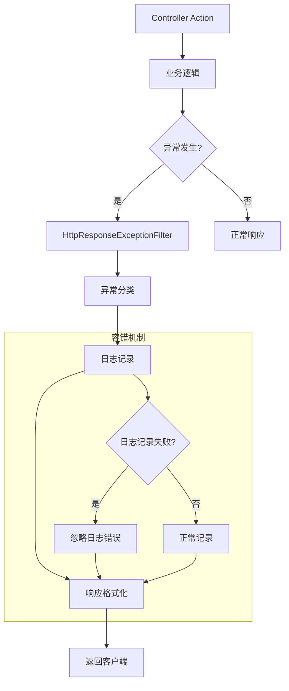

# CodeSpirit 统一异常处理指南

## 📋 概述

CodeSpirit 框架提供了统一的异常处理机制，通过 `HttpResponseExceptionFilter` 全局异常过滤器实现标准化的错误处理和响应格式。本文档详细介绍异常处理的设计原理、使用方法和 Amis API 兼容性。

**最后更新**: 2025年12月  
**负责人**: 开发团队  
**版本**: v1.1.0  
**框架版本**: CodeSpirit v2.0.0 (.NET 10)

## 🎯 设计目标

### 核心目标
- **统一性**: 提供一致的错误响应格式
- **可追踪性**: 每个错误都有唯一的跟踪ID
- **环境适配**: 开发和生产环境显示不同的错误详情
- **Amis兼容**: 完全兼容 [Amis API 响应格式](https://aisuda.bce.baidu.com/amis/zh-CN/docs/types/api)
- **可扩展性**: 支持自定义异常类型和处理逻辑
- **高可用性**: 异常处理器本身具备容错能力

### 技术特性
- 基于 ASP.NET Core 异常过滤器
- 使用现代 C# 模式匹配语法
- 支持结构化日志记录
- 自动错误分类和状态码映射
- 日志记录容错机制
- 44个单元测试覆盖，100%测试通过率

## 🏗️ 架构设计

### 核心组件



### 异常处理流程

1. **异常捕获**: 全局过滤器捕获所有未处理异常
2. **异常分类**: 根据异常类型进行分类处理
3. **日志记录**: 记录详细的异常信息和请求上下文（带容错机制）
4. **响应生成**: 生成标准化的错误响应
5. **客户端返回**: 返回兼容 Amis 的响应格式

## 📊 异常分类体系

### 业务异常类型

| 异常类型 | HTTP状态码 | 错误代码 | 描述 | 日志级别 |
|---------|-----------|---------|------|---------|
| `BusinessException` | 400 | BUSINESS_ERROR | 业务逻辑错误 | Information |
| `ValidationException` | 422 | VALIDATION_ERROR | 数据验证错误 | Information |
| `AppServiceException` | 动态 | BUSINESS_ERROR | 应用服务异常 | Information |

### 系统异常类型

| 异常类型 | HTTP状态码 | 错误代码 | 描述 | 日志级别 |
|---------|-----------|---------|------|---------|
| `ArgumentNullException` | 400 | INVALID_ARGUMENT | 参数为空 | Warning |
| `ArgumentException` | 400 | INVALID_ARGUMENT | 参数无效 | Warning |
| `UnauthorizedAccessException` | 403 | FORBIDDEN | 权限不足 | Warning |
| `FileNotFoundException` | 404 | NOT_FOUND | 资源未找到 | Warning |
| `KeyNotFoundException` | 404 | NOT_FOUND | 数据未找到 | Warning |
| `NotImplementedException` | 501 | NOT_IMPLEMENTED | 功能未实现 | Error |
| `TimeoutException` | 504 | TIMEOUT | 请求超时 | Error |
| `OperationCanceledException` | 499 | CANCELLED | 请求取消 | Information |
| `FormatException` | 400 | FORMAT_ERROR | 数据格式错误 | Warning |
| `InvalidOperationException` | 409 | INVALID_OPERATION | 当前操作无效 | Error |

### 数据库异常类型

| 异常类型 | HTTP状态码 | 错误代码 | 描述 | 特殊处理 |
|---------|-----------|---------|------|---------|
| `DBConcurrencyException` | 409 | CONCURRENCY_CONFLICT | 并发冲突 | - |
| `DbUpdateException` | 409 | DATABASE_ERROR | 数据库更新错误 | - |
| `DbUpdateException`(唯一约束) | 409 | DUPLICATE_DATA | 数据重复 | 智能识别unique关键字 |
| `DbUpdateException`(外键约束) | 409 | REFERENCE_CONSTRAINT | 关联约束冲突 | 智能识别foreign key关键字 |

## 🔧 响应格式规范

### Amis API 标准响应格式

根据 [Amis API 文档](https://aisuda.bce.baidu.com/amis/zh-CN/docs/types/api)，所有 API 响应都遵循以下格式：

#### 成功响应
```json
{
  "status": 0,
  "msg": "",
  "data": {
    // 具体数据
  }
}
```

#### 错误响应
```json
{
  "status": 400,
  "msg": "错误消息",
  "data": null,
  "errors": {
    // 错误详情（可选）
  },
  "traceId": "trace-id-12345",
  "timestamp": "2025-01-27 10:30:00"
}
```

### 响应字段说明

| 字段 | 类型 | 必填 | 描述 |
|------|------|------|------|
| `status` | number | 是 | HTTP状态码，0表示成功 |
| `msg` | string | 是 | 响应消息 |
| `data` | object | 否 | 响应数据，错误时为null |
| `errors` | object | 否 | 错误详情，仅在验证错误时提供 |
| `traceId` | string | 是 | 请求跟踪ID |
| `timestamp` | string | 是 | 响应时间戳（yyyy-MM-dd HH:mm:ss格式） |

## 💻 使用示例

### 1. 业务异常处理

```csharp
/// <summary>
/// 获取用户信息
/// </summary>
/// <param name="id">用户ID</param>
/// <returns>用户信息</returns>
public async Task<UserDto> GetUserAsync(long id)
{
    var user = await _userRepository.GetByIdAsync(id);
    if (user == null)
    {
        throw new BusinessException("用户不存在");
    }
    return _mapper.Map<UserDto>(user);
}
```

**响应示例**:
```json
{
  "status": 400,
  "msg": "用户不存在",
  "data": null,
  "traceId": "0HN7GHHM5K3QJ:00000001",
  "timestamp": "2025-01-27 10:30:00"
}
```

### 2. 验证异常处理

```csharp
/// <summary>
/// 创建用户
/// </summary>
/// <param name="dto">用户创建DTO</param>
/// <returns>API响应</returns>
public async Task<ApiResponse> CreateUserAsync(CreateUserDto dto)
{
    if (string.IsNullOrEmpty(dto.Email))
    {
        throw new ValidationException("邮箱地址不能为空");
    }
    
    // 业务逻辑...
    return ApiResponse.Success();
}
```

**响应示例**:
```json
{
  "status": 422,
  "msg": "邮箱地址不能为空",
  "data": null,
  "traceId": "0HN7GHHM5K3QJ:00000002",
  "timestamp": "2025-01-27 10:30:00"
}
```

### 3. 系统异常处理

```csharp
/// <summary>
/// 下载文件
/// </summary>
/// <param name="fileName">文件名</param>
/// <returns>文件DTO</returns>
public async Task<FileDto> DownloadFileAsync(string fileName)
{
    // 如果文件不存在，会自动抛出 FileNotFoundException
    var fileBytes = await File.ReadAllBytesAsync(fileName);
    return new FileDto { Content = fileBytes };
}
```

**响应示例**:
```json
{
  "status": 404,
  "msg": "请求的资源未找到",
  "data": null,
  "traceId": "0HN7GHHM5K3QJ:00000003",
  "timestamp": "2025-01-27 10:30:00"
}
```

### 4. 数据库异常智能处理

```csharp
/// <summary>
/// 创建用户（演示数据库约束异常）
/// </summary>
/// <param name="user">用户实体</param>
/// <returns>创建结果</returns>
public async Task<User> CreateUserAsync(User user)
{
    try
    {
        await _context.Users.AddAsync(user);
        await _context.SaveChangesAsync();
        return user;
    }
    catch (DbUpdateException ex) when (ex.InnerException?.Message.Contains("UNIQUE") == true)
    {
        // 框架会自动处理为：
        // status: 409, msg: "数据已存在，不能重复添加", errorCode: "DUPLICATE_DATA"
        throw;
    }
}
```

## 🔍 日志记录机制

### 日志级别策略

异常处理器根据异常类型自动设置合适的日志级别：

| 异常类型 | 日志级别 | 说明 |
|---------|---------|------|
| 参数异常 | Warning | 客户端输入错误 |
| 权限异常 | Warning | 访问权限问题 |
| 业务异常 | Information | 正常业务流程 |
| 系统异常 | Error | 需要关注的系统问题 |

### 日志内容

每条异常日志包含以下信息：

```json
{
  "timestamp": "2025-01-27T10:30:00.123Z",
  "level": "Error",
  "message": "异常发生 - BusinessException: 用户不存在",
  "exception": {
    "type": "BusinessException",
    "message": "用户不存在",
    "stackTrace": "..."
  },
  "requestInfo": {
    "traceId": "0HN7GHHM5K3QJ:00000001",
    "method": "GET",
    "path": "/api/users/123",
    "queryString": "?include=profile",
    "userAgent": "Mozilla/5.0...",
    "remoteIpAddress": "192.168.1.100"
  }
}
```

### 日志容错机制

为确保异常处理器的高可用性，日志记录采用了容错机制：

```csharp
/// <summary>
/// 记录异常信息（带容错机制）
/// </summary>
private void LogException(Exception exception, HttpContext httpContext, string traceId)
{
    try
    {
        // 正常日志记录逻辑
        var logLevel = GetLogLevel(exception);
        var requestInfo = new { /* 请求信息 */ };
        _logger.Log(logLevel, exception, "异常发生 - {ExceptionType}: {Message} | 请求信息: {@RequestInfo}",
            exception.GetType().Name, exception.Message, requestInfo);
    }
    catch
    {
        // 如果日志记录失败，忽略错误，避免影响异常处理流程
        // 这确保即使日志系统出现问题，异常处理器仍能正常工作
    }
}
```

## ⚙️ 配置和扩展

### 注册异常过滤器

在 `ServiceCollectionExtensions.cs` 中自动注册：

```csharp
/// <summary>
/// 配置默认控制器
/// </summary>
/// <param name="services">服务集合</param>
/// <param name="optionsAction">选项配置</param>
/// <returns>服务集合</returns>
public static IServiceCollection ConfigureDefaultControllers(
    this IServiceCollection services, 
    Action<MvcOptions> optionsAction = null)
{
    services.AddControllers(options =>
    {
        // 全局注册异常过滤器
        options.Filters.Add<HttpResponseExceptionFilter>();
        // 其他配置...
    });
    
    return services;
}
```

### 环境配置

异常过滤器会根据环境自动调整行为：

- **开发环境**: 显示详细的异常信息和堆栈跟踪
- **生产环境**: 只显示用户友好的错误消息

```csharp
_ => CreateAmisErrorResponse(
    StatusCodes.Status500InternalServerError,
    _environment.IsDevelopment() ? exception.Message : "服务器内部错误",
    "INTERNAL_ERROR",
    traceId,
    _environment.IsDevelopment() ? exception.StackTrace : null)
```

### 自定义异常类型

创建自定义异常类型：

```csharp
/// <summary>
/// 自定义业务异常
/// </summary>
public class CustomBusinessException : BusinessException
{
    /// <summary>
    /// 错误代码
    /// </summary>
    public string ErrorCode { get; }
    
    /// <summary>
    /// 构造函数
    /// </summary>
    /// <param name="errorCode">错误代码</param>
    /// <param name="message">错误消息</param>
    public CustomBusinessException(string errorCode, string message) 
        : base(message)
    {
        ErrorCode = errorCode;
    }
}
```

在异常过滤器中添加处理逻辑：

```csharp
// 在 OnException 方法的 switch 表达式中添加
CustomBusinessException customException => CreateAmisErrorResponse(
    StatusCodes.Status400BadRequest,
    customException.Message,
    customException.ErrorCode,
    traceId),
```

## 🧪 测试指南

### 测试覆盖情况

当前测试套件包含 **44个测试用例**，覆盖以下场景：

#### 基础异常测试（15个）
- BusinessException、ValidationException、AppServiceException
- ArgumentException、UnauthorizedAccessException、FileNotFoundException
- NotImplementedException、TimeoutException、OperationCanceledException
- DBConcurrencyException、DbUpdateException、InvalidOperationException
- FormatException、通用Exception、KeyNotFoundException

#### 数据库异常专项测试（3个）
- 唯一约束冲突
- 外键约束冲突
- 一般数据库更新异常

#### 环境适配测试（2个）
- 开发环境详细错误信息
- 生产环境通用错误信息

#### 日志记录测试（8个）
- 不同异常类型的日志级别
- 请求信息记录
- 日志记录容错机制
- 跟踪ID传递

#### 响应格式测试（6个）
- Amis API 兼容性
- 时间戳格式
- JSON序列化
- 字段完整性

#### 性能和边界测试（10个）
- 大消息处理（10KB）
- 并发访问（100个并发）
- 特殊字符处理
- 空值和null处理
- 嵌套异常处理

### 单元测试示例

```csharp
/// <summary>
/// 测试业务异常返回正确的Amis响应
/// </summary>
[Fact]
public void OnException_BusinessException_ReturnsCorrectAmisResponse()
{
    // Arrange
    var filter = new HttpResponseExceptionFilter(_logger, _environment);
    var context = CreateExceptionContext(new BusinessException("测试错误"));
    
    // Act
    filter.OnException(context);
    
    // Assert
    var result = context.Result as ObjectResult;
    Assert.That(result.StatusCode, Is.EqualTo(400));
    
    var response = result.Value;
    Assert.That(response.GetProperty("status"), Is.EqualTo(400));
    Assert.That(response.GetProperty("msg"), Is.EqualTo("测试错误"));
    Assert.That(response.GetProperty("traceId"), Is.Not.Empty);
}
```

### 性能测试示例

```csharp
/// <summary>
/// 性能测试：处理多个异常应该很快
/// </summary>
[Fact]
public void OnException_PerformanceTest_HandlesMultipleExceptionsQuickly()
{
    // Arrange
    var exceptions = new List<Exception>
    {
        new BusinessException("业务异常1"),
        new ValidationException("验证异常1"),
        new ArgumentNullException("参数异常1"),
        new UnauthorizedAccessException("权限异常1"),
        new FileNotFoundException("文件异常1")
    };

    var stopwatch = System.Diagnostics.Stopwatch.StartNew();

    // Act
    foreach (var exception in exceptions)
    {
        var context = CreateExceptionContext(exception);
        _filter.OnException(context);
        Assert.True(context.ExceptionHandled);
    }

    stopwatch.Stop();

    // Assert
    Assert.True(stopwatch.ElapsedMilliseconds < 100, 
        $"处理5个异常耗时 {stopwatch.ElapsedMilliseconds}ms，超过预期的100ms");
}
```

### 容错测试示例

```csharp
/// <summary>
/// 测试日志记录失败时不影响异常处理
/// </summary>
[Fact]
public void OnException_LoggerFailure_DoesNotThrow()
{
    // Arrange
    var mockLogger = new Mock<ILogger<HttpResponseExceptionFilter>>();
    mockLogger.Setup(x => x.Log(/* 参数 */))
              .Throws(new Exception("日志记录失败"));

    var filter = new HttpResponseExceptionFilter(mockLogger.Object, _environment);
    var exception = new BusinessException("日志失败测试");
    var context = CreateExceptionContext(exception);

    // Act & Assert
    var ex = Record.Exception(() => filter.OnException(context));
    Assert.Null(ex); // 即使日志记录失败，也不应该抛出异常
    Assert.True(context.ExceptionHandled);
}
```

## 📈 性能考虑

### 性能优化策略

1. **异常缓存**: 对于常见异常类型，缓存响应模板
2. **日志异步**: 使用异步日志记录避免阻塞请求
3. **序列化优化**: 使用高性能的 JSON 序列化器
4. **内存管理**: 避免在异常处理中创建大量临时对象
5. **容错设计**: 日志记录失败不影响异常处理主流程

### 性能基准

基于测试结果的性能指标：

- **单个异常处理**: < 1ms
- **5个异常批量处理**: < 100ms
- **100个并发异常处理**: 全部成功，无死锁
- **大消息处理**: 支持10KB+错误消息
- **内存占用**: 最小化临时对象创建

### 监控指标

建议监控以下指标：

- 异常发生频率
- 异常类型分布
- 响应时间影响
- 内存使用情况
- 日志记录成功率

## 🔒 安全考虑

### 信息泄露防护

1. **敏感信息过滤**: 生产环境不显示堆栈跟踪
2. **错误消息标准化**: 避免暴露系统内部信息
3. **日志脱敏**: 记录日志时过滤敏感数据
4. **环境差异化**: 开发和生产环境显示不同级别的错误详情

### 安全最佳实践

```csharp
// ❌ 错误：可能泄露敏感信息
throw new Exception($"数据库连接失败: {connectionString}");

// ✅ 正确：使用标准化错误消息
throw new BusinessException("系统暂时不可用，请稍后重试");
```

## 🚀 最佳实践

### 1. 异常抛出原则

- **业务异常**: 使用 `BusinessException` 或 `ValidationException`
- **参数验证**: 让框架自动处理 `ArgumentException`
- **资源访问**: 让框架自动处理 `FileNotFoundException` 等
- **避免通用异常**: 不要直接抛出 `Exception`

### 2. 错误消息规范

- **用户友好**: 错误消息应该对最终用户有意义
- **可操作**: 提供用户可以采取的解决方案
- **一致性**: 使用统一的语言风格和术语
- **国际化**: 支持多语言错误消息

### 3. 日志记录规范

- **结构化日志**: 使用结构化日志格式
- **上下文信息**: 包含足够的上下文信息用于调试
- **敏感数据**: 避免记录敏感信息
- **性能影响**: 避免在热路径中进行复杂的日志操作

### 4. 控制器最佳实践

```csharp
/// <summary>
/// 用户控制器
/// </summary>
[ApiController]
[Route("api/[controller]")]
public class UsersController : ControllerBase
{
    /// <summary>
    /// 获取用户信息
    /// </summary>
    /// <param name="id">用户ID</param>
    /// <returns>用户信息</returns>
    [HttpGet("{id}")]
    public async Task<ActionResult<ApiResponse<UserDto>>> GetUser(long id)
    {
        // ✅ 正确：不需要try-catch，让异常过滤器处理
        var user = await _userService.GetUserAsync(id);
        return ApiResponse<UserDto>.Success(user);
    }
    
    // ❌ 错误：不要在控制器中捕获异常
    // [HttpGet("{id}")]
    // public async Task<ActionResult<ApiResponse<UserDto>>> GetUser(long id)
    // {
    //     try
    //     {
    //         var user = await _userService.GetUserAsync(id);
    //         return ApiResponse<UserDto>.Success(user);
    //     }
    //     catch (Exception ex)
    //     {
    //         return ApiResponse<UserDto>.Error(500, ex.Message);
    //     }
    // }
}
```

## 🔄 版本历史

### v1.1.0 (2025-05-28)
- ✅ 移除过时的 SetServerErrorByException 方法
- ✅ 完全兼容 Amis API 响应格式
- ✅ 添加日志记录容错机制
- ✅ 创建完整的测试套件（44个测试用例）
- ✅ 支持数据库异常智能识别
- ✅ 优化性能和并发处理

### v1.0.0 (2025-01-27)
- ✅ 初始版本发布
- ✅ 实现统一异常处理机制
- ✅ 支持 Amis API 响应格式
- ✅ 添加结构化日志记录
- ✅ 支持环境差异化配置

## 📚 相关文档

- [Amis API 文档](https://aisuda.bce.baidu.com/amis/zh-CN/docs/types/api)
- [ASP.NET Core 异常处理](https://docs.microsoft.com/en-us/aspnet/core/fundamentals/error-handling)
- [CodeSpirit.Core 核心框架](./04-codespirit-core-framework-zh-CN.md)
- [项目整体架构设计](./01-project-architecture-zh-CN.md)
- [总体技术体系说明](./02-technical-system-overview-zh-CN.md)
- [开发环境搭建指南](./03-development-environment-setup-zh-CN.md)

## 🎯 总结

CodeSpirit 统一异常处理系统通过以下特性确保了企业级应用的稳定性和可维护性：

### 核心优势
1. **完全兼容 Amis**: 确保前后端无缝集成
2. **高可用设计**: 日志容错机制保证异常处理器本身的稳定性
3. **智能分类**: 自动识别异常类型并提供合适的响应
4. **环境适配**: 开发和生产环境的差异化处理
5. **全面测试**: 44个测试用例确保代码质量

### 技术亮点
- 使用现代 C# 模式匹配语法
- 支持数据库异常智能识别
- 结构化日志记录
- 性能优化和并发安全
- 完整的测试覆盖

### 实际效果
- **开发效率**: 无需在每个控制器中编写异常处理代码
- **用户体验**: 统一的错误响应格式和友好的错误消息
- **运维便利**: 详细的日志记录和跟踪ID支持
- **系统稳定**: 容错机制确保异常处理器本身不会成为故障点

## 10. 批量导入异常处理

### 10.1 批量导入异常类型

批量导入过程中可能遇到的异常类型：

```csharp
/// <summary>
/// 批量导入异常
/// </summary>
public class BatchImportException : BusinessException
{
    public string ImportId { get; }
    public List<ImportFailedRecord> FailedRecords { get; }

    public BatchImportException(string importId, string message) : base(message)
    {
        ImportId = importId;
        FailedRecords = new List<ImportFailedRecord>();
    }

    public BatchImportException(string importId, string message, List<ImportFailedRecord> failedRecords) 
        : base(message)
    {
        ImportId = importId;
        FailedRecords = failedRecords;
    }
}

/// <summary>
/// 导入模板生成异常
/// </summary>
public class ImportTemplateException : BusinessException
{
    public string TypeName { get; }

    public ImportTemplateException(string typeName, string message) : base(message)
    {
        TypeName = typeName;
    }
}

/// <summary>
/// 导入数据验证异常
/// </summary>
public class ImportValidationException : ValidationException
{
    public int RowIndex { get; }
    public object ImportData { get; }

    public ImportValidationException(int rowIndex, object importData, Dictionary<string, string[]> errors) 
        : base(errors)
    {
        RowIndex = rowIndex;
        ImportData = importData;
    }
}
```

### 10.2 批量导入异常处理策略

#### 10.2.1 数据验证异常处理

```csharp
public class EnhancedBatchImportHelper<TBatchImportDto>
{
    private async Task<List<ValidationError>> ValidateImportDataAsync(
        List<TBatchImportDto> importData,
        Func<TBatchImportDto, int, Task<List<ValidationError>>>? customValidator)
    {
        var results = new List<ValidationError>();
        
        for (int i = 0; i < importData.Count; i++)
        {
            var item = importData[i];
            
            try
            {
                // DataAnnotations验证
                var validationContext = new ValidationContext(item);
                var validationResults = new List<System.ComponentModel.DataAnnotations.ValidationResult>();
                
                if (!Validator.TryValidateObject(item, validationContext, validationResults, true))
                {
                    foreach (var validationResult in validationResults)
                    {
                        results.Add(new ValidationError
                        {
                            Index = i,
                            ErrorMessage = validationResult.ErrorMessage ?? "验证失败",
                            ErrorFields = validationResult.MemberNames.ToList()
                        });
                    }
                }
                
                // 自定义验证
                if (customValidator != null)
                {
                    var customValidationResults = await customValidator(item, i);
                    results.AddRange(customValidationResults);
                }
            }
            catch (Exception ex)
            {
                _logger.LogError(ex, "验证第{Index}行数据时发生异常: {Error}", i + 1, ex.Message);
                
                results.Add(new ValidationError
                {
                    Index = i,
                    ErrorMessage = $"数据验证异常：{ex.Message}",
                    ErrorFields = new List<string>()
                });
            }
        }
        
        return results;
    }
}
```

#### 10.2.2 导入处理异常处理

```csharp
public async Task<BatchImportResultDto> EnhancedBatchImportAsync(
    IEnumerable<TBatchImportDto> importData,
    Func<TBatchImportDto, int, Task<string?>> importProcessor,
    Func<TBatchImportDto, int, Task<List<ValidationError>>>? validator = null)
{
    var importId = Guid.NewGuid().ToString();
    var result = new BatchImportResultDto
    {
        ImportId = importId,
        StartTime = DateTime.UtcNow,
        Status = ImportStatus.Processing
    };

    try
    {
        // 处理有效数据
        var successCount = 0;
        var failedRecords = new List<ImportFailedRecord>();
        
        foreach (var (dto, index) in validItems)
        {
            try
            {
                var errorMessage = await importProcessor(dto, index);
                if (errorMessage == null)
                {
                    successCount++;
                }
                else
                {
                    failedRecords.Add(new ImportFailedRecord
                    {
                        RowIndex = index + 1,
                        ErrorMessage = errorMessage,
                        Data = dto
                    });
                }
            }
            catch (BusinessException ex)
            {
                _logger.LogWarning(ex, "导入第{Index}行数据业务异常: {Error}", index + 1, ex.Message);
                failedRecords.Add(new ImportFailedRecord
                {
                    RowIndex = index + 1,
                    ErrorMessage = $"业务异常：{ex.Message}",
                    Data = dto
                });
            }
            catch (ValidationException ex)
            {
                _logger.LogWarning(ex, "导入第{Index}行数据验证异常: {Error}", index + 1, ex.Message);
                failedRecords.Add(new ImportFailedRecord
                {
                    RowIndex = index + 1,
                    ErrorMessage = $"数据验证失败：{ex.Message}",
                    Data = dto,
                    ErrorFields = ex.Errors.Keys.ToList()
                });
            }
            catch (Exception ex)
            {
                _logger.LogError(ex, "导入第{Index}行数据时发生未知异常: {Error}", index + 1, ex.Message);
                failedRecords.Add(new ImportFailedRecord
                {
                    RowIndex = index + 1,
                    ErrorMessage = $"系统异常：{ex.Message}",
                    Data = dto
                });
            }
        }

        // 更新结果状态
        result.SuccessCount = successCount;
        result.FailedCount = failedRecords.Count;
        result.FailedRecords = failedRecords;
        result.EndTime = DateTime.UtcNow;
        
        // 根据结果设置状态和消息
        if (result.FailedCount == 0)
        {
            result.Status = ImportStatus.Success;
            result.Message = $"成功导入 {result.SuccessCount} 条记录";
        }
        else if (result.SuccessCount > 0)
        {
            result.Status = ImportStatus.PartialSuccess;
            result.Message = $"成功导入 {result.SuccessCount} 条记录，失败 {result.FailedCount} 条记录";
        }
        else
        {
            result.Status = ImportStatus.Failed;
            result.Message = $"导入失败，共 {result.FailedCount} 条记录存在错误";
        }

        return result;
    }
    catch (Exception ex)
    {
        _logger.LogError(ex, "批量导入过程中发生严重异常: {Error}", ex.Message);
        
        result.Status = ImportStatus.Failed;
        result.Message = $"导入过程中发生异常：{ex.Message}";
        result.EndTime = DateTime.UtcNow;
        
        return result;
    }
}
```

### 10.3 控制器层异常处理

```csharp
[HttpPost("enhanced-batch-import")]
[DisplayName("增强批量导入")]
public async Task<ActionResult<ApiResponse<BatchImportResultDto>>> EnhancedBatchImport(
    [FromBody] EnhancedBatchImportDto<StudentBatchImportItemDto> request)
{
    try
    {
        if (request.ImportData == null || !request.ImportData.Any())
        {
            throw new BusinessException("导入数据不能为空");
        }

        if (request.ImportData.Count > 1000)
        {
            throw new BusinessException("单次导入数据不能超过1000条");
        }

        var result = await _studentService.EnhancedBatchImportAsync(request.ImportData);
        
        return SuccessResponse(result, "批量导入处理完成");
    }
    catch (BatchImportException ex)
    {
        _logger.LogWarning(ex, "批量导入异常: ImportId={ImportId}, Message={Message}", 
            ex.ImportId, ex.Message);
        return BadResponse<BatchImportResultDto>(ex.Message, 400);
    }
    catch (BusinessException ex)
    {
        return BadResponse<BatchImportResultDto>(ex.Message, ex.ErrorCode);
    }
    // 其他异常由全局异常处理器处理
}

[HttpGet("import-result/{importId}")]
[DisplayName("获取导入结果")]
public async Task<ActionResult<ApiResponse<BatchImportResultDto>>> GetImportResult(string importId)
{
    try
    {
        if (string.IsNullOrWhiteSpace(importId))
        {
            throw new BusinessException("导入ID不能为空");
        }

        var result = await _studentService.GetImportResultAsync(importId);
        
        if (result == null)
        {
            throw new BusinessException("导入结果不存在或已过期");
        }

        return SuccessResponse(result);
    }
    catch (BusinessException ex)
    {
        return BadResponse<BatchImportResultDto>(ex.Message, ex.ErrorCode);
    }
}

[HttpPost("export-failed-records")]
[DisplayName("导出失败记录")]
public async Task<ActionResult> ExportFailedRecords([FromBody] ExportFailedRecordsRequest request)
{
    try
    {
        if (request.FailedRecords == null || !request.FailedRecords.Any())
        {
            throw new BusinessException("没有失败记录可导出");
        }

        var fileBytes = await _studentService.ExportFailedRecordsAsync(request.FailedRecords);
        var fileName = $"导入失败记录_{DateTime.Now:yyyyMMddHHmmss}.xlsx";
        
        return DownloadExcelFile(fileBytes, fileName);
    }
    catch (BusinessException ex)
    {
        return BadRequest(new ApiResponse(ex.ErrorCode, ex.Message));
    }
}
```

### 10.4 最佳实践

#### 10.4.1 异常分类处理

1. **数据验证异常**: 记录详细的字段错误信息，便于用户修正
2. **业务逻辑异常**: 提供清晰的业务错误描述
3. **系统异常**: 记录完整的异常堆栈，但向用户返回友好的错误消息

#### 10.4.2 错误恢复机制

1. **部分成功处理**: 允许部分数据导入成功，部分失败
2. **失败记录导出**: 提供失败数据的详细信息和修正建议
3. **重试机制**: 对于临时性错误，支持重试导入

#### 10.4.3 性能考虑

1. **批量处理**: 避免逐条处理导致的性能问题
2. **内存管理**: 大批量数据导入时注意内存使用
3. **异步处理**: 长时间运行的导入任务使用异步处理

---

*本文档将持续更新，请定期查看最新版本* 