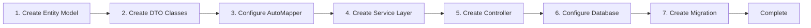

# CodeSpirit CRUD Development Complete Guide

## Overview

This document demonstrates how to quickly develop CRUD functionality using the CodeSpirit framework through actual code examples of **Employee Management** (Employee). This example comes from the identity authentication system (IdentityApi) and is a standard relational CRUD module with complete validation logic, business processing, and relationship management.

**Last Updated**: December 22, 2025  
**Framework Version**: v2.0.0  
**Example Source**: `CodeSpirit.IdentityApi` - Employee Management Module

## Development Process Overview



## Example Module Description

**Employee Management** (Employee) is a typical relational CRUD module with the following features:

- ✅ Relationship management (department, user account)
- ✅ Complete CRUD operations
- ✅ Business validation (employee number uniqueness, department existence, ID card format, etc.)
- ✅ Multi-condition queries (keywords, department, status, date range, etc.)
- ✅ Form grouping display (basic info, contact info, work info, etc.)
- ✅ Multi-tenant support
- ✅ Automatic audit field recording
- ✅ Soft delete support

## 1. Create Entity Model

Create entity class in `Data/Models` directory:

```csharp
// Data/Models/Employee.cs
using CodeSpirit.Shared.Entities.Interfaces;
using CodeSpirit.MultiTenant.Abstractions;
using System.ComponentModel.DataAnnotations;

namespace CodeSpirit.IdentityApi.Data.Models;

/// <summary>
/// Employee information
/// </summary>
public class Employee : IFullAuditable, IMultiTenant, IIsActive
{
    /// <summary>
    /// Employee ID
    /// </summary>
    public long Id { get; set; }

    /// <summary>
    /// Tenant ID (multi-tenant support)
    /// </summary>
    [Required]
    [MaxLength(50)]
    public string TenantId { get; set; } = string.Empty;

    /// <summary>
    /// Employee number (unique within tenant)
    /// </summary>
    [Required]
    [MaxLength(50)]
    public string EmployeeNo { get; set; } = string.Empty;

    /// <summary>
    /// Name
    /// </summary>
    [Required]
    [MaxLength(100)]
    public string Name { get; set; } = string.Empty;

    /// <summary>
    /// Gender
    /// </summary>
    public Gender Gender { get; set; }

    /// <summary>
    /// ID card number
    /// </summary>
    [MaxLength(18)]
    public string? IdNo { get; set; }

    /// <summary>
    /// Birth date
    /// </summary>
    public DateTime? BirthDate { get; set; }

    /// <summary>
    /// Phone number
    /// </summary>
    [MaxLength(15)]
    public string? PhoneNumber { get; set; }

    /// <summary>
    /// Email
    /// </summary>
    [MaxLength(100)]
    [EmailAddress]
    public string? Email { get; set; }

    /// <summary>
    /// Department ID
    /// </summary>
    public long? DepartmentId { get; set; }

    /// <summary>
    /// Department (navigation property)
    /// </summary>
    public Department? Department { get; set; }

    /// <summary>
    /// Position
    /// </summary>
    [MaxLength(100)]
    public string? Position { get; set; }

    /// <summary>
    /// Job level
    /// </summary>
    [MaxLength(50)]
    public string? JobLevel { get; set; }

    /// <summary>
    /// Hire date
    /// </summary>
    public DateTime? HireDate { get; set; }

    /// <summary>
    /// Termination date
    /// </summary>
    public DateTime? TerminationDate { get; set; }

    /// <summary>
    /// Employment status
    /// </summary>
    public EmploymentStatus EmploymentStatus { get; set; }

    /// <summary>
    /// Associated user ID
    /// </summary>
    public long? UserId { get; set; }

    /// <summary>
    /// Associated user account (navigation property)
    /// </summary>
    public ApplicationUser? User { get; set; }

    /// <summary>
    /// Emergency contact
    /// </summary>
    [MaxLength(100)]
    public string? EmergencyContact { get; set; }

    /// <summary>
    /// Emergency phone
    /// </summary>
    [MaxLength(15)]
    public string? EmergencyPhone { get; set; }

    /// <summary>
    /// Address
    /// </summary>
    [MaxLength(500)]
    public string? Address { get; set; }

    /// <summary>
    /// Remarks
    /// </summary>
    [MaxLength(1000)]
    public string? Remarks { get; set; }

    /// <summary>
    /// Is active
    /// </summary>
    public bool IsActive { get; set; } = true;

    /// <summary>
    /// Avatar URL
    /// </summary>
    [MaxLength(255)]
    [DataType(DataType.ImageUrl)]
    public string? AvatarUrl { get; set; }

    // Audit fields (implements IFullAuditable interface)
    public long CreatedBy { get; set; }
    public DateTime CreatedAt { get; set; }
    public long? UpdatedBy { get; set; }
    public DateTime? UpdatedAt { get; set; }
    public long? DeletedBy { get; set; }
    public DateTime? DeletedAt { get; set; }
    public bool IsDeleted { get; set; }
}
```

**Notes**:
- Implements `IFullAuditable` interface, automatically includes complete audit fields (create, update, delete)
- Implements `IMultiTenant` interface, supports multi-tenant data isolation
- Implements `IIsActive` interface, supports activation status management
- Uses `long` as primary key type
- Contains relationship navigation properties (department, user account)
- Supports soft delete (`IsDeleted` field)

## 2. Create DTO Classes

Create DTO classes in `Dtos/Employee` directory:

### 2.1 EmployeeDto (Display DTO)

```csharp
// Dtos/Employee/EmployeeDto.cs
using CodeSpirit.Amis.Attributes.Columns;
using CodeSpirit.Core.Attributes;
using CodeSpirit.IdentityApi.Data.Models;
using System.ComponentModel;

namespace CodeSpirit.IdentityApi.Dtos.Employee;

/// <summary>
/// Employee data transfer object
/// </summary>
public class EmployeeDto
{
    /// <summary>
    /// Employee ID
    /// </summary>
    public long Id { get; set; }

    /// <summary>
    /// Employee number
    /// </summary>
    [DisplayName("Employee No")]
    public string EmployeeNo { get; set; } = string.Empty;

    /// <summary>
    /// Name
    /// </summary>
    [DisplayName("Name")]
    [TplColumn(template: "${name}")]
    public string Name { get; set; } = string.Empty;

    /// <summary>
    /// Avatar URL
    /// </summary>
    [DisplayName("Avatar")]
    [AvatarColumn(Text = "${name}", Src = "${avatarUrl}")]
    [Badge(Animation = true, VisibleOn = "isActive", Level = "info")]
    public string? AvatarUrl { get; set; }

    /// <summary>
    /// Gender
    /// </summary>
    [DisplayName("Gender")]
    public Gender Gender { get; set; }

    /// <summary>
    /// Phone number
    /// </summary>
    [DisplayName("Phone Number")]
    public string? PhoneNumber { get; set; }

    /// <summary>
    /// Email
    /// </summary>
    [DisplayName("Email")]
    public string? Email { get; set; }

    /// <summary>
    /// Department ID
    /// </summary>
    [AmisColumn(Hidden = true)]
    public long? DepartmentId { get; set; }

    /// <summary>
    /// Department name
    /// </summary>
    [DisplayName("Department")]
    public string? DepartmentName { get; set; }

    /// <summary>
    /// Position
    /// </summary>
    [DisplayName("Position")]
    public string? Position { get; set; }

    /// <summary>
    /// Job level
    /// </summary>
    [DisplayName("Job Level")]
    public string? JobLevel { get; set; }

    /// <summary>
    /// Hire date
    /// </summary>
    [DisplayName("Hire Date")]
    [DateColumn(Format = "YYYY-MM-DD")]
    public DateTime? HireDate { get; set; }

    /// <summary>
    /// Employment status
    /// </summary>
    [DisplayName("Employment Status")]
    public EmploymentStatus EmploymentStatus { get; set; }

    /// <summary>
    /// Is active
    /// </summary>
    [DisplayName("Is Active")]
    public bool IsActive { get; set; }

    /// <summary>
    /// Created time
    /// </summary>
    [DisplayName("Created At")]
    [DateColumn(FromNow = true)]
    public DateTime CreatedAt { get; set; }

    /// <summary>
    /// Updated time
    /// </summary>
    [DisplayName("Updated At")]
    [DateColumn(FromNow = true)]
    public DateTime? UpdatedAt { get; set; }
}
```

**Notes**:

**Column Attributes (Columns)**: Used to control frontend table column display and formatting

- `AmisColumn`: Basic column attribute, controls column display, sorting, hiding, etc.
  - `Hidden`: Whether to hide the column
  - `Sortable`: Whether sorting is supported
  - `Copyable`: Whether content is copyable
  - `Fixed`: Whether column is fixed (left/right/none)
  - `StatusMapping`: Status mapping (supports predefined mappings like Boolean, HttpStatusCode, etc.)
  
- `TplColumn`: Custom column display template, uses template syntax to customize column content
  - `template`: Template string, supports variable interpolation (e.g., `${name}`)
  
- `AvatarColumn`: Avatar column, displays avatar image
  - `Text`: Text displayed below avatar
  - `Src`: Avatar image URL
  
- `DateColumn`: Date column, formats date display
  - `Format`: Date format (e.g., `YYYY-MM-DD`, `YYYY-MM-DD HH:mm`)
  - `FromNow`: Whether to display relative time (e.g., "2 hours ago")
  
- `IgnoreColumn`: Ignore column, field not displayed in table
  
- `TagsColumn`: Tags column, displays array data as tags
  
- `LinkColumn`: Link column, displays clickable links
  
- `AmisStatusColumn`: Status column, displays status labels and icons
  
- `LongTextColumn`: Long text column, supports expand/collapse
  
- `ListColumn`: List column, displays list data
  
- `IconColumn`: Icon column, displays icons

### 2.2 CreateEmployeeDto (Create DTO)

```csharp
// Dtos/Employee/CreateEmployeeDto.cs
using CodeSpirit.Amis.Attributes.FormFields;
using CodeSpirit.IdentityApi.Data.Models;
using System.ComponentModel;
using System.ComponentModel.DataAnnotations;

namespace CodeSpirit.IdentityApi.Dtos.Employee;

/// <summary>
/// Create employee data transfer object
/// </summary>
[FormGroup("basic", "Basic Information", "EmployeeNo,Name,Gender,IdNo,BirthDate", Order = 1)]
[FormGroup("contact", "Contact Information", "PhoneNumber,Email,Address", Order = 2)]
[FormGroup("work", "Work Information", "DepartmentId,Position,JobLevel,HireDate,EmploymentStatus", Order = 3)]
[FormGroup("relation", "Relation Information", "UserId", Order = 4)]
[FormGroup("emergency", "Emergency Contact", "EmergencyContact,EmergencyPhone", Order = 5)]
[FormGroup("other", "Other Information", "AvatarUrl,Remarks,IsActive", Order = 6)]
public class CreateEmployeeDto
{
    /// <summary>
    /// Employee number
    /// </summary>
    [Required(ErrorMessage = "Employee number cannot be empty")]
    [MaxLength(50, ErrorMessage = "Employee number cannot exceed 50 characters")]
    [DisplayName("Employee No")]
    [AmisInputTextField(ColumnRatio = 6)]
    public string EmployeeNo { get; set; } = string.Empty;

    /// <summary>
    /// Name
    /// </summary>
    [Required(ErrorMessage = "Name cannot be empty")]
    [MaxLength(100, ErrorMessage = "Name cannot exceed 100 characters")]
    [DisplayName("Name")]
    [AmisInputTextField(ColumnRatio = 6)]
    public string Name { get; set; } = string.Empty;

    /// <summary>
    /// Gender
    /// </summary>
    [DisplayName("Gender")]
    [AmisFormField(ColumnRatio = 6)]
    public Gender Gender { get; set; }

    /// <summary>
    /// ID card number
    /// </summary>
    [MaxLength(18, ErrorMessage = "ID card number cannot exceed 18 characters")]
    [DisplayName("ID Card No")]
    [AmisInputTextField(ColumnRatio = 6)]
    public string? IdNo { get; set; }

    /// <summary>
    /// Birth date
    /// </summary>
    [DisplayName("Birth Date")]
    [AmisDateFieldAttribute(ColumnRatio = 6)]
    public DateTime? BirthDate { get; set; }

    /// <summary>
    /// Phone number
    /// </summary>
    [MaxLength(15, ErrorMessage = "Phone number cannot exceed 15 characters")]
    [Phone(ErrorMessage = "Invalid phone number format")]
    [DisplayName("Phone Number")]
    [AmisInputTextField(ColumnRatio = 6)]
    public string? PhoneNumber { get; set; }

    /// <summary>
    /// Email
    /// </summary>
    [MaxLength(100, ErrorMessage = "Email cannot exceed 100 characters")]
    [EmailAddress(ErrorMessage = "Invalid email format")]
    [DisplayName("Email")]
    [AmisInputTextField(ColumnRatio = 6)]
    public string? Email { get; set; }

    /// <summary>
    /// Department ID
    /// </summary>
    [DisplayName("Department")]
    [AmisInputTreeField(
        DataSource = "${ROOT_API}/api/identity/Departments/tree",
        LabelField = "name",
        ValueField = "id",
        Multiple = false,
        Searchable = true,
        ColumnRatio = 12
    )]
    public long? DepartmentId { get; set; }

    /// <summary>
    /// Position
    /// </summary>
    [MaxLength(100, ErrorMessage = "Position cannot exceed 100 characters")]
    [DisplayName("Position")]
    [AmisInputTextField(ColumnRatio = 6)]
    public string? Position { get; set; }

    /// <summary>
    /// Job level
    /// </summary>
    [MaxLength(50, ErrorMessage = "Job level cannot exceed 50 characters")]
    [DisplayName("Job Level")]
    [AmisInputTextField(ColumnRatio = 6)]
    public string? JobLevel { get; set; }

    /// <summary>
    /// Hire date
    /// </summary>
    [DisplayName("Hire Date")]
    [AmisDateFieldAttribute(ColumnRatio = 6)]
    public DateTime? HireDate { get; set; }

    /// <summary>
    /// Employment status
    /// </summary>
    [DisplayName("Employment Status")]
    [AmisFormField(ColumnRatio = 6)]
    public EmploymentStatus EmploymentStatus { get; set; } = EmploymentStatus.Active;

    /// <summary>
    /// Associated user ID
    /// </summary>
    [DisplayName("Associated User")]
    [AmisSelectField(
        Source = "${ROOT_API}/api/identity/Users",
        ValueField = "id",
        LabelField = "name",
        Multiple = false,
        Searchable = true,
        ColumnRatio = 12
    )]
    public long? UserId { get; set; }

    /// <summary>
    /// Emergency contact
    /// </summary>
    [MaxLength(100, ErrorMessage = "Emergency contact cannot exceed 100 characters")]
    [DisplayName("Emergency Contact")]
    [AmisInputTextField(ColumnRatio = 6)]
    public string? EmergencyContact { get; set; }

    /// <summary>
    /// Emergency phone
    /// </summary>
    [MaxLength(15, ErrorMessage = "Emergency phone cannot exceed 15 characters")]
    [Phone(ErrorMessage = "Invalid emergency phone format")]
    [DisplayName("Emergency Phone")]
    [AmisInputTextField(ColumnRatio = 6)]
    public string? EmergencyPhone { get; set; }

    /// <summary>
    /// Address
    /// </summary>
    [MaxLength(500, ErrorMessage = "Address cannot exceed 500 characters")]
    [DisplayName("Address")]
    [AmisTextareaField(ColumnRatio = 12)]
    public string? Address { get; set; }

    /// <summary>
    /// Avatar URL
    /// </summary>
    [MaxLength(255, ErrorMessage = "Avatar URL cannot exceed 255 characters")]
    [DisplayName("Avatar")]
    [AmisInputImageField(
        Receiver = "/file/api/file/images/upload?BucketName=avatar",
        Accept = "image/png,image/jpeg,image/jpg",
        MaxSize = 2097152,
        Multiple = false,
        ColumnRatio = 12
    )]
    public string? AvatarUrl { get; set; }

    /// <summary>
    /// Remarks
    /// </summary>
    [MaxLength(1000, ErrorMessage = "Remarks cannot exceed 1000 characters")]
    [DisplayName("Remarks")]
    [AmisTextareaField(ColumnRatio = 12)]
    public string? Remarks { get; set; }

    /// <summary>
    /// Is active
    /// </summary>
    [DisplayName("Is Active")]
    [AmisFormField(ColumnRatio = 6)]
    public bool IsActive { get; set; } = true;
}
```

**Notes**:

**Form Attributes (FormFields)**: Used to control frontend form field display and interaction

- `FormGroup`: Form grouping attribute, organizes related fields into groups
  - `Name`: Group name
  - `Title`: Group title
  - `Fields`: Included field names (comma-separated)
  - `Order`: Display order (smaller values appear first)
  - `Mode`: Display mode (Normal/Inline/Horizontal)
  
- `AmisInputTextField`: Text input box
  - `ColumnRatio`: Field width ratio (12 is full width, 6 is half width)
  - `EnableAddOn`: Whether to enable right-side addon component
  - `AddOnLabel`: Addon component label
  - `AddOnApi`: Addon component API address
  
- `AmisInputTreeField`: Tree selection component
  - `DataSource`: Data source URL
  - `ValueField`: Value field name
  - `LabelField`: Label field name
  - `Multiple`: Whether multiple selection is allowed
  - `Searchable`: Whether search is enabled
  - `ShowOutline`: Whether to show outline
  - `SubmitOnChange`: Whether to auto-submit after selection
  
- `AmisSelectField`: Dropdown selection component
  - `Source`: Data source URL
  - `ValueField`: Value field name
  - `LabelField`: Label field name
  - `Multiple`: Whether multiple selection is allowed
  - `Searchable`: Whether search is enabled
  - `Clearable`: Whether clearing is allowed
  
- `AmisInputImageField`: Image upload component
  - `Receiver`: Upload interface address
  - `Accept`: Accepted file types
  - `MaxSize`: Maximum file size (bytes)
  - `Multiple`: Whether multiple files are supported
  
- `AmisDateFieldAttribute`: Date selection component
  - `Format`: Date format
  - `Placeholder`: Placeholder text
  - `MinDate`: Minimum date
  - `MaxDate`: Maximum date
  
- `AmisTextareaField`: Multi-line text input box
  - `MaxLength`: Maximum length
  - `ShowCounter`: Whether to show character counter
  - `Rows`: Number of rows

**Common Properties**:
- `ColumnRatio`: Field width ratio (12 is full width, 6 is half width, 4 is 1/3 width)
- `Required`: Whether field is required
- `Placeholder`: Placeholder text
- `Disabled`: Whether field is disabled
- `VisibleOn`: Display condition expression
- `DisabledOn`: Disable condition expression

### 2.3 UpdateEmployeeDto (Update DTO)

```csharp
// Dtos/Employee/UpdateEmployeeDto.cs
using CodeSpirit.Amis.Attributes.FormFields;
using CodeSpirit.IdentityApi.Data.Models;
using System.ComponentModel;
using System.ComponentModel.DataAnnotations;

namespace CodeSpirit.IdentityApi.Dtos.Employee;

/// <summary>
/// Update employee data transfer object
/// </summary>
[FormGroup("basic", "Basic Information", "EmployeeNo,Name,Gender,IdNo,BirthDate", Order = 1)]
[FormGroup("contact", "Contact Information", "PhoneNumber,Email,Address", Order = 2)]
[FormGroup("work", "Work Information", "DepartmentId,Position,JobLevel,HireDate,TerminationDate,EmploymentStatus", Order = 3)]
[FormGroup("relation", "Relation Information", "UserId", Order = 4)]
[FormGroup("emergency", "Emergency Contact", "EmergencyContact,EmergencyPhone", Order = 5)]
[FormGroup("other", "Other Information", "AvatarUrl,Remarks,IsActive", Order = 6)]
public class UpdateEmployeeDto
{
    /// <summary>
    /// Employee number
    /// </summary>
    [Required(ErrorMessage = "Employee number cannot be empty")]
    [MaxLength(50, ErrorMessage = "Employee number cannot exceed 50 characters")]
    [DisplayName("Employee No")]
    [AmisInputTextField(ColumnRatio = 6)]
    public string EmployeeNo { get; set; } = string.Empty;

    /// <summary>
    /// Name
    /// </summary>
    [Required(ErrorMessage = "Name cannot be empty")]
    [MaxLength(100, ErrorMessage = "Name cannot exceed 100 characters")]
    [DisplayName("Name")]
    [AmisInputTextField(ColumnRatio = 6)]
    public string Name { get; set; } = string.Empty;

    /// <summary>
    /// Gender
    /// </summary>
    [DisplayName("Gender")]
    [AmisFormField(ColumnRatio = 6)]
    public Gender Gender { get; set; }

    /// <summary>
    /// ID card number
    /// </summary>
    [MaxLength(18, ErrorMessage = "ID card number cannot exceed 18 characters")]
    [DisplayName("ID Card No")]
    [AmisInputTextField(ColumnRatio = 6)]
    public string? IdNo { get; set; }

    /// <summary>
    /// Birth date
    /// </summary>
    [DisplayName("Birth Date")]
    [AmisDateFieldAttribute(ColumnRatio = 6)]
    public DateTime? BirthDate { get; set; }

    /// <summary>
    /// Phone number
    /// </summary>
    [MaxLength(15, ErrorMessage = "Phone number cannot exceed 15 characters")]
    [Phone(ErrorMessage = "Invalid phone number format")]
    [DisplayName("Phone Number")]
    [AmisInputTextField(ColumnRatio = 6)]
    public string? PhoneNumber { get; set; }

    /// <summary>
    /// Email
    /// </summary>
    [MaxLength(100, ErrorMessage = "Email cannot exceed 100 characters")]
    [EmailAddress(ErrorMessage = "Invalid email format")]
    [DisplayName("Email")]
    [AmisInputTextField(ColumnRatio = 6)]
    public string? Email { get; set; }

    /// <summary>
    /// Department ID
    /// </summary>
    [DisplayName("Department")]
    [AmisInputTreeField(
        DataSource = "${ROOT_API}/api/identity/Departments/tree",
        LabelField = "name",
        ValueField = "id",
        Multiple = false,
        Searchable = true,
        ColumnRatio = 12
    )]
    public long? DepartmentId { get; set; }

    /// <summary>
    /// Position
    /// </summary>
    [MaxLength(100, ErrorMessage = "Position cannot exceed 100 characters")]
    [DisplayName("Position")]
    [AmisInputTextField(ColumnRatio = 6)]
    public string? Position { get; set; }

    /// <summary>
    /// Job level
    /// </summary>
    [MaxLength(50, ErrorMessage = "Job level cannot exceed 50 characters")]
    [DisplayName("Job Level")]
    [AmisInputTextField(ColumnRatio = 6)]
    public string? JobLevel { get; set; }

    /// <summary>
    /// Hire date
    /// </summary>
    [DisplayName("Hire Date")]
    [AmisDateFieldAttribute(ColumnRatio = 6)]
    public DateTime? HireDate { get; set; }

    /// <summary>
    /// Termination date
    /// </summary>
    [DisplayName("Termination Date")]
    [AmisDateFieldAttribute(ColumnRatio = 6)]
    public DateTime? TerminationDate { get; set; }

    /// <summary>
    /// Employment status
    /// </summary>
    [DisplayName("Employment Status")]
    [AmisFormField(ColumnRatio = 12)]
    public EmploymentStatus EmploymentStatus { get; set; }

    /// <summary>
    /// Associated user ID
    /// </summary>
    [DisplayName("Associated User")]
    [AmisSelectField(
        Source = "${ROOT_API}/api/identity/Users",
        ValueField = "id",
        LabelField = "name",
        Multiple = false,
        Searchable = true,
        ColumnRatio = 12
    )]
    public long? UserId { get; set; }

    /// <summary>
    /// Emergency contact
    /// </summary>
    [MaxLength(100, ErrorMessage = "Emergency contact cannot exceed 100 characters")]
    [DisplayName("Emergency Contact")]
    [AmisInputTextField(ColumnRatio = 6)]
    public string? EmergencyContact { get; set; }

    /// <summary>
    /// Emergency phone
    /// </summary>
    [MaxLength(15, ErrorMessage = "Emergency phone cannot exceed 15 characters")]
    [Phone(ErrorMessage = "Invalid emergency phone format")]
    [DisplayName("Emergency Phone")]
    [AmisInputTextField(ColumnRatio = 6)]
    public string? EmergencyPhone { get; set; }

    /// <summary>
    /// Address
    /// </summary>
    [MaxLength(500, ErrorMessage = "Address cannot exceed 500 characters")]
    [DisplayName("Address")]
    [AmisTextareaField(ColumnRatio = 12)]
    public string? Address { get; set; }

    /// <summary>
    /// Avatar URL
    /// </summary>
    [MaxLength(255, ErrorMessage = "Avatar URL cannot exceed 255 characters")]
    [DisplayName("Avatar")]
    [AmisInputImageField(
        Receiver = "/file/api/file/images/upload?BucketName=avatar",
        Accept = "image/png,image/jpeg,image/jpg",
        MaxSize = 2097152,
        Multiple = false,
        ColumnRatio = 12
    )]
    public string? AvatarUrl { get; set; }

    /// <summary>
    /// Remarks
    /// </summary>
    [MaxLength(1000, ErrorMessage = "Remarks cannot exceed 1000 characters")]
    [DisplayName("Remarks")]
    [AmisTextareaField(ColumnRatio = 12)]
    public string? Remarks { get; set; }

    /// <summary>
    /// Is active
    /// </summary>
    [DisplayName("Is Active")]
    [AmisFormField(ColumnRatio = 6)]
    public bool IsActive { get; set; }
}
```

### 2.4 EmployeeQueryDto (Query DTO)

```csharp
// Dtos/Employee/EmployeeQueryDto.cs
using CodeSpirit.Amis.Attributes.FormFields;
using CodeSpirit.Core.Dtos;
using CodeSpirit.IdentityApi.Data.Models;
using System.ComponentModel;

namespace CodeSpirit.IdentityApi.Dtos.Employee;

/// <summary>
/// Employee query data transfer object
/// </summary>
public class EmployeeQueryDto : QueryDtoBase
{
    /// <summary>
    /// Keyword search (name, employee number, ID card, phone, email)
    /// </summary>
    [DisplayName("Keyword")]
    public string? Keywords { get; set; }

    /// <summary>
    /// Is active filter
    /// </summary>
    [DisplayName("Is Active")]
    public bool? IsActive { get; set; }

    /// <summary>
    /// Gender filter
    /// </summary>
    [DisplayName("Gender")]
    public Gender? Gender { get; set; }

    /// <summary>
    /// Department ID filter
    /// </summary>
    [DisplayName("Department")]
    [AmisInputTreeField(
        DataSource = "${ROOT_API}/api/identity/Departments/tree",
        Multiple = false,
        JoinValues = true,
        ExtractValue = false,
        ShowOutline = true,
        LabelField = "name",
        ValueField = "id",
        Required = false,
        Clearable = true,
        SubmitOnChange = true,
        HeightAuto = true,
        SelectFirst = false,
        InputOnly = true,
        ShowIcon = true
    )]
    [PageAside()]
    public long? DepartmentId { get; set; }

    /// <summary>
    /// Employment status filter
    /// </summary>
    [DisplayName("Employment Status")]
    public EmploymentStatus? EmploymentStatus { get; set; }

    /// <summary>
    /// Hire date range
    /// </summary>
    [DisplayName("Hire Date")]
    public DateTime[]? HireDate { get; set; }

    /// <summary>
    /// Position
    /// </summary>
    [DisplayName("Position")]
    public string? Position { get; set; }

    /// <summary>
    /// Job level
    /// </summary>
    [DisplayName("Job Level")]
    public string? JobLevel { get; set; }
}
```

**Notes**:

**Query DTO Attributes**:

- `QueryDtoBase`: Base query DTO, provides pagination and sorting properties like `Page`, `PerPage`, `OrderBy`, `OrderDir`, `Keywords`

- `AmisInputTreeField`: Tree selection component (for query forms)
  - `DataSource`: Data source URL
  - `SubmitOnChange`: Auto-submit query after selection
  - `Searchable`: Whether search is enabled
  - `Clearable`: Whether clearing is allowed
  - `ShowOutline`: Whether to show outline
  - `HeightAuto`: Auto height adjustment

- **`PageAside()` Attribute**: Marks field to display in page sidebar
  - Fields marked with this attribute are automatically excluded from main query form to avoid duplicate display
  - Particularly suitable for tree selection, category filtering, and other fields that need independent display
  - Changes to sidebar fields automatically trigger query refresh in main content area (via `SubmitOnChange` configuration)
  - Can configure sidebar position (left/right), width, whether fixed, etc.

**Query Field Attributes**:
- Fields in query DTO can use form attributes (like `AmisInputTreeField`, `AmisSelectField`, etc.) to configure query form display
- Supports multi-condition combined queries for enhanced query flexibility
- Enum type fields automatically generate dropdown selection components
- Date type fields can use `AmisDateFieldAttribute` to configure date range selection

## 3. Configure AutoMapper Mapping

Create mapping configuration in `MappingProfiles` directory:

```csharp
// MappingProfiles/EmployeeProfile.cs
using AutoMapper;
using CodeSpirit.IdentityApi.Data.Models;
using CodeSpirit.IdentityApi.Dtos.Employee;
using CodeSpirit.Shared.Extensions;

namespace CodeSpirit.IdentityApi.MappingProfiles;

/// <summary>
/// Employee mapping configuration
/// </summary>
public class EmployeeProfile : Profile
{
    /// <summary>
    /// Constructor
    /// </summary>
    public EmployeeProfile()
    {
        // Use extension method to configure basic CRUD mappings (automatically handles Include navigation properties)
        this.ConfigureBaseCRUDIMappings<
            Employee, 
            EmployeeDto, 
            long, 
            CreateEmployeeDto, 
            UpdateEmployeeDto,
            CreateEmployeeDto>();
            
        // Custom mapping: map department name and username
        CreateMap<Employee, EmployeeDto>()
            .ForMember(dest => dest.DepartmentName, opt => opt.MapFrom(src => src.Department != null ? src.Department.Name : null))
            .ForMember(dest => dest.UserName, opt => opt.MapFrom(src => src.User != null ? src.User.UserName : null));
    }
}
```

**Notes**:
- `ConfigureBaseCRUDIMappings` extension method automatically configures basic CRUD mappings
- Use `ForMember` to customize field mapping logic, mapping navigation properties to DTO
- Supports multiple DTO type mapping configurations

## 4. Create Service Interface and Implementation

### 4.1 Service Interface

```csharp
// Services/IEmployeeService.cs
using CodeSpirit.Core;
using CodeSpirit.IdentityApi.Data.Models;
using CodeSpirit.IdentityApi.Dtos.Employee;
using CodeSpirit.Shared.Services;

namespace CodeSpirit.IdentityApi.Services;

/// <summary>
/// Employee service interface
/// </summary>
public interface IEmployeeService : IBaseCRUDIService<Employee, EmployeeDto, long, CreateEmployeeDto, UpdateEmployeeDto, EmployeeBatchImportItemDto>, IScopedDependency
{
    /// <summary>
    /// Get employee list (paginated)
    /// </summary>
    /// <param name="queryDto">Query conditions</param>
    /// <returns>Paginated employee list</returns>
    Task<PageList<EmployeeDto>> GetEmployeesAsync(EmployeeQueryDto queryDto);

    /// <summary>
    /// Get employees by department
    /// </summary>
    /// <param name="departmentId">Department ID</param>
    /// <param name="includeSubDepartments">Whether to include sub-departments</param>
    /// <returns>Employee list</returns>
    Task<List<EmployeeDto>> GetEmployeesByDepartmentAsync(long departmentId, bool includeSubDepartments = false);

    /// <summary>
    /// Set employee active status
    /// </summary>
    /// <param name="id">Employee ID</param>
    /// <param name="isActive">Is active</param>
    Task SetActiveStatusAsync(long id, bool isActive);

    /// <summary>
    /// Transfer employee to new department
    /// </summary>
    /// <param name="employeeId">Employee ID</param>
    /// <param name="newDepartmentId">New department ID</param>
    Task TransferEmployeeAsync(long employeeId, long? newDepartmentId);

    /// <summary>
    /// Terminate employee
    /// </summary>
    /// <param name="employeeId">Employee ID</param>
    /// <param name="terminationDate">Termination date</param>
    Task TerminateEmployeeAsync(long employeeId, DateTime terminationDate);

    /// <summary>
    /// Verify if employee number is unique
    /// </summary>
    /// <param name="employeeNo">Employee number</param>
    /// <param name="excludeId">Excluded employee ID (for update validation)</param>
    /// <returns>Whether unique</returns>
    Task<bool> IsEmployeeNoUniqueAsync(string employeeNo, long? excludeId = null);
}
```

### 4.2 Service Implementation

```csharp
// Services/EmployeeService.cs
using AutoMapper;
using CodeSpirit.Core;
using CodeSpirit.Core.IdGenerator;
using CodeSpirit.IdentityApi.Data;
using CodeSpirit.IdentityApi.Data.Models;
using CodeSpirit.IdentityApi.Dtos.Employee;
using CodeSpirit.IdentityApi.Utilities;
using CodeSpirit.Shared.Repositories;
using CodeSpirit.Shared.Services;
using CodeSpirit.Shared.Dtos.Common;
using LinqKit;
using Microsoft.AspNetCore.Identity;
using Microsoft.EntityFrameworkCore;

namespace CodeSpirit.IdentityApi.Services;

/// <summary>
/// Employee service implementation
/// </summary>
public class EmployeeService : BaseCRUDIService<Employee, EmployeeDto, long, CreateEmployeeDto, UpdateEmployeeDto, EmployeeBatchImportItemDto>, IEmployeeService
{
    private readonly IRepository<Employee> _employeeRepository;
    private readonly IRepository<Department> _departmentRepository;
    private readonly IRepository<ApplicationUser> _userRepository;
    private readonly ILogger<EmployeeService> _logger;
    private readonly IIdGenerator _idGenerator;
    private readonly ICurrentUser _currentUser;
    private readonly ApplicationDbContext _dbContext;
    private readonly IDepartmentService _departmentService;
    private readonly UserManager<ApplicationUser> _userManager;

    /// <summary>
    /// Constructor
    /// </summary>
    public EmployeeService(
        IRepository<Employee> employeeRepository,
        IRepository<Department> departmentRepository,
        IRepository<ApplicationUser> userRepository,
        IMapper mapper,
        ILogger<EmployeeService> logger,
        IIdGenerator idGenerator,
        ICurrentUser currentUser,
        ApplicationDbContext dbContext,
        IDepartmentService departmentService,
        UserManager<ApplicationUser> userManager,
        EnhancedBatchImportHelper<EmployeeBatchImportItemDto> importHelper)
        : base(employeeRepository, mapper, importHelper)
    {
        _employeeRepository = employeeRepository;
        _departmentRepository = departmentRepository;
        _userRepository = userRepository;
        _logger = logger;
        _idGenerator = idGenerator;
        _currentUser = currentUser;
        _dbContext = dbContext;
        _departmentService = departmentService;
        _userManager = userManager;
    }

    /// <summary>
    /// Get employee list (paginated)
    /// </summary>
    public async Task<PageList<EmployeeDto>> GetEmployeesAsync(EmployeeQueryDto queryDto)
    {
        var predicate = PredicateBuilder.New<Employee>(true);

        // Apply keyword filter
        if (!string.IsNullOrWhiteSpace(queryDto.Keywords))
        {
            string searchLower = queryDto.Keywords.ToLower();
            predicate = predicate.Or(e => e.Name.ToLower().Contains(searchLower));
            predicate = predicate.Or(e => e.EmployeeNo.ToLower().Contains(searchLower));
            predicate = predicate.Or(e => e.IdNo.Contains(queryDto.Keywords));
            predicate = predicate.Or(e => e.PhoneNumber.Contains(queryDto.Keywords));
            predicate = predicate.Or(e => e.Email.ToLower().Contains(searchLower));
        }

        // Apply other filters
        if (queryDto.IsActive.HasValue)
        {
            predicate = predicate.And(e => e.IsActive == queryDto.IsActive.Value);
        }

        if (queryDto.Gender.HasValue)
        {
            predicate = predicate.And(e => e.Gender == queryDto.Gender.Value);
        }

        if (queryDto.DepartmentId.HasValue)
        {
            predicate = predicate.And(e => e.DepartmentId == queryDto.DepartmentId.Value);
        }

        if (queryDto.EmploymentStatus.HasValue)
        {
            predicate = predicate.And(e => e.EmploymentStatus == queryDto.EmploymentStatus.Value);
        }

        if (!string.IsNullOrWhiteSpace(queryDto.Position))
        {
            predicate = predicate.And(e => e.Position == queryDto.Position);
        }

        if (!string.IsNullOrWhiteSpace(queryDto.JobLevel))
        {
            predicate = predicate.And(e => e.JobLevel == queryDto.JobLevel);
        }

        if (queryDto.HireDate != null && queryDto.HireDate.Length == 2)
        {
            predicate = predicate.And(e => e.HireDate >= queryDto.HireDate[0]);
            predicate = predicate.And(e => e.HireDate <= queryDto.HireDate[1]);
        }

        // Create query
        var query = _employeeRepository.CreateQuery()
            .Include(e => e.Department)
            .Include(e => e.User)
            .Where(predicate);

        // Execute paginated query
        var totalCount = await query.CountAsync();
        var employees = await query
            .OrderByDescending(e => e.CreatedAt)
            .Skip((queryDto.Page - 1) * queryDto.PerPage)
            .Take(queryDto.PerPage)
            .ToListAsync();

        // Map to DTO
        var employeeDtos = Mapper.Map<List<EmployeeDto>>(employees);

        // Set related data
        foreach (var dto in employeeDtos)
        {
            var employee = employees.First(e => e.Id == dto.Id);
            dto.DepartmentName = employee.Department?.Name;
            dto.UserName = employee.User?.UserName;
        }

        return new PageList<EmployeeDto>(employeeDtos, totalCount);
    }

    /// <summary>
    /// Get employees by department
    /// </summary>
    public async Task<List<EmployeeDto>> GetEmployeesByDepartmentAsync(long departmentId, bool includeSubDepartments = false)
    {
        var departmentIds = new List<long> { departmentId };
        
        if (includeSubDepartments)
        {
            var subDepartments = await _departmentService.GetSubDepartmentsAsync(departmentId);
            departmentIds.AddRange(subDepartments.Select(d => d.Id));
        }

        var employees = await _employeeRepository.CreateQuery()
            .Include(e => e.Department)
            .Include(e => e.User)
            .Where(e => departmentIds.Contains(e.DepartmentId ?? 0))
            .ToListAsync();

        return Mapper.Map<List<EmployeeDto>>(employees);
    }

    /// <summary>
    /// Set employee active status
    /// </summary>
    public async Task SetActiveStatusAsync(long id, bool isActive)
    {
        var employee = await _employeeRepository.GetByIdAsync(id);
        if (employee == null)
        {
            throw new AppServiceException(404, "Employee does not exist");
        }

        employee.IsActive = isActive;
        await _employeeRepository.UpdateAsync(employee);
    }

    /// <summary>
    /// Transfer employee to new department
    /// </summary>
    public async Task TransferEmployeeAsync(long employeeId, long? newDepartmentId)
    {
        var employee = await _employeeRepository.GetByIdAsync(employeeId);
        if (employee == null)
        {
            throw new AppServiceException(404, "Employee does not exist");
        }

        if (newDepartmentId.HasValue)
        {
            var departmentExists = await _departmentRepository.ExistsAsync(d => d.Id == newDepartmentId.Value);
            if (!departmentExists)
            {
                throw new AppServiceException(400, "Department does not exist");
            }
        }

        employee.DepartmentId = newDepartmentId;
        await _employeeRepository.UpdateAsync(employee);
    }

    /// <summary>
    /// Terminate employee
    /// </summary>
    public async Task TerminateEmployeeAsync(long employeeId, DateTime terminationDate)
    {
        var employee = await _employeeRepository.GetByIdAsync(employeeId);
        if (employee == null)
        {
            throw new AppServiceException(404, "Employee does not exist");
        }

        employee.EmploymentStatus = EmploymentStatus.Resigned;
        employee.TerminationDate = terminationDate;
        employee.IsActive = false;
        
        await _employeeRepository.UpdateAsync(employee);
    }

    /// <summary>
    /// Verify if employee number is unique
    /// </summary>
    public async Task<bool> IsEmployeeNoUniqueAsync(string employeeNo, long? excludeId = null)
    {
        var query = _employeeRepository.CreateQuery()
            .Where(e => e.EmployeeNo == employeeNo && e.TenantId == _currentUser.TenantId);

        if (excludeId.HasValue)
        {
            query = query.Where(e => e.Id != excludeId.Value);
        }

        return !await query.AnyAsync();
    }

    /// <summary>
    /// Validate create DTO
    /// </summary>
    protected override async Task ValidateCreateDto(CreateEmployeeDto createDto)
    {
        await base.ValidateCreateDto(createDto);

        // Validate employee number uniqueness
        bool isUnique = await IsEmployeeNoUniqueAsync(createDto.EmployeeNo);
        if (!isUnique)
        {
            throw new AppServiceException(400, $"Employee number {createDto.EmployeeNo} already exists, please use another number");
        }

        // Validate department exists
        if (createDto.DepartmentId.HasValue)
        {
            var departmentExists = await _departmentRepository.ExistsAsync(d => d.Id == createDto.DepartmentId.Value);
            if (!departmentExists)
            {
                throw new AppServiceException(400, "Department does not exist");
            }
        }

        // Validate user exists (if user ID is specified)
        if (createDto.UserId.HasValue)
        {
            var userExists = await _userRepository.ExistsAsync(u => u.Id == createDto.UserId.Value);
            if (!userExists)
            {
                throw new AppServiceException(400, "User does not exist");
            }
        }
    }

    /// <summary>
    /// Validate update DTO
    /// </summary>
    protected override async Task ValidateUpdateDto(long id, UpdateEmployeeDto updateDto)
    {
        await base.ValidateUpdateDto(id, updateDto);

        // Validate employee number uniqueness (exclude current record)
        bool isUnique = await IsEmployeeNoUniqueAsync(updateDto.EmployeeNo, id);
        if (!isUnique)
        {
            throw new AppServiceException(400, $"Employee number {updateDto.EmployeeNo} already exists, please use another number");
        }

        // Validate department exists
        if (updateDto.DepartmentId.HasValue)
        {
            var departmentExists = await _departmentRepository.ExistsAsync(d => d.Id == updateDto.DepartmentId.Value);
            if (!departmentExists)
            {
                throw new AppServiceException(400, "Department does not exist");
            }
        }

        // Validate user exists (if user ID is specified)
        if (updateDto.UserId.HasValue)
        {
            var userExists = await _userRepository.ExistsAsync(u => u.Id == updateDto.UserId.Value);
            if (!userExists)
            {
                throw new AppServiceException(400, "User does not exist");
            }
        }
    }

    /// <summary>
    /// Pre-creation processing
    /// </summary>
    protected override async Task<Employee> OnCreating(CreateEmployeeDto createDto)
    {
        var employee = await base.OnCreating(createDto);
        
        // Set tenant ID
        employee.TenantId = _currentUser.TenantId;
        
        // Generate ID (if needed)
        if (employee.Id == 0)
        {
            employee.Id = await _idGenerator.GenerateIdAsync();
        }

        return employee;
    }
}
```

**Notes**:
- Inherits from `BaseCRUDIService`, automatically gets standard CRUD methods and batch import functionality
- Service interface inherits `IScopedDependency` interface, service automatically registered
- Override `ValidateCreateDto` and `ValidateUpdateDto` methods to implement business validation (employee number uniqueness, department existence, etc.)
- Override `OnCreating` method to set tenant ID and generate ID
- Uses `LinqKit`'s `PredicateBuilder` to build dynamic query conditions
- Provides additional business methods (set active status, transfer department, terminate employee, etc.)

## 5. Create Controller

Create controller in `Controllers` directory:

```csharp
// Controllers/EmployeesController.cs
using CodeSpirit.Core;
using CodeSpirit.Core.Attributes;
using CodeSpirit.Core.Dtos;
using CodeSpirit.Core.Enums;
using CodeSpirit.IdentityApi.Dtos.Employee;
using CodeSpirit.IdentityApi.Services;
using CodeSpirit.Shared.Dtos.Common;
using Microsoft.AspNetCore.Mvc;
using System.ComponentModel;

namespace CodeSpirit.IdentityApi.Controllers;

/// <summary>
/// Employee management controller
/// </summary>
[DisplayName("Employee Management")]
[Navigation(Icon = "fa-solid fa-user-tie", PlatformType = PlatformType.Tenant)]
public class EmployeesController : ApiControllerBase
{
    private readonly IEmployeeService _employeeService;

    /// <summary>
    /// Constructor
    /// </summary>
    public EmployeesController(IEmployeeService employeeService)
    {
        _employeeService = employeeService;
    }

    /// <summary>
    /// Get employee list
    /// </summary>
    /// <param name="queryDto">Query conditions</param>
    /// <returns>Employee list result</returns>
    [HttpGet]
    [DisplayName("Get Employee List")]
    public async Task<ActionResult<ApiResponse<PageList<EmployeeDto>>>> GetEmployees([FromQuery] EmployeeQueryDto queryDto)
    {
        var employees = await _employeeService.GetEmployeesAsync(queryDto);
        return SuccessResponse(employees);
    }

    /// <summary>
    /// Get employees by department
    /// </summary>
    /// <param name="departmentId">Department ID</param>
    /// <param name="includeSubDepartments">Whether to include sub-departments</param>
    /// <returns>Employee list</returns>
    [HttpGet("department/{departmentId}")]
    [DisplayName("Get Employees by Department")]
    public async Task<ActionResult<ApiResponse<List<EmployeeDto>>>> GetEmployeesByDepartment(
        long departmentId, 
        [FromQuery] bool includeSubDepartments = false)
    {
        var employees = await _employeeService.GetEmployeesByDepartmentAsync(departmentId, includeSubDepartments);
        return SuccessResponse(employees);
    }

    /// <summary>
    /// Get employee details
    /// </summary>
    /// <param name="id">Employee ID</param>
    /// <returns>Employee detailed information</returns>
    [HttpGet("{id:long}")]
    [DisplayName("Get Employee Details")]
    public async Task<ActionResult<ApiResponse<EmployeeDto>>> GetEmployee(long id)
    {
        var employee = await _employeeService.GetAsync(id);
        return SuccessResponse(employee);
    }

    /// <summary>
    /// Create employee
    /// </summary>
    /// <param name="createDto">Create employee request data</param>
    /// <returns>Created employee information</returns>
    [HttpPost]
    [DisplayName("Create Employee")]
    public async Task<ActionResult<ApiResponse<EmployeeDto>>> CreateEmployee(CreateEmployeeDto createDto)
    {
        ArgumentNullException.ThrowIfNull(createDto);
        var employeeDto = await _employeeService.CreateAsync(createDto);
        return SuccessResponse(employeeDto);
    }

    /// <summary>
    /// Update employee
    /// </summary>
    /// <param name="id">Employee ID</param>
    /// <param name="updateDto">Update employee request data</param>
    /// <returns>Update operation result</returns>
    [HttpPut("{id:long}")]
    [DisplayName("Update Employee")]
    public async Task<ActionResult<ApiResponse>> UpdateEmployee(long id, UpdateEmployeeDto updateDto)
    {
        await _employeeService.UpdateAsync(id, updateDto);
        return SuccessResponse();
    }

    /// <summary>
    /// Delete employee
    /// </summary>
    /// <param name="id">Employee ID</param>
    /// <returns>Delete operation result</returns>
    [HttpDelete("{id:long}")]
    [Operation("Delete", "ajax", null, "Are you sure you want to delete this employee?")]
    [DisplayName("Delete Employee")]
    public async Task<ActionResult<ApiResponse>> DeleteEmployee(long id)
    {
        await _employeeService.DeleteAsync(id);
        return SuccessResponse();
    }

    /// <summary>
    /// Batch delete employees
    /// </summary>
    /// <param name="request">Batch delete request</param>
    /// <returns>Batch delete operation result</returns>
    [HttpPost("batch-delete")]
    [Operation("Batch Delete", "ajax", null, "Are you sure you want to batch delete selected employees?", isBulkOperation: true)]
    [DisplayName("Batch Delete Employees")]
    public async Task<ActionResult<ApiResponse>> BatchDeleteEmployees([FromBody] BatchOperationDto<long> request)
    {
        ArgumentNullException.ThrowIfNull(request);
        (int successCount, List<long> failedIds) = await _employeeService.BatchDeleteAsync(request.Ids);
        
        return failedIds.Any()
            ? SuccessResponse($"Successfully deleted {successCount} employees, but the following failed: {string.Join(", ", failedIds)}")
            : SuccessResponse($"Successfully deleted {successCount} employees!");
    }

    /// <summary>
    /// Set employee active status
    /// </summary>
    /// <param name="id">Employee ID</param>
    /// <param name="isActive">Is active</param>
    /// <returns>Operation result</returns>
    [HttpPut("{id:long}/active")]
    [DisplayName("Set Active Status")]
    public async Task<ActionResult<ApiResponse>> SetActiveStatus(long id, [FromBody] bool isActive)
    {
        await _employeeService.SetActiveStatusAsync(id, isActive);
        return SuccessResponse();
    }

    /// <summary>
    /// Transfer employee to new department
    /// </summary>
    /// <param name="id">Employee ID</param>
    /// <param name="request">Transfer request</param>
    /// <returns>Operation result</returns>
    [HttpPut("{id:long}/transfer")]
    [DisplayName("Transfer Department")]
    public async Task<ActionResult<ApiResponse>> TransferEmployee(long id, [FromBody] TransferEmployeeRequest request)
    {
        await _employeeService.TransferEmployeeAsync(id, request.DepartmentId);
        return SuccessResponse();
    }

    /// <summary>
    /// Terminate employee
    /// </summary>
    /// <param name="id">Employee ID</param>
    /// <param name="request">Termination request</param>
    /// <returns>Operation result</returns>
    [HttpPut("{id:long}/terminate")]
    [DisplayName("Terminate Employee")]
    public async Task<ActionResult<ApiResponse>> TerminateEmployee(long id, [FromBody] TerminateEmployeeRequest request)
    {
        await _employeeService.TerminateEmployeeAsync(id, request.TerminationDate);
        return SuccessResponse();
    }
}

/// <summary>
/// Transfer employee request
/// </summary>
public class TransferEmployeeRequest
{
    public long? DepartmentId { get; set; }
}

/// <summary>
/// Termination request
/// </summary>
public class TerminateEmployeeRequest
{
    public DateTime TerminationDate { get; set; }
}
```

**Notes**:
- Inherits from `ApiControllerBase`, automatically gets unified response format and exception handling
- `DisplayName` attribute for frontend interface display
- `Navigation` attribute for adding to navigation menu
- `Operation` attribute for configuring operation buttons (delete confirmation dialog)
- Uses `SuccessResponse` method to return unified success response
- Provides additional business operation interfaces (set active status, transfer department, terminate employee, etc.)

## 6. Configure Database Context

Add entity in DbContext under `Data` directory:

```csharp
// Data/ApplicationDbContext.cs
using CodeSpirit.IdentityApi.Data.Models;
using CodeSpirit.Shared.Data;
using Microsoft.EntityFrameworkCore;

namespace CodeSpirit.IdentityApi.Data;

/// <summary>
/// Identity API database context - supports multi-tenant and multi-database
/// </summary>
public class ApplicationDbContext : MultiDatabaseDbContextBase
{
    /// <summary>
    /// Employees
    /// </summary>
    public DbSet<Employee> Employees => Set<Employee>();

    protected override void OnModelCreating(ModelBuilder modelBuilder)
    {
        base.OnModelCreating(modelBuilder);

        // Configure Employee entity
        modelBuilder.Entity<Employee>(entity =>
        {
            entity.ToTable("Employees");
            entity.HasKey(e => e.Id);
            
            // Configure property lengths
            entity.Property(e => e.TenantId).IsRequired().HasMaxLength(50);
            entity.Property(e => e.EmployeeNo).IsRequired().HasMaxLength(50);
            entity.Property(e => e.Name).IsRequired().HasMaxLength(100);
            entity.Property(e => e.IdNo).HasMaxLength(18);
            entity.Property(e => e.PhoneNumber).HasMaxLength(15);
            entity.Property(e => e.Email).HasMaxLength(100);
            entity.Property(e => e.Position).HasMaxLength(100);
            entity.Property(e => e.JobLevel).HasMaxLength(50);
            entity.Property(e => e.EmergencyContact).HasMaxLength(100);
            entity.Property(e => e.EmergencyPhone).HasMaxLength(15);
            entity.Property(e => e.Address).HasMaxLength(500);
            entity.Property(e => e.Remarks).HasMaxLength(1000);
            entity.Property(e => e.AvatarUrl).HasMaxLength(255);
            
            // Configure unique index: TenantId + EmployeeNo
            entity.HasIndex(e => new { e.TenantId, e.EmployeeNo })
                .IsUnique()
                .HasDatabaseName("IX_Employees_TenantId_EmployeeNo");
            
            // Configure foreign key relationships
            entity.HasOne(e => e.Department)
                .WithMany()
                .HasForeignKey(e => e.DepartmentId)
                .OnDelete(DeleteBehavior.SetNull);
            
            entity.HasOne(e => e.User)
                .WithMany()
                .HasForeignKey(e => e.UserId)
                .OnDelete(DeleteBehavior.SetNull);
            
            // Configure soft delete filter
            entity.HasQueryFilter(e => !e.IsDeleted);
        });
    }
}
```

**Notes**:
- Inherits from `MultiDatabaseDbContextBase`, supports MySQL and SQL Server
- Configure table name, primary key, field lengths, etc.
- Configure unique index for tenant ID and employee number combination
- Configure foreign key relationships with cascade delete strategy
- Configure soft delete query filter

## 7. Service Registration

CodeSpirit framework automatically registers services through marker interfaces, no manual registration needed:

```csharp
// IEmployeeService interface inherits IScopedDependency interface
public interface IEmployeeService : IBaseCRUDIService<...>, IScopedDependency
{
    // ...
}
```

**Notes**:
- Service interface inherits `IScopedDependency` interface, service automatically registered with Scoped lifecycle
- Framework automatically scans and registers all services with marker interfaces
- No need to manually register in `Program.cs`

## 8. Create Database Migration

```bash
# Navigate to IdentityApi project directory
cd Src/ApiServices/CodeSpirit.IdentityApi

# Create migration (select based on database type)
# MySQL - specify migration directory
dotnet ef migrations add AddEmployees --context MySqlApplicationDbContext --output-dir Migrations/MySql

# SQL Server - specify migration directory
dotnet ef migrations add AddEmployees --context SqlServerApplicationDbContext --output-dir Migrations/SqlServer

# Apply migration
dotnet ef database update --context MySqlApplicationDbContext
# or
dotnet ef database update --context SqlServerApplicationDbContext
```

**Notes**:
- Use `--output-dir` parameter to specify migration directory for multi-database support
- MySQL migrations are stored in `Migrations/MySql` directory
- SQL Server migrations are stored in `Migrations/SqlServer` directory
- This ensures migrations for different databases are properly organized and managed

## Features

Through the above steps, you have completed a complete CRUD functionality development. The CodeSpirit framework automatically provides the following features:

### Auto-Generated Features

- ✅ **AMIS Frontend Interface**: Automatically generated based on controller and DTO attributes
  - Table display (supports avatar, badges, date formatting, etc.)
  - Form editing (supports form grouping, tree selection, image upload, etc.)
  - Search filtering (supports sidebar filtering with `PageAside` attribute)
  - Batch operations
- ✅ **Unified API Response Format**: Uses `ApiResponse<T>` for unified responses
- ✅ **Paginated Queries**: Supports pagination, sorting, filtering
- ✅ **Batch Operations**: Supports batch delete and batch import operations
- ✅ **Exception Handling**: Unified exception handling and error responses
- ✅ **Permission Control**: Supports attribute-based permission control
- ✅ **Audit Logging**: Automatically records create, update, and delete operations
- ✅ **Multi-Tenant Support**: Automatically performs data isolation
- ✅ **Soft Delete**: Supports logical deletion

### Standard CRUD Operations

| Operation | HTTP Method | Path | Description |
|------|---------|------|------|
| Query List | GET | `/api/identity/Employees` | Supports multi-condition query and pagination |
| Query by Department | GET | `/api/identity/Employees/department/{departmentId}` | Get employees by department |
| Query Details | GET | `/api/identity/Employees/{id}` | Get single employee by ID |
| Create | POST | `/api/identity/Employees` | Create new employee |
| Update | PUT | `/api/identity/Employees/{id}` | Update employee information |
| Delete | DELETE | `/api/identity/Employees/{id}` | Delete single employee (with validation) |
| Batch Delete | POST | `/api/identity/Employees/batch-delete` | Batch delete employees |
| Set Active Status | PUT | `/api/identity/Employees/{id}/active` | Set employee active status |
| Transfer Department | PUT | `/api/identity/Employees/{id}/transfer` | Transfer employee to new department |
| Terminate Employee | PUT | `/api/identity/Employees/{id}/terminate` | Terminate employee |

## Business Validation Examples

### Create Validation

```csharp
protected override async Task ValidateCreateDto(CreateEmployeeDto createDto)
{
    await base.ValidateCreateDto(createDto);

    // Validate employee number uniqueness
    bool isUnique = await IsEmployeeNoUniqueAsync(createDto.EmployeeNo);
    if (!isUnique)
    {
        throw new AppServiceException(400, $"Employee number {createDto.EmployeeNo} already exists, please use another number");
    }

    // Validate department exists
    if (createDto.DepartmentId.HasValue)
    {
        var departmentExists = await _departmentRepository.ExistsAsync(d => d.Id == createDto.DepartmentId.Value);
        if (!departmentExists)
        {
            throw new AppServiceException(400, "Department does not exist");
        }
    }

    // Validate user exists (if user ID is specified)
    if (createDto.UserId.HasValue)
    {
        var userExists = await _userRepository.ExistsAsync(u => u.Id == createDto.UserId.Value);
        if (!userExists)
        {
            throw new AppServiceException(400, "User does not exist");
        }
    }
}
```

### Update Validation

```csharp
protected override async Task ValidateUpdateDto(long id, UpdateEmployeeDto updateDto)
{
    await base.ValidateUpdateDto(id, updateDto);

    // Validate employee number uniqueness (exclude current record)
    bool isUnique = await IsEmployeeNoUniqueAsync(updateDto.EmployeeNo, id);
    if (!isUnique)
    {
        throw new AppServiceException(400, $"Employee number {updateDto.EmployeeNo} already exists, please use another number");
    }

    // Validate department exists
    if (updateDto.DepartmentId.HasValue)
    {
        var departmentExists = await _departmentRepository.ExistsAsync(d => d.Id == updateDto.DepartmentId.Value);
        if (!departmentExists)
        {
            throw new AppServiceException(400, "Department does not exist");
        }
    }
}
```

### Pre-Deletion Validation

```csharp
protected override async Task OnDeleting(Employee entity)
{
    await base.OnDeleting(entity);

    // Check if employee is associated with user account
    if (entity.UserId.HasValue)
    {
        throw new AppServiceException(400, "Employee is associated with user account, cannot delete directly");
    }

    // Additional business validation can be added here
}
```

## Extension Feature Examples

### Add Permission Control

```csharp
[HttpPost]
[DisplayName("Create Employee")]
[Permission("identity_employees_create")]  // Add permission control
public async Task<ActionResult<ApiResponse<EmployeeDto>>> CreateEmployee(CreateEmployeeDto createDto)
{
    // ...
}
```

### Add Navigation Menu

```csharp
[DisplayName("Employee Management")]
[Navigation(Icon = "fa-solid fa-user-tie", PlatformType = PlatformType.Tenant)]  // Add to navigation menu
public class EmployeesController : ApiControllerBase
{
    // ...
}
```

### Custom Query Methods

```csharp
/// <summary>
/// Get active employees by department
/// </summary>
public async Task<List<EmployeeDto>> GetActiveEmployeesByDepartmentAsync(long departmentId)
{
    var employees = await _employeeRepository.CreateQuery()
        .Where(e => e.DepartmentId == departmentId && e.IsActive)
        .Include(e => e.Department)
        .Include(e => e.User)
        .ToListAsync();

    return Mapper.Map<List<EmployeeDto>>(employees);
}
```

## Best Practices

1. **Entity Design**:
   - Implement `IFullAuditable` interface to get complete audit fields (create, update, delete)
   - Implement `IMultiTenant` interface for multi-tenant support
   - Implement `IIsActive` interface for activation status management
   - Reasonably design navigation properties, avoid overloading
   - Support soft delete (`IsDeleted` field)

2. **DTO Separation**:
   - Create separate DTOs for create, update, query, and display
   - Use `DisplayName` attribute to provide friendly field names
   - Use column attributes (`AmisColumn`, `TplColumn`, `AvatarColumn`, `DateColumn`, etc.) to control frontend table display
   - Use form attributes (`FormGroup`, `AmisInputTreeField`, `AmisInputImageField`, etc.) to control form display
   - Use `PageAside()` attribute for sidebar filtering fields

3. **Service Layer**:
   - Inherit `BaseCRUDIService` to simplify CRUD operations and get batch import functionality
   - Service interface inherits `IScopedDependency` interface for auto-registration
   - Override validation methods to implement business logic validation
   - Override `OnCreating` method to set tenant ID and generate ID

4. **Controller**:
   - Keep it simple, mainly call service layer methods
   - Use `DisplayName` and `Navigation` attributes
   - Use `Operation` attribute to configure operation buttons
   - Provide additional business operation interfaces as needed

5. **Validation**:
   - Use DataAnnotations for data validation
   - Override service layer validation methods to implement business validation
   - Use `AppServiceException` to throw business exceptions
   - Validate uniqueness (e.g., employee number), existence (e.g., department, user), etc.

6. **Database Migration**:
   - Use `--output-dir` parameter to specify migration directory for multi-database support
   - MySQL migrations stored in `Migrations/MySql` directory
   - SQL Server migrations stored in `Migrations/SqlServer` directory

7. **Documentation Comments**:
   - Add XML documentation comments for all public members
   - Use `<summary>`, `<param>`, `<returns>` tags

## Related Documentation

- [CodeSpirit.Core Core Framework](./04-codespirit-core-framework-en-US.md)
- [Development Environment Setup Guide](./03-development-environment-setup-en-US.md)
- [Project Overall Architecture Design](./01-project-architecture-en-US.md)
- [Unified Exception Handling Guide](./05-unified-exception-handling-en-US.md)

## Summary

Through CodeSpirit framework's `BaseCRUDIService` and standard development patterns, you can quickly develop fully functional CRUD interfaces. The Employee Management module demonstrates:

- ✅ Standard CRUD operation implementation
- ✅ Relational data processing (department, user account)
- ✅ Business validation logic writing (employee number uniqueness, department/user existence, etc.)
- ✅ Custom query method implementation (multi-condition query, department-based query, etc.)
- ✅ AMIS attribute usage (column attributes, form attributes, sidebar filtering, etc.)
- ✅ Form grouping display
- ✅ Batch import functionality

The framework automatically handles most boilerplate code, allowing you to focus on business logic implementation.

Happy coding! 🚀
