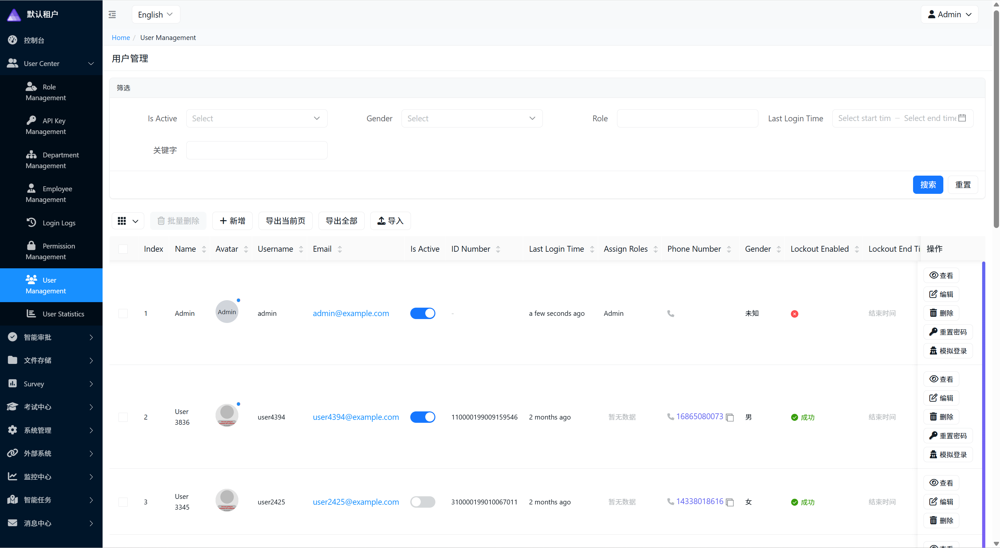
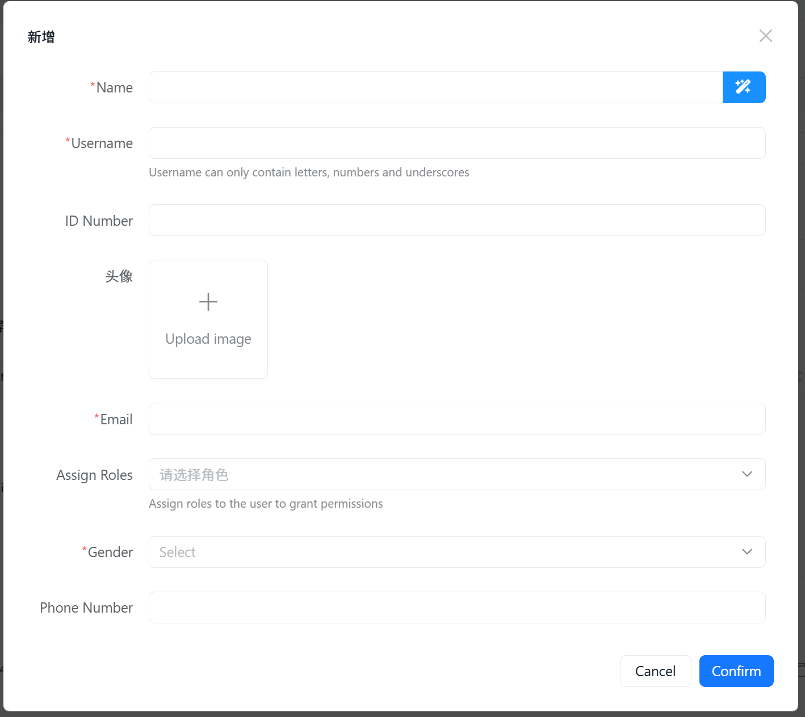
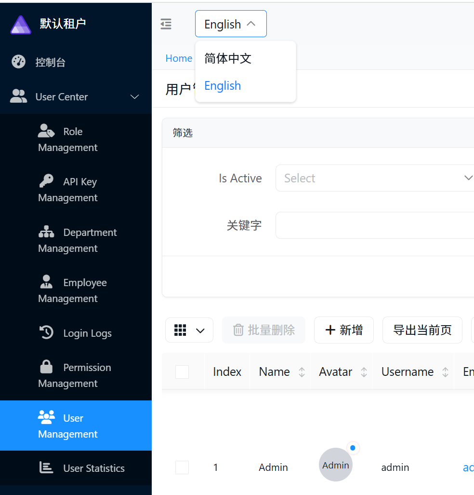
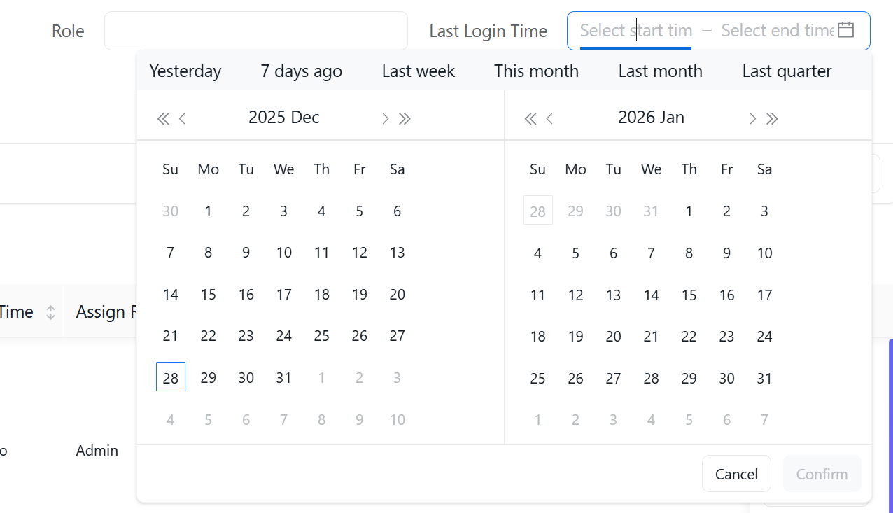
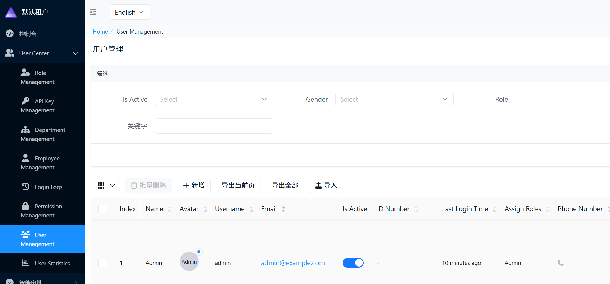

# CodeSpirit 多语言国际化使用指南（Beta）

## 📋 概述

CodeSpirit 框架现已支持完整的前后端多语言国际化功能，提供中英文双语支持，基于 .NET 资源文件和 AMIS locale，通过 Settings 组件实现全局、租户、用户三级语言配置。

**版本**: v1.0.0  
**支持语言**: 简体中文（zh-CN）、英文（en）  
**更新日期**: 2025年12月28日



## 🎯 核心特性

- ✅ **双语支持**：中文（默认）+ 英文
- ✅ **全栈覆盖**：后端 API + 前端 UI  
- ✅ **多级配置**：系统默认 → 租户默认 → 用户偏好
- ✅ **类型安全**：使用 .resx 资源文件，编译时强类型访问
- ✅ **动态切换**：用户可实时切换语言，无需重新登录
- ✅ **AMIS 兼容**：集成 AMIS 的 locale 机制
- ✅ **DataAnnotations 支持**：验证特性自动本地化
- ✅ **DTO描述多语言**：支持字段描述信息的多语言
- ✅ **零侵入**：无需修改业务表结构，基于 Settings 组件

## 🏗️ 架构设计

### 语言解析优先级

```
Cookie（用户手动切换）
    ↓ (未设置)
User Settings（用户偏好）
    ↓ (未设置)
Tenant Settings（租户默认）
    ↓ (未设置)
Global Settings（系统默认）
    ↓ (未设置)
zh-CN（最终回退）
```

### Settings 存储结构

```csharp
// 全局默认语言
Module: "Localization"
Key: "DefaultLanguage"
Value: "zh-CN"
Scope: Global

// 租户默认语言
Module: "Localization"
Key: "DefaultLanguage"
Value: "en"
Scope: Tenant
ScopeId: "{tenantId}"

// 用户偏好语言
Module: "Localization"
Key: "PreferredLanguage"
Value: "en"
Scope: User
ScopeId: "{userId}"
```

## 🚀 快速开始

### 1. 配置已完成

本地化服务已在 `ServiceDefaults` 中自动注册，无需额外配置。

### 2. 后端使用

#### 在 Controller 中使用本地化

```csharp
using CodeSpirit.Localization.Resources;
using Microsoft.Extensions.Localization;

public class MyController : ApiControllerBase
{
    private readonly IStringLocalizer<SharedResources> _localizer;
    
    public MyController(IStringLocalizer<SharedResources> localizer)
    {
        _localizer = localizer;
    }
    
    [HttpPost]
    public IActionResult Create()
    {
        return Ok(new ApiResponse 
        { 
            Status = 1, 
            Msg = _localizer["Common.Save"].Value 
        });
    }
}
```

#### 抛出本地化异常

```csharp
// 使用资源键
throw new BusinessException("Errors.InvalidStartTime");

// 带参数
throw new ValidationException("Errors.NotFound", resourceId);
```

### 3. DTO 验证特性多语言

```csharp
using CodeSpirit.Localization.Resources;

public class CreateQuestionDto
{
    [Display(Name = "Content", ResourceType = typeof(DisplayResources))]
    [Required(ErrorMessageResourceType = typeof(ValidationResources), 
             ErrorMessageResourceName = "Required")]
    [StringLength(2000, 
        ErrorMessageResourceType = typeof(ValidationResources),
        ErrorMessageResourceName = "StringLengthMax")]
    public string Content { get; set; } = string.Empty;
}
```

**验证错误示例**：

中文环境：`题目内容不能为空`  
英文环境：`Content is required`



### 4. DTO 描述信息多语言

DTO 字段的描述信息（Description）也支持多语言，通过 `LocalizedDescriptionAttribute` 实现。

#### 4.1 创建服务资源文件

各服务应创建自己的资源文件，保持服务独立性：

**资源文件结构**：
```
CodeSpirit.ExamApi/Resources/
  ├── ExamDisplayResources.cs    # 资源占位类（包含ResourceManager）
  ├── ExamDisplay.resx           # 中文资源
  └── ExamDisplay.en.resx        # 英文资源
```

**资源键命名规范**：
- DTO字段描述：`Description.{EntityName}.{PropertyName}`
- 示例：`Description.Question.Options`、`Description.Question.CorrectAnswer`

#### 4.2 在DTO中使用

```csharp
using CodeSpirit.Core.Attributes;
using CodeSpirit.ExamApi.Resources;

public class CreateQuestionDto
{
    [LocalizedDescription(
        "根据题目内容生成合适的选项",  // 回退文本（可选）
        ResourceKey = "Description.Question.Options",
        ResourceType = typeof(ExamDisplayResources)
    )]
    public List<string> Options { get; set; }
}
```

**使用方式**：
- **方式1**：仅使用资源键（推荐）
- **方式2**：带回退文本（更安全，资源不可用时显示回退文本）
- **方式3**：使用共享资源（仅适用于通用描述）

#### 4.3 向后兼容

现有的 `DescriptionAttribute` 仍然可以正常使用，系统会优先检查 `LocalizedDescriptionAttribute`，如果不存在则回退到 `DescriptionAttribute`。

#### 4.4 资源文件组织原则

- **共享资源**：`CodeSpirit.Localization/Resources/` - 存放真正通用的、跨服务的资源
- **服务资源**：`ApiServices/{ServiceName}/Resources/` - 存放服务特有的业务资源

**最佳实践**：
- 各服务管理自己的资源文件，避免在共享资源中放置服务特定内容
- 遵循 `Description.{EntityName}.{PropertyName}` 命名约定
- 建议提供回退文本，确保资源不可用时仍能显示

#### 4.5 技术实现

描述多语言的资源解析由 AMIS 表单生成时统一处理：

- **CultureResolver**：从 HttpContext Features、Cookie 等多个来源获取当前语言
- **统一解析**：`GetLocalizedDescription` 方法在表单生成时解析资源
- **回退机制**：英文环境下确保正确加载英文资源，避免回退到中文
- **缓存优化**：在同一请求中复用已解析的文化信息

### 5. 前端使用

#### JavaScript

```javascript
// 获取翻译文本
const message = CodeSpirit.i18n.t('Common.Save');

// 带参数
const message = CodeSpirit.i18n.t('Validation.Required', { 0: '用户名' });

// 切换语言
CodeSpirit.i18n.switchLanguage('en');
```

#### Razor 页面

```razor
@using CodeSpirit.Localization.Resources
@using Microsoft.Extensions.Localization
@inject IStringLocalizer<SharedResources> Localizer

<h1>@Localizer["Common.Save"]</h1>
```

## 🎛️ 语言配置管理

### 通过 API 设置语言

系统已自动集成 Settings 组件，可以通过 Settings API 管理语言配置：

#### 设置用户语言偏好

```csharp
await _settingsService.SetUserSettingAsync(
    module: "Localization",
    key: "PreferredLanguage",
    value: "en",
    userId: currentUserId
);
```

#### 设置租户默认语言

```csharp
await _settingsService.SetTenantSettingAsync(
    module: "Localization",
    key: "DefaultLanguage",
    value: "en",
    tenantId: currentTenantId
);
```

#### 设置全局默认语言

```csharp
await _settingsService.SetGlobalSettingAsync(
    module: "Localization",
    key: "DefaultLanguage",
    value: "en"
);
```

### 通过 UI 切换语言

用户可以在导航栏的语言切换器中选择语言，切换后会：

1. 设置 Cookie（`.AspNetCore.Culture`）
2. 刷新页面
3. 所有界面文本、错误消息自动切换为对应语言

## 📚 资源文件说明

### 共享资源（Localization组件）

| 资源文件 | 用途 | 示例键 |
|---------|------|--------|
| `Shared.resx` | 通用 UI 文本 | `Common.Save`, `Common.Cancel` |
| `Errors.resx` | 错误消息 | `Errors.NotFound`, `Errors.Unauthorized` |
| `Validation.resx` | 验证消息模板 | `Required`, `StringLengthMax` |
| `Display.resx` | 字段显示名称 | `Content`, `Type`, `Difficulty` |

每个资源文件都有对应的英文版本（如 `Shared.en.resx`）。

### 服务特定资源（各API服务）

各服务应创建自己的资源文件，保持服务独立性：

**命名规范**：
- 占位类：`{ServiceName}DisplayResources.cs`
- 资源文件：`{ServiceName}Display.resx`、`{ServiceName}Display.en.resx`

**示例**：
```
CodeSpirit.ExamApi/Resources/
  ├── ExamDisplayResources.cs    # 资源占位类（包含ResourceManager）
  ├── ExamDisplay.resx           # 中文资源
  └── ExamDisplay.en.resx        # 英文资源

CodeSpirit.SurveyApi/Resources/
  ├── SurveyDisplayResources.cs
  ├── SurveyDisplay.resx
  └── SurveyDisplay.en.resx
```

**资源键命名约定**：
- DTO字段描述：`Description.{EntityName}.{PropertyName}`
- 示例：`Description.Question.Options`、`Description.Survey.Title`

## 🔧 常见场景

### 场景 1：用户切换语言

1. 用户在导航栏选择 "English"

2. JavaScript 调用 `CodeSpirit.i18n.switchLanguage('en')`

3. 设置 Cookie 并刷新页面

4. 所有内容显示为英文

   

### 场景 2：租户设置默认语言

1. 租户管理员在设置中选择默认语言为英文
2. 系统通过 Settings API 保存配置
3. 该租户下的所有用户默认使用英文
4. 用户仍可以设置自己的语言偏好

### 场景 3：API 返回本地化错误

```csharp
// 中文环境
throw new BusinessException("Errors.NotFound");
// API 返回: { "status": 0, "msg": "未找到资源" }

// 英文环境  
throw new BusinessException("Errors.NotFound");
// API 返回: { "status": 0, "msg": "Resource not found" }
```

## 🌐 AMIS 多语言

AMIS 组件会自动根据当前语言加载对应的 locale 文件：

- **中文环境**：使用默认的 zh-CN locale
- **英文环境**：动态加载 `sdk/6.13.0/locale/en-US.js`

AMIS 内置组件（日期选择器、分页器等）会自动显示对应语言。



## 🧭 导航组件多语言

导航组件（`CodeSpirit.Navigation`）提供了完整的多语言支持，用于实现动态导航菜单的多语言切换。



### 导航资源文件

导航组件使用专用的资源文件：

**资源文件位置**：
```
CodeSpirit.Navigation/Resources/
  ├── NavigationResources.cs         # 资源占位类
  ├── NavigationResources.resx       # 中文资源
  └── NavigationResources.en.resx    # 英文资源
```

**资源键命名规范**：
- 模块名称：`Module.{ModuleName}`（如 `Module.Identity`、`Module.Survey`）
- 控制器名称：`Controller.{ControllerName}`（如 `Controller.Users`、`Controller.Roles`）

### 在控制器中使用

导航组件支持两种特性来配置多语言：`Module` 特性和 `NavigationAttribute` 特性。

#### 使用 Module 特性（推荐）

`Module` 特性用于定义模块级别的多语言配置，通常放在 `ApiControllerBase` 上：

```csharp
using CodeSpirit.Core.Attributes;
using CodeSpirit.Core.Enums;
using CodeSpirit.Navigation.Resources;

// 模块级配置（在 ApiControllerBase 上）
[Module("identity", 
    displayName: "用户中心",  // 回退文本
    DisplayNameResourceKey = "Module.Identity",           // 资源键
    DisplayNameResourceType = typeof(NavigationResources), // 资源类型
    Icon = "fa-solid fa-user-group")]
[Navigation(
    Icon = "fa-solid fa-user-group", 
    PlatformType = PlatformType.Both,
    TitleResourceKey = "Module.Identity",           // 与 Module 的资源键保持一致
    TitleResourceType = typeof(NavigationResources)
)]
public abstract class ApiControllerBase : CodeSpirit.Shared.Controllers.ApiControllerBase
{
}
```

#### 使用 NavigationAttribute 特性

`NavigationAttribute` 用于控制器级别的多语言配置：

```csharp
using CodeSpirit.Core.Attributes;
using CodeSpirit.Navigation.Resources;
using System.ComponentModel;

// 控制器级配置
[DisplayName("用户管理")]
[Navigation(
    Icon = "fa-solid fa-users", 
    PlatformType = PlatformType.Tenant,
    TitleResourceKey = "Controller.Users",
    TitleResourceType = typeof(NavigationResources)
)]
public class UsersController : ApiControllerBase
{
}
```

### 配置要点

**Module 特性**：
1. **DisplayNameResourceKey**：指定模块名称的资源键（必填）
2. **DisplayNameResourceType**：指定资源类型，通常为 `typeof(NavigationResources)`（必填）
3. **displayName**：回退文本，当资源不可用时显示（必填，建议提供）

**NavigationAttribute 特性**：
1. **TitleResourceKey**：指定资源键名称（推荐填写，与 Module 的 DisplayNameResourceKey 保持一致）
2. **TitleResourceType**：指定资源类型，通常为 `typeof(NavigationResources)`（推荐填写）
3. **Title**：回退文本，当资源不可用时显示（可选，建议提供）

> **最佳实践**：在模块级配置中，建议在 `Navigation` 特性中也设置 `TitleResourceKey` 和 `TitleResourceType`，与 `Module` 特性的资源键保持一致，确保导航多语言功能完整可靠。

### 工作原理

1. **自动扫描**：系统启动时，导航组件自动扫描所有控制器的 `NavigationAttribute`
2. **资源解析**：根据当前语言（`CultureInfo.CurrentUICulture`）解析对应的资源文本
3. **缓存机制**：解析后的导航树缓存到分布式缓存（Redis），提升性能
4. **动态切换**：用户切换语言后，导航菜单会自动显示对应语言

### ⚠️ 重要注意事项

#### 1. 缓存问题

导航组件使用分布式缓存来提升性能，但在以下情况下可能导致多语言不生效：

**症状**：切换语言后，导航菜单仍显示旧语言

**原因**：导航树已缓存，未重新解析多语言资源

**解决方案**：清空导航缓存

##### 方法1：通过缓存管理界面

1. 访问系统平台的**缓存管理**页面（路由：`/cacheManagement`）
2. 在缓存列表中搜索或找到导航缓存键：`CodeSpirit:Navigation:All`
3. 点击该缓存项的"删除"按钮清空缓存

> **注意**：缓存管理功能仅系统管理员可访问，属于系统平台功能。

##### 方法2：通过代码 API 调用

```csharp
// 清空所有导航缓存
await _navigationService.ClearAllNavigationCacheAsync();

// 清空特定模块缓存（实际上也会清空整个缓存）
await _navigationService.ClearModuleNavigationCacheAsync("Identity");

// 重新初始化导航树（清空并重建缓存）
await _navigationService.InitializeNavigationTree();
```

##### 方法3：通过 HTTP API 调用

```bash
# 清空所有导航缓存
DELETE /api/navigation/cache

# 清空特定模块缓存
DELETE /api/navigation/cache?moduleName=Identity

# 重新初始化导航树（清空并重建缓存）
POST /api/navigation/initialize
```

#### 2. 资源文件编译

确保资源文件正确配置为嵌入式资源：

```xml
<ItemGroup>
  <EmbeddedResource Include="Resources\NavigationResources.resx">
    <Generator>PublicResXFileCodeGenerator</Generator>
  </EmbeddedResource>
  <EmbeddedResource Include="Resources\NavigationResources.en.resx" />
</ItemGroup>
```

#### 3. 开发建议

- **模块配置**：推荐同时使用 `Module` 和 `Navigation` 特性配置模块级多语言
- **回退文本**：始终提供回退文本（`displayName`、`Title`），确保资源不可用时仍能显示
- **添加新导航项**：添加后需清空缓存，确保新项生效
- **修改资源文本**：修改后需重新编译项目，并清空缓存
- **测试多语言**：切换语言后若不生效，优先检查缓存
- **资源键一致性**：`Module` 的 `DisplayNameResourceKey` 和 `Navigation` 的 `TitleResourceKey` 通常使用相同的资源键

### 完整示例

以下是用户中心模块的完整多语言配置示例（来自实际代码）：

```csharp
using CodeSpirit.Core;
using CodeSpirit.Core.Attributes;
using CodeSpirit.Core.Enums;
using CodeSpirit.Navigation.Resources;
using Microsoft.AspNetCore.Authorization;
using Microsoft.AspNetCore.Mvc;
using System.ComponentModel;

namespace CodeSpirit.IdentityApi.Controllers
{
    /// <summary>
    /// 身份认证API控制器基类
    /// </summary>
    [ApiController]
    [Authorize(policy: "DynamicPermissions")]
    [Route("api/identity/[controller]")]
    // 模块级配置（使用 Module 和 Navigation 特性）
    [Module("identity", 
        displayName: "用户中心",  // 回退文本
        DisplayNameResourceKey = "Module.Identity",           // 资源键
        DisplayNameResourceType = typeof(NavigationResources), // 资源类型
        Icon = "fa-solid fa-user-group")]
    [Navigation(
        Icon = "fa-solid fa-user-group",
        PlatformType = PlatformType.Both,
        TitleResourceKey = "Module.Identity",
        TitleResourceType = typeof(NavigationResources)
    )]
    public abstract class ApiControllerBase : CodeSpirit.Shared.Controllers.ApiControllerBase
    {
    }

    /// <summary>
    /// 用户管理控制器
    /// </summary>
    [DisplayName("用户管理")]
    [Navigation(
        Icon = "fa-solid fa-users", 
        PlatformType = PlatformType.Tenant,
        TitleResourceKey = "Controller.Users",
        TitleResourceType = typeof(NavigationResources)
    )]
    public class UsersController : ApiControllerBase
    {
        private readonly IUserService _userService;

        public UsersController(IUserService userService)
        {
            _userService = userService;
        }

        /// <summary>
        /// 获取用户列表
        /// </summary>
        [HttpGet]
        [DisplayName("获取用户列表")]
        public async Task<ActionResult<ApiResponse<PageList<UserDto>>>> GetUsers([FromQuery] UserQueryDto queryDto)
        {
            PageList<UserDto> users = await _userService.GetUsersAsync(queryDto);
            return SuccessResponse(users);
        }
    }
}
```

**资源文件内容**：

```xml
<!-- NavigationResources.resx (中文) -->
<data name="Module.Identity">
  <value>用户中心</value>
</data>
<data name="Controller.Users">
  <value>用户管理</value>
</data>

<!-- NavigationResources.en.resx (英文) -->
<data name="Module.Identity">
  <value>User Center</value>
</data>
<data name="Controller.Users">
  <value>User Management</value>
</data>
```

### 缓存键说明

导航组件使用以下缓存键：

- **缓存键**：`CodeSpirit:Navigation:All`
- **缓存策略**：单一缓存 + 内存过滤
- **缓存时间**：绝对过期 365 天，滑动过期 90 天
- **清空时机**：
  - 添加/修改导航项后
  - 修改资源文件后
  - 切换语言不生效时

## 📊 扩展支持

### 添加新语言（如日文）

1. **更新配置**：在 `appsettings.json` 中添加

```json
{
  "Localization": {
    "SupportedCultures": [
      { "Code": "zh-CN", "DisplayName": "简体中文" },
      { "Code": "en", "DisplayName": "English" },
      { "Code": "ja", "DisplayName": "日本語" }
    ]
  }
}
```

2. **添加资源文件**：
   - `Shared.ja.resx`
   - `Errors.ja.resx`
   - `Validation.ja.resx`
   - `Display.ja.resx`

3. **下载 AMIS locale**：将 `ja-JP.js` 放到 `wwwroot/sdk/6.13.0/locale/`

4. **更新语言切换器**：在 `MainNav.razor` 中添加日语选项

## ⚙️ 配置说明

### appsettings.json 配置

```json
{
  "Localization": {
    "DefaultCulture": "zh-CN",
    "SupportedCultures": [
      { "Code": "zh-CN", "DisplayName": "简体中文" },
      { "Code": "en", "DisplayName": "English" }
    ],
    "EnableTenantLevelLanguage": true,
    "EnableUserLevelLanguage": true,
    "FallbackToParentCultures": true,
    "SettingsModule": "Localization",
    "SettingsKeys": {
      "GlobalDefault": "DefaultLanguage",
      "TenantDefault": "DefaultLanguage",
      "UserPreference": "PreferredLanguage"
    }
  }
}
```

## 🎨 UI 组件

### 语言切换器

位置：`Src/CodeSpirit.Web/Components/Shared/MainNav.razor`

用户点击下拉框选择语言，系统会：
1. 设置 Cookie
2. 刷新页面
3. 应用新语言到所有界面元素

## 📖 最佳实践

### 1. 资源键命名规范

- 使用点号分隔类别：`Errors.NotFound`, `Common.Save`
- 使用 PascalCase：`StringLengthMax`, `ValidationError`
- 避免重复前缀：✅ `Errors.NotFound` ❌ `Errors.ErrorsNotFound`

### 2. 参数化消息

```csharp
// 资源文件
<data name="UserCreated"><value>用户 {0} 创建成功</value></data>

// 使用
_localizer["UserCreated", username]
```

### 3. 向后兼容

现有硬编码中文的代码继续正常工作：

```csharp
// 旧代码（继续工作）
throw new BusinessException("未找到资源");

// 新代码（支持多语言）
throw new BusinessException("Errors.NotFound");
```

## 🔍 故障排查

### 资源键未找到

如果资源键不存在，系统会返回键名本身，不会抛出异常。

### 语言未生效

1. 检查 Settings 配置是否正确
2. 确认 Cookie 是否设置成功
3. 查看日志中的语言解析过程

### 资源文件未生成

确保项目文件中配置了资源文件生成器：

```xml
<EmbeddedResource Update="Resources\Shared.resx">
    <Generator>PublicResXFileCodeGenerator</Generator>
</EmbeddedResource>
```

## 📘 相关文档

- [ASP.NET Core 全球化和本地化](https://learn.microsoft.com/zh-cn/aspnet/core/fundamentals/localization)
- [AMIS 国际化文档](https://aisuda.bce.baidu.com/amis/zh-CN/docs/extend/i18n)
- [CodeSpirit Settings 组件](../Components/CodeSpirit.Settings/README.md)

## 💡 FAQ

### Q: 如何为某个用户永久设置语言？

A: 通过 Settings API 设置用户级配置，系统会自动持久化到数据库。

### Q: AMIS 组件的多语言如何工作？

A: 系统会根据当前语言自动加载对应的 AMIS locale 文件（如 `en-US.js`），AMIS 内置组件会自动显示对应语言。

### Q: 可以为不同租户设置不同的默认语言吗？

A: 可以。通过 Settings API 为每个租户设置 `Localization.DefaultLanguage`，该租户下的所有用户默认使用该语言（用户仍可自定义）。

### Q: 如何添加更多语言？

A: 
1. 在 `appsettings.json` 添加语言配置
2. 创建对应的资源文件（如 `Shared.ja.resx`）
3. 下载 AMIS locale 文件
4. 在语言切换器添加选项

无需修改任何代码逻辑。

## 📝 DTO描述多语言常见问题

### Q: 如何为DTO字段添加多语言描述？

A: 使用 `LocalizedDescriptionAttribute`，指定 `ResourceKey` 和 `ResourceType`：

```csharp
[LocalizedDescription(
    ResourceKey = "Description.Question.Options",
    ResourceType = typeof(ExamDisplayResources)
)]
public List<string> Options { get; set; }
```

### Q: 资源文件找不到怎么办？

A: 检查以下几点：
1. 资源文件是否正确嵌入（检查 `.csproj` 配置）
2. 资源键名称是否正确
3. 资源类型是否正确引用
4. 如果配置了回退文本，会使用回退文本

### Q: 可以在运行时动态切换语言吗？

A: 可以。`LocalizedDescriptionAttribute` 会根据 `CultureInfo.CurrentUICulture` 自动获取对应语言的资源。语言切换由 `CodeSpirit.Localization` 组件的中间件处理。


### Q: 导航组件支持哪些多语言配置方式？

A: 导航组件支持两种配置方式：

1. **推荐方式**：使用 `NavigationAttribute` 的 `TitleResourceKey` 和 `TitleResourceType`

```csharp
[Navigation(
    TitleResourceKey = "Controller.Users",
    TitleResourceType = typeof(NavigationResources)
)]
```

2. **向后兼容**：使用 `DisplayAttribute` 的 `Name` 和 `ResourceType`

```csharp
[Display(
    Name = "Controller.Users",
    ResourceType = typeof(NavigationResources)
)]
```

如果同时配置了两者，`NavigationAttribute` 的配置优先级更高。
