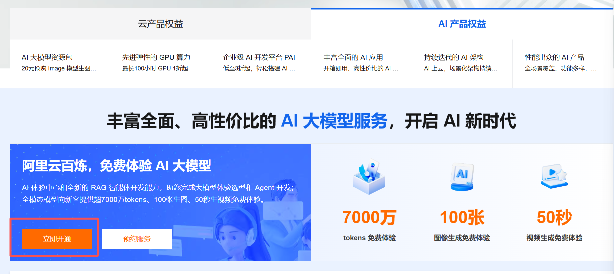
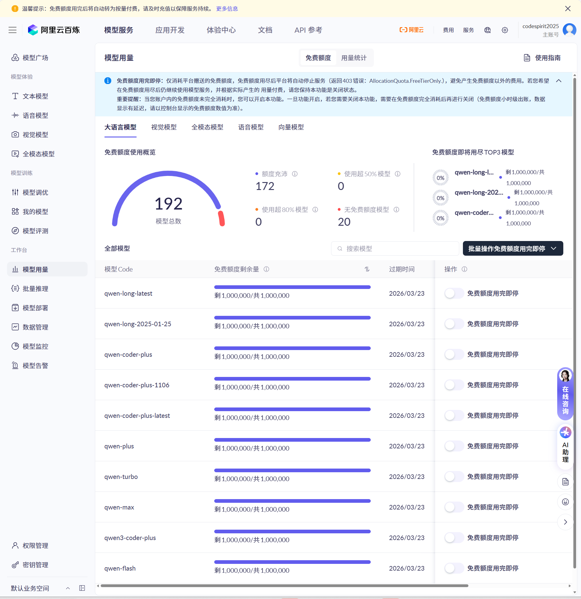

# CodeSpirit 框架 AI 能力体验 - 阿里云通义千问免费试用指南

## 前言

CodeSpirit 是一个基于 .NET 10 + Aspire 的现代化低代码+AI开发框架，采用 **AI-First** 设计理念，将 AI 能力作为框架的**一等公民**，深度集成了大语言模型（LLM），实现了从底层组件到上层应用的全方位 AI 增强。

### 🌟 核心 AI 能力

**基础设施层**：
- 🔌 **CodeSpirit.LLM** - 统一的大语言模型集成层，支持多模型无缝切换（OpenAI、阿里云、DeepSeek 等）
- 📊 **CodeSpirit.LLM.Audit** - 完整的 LLM 审计系统，记录每次 AI 调用的提示词、响应、Token 使用和成本

**功能组件层**：
- 🤖 **AI 智能表单填充** - 业界首创！零配置自动生成 AI 端点，只需一个特性标记即可启用
- 📝 **AI 导入向导** - 智能解析非结构化文本，AI 自动审核和格式修正，支持批量处理
- 📈 **智能图表生成** - AI 分析数据特征，自动推荐最佳可视化方案
- 🎴 **AI 卡片系统** - 智能化的内容卡片管理和生成

**应用场景层**：
- 🎯 **AI 伙伴系统** - 场景化 AI 助手（考情分析官、命题创作官、监考巡视官等）
- 🔧 **Pathfinder 智能工具** - AI 驱动的任务自动化评估和智能工具选择
- 📋 **AI Form 长任务处理** - 支持异步生成、实时进度跟踪、流式响应

### 💡 为什么需要大模型？

这些强大的 AI 功能离不开大语言模型（LLM）的支持。为了让开发者能够**零成本体验**这些能力，我们强烈推荐使用**阿里云通义千问大模型服务** —— 免费额度慷慨，性能强大，国内访问稳定！

## 为什么选择阿里云通义千问？

### 1. 🎁 开发阶段完全免费

阿里云通义千问为开发者提供了慷慨的免费额度：

- **新用户注册即送** 500 万 tokens 免费额度
- **开发测试完全够用** - 对于个人项目和学习场景，基本可以免费使用
- **无需信用卡** - 注册即可使用，无需绑定支付方式

### 2. 🚀 性能强大，响应迅速

- **qwen-turbo** - 适合日常开发，响应速度快
- **qwen-plus** - 更强大的推理能力，适合复杂场景
- **qwen-max** - 旗舰模型，媲美 GPT-4 的能力

### 3. 🇨🇳 国内服务，稳定可靠

- 服务器在国内，无需科学上网
- 访问速度快，延迟低
- 符合国内合规要求

### 4. 💡 与 CodeSpirit 完美集成

CodeSpirit 框架已经内置了对阿里云通义千问的完整支持，只需配置 API Key 即可使用所有 AI 功能。

- **AI 文章生成** - 自动生成摘要、正文、标签、SEO 关键词
- **部门 AI 初始化** - 一键生成完整的组织架构
- **智能问卷生成** - 根据描述自动生成问卷框架和问题
- **AI 批量处理** - 智能分批、并发控制、容错机制

## 限时活动 - 领取免费 Token 🎉

**👉 立即领取：[阿里云通义千问免费体验](https://www.aliyun.com/benefit?userCode=nw99vwgt)**

当前阿里云正在进行**大模型降本提效活动**，最高直降 88%！通过上述链接注册可以享受：

- ✅ 新用户免费 Token 额度
- ✅ 大模型服务超值折扣
- ✅ 完整的技术文档支持
- ✅ 专业的客服团队

## 快速配置指南

### 第一步：获取 API Key

1. 点击链接访问 [阿里云](https://www.aliyun.com/benefit?userCode=nw99vwgt)

   

2. 注册/登录阿里云账号（**新用户即送免费额度**）

   [大模型服务平台百炼控制台](https://bailian.console.aliyun.com/?spm=5176.29597918.J_SEsSjsNv72yRuRFS2VknO.2.20a07b08YzgLIn&tab=model#/model-usage/free-quota)

   

   可以选择批量免费额度用完即停。

3. 进入 [密钥管理](https://bailian.console.aliyun.com/?spm=5176.29597918.J_SEsSjsNv72yRuRFS2VknO.2.20a07b08YzgLIn&tab=model#/api-key)

4. 点击「创建 API-KEY」获取您的密钥

### 第二步：配置 CodeSpirit 框架

CodeSpirit 框架推荐使用 **User Secrets** 方式管理敏感配置，确保 API Key 不会泄露到代码仓库：

```bash
# 在项目根目录执行以下命令
dotnet user-secrets set "llm-ApiBaseUrl" "https://dashscope.aliyuncs.com/compatible-mode/v1"
dotnet user-secrets set "llm-ModelName" "qwen-turbo"
dotnet user-secrets set "llm-ApiKey" "你的API-KEY"
```

**推荐模型选择：**

| 模型 | 适用场景 | 特点 |
|------|----------|------|
| `qwen-turbo` | 日常开发、快速响应 | 速度快，成本低，适合高频调用 |
| `qwen-plus` | 复杂业务逻辑 | 平衡性能与成本，推荐使用 |
| `qwen-max` | 核心功能、生产环境 | 最强性能，适合关键场景 |

### 第三步：验证配置

启动 CodeSpirit 应用：

```bash
# 在项目根目录执行
aspire run
```

现在您可以体验以下 AI 功能来验证配置：

#### 1. 🤖 AI 表单智能填充

**操作步骤**：
1. 进入考试系统 → 题目管理 → 创建题目
2. 在"主题"字段输入：`数据库索引优化`
3. 点击 AI 填充按钮 ✨
4. 观察 AI 自动生成题目内容、选项、正确答案、解析等

**技术亮点**：零配置自动端点，框架自动处理一切！

#### 2. 📋 AI 导入向导

**操作步骤**：
1. 进入考试系统 → 题目管理 → 批量导入
2. 选择题目分类，粘贴 Word 格式的题目文本
3. 点击"智能解析和 AI 审核"
4. 预览 AI 修正后的题目（支持 Diff 对比）
5. 编辑确认后，批量导入

**体验价值**：将小时级的数据清洗工作缩短到分钟级！

#### 3. 🎯 AI 伙伴对话（商业开源）

**操作步骤**：
1. 进入 AI 伙伴系统
2. 选择"考情智析官"角色
3. 输入问题：`今天有哪些考试？`
4. 观察 AI 生成的结构化报告（表格、图表等）

**技术亮点**：实时流式响应，AMIS 渲染复杂组件！

#### 4. 🏢 部门 AI 快速初始化

**操作步骤**：
1. 进入组织管理 → 部门管理
2. 点击"AI 快速初始化"
3. 输入公司规模和行业类型
4. AI 自动生成完整的组织架构

**效率提升**：从几小时的手工录入到几秒钟的 AI 生成！

#### 5. 📊 智能图表推荐

**操作步骤**：
1. 进入数据分析模块
2. 上传 CSV 数据文件
3. AI 自动分析数据特征
4. 推荐最佳的可视化方案（柱状图、折线图、饼图等）

**AI 智能**：理解数据含义，而非简单规则匹配！

#### 6. 🔍 查看 LLM 审计日志

**操作步骤**：
1. 进入系统管理 → LLM 审计
2. 查看所有 AI 调用记录
3. 分析 Token 使用量和成本统计
4. 查看提示词和响应详情

**合规保障**：完整的 AI 决策追溯能力！

---

**验证成功标志**：
- ✅ AI 按钮正常显示和响应
- ✅ 生成的内容质量高、格式正确
- ✅ 流式响应流畅，无卡顿
- ✅ 审计日志正常记录

如果一切正常，恭喜您！已经成功配置阿里云通义千问，可以尽情体验 CodeSpirit 的强大 AI 能力了！🎉

## 成本预估

以下是基于 CodeSpirit 实际 AI 功能的成本参考（使用 qwen-turbo 模型）：

### 📊 按使用场景统计

| 使用场景 | 预估调用次数/天 | Token 消耗/月 | 费用（付费后） |
|---------|----------------|--------------|--------------|
| 个人学习 | 10-50 次 | 约 50 万 | **免费额度内** ✅ |
| 小型项目 | 100-500 次 | 约 200 万 | **免费额度内** ✅ |
| 中型应用 | 1000+ 次 | 约 800 万 | ~¥10-30/月 |
| 企业应用 | 5000+ 次 | 约 3000 万 | ~¥50-100/月 |

### 🎯 按 AI 功能统计

| AI 功能 | 单次消耗 | 使用频率 | 月成本（付费后） |
|--------|---------|---------|----------------|
| AI 表单填充 | ~500 tokens | 中频 | **免费额度内** ✅ |
| AI 导入向导（批量） | ~5000 tokens | 低频 | **免费额度内** ✅ |
| AI 伙伴对话 | ~1000 tokens/轮 | 高频 | ¥5-15/月 |
| 智能图表推荐 | ~300 tokens | 中频 | **免费额度内** ✅ |
| 部门 AI 初始化 | ~800 tokens | 低频 | **免费额度内** ✅ |
| AI 题目生成（批量 10 道） | ~3000 tokens | 中频 | ¥3-8/月 |

### ✅ 成本优化建议

**1. 智能缓存机制**（框架已内置）
- 相同的 AI 请求自动使用缓存结果
- 可节省 30-50% 的 Token 消耗

**2. 合理选择模型**

- 日常开发：qwen-turbo（速度快、成本低）
- 复杂场景：qwen-plus（性能更强）
- 核心功能：qwen-max（最强能力）

**3. 批量处理优化**
- AI 导入向导已支持智能分批
- 批量操作比单条处理更经济

**4. 查看审计日志**
- 实时监控 Token 使用情况
- 分析高消耗场景并优化
- 设置配额管理和预警

### 🎉 结论

对于**大多数开发者和中小型项目**，阿里云通义千问的**免费额度完全够用**！

即使超出免费额度，付费价格也非常亲民（约为 OpenAI 的 1/3）。CodeSpirit 框架内置的智能缓存和优化机制，可以进一步降低实际成本。

**性价比无敌！** 💪

### 💡 最佳实践建议

**开发阶段**：
- ✅ 使用 qwen-turbo 模型（速度快、成本低）
- ✅ 充分利用免费额度
- ✅ 开启智能缓存
- ✅ 定期查看审计日志

**生产环境**：
- ✅ 根据场景选择合适模型
- ✅ 设置配额管理和预警
- ✅ 监控 Token 使用趋势
- ✅ 优化高消耗场景的提示词

**成本控制**：
- ✅ 利用框架内置的缓存机制
- ✅ 批量操作优于单条处理
- ✅ 按租户分配配额
- ✅ 定期分析审计报告

有了这些优化策略，您可以在**不牺牲用户体验**的前提下，**显著降低 AI 使用成本**！🎯

## 支持开源，支持作者 ❤️

**CodeSpirit 框架**是作者**业余时间长期兼职维护**的开源项目，投入了大量精力在框架设计、功能开发、文档编写和问题解答上。

如果您觉得这个框架对您有帮助，希望能通过以下方式支持作者：

### 🌟 最直接的支持方式

**通过作者的推广链接注册阿里云**，您无需额外付费，却能帮助作者获得一定的返佣支持：

**👉 [点击这里注册阿里云，领取免费额度](https://www.aliyun.com/benefit?userCode=nw99vwgt)**

- ✅ 您：享受新用户优惠和免费额度
- ✅ 作者：获得返佣，支持框架持续维护
- ✅ 双赢：让 CodeSpirit 框架越来越好！

### 🎯 其他支持方式

- ⭐ 给项目点 Star
- 📢 向朋友推荐 CodeSpirit 框架
- 💬 加入社区，分享使用经验
- 🐛 提交 Issue 和 PR

## 常见问题

### Q1: 免费额度用完后怎么办？

**A:** 阿里云通义千问的付费价格非常亲民，qwen-turbo 模型约 ¥0.3 元/百万 tokens。对于个人项目，每月 10-30 元即可满足需求。

如已超出用量，可以从以下链接享受八折购买：

[百炼特惠，智启未来](https://dashi.aliyun.com/activity/ydsbl?userCode=nw99vwgt)

### Q2: 可以切换到其他 LLM 服务吗？

**A:** 可以！CodeSpirit 使用了 `CodeSpirit.LLM` 抽象层，支持任何 OpenAI 兼容的 API 服务，包括：
- OpenAI GPT 系列
- Azure OpenAI
- 其他国产大模型（如智谱、Moonshot 等）

只需修改 `llm-ApiBaseUrl` 和 `llm-ModelName` 配置即可切换。

### Q3: API Key 会不会泄露？

**A:** CodeSpirit 推荐使用 **User Secrets** 或 **环境变量** 管理敏感配置，不会提交到代码仓库。

### Q4: 为什么推荐阿里云而不是 OpenAI？

**A:** 主要考虑：

1. **免费额度更慷慨** - 新用户即送 500 万 tokens
2. **国内访问稳定** - 无需科学上网，速度快
3. **价格更实惠** - qwen-turbo 模型仅为 GPT-3.5 的 1/3 价格
4. **中文能力优秀** - 针对中文场景深度优化

当然，如果您已有 OpenAI 账号，也完全可以使用！

## 开始体验

现在就开始您的 AI 开发之旅吧！

**🚀 [百炼特惠，智启未来](https://dashi.aliyun.com/activity/ydsbl?userCode=nw99vwgt)**

配置完成后，运行 CodeSpirit 框架，体验强大的 AI 能力：

```bash
# 启动应用
aspire run
```

## 结语

### 💡 CodeSpirit + 阿里云通义千问 = 完美组合

**CodeSpirit** 提供了业界领先的 AI 集成能力：
- ⭐ 零配置自动化 - 业界首创
- 🔧 完整的 LLM 抽象层 - 多模型支持
- 📊 全链路审计追溯 - 合规保障
- 🎯 场景化智能助手 - 开箱即用

**阿里云通义千问** 提供了强大的模型能力：
- 🎁 免费额度慷慨 - 新用户即送 500 万 tokens
- 🚀 性能强大 - 媲美 GPT-4 的能力
- 🇨🇳 国内稳定 - 无需科学上网
- 💰 价格亲民 - 成本仅为 OpenAI 的 1/3

两者结合，让您以**最低成本**体验**最强 AI 能力**！

### ❤️ 支持开源，共同成长

**CodeSpirit 框架**是作者**业余时间长期兼职维护**的开源项目，已投入：
- 📝 数千小时的代码开发
- 📚 数百页的文档编写  
- 💬 无数次的问题解答
- 🔧 持续的功能迭代

如果这个框架对您有帮助，希望您能通过推广链接注册阿里云：

**👉 [点击注册阿里云，领取免费额度，支持作者](https://www.aliyun.com/benefit?userCode=nw99vwgt)**

- ✅ **您**：享受新用户优惠和免费额度，零成本体验 AI 能力
- ✅ **作者**：获得返佣支持，持续维护和优化框架
- ✅ **社区**：让 CodeSpirit 框架越来越好，服务更多开发者

这是一个**三赢**的选择！🎉

### 🌟 加入我们

- ⭐ 给项目点 Star：[GitHub 仓库地址]
- 📢 向朋友推荐 CodeSpirit 框架
- 💬 加入社区，分享使用经验和最佳实践
- 🐛 提交 Issue 和 PR，共同完善框架
- 📝 撰写教程和案例，帮助更多开发者

### 🚀 让 AI 真正成为开发者的智能助手

**CodeSpirit - AI 赋能，智慧编码！** 🤖✨

**最后再次附上推广链接**：  
👉 https://www.aliyun.com/benefit?userCode=nw99vwgt

---

_本文档最后更新：2025-12_  
_如有疑问，欢迎在 GitHub Issues 中提问_

