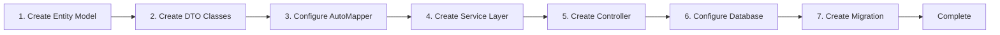

# CodeSpirit CRUD Development Example

## Overview

This document demonstrates how to quickly develop CRUD functionality using the CodeSpirit framework through actual code examples of **Question Category Management** (QuestionCategory). This example comes from the exam system (ExamApi) and is a standard tree-structured CRUD module with complete validation logic and business processing.

**Last Updated**: December 2025  
**Framework Version**: v2.0.0  
**Example Source**: `CodeSpirit.ExamApi` - Question Category Management Module

## Development Process Overview



## Example Module Description

**Question Category Management** (QuestionCategory) is a typical tree-structured CRUD module with the following features:

- ✅ Supports multi-level categories (parent-child relationships)
- ✅ Tree structure display
- ✅ Complete CRUD operations
- ✅ Business validation (prevent circular references, pre-deletion checks)
- ✅ Multi-tenant support
- ✅ Automatic audit field recording

## 1. Create Entity Model

Create entity class in `Data/Models` directory:

```csharp
// Data/Models/QuestionCategory.cs
using CodeSpirit.Shared.Entities;
using CodeSpirit.Shared.Entities.Interfaces;
using CodeSpirit.Core;
using System.ComponentModel.DataAnnotations;

namespace CodeSpirit.ExamApi.Data.Models;

/// <summary>
/// Question category
/// </summary>
public class QuestionCategory : LongKeyAuditableEntityBase, IMultiTenant
{
    /// <summary>
    /// Category name
    /// </summary>
    public string Name { get; set; } = string.Empty;

    /// <summary>
    /// Category description
    /// </summary>
    public string? Description { get; set; }

    /// <summary>
    /// Parent category ID
    /// </summary>
    public long? ParentId { get; set; }

    /// <summary>
    /// Parent category (navigation property)
    /// </summary>
    public QuestionCategory? Parent { get; set; }

    /// <summary>
    /// Child category list (navigation property)
    /// </summary>
    public List<QuestionCategory> Children { get; set; } = [];

    /// <summary>
    /// Question list (navigation property)
    /// </summary>
    public List<Question> Questions { get; set; } = [];

    /// <summary>
    /// Tenant ID (multi-tenant support)
    /// </summary>
    [Required]
    [StringLength(50)]
    public string TenantId { get; set; } = string.Empty;
}
```

**Notes**:
- Inherits from `LongKeyAuditableEntityBase`, automatically includes audit fields like `Id`, `CreatedAt`, `CreatedBy`, `UpdatedAt`, `UpdatedBy`
- Implements `IMultiTenant` interface, supports multi-tenant data isolation
- Uses `long` as primary key type
- Contains parent-child relationship navigation properties, supports tree structure

## 2. Create DTO Classes

Create DTO classes in `Dtos/QuestionCategory` directory:

### 2.1 QuestionCategoryDto (Display DTO)

```csharp
// Dtos/QuestionCategory/QuestionCategoryDto.cs
using CodeSpirit.Amis.Attributes;
using CodeSpirit.Amis.Attributes.Columns;
using CodeSpirit.Core.Attributes;
using System.ComponentModel;

namespace CodeSpirit.ExamApi.Dtos.QuestionCategory;

/// <summary>
/// Question category DTO
/// </summary>
public class QuestionCategoryDto
{
    /// <summary>
    /// ID
    /// </summary>
    [AmisColumn(Hidden = true)]
    public long Id { get; set; }

    /// <summary>
    /// Category name
    /// </summary>
    [DisplayName("Category Name")]
    [TplColumn("<i class=\"${icon} mr-1\"></i> ${name}")]
    public string Name { get; set; } = string.Empty;
    
    /// <summary>
    /// Icon (for template display)
    /// </summary>
    [AmisColumn(Hidden = true)]
    public string Icon { get; set; } = "fa fa-folder";
    
    /// <summary>
    /// Category description
    /// </summary>
    [DisplayName("Description")]
    [AmisColumn(Type = "text", Remark = "Detailed description of the category")]
    public string? Description { get; set; }
    
    /// <summary>
    /// Parent category ID
    /// </summary>
    [AmisColumn(Hidden = true)]
    public long? ParentId { get; set; }
    
    /// <summary>
    /// Parent category name
    /// </summary>
    [DisplayName("Parent Category")]
    [TplColumn("${parentName || 'Root Category'}")]
    [AmisColumn(Sortable = false)]
    public string? ParentName { get; set; }
    
    /// <summary>
    /// Question count
    /// </summary>
    [DisplayName("Question Count")]
    [TplColumn("<span class=\"badge badge-info\">${questionCount}</span>")]
    public int QuestionCount { get; set; }

    /// <summary>
    /// Update time
    /// </summary>
    [DisplayName("Update Time")]
    [DateColumn(Format = "YYYY-MM-DD HH:mm", FromNow = true)]
    public DateTime? UpdatedAt { get; set; }

    /// <summary>
    /// Child category list (for tree display)
    /// </summary>
    [IgnoreColumn]
    [DisplayName("Children")]
    public List<QuestionCategoryDto> Children { get; set; } = [];
}
```

**Notes**:
- `AmisColumn` attribute controls frontend table column display
- `TplColumn` attribute customizes column display template
- `IgnoreColumn` attribute indicates field not displayed in table (for tree structure)

### 2.2 CreateQuestionCategoryDto (Create DTO)

```csharp
// Dtos/QuestionCategory/CreateQuestionCategoryDto.cs
using System.ComponentModel;
using System.ComponentModel.DataAnnotations;
using CodeSpirit.Amis.Attributes.FormFields;
using CodeSpirit.Core.Attributes;

namespace CodeSpirit.ExamApi.Dtos.QuestionCategory;

/// <summary>
/// Create question category DTO
/// </summary>
[AiFormFill(TriggerField = nameof(Name), ApiEndpoint = "ai-fill")]
public class CreateQuestionCategoryDto
{
    /// <summary>
    /// Category name
    /// </summary>
    [Required(ErrorMessage = "Category name cannot be empty")]
    [StringLength(100, ErrorMessage = "Category name maximum length is 100")]
    [DisplayName("Category Name")]
    public string Name { get; set; } = string.Empty;
    
    /// <summary>
    /// Category description
    /// </summary>
    [StringLength(500, ErrorMessage = "Category description maximum length is 500")]
    [DisplayName("Description")]
    [Description("Detailed description of category characteristics and usage")]
    [AmisTextareaField(MaxLength = 500, ShowCounter = true)]
    [AiFieldFill(Weight = 2, Priority = 1)]
    public string? Description { get; set; }
    
    /// <summary>
    /// Parent category ID
    /// </summary>
    [DisplayName("Parent Category")]
    [AmisSelectField(
        Source = "${ROOT_API}/api/exam/QuestionCategories",
        ValueField = "id",
        LabelField = "name",
        Searchable = true,
        Multiple = false
    )]
    public long? ParentId { get; set; }
}
```

**Notes**:
- `AiFormFill` attribute enables AI form smart fill functionality
- `AmisSelectField` attribute automatically generates dropdown selection component with search support
- `AmisTextareaField` attribute generates multi-line text input box

### 2.3 UpdateQuestionCategoryDto (Update DTO)

```csharp
// Dtos/QuestionCategory/UpdateQuestionCategoryDto.cs
using System.ComponentModel;
using System.ComponentModel.DataAnnotations;
using CodeSpirit.Amis.Attributes.FormFields;

namespace CodeSpirit.ExamApi.Dtos.QuestionCategory;

/// <summary>
/// Update question category DTO
/// </summary>
public class UpdateQuestionCategoryDto
{
    /// <summary>
    /// Category name
    /// </summary>
    [Required(ErrorMessage = "Category name cannot be empty")]
    [StringLength(100, ErrorMessage = "Category name maximum length is 100")]
    [DisplayName("Category Name")]
    public string Name { get; set; } = string.Empty;
    
    /// <summary>
    /// Category description
    /// </summary>
    [StringLength(500, ErrorMessage = "Category description maximum length is 500")]
    [DisplayName("Description")]
    [AmisTextareaField(MaxLength = 500, ShowCounter = true)]
    public string? Description { get; set; }
    
    /// <summary>
    /// Parent category ID
    /// </summary>
    [DisplayName("Parent Category")]
    [AmisSelectField(
        Source = "${ROOT_API}/api/exam/QuestionCategories", 
        ValueField = "id", 
        LabelField = "name",
        Searchable = true,
        Multiple = false
    )]
    public long? ParentId { get; set; }
}
```

### 2.4 QuestionCategoryQueryDto (Query DTO)

```csharp
// Dtos/QuestionCategory/QuestionCategoryQueryDto.cs
using System.ComponentModel;
using CodeSpirit.Core.Dtos;

namespace CodeSpirit.ExamApi.Dtos.QuestionCategory;

/// <summary>
/// Question category query DTO
/// </summary>
public class QuestionCategoryQueryDto : QueryDtoBase
{
    /// <summary>
    /// Keyword search (category name or description)
    /// </summary>
    [DisplayName("Keyword")]
    public string? Keywords { get; set; }
}
```

**Notes**:
- `QueryDtoBase` provides pagination and sorting properties like `Page`, `PerPage`, `OrderBy`, `OrderDir`
- Can add more query condition fields

## 3. Configure AutoMapper Mapping

Create mapping configuration in `MappingProfiles` directory:

```csharp
// MappingProfiles/QuestionCategoryProfile.cs
using AutoMapper;
using CodeSpirit.ExamApi.Data.Models;
using CodeSpirit.ExamApi.Dtos.QuestionCategory;
using CodeSpirit.Shared.Extensions;

namespace CodeSpirit.ExamApi.MappingProfiles;

/// <summary>
/// Question category mapping configuration
/// </summary>
public class QuestionCategoryProfile : Profile
{
    /// <summary>
    /// Constructor
    /// </summary>
    public QuestionCategoryProfile()
    {
        // Use extension method to configure basic CRUD mappings (automatically handles Include navigation properties)
        this.ConfigureBaseCRUDIMappings<
            QuestionCategory, 
            QuestionCategoryDto, 
            long, 
            CreateQuestionCategoryDto, 
            UpdateQuestionCategoryDto,
            CreateQuestionCategoryDto>();
            
        // Custom mapping: map parent category name and question count
        CreateMap<QuestionCategory, QuestionCategoryDto>()
            .ForMember(dest => dest.ParentName, opt => opt.MapFrom(src => src.Parent != null ? src.Parent.Name : null))
            .ForMember(dest => dest.QuestionCount, opt => opt.MapFrom(src => src.Questions.Count));
            
        // Tree structure mapping
        CreateMap<QuestionCategory, QuestionCategoryTreeDto>();
    }
}
```

**Notes**:
- `ConfigureBaseCRUDIMappings` extension method automatically configures basic CRUD mappings
- Use `ForMember` to customize field mapping logic
- Supports multiple DTO type mapping configurations

## 4. Create Service Interface and Implementation

### 4.1 Service Interface

```csharp
// Services/Interfaces/IQuestionCategoryService.cs
using CodeSpirit.ExamApi.Data.Models;
using CodeSpirit.ExamApi.Dtos.QuestionCategory;
using CodeSpirit.Core.Dtos;
using CodeSpirit.Shared.Services;

namespace CodeSpirit.ExamApi.Services.Interfaces;

/// <summary>
/// Question category service interface
/// </summary>
public interface IQuestionCategoryService : IBaseCRUDService<QuestionCategory, QuestionCategoryDto, long, CreateQuestionCategoryDto, UpdateQuestionCategoryDto>
{    
    /// <summary>
    /// Get question category paginated list
    /// </summary>
    Task<PageList<QuestionCategoryDto>> GetQuestionCategoriesAsync(QuestionCategoryQueryDto queryDto);
    
    /// <summary>
    /// Get all question categories (for tree selection)
    /// </summary>
    Task<List<QuestionCategoryDto>> GetAllCategoriesAsync();

    /// <summary>
    /// Get category tree
    /// </summary>
    Task<List<QuestionCategoryTreeDto>> GetCategoryTreeAsync();
}
```

### 4.2 Service Implementation

```csharp
// Services/Implementations/QuestionCategoryService.cs
using AutoMapper;
using CodeSpirit.Core;
using CodeSpirit.Core.DependencyInjection;
using CodeSpirit.ExamApi.Data.Models;
using CodeSpirit.ExamApi.Dtos.QuestionCategory;
using CodeSpirit.ExamApi.Services.Interfaces;
using CodeSpirit.Shared.Repositories;
using CodeSpirit.Shared.Services;
using LinqKit;
using Microsoft.EntityFrameworkCore;
using Microsoft.Extensions.Logging;
using System.Linq.Expressions;

namespace CodeSpirit.ExamApi.Services.Implementations;

/// <summary>
/// Question category service implementation
/// </summary>
public class QuestionCategoryService : BaseCRUDService<QuestionCategory, QuestionCategoryDto, long, CreateQuestionCategoryDto, UpdateQuestionCategoryDto>, IQuestionCategoryService, IScopedDependency
{
    private readonly ILogger<QuestionCategoryService> _logger;

    /// <summary>
    /// Constructor
    /// </summary>
    /// <param name="repository">Repository interface</param>
    /// <param name="mapper">Object mapper</param>
    /// <param name="logger">Logger</param>
    public QuestionCategoryService(
        IRepository<QuestionCategory> repository,
        IMapper mapper,
        ILogger<QuestionCategoryService> logger)
        : base(repository, mapper)
    {
        _logger = logger;
    }

    /// <summary>
    /// Get question category paginated list
    /// </summary>
    public async Task<PageList<QuestionCategoryDto>> GetQuestionCategoriesAsync(QuestionCategoryQueryDto queryDto)
    {
        var predicate = PredicateBuilder.New<QuestionCategory>(true);

        // Keyword search
        if (!string.IsNullOrEmpty(queryDto.Keywords))
        {
            predicate = predicate.Or(x => x.Name.Contains(queryDto.Keywords));
            predicate = predicate.Or(x => x.Description != null && x.Description.Contains(queryDto.Keywords));
        }

        // Call base class method, automatically handles pagination and sorting
        return await GetPagedListAsync(
            queryDto,
            predicate,
            "Parent", "Questions"  // Include navigation properties
        );
    }

    /// <summary>
    /// Get all question categories
    /// </summary>
    public async Task<List<QuestionCategoryDto>> GetAllCategoriesAsync()
    {
        var categories = await Repository.CreateQuery()
            .Include(c => c.Parent)
            .Include(c => c.Questions)
            .ToListAsync();

        return Mapper.Map<List<QuestionCategoryDto>>(categories);
    }

    /// <summary>
    /// Get category tree structure
    /// </summary>
    public async Task<List<QuestionCategoryTreeDto>> GetCategoryTreeAsync()
    {
        // Get all categories
        var categories = await Repository.CreateQuery()
            .Include(c => c.Parent)
            .ToListAsync();

        // Build category tree
        var categoryDtos = Mapper.Map<List<QuestionCategoryTreeDto>>(categories);
        
        // Root node list
        var rootCategories = categoryDtos.Where(c => c.ParentId == null).ToList();
        
        // Recursively build tree structure
        foreach (var rootCategory in rootCategories)
        {
            BuildCategoryTree(rootCategory, categoryDtos);
        }
        
        return rootCategories;
    }
    
    /// <summary>
    /// Recursively build category tree
    /// </summary>
    private void BuildCategoryTree(QuestionCategoryTreeDto parent, List<QuestionCategoryTreeDto> allCategories)
    {
        parent.Children = allCategories.Where(c => c.ParentId == parent.Id).ToList();
        
        foreach (var child in parent.Children)
        {
            BuildCategoryTree(child, allCategories);
        }
    }

    /// <summary>
    /// Validate create DTO
    /// </summary>
    protected override async Task ValidateCreateDto(CreateQuestionCategoryDto createDto)
    {
        await base.ValidateCreateDto(createDto);

        // Validate parent category exists
        if (createDto.ParentId.HasValue)
        {
            var parentExists = await Repository.ExistsAsync(c => c.Id == createDto.ParentId.Value);
            if (!parentExists)
            {
                throw new AppServiceException(400, "Parent category does not exist");
            }
        }
    }

    /// <summary>
    /// Validate update DTO
    /// </summary>
    protected override async Task ValidateUpdateDto(long id, UpdateQuestionCategoryDto updateDto)
    {
        await base.ValidateUpdateDto(id, updateDto);

        // Validate parent category exists
        if (updateDto.ParentId.HasValue)
        {
            // Cannot set itself as parent
            if (updateDto.ParentId.Value == id)
            {
                throw new AppServiceException(400, "Cannot set category itself as parent");
            }

            var parentExists = await Repository.ExistsAsync(c => c.Id == updateDto.ParentId.Value);
            if (!parentExists)
            {
                throw new AppServiceException(400, "Parent category does not exist");
            }

            // Check for circular reference
            var parentId = updateDto.ParentId.Value;
            var maxDepth = 10; // Prevent infinite loop
            var depth = 0;

            while (parentId != 0 && depth < maxDepth)
            {
                var parent = await Repository.GetByIdAsync(parentId);
                if (parent == null)
                {
                    break;
                }

                if (parent.ParentId == id)
                {
                    throw new AppServiceException(400, "Cannot set child category as parent, would create circular reference");
                }

                parentId = parent.ParentId ?? 0;
                depth++;
            }
        }
    }

    /// <summary>
    /// Pre-deletion validation
    /// </summary>
    protected override async Task OnDeleting(QuestionCategory entity)
    {
        await base.OnDeleting(entity);

        // Check if has child categories
        bool hasChildren = await Repository.CreateQuery().AnyAsync(c => c.ParentId == entity.Id);
        if (hasChildren)
        {
            throw new AppServiceException(400, "Category has child categories, cannot delete directly");
        }

        // Check if has questions associated
        if (entity.Questions.Any())
        {
            throw new AppServiceException(400, "Category has questions, cannot delete directly");
        }
    }
}
```

**Notes**:
- Inherits from `BaseCRUDService`, automatically gets standard CRUD methods
- Implements `IScopedDependency` interface, service automatically registered
- Override `ValidateCreateDto` and `ValidateUpdateDto` methods to implement business validation
- Override `OnDeleting` method to implement pre-deletion checks
- Uses `LinqKit`'s `PredicateBuilder` to build dynamic query conditions

## 5. Create Controller

Create controller in `Controllers` directory:

```csharp
// Controllers/QuestionCategoriesController.cs
using CodeSpirit.Core.Attributes;
using CodeSpirit.Core.Dtos;
using CodeSpirit.ExamApi.Dtos.QuestionCategory;
using CodeSpirit.ExamApi.Services.Interfaces;
using CodeSpirit.Shared.Dtos.Common;
using Microsoft.AspNetCore.Mvc;
using CodeSpirit.Core.Enums;

namespace CodeSpirit.ExamApi.Controllers;

/// <summary>
/// Question category management controller
/// </summary>
[DisplayName("Question Category Management")]
[Navigation(Icon = "fa-solid fa-folder-tree", PlatformType = PlatformType.Tenant)]
public class QuestionCategoriesController : ApiControllerBase
{
    private readonly IQuestionCategoryService _questionCategoryService;
    private readonly ILogger<QuestionCategoriesController> _logger;

    /// <summary>
    /// Initialize question category management controller
    /// </summary>
    /// <param name="questionCategoryService">Question category service</param>
    /// <param name="logger">Logger</param>
    public QuestionCategoriesController(
        IQuestionCategoryService questionCategoryService,
        ILogger<QuestionCategoriesController> logger)
    {
        ArgumentNullException.ThrowIfNull(questionCategoryService);
        ArgumentNullException.ThrowIfNull(logger);

        _questionCategoryService = questionCategoryService;
        _logger = logger;
    }

    /// <summary>
    /// Get question category list (supports tree display)
    /// </summary>
    /// <param name="queryDto">Query conditions</param>
    /// <returns>Question category list result</returns>
    [HttpGet]
    [DisplayName("Get Question Category List")]
    public async Task<ActionResult<ApiResponse<PageList<QuestionCategoryDto>>>> GetQuestionCategories([FromQuery] QuestionCategoryQueryDto queryDto)
    {
        // Get all category data
        List<QuestionCategoryDto> allCategories = await _questionCategoryService.GetAllCategoriesAsync();
        
        // Filter if query keyword exists
        List<QuestionCategoryDto> filteredCategories = allCategories;
        if (!string.IsNullOrEmpty(queryDto.Keywords))
        {
            filteredCategories = allCategories.Where(c => 
                c.Name.Contains(queryDto.Keywords, StringComparison.OrdinalIgnoreCase) ||
                (!string.IsNullOrEmpty(c.Description) && c.Description.Contains(queryDto.Keywords, StringComparison.OrdinalIgnoreCase))
            ).ToList();
        }

        // Build tree structure
        List<QuestionCategoryDto> treeCategories = BuildCategoryTree(filteredCategories);

        // Create non-paginated PageList, so Amis will automatically use tree display
        PageList<QuestionCategoryDto> listData = new(treeCategories, treeCategories.Count);

        return SuccessResponse(listData);
    }

    /// <summary>
    /// Get all question categories
    /// </summary>
    /// <returns>All question category list</returns>
    [HttpGet("all")]
    [DisplayName("Get All Question Categories")]
    public async Task<ActionResult<ApiResponse<List<QuestionCategoryDto>>>> GetAllCategories()
    {
        List<QuestionCategoryDto> categories = await _questionCategoryService.GetAllCategoriesAsync();
        return SuccessResponse(categories);
    }

    /// <summary>
    /// Get question category tree structure
    /// </summary>
    /// <returns>Tree-structured question category list</returns>
    [HttpGet("tree")]
    [DisplayName("Get Question Category Tree")]
    public async Task<ActionResult<ApiResponse<List<QuestionCategoryTreeDto>>>> GetCategoryTree()
    {
        List<QuestionCategoryTreeDto> categoryTree = await _questionCategoryService.GetCategoryTreeAsync();
        return SuccessResponse(categoryTree);
    }

    /// <summary>
    /// Get question category details
    /// </summary>
    /// <param name="id">Question category ID</param>
    /// <returns>Question category detailed information</returns>
    [HttpGet("{id:long}")]
    [DisplayName("Get Question Category Details")]
    public async Task<ActionResult<ApiResponse<QuestionCategoryDto>>> GetQuestionCategory(long id)
    {
        QuestionCategoryDto category = await _questionCategoryService.GetAsync(id);
        return SuccessResponse(category);
    }

    /// <summary>
    /// Create question category
    /// </summary>
    /// <param name="createDto">Create question category request data</param>
    /// <returns>Created question category information</returns>
    [HttpPost]
    [DisplayName("Create Question Category")]
    public async Task<ActionResult<ApiResponse<QuestionCategoryDto>>> CreateQuestionCategory(CreateQuestionCategoryDto createDto)
    {
        ArgumentNullException.ThrowIfNull(createDto);
        QuestionCategoryDto categoryDto = await _questionCategoryService.CreateAsync(createDto);
        return SuccessResponse(categoryDto);
    }

    /// <summary>
    /// Update question category
    /// </summary>
    /// <param name="id">Question category ID</param>
    /// <param name="updateDto">Update question category request data</param>
    /// <returns>Update operation result</returns>
    [HttpPut("{id:long}")]
    [DisplayName("Update Question Category")]
    public async Task<ActionResult<ApiResponse>> UpdateQuestionCategory(long id, UpdateQuestionCategoryDto updateDto)
    {
        await _questionCategoryService.UpdateAsync(id, updateDto);
        return SuccessResponse();
    }

    /// <summary>
    /// Delete question category
    /// </summary>
    /// <param name="id">Question category ID</param>
    /// <returns>Delete operation result</returns>
    [HttpDelete("{id:long}")]
    [Operation("Delete", "ajax", null, "Are you sure you want to delete this question category?")]
    [DisplayName("Delete Question Category")]
    public async Task<ActionResult<ApiResponse>> DeleteQuestionCategory(long id)
    {
        await _questionCategoryService.DeleteAsync(id);
        return SuccessResponse();
    }

    /// <summary>
    /// Batch delete question categories
    /// </summary>
    /// <param name="request">Batch delete request</param>
    /// <returns>Batch delete operation result</returns>
    [HttpPost("batch-delete")]
    [Operation("Batch Delete", "ajax", null, "Are you sure you want to batch delete selected question categories?", isBulkOperation: true)]
    [DisplayName("Batch Delete Question Categories")]
    public async Task<ActionResult<ApiResponse>> BatchDeleteQuestionCategories([FromBody] BatchOperationDto<long> request)
    {
        ArgumentNullException.ThrowIfNull(request);
        (int successCount, List<long> failedIds) = await _questionCategoryService.BatchDeleteAsync(request.Ids);
        
        return failedIds.Any()
            ? SuccessResponse($"Successfully deleted {successCount} question categories, but the following failed: {string.Join(", ", failedIds)}")
            : SuccessResponse($"Successfully deleted {successCount} question categories!");
    }

    /// <summary>
    /// Build category tree structure
    /// </summary>
    /// <param name="categories">Category list</param>
    /// <returns>Tree-structured category list</returns>
    private static List<QuestionCategoryDto> BuildCategoryTree(List<QuestionCategoryDto> categories)
    {
        // Create dictionary for quick lookup
        var categoryDict = categories.ToDictionary(c => c.Id, c => c);

        // Initialize Children list for all categories
        foreach (var category in categories)
        {
            category.Children = [];
        }

        // Build parent-child relationships
        foreach (var category in categories)
        {
            if (category.ParentId.HasValue && categoryDict.TryGetValue(category.ParentId.Value, out var parent))
            {
                parent.Children.Add(category);
            }
        }

        // Return root nodes (categories without parent)
        return categories.Where(c => !c.ParentId.HasValue).ToList();
    }
}
```

**Notes**:
- Inherits from `ApiControllerBase`, automatically gets unified response format and exception handling
- `DisplayName` attribute for frontend interface display
- `Navigation` attribute for adding to navigation menu
- `Operation` attribute for configuring operation buttons (delete confirmation dialog)
- Uses `SuccessResponse` method to return unified success response

## 6. Configure Database Context

Add entity in DbContext under `Data` directory:

```csharp
// Data/ExamDbContext.cs
using CodeSpirit.ExamApi.Data.Models;
using CodeSpirit.Shared.Data;
using Microsoft.EntityFrameworkCore;

namespace CodeSpirit.ExamApi.Data;

/// <summary>
/// Exam system database context - supports multi-tenant and multi-database
/// </summary>
public class ExamDbContext : MultiDatabaseDbContextBase
{
    /// <summary>
    /// Question categories
    /// </summary>
    public DbSet<QuestionCategory> QuestionCategories => Set<QuestionCategory>();

    protected override void OnModelCreating(ModelBuilder modelBuilder)
    {
        base.OnModelCreating(modelBuilder);

        // Configure QuestionCategory entity
        modelBuilder.Entity<QuestionCategory>(entity =>
        {
            entity.ToTable("QuestionCategories");
            entity.HasKey(e => e.Id);
            entity.Property(e => e.Name).IsRequired().HasMaxLength(50);
            entity.Property(e => e.Description).HasMaxLength(200);
            
            // Configure parent-child relationship (optional)
            entity.HasOne(e => e.Parent)
                .WithMany(p => p.Children)
                .HasForeignKey(e => e.ParentId)
                .OnDelete(DeleteBehavior.Restrict);
        });
    }
}
```

**Notes**:
- Inherits from `MultiDatabaseDbContextBase`, supports MySQL and SQL Server
- Configure table name, primary key, field length, etc.
- Configure parent-child relationship cascade delete strategy

## 7. Service Registration

CodeSpirit framework automatically registers services through marker interfaces, no manual registration needed:

```csharp
// QuestionCategoryService implements IScopedDependency interface
public class QuestionCategoryService : BaseCRUDService<...>, IQuestionCategoryService, IScopedDependency
{
    // ...
}
```

**Notes**:
- Services implementing `IScopedDependency` interface are automatically registered with Scoped lifecycle
- Framework automatically scans and registers all services with marker interfaces
- No need to manually register in `Program.cs`

## 8. Create Database Migration

```bash
# Navigate to ExamApi project directory
cd Src/ApiServices/CodeSpirit.ExamApi

# Create migration (select based on database type)
# MySQL
dotnet ef migrations add AddQuestionCategories --context MySqlExamDbContext

# SQL Server
dotnet ef migrations add AddQuestionCategories --context SqlServerExamDbContext

# Apply migration
dotnet ef database update --context MySqlExamDbContext
# or
dotnet ef database update --context SqlServerExamDbContext
```

## Features

Through the above steps, you have completed a complete CRUD functionality development. The CodeSpirit framework automatically provides the following features:

### Auto-Generated Features

- ✅ **AMIS Frontend Interface**: Automatically generated based on controller and DTO attributes
  - Table display (supports tree structure)
  - Form editing (supports AI smart fill)
  - Search filtering
  - Batch operations
- ✅ **Unified API Response Format**: Uses `ApiResponse<T>` for unified responses
- ✅ **Paginated Queries**: Supports pagination, sorting, filtering
- ✅ **Batch Operations**: Supports batch delete and other operations
- ✅ **Exception Handling**: Unified exception handling and error responses
- ✅ **Permission Control**: Supports attribute-based permission control
- ✅ **Audit Logging**: Automatically records create and update operations
- ✅ **Multi-Tenant Support**: Automatically performs data isolation

### Standard CRUD Operations

| Operation | HTTP Method | Path | Description |
|------|---------|------|------|
| Query List | GET | `/api/exam/QuestionCategories` | Supports tree display and keyword search |
| Query Details | GET | `/api/exam/QuestionCategories/{id}` | Get single category by ID |
| Create | POST | `/api/exam/QuestionCategories` | Create new category |
| Update | PUT | `/api/exam/QuestionCategories/{id}` | Update category information |
| Delete | DELETE | `/api/exam/QuestionCategories/{id}` | Delete single category (with validation) |
| Batch Delete | POST | `/api/exam/QuestionCategories/batch-delete` | Batch delete categories |
| Get Tree Structure | GET | `/api/exam/QuestionCategories/tree` | Get tree-structured category list |

## Business Validation Examples

### Create Validation

```csharp
protected override async Task ValidateCreateDto(CreateQuestionCategoryDto createDto)
{
    await base.ValidateCreateDto(createDto);

    // Validate parent category exists
    if (createDto.ParentId.HasValue)
    {
        var parentExists = await Repository.ExistsAsync(c => c.Id == createDto.ParentId.Value);
        if (!parentExists)
        {
            throw new AppServiceException(400, "Parent category does not exist");
        }
    }
}
```

### Update Validation

```csharp
protected override async Task ValidateUpdateDto(long id, UpdateQuestionCategoryDto updateDto)
{
    await base.ValidateUpdateDto(id, updateDto);

    // Prevent circular reference
    if (updateDto.ParentId.HasValue && updateDto.ParentId.Value == id)
    {
        throw new AppServiceException(400, "Cannot set category itself as parent");
    }

    // Check for circular reference
    // ...
}
```

### Pre-Deletion Validation

```csharp
protected override async Task OnDeleting(QuestionCategory entity)
{
    await base.OnDeleting(entity);

    // Check if has child categories
    bool hasChildren = await Repository.CreateQuery().AnyAsync(c => c.ParentId == entity.Id);
    if (hasChildren)
    {
        throw new AppServiceException(400, "Category has child categories, cannot delete directly");
    }

    // Check if has questions associated
    if (entity.Questions.Any())
    {
        throw new AppServiceException(400, "Category has questions, cannot delete directly");
    }
}
```

## Extension Feature Examples

### Add Permission Control

```csharp
[HttpPost]
[DisplayName("Create Question Category")]
[Permission("exam_questionCategories_create")]  // Add permission control
public async Task<ActionResult<ApiResponse<QuestionCategoryDto>>> CreateQuestionCategory(CreateQuestionCategoryDto createDto)
{
    // ...
}
```

### Add Navigation Menu

```csharp
[DisplayName("Question Category Management")]
[Navigation(Icon = "fa-solid fa-folder-tree", PlatformType = PlatformType.Tenant)]  // Add to navigation menu
public class QuestionCategoriesController : ApiControllerBase
{
    // ...
}
```

### Custom Query Methods

```csharp
/// <summary>
/// Get enabled category list
/// </summary>
public async Task<List<QuestionCategoryDto>> GetEnabledCategoriesAsync()
{
    var categories = await Repository.CreateQuery()
        .Where(c => c.IsEnabled)  // Assuming IsEnabled field exists
        .Include(c => c.Parent)
        .ToListAsync();

    return Mapper.Map<List<QuestionCategoryDto>>(categories);
}
```

## Best Practices

1. **Entity Design**:
   - Inherit `LongKeyAuditableEntityBase` or `IntKeyAuditableEntityBase` to get audit fields
   - Implement `IMultiTenant` interface for multi-tenant support
   - Reasonably design navigation properties, avoid overloading

2. **DTO Separation**:
   - Create separate DTOs for create, update, and query
   - Use `DisplayName` attribute to provide friendly field names
   - Use `AmisColumn` attribute to control frontend display

3. **Service Layer**:
   - Inherit `BaseCRUDService` to simplify CRUD operations
   - Implement `IScopedDependency` interface for auto-registration
   - Override validation methods to implement business logic validation

4. **Controller**:
   - Keep it simple, mainly call service layer methods
   - Use `DisplayName` and `Navigation` attributes
   - Use `Operation` attribute to configure operation buttons

5. **Validation**:
   - Use DataAnnotations for data validation
   - Override service layer validation methods to implement business validation
   - Use `AppServiceException` to throw business exceptions

6. **Documentation Comments**:
   - Add XML documentation comments for all public members
   - Use `<summary>`, `<param>`, `<returns>` tags

## Related Documentation

- [CodeSpirit.Core Core Framework](./CodeSpirit.Core%20Core%20Framework.md)
- [Development Environment Setup Guide](./Development%20Environment%20Setup%20Guide.md)
- [Project Overall Architecture Design](./Project%20Overall%20Architecture%20Design.md)
- [Unified Exception Handling Guide](./CodeSpirit%20Unified%20Exception%20Handling%20Guide.md)

## Summary

Through CodeSpirit framework's `BaseCRUDService` and standard development patterns, you can quickly develop fully functional CRUD interfaces. The Question Category Management module demonstrates:

- ✅ Standard CRUD operation implementation
- ✅ Tree structure data processing
- ✅ Business validation logic writing
- ✅ Custom query method implementation
- ✅ AMIS attribute usage

The framework automatically handles most boilerplate code, allowing you to focus on business logic implementation.

Happy coding! 🚀
