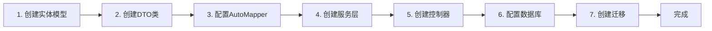

# CodeSpirit CRUD开发示例

## 概述

本文档通过**题目分类管理**（QuestionCategory）的实际代码示例，展示如何使用CodeSpirit框架快速开发CRUD功能。该示例来自考试系统（ExamApi），是一个标准的树形结构CRUD模块，包含完整的验证逻辑和业务处理。

**最后更新**: 2025年12月  
**框架版本**: v2.0.0  
**示例来源**: `CodeSpirit.ExamApi` - 题目分类管理模块

## 开发流程概览



## 示例模块说明

**题目分类管理**（QuestionCategory）是一个典型的树形结构CRUD模块，具有以下特点：

- ✅ 支持多级分类（父子关系）
- ✅ 树形结构展示
- ✅ 完整的CRUD操作
- ✅ 业务验证（防止循环引用、删除前检查）
- ✅ 多租户支持
- ✅ 审计字段自动记录

## 1. 创建实体模型

在`Data/Models`目录下创建实体类：

```csharp
// Data/Models/QuestionCategory.cs
using CodeSpirit.Shared.Entities;
using CodeSpirit.Shared.Entities.Interfaces;
using CodeSpirit.Core;
using System.ComponentModel.DataAnnotations;

namespace CodeSpirit.ExamApi.Data.Models;

/// <summary>
/// 题目分类
/// </summary>
public class QuestionCategory : LongKeyAuditableEntityBase, IMultiTenant
{
    /// <summary>
    /// 分类名称
    /// </summary>
    public string Name { get; set; } = string.Empty;

    /// <summary>
    /// 分类描述
    /// </summary>
    public string? Description { get; set; }

    /// <summary>
    /// 父分类ID
    /// </summary>
    public long? ParentId { get; set; }

    /// <summary>
    /// 父分类（导航属性）
    /// </summary>
    public QuestionCategory? Parent { get; set; }

    /// <summary>
    /// 子分类列表（导航属性）
    /// </summary>
    public List<QuestionCategory> Children { get; set; } = [];

    /// <summary>
    /// 题目列表（导航属性）
    /// </summary>
    public List<Question> Questions { get; set; } = [];

    /// <summary>
    /// 租户ID（多租户支持）
    /// </summary>
    [Required]
    [StringLength(50)]
    public string TenantId { get; set; } = string.Empty;
}
```

**说明**：
- 继承自`LongKeyAuditableEntityBase`，自动包含`Id`、`CreatedAt`、`CreatedBy`、`UpdatedAt`、`UpdatedBy`等审计字段
- 实现`IMultiTenant`接口，支持多租户数据隔离
- 使用`long`作为主键类型
- 包含父子关系的导航属性，支持树形结构

## 2. 创建DTO类

在`Dtos/QuestionCategory`目录下创建DTO类：

### 2.1 QuestionCategoryDto（展示DTO）

```csharp
// Dtos/QuestionCategory/QuestionCategoryDto.cs
using CodeSpirit.Amis.Attributes;
using CodeSpirit.Amis.Attributes.Columns;
using CodeSpirit.Core.Attributes;
using System.ComponentModel;

namespace CodeSpirit.ExamApi.Dtos.QuestionCategory;

/// <summary>
/// 题目分类DTO
/// </summary>
public class QuestionCategoryDto
{
    /// <summary>
    /// ID
    /// </summary>
    [AmisColumn(Hidden = true)]
    public long Id { get; set; }

    /// <summary>
    /// 分类名称
    /// </summary>
    [DisplayName("分类名称")]
    [TplColumn("<i class=\"${icon} mr-1\"></i> ${name}")]
    public string Name { get; set; } = string.Empty;
    
    /// <summary>
    /// 图标（用于模板显示）
    /// </summary>
    [AmisColumn(Hidden = true)]
    public string Icon { get; set; } = "fa fa-folder";
    
    /// <summary>
    /// 分类描述
    /// </summary>
    [DisplayName("描述")]
    [AmisColumn(Type = "text", Remark = "分类的详细描述信息")]
    public string? Description { get; set; }
    
    /// <summary>
    /// 父分类ID
    /// </summary>
    [AmisColumn(Hidden = true)]
    public long? ParentId { get; set; }
    
    /// <summary>
    /// 父分类名称
    /// </summary>
    [DisplayName("父分类")]
    [TplColumn("${parentName || '根分类'}")]
    [AmisColumn(Sortable = false)]
    public string? ParentName { get; set; }
    
    /// <summary>
    /// 题目数量
    /// </summary>
    [DisplayName("题目数量")]
    [TplColumn("<span class=\"badge badge-info\">${questionCount}</span>")]
    public int QuestionCount { get; set; }

    /// <summary>
    /// 更新时间
    /// </summary>
    [DisplayName("更新时间")]
    [DateColumn(Format = "YYYY-MM-DD HH:mm", FromNow = true)]
    public DateTime? UpdatedAt { get; set; }

    /// <summary>
    /// 子分类列表（用于树形展示）
    /// </summary>
    [IgnoreColumn]
    [DisplayName("子分类")]
    public List<QuestionCategoryDto> Children { get; set; } = [];
}
```

**说明**：
- `AmisColumn`特性用于控制前端表格列的显示
- `TplColumn`特性用于自定义列显示模板
- `IgnoreColumn`特性表示该字段不在表格中显示（用于树形结构）

### 2.2 CreateQuestionCategoryDto（创建DTO）

```csharp
// Dtos/QuestionCategory/CreateQuestionCategoryDto.cs
using System.ComponentModel;
using System.ComponentModel.DataAnnotations;
using CodeSpirit.Amis.Attributes.FormFields;
using CodeSpirit.Core.Attributes;

namespace CodeSpirit.ExamApi.Dtos.QuestionCategory;

/// <summary>
/// 创建题目分类DTO
/// </summary>
[AiFormFill(TriggerField = nameof(Name), ApiEndpoint = "ai-fill")]
public class CreateQuestionCategoryDto
{
    /// <summary>
    /// 分类名称
    /// </summary>
    [Required(ErrorMessage = "分类名称不能为空")]
    [StringLength(100, ErrorMessage = "分类名称最大长度为100")]
    [DisplayName("分类名称")]
    public string Name { get; set; } = string.Empty;
    
    /// <summary>
    /// 分类描述
    /// </summary>
    [StringLength(500, ErrorMessage = "分类描述最大长度为500")]
    [DisplayName("描述")]
    [Description("详细描述题目分类的特点和用途")]
    [AmisTextareaField(MaxLength = 500, ShowCounter = true)]
    [AiFieldFill(Weight = 2, Priority = 1)]
    public string? Description { get; set; }
    
    /// <summary>
    /// 父分类ID
    /// </summary>
    [DisplayName("父分类")]
    [AmisSelectField(
        Source = "${ROOT_API}/api/exam/QuestionCategories",
        ValueField = "id",
        LabelField = "name",
        Searchable = true,
        Multiple = false
    )]
    public long? ParentId { get; set; }
}
```

**说明**：
- `AiFormFill`特性启用AI表单智能填充功能
- `AmisSelectField`特性自动生成下拉选择组件，支持搜索
- `AmisTextareaField`特性生成多行文本输入框

### 2.3 UpdateQuestionCategoryDto（更新DTO）

```csharp
// Dtos/QuestionCategory/UpdateQuestionCategoryDto.cs
using System.ComponentModel;
using System.ComponentModel.DataAnnotations;
using CodeSpirit.Amis.Attributes.FormFields;

namespace CodeSpirit.ExamApi.Dtos.QuestionCategory;

/// <summary>
/// 更新题目分类DTO
/// </summary>
public class UpdateQuestionCategoryDto
{
    /// <summary>
    /// 分类名称
    /// </summary>
    [Required(ErrorMessage = "分类名称不能为空")]
    [StringLength(100, ErrorMessage = "分类名称最大长度为100")]
    [DisplayName("分类名称")]
    public string Name { get; set; } = string.Empty;
    
    /// <summary>
    /// 分类描述
    /// </summary>
    [StringLength(500, ErrorMessage = "分类描述最大长度为500")]
    [DisplayName("描述")]
    [AmisTextareaField(MaxLength = 500, ShowCounter = true)]
    public string? Description { get; set; }
    
    /// <summary>
    /// 父分类ID
    /// </summary>
    [DisplayName("父分类")]
    [AmisSelectField(
        Source = "${ROOT_API}/api/exam/QuestionCategories", 
        ValueField = "id", 
        LabelField = "name",
        Searchable = true,
        Multiple = false
    )]
    public long? ParentId { get; set; }
}
```

### 2.4 QuestionCategoryQueryDto（查询DTO）

```csharp
// Dtos/QuestionCategory/QuestionCategoryQueryDto.cs
using System.ComponentModel;
using CodeSpirit.Core.Dtos;

namespace CodeSpirit.ExamApi.Dtos.QuestionCategory;

/// <summary>
/// 题目分类查询DTO
/// </summary>
public class QuestionCategoryQueryDto : QueryDtoBase
{
    /// <summary>
    /// 关键字搜索（分类名称或描述）
    /// </summary>
    [DisplayName("关键字")]
    public string? Keywords { get; set; }
}
```

**说明**：
- `QueryDtoBase`提供了`Page`、`PerPage`、`OrderBy`、`OrderDir`等分页和排序属性
- 可以添加更多查询条件字段

## 3. 配置AutoMapper映射

在`MappingProfiles`目录下创建映射配置：

```csharp
// MappingProfiles/QuestionCategoryProfile.cs
using AutoMapper;
using CodeSpirit.ExamApi.Data.Models;
using CodeSpirit.ExamApi.Dtos.QuestionCategory;
using CodeSpirit.Shared.Extensions;

namespace CodeSpirit.ExamApi.MappingProfiles;

/// <summary>
/// 题目分类映射配置
/// </summary>
public class QuestionCategoryProfile : Profile
{
    /// <summary>
    /// 构造函数
    /// </summary>
    public QuestionCategoryProfile()
    {
        // 使用扩展方法配置基本CRUD映射（自动处理Include导航属性）
        this.ConfigureBaseCRUDIMappings<
            QuestionCategory, 
            QuestionCategoryDto, 
            long, 
            CreateQuestionCategoryDto, 
            UpdateQuestionCategoryDto,
            CreateQuestionCategoryDto>();
            
        // 自定义映射：映射父分类名称和题目数量
        CreateMap<QuestionCategory, QuestionCategoryDto>()
            .ForMember(dest => dest.ParentName, opt => opt.MapFrom(src => src.Parent != null ? src.Parent.Name : null))
            .ForMember(dest => dest.QuestionCount, opt => opt.MapFrom(src => src.Questions.Count));
            
        // 树形结构映射
        CreateMap<QuestionCategory, QuestionCategoryTreeDto>();
    }
}
```

**说明**：
- `ConfigureBaseCRUDIMappings`扩展方法自动配置基本的CRUD映射
- 使用`ForMember`自定义字段映射逻辑
- 支持多个DTO类型的映射配置

## 4. 创建服务接口和实现

### 4.1 服务接口

```csharp
// Services/Interfaces/IQuestionCategoryService.cs
using CodeSpirit.ExamApi.Data.Models;
using CodeSpirit.ExamApi.Dtos.QuestionCategory;
using CodeSpirit.Core.Dtos;
using CodeSpirit.Shared.Services;

namespace CodeSpirit.ExamApi.Services.Interfaces;

/// <summary>
/// 题目分类服务接口
/// </summary>
public interface IQuestionCategoryService : IBaseCRUDService<QuestionCategory, QuestionCategoryDto, long, CreateQuestionCategoryDto, UpdateQuestionCategoryDto>
{    
    /// <summary>
    /// 获取题目分类分页列表
    /// </summary>
    Task<PageList<QuestionCategoryDto>> GetQuestionCategoriesAsync(QuestionCategoryQueryDto queryDto);
    
    /// <summary>
    /// 获取所有题目分类（用于树形选择）
    /// </summary>
    Task<List<QuestionCategoryDto>> GetAllCategoriesAsync();

    /// <summary>
    /// 获取分类树
    /// </summary>
    Task<List<QuestionCategoryTreeDto>> GetCategoryTreeAsync();
}
```

### 4.2 服务实现

```csharp
// Services/Implementations/QuestionCategoryService.cs
using AutoMapper;
using CodeSpirit.Core;
using CodeSpirit.Core.DependencyInjection;
using CodeSpirit.ExamApi.Data.Models;
using CodeSpirit.ExamApi.Dtos.QuestionCategory;
using CodeSpirit.ExamApi.Services.Interfaces;
using CodeSpirit.Shared.Repositories;
using CodeSpirit.Shared.Services;
using LinqKit;
using Microsoft.EntityFrameworkCore;
using Microsoft.Extensions.Logging;
using System.Linq.Expressions;

namespace CodeSpirit.ExamApi.Services.Implementations;

/// <summary>
/// 题目分类服务实现
/// </summary>
public class QuestionCategoryService : BaseCRUDService<QuestionCategory, QuestionCategoryDto, long, CreateQuestionCategoryDto, UpdateQuestionCategoryDto>, IQuestionCategoryService, IScopedDependency
{
    private readonly ILogger<QuestionCategoryService> _logger;

    /// <summary>
    /// 构造函数
    /// </summary>
    /// <param name="repository">仓储接口</param>
    /// <param name="mapper">对象映射器</param>
    /// <param name="logger">日志记录器</param>
    public QuestionCategoryService(
        IRepository<QuestionCategory> repository,
        IMapper mapper,
        ILogger<QuestionCategoryService> logger)
        : base(repository, mapper)
    {
        _logger = logger;
    }

    /// <summary>
    /// 获取题目分类分页列表
    /// </summary>
    public async Task<PageList<QuestionCategoryDto>> GetQuestionCategoriesAsync(QuestionCategoryQueryDto queryDto)
    {
        var predicate = PredicateBuilder.New<QuestionCategory>(true);

        // 关键字搜索
        if (!string.IsNullOrEmpty(queryDto.Keywords))
        {
            predicate = predicate.Or(x => x.Name.Contains(queryDto.Keywords));
            predicate = predicate.Or(x => x.Description != null && x.Description.Contains(queryDto.Keywords));
        }

        // 调用基类方法，自动处理分页和排序
        return await GetPagedListAsync(
            queryDto,
            predicate,
            "Parent", "Questions"  // 包含导航属性
        );
    }

    /// <summary>
    /// 获取所有题目分类
    /// </summary>
    public async Task<List<QuestionCategoryDto>> GetAllCategoriesAsync()
    {
        var categories = await Repository.CreateQuery()
            .Include(c => c.Parent)
            .Include(c => c.Questions)
            .ToListAsync();

        return Mapper.Map<List<QuestionCategoryDto>>(categories);
    }

    /// <summary>
    /// 获取分类树形结构
    /// </summary>
    public async Task<List<QuestionCategoryTreeDto>> GetCategoryTreeAsync()
    {
        // 获取所有分类
        var categories = await Repository.CreateQuery()
            .Include(c => c.Parent)
            .ToListAsync();

        // 构建分类树
        var categoryDtos = Mapper.Map<List<QuestionCategoryTreeDto>>(categories);
        
        // 根节点列表
        var rootCategories = categoryDtos.Where(c => c.ParentId == null).ToList();
        
        // 递归构建树结构
        foreach (var rootCategory in rootCategories)
        {
            BuildCategoryTree(rootCategory, categoryDtos);
        }
        
        return rootCategories;
    }
    
    /// <summary>
    /// 递归构建分类树
    /// </summary>
    private void BuildCategoryTree(QuestionCategoryTreeDto parent, List<QuestionCategoryTreeDto> allCategories)
    {
        parent.Children = allCategories.Where(c => c.ParentId == parent.Id).ToList();
        
        foreach (var child in parent.Children)
        {
            BuildCategoryTree(child, allCategories);
        }
    }

    /// <summary>
    /// 验证创建DTO
    /// </summary>
    protected override async Task ValidateCreateDto(CreateQuestionCategoryDto createDto)
    {
        await base.ValidateCreateDto(createDto);

        // 验证父分类是否存在
        if (createDto.ParentId.HasValue)
        {
            var parentExists = await Repository.ExistsAsync(c => c.Id == createDto.ParentId.Value);
            if (!parentExists)
            {
                throw new AppServiceException(400, "父分类不存在");
            }
        }
    }

    /// <summary>
    /// 验证更新DTO
    /// </summary>
    protected override async Task ValidateUpdateDto(long id, UpdateQuestionCategoryDto updateDto)
    {
        await base.ValidateUpdateDto(id, updateDto);

        // 验证父分类是否存在
        if (updateDto.ParentId.HasValue)
        {
            // 不能将自己设为自己的父分类
            if (updateDto.ParentId.Value == id)
            {
                throw new AppServiceException(400, "不能将分类自身设为父分类");
            }

            var parentExists = await Repository.ExistsAsync(c => c.Id == updateDto.ParentId.Value);
            if (!parentExists)
            {
                throw new AppServiceException(400, "父分类不存在");
            }

            // 检查是否形成循环引用
            var parentId = updateDto.ParentId.Value;
            var maxDepth = 10; // 防止无限循环
            var depth = 0;

            while (parentId != 0 && depth < maxDepth)
            {
                var parent = await Repository.GetByIdAsync(parentId);
                if (parent == null)
                {
                    break;
                }

                if (parent.ParentId == id)
                {
                    throw new AppServiceException(400, "不能将子分类设为父分类，会形成循环引用");
                }

                parentId = parent.ParentId ?? 0;
                depth++;
            }
        }
    }

    /// <summary>
    /// 删除前验证
    /// </summary>
    protected override async Task OnDeleting(QuestionCategory entity)
    {
        await base.OnDeleting(entity);

        // 检查是否有子分类
        bool hasChildren = await Repository.CreateQuery().AnyAsync(c => c.ParentId == entity.Id);
        if (hasChildren)
        {
            throw new AppServiceException(400, "该分类下存在子分类，不能直接删除");
        }

        // 检查是否有题目关联
        if (entity.Questions.Any())
        {
            throw new AppServiceException(400, "该分类下存在题目，不能直接删除");
        }
    }
}
```

**说明**：
- 继承自`BaseCRUDService`，自动获得标准的CRUD方法
- 实现`IScopedDependency`接口，服务会自动注册
- 重写`ValidateCreateDto`和`ValidateUpdateDto`方法实现业务验证
- 重写`OnDeleting`方法实现删除前检查
- 使用`LinqKit`的`PredicateBuilder`构建动态查询条件

## 5. 创建控制器

在`Controllers`目录下创建控制器：

```csharp
// Controllers/QuestionCategoriesController.cs
using CodeSpirit.Core.Attributes;
using CodeSpirit.Core.Dtos;
using CodeSpirit.ExamApi.Dtos.QuestionCategory;
using CodeSpirit.ExamApi.Services.Interfaces;
using CodeSpirit.Shared.Dtos.Common;
using Microsoft.AspNetCore.Mvc;
using CodeSpirit.Core.Enums;

namespace CodeSpirit.ExamApi.Controllers;

/// <summary>
/// 题目分类管理控制器
/// </summary>
[DisplayName("题目分类管理")]
[Navigation(Icon = "fa-solid fa-folder-tree", PlatformType = PlatformType.Tenant)]
public class QuestionCategoriesController : ApiControllerBase
{
    private readonly IQuestionCategoryService _questionCategoryService;
    private readonly ILogger<QuestionCategoriesController> _logger;

    /// <summary>
    /// 初始化题目分类管理控制器
    /// </summary>
    /// <param name="questionCategoryService">题目分类服务</param>
    /// <param name="logger">日志记录器</param>
    public QuestionCategoriesController(
        IQuestionCategoryService questionCategoryService,
        ILogger<QuestionCategoriesController> logger)
    {
        ArgumentNullException.ThrowIfNull(questionCategoryService);
        ArgumentNullException.ThrowIfNull(logger);

        _questionCategoryService = questionCategoryService;
        _logger = logger;
    }

    /// <summary>
    /// 获取题目分类列表（支持树形展示）
    /// </summary>
    /// <param name="queryDto">查询条件</param>
    /// <returns>题目分类列表结果</returns>
    [HttpGet]
    [DisplayName("获取题目分类列表")]
    public async Task<ActionResult<ApiResponse<PageList<QuestionCategoryDto>>>> GetQuestionCategories([FromQuery] QuestionCategoryQueryDto queryDto)
    {
        // 获取所有分类数据
        List<QuestionCategoryDto> allCategories = await _questionCategoryService.GetAllCategoriesAsync();
        
        // 如果有查询关键字，进行过滤
        List<QuestionCategoryDto> filteredCategories = allCategories;
        if (!string.IsNullOrEmpty(queryDto.Keywords))
        {
            filteredCategories = allCategories.Where(c => 
                c.Name.Contains(queryDto.Keywords, StringComparison.OrdinalIgnoreCase) ||
                (!string.IsNullOrEmpty(c.Description) && c.Description.Contains(queryDto.Keywords, StringComparison.OrdinalIgnoreCase))
            ).ToList();
        }

        // 构建树形结构
        List<QuestionCategoryDto> treeCategories = BuildCategoryTree(filteredCategories);

        // 创建非分页的PageList，这样Amis会自动使用树形展示
        PageList<QuestionCategoryDto> listData = new(treeCategories, treeCategories.Count);

        return SuccessResponse(listData);
    }

    /// <summary>
    /// 获取所有题目分类
    /// </summary>
    /// <returns>所有题目分类列表</returns>
    [HttpGet("all")]
    [DisplayName("获取所有题目分类")]
    public async Task<ActionResult<ApiResponse<List<QuestionCategoryDto>>>> GetAllCategories()
    {
        List<QuestionCategoryDto> categories = await _questionCategoryService.GetAllCategoriesAsync();
        return SuccessResponse(categories);
    }

    /// <summary>
    /// 获取题目分类树形结构
    /// </summary>
    /// <returns>树形结构的题目分类列表</returns>
    [HttpGet("tree")]
    [DisplayName("获取题目分类树")]
    public async Task<ActionResult<ApiResponse<List<QuestionCategoryTreeDto>>>> GetCategoryTree()
    {
        List<QuestionCategoryTreeDto> categoryTree = await _questionCategoryService.GetCategoryTreeAsync();
        return SuccessResponse(categoryTree);
    }

    /// <summary>
    /// 获取题目分类详情
    /// </summary>
    /// <param name="id">题目分类ID</param>
    /// <returns>题目分类详细信息</returns>
    [HttpGet("{id:long}")]
    [DisplayName("获取题目分类详情")]
    public async Task<ActionResult<ApiResponse<QuestionCategoryDto>>> GetQuestionCategory(long id)
    {
        QuestionCategoryDto category = await _questionCategoryService.GetAsync(id);
        return SuccessResponse(category);
    }

    /// <summary>
    /// 创建题目分类
    /// </summary>
    /// <param name="createDto">创建题目分类请求数据</param>
    /// <returns>创建的题目分类信息</returns>
    [HttpPost]
    [DisplayName("创建题目分类")]
    public async Task<ActionResult<ApiResponse<QuestionCategoryDto>>> CreateQuestionCategory(CreateQuestionCategoryDto createDto)
    {
        ArgumentNullException.ThrowIfNull(createDto);
        QuestionCategoryDto categoryDto = await _questionCategoryService.CreateAsync(createDto);
        return SuccessResponse(categoryDto);
    }

    /// <summary>
    /// 更新题目分类
    /// </summary>
    /// <param name="id">题目分类ID</param>
    /// <param name="updateDto">更新题目分类请求数据</param>
    /// <returns>更新操作结果</returns>
    [HttpPut("{id:long}")]
    [DisplayName("更新题目分类")]
    public async Task<ActionResult<ApiResponse>> UpdateQuestionCategory(long id, UpdateQuestionCategoryDto updateDto)
    {
        await _questionCategoryService.UpdateAsync(id, updateDto);
        return SuccessResponse();
    }

    /// <summary>
    /// 删除题目分类
    /// </summary>
    /// <param name="id">题目分类ID</param>
    /// <returns>删除操作结果</returns>
    [HttpDelete("{id:long}")]
    [Operation("删除", "ajax", null, "确定要删除此题目分类吗？")]
    [DisplayName("删除题目分类")]
    public async Task<ActionResult<ApiResponse>> DeleteQuestionCategory(long id)
    {
        await _questionCategoryService.DeleteAsync(id);
        return SuccessResponse();
    }

    /// <summary>
    /// 批量删除题目分类
    /// </summary>
    /// <param name="request">批量删除请求</param>
    /// <returns>批量删除操作结果</returns>
    [HttpPost("batch-delete")]
    [Operation("批量删除", "ajax", null, "确定要批量删除选中的题目分类吗？", isBulkOperation: true)]
    [DisplayName("批量删除题目分类")]
    public async Task<ActionResult<ApiResponse>> BatchDeleteQuestionCategories([FromBody] BatchOperationDto<long> request)
    {
        ArgumentNullException.ThrowIfNull(request);
        (int successCount, List<long> failedIds) = await _questionCategoryService.BatchDeleteAsync(request.Ids);
        
        return failedIds.Any()
            ? SuccessResponse($"成功删除 {successCount} 个题目分类，但以下题目分类删除失败: {string.Join(", ", failedIds)}")
            : SuccessResponse($"成功删除 {successCount} 个题目分类！");
    }

    /// <summary>
    /// 构建分类树形结构
    /// </summary>
    /// <param name="categories">分类列表</param>
    /// <returns>树形结构的分类列表</returns>
    private static List<QuestionCategoryDto> BuildCategoryTree(List<QuestionCategoryDto> categories)
    {
        // 创建字典以便快速查找
        var categoryDict = categories.ToDictionary(c => c.Id, c => c);

        // 初始化所有分类的Children列表
        foreach (var category in categories)
        {
            category.Children = [];
        }

        // 构建父子关系
        foreach (var category in categories)
        {
            if (category.ParentId.HasValue && categoryDict.TryGetValue(category.ParentId.Value, out var parent))
            {
                parent.Children.Add(category);
            }
        }

        // 返回根节点（没有父级的分类）
        return categories.Where(c => !c.ParentId.HasValue).ToList();
    }
}
```

**说明**：
- 继承自`ApiControllerBase`，自动获得统一的响应格式和异常处理
- `DisplayName`特性用于前端界面显示
- `Navigation`特性用于添加到导航菜单
- `Operation`特性用于配置操作按钮（删除确认对话框）
- 使用`SuccessResponse`方法返回统一的成功响应

## 6. 配置数据库上下文

在`Data`目录下的DbContext中添加实体：

```csharp
// Data/ExamDbContext.cs
using CodeSpirit.ExamApi.Data.Models;
using CodeSpirit.Shared.Data;
using Microsoft.EntityFrameworkCore;

namespace CodeSpirit.ExamApi.Data;

/// <summary>
/// 考试系统数据库上下文 - 支持多租户和多数据库
/// </summary>
public class ExamDbContext : MultiDatabaseDbContextBase
{
    /// <summary>
    /// 问题分类
    /// </summary>
    public DbSet<QuestionCategory> QuestionCategories => Set<QuestionCategory>();

    protected override void OnModelCreating(ModelBuilder modelBuilder)
    {
        base.OnModelCreating(modelBuilder);

        // 配置QuestionCategory实体
        modelBuilder.Entity<QuestionCategory>(entity =>
        {
            entity.ToTable("QuestionCategories");
            entity.HasKey(e => e.Id);
            entity.Property(e => e.Name).IsRequired().HasMaxLength(50);
            entity.Property(e => e.Description).HasMaxLength(200);
            
            // 配置父子关系（可选）
            entity.HasOne(e => e.Parent)
                .WithMany(p => p.Children)
                .HasForeignKey(e => e.ParentId)
                .OnDelete(DeleteBehavior.Restrict);
        });
    }
}
```

**说明**：
- 继承自`MultiDatabaseDbContextBase`，支持MySQL和SQL Server
- 配置表名、主键、字段长度等
- 配置父子关系的级联删除策略

## 7. 服务注册

CodeSpirit框架通过标记接口自动注册服务，无需手动注册：

```csharp
// QuestionCategoryService实现了IScopedDependency接口
public class QuestionCategoryService : BaseCRUDService<...>, IQuestionCategoryService, IScopedDependency
{
    // ...
}
```

**说明**：
- 实现`IScopedDependency`接口的服务会自动注册为Scoped生命周期
- 框架会自动扫描并注册所有标记接口的服务
- 无需在`Program.cs`中手动注册

## 8. 创建数据库迁移

```bash
# 进入ExamApi项目目录
cd Src/ApiServices/CodeSpirit.ExamApi

# 创建迁移（根据数据库类型选择）
# MySQL
dotnet ef migrations add AddQuestionCategories --context MySqlExamDbContext

# SQL Server
dotnet ef migrations add AddQuestionCategories --context SqlServerExamDbContext

# 应用迁移
dotnet ef database update --context MySqlExamDbContext
# 或
dotnet ef database update --context SqlServerExamDbContext
```

## 功能特性

通过以上步骤，您已经完成了一个完整的CRUD功能开发。CodeSpirit框架会自动提供以下功能：

### 自动生成的功能

- ✅ **AMIS前端界面**：基于控制器和DTO的特性自动生成
  - 表格展示（支持树形结构）
  - 表单编辑（支持AI智能填充）
  - 搜索筛选
  - 批量操作
- ✅ **统一的API响应格式**：使用`ApiResponse<T>`统一响应
- ✅ **分页查询**：支持分页、排序、筛选
- ✅ **批量操作**：支持批量删除等操作
- ✅ **异常处理**：统一的异常处理和错误响应
- ✅ **权限控制**：支持基于特性的权限控制
- ✅ **审计日志**：自动记录创建、更新操作
- ✅ **多租户支持**：自动进行数据隔离

### 标准CRUD操作

| 操作 | HTTP方法 | 路径 | 说明 |
|------|---------|------|------|
| 查询列表 | GET | `/api/exam/QuestionCategories` | 支持树形展示和关键字搜索 |
| 查询详情 | GET | `/api/exam/QuestionCategories/{id}` | 根据ID获取单个分类 |
| 创建 | POST | `/api/exam/QuestionCategories` | 创建新分类 |
| 更新 | PUT | `/api/exam/QuestionCategories/{id}` | 更新分类信息 |
| 删除 | DELETE | `/api/exam/QuestionCategories/{id}` | 删除单个分类（带验证） |
| 批量删除 | POST | `/api/exam/QuestionCategories/batch-delete` | 批量删除分类 |
| 获取树形结构 | GET | `/api/exam/QuestionCategories/tree` | 获取树形结构的分类列表 |

## 业务验证示例

### 创建时验证

```csharp
protected override async Task ValidateCreateDto(CreateQuestionCategoryDto createDto)
{
    await base.ValidateCreateDto(createDto);

    // 验证父分类是否存在
    if (createDto.ParentId.HasValue)
    {
        var parentExists = await Repository.ExistsAsync(c => c.Id == createDto.ParentId.Value);
        if (!parentExists)
        {
            throw new AppServiceException(400, "父分类不存在");
        }
    }
}
```

### 更新时验证

```csharp
protected override async Task ValidateUpdateDto(long id, UpdateQuestionCategoryDto updateDto)
{
    await base.ValidateUpdateDto(id, updateDto);

    // 防止循环引用
    if (updateDto.ParentId.HasValue && updateDto.ParentId.Value == id)
    {
        throw new AppServiceException(400, "不能将分类自身设为父分类");
    }

    // 检查是否形成循环引用
    // ...
}
```

### 删除前验证

```csharp
protected override async Task OnDeleting(QuestionCategory entity)
{
    await base.OnDeleting(entity);

    // 检查是否有子分类
    bool hasChildren = await Repository.CreateQuery().AnyAsync(c => c.ParentId == entity.Id);
    if (hasChildren)
    {
        throw new AppServiceException(400, "该分类下存在子分类，不能直接删除");
    }

    // 检查是否有题目关联
    if (entity.Questions.Any())
    {
        throw new AppServiceException(400, "该分类下存在题目，不能直接删除");
    }
}
```

## 扩展功能示例

### 添加权限控制

```csharp
[HttpPost]
[DisplayName("创建题目分类")]
[Permission("exam_questionCategories_create")]  // 添加权限控制
public async Task<ActionResult<ApiResponse<QuestionCategoryDto>>> CreateQuestionCategory(CreateQuestionCategoryDto createDto)
{
    // ...
}
```

### 添加导航菜单

```csharp
[DisplayName("题目分类管理")]
[Navigation(Icon = "fa-solid fa-folder-tree", PlatformType = PlatformType.Tenant)]  // 添加到导航菜单
public class QuestionCategoriesController : ApiControllerBase
{
    // ...
}
```

### 自定义查询方法

```csharp
/// <summary>
/// 获取启用的分类列表
/// </summary>
public async Task<List<QuestionCategoryDto>> GetEnabledCategoriesAsync()
{
    var categories = await Repository.CreateQuery()
        .Where(c => c.IsEnabled)  // 假设有IsEnabled字段
        .Include(c => c.Parent)
        .ToListAsync();

    return Mapper.Map<List<QuestionCategoryDto>>(categories);
}
```

## 最佳实践

1. **实体设计**：
   - 继承`LongKeyAuditableEntityBase`或`IntKeyAuditableEntityBase`以获得审计字段
   - 实现`IMultiTenant`接口支持多租户
   - 合理设计导航属性，避免过度加载

2. **DTO分离**：
   - 为创建、更新、查询分别创建DTO
   - 使用`DisplayName`特性提供友好的字段名称
   - 使用`AmisColumn`特性控制前端显示

3. **服务层**：
   - 继承`BaseCRUDService`简化CRUD操作
   - 实现`IScopedDependency`接口自动注册
   - 重写验证方法实现业务逻辑验证

4. **控制器**：
   - 保持简洁，主要调用服务层方法
   - 使用`DisplayName`和`Navigation`特性
   - 使用`Operation`特性配置操作按钮

5. **验证**：
   - 使用DataAnnotations进行数据验证
   - 重写服务层的验证方法实现业务验证
   - 使用`AppServiceException`抛出业务异常

6. **文档注释**：
   - 为所有公共成员添加XML文档注释
   - 使用`<summary>`、`<param>`、`<returns>`标签

## 相关文档

- [CodeSpirit.Core核心框架](./CodeSpirit.Core核心框架.md)
- [开发环境搭建指南](./开发环境搭建指南.md)
- [项目整体架构设计](./项目整体架构设计.md)
- [统一异常处理指南](./CodeSpirit统一异常处理指南.md)

## 总结

通过CodeSpirit框架的`BaseCRUDService`和标准开发模式，您可以快速开发出功能完整的CRUD接口。题目分类管理模块展示了：

- ✅ 标准CRUD操作的实现
- ✅ 树形结构数据的处理
- ✅ 业务验证逻辑的编写
- ✅ 自定义查询方法的实现
- ✅ AMIS特性的使用

框架会自动处理大部分样板代码，让您专注于业务逻辑的实现。

祝您开发愉快！🚀
