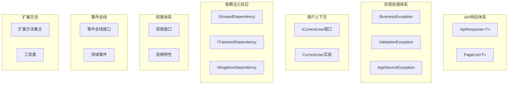

# CodeSpirit.Core 核心框架

## 概述

CodeSpirit.Core是整个框架的核心模块，定义了系统的基础抽象、通用类型和核心接口。它遵循Clean Architecture的领域层设计原则，不依赖任何外部框架，为整个系统提供稳定的基础。

## 核心组件架构



## 1. API响应体系

### 1.1 ApiResponse<T> - 统一API响应格式

**设计目的**: 为所有API提供统一的响应格式，确保前后端交互的一致性。

```csharp
/// <summary>
/// 通用 API 响应封装类
/// </summary>
/// <typeparam name="T">数据类型</typeparam>
public class ApiResponse<T> where T : class
{
    /// <summary>
    /// 状态码，0 表示成功，非 0 表示错误
    /// </summary>
    public int Status { get; set; }

    /// <summary>
    /// 响应消息
    /// </summary>
    public string Msg { get; set; }

    /// <summary>
    /// 响应数据
    /// </summary>
    public T Data { get; set; }

    /// <summary>
    /// 创建成功响应
    /// </summary>
    public static ApiResponse<T> Success(T data, string msg = "操作成功！")
    {
        return new ApiResponse<T>(0, msg, data);
    }

    /// <summary>
    /// 创建错误响应
    /// </summary>
    public static ApiResponse<T> Error(int status, string msg, T data = null)
    {
        return new ApiResponse<T>(status, msg, data);
    }
}
```

**使用示例**:
```csharp
// 成功响应
return Ok(ApiResponse<UserDto>.Success(userDto, "用户创建成功"));

// 错误响应
return BadRequest(ApiResponse<string>.Error(400, "用户名已存在"));
```

### 1.2 PageList<T> - 分页数据封装

**设计目的**: 提供统一的分页数据结构，支持前端分页组件。

```csharp
/// <summary>
/// 列表数据封装类
/// </summary>
/// <typeparam name="T">数据类型</typeparam>
public class PageList<T>
{
    /// <summary>
    /// 数据项列表
    /// </summary>
    public List<T> Items { get; set; }

    /// <summary>
    /// 总数
    /// </summary>
    public int Total { get; set; }

    public PageList() { }

    public PageList(List<T> items, int total)
    {
        Items = items;
        Total = total;
    }
}
```

**使用示例**:
```csharp
// 创建分页数据
var users = await userRepository.GetUsersAsync(pageIndex, pageSize);
var totalCount = await userRepository.GetUserCountAsync();
var pageList = new PageList<UserDto>(users, totalCount);

return Ok(ApiResponse<PageList<UserDto>>.Success(pageList));
```

## 2. 异常处理体系

### 2.1 BusinessException - 业务异常

**设计目的**: 处理业务逻辑相关的异常情况。

```csharp
/// <summary>
/// 业务异常类
/// </summary>
public class BusinessException : Exception
{
    public int ErrorCode { get; }

    public BusinessException(string message) : base(message)
    {
        ErrorCode = 400;
    }

    public BusinessException(int errorCode, string message) : base(message)
    {
        ErrorCode = errorCode;
    }

    public BusinessException(string message, Exception innerException) 
        : base(message, innerException)
    {
        ErrorCode = 400;
    }
}
```

### 2.2 ValidationException - 验证异常

**设计目的**: 处理数据验证相关的异常。

```csharp
/// <summary>
/// 验证异常类
/// </summary>
public class ValidationException : Exception
{
    public Dictionary<string, string[]> Errors { get; }

    public ValidationException(string message) : base(message)
    {
        Errors = new Dictionary<string, string[]>();
    }

    public ValidationException(Dictionary<string, string[]> errors) 
        : base("验证失败")
    {
        Errors = errors;
    }
}
```

### 2.3 AppServiceException - 应用服务异常

**设计目的**: 处理应用服务层的异常。

```csharp
/// <summary>
/// 应用服务异常类
/// </summary>
public class AppServiceException : Exception
{
    public AppServiceException(string message) : base(message) { }
    
    public AppServiceException(string message, Exception innerException) 
        : base(message, innerException) { }
}
```

## 3. 用户上下文体系

### 3.1 ICurrentUser - 当前用户接口

**设计目的**: 提供当前登录用户信息的抽象接口。

```csharp
/// <summary>
/// 当前用户接口
/// </summary>
public interface ICurrentUser
{
    /// <summary>
    /// 用户ID
    /// </summary>
    long? Id { get; }

    /// <summary>
    /// 用户名
    /// </summary>
    string UserName { get; }

    /// <summary>
    /// 用户邮箱
    /// </summary>
    string Email { get; }

    /// <summary>
    /// 用户角色
    /// </summary>
    IEnumerable<string> Roles { get; }

    /// <summary>
    /// 是否已认证
    /// </summary>
    bool IsAuthenticated { get; }

    /// <summary>
    /// 获取声明值
    /// </summary>
    string GetClaimValue(string claimType);

    /// <summary>
    /// 是否在角色中
    /// </summary>
    bool IsInRole(string role);

    /// <summary>
    /// 是否有权限
    /// </summary>
    bool HasPermission(string permission);
}
```

## 4. 依赖注入标记接口

### 4.1 生命周期标记接口

**设计目的**: 通过标记接口自动注册服务，简化依赖注入配置。

```csharp
/// <summary>
/// 作用域注入标记接口
/// 在同一个作用域中构造的是同一个实例
/// </summary>
public interface IScopedDependency
{
}

/// <summary>
/// 瞬时注入标记接口
/// 每次请求都创建新实例
/// </summary>
public interface ITransientDependency
{
}

/// <summary>
/// 单例注入标记接口
/// 整个应用程序生命周期中只有一个实例
/// </summary>
public interface ISingletonDependency
{
}
```

### 4.2 自动注册扩展

```csharp
public static class ServiceCollectionExtensions
{
    /// <summary>
    /// 自动注册标记接口的服务
    /// </summary>
    public static IServiceCollection AddAutoRegistration(
        this IServiceCollection services, 
        params Assembly[] assemblies)
    {
        // 注册 Scoped 服务
        services.Scan(scan => scan
            .FromAssemblies(assemblies)
            .AddClasses(classes => classes.AssignableTo<IScopedDependency>())
            .AsImplementedInterfaces()
            .WithScopedLifetime());

        // 注册 Transient 服务
        services.Scan(scan => scan
            .FromAssemblies(assemblies)
            .AddClasses(classes => classes.AssignableTo<ITransientDependency>())
            .AsImplementedInterfaces()
            .WithTransientLifetime());

        // 注册 Singleton 服务
        services.Scan(scan => scan
            .FromAssemblies(assemblies)
            .AddClasses(classes => classes.AssignableTo<ISingletonDependency>())
            .AsImplementedInterfaces()
            .WithSingletonLifetime());

        return services;
    }
}
```

## 5. 权限体系

### 5.1 权限接口定义

```csharp
/// <summary>
/// 权限服务接口
/// </summary>
public interface IPermissionService
{
    /// <summary>
    /// 检查用户是否有指定权限
    /// </summary>
    Task<bool> HasPermissionAsync(long userId, string permission);

    /// <summary>
    /// 获取用户所有权限
    /// </summary>
    Task<IEnumerable<string>> GetUserPermissionsAsync(long userId);

    /// <summary>
    /// 获取权限树
    /// </summary>
    List<PermissionNode> GetPermissionTree();
}
```

### 5.2 权限特性

```csharp
/// <summary>
/// 权限要求特性
/// </summary>
[AttributeUsage(AttributeTargets.Class | AttributeTargets.Method)]
public class RequirePermissionAttribute : Attribute
{
    public string Permission { get; }

    public RequirePermissionAttribute(string permission)
    {
        Permission = permission;
    }
}
```

## 6. 事件总线体系

### 6.1 领域事件接口

```csharp
/// <summary>
/// 领域事件接口
/// </summary>
public interface IDomainEvent
{
    /// <summary>
    /// 事件ID
    /// </summary>
    Guid EventId { get; }

    /// <summary>
    /// 发生时间
    /// </summary>
    DateTime OccurredOn { get; }
}

/// <summary>
/// 事件处理器接口
/// </summary>
/// <typeparam name="T">事件类型</typeparam>
public interface IEventHandler<in T> where T : IDomainEvent
{
    /// <summary>
    /// 处理事件
    /// </summary>
    Task HandleAsync(T @event);
}
```

### 6.2 事件总线接口

```csharp
/// <summary>
/// 事件总线接口
/// </summary>
public interface IEventBus
{
    /// <summary>
    /// 发布事件
    /// </summary>
    Task PublishAsync<T>(T @event) where T : IDomainEvent;

    /// <summary>
    /// 订阅事件
    /// </summary>
    void Subscribe<T, TH>()
        where T : IDomainEvent
        where TH : IEventHandler<T>;
}
```

## 7. 扩展方法集合

### 7.1 字符串扩展

```csharp
public static class StringExtensions
{
    /// <summary>
    /// 判断字符串是否为空或null
    /// </summary>
    public static bool IsNullOrEmpty(this string str)
    {
        return string.IsNullOrEmpty(str);
    }

    /// <summary>
    /// 判断字符串是否为空白或null
    /// </summary>
    public static bool IsNullOrWhiteSpace(this string str)
    {
        return string.IsNullOrWhiteSpace(str);
    }

    /// <summary>
    /// 安全截取字符串
    /// </summary>
    public static string SafeSubstring(this string str, int startIndex, int length)
    {
        if (str.IsNullOrEmpty() || startIndex >= str.Length)
            return string.Empty;

        if (startIndex + length > str.Length)
            length = str.Length - startIndex;

        return str.Substring(startIndex, length);
    }
}
```

### 7.2 集合扩展

```csharp
public static class CollectionExtensions
{
    /// <summary>
    /// 判断集合是否为空或null
    /// </summary>
    public static bool IsNullOrEmpty<T>(this IEnumerable<T> source)
    {
        return source == null || !source.Any();
    }

    /// <summary>
    /// 安全的ForEach操作
    /// </summary>
    public static void SafeForEach<T>(this IEnumerable<T> source, Action<T> action)
    {
        if (source.IsNullOrEmpty() || action == null)
            return;

        foreach (var item in source)
        {
            action(item);
        }
    }
}
```

## 8. 工具类

### 8.1 ID生成器

```csharp
/// <summary>
/// ID生成器接口
/// </summary>
public interface IIdGenerator
{
    /// <summary>
    /// 生成长整型ID
    /// </summary>
    long NextId();

    /// <summary>
    /// 生成字符串ID
    /// </summary>
    string NextStringId();
}

/// <summary>
/// 雪花算法ID生成器
/// </summary>
public class SnowflakeIdGenerator : IIdGenerator, ISingletonDependency
{
    // 雪花算法实现...
}
```

### 8.2 时间工具

```csharp
/// <summary>
/// 时间工具类
/// </summary>
public static class TimeHelper
{
    /// <summary>
    /// 获取当前时间戳（毫秒）
    /// </summary>
    public static long GetCurrentTimestamp()
    {
        return DateTimeOffset.UtcNow.ToUnixTimeMilliseconds();
    }

    /// <summary>
    /// 时间戳转DateTime
    /// </summary>
    public static DateTime TimestampToDateTime(long timestamp)
    {
        return DateTimeOffset.FromUnixTimeMilliseconds(timestamp).DateTime;
    }

    /// <summary>
    /// DateTime转时间戳
    /// </summary>
    public static long DateTimeToTimestamp(DateTime dateTime)
    {
        return new DateTimeOffset(dateTime).ToUnixTimeMilliseconds();
    }
}
```

## 9. 使用示例

### 9.1 创建业务服务

```csharp
public class UserService : IUserService, IScopedDependency
{
    private readonly IRepository<User> _userRepository;
    private readonly ICurrentUser _currentUser;
    private readonly IEventBus _eventBus;

    public UserService(
        IRepository<User> userRepository,
        ICurrentUser currentUser,
        IEventBus eventBus)
    {
        _userRepository = userRepository;
        _currentUser = currentUser;
        _eventBus = eventBus;
    }

    public async Task<ApiResponse<UserDto>> CreateUserAsync(CreateUserDto dto)
    {
        try
        {
            // 业务验证
            if (await _userRepository.AnyAsync(u => u.UserName == dto.UserName))
            {
                throw new BusinessException("用户名已存在");
            }

            // 创建用户
            var user = new User
            {
                UserName = dto.UserName,
                Email = dto.Email,
                CreatedBy = _currentUser.Id,
                CreatedAt = DateTime.UtcNow
            };

            await _userRepository.AddAsync(user);

            // 发布领域事件
            await _eventBus.PublishAsync(new UserCreatedEvent
            {
                UserId = user.Id,
                UserName = user.UserName,
                OccurredOn = DateTime.UtcNow
            });

            var userDto = user.MapTo<UserDto>();
            return ApiResponse<UserDto>.Success(userDto, "用户创建成功");
        }
        catch (BusinessException ex)
        {
            return ApiResponse<UserDto>.Error(ex.ErrorCode, ex.Message);
        }
    }
}
```

### 9.2 控制器使用

```csharp
[ApiController]
[Route("api/[controller]")]
public class UsersController : ControllerBase
{
    private readonly IUserService _userService;

    public UsersController(IUserService userService)
    {
        _userService = userService;
    }

    [HttpPost]
    [RequirePermission("User.Create")]
    public async Task<IActionResult> CreateUser(CreateUserDto dto)
    {
        var result = await _userService.CreateUserAsync(dto);
        
        if (result.Status == 0)
            return Ok(result);
        else
            return BadRequest(result);
    }

    [HttpGet]
    public async Task<IActionResult> GetUsers([FromQuery] UserQueryDto query)
    {
        var result = await _userService.GetUsersAsync(query);
        return Ok(result);
    }
}
```

## 10. 最佳实践

### 10.1 异常处理

1. **使用特定的异常类型**：根据不同的错误场景使用相应的异常类型
2. **提供有意义的错误消息**：错误消息应该清晰地描述问题
3. **避免暴露敏感信息**：不要在异常消息中包含敏感数据

### 10.2 依赖注入

1. **优先使用接口**：通过接口定义依赖关系
2. **合理选择生命周期**：根据服务特性选择合适的生命周期
3. **避免循环依赖**：设计时注意避免服务间的循环依赖

### 10.3 API设计

1. **统一响应格式**：所有API都应该使用ApiResponse格式
2. **合理的HTTP状态码**：根据操作结果返回合适的状态码
3. **清晰的错误信息**：提供有助于调试的错误信息

## 总结

CodeSpirit.Core作为框架的核心模块，提供了：

1. **统一的API响应格式**：确保前后端交互的一致性
2. **完善的异常处理体系**：支持不同类型的异常处理
3. **灵活的依赖注入机制**：通过标记接口简化服务注册
4. **强大的权限体系**：支持细粒度的权限控制
5. **事件驱动架构支持**：通过事件总线实现松耦合
6. **丰富的扩展方法**：提供常用的工具方法

这些核心组件为整个框架提供了坚实的基础，确保了系统的稳定性、可扩展性和可维护性。 