# CodeSpirit Development Environment Setup Guide

## Overview

This guide will help you quickly set up the development environment for CodeSpirit (码灵), a low-code development framework. CodeSpirit is built on .NET 10 and Aspire 13.0, and you can start the complete development environment with just a few simple steps.

**Last Updated**: December 2025  
**Framework Version**: v2.0.0

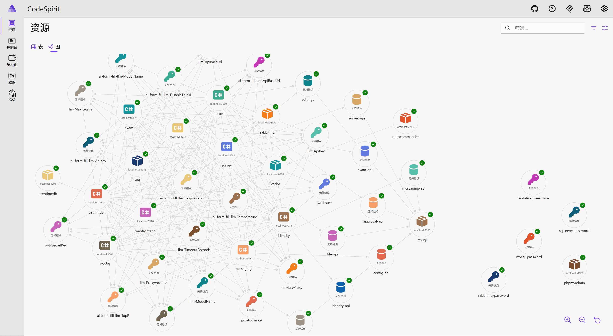

## Quick Start

### Prerequisites

- **Operating System**: Windows 10/11, macOS 12+, or Linux (Ubuntu 20.04+)
- **CPU**: Intel i5 or AMD Ryzen 5 and above (i7/Ryzen 7 recommended)
- **Memory**: 16GB RAM (32GB recommended)
- **Storage**: At least 20GB free space (SSD recommended)

> **Note**: CodeSpirit uses GreptimeDB by default for audit log storage and search. Elasticsearch is an optional component. Please refer to the relevant configuration documentation if needed.

### 1. Install .NET 10 SDK

#### Windows
```powershell
# Install using winget
winget install Microsoft.DotNet.SDK.10

# Or download installer
# https://dotnet.microsoft.com/download/dotnet/10.0
```

#### macOS
```bash
# Using Homebrew
brew install --cask dotnet-sdk

# Or download installer
# https://dotnet.microsoft.com/download/dotnet/10.0
```

#### Linux (Ubuntu)
```bash
# Add Microsoft package source
wget https://packages.microsoft.com/config/ubuntu/22.04/packages-microsoft-prod.deb -O packages-microsoft-prod.deb
sudo dpkg -i packages-microsoft-prod.deb
sudo apt-get update
sudo apt-get install -y dotnet-sdk-10.0
```

#### Verify Installation
```bash
dotnet --version
# Should display 10.x.x
```

### 2. Install Development Tools

#### Visual Studio 2024 (Recommended)
- Download: https://visualstudio.microsoft.com/vs/
- Select workload: **ASP.NET and Web Development**

#### Or Visual Studio Code
```bash
# Windows
winget install Microsoft.VisualStudioCode

# macOS
brew install --cask visual-studio-code

# Linux
sudo snap install code --classic
```

Required VS Code extensions:
```bash
code --install-extension ms-dotnettools.csharp
code --install-extension ms-dotnettools.vscode-dotnet-runtime
```

### 3. Install Docker Desktop

- Download: https://www.docker.com/products/docker-desktop
- Start Docker Desktop after installation

Verify installation:
```bash
docker --version
```

## Project Startup

### 1. Clone Project

```bash
git clone https://gitee.com/magicodes/code-spirit.git
cd code-spirit
```

### 2. Start Base Services

CodeSpirit uses Aspire to automatically manage all dependent services, no need to manually start Docker containers:

```bash
# Aspire will automatically start the following services:
# - MySQL/SQL Server (selected based on configuration, ports: 3306/1433)
# - Redis (port: 6380)
# - RabbitMQ (port: 5672, management interface: 15672)
# - GreptimeDB (ports: 4000/4001)
# - Seq logging service (port: 5341)
```

> **Service Description**:
> - **MySQL/SQL Server**: Main database storage (selected based on DatabaseType configuration)
> - **Redis**: Cache and session storage (port: 6380)
> - **RabbitMQ**: Message queue service (management interface port: 15672)
> - **GreptimeDB**: Time-series database for audit log storage (HTTP port: 4000, gRPC port: 4001)
> - **Seq**: Structured logging service (port: 5341)

### 3. Run Project

#### Using .NET Aspire (Recommended)

```bash
# Navigate to AppHost project directory
cd Src/CodeSpirit.AppHost

# Run Aspire application
dotnet run
```

If startup is successful, you will see colorful console output like this:

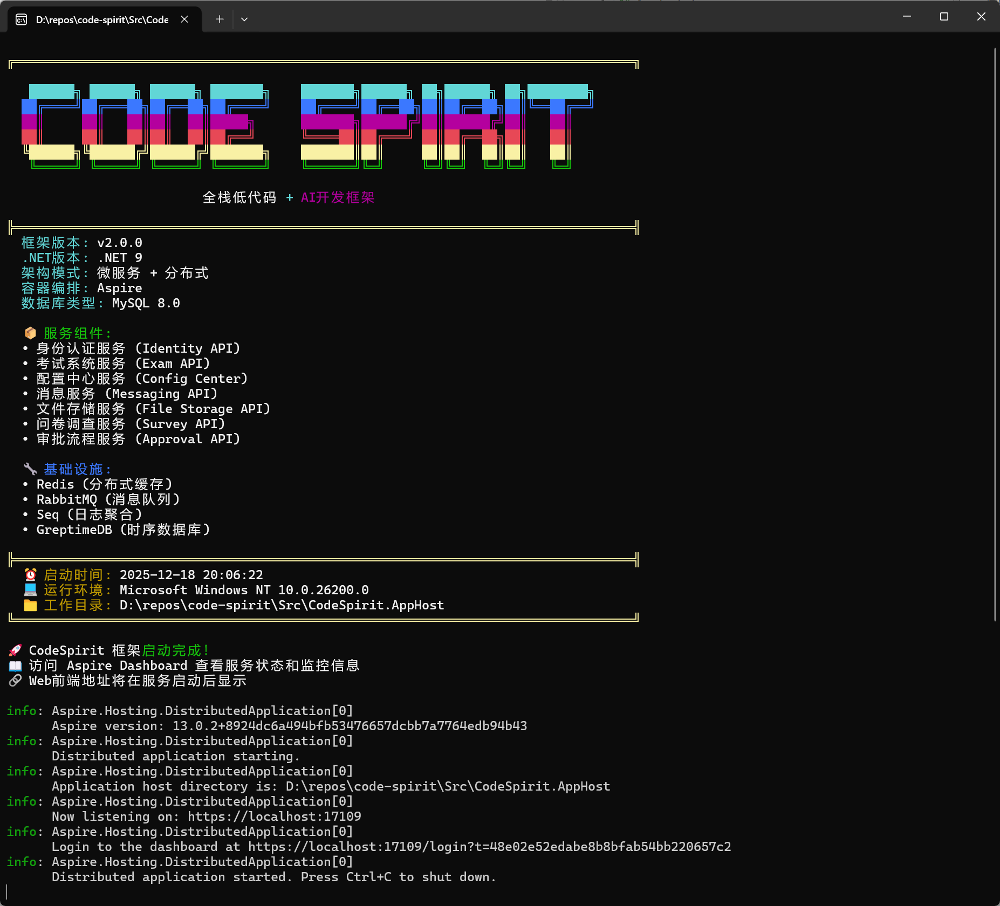

After startup, access:
- **Aspire Dashboard**: http://localhost:17109 (opens automatically)
- **Web Application**: https://localhost:7120 (specific port displayed after startup)

> **Note**: Actual port numbers may vary based on system configuration. Please check the Aspire Dashboard for accurate port information.

#### Or Using Visual Studio

1. Open `CodeSpirit.sln`

2. Set `CodeSpirit.AppHost` as startup project

3. Press F5 to run

   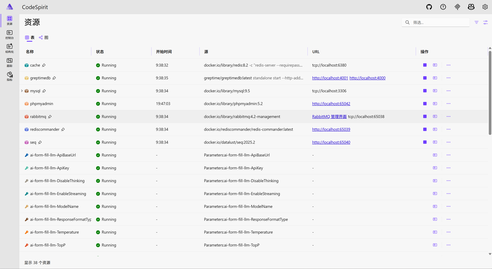

   Note: Ensure all the following services start normally:

   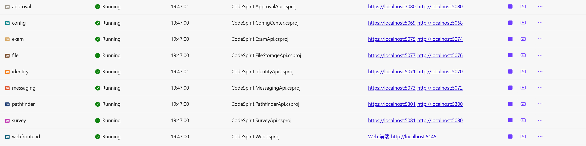

## Project Structure

CodeSpirit adopts Clean Architecture design with the following project structure:

```
CodeSpirit/
├── Src/
│   ├── ApiServices/                     # API Services (Solution Folder)
│   │   ├── CodeSpirit.IdentityApi/      # Identity Authentication API
│   │   ├── CodeSpirit.ExamApi/          # Exam System API  
│   │   ├── CodeSpirit.MessagingApi/     # Messaging Service API
│   │   ├── CodeSpirit.ConfigCenter/    # Config Center API
│   │   ├── CodeSpirit.FileStorageApi/  # File Storage API
│   │   ├── CodeSpirit.SurveyApi/        # Survey API
│   │   ├── CodeSpirit.ApprovalApi/      # Approval Workflow API
│   │   ├── CodeSpirit.PathfinderApi/    # AI Goal Management API
│   │   └── CodeSpirit.AiCardsApi/       # AI Cards API
│   ├── Components/                     # Component Library
│   │   ├── CodeSpirit.Aggregator/       # Aggregator Component
│   │   ├── CodeSpirit.AiFormFill/       # AI Form Smart Fill Component
│   │   ├── CodeSpirit.Amis/             # UI Generation Engine
│   │   ├── CodeSpirit.Authorization/    # Authorization Component
│   │   ├── CodeSpirit.Audit/            # Audit Component
│   │   ├── CodeSpirit.Caching/          # Distributed Cache Component
│   │   ├── CodeSpirit.Charts/           # Smart Charts Component
│   │   ├── CodeSpirit.ConfigCenter.Client/ # Config Center Client
│   │   ├── CodeSpirit.LLM/              # Large Language Model Component
│   │   ├── CodeSpirit.Messaging/        # Message Queue Component
│   │   ├── CodeSpirit.MultiTenant/      # Multi-Tenant Component
│   │   ├── CodeSpirit.Navigation/       # Navigation Component
│   │   ├── CodeSpirit.PdfGeneration/    # PDF Generation Component
│   │   ├── CodeSpirit.ScheduledTasks/   # Scheduled Tasks Component
│   │   ├── CodeSpirit.Settings/         # Settings Management Component
│   │   ├── CodeSpirit.Shared/           # Component Shared Library
│   │   └── CodeSpirit.UdlCards/         # UDL Cards Component
│   ├── CodeSpirit.AppHost/              # Aspire Application Host
│   ├── CodeSpirit.Core/                 # Core Framework Definitions
│   ├── CodeSpirit.ServiceDefaults/      # Service Default Configuration
│   ├── CodeSpirit.Shared/               # Global Shared Library
│   └── CodeSpirit.Web/                  # Web Frontend Project
├── Tests/                               # Test Projects
├── Docs/                                # Project Documentation
├── k8s/                                 # Kubernetes Deployment Files
└── CodeSpirit.sln                       # Solution File
```

## Default Configuration

The project uses the following default configurations, automatically managed by .NET Aspire:

### Database Connections
- **Database Type**: Supports both MySQL and SQL Server (selected via `DatabaseType` configuration)

- **MySQL**: Port 3306, automatically configured by Aspire

  You can access the management UI (phpmyadmin) from the resource panel:

  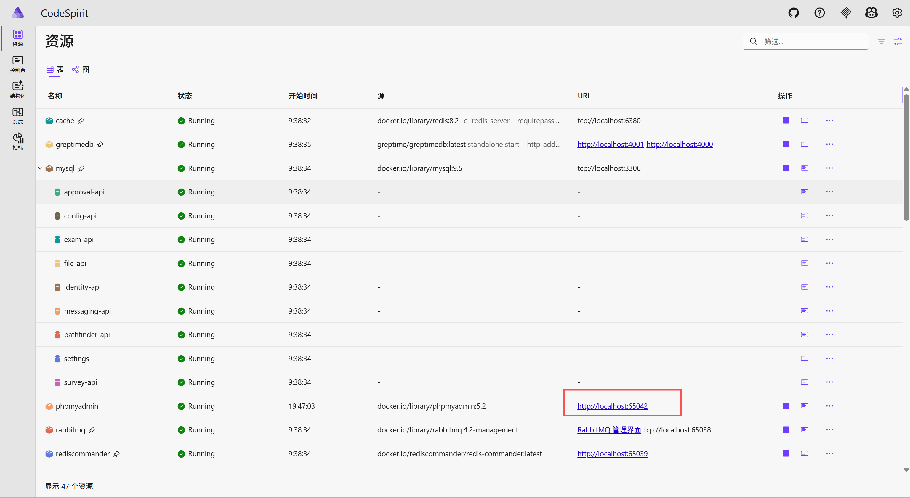

  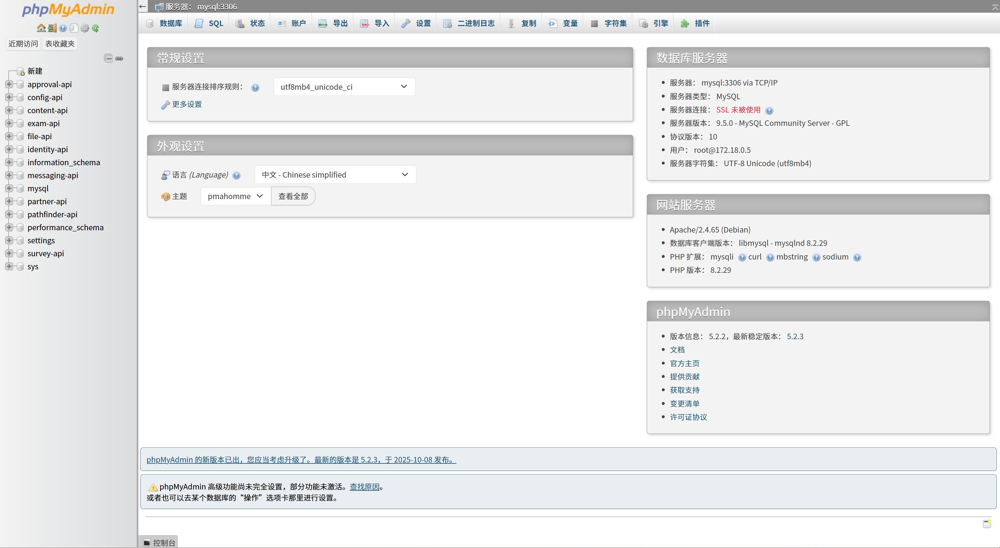

- **SQL Server**: Port 1433, automatically configured by Aspire

- **Database**: Automatically created and migrated

- **Connection String**: Automatically managed by Aspire

### Cache and Message Queue
- **Redis**: `localhost:6380` (see management UI for specific port)

- **RabbitMQ**: `localhost:5672` (Management interface: http://localhost:15672, username/password: admin/Password123)

  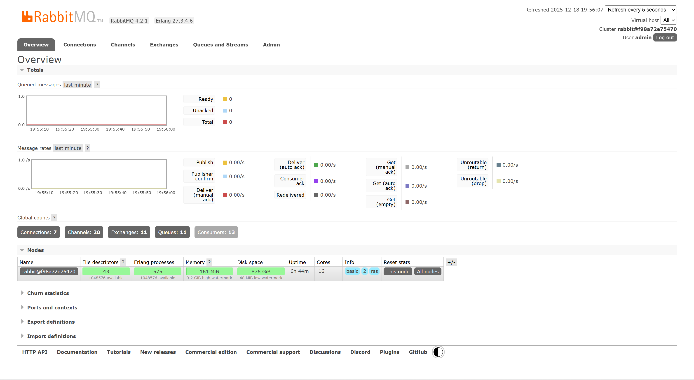

### Other Service Ports
- **GreptimeDB**: 
  
  - HTTP port: `localhost:4000`
  - gRPC port: `localhost:4001`
  - Health check: http://localhost:4000/health
  
- **Seq Logging Service**: `localhost:5341` (see resource panel for specific port)

  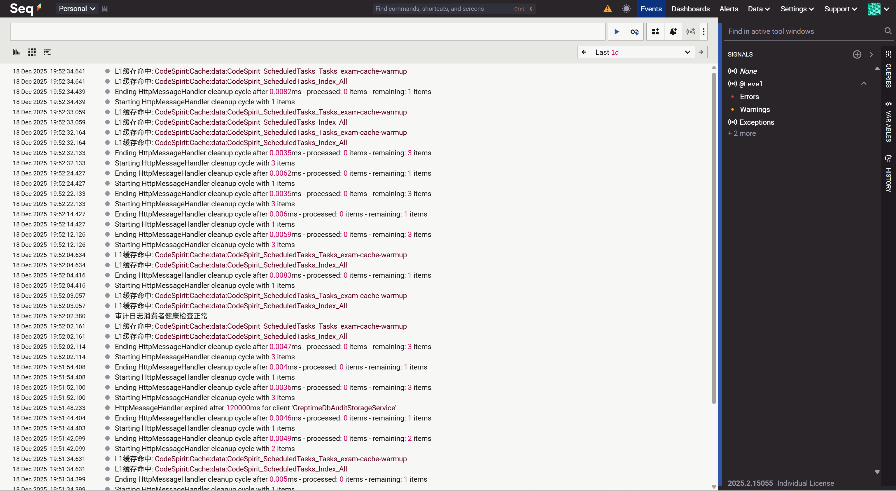

- **Redis Commander**: Access via Aspire Dashboard

  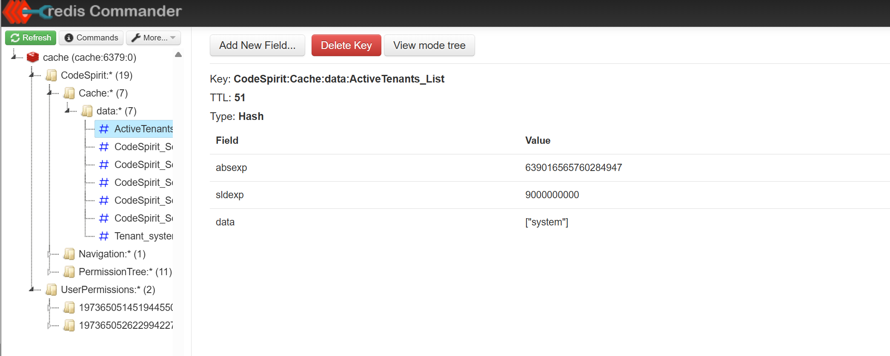


## Development Tool Configuration

### Visual Studio Code

Create `.vscode/launch.json`:

```json
{
  "version": "0.2.0",
  "configurations": [
    {
      "name": "Launch CodeSpirit",
      "type": "coreclr",
      "request": "launch",
      "preLaunchTask": "build",
      "program": "${workspaceFolder}/Src/CodeSpirit.AppHost/bin/Debug/net10.0/CodeSpirit.AppHost.dll",
      "cwd": "${workspaceFolder}/Src/CodeSpirit.AppHost",
      "env": {
        "ASPNETCORE_ENVIRONMENT": "Development"
      }
    }
  ]
}
```

Create `.vscode/tasks.json`:

```json
{
  "version": "2.0.0",
  "tasks": [
    {
      "label": "build",
      "command": "dotnet",
      "type": "process",
      "args": ["build", "${workspaceFolder}/CodeSpirit.sln"],
      "problemMatcher": "$msCompile"
    }
  ]
}
```

## Verification

### 1. Check Service Status

Access Aspire Dashboard (http://localhost:17109) to confirm all services are running normally:

- ✅ CodeSpirit.Web (Web Frontend)
- ✅ CodeSpirit.IdentityApi (Identity Authentication)
- ✅ CodeSpirit.ConfigCenter (Config Center)
- ✅ CodeSpirit.MessagingApi (Messaging Service)
- ✅ CodeSpirit.ExamApi (Exam System)
- ✅ CodeSpirit.FileStorageApi (File Storage)
- ✅ CodeSpirit.SurveyApi (Survey)
- ✅ CodeSpirit.ApprovalApi (Approval Workflow)
- ✅ CodeSpirit.PathfinderApi (AI Goal Management)
- ✅ MySQL/SQL Server (Database, based on configuration)
- ✅ Redis (Cache)
- ✅ RabbitMQ (Message Queue)
- ✅ GreptimeDB (Time-series Database)
- ✅ Seq (Logging Service)

### 2. Check Errors

Open the structured logging panel to check for any errors:

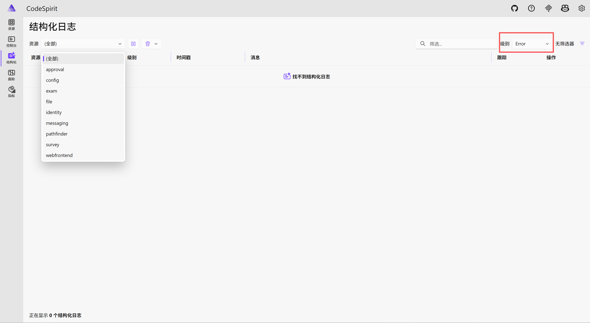

### 3. Access Web Interface

System Platform: https://localhost:7120

Account: systemadmin 

Password: CodeSpirit@2025

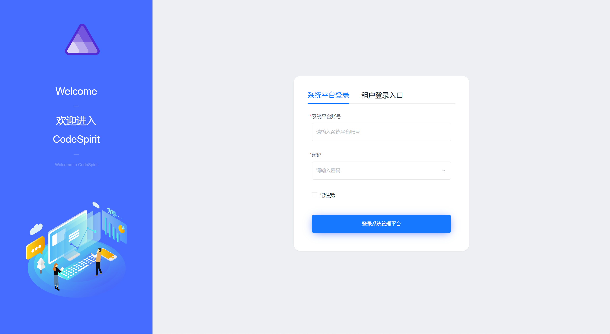

After login, you can see the system platform backend management UI:

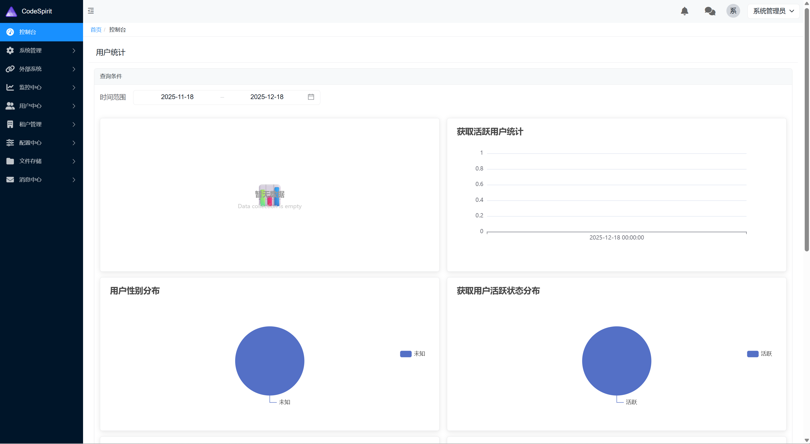

Tenant Platform (default tenant): https://localhost:7120/default/login

Account: admin

Password: 123@Admin

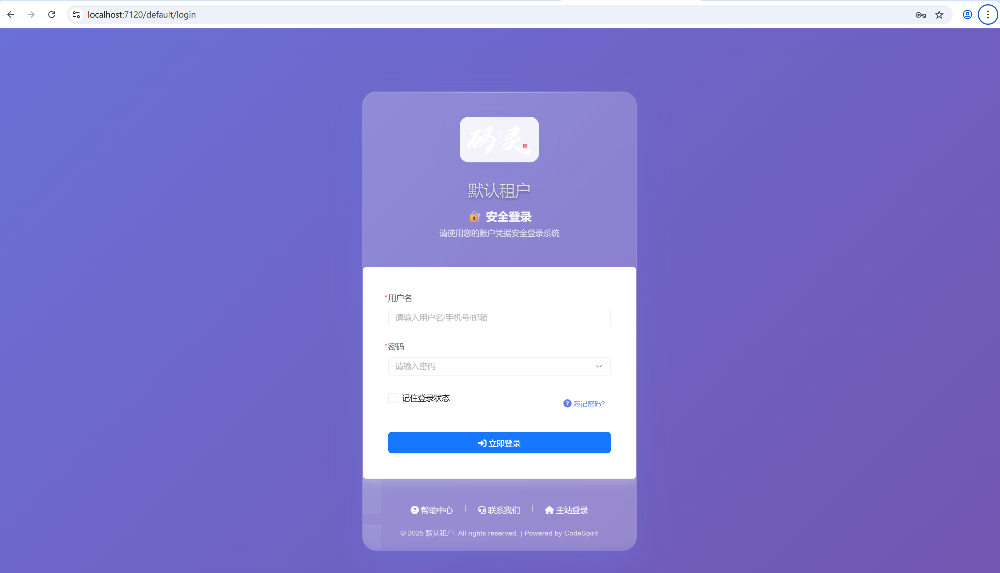

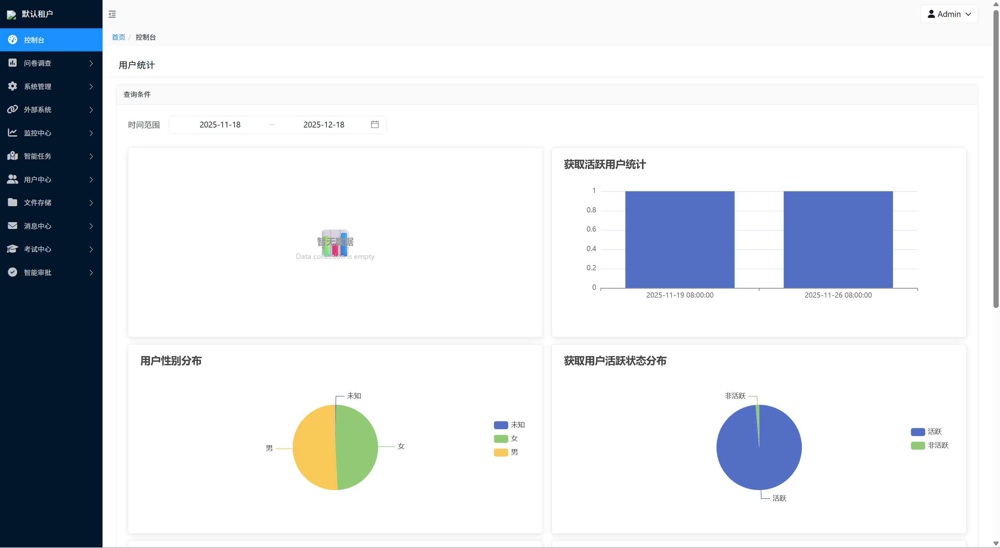

## Common Issues

### Unable to Open Web Pages

This is usually caused by the following situations:

1. Unable to pull images, which can usually be seen in the Docker panel or Aspire management panel logs. It is recommended to configure image sources or use a VPN.

2. Critical service failure, such as Web service failure.

3. Port conflicts or network errors. Check the startup console for errors:

   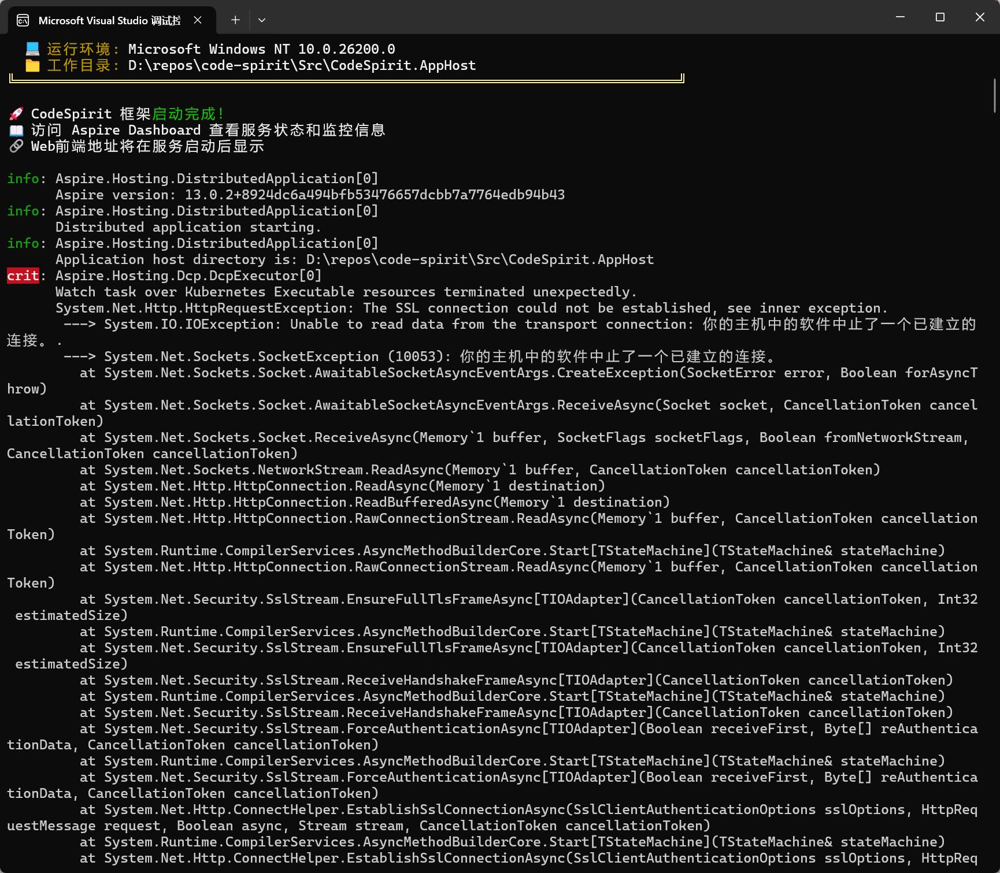

### Port Conflicts
If encountering port conflicts, modify port configuration in `Src/CodeSpirit.AppHost/Program.cs`.

### Docker Service Startup Failure
Since the project uses .NET Aspire to manage services, if encountering service startup issues:

```bash
# Restart Aspire application
cd Src/CodeSpirit.AppHost
dotnet run --force

# Check service status in Aspire Dashboard
# Access http://localhost:17109
```

### GreptimeDB Startup Failure
```bash
# Check GreptimeDB status in Aspire Dashboard
# If memory insufficient, adjust GreptimeDB configuration in Program.cs

# Check system resource usage
# GreptimeDB requires at least 512MB memory
```

### SSL Certificate Issues
```bash
# Trust development certificate
dotnet dev-certs https --trust
```

### Database Connection Issues
```bash
# Check database container status (based on configured database type)
docker ps | grep mysql    # MySQL
docker ps | grep sqlserver # SQL Server

# Restart database container
docker restart mysql      # MySQL
docker restart sqlserver  # SQL Server

# Or check database status and connection information in Aspire Dashboard
```

### Insufficient Memory
If system memory is insufficient, you can:
1. Close unnecessary applications
2. Adjust GreptimeDB memory settings (in Program.cs)
3. Consider upgrading system memory to recommended configuration (16GB recommended, 32GB better)

## Development Mode

### Hot Reload Development

```bash
# Enable hot reload
cd Src/CodeSpirit.AppHost
dotnet watch run
```

### Debug Mode

Set breakpoints in Visual Studio or VS Code, press F5 to start debugging.

## Production Deployment

### Using Kubernetes Deployment

The project provides complete Kubernetes deployment files:

```bash
# Deploy to Kubernetes cluster
kubectl apply -f k8s/

# Check deployment status
kubectl get pods -n code-spirit-release
```

### Using Docker Deployment

```bash
# Build Docker images for all services
dotnet publish CodeSpirit.sln -c Release

# Build images using project-provided Dockerfiles
docker build -f Src/CodeSpirit.Web/Dockerfile -t codespirit-web:latest .
docker build -f Src/CodeSpirit.IdentityApi/Dockerfile -t codespirit-identity:latest .
```

### Configuration Management

Production environment configuration is managed through:
- **Kubernetes ConfigMap**: Store application configuration
- **Kubernetes Secret**: Store sensitive information
- **Config Center**: Dynamic configuration management

## Next Steps

After environment setup is complete, you can:

1. 📖 Read [Project Overall Architecture Design](./Project%20Overall%20Architecture%20Design.md)
2. 🔧 Learn about [CodeSpirit.Core Core Framework](./CodeSpirit.Core%20Core%20Framework.md)
3. 📋 Review [Overall Technical System Overview](./Overall%20Technical%20System%20Overview.md)
4. 🔐 Study [Unified Exception Handling Guide](./CodeSpirit%20Unified%20Exception%20Handling%20Guide.md)
5. 💻 Reference [CRUD Development Example](./CRUD%20Development%20Example.md) to start development

## Get Help

If you encounter issues, please refer to:
- [GitHub Issues](https://github.com/your-org/code-spirit/issues)
- [Project Wiki](https://github.com/your-org/code-spirit/wiki)
- [Discussion Forum](https://github.com/your-org/code-spirit/discussions)

Happy coding! 🚀
