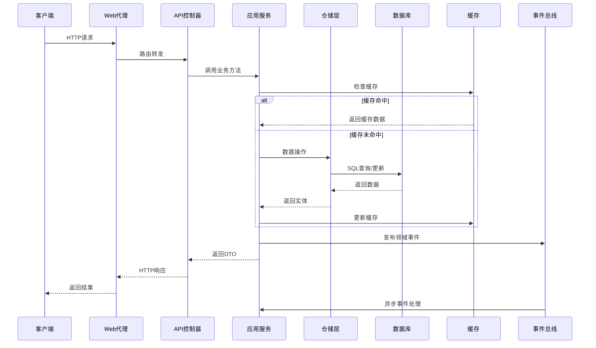
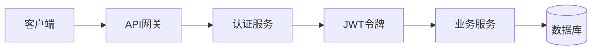

# CodeSpirit 项目整体架构设计

## 概述

CodeSpirit（码灵）采用Clean Architecture（整洁架构）设计模式，结合DDD（领域驱动设计）理念，构建了一个高度模块化、可扩展的低代码开发框架。整个架构遵循依赖倒置原则，确保核心业务逻辑不依赖于外部技术实现。

**最后更新**: 2025年12月  
**框架版本**: v2.0.0  
**技术栈**: .NET 10 + Aspire 13.0

## 架构层次设计

### 1. 整体架构图

```mermaid
graph TB
    subgraph "表示层 (Presentation Layer)"
        Web[CodeSpirit.Web]
        IdentityAPI[CodeSpirit.IdentityApi]
        ExamAPI[CodeSpirit.ExamApi]
        MessagingAPI[CodeSpirit.MessagingApi]
        FileStorageAPI[CodeSpirit.FileStorageApi]
        ConfigCenter[CodeSpirit.ConfigCenter]
        SurveyAPI[CodeSpirit.SurveyApi]
        ApprovalAPI[CodeSpirit.ApprovalApi]
        PathfinderAPI[CodeSpirit.PathfinderApi]
        AiCardsAPI[CodeSpirit.AiCardsApi]
    end
    
    subgraph "应用层 (Application Layer)"
        Services[Application Services]
        DTOs[Data Transfer Objects]
        Handlers[Event Handlers]
        Mappings[AutoMapper Profiles]
    end
    
    subgraph "领域层 (Domain Layer)"
        Core[CodeSpirit.Core]
        Entities[Domain Entities]
        Interfaces[Domain Interfaces]
        Events[Domain Events]
        Exceptions[Domain Exceptions]
    end
    
    subgraph "基础设施层 (Infrastructure Layer)"
        Shared[CodeSpirit.Shared]
        ServiceDefaults[CodeSpirit.ServiceDefaults]
        Messaging[CodeSpirit.Messaging]
        Data[Entity Framework DbContext]
        Repositories[Repository Pattern]
    end
    
    subgraph "横切关注点 (Cross-Cutting Concerns)"
        Authorization[CodeSpirit.Authorization]
        Audit[CodeSpirit.Audit]
        Navigation[CodeSpirit.Navigation]
        Amis[CodeSpirit.Amis]
        Charts[CodeSpirit.Charts]
        Aggregator[CodeSpirit.Aggregator]
        Settings[CodeSpirit.Settings]
        PdfGeneration[CodeSpirit.PdfGeneration]
        LLM[CodeSpirit.LLM]
        AiFormFill[CodeSpirit.AiFormFill]
        UdlCards[CodeSpirit.UdlCards]
        ScheduledTasks[CodeSpirit.ScheduledTasks]
        ConfigClient[CodeSpirit.ConfigCenter.Client]
        Caching[CodeSpirit.Caching]
        MultiTenant[CodeSpirit.MultiTenant]
    end
    
    subgraph "引擎层 (Orchestration Layer)"
        AppHost[CodeSpirit.AppHost]
    end
    
    %% 主要数据流
    Web --> Services
    IdentityAPI --> Services
    ExamAPI --> Services
    MessagingAPI --> Services
    FileStorageAPI --> Services
    ConfigCenter --> Services
    SurveyAPI --> Services
    ApprovalAPI --> Services
    PathfinderAPI --> Services
    
    Services --> Core
    Services --> DTOs
    Services --> Handlers
    Services --> Mappings
    
    Core --> Entities
    Core --> Interfaces
    Core --> Events
    Core --> Exceptions
    
    Services --> Shared
    Services --> Data
    Services --> Repositories
    Data --> Shared
    
    %% 横切关注点依赖
    Authorization -.-> Services
    Audit -.-> Services
    Navigation -.-> Web
    Amis -.-> Web
    Charts -.-> Web
    Aggregator -.-> Services
    Settings -.-> Services
    PdfGeneration -.-> Services
    LLM -.-> Services
    AiFormFill -.-> Services
    UdlCards -.-> Web
    ScheduledTasks -.-> Services
    ConfigClient -.-> Services
    Caching -.-> Services
    MultiTenant -.-> Services
    
    %% Aspire 编排
    AppHost --> IdentityAPI
    AppHost --> ExamAPI
    AppHost --> MessagingAPI
    AppHost --> FileStorageAPI
    AppHost --> ConfigCenter
    AppHost --> SurveyAPI
    AppHost --> ApprovalAPI
    AppHost --> PathfinderAPI
    AppHost --> Web
```



### 2. 项目结构映射

| 架构层次 | 项目/组件 | 职责描述 |
|---------|-----------|----------|
| **表示层** | `CodeSpirit.Web` | Web前端代理和路由 |
| | `CodeSpirit.IdentityApi` | 身份认证API服务 |
| | `CodeSpirit.ExamApi` | 考试系统API服务 |
| | `CodeSpirit.MessagingApi` | 消息服务API |
| | `CodeSpirit.ConfigCenter` | 配置中心API服务 |
| | `CodeSpirit.FileStorageApi` | 文件存储API服务 |
| | `CodeSpirit.SurveyApi` | 问卷调查API服务 |
| | `CodeSpirit.ApprovalApi` | 审批工作流API服务 |
| | `CodeSpirit.PathfinderApi` | AI目标管理API服务 |
| | `CodeSpirit.AiCardsApi` | AI卡片API服务 |
| **应用层** | `Services/` | 应用服务实现 |
| | `Dtos/` | 数据传输对象 |
| | `EventHandlers/` | 事件处理器 |
| **领域层** | `CodeSpirit.Core` | 核心领域定义 |
| | `Models/` | 领域模型 |
| | `Entities/` | 领域实体 |
| **基础设施层** | `CodeSpirit.Shared` | 共享基础设施 |
| | `CodeSpirit.ServiceDefaults` | 服务默认配置 |
| | `CodeSpirit.Messaging` | 消息传递库 |
| | `Data/` | 数据访问层 |
| | `Components/` | 框架组件 |
| **横切关注点** | `CodeSpirit.Authorization` | 权限管理 |
| | `CodeSpirit.Audit` | 审计日志 |
| | `CodeSpirit.Navigation` | 导航管理 |
| | `CodeSpirit.Amis` | UI生成引擎 |
| | `CodeSpirit.Charts` | 智能图表组件 |
| | `CodeSpirit.Aggregator` | 聚合器组件 |
| | `CodeSpirit.Settings` | 设置管理组件 |
| | `CodeSpirit.PdfGeneration` | PDF生成组件 |
| | `CodeSpirit.LLM` | 大语言模型组件 |
| | `CodeSpirit.AiFormFill` | AI表单智能填充组件 |
| | `CodeSpirit.UdlCards` | UDL卡片组件 |
| | `CodeSpirit.ScheduledTasks` | 定时任务组件 |
| | `CodeSpirit.ConfigCenter.Client` | 配置中心客户端 |
| | `CodeSpirit.Caching` | 分布式缓存组件 |
| | `CodeSpirit.MultiTenant` | 多租户组件 |
| | `CodeSpirit.Shared/Services` | 增强批量导入服务 |
| | `CodeSpirit.Amis/Attributes` | 增强导入字段特性 |

## 核心设计原则

### 1. 依赖倒置原则 (DIP)

```csharp
// 领域层定义接口
namespace CodeSpirit.Core
{
    public interface IRepository<T> where T : class
    {
        Task<T> GetByIdAsync(object id);
        Task<IEnumerable<T>> GetAllAsync();
        Task AddAsync(T entity);
        Task UpdateAsync(T entity);
        Task DeleteAsync(object id);
    }
}

// 基础设施层实现接口
namespace CodeSpirit.Shared.Repositories
{
    public class Repository<T> : IRepository<T> where T : class
    {
        // 具体实现...
    }
}
```

### 2. 单一职责原则 (SRP)

每个组件都有明确的职责边界：

- **CodeSpirit.Core**: 核心业务规则和领域模型
- **CodeSpirit.Amis**: UI生成引擎，实现低代码界面生成
- **CodeSpirit.Authorization**: 权限管理，基于RBAC和ABAC的统一授权
- **CodeSpirit.Audit**: 审计追踪，记录用户操作和系统变更，使用GreptimeDB存储
- **CodeSpirit.LLM**: 大语言模型组件，支持OpenAI、阿里云等多API
- **CodeSpirit.AiFormFill**: AI表单智能填充组件，基于LLM实现智能表单填充
- **CodeSpirit.FileStorageApi**: 文件存储服务，支持本地和云存储
- **CodeSpirit.UdlCards**: UDL卡片组件，支持多种卡片类型和布局
- **CodeSpirit.ScheduledTasks**: 定时任务组件，支持Cron表达式调度

### 3. 开闭原则 (OCP)

通过接口和抽象类支持扩展：

```csharp
// 可扩展的依赖注入标记接口
public interface IScopedDependency { }
public interface ITransientDependency { }
public interface ISingletonDependency { }

// 自动注册实现
services.Scan(scan => scan
    .FromAssemblies(assemblies)
    .AddClasses(classes => classes.AssignableTo<IScopedDependency>())
    .AsImplementedInterfaces()
    .WithScopedLifetime());
```

## 模块化设计

### 1. 核心模块 (CodeSpirit.Core)

**职责**: 定义系统的核心概念、接口和基础类型

**主要组件**:
- `ApiResponse<T>`: 统一API响应格式
- `ICurrentUser`: 当前用户上下文接口
- `PageList<T>`: 分页数据封装
- 异常类型: `BusinessException`, `AppServiceException`, `ValidationException`
- 依赖注入标记接口: `IScopedDependency`, `ITransientDependency`, `ISingletonDependency`
- 授权属性: `RequirePermissionAttribute`, `RequireRoleAttribute`
- 事件系统: `IDomainEvent`, `IEventHandler<T>`

**设计特点**:
- 不依赖任何外部框架
- 定义系统的核心抽象
- 提供通用的基础类型
- 支持大规模应用的模块化设计

### 2. 应用服务模块

**职责**: 实现具体的业务用例和应用逻辑

**设计模式**:
```csharp
public class UserService : IUserService
{
    private readonly IRepository<ApplicationUser> _userRepository;
    private readonly ICurrentUser _currentUser;
    
    public UserService(
        IRepository<ApplicationUser> userRepository,
        ICurrentUser currentUser)
    {
        _userRepository = userRepository;
        _currentUser = currentUser;
    }
    
    public async Task<UserDto> CreateUserAsync(CreateUserDto dto)
    {
        // 业务逻辑实现
    }
}
```

### 3. 基础设施模块

**职责**: 提供技术实现和外部系统集成

**主要组件**:
- 数据访问层 (Entity Framework Core)
- 缓存服务 (Redis)
- 消息队列 (RabbitMQ)
- 文件存储 (本地/云存储)
- 分布式锁 (Redis-based)
- 配置中心客户端 (SignalR)
- 多租户数据过滤器

### 4. 横切关注点模块

#### 4.1 CodeSpirit.LLM - 大语言模型组件

**功能特性**:
- 支持多种LLM API（OpenAI、阿里云等）
- 统一的接口设计
- 流式响应处理
- 代理设置支持
- 配置灵活管理

```csharp
// 使用示例
public class QuestionGeneratorService
{
    private readonly ILLMClientFactory _llmFactory;
    
    public async Task<string> GenerateQuestionAsync(string topic)
    {
        var client = await _llmFactory.CreateClientAsync();
        return await client.GenerateContentAsync(
            $"基于主题 '{topic}' 生成一道选择题");
    }
}
```

#### 4.1.1 增强批量导入组件

**功能特性**:
- 智能Excel模板生成，支持字段验证和示例数据
- 增强的批量导入处理，支持数据验证和错误追踪
- 分布式缓存支持，可跟踪导入进度和结果
- 失败记录导出，便于用户修正数据
- 可扩展的验证器架构，支持自定义业务验证

**核心组件**:

```csharp
// 导入模板服务 - 自动生成Excel导入模板
public interface IImportTemplateService
{
    Task<byte[]> GenerateExcelTemplateAsync<T>(string? fileName = null) where T : class;
    Task<byte[]> GenerateExcelTemplateByTypeNameAsync(string typeName, string? fileName = null);
    List<ImportColumnInfo> GetImportColumns<T>() where T : class;
}

// 增强批量导入助手 - 处理批量导入逻辑
public class EnhancedBatchImportHelper<TBatchImportDto> where TBatchImportDto : class
{
    public async Task<BatchImportResultDto> EnhancedBatchImportAsync(
        IEnumerable<TBatchImportDto> importData,
        Func<TBatchImportDto, int, Task<string?>> importProcessor,
        Func<TBatchImportDto, int, Task<List<ValidationError>>>? validator = null);
        
    public async Task<BatchImportResultDto?> GetImportResultAsync(string importId);
    public async Task<byte[]> ExportFailedRecordsAsync(List<ImportFailedRecord> failedRecords);
}

// 增强批量导入服务混入 - 提供标准化的导入接口
public interface IEnhancedBatchImportService<TBatchImportDto> where TBatchImportDto : class
{
    Task<BatchImportResultDto> EnhancedBatchImportAsync(IEnumerable<TBatchImportDto> importData);
    Task<BatchImportResultDto?> GetImportResultAsync(string importId);
    Task<byte[]> ExportFailedRecordsAsync(List<ImportFailedRecord> failedRecords);
}
```

**AMIS前端集成**:

```csharp
// 增强导入字段特性 - 自动生成前端导入组件
[AmisEnhancedImportField(
    Label = "批量导入数据", 
    Placeholder = "请先下载模板，填写数据后上传Excel文件",
    MaxLength = 1000,
    ShowTemplateDownload = true,
    ShowImportResult = true,
    TemplateDownloadText = "下载导入模板",
    ImportButtonText = "开始导入"
)]
public List<StudentBatchImportItemDto> ImportData { get; set; } = new List<StudentBatchImportItemDto>();
```

**使用示例**:

```csharp
// 在服务中实现增强批量导入
public class StudentService : BaseCRUDService<Student, StudentDto, long, CreateStudentDto, UpdateStudentDto>, 
    IStudentService, IEnhancedBatchImportService<StudentBatchImportItemDto>
{
    private readonly EnhancedBatchImportHelper<StudentBatchImportItemDto> _importHelper;
    
    public async Task<BatchImportResultDto> EnhancedBatchImportAsync(IEnumerable<StudentBatchImportItemDto> importData)
    {
        return await _importHelper.EnhancedBatchImportAsync(importData, async (dto, index) =>
        {
            // 自定义导入逻辑
            var existingStudent = await Repository.FirstOrDefaultAsync(s => s.StudentNumber == dto.StudentNumber);
            if (existingStudent != null)
            {
                return $"学号 {dto.StudentNumber} 已存在";
            }
            
            var student = Mapper.Map<Student>(dto);
            await Repository.AddAsync(student);
            return null; // 成功返回null
        });
    }
}
```

#### 4.2 CodeSpirit.FileStorageApi - 文件存储服务

**功能特性**:
- 统一的文件管理接口
- 支持多种存储后端接口
- 文件引用计数和生命周期管理
- 图片处理和缩略图生成
- 存储桶管理和配置

```csharp
// 文件上传示例
var uploadRequest = new FileUploadRequest
{
    FileName = "document.pdf",
    FileStream = fileStream,
    ContentType = "application/pdf",
    BucketName = "documents",
    IsPublic = false
};

var fileInfo = await _fileStorageService.UploadFileAsync(uploadRequest);
```

#### 4.3 CodeSpirit.Generator - 代码生成组件

**功能特性**:
- 基于模板的代码生成
- 支持T4模板引擎
- 实体类和DTO自动生成
- API控制器脚手架生成

## 数据流设计

### 1. 请求处理流程



### 2. 事件驱动架构

```csharp
// 领域事件定义
public class UserCreatedEvent : IDomainEvent
{
    public long UserId { get; set; }
    public string UserName { get; set; }
    public string TenantId { get; set; }
    public DateTime CreatedAt { get; set; }
}

// 事件处理器
public class UserCreatedEventHandler : IEventHandler<UserCreatedEvent>
{
    private readonly INotificationService _notificationService;
    private readonly IPermissionService _permissionService;
    
    public async Task HandleAsync(UserCreatedEvent @event)
    {
        // 发送欢迎通知
        await _notificationService.SendWelcomeNotificationAsync(@event.UserId);
        
        // 初始化默认权限
        await _permissionService.AssignDefaultPermissionsAsync(@event.UserId);
        
        // 审计日志
        await _auditService.LogUserCreationAsync(@event);
    }
}

// 文件引用事件示例
public class FileReferenceEvent : IDomainEvent
{
    public long FileId { get; set; }
    public string SourceService { get; set; }
    public string SourceEntityType { get; set; }
    public string SourceEntityId { get; set; }
    public FileReferenceAction Action { get; set; } // Create, Confirm, Cancel
}
```

## 配置管理架构

### 1. 分层配置

```json
{
  "ConnectionStrings": {
    "identity-api": "Server=localhost;Database=CodeSpirit_Identity;...",
    "exam-api": "Server=localhost;Database=CodeSpirit_Exam;..."
  },
  "Jwt": {
    "SecretKey": "your-secret-key",
    "Issuer": "CodeSpirit",
    "Audience": "CodeSpirit.Client",
    "ExpirationMinutes": 60
  },
  "User": {
    "Password": {
      "RequireDigit": true,
      "RequireLowercase": true,
      "RequireUppercase": true,
      "RequiredLength": 6
    },
    "Lockout": {
      "DefaultLockoutMinutes": 5,
      "MaxFailedAttempts": 5
    }
  }
}
```

### 2. 环境特定配置

- `appsettings.json`: 基础配置
- `appsettings.Development.json`: 开发环境配置
- `appsettings.Production.json`: 生产环境配置

## 安全架构设计

### 1. 认证架构



### 2. 授权架构

- **基于角色的访问控制 (RBAC)**
- **基于属性的访问控制 (ABAC)**
- **动态权限验证**

```csharp
[Authorize]
[RequirePermission("User.Create")]
public async Task<IActionResult> CreateUser(CreateUserDto dto)
{
    // 业务逻辑
}
```

## 性能优化架构

### 1. 缓存策略

- **一级缓存**: 内存缓存 (IMemoryCache)
- **二级缓存**: 分布式缓存 (Redis)
- **查询缓存**: Entity Framework查询缓存

### 2. 数据库优化

- **读写分离**: 主从数据库配置
- **连接池管理**: 数据库连接池优化
- **索引策略**: 自动索引创建和优化

## 监控和诊断

### 1. 健康检查

```csharp
builder.Services.AddHealthChecks()
    .AddDbContext<ApplicationDbContext>()
    .AddRedis(connectionString)
    .AddRabbitMQ(rabbitConnectionString);
```

### 2. 日志架构

- **结构化日志**: Serilog + Seq
- **性能监控**: Application Insights
- **错误追踪**: 自定义异常处理中间件

## 部署架构

### 1. .NET Aspire 分布式应用架构

**CodeSpirit.AppHost** 作为 Aspire 应用宿主，统一管理所有服务和依赖项：

```csharp
var builder = DistributedApplication.CreateBuilder(args);

// 基础设施服务
var cache = builder.AddRedis("cache")
                   .WithLifetime(ContainerLifetime.Persistent)
                   .WithHostPort(6380)
                   .WithRedisCommander();

var seqService = builder.AddSeq("seq")
                    .WithDataVolume()
                    .ExcludeFromManifest()
                    .WithLifetime(ContainerLifetime.Persistent)
                    .WithUrlForEndpoint("seq", url => url.DisplayLocation = UrlDisplayLocation.SummaryAndDetails)
                    .WithEnvironment("ACCEPT_EULA", "Y");

var rabbitmqService = builder.AddRabbitMQ("rabbitmq", username, password)
                     .WithManagementPlugin()
                     .WithLifetime(ContainerLifetime.Persistent);

var greptimedbService = builder.AddContainer("greptimedb", "greptime/greptimedb", "latest")
                              .WithArgs("standalone", "start", "--http-addr", "0.0.0.0:4000", "--rpc-addr", "0.0.0.0:4001")
                              .WithHttpEndpoint(port: 4000, targetPort: 4000, name: "greptimedb-http")
                              .WithHttpEndpoint(port: 4001, targetPort: 4001, name: "greptimedb-grpc")
                              .WithLifetime(ContainerLifetime.Persistent)
                              .WithEnvironment("GREPTIME_OPTS", "--log-level=info");

// 数据库实例
var identityDb = sqlserver.AddDatabase("identity-api");
var examDb = sqlserver.AddDatabase("exam-api");
var fileStorageDb = sqlserver.AddDatabase("file-api");
var configCenterDb = sqlserver.AddDatabase("config-center");
var messagingDb = sqlserver.AddDatabase("messaging-api");

// API 服务
var identityApi = builder.AddProject<Projects.CodeSpirit_IdentityApi>("identity-api")
    .WithReference(identityDb)
    .WithReference(redis)
    .WithReference(rabbitmq)
    .WithReference(elasticsearch)
    .WithReference(seq);

var examApi = builder.AddProject<Projects.CodeSpirit_ExamApi>("exam-api")
    .WithReference(examDb)
    .WithReference(redis)
    .WithReference(rabbitmq)
    .WithReference(identityApi)
    .WithReference(seq);

var fileStorageApi = builder.AddProject<Projects.CodeSpirit_FileStorageApi>("file-api")
    .WithReference(fileStorageDb)
    .WithReference(redis)
    .WithReference(rabbitmq)
    .WithReference(seq);

var configCenter = builder.AddProject<Projects.CodeSpirit_ConfigCenter>("config-center")
    .WithReference(configCenterDb)
    .WithReference(redis)
    .WithReference(seq);

var messagingApi = builder.AddProject<Projects.CodeSpirit_MessagingApi>("messaging-api")
    .WithReference(messagingDb)
    .WithReference(redis)
    .WithReference(rabbitmq)
    .WithReference(seq);

// Web 前端
var web = builder.AddProject<Projects.CodeSpirit_Web>("web")
    .WithReference(identityApi)
    .WithReference(examApi)
    .WithReference(fileStorageApi)
    .WithReference(configCenter)
    .WithReference(messagingApi)
    .WithReference(redis)
    .WithReference(seq);

builder.Build().Run();
```

### 2. 服务发现和负载均衡

- **服务发现**: Aspire 自动处理服务注册和发现
- **负载均衡**: 支持多实例部署和自动负载均衡
- **健康检查**: 自动监控服务健康状态
- **遥测和指标**: 内置OpenTelemetry支持

### 3. 容器化部署

**Dockerfile 示例** (每个API服务):

```dockerfile
FROM mcr.microsoft.com/dotnet/aspnet:10.0 AS base
WORKDIR /app
EXPOSE 8080
EXPOSE 8081

FROM mcr.microsoft.com/dotnet/sdk:10.0 AS build
WORKDIR /src

# 复制项目文件
COPY ["Src/ApiServices/CodeSpirit.IdentityApi/CodeSpirit.IdentityApi.csproj", "Src/ApiServices/CodeSpirit.IdentityApi/"]
COPY ["Src/CodeSpirit.Core/CodeSpirit.Core.csproj", "Src/CodeSpirit.Core/"]
COPY ["Src/CodeSpirit.Shared/CodeSpirit.Shared.csproj", "Src/CodeSpirit.Shared/"]
COPY ["Src/CodeSpirit.ServiceDefaults/CodeSpirit.ServiceDefaults.csproj", "Src/CodeSpirit.ServiceDefaults/"]

# 还原依赖项
RUN dotnet restore "Src/ApiServices/CodeSpirit.IdentityApi/CodeSpirit.IdentityApi.csproj"

# 复制所有源代码
COPY . .

# 构建应用
WORKDIR "/src/Src/ApiServices/CodeSpirit.IdentityApi"
RUN dotnet build "CodeSpirit.IdentityApi.csproj" -c Release -o /app/build

FROM build AS publish
RUN dotnet publish "CodeSpirit.IdentityApi.csproj" -c Release -o /app/publish

FROM base AS final
WORKDIR /app
COPY --from=publish /app/publish .
ENTRYPOINT ["dotnet", "CodeSpirit.IdentityApi.dll"]
```

### 4. Kubernetes 部署支持

```yaml
apiVersion: apps/v1
kind: Deployment
metadata:
  name: codespirit-identity-api
spec:
  replicas: 3
  selector:
    matchLabels:
      app: codespirit-identity-api
  template:
    metadata:
      labels:
        app: codespirit-identity-api
    spec:
      containers:
      - name: identity-api
        image: codespirit/identity-api:latest
        ports:
        - containerPort: 8080
        env:
        - name: ASPNETCORE_ENVIRONMENT
          value: "Production"
        - name: ConnectionStrings__DefaultConnection
          valueFrom:
            secretKeyRef:
              name: database-secret
              key: connection-string
        resources:
          limits:
            memory: "512Mi"
            cpu: "500m"
          requests:
            memory: "256Mi"
            cpu: "250m"
        livenessProbe:
          httpGet:
            path: /health
            port: 8080
          initialDelaySeconds: 30
          periodSeconds: 10
        readinessProbe:
          httpGet:
            path: /health/ready
            port: 8080
          initialDelaySeconds: 5
          periodSeconds: 5
```

## 扩展性设计

### 1. 插件架构

支持通过插件扩展系统功能：

```csharp
public interface IPlugin
{
    string Name { get; }
    string Version { get; }
    void Initialize(IServiceCollection services);
    void Configure(IApplicationBuilder app);
}

// 插件加载器
public class PluginLoader
{
    public static void LoadPlugins(IServiceCollection services, string pluginPath)
    {
        var pluginAssemblies = Directory.GetFiles(pluginPath, "*.dll")
            .Select(Assembly.LoadFrom);
            
        foreach (var assembly in pluginAssemblies)
        {
            var pluginTypes = assembly.GetTypes()
                .Where(t => typeof(IPlugin).IsAssignableFrom(t) && !t.IsInterface);
                
            foreach (var pluginType in pluginTypes)
            {
                var plugin = Activator.CreateInstance(pluginType) as IPlugin;
                plugin?.Initialize(services);
            }
        }
    }
}
```

### 2. 多租户支持

- **数据隔离**: 基于TenantId的数据过滤
- **配置隔离**: 租户特定的配置管理
- **资源隔离**: 租户级别的资源限制
- **租户解析**: 支持域名、子域名和路径解析

```csharp
// 租户感知的数据过滤器
public class TenantDataFilter : IDataFilter
{
    public void ApplyFilter<T>(IQueryable<T> query) where T : ITenantEntity
    {
        var currentTenantId = _tenantResolver.GetCurrentTenantId();
        if (!string.IsNullOrEmpty(currentTenantId))
        {
            query = query.Where(e => e.TenantId == currentTenantId);
        }
    }
}
```

### 3. 微服务扩展

- **水平扩展**: 支持按需扩展各个API服务
- **垂直扩展**: 支持增加服务实例资源
- **服务网格**: 支持Istio等服务网格技术
- **自动伸缩**: 基于负载的自动扩缩容

## 总结

CodeSpirit的架构设计充分体现了现代软件架构的最佳实践：

### 核心亮点

1. **清晰的层次分离**: 基于Clean Architecture的层次设计，确保关注点分离和可维护性
2. **高度模块化**: 支持独立开发、测试和部署，提高开发效率
3. **可扩展性**: 通过接口和抽象支持功能扩展，支持插件化架构
4. **云原生支持**: 基于.NET Aspire的现代容器化和微服务架构
5. **性能优化**: 多级缓存、读写分离和数据库优化
6. **安全保障**: 完整的认证授权体系，支持RBAC和ABAC
7. **多租户支持**: 完善的多租户数据隔离和资源管理
8. **AI能力集成**: 通过CodeSpirit.LLM组件集成大语言模型能力
9. **统一启动框架**: 通过BaseApiConfiguration统一API服务配置
10. **完善的监控**: 集成OpenTelemetry、健康检查和结构化日志
11. **增强批量导入**: 智能Excel模板生成、数据验证、错误追踪和失败记录导出

### 技术特性

- **.NET 10 + Aspire 13.0**: 使用最新的.NET技术栈和Aspire平台
- **Entity Framework Core**: 现代化的ORM数据访问，支持MySQL和SQL Server
- **SignalR**: 实时通信支持（配置中心配置推送）
- **Redis**: 高性能缓存和分布式锁
- **RabbitMQ**: 异步消息处理
- **GreptimeDB**: 时序数据库，用于审计日志存储和分析
- **Seq**: 结构化日志聚合和分析
- **AutoMapper**: 对象映射自动化

### 业务价值

这种架构设计使得CodeSpirit既能满足快速开发的需求，又能保证系统的稳定性和可扩展性。通过统一的架构模式，开发团队可以：

- **快速开发**: 通过组件化和低代码平台加速业务开发
- **灵活扩展**: 按需添加新的业务模块和API服务
- **稳定运行**: 通过完善的监控和容错机制保障系统稳定
- **高效维护**: 清晰的代码结构和统一的开发规范降低维护成本 