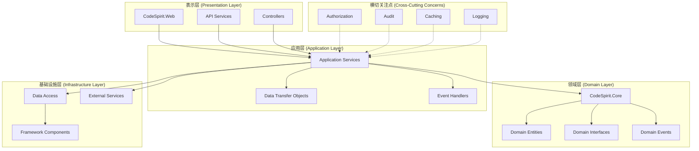
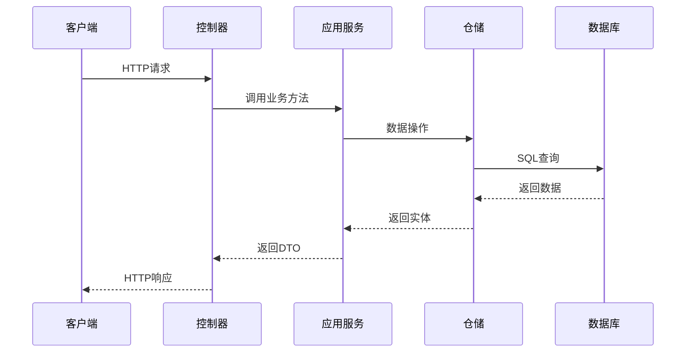
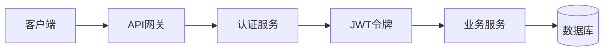

# CodeSpirit 项目整体架构设计

## 概述

CodeSpirit（码灵）采用Clean Architecture（整洁架构）设计模式，结合DDD（领域驱动设计）理念，构建了一个高度模块化、可扩展的低代码开发框架。整个架构遵循依赖倒置原则，确保核心业务逻辑不依赖于外部技术实现。

## 架构层次设计

### 1. 整体架构图



### 2. 项目结构映射

| 架构层次 | 项目/组件 | 职责描述 |
|---------|-----------|----------|
| **表示层** | `CodeSpirit.Web` | Web前端代理和路由 |
| | `CodeSpirit.IdentityApi` | 身份认证API服务 |
| | `CodeSpirit.ExamApi` | 考试系统API服务 |
| | `CodeSpirit.MessagingApi` | 消息服务API |
| | `CodeSpirit.TaskApi` | 任务管理API服务 |
| | `CodeSpirit.GradeApi` | 成绩管理API服务 |
| | `CodeSpirit.ConfigCenter` | 配置中心API服务 |
| **应用层** | `Services/` | 应用服务实现 |
| | `Dtos/` | 数据传输对象 |
| | `EventHandlers/` | 事件处理器 |
| **领域层** | `CodeSpirit.Core` | 核心领域定义 |
| | `Models/` | 领域模型 |
| | `Entities/` | 领域实体 |
| **基础设施层** | `CodeSpirit.Shared` | 共享基础设施 |
| | `CodeSpirit.ServiceDefaults` | 服务默认配置 |
| | `CodeSpirit.Messaging` | 消息传递库 |
| | `Data/` | 数据访问层 |
| | `Components/` | 框架组件 |
| **横切关注点** | `CodeSpirit.Authorization` | 权限管理 |
| | `CodeSpirit.Audit` | 审计日志 |
| | `CodeSpirit.Navigation` | 导航管理 |
| | `CodeSpirit.Amis` | UI生成引擎 |
| | `CodeSpirit.Charts` | 智能图表组件 |
| | `CodeSpirit.Aggregator` | 聚合器组件 |
| | `CodeSpirit.Settings` | 设置管理组件 |
| | `CodeSpirit.PdfGeneration` | PDF生成组件 |
| | `CodeSpirit.LLM` | 大语言模型组件 |

## 核心设计原则

### 1. 依赖倒置原则 (DIP)

```csharp
// 领域层定义接口
namespace CodeSpirit.Core
{
    public interface IRepository<T> where T : class
    {
        Task<T> GetByIdAsync(object id);
        Task<IEnumerable<T>> GetAllAsync();
        Task AddAsync(T entity);
        Task UpdateAsync(T entity);
        Task DeleteAsync(object id);
    }
}

// 基础设施层实现接口
namespace CodeSpirit.Shared.Repositories
{
    public class Repository<T> : IRepository<T> where T : class
    {
        // 具体实现...
    }
}
```

### 2. 单一职责原则 (SRP)

每个组件都有明确的职责边界：

- **CodeSpirit.Core**: 核心业务规则和领域模型
- **CodeSpirit.Amis**: UI生成引擎
- **CodeSpirit.Authorization**: 权限管理
- **CodeSpirit.Audit**: 审计追踪

### 3. 开闭原则 (OCP)

通过接口和抽象类支持扩展：

```csharp
// 可扩展的依赖注入标记接口
public interface IScopedDependency { }
public interface ITransientDependency { }
public interface ISingletonDependency { }

// 自动注册实现
services.Scan(scan => scan
    .FromAssemblies(assemblies)
    .AddClasses(classes => classes.AssignableTo<IScopedDependency>())
    .AsImplementedInterfaces()
    .WithScopedLifetime());
```

## 模块化设计

### 1. 核心模块 (CodeSpirit.Core)

**职责**: 定义系统的核心概念、接口和基础类型

**主要组件**:
- `ApiResponse<T>`: 统一API响应格式
- `ICurrentUser`: 当前用户上下文接口
- `PageList<T>`: 分页数据封装
- 异常类型: `BusinessException`, `ValidationException`
- 依赖注入标记接口

**设计特点**:
- 不依赖任何外部框架
- 定义系统的核心抽象
- 提供通用的基础类型

### 2. 应用服务模块

**职责**: 实现具体的业务用例和应用逻辑

**设计模式**:
```csharp
public class UserService : IUserService
{
    private readonly IRepository<ApplicationUser> _userRepository;
    private readonly ICurrentUser _currentUser;
    
    public UserService(
        IRepository<ApplicationUser> userRepository,
        ICurrentUser currentUser)
    {
        _userRepository = userRepository;
        _currentUser = currentUser;
    }
    
    public async Task<UserDto> CreateUserAsync(CreateUserDto dto)
    {
        // 业务逻辑实现
    }
}
```

### 3. 基础设施模块

**职责**: 提供技术实现和外部系统集成

**主要组件**:
- 数据访问层 (Entity Framework Core)
- 缓存服务 (Redis)
- 消息队列 (RabbitMQ)
- 文件存储 (本地/云存储)

## 数据流设计

### 1. 请求处理流程



### 2. 事件驱动架构

```csharp
// 领域事件定义
public class UserCreatedEvent : IDomainEvent
{
    public long UserId { get; set; }
    public string UserName { get; set; }
    public DateTime CreatedAt { get; set; }
}

// 事件处理器
public class UserCreatedEventHandler : IEventHandler<UserCreatedEvent>
{
    public async Task HandleAsync(UserCreatedEvent @event)
    {
        // 处理用户创建后的业务逻辑
        // 如：发送欢迎邮件、初始化用户权限等
    }
}
```

## 配置管理架构

### 1. 分层配置

```json
{
  "ConnectionStrings": {
    "identity-api": "Server=localhost;Database=CodeSpirit_Identity;...",
    "exam-api": "Server=localhost;Database=CodeSpirit_Exam;..."
  },
  "Jwt": {
    "SecretKey": "your-secret-key",
    "Issuer": "CodeSpirit",
    "Audience": "CodeSpirit.Client",
    "ExpirationMinutes": 60
  },
  "User": {
    "Password": {
      "RequireDigit": true,
      "RequireLowercase": true,
      "RequireUppercase": true,
      "RequiredLength": 6
    },
    "Lockout": {
      "DefaultLockoutMinutes": 5,
      "MaxFailedAttempts": 5
    }
  }
}
```

### 2. 环境特定配置

- `appsettings.json`: 基础配置
- `appsettings.Development.json`: 开发环境配置
- `appsettings.Production.json`: 生产环境配置

## 安全架构设计

### 1. 认证架构



### 2. 授权架构

- **基于角色的访问控制 (RBAC)**
- **基于属性的访问控制 (ABAC)**
- **动态权限验证**

```csharp
[Authorize]
[RequirePermission("User.Create")]
public async Task<IActionResult> CreateUser(CreateUserDto dto)
{
    // 业务逻辑
}
```

## 性能优化架构

### 1. 缓存策略

- **一级缓存**: 内存缓存 (IMemoryCache)
- **二级缓存**: 分布式缓存 (Redis)
- **查询缓存**: Entity Framework查询缓存

### 2. 数据库优化

- **读写分离**: 主从数据库配置
- **连接池管理**: 数据库连接池优化
- **索引策略**: 自动索引创建和优化

## 监控和诊断

### 1. 健康检查

```csharp
builder.Services.AddHealthChecks()
    .AddDbContext<ApplicationDbContext>()
    .AddRedis(connectionString)
    .AddRabbitMQ(rabbitConnectionString);
```

### 2. 日志架构

- **结构化日志**: Serilog + Seq
- **性能监控**: Application Insights
- **错误追踪**: 自定义异常处理中间件

## 部署架构

### 1. 容器化部署

```dockerfile
FROM mcr.microsoft.com/dotnet/aspnet:9.0 AS base
WORKDIR /app
EXPOSE 80
EXPOSE 443

FROM mcr.microsoft.com/dotnet/sdk:9.0 AS build
WORKDIR /src
COPY ["CodeSpirit.IdentityApi/CodeSpirit.IdentityApi.csproj", "CodeSpirit.IdentityApi/"]
RUN dotnet restore "CodeSpirit.IdentityApi/CodeSpirit.IdentityApi.csproj"
```

### 2. 微服务编排

基于.NET Aspire的服务编排：

```csharp
var builder = DistributedApplication.CreateBuilder(args);

var redis = builder.AddRedis("redis");
var rabbitmq = builder.AddRabbitMQ("rabbitmq");

builder.AddProject<Projects.CodeSpirit_IdentityApi>("identity-api")
    .WithReference(redis)
    .WithReference(rabbitmq);

builder.AddProject<Projects.CodeSpirit_ExamApi>("exam-api")
    .WithReference(redis)
    .WithReference(rabbitmq);
```

## 扩展性设计

### 1. 插件架构

支持通过插件扩展系统功能：

```csharp
public interface IPlugin
{
    string Name { get; }
    string Version { get; }
    void Initialize(IServiceCollection services);
    void Configure(IApplicationBuilder app);
}
```

### 2. 多租户支持

- **数据隔离**: 基于TenantId的数据过滤
- **配置隔离**: 租户特定的配置管理
- **资源隔离**: 租户级别的资源限制

## 总结

CodeSpirit的架构设计充分体现了现代软件架构的最佳实践：

1. **清晰的层次分离**: 确保关注点分离和可维护性
2. **高度模块化**: 支持独立开发和部署
3. **可扩展性**: 通过接口和抽象支持功能扩展
4. **云原生支持**: 容器化和微服务架构
5. **性能优化**: 多级缓存和数据库优化
6. **安全保障**: 完整的认证授权体系

这种架构设计使得CodeSpirit既能满足快速开发的需求，又能保证系统的稳定性和可扩展性。 