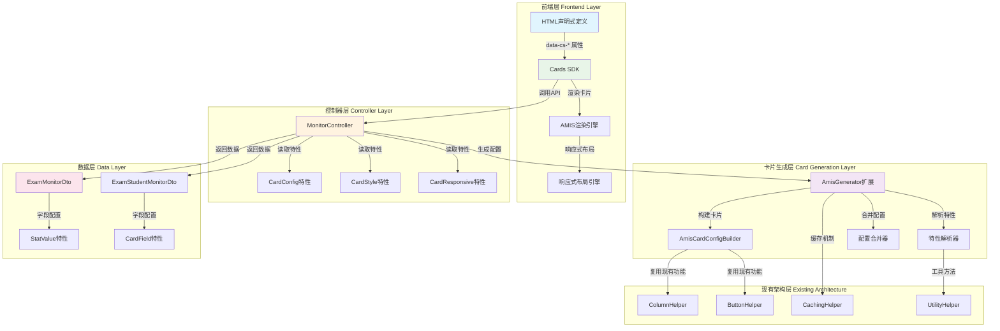

# UDL Cards 简易实现方案（基于CodeSpirit.Amis扩展）

## 概述

UDL Cards简易实现方案是对CodeSpirit.Amis智能界面生成引擎的轻量级扩展，通过最小化改动现有架构，实现基于API服务的卡片自动生成功能。该方案专注于复用现有组件和特性系统，确保开发者零学习成本。

## 设计原则

### 1. 复用现有架构
- 扩展AmisGenerator，添加卡片生成方法
- 复用现有的Helper类（ColumnHelper、ButtonHelper等）
- 扩展现有特性定义，而非重新创建
- 保持与CRUD表格生成的一致性

### 2. API驱动生成
- 基于Controller和DTO自动生成卡片
- 复用现有的反射机制和特性解析
- 支持多种卡片类型

### 3. 简化使用
- 通过特性标记指定卡片类型
- 最少配置，开发者友好

## 实现方案

### 1. 扩展AmisGenerator - 添加卡片生成功能

```csharp
// 在现有的AmisGenerator类中添加卡片生成方法
public partial class AmisGenerator
{
    /// <summary>
    /// 从Action描述符生成卡片配置（基于特性自动生成）
    /// </summary>
    public JObject GenerateCardFromAction(ActionDescriptor actionDescriptor, object data)
    {
        var methodInfo = actionDescriptor.MethodInfo ?? 
                        actionDescriptor.ControllerTypeInfo.GetMethod(actionDescriptor.ActionName);
        if (methodInfo == null) return null;

        string cacheKey = _cachingHelper.GenerateCacheKey($"{methodInfo.DeclaringType.FullName}_{methodInfo.Name}_card");
        
        // 尝试从缓存获取配置模板
        if (_cachingHelper.TryGetValue(cacheKey, out JObject cachedTemplate))
        {
            // 合并数据到模板
            return MergeDataToCardTemplate(cachedTemplate, data);
        }

        // 解析Action特性生成配置
        var cardBuilder = _serviceProvider.GetRequiredService<AmisCardConfigBuilder>();
        var cardConfig = cardBuilder.GenerateCardFromActionAttributes(methodInfo, data);

        // 缓存配置模板（不包含具体数据）
        if (cardConfig != null)
        {
            var template = ExtractCardTemplate(cardConfig);
            var cacheOptions = new MemoryCacheEntryOptions()
                .SetSlidingExpiration(TimeSpan.FromMinutes(30))
                .SetAbsoluteExpiration(TimeSpan.FromHours(4))
                .SetSize(1) // 设置缓存项大小
                .RegisterPostEvictionCallback((key, value, reason, state) =>
                {
                    // 缓存清理回调，实际项目中应注入ILogger
                    Console.WriteLine($"Card template cache evicted: {key}, Reason: {reason}");
                });
            _cachingHelper.Set(cacheKey, template, cacheOptions);
        }

        return cardConfig;
    }

    /// <summary>
    /// 传统的为指定的控制器生成卡片配置（保持兼容性）
    /// </summary>
    public JObject GenerateCardConfig(Endpoint endpoint, CardType cardType = CardType.Auto)
    {
        Type controllerType = GetAndValidateControllerType(endpoint);
        if (controllerType == null) return null;

        string cacheKey = _cachingHelper.GenerateCacheKey($"{controllerType.FullName}_card_{cardType}");
        
        // 尝试从缓存获取
        if (_cachingHelper.TryGetValue(cacheKey, out JObject cachedConfig))
        {
            return cachedConfig;
        }

        // 生成卡片配置
        var cardBuilder = _serviceProvider.GetRequiredService<AmisCardConfigBuilder>();
        var cardConfig = cardBuilder.GenerateCardConfig(cardType);

        // 缓存配置
        if (cardConfig != null)
        {
            var cacheOptions = new MemoryCacheEntryOptions()
                .SetSlidingExpiration(TimeSpan.FromMinutes(30));
            _cachingHelper.Set(cacheKey, cardConfig, cacheOptions);
        }

        return cardConfig;
    }

    /// <summary>
    /// 为指定DTO类型生成卡片
    /// </summary>
    public JObject GenerateCardForDto<T>(CardLayoutType layoutType = CardLayoutType.Info)
    {
        var cardBuilder = new AmisCardConfigBuilder(_amisContext, _serviceProvider);
        return cardBuilder.GenerateDtoCard<T>(layoutType);
    }
}
```

### 2. 新增AmisCardConfigBuilder - 卡片配置构建器

```csharp
/// <summary>
/// AMIS卡片配置构建器 - 复用现有Helper架构
/// </summary>
public class AmisCardConfigBuilder
{
    private readonly AmisContext _context;
    private readonly IServiceProvider _serviceProvider;
    private readonly ColumnHelper _columnHelper;
    private readonly ButtonHelper _buttonHelper;
    private readonly ApiRouteHelper _apiRouteHelper;
    private readonly UtilityHelper _utilityHelper;

    public AmisCardConfigBuilder(AmisContext context, IServiceProvider serviceProvider)
    {
        _context = context;
        _serviceProvider = serviceProvider;
        _columnHelper = new ColumnHelper(context, serviceProvider);
        _buttonHelper = new ButtonHelper(context, serviceProvider);
        _apiRouteHelper = serviceProvider.GetRequiredService<ApiRouteHelper>();
        _utilityHelper = new UtilityHelper();
    }

    /// <summary>
    /// 从Action特性生成卡片配置
    /// </summary>
    public JObject GenerateCardFromActionAttributes(MethodInfo methodInfo, object data)
    {
        try
        {
            // 解析Action上的卡片特性
            var cardConfigAttr = methodInfo.GetCustomAttribute<CardConfigAttribute>();
            var cardStyleAttr = methodInfo.GetCustomAttribute<CardStyleAttribute>();
            var cardResponsiveAttr = methodInfo.GetCustomAttribute<CardResponsiveAttribute>();

            if (cardConfigAttr == null)
            {
                // 如果没有卡片配置特性，使用传统方式生成
                return GenerateCardConfig(CardType.Auto);
            }

            // 构建卡片配置
            var cardConfig = new JObject
            {
                ["type"] = "service",
                ["className"] = $"cs-card cs-card-{cardConfigAttr.Type.ToString().ToLower()}",
                ["data"] = JObject.FromObject(data ?? new { })
            };

            // 添加标题配置
            if (!string.IsNullOrEmpty(cardConfigAttr.Title))
            {
                var header = new JObject
                {
                    ["title"] = cardConfigAttr.Title
                };
                
                if (!string.IsNullOrEmpty(cardConfigAttr.SubTitle))
                    header["subTitle"] = cardConfigAttr.SubTitle;
                    
                if (!string.IsNullOrEmpty(cardConfigAttr.Icon))
                    header["avatar"] = new JObject { ["icon"] = cardConfigAttr.Icon };

                cardConfig["header"] = header;
            }

            // 添加样式配置
            if (cardStyleAttr != null)
            {
                ApplyStyleConfig(cardConfig, cardStyleAttr);
            }

            // 添加响应式配置
            if (cardResponsiveAttr != null)
            {
                ApplyResponsiveConfig(cardConfig, cardResponsiveAttr);
            }

            // 根据卡片类型生成内容
            var body = cardConfigAttr.Type switch
            {
                CardType.Stat => GenerateStatBody(data),
                CardType.List => GenerateListBody(data),
                CardType.Info => GenerateInfoBody(data),
                CardType.Chart => GenerateChartBody(data),
                _ => GenerateInfoBody(data)
            };

            cardConfig["body"] = body;
            return cardConfig;
        }
        catch (Exception ex)
        {
            // 记录错误日志
            // 注：实际项目中应注入ILogger
            Console.WriteLine($"生成卡片配置失败: {ex.Message}");
            
            // 返回错误卡片
            return GenerateErrorCard($"卡片加载失败: {ex.Message}");
        }
    }

    /// <summary>
    /// 应用样式配置到卡片
    /// </summary>
    private void ApplyStyleConfig(JObject cardConfig, CardStyleAttribute styleAttr)
    {
        var className = cardConfig["className"]?.ToString() ?? "";
        cardConfig["className"] = $"{className} cs-theme-{styleAttr.Theme}";
        
        if (!string.IsNullOrEmpty(styleAttr.ClassName))
            cardConfig["className"] = $"{cardConfig["className"]} {styleAttr.ClassName}";
        
        if (!string.IsNullOrEmpty(styleAttr.BackgroundColor))
            cardConfig["style"] = new JObject { ["backgroundColor"] = styleAttr.BackgroundColor };
            
        cardConfig["showBorder"] = styleAttr.ShowBorder;
        cardConfig["showShadow"] = styleAttr.ShowShadow;
    }

    /// <summary>
    /// 应用响应式配置到卡片
    /// </summary>
    private void ApplyResponsiveConfig(JObject cardConfig, CardResponsiveAttribute responsiveAttr)
    {
        var (xs, sm, md, lg, xl) = responsiveAttr.GetColumns();
        
        cardConfig["responsive"] = new JObject
        {
            ["xs"] = xs,
            ["sm"] = sm,
            ["md"] = md,
            ["lg"] = lg,
            ["xl"] = xl
        };
    }

    /// <summary>
    /// 生成统计类型卡片内容
    /// </summary>
    private JArray GenerateStatBody(object data)
    {
        var dataType = data?.GetType();
        if (dataType == null) return new JArray();

        var statProperties = dataType.GetProperties()
            .Where(p => p.GetCustomAttribute<StatValueAttribute>() != null)
            .OrderBy(p => p.GetCustomAttribute<StatValueAttribute>()?.Label)
            .ToArray();

        var body = new JArray();
        
        foreach (var prop in statProperties)
        {
            var statAttr = prop.GetCustomAttribute<StatValueAttribute>();
            var value = prop.GetValue(data);
            
            var formattedValue = FormatStatValue(value, statAttr.Format);
            
            body.Add(new JObject
            {
                ["type"] = "tpl",
                ["className"] = $"stat-item stat-{statAttr.Color ?? "primary"}",
                ["tpl"] = $@"
                    <div class=""stat-content"">
                        <div class=""stat-value"">{formattedValue}{statAttr.Unit ?? ""}</div>
                        <div class=""stat-label"">{statAttr.Label}</div>
                    </div>"
            });
        }
        
        return body;
    }

    /// <summary>
    /// 生成信息类型卡片内容
    /// </summary>
    private JArray GenerateInfoBody(object data)
    {
        var dataType = data?.GetType();
        if (dataType == null) return new JArray();

        var properties = dataType.GetProperties()
            .Where(p => ShouldIncludeProperty(p))
            .OrderBy(p => p.GetCustomAttribute<CardFieldAttribute>()?.Order ?? 0)
            .ToArray();

        var body = new JArray();
        
        foreach (var prop in properties)
        {
            var cardFieldAttr = prop.GetCustomAttribute<CardFieldAttribute>();
            var displayAttr = prop.GetCustomAttribute<DisplayAttribute>();
            
            if (cardFieldAttr?.Hidden == true) continue;
            
            var label = displayAttr?.Name ?? prop.Name;
            var icon = cardFieldAttr?.Icon ?? "";
            var featured = cardFieldAttr?.Featured ?? false;

            body.Add(new JObject
            {
                ["type"] = "tpl",
                ["className"] = $"card-field {(featured ? "featured" : "")}",
                ["tpl"] = $@"
                    <div class=""field-item"">
                        {(string.IsNullOrEmpty(icon) ? "" : $"<i class=""{icon}""></i> ")}
                        <span class=""field-label"">{label}：</span>
                        <span class=""field-value"">${{{prop.Name}}}</span>
                    </div>"
            });
        }
        
        return body;
    }

    /// <summary>
    /// 生成列表类型卡片内容
    /// </summary>
    private JArray GenerateListBody(object data)
    {
        var body = new JArray();
        
        if (data is IEnumerable enumerable && !(data is string))
        {
            body.Add(new JObject
            {
                ["type"] = "each",
                ["name"] = "items",
                ["items"] = new JObject
                {
                    ["type"] = "card",
                    ["className"] = "list-item-card",
                    ["body"] = GenerateListItemTemplate(enumerable)
                }
            });
        }
        else
        {
            // 单个对象，直接显示为信息卡片
            return GenerateInfoBody(data);
        }
        
        return body;
    }

    /// <summary>
    /// 生成图表类型卡片内容
    /// </summary>
    private JArray GenerateChartBody(object data)
    {
        var body = new JArray();
        
        // 简单的图表配置，实际项目中可以更复杂
        body.Add(new JObject
        {
            ["type"] = "chart",
            ["config"] = new JObject
            {
                ["type"] = "line", // 默认线图
                ["data"] = JToken.FromObject(data)
            }
        });
        
        return body;
    }

    /// <summary>
    /// 生成错误提示卡片
    /// </summary>
    private JObject GenerateErrorCard(string errorMessage)
    {
        return new JObject
        {
            ["type"] = "alert",
            ["level"] = "danger",
            ["title"] = "卡片加载失败",
            ["body"] = errorMessage,
            ["className"] = "cs-error-card",
            ["showCloseButton"] = false
        };
    }

    /// <summary>
    /// 格式化统计值
    /// </summary>
    private string FormatStatValue(object value, string format)
    {
        if (value == null) return "0";
        
        if (!string.IsNullOrEmpty(format))
        {
            try
            {
                if (value is IFormattable formattable)
                {
                    return formattable.ToString(format, CultureInfo.CurrentCulture);
                }
            }
            catch
            {
                // 格式化失败，使用默认格式
            }
        }
        
        return value.ToString();
    }

    /// <summary>
    /// 生成列表项模板
    /// </summary>
    private JObject GenerateListItemTemplate(IEnumerable enumerable)
    {
        // 获取第一个元素来推断结构
        var firstItem = enumerable.Cast<object>().FirstOrDefault();
        if (firstItem != null)
        {
            var itemType = firstItem.GetType();
            var titleProperty = itemType.GetProperties()
                .FirstOrDefault(p => p.Name.Contains("Name") || p.Name.Contains("Title"));
            
            var template = new JObject
            {
                ["type"] = "tpl",
                ["tpl"] = titleProperty != null ? $"${{{titleProperty.Name}}}" : "${.}"
            };
            
            return template;
        }
        
        return new JObject
        {
            ["type"] = "tpl",
            ["tpl"] = "${.}"
        };
    }

    /// <summary>
    /// 传统的生成卡片配置方法（保持兼容性）
    /// </summary>
    public JObject GenerateCardConfig(CardType cardType = CardType.Auto)
    {
        if (cardType == CardType.Auto)
        {
            cardType = DetectCardType();
        }

        return cardType switch
        {
            CardType.Info => GenerateInfoCard(),
            CardType.Stat => GenerateStatCard(),
            CardType.List => GenerateListCard(),
            CardType.Action => GenerateActionCard(),
            _ => GenerateInfoCard()
        };
    }

    /// <summary>
    /// 为DTO生成卡片
    /// </summary>
    public JObject GenerateDtoCard<T>(CardLayoutType layoutType)
    {
        var dtoType = typeof(T);
        var properties = dtoType.GetProperties();
        
        var card = new JObject
        {
            ["type"] = "card",
            ["className"] = $"udl-card udl-{layoutType.ToString().ToLower()}-card"
        };

        // 生成标题
        var titleAttr = dtoType.GetCustomAttribute<CardTitleAttribute>();
        if (titleAttr != null)
        {
            card["header"] = new JObject
            {
                ["title"] = titleAttr.Title,
                ["subTitle"] = titleAttr.SubTitle
            };
        }

        // 生成内容
        var body = new JArray();
        
        if (layoutType == CardLayoutType.Grid)
        {
            body.Add(GenerateGridLayout(properties));
        }
        else if (layoutType == CardLayoutType.Stat)
        {
            body.Add(GenerateStatLayout(properties));
        }
        else
        {
            body.Add(GenerateFlexLayout(properties));
        }

        card["body"] = body;
        return card;
    }

    /// <summary>
    /// 生成信息展示卡片
    /// </summary>
    private JObject GenerateInfoCard()
    {
        var dataType = GetPrimaryDataType();
        if (dataType == null) return null;

        return GenerateDtoCard(dataType, CardLayoutType.Info);
    }

    /// <summary>
    /// 生成统计卡片
    /// </summary>
    private JObject GenerateStatCard()
    {
        var dataType = GetPrimaryDataType();
        if (dataType == null) return null;

        var properties = dataType.GetProperties();
        var statProperties = properties.Where(p => p.GetCustomAttribute<StatValueAttribute>() != null).ToList();

        if (!statProperties.Any())
        {
            // 如果没有明确的统计属性，尝试自动检测数值属性
            statProperties = properties.Where(p => IsNumericType(p.PropertyType)).ToList();
        }

        var cards = new JArray();
        
        foreach (var prop in statProperties)
        {
            var statAttr = prop.GetCustomAttribute<StatValueAttribute>();
            var displayAttr = prop.GetCustomAttribute<DisplayAttribute>();
            
            cards.Add(new JObject
            {
                ["type"] = "card",
                ["className"] = "stat-card",
                ["body"] = new JArray
                {
                    new JObject
                    {
                        ["type"] = "tpl",
                        ["className"] = "stat-content",
                        ["tpl"] = GenerateStatTemplate(prop, statAttr, displayAttr)
                    }
                }
            });
        }

        return new JObject
        {
            ["type"] = "grid",
            ["columns"] = cards
        };
    }

    /// <summary>
    /// 生成列表卡片
    /// </summary>
    private JObject GenerateListCard()
    {
        var listRoute = _apiRouteHelper.GetApiRoutes()?.Read;
        if (string.IsNullOrEmpty(listRoute)) return null;

        var itemType = GetListItemType();
        if (itemType == null) return null;

        return new JObject
        {
            ["type"] = "service",
            ["api"] = listRoute,
            ["body"] = new JArray
            {
                new JObject
                {
                    ["type"] = "each",
                    ["name"] = "items",
                    ["items"] = GenerateDtoCard(itemType, CardLayoutType.Compact)
                }
            }
        };
    }

    /// <summary>
    /// 生成网格布局
    /// </summary>
    private JObject GenerateGridLayout(PropertyInfo[] properties)
    {
        var layoutAttr = properties.FirstOrDefault()?.DeclaringType?.GetCustomAttribute<CardLayoutAttribute>();
        var columns = layoutAttr?.Columns ?? 2;

        var grid = new JObject
        {
            ["type"] = "grid",
            ["columns"] = new JArray()
        };

        var gridColumns = (JArray)grid["columns"];
        
        foreach (var prop in properties)
        {
            if (ShouldIncludeProperty(prop))
            {
                gridColumns.Add(GenerateFieldConfig(prop));
            }
        }

        return grid;
    }

    /// <summary>
    /// 生成字段配置 - 复用ColumnHelper的逻辑
    /// </summary>
    private JObject GenerateFieldConfig(PropertyInfo property)
    {
        // 复用现有的列配置逻辑
        var columnConfig = _columnHelper.CreateColumn(property);
        
        // 转换为卡片字段格式
        var cardFieldAttr = property.GetCustomAttribute<CardFieldAttribute>();
        var displayAttr = property.GetCustomAttribute<DisplayAttribute>();
        
        var label = displayAttr?.Name ?? columnConfig["label"]?.ToString() ?? property.Name;
        var icon = cardFieldAttr?.Icon ?? "";
        var featured = cardFieldAttr?.Featured ?? false;

        return new JObject
        {
            ["type"] = "tpl",
            ["className"] = $"card-field {(featured ? "featured" : "")}",
            ["tpl"] = $"<div class=\"field-item\">" +
                     $"{(string.IsNullOrEmpty(icon) ? "" : $"<i class=\"{icon}\"></i> ")}" +
                     $"<span class=\"field-label\">{label}：</span>" +
                     $"<span class=\"field-value\">${{{property.Name}}}</span>" +
                     $"</div>"
        };
    }

    /// <summary>
    /// 检测卡片类型
    /// </summary>
    private CardType DetectCardType()
    {
        var dataType = GetPrimaryDataType();
        if (dataType == null) return CardType.Info;

        // 检查是否有统计属性
        var hasStatProperties = dataType.GetProperties()
            .Any(p => p.GetCustomAttribute<StatValueAttribute>() != null || IsNumericType(p.PropertyType));
        
        if (hasStatProperties)
        {
            return CardType.Stat;
        }

        // 检查是否是列表数据
        if (_context.Actions?.List != null)
        {
            var returnType = _context.Actions.List.ReturnType;
            if (IsListType(returnType))
            {
                return CardType.List;
            }
        }

        return CardType.Info;
    }

    /// <summary>
    /// 获取主要数据类型
    /// </summary>
    private Type GetPrimaryDataType()
    {
        if (_context.Actions?.List != null)
        {
            return _utilityHelper.GetDataTypeFromMethod(_context.Actions.List);
        }
        return _context.ListDataType;
    }

    /// <summary>
    /// 检查属性是否应该包含在卡片中
    /// </summary>
    private bool ShouldIncludeProperty(PropertyInfo property)
    {
        // 复用现有的列过滤逻辑
        return property.GetCustomAttribute<IgnoreColumnAttribute>() == null &&
               !property.Name.Equals("Id", StringComparison.OrdinalIgnoreCase);
    }

    /// <summary>
    /// 检查是否为数值类型
    /// </summary>
    private bool IsNumericType(Type type)
    {
        return type == typeof(int) || type == typeof(long) || type == typeof(decimal) ||
               type == typeof(double) || type == typeof(float) || type == typeof(short) ||
               type == typeof(int?) || type == typeof(long?) || type == typeof(decimal?) ||
               type == typeof(double?) || type == typeof(float?) || type == typeof(short?);
    }

    /// <summary>
    /// 生成统计模板
    /// </summary>
    private string GenerateStatTemplate(PropertyInfo property, StatValueAttribute statAttr, DisplayAttribute displayAttr)
    {
        var label = statAttr?.Label ?? displayAttr?.Name ?? property.Name;
        var unit = statAttr?.Unit ?? "";
        var color = statAttr?.Color ?? "primary";

        return $@"
            <div class=""stat-item"">
                <div class=""stat-value text-{color}"">${{{property.Name}}}{unit}</div>
                <div class=""stat-label"">{label}</div>
            </div>";
    }
}
```

### 3. 扩展特性定义

```csharp
// 在 Src/Components/CodeSpirit.Amis/Attributes/Cards/ 目录下新增卡片相关特性

/// <summary>
/// 卡片配置特性 - 应用到Action方法上
/// </summary>
[AttributeUsage(AttributeTargets.Method)]
public class CardConfigAttribute : Attribute
{
    public string Title { get; set; }
    public string SubTitle { get; set; }
    public string Icon { get; set; }
    public CardType Type { get; set; } = CardType.Auto;
    public CardLayoutType Layout { get; set; } = CardLayoutType.Flex;
    public int Columns { get; set; } = 2;
    public int RefreshInterval { get; set; } = 30000; // 默认30秒刷新

    public CardConfigAttribute(string title, CardType type = CardType.Auto)
    {
        Title = title;
        Type = type;
    }
}

/// <summary>
/// 卡片样式特性 - 应用到Action方法上
/// </summary>
[AttributeUsage(AttributeTargets.Method)]
public class CardStyleAttribute : Attribute
{
    public string Theme { get; set; } = "light";
    public string ClassName { get; set; }
    public bool ShowBorder { get; set; } = true;
    public bool ShowShadow { get; set; } = true;
    public string BackgroundColor { get; set; }

    public CardStyleAttribute(string theme = "light")
    {
        Theme = theme;
    }
}

/// <summary>
/// 卡片字段特性 - 继续应用到DTO属性上
/// </summary>
[AttributeUsage(AttributeTargets.Property)]
public class CardFieldAttribute : Attribute
{
    public string Icon { get; set; }
    public bool Featured { get; set; } // 是否为重点字段
    public int Order { get; set; }
    public bool Hidden { get; set; } // 是否在卡片中隐藏

    public CardFieldAttribute(string icon = null, bool featured = false, int order = 0)
    {
        Icon = icon;
        Featured = featured;
        Order = order;
    }
}

/// <summary>
/// 统计值特性 - 应用到DTO属性上
/// </summary>
[AttributeUsage(AttributeTargets.Property)]
public class StatValueAttribute : Attribute
{
    public string Label { get; set; }
    public string Unit { get; set; }
    public string Color { get; set; }
    public string Format { get; set; } // 数值格式化

    public StatValueAttribute(string label, string unit = null, string color = null)
    {
        Label = label;
        Unit = unit;
        Color = color;
    }
}

/// <summary>
/// 卡片响应式配置特性 - 应用到Action方法上
/// <para>定义卡片在不同屏幕尺寸下的布局方式，支持预设模式和自定义配置</para>
/// <para>屏幕断点：xs(&lt;576px) sm(≥576px) md(≥768px) lg(≥992px) xl(≥1200px)</para>
/// </summary>
/// <example>
/// <code>
/// // 使用预设模式（推荐）
/// [CardResponsive(ResponsiveMode.Dashboard)]  // 大屏仪表板模式：1-1-2-3-4
/// [CardResponsive(ResponsiveMode.Card)]       // 普通卡片模式：1-1-1-2-3
/// [CardResponsive(ResponsiveMode.List)]       // 列表模式：1-1-2-2-2
/// 
/// // 自定义模式
/// [CardResponsive(xs: 1, md: 2, xl: 4)]      // 只指定关键断点，其他自动继承
/// [CardResponsive("1-1-2-3-4")]               // 字符串快捷模式
/// </code>
/// </example>
[AttributeUsage(AttributeTargets.Method)]
public class CardResponsiveAttribute : Attribute
{
    /// <summary>
    /// 预设响应式模式（推荐使用，简单易懂）
    /// </summary>
    public ResponsiveMode Mode { get; set; } = ResponsiveMode.Custom;

    /// <summary>
    /// 字符串快捷配置，格式："xs-sm-md-lg-xl"，如 "1-1-2-3-4"
    /// </summary>
    public string Pattern { get; set; }

    // 自定义响应式配置（高级用法）
    public int XsColumns { get; set; } = -1;  // -1表示未设置，使用默认值
    public int SmColumns { get; set; } = -1;
    public int MdColumns { get; set; } = -1;
    public int LgColumns { get; set; } = -1;
    public int XlColumns { get; set; } = -1;

    /// <summary>
    /// 使用预设响应式模式（推荐）
    /// </summary>
    /// <param name="mode">预设的响应式模式</param>
    public CardResponsiveAttribute(ResponsiveMode mode)
    {
        Mode = mode;
    }

    /// <summary>
    /// 使用字符串快捷配置
    /// </summary>
    /// <param name="pattern">响应式模式字符串，格式："xs-sm-md-lg-xl"</param>
    public CardResponsiveAttribute(string pattern)
    {
        Pattern = pattern;
        Mode = ResponsiveMode.Custom;
    }

    /// <summary>
    /// 自定义响应式配置（只指定需要的断点，其他会智能继承）
    /// </summary>
    /// <param name="xs">超小屏幕列数 (&lt;576px)</param>
    /// <param name="sm">小屏幕列数 (≥576px)</param>
    /// <param name="md">中等屏幕列数 (≥768px)</param>
    /// <param name="lg">大屏幕列数 (≥992px)</param>
    /// <param name="xl">超大屏幕列数 (≥1200px)</param>
    public CardResponsiveAttribute(int xs = -1, int sm = -1, int md = -1, int lg = -1, int xl = -1)
    {
        XsColumns = xs;
        SmColumns = sm;
        MdColumns = md;
        LgColumns = lg;
        XlColumns = xl;
        Mode = ResponsiveMode.Custom;
    }

    /// <summary>
    /// 获取实际的响应式配置
    /// </summary>
    /// <returns>返回各断点的列数配置</returns>
    public (int xs, int sm, int md, int lg, int xl) GetColumns()
    {
        // 如果使用预设模式
        if (Mode != ResponsiveMode.Custom)
        {
            return Mode switch
            {
                ResponsiveMode.Dashboard => (1, 1, 2, 3, 4),    // 仪表板：逐步增加
                ResponsiveMode.Card => (1, 1, 1, 2, 3),         // 普通卡片：保守增加
                ResponsiveMode.List => (1, 1, 2, 2, 2),         // 列表型：最多2列
                ResponsiveMode.Stats => (2, 2, 3, 4, 6),        // 统计卡片：密集排列
                ResponsiveMode.Wide => (1, 1, 1, 1, 2),         // 宽卡片：很少分列
                _ => (1, 1, 2, 3, 4)
            };
        }

        // 如果使用字符串模式
        if (!string.IsNullOrEmpty(Pattern))
        {
            var parts = Pattern.Split('-');
            if (parts.Length == 5)
            {
                if (int.TryParse(parts[0], out int xs) &&
                    int.TryParse(parts[1], out int sm) &&
                    int.TryParse(parts[2], out int md) &&
                    int.TryParse(parts[3], out int lg) &&
                    int.TryParse(parts[4], out int xl))
                {
                    return (xs, sm, md, lg, xl);
                }
            }
        }

        // 自定义模式：智能继承未设置的值
        var config = (
            xs: XsColumns > 0 ? XsColumns : 1,
            sm: SmColumns > 0 ? SmColumns : (XsColumns > 0 ? XsColumns : 1),
            md: MdColumns > 0 ? MdColumns : (SmColumns > 0 ? SmColumns : (XsColumns > 0 ? XsColumns : 2)),
            lg: LgColumns > 0 ? LgColumns : (MdColumns > 0 ? MdColumns : 3),
            xl: XlColumns > 0 ? XlColumns : (LgColumns > 0 ? LgColumns : 4)
        );

        return config;
    }
}

/// <summary>
/// 预设的响应式模式枚举
/// <para>简化开发者的使用，提供常见的响应式布局模式</para>
/// </summary>
public enum ResponsiveMode
{
    /// <summary>
    /// 自定义模式
    /// </summary>
    Custom,

    /// <summary>
    /// 仪表板模式：1-1-2-3-4（逐步增加列数，适合监控大屏）
    /// </summary>
    Dashboard,

    /// <summary>
    /// 普通卡片模式：1-1-1-2-3（保守增加，适合内容丰富的卡片）
    /// </summary>
    Card,

    /// <summary>
    /// 列表模式：1-1-2-2-2（最多2列，适合列表类内容）
    /// </summary>
    List,

    /// <summary>
    /// 统计模式：2-2-3-4-6（密集排列，适合小统计卡片）
    /// </summary>
    Stats,

    /// <summary>
    /// 宽卡片模式：1-1-1-1-2（很少分列，适合内容很多的卡片）
    /// </summary>
    Wide
}

/// <summary>
/// 卡片类型枚举
/// </summary>
public enum CardType
{
    Auto,     // 自动检测
    Info,     // 信息展示卡片
    Stat,     // 统计卡片
    List,     // 列表卡片
    Chart,    // 图表卡片
    Action    // 操作卡片
}

/// <summary>
/// 卡片布局类型
/// </summary>
public enum CardLayoutType
{
    Flex,     // 弹性布局
    Grid,     // 网格布局
    Info,     // 信息布局
    Stat,     // 统计布局
    Compact,  // 紧凑布局
    List      // 列表布局
}
```

### 4. 扩展现有Controller - 添加卡片API

```csharp
// 扩展现有的AmisController或创建新的CardController
[ApiController]
[Route("api/amis")]
public partial class AmisController : ControllerBase
{
    /// <summary>
    /// 获取卡片配置
    /// </summary>
    [HttpGet("card/{controllerName}")]
    public async Task<ActionResult<JObject>> GetCardConfig(
        string controllerName, 
        [FromQuery] CardType cardType = CardType.Auto)
    {
        var endpoint = GetEndpoint(controllerName);
        var config = _amisGenerator.GenerateCardConfig(endpoint, cardType);
        
        if (config == null)
        {
            return NotFound($"Controller {controllerName} not found or not supported");
        }

        return Ok(config);
    }

    /// <summary>
    /// 获取DTO卡片配置
    /// </summary>
    [HttpGet("card/dto/{dtoTypeName}")]
    public ActionResult<JObject> GetDtoCard(
        string dtoTypeName, 
        [FromQuery] CardLayoutType layout = CardLayoutType.Info)
    {
        var dtoType = GetDtoType(dtoTypeName);
        if (dtoType == null)
        {
            return NotFound($"DTO type {dtoTypeName} not found");
        }

        var cardBuilder = new AmisCardConfigBuilder(_amisContext, _serviceProvider);
        var config = cardBuilder.GenerateDtoCard(dtoType, layout);
        
        return Ok(config);
    }

    /// <summary>
    /// 获取端点信息
    /// </summary>
    private Endpoint GetEndpoint(string controllerName)
    {
        // 实现获取端点逻辑，复用现有方法
        // 这里可以复用现有的控制器查找逻辑
        return null; // 待实现
    }

    /// <summary>
    /// 获取DTO类型
    /// </summary>
    private Type GetDtoType(string dtoTypeName)
    {
        // 实现DTO类型查找逻辑
        // 可以通过反射在当前程序集中查找
        return AppDomain.CurrentDomain.GetAssemblies()
            .SelectMany(a => a.GetTypes())
            .FirstOrDefault(t => t.Name.Equals(dtoTypeName, StringComparison.OrdinalIgnoreCase));
    }
}
```

### 5. 扩展服务注册

```csharp
// 在现有的AddAmis方法中添加卡片支持
public static IServiceCollection AddAmis(this IServiceCollection services)
{
    // 现有的注册代码...
    
    // 添加卡片配置构建器
    services.AddScoped<AmisCardConfigBuilder>();
    
    return services;
}
```

## 使用示例

### 1. CardResponsive特性使用示例

#### 最简单的用法（推荐新手）

```csharp
[HttpGet("exam-stats-card/{examId}")]
[CardConfig("考试统计", CardType.Stat)]
[CardResponsive(ResponsiveMode.Dashboard)]  // 一个枚举搞定响应式布局
public async Task<ActionResult<ApiResponse<JObject>>> GetExamStatsCard(long examId)
{
    var examData = await _monitorService.GetExamMonitorAsync(examId);
    var cardConfig = _amisGenerator.GenerateCardFromAction(ControllerContext.ActionDescriptor, examData);
    return SuccessResponse(cardConfig);
}
```

#### 常用的响应式模式对比

```csharp
// 监控大屏模式：1-1-2-3-4 (逐步增加，适合仪表板）
[CardResponsive(ResponsiveMode.Dashboard)]

// 普通卡片模式：1-1-1-2-3 (保守增加，适合内容丰富的卡片)
[CardResponsive(ResponsiveMode.Card)]

// 列表模式：1-1-2-2-2 (最多2列，适合列表内容)
[CardResponsive(ResponsiveMode.List)]

// 统计模式：2-2-3-4-6 (密集排列，适合小统计卡片)
[CardResponsive(ResponsiveMode.Stats)]

// 宽卡片模式：1-1-1-1-2 (很少分列，适合内容很多的卡片)
[CardResponsive(ResponsiveMode.Wide)]
```

#### 高级用法（灵活定制）

```csharp
// 字符串快捷模式
[CardResponsive("1-2-3-4-6")]  // 直接指定 xs-sm-md-lg-xl

// 只指定关键断点，其它自动继承
[CardResponsive(xs: 1, md: 2, xl: 4)]  // sm继承xs=1, lg继承md=2

// 完整的自定义配置
[CardResponsive(xs: 1, sm: 1, md: 2, lg: 3, xl: 4)]
```

### 2. 基于现有Controller自动生成卡片 - 监考大屏实际案例

基于现有的MonitorController，我们可以直接为监考大屏生成卡片：

```csharp
// Src/CodeSpirit.ExamApi/Controllers/Dashboard/MonitorController.cs
[DisplayName("监考大屏")]
[Navigation(Icon = "fa-solid fa-desktop", Hidden = true)]
public class MonitorController : ApiControllerBase
{
    [HttpGet("exam/{examId}")]
    public async Task<ActionResult<ApiResponse<ExamMonitorDto>>> GetExamMonitor(long examId)
    {
        // 现有实现，返回考试监控信息
    }

    [HttpGet("student/{recordId}")]
    public async Task<ActionResult<ApiResponse<ExamStudentMonitorDto>>> GetStudentMonitor(long recordId)
    {
        // 现有实现，返回考生监控信息
    }
}
```

### 3. 基于现有DTO扩展卡片特性

#### 考试监控大屏卡片

```csharp
// 扩展现有的 ExamMonitorDto - 特性移到Action上
public class ExamMonitorDto
{
    [IgnoreColumn] // 复用现有特性
    public long Id { get; set; }
    
    [DisplayName("考试名称")]
    [CardField(icon: "fa-book", Featured = true)] // 新增卡片特性
    public string Name { get; set; }
    
    [DisplayName("考试描述")]
    [CardField(icon: "fa-info-circle")]
    public string Description { get; set; }
    
    [DisplayName("考试时长")]
    [CardField(icon: "fa-clock")]
    public int Duration { get; set; }
    
    [DisplayName("开始时间")]
    [DateColumn(Format = "YYYY-MM-DD HH:mm:ss")] // 复用现有特性
    [CardField(icon: "fa-play")]
    public DateTime StartTime { get; set; }
    
    [DisplayName("结束时间")]
    [DateColumn(Format = "YYYY-MM-DD HH:mm:ss")]
    [CardField(icon: "fa-stop")]
    public DateTime EndTime { get; set; }
    
    // 统计卡片数据
    [StatValue("参考人数", color: "primary")]
    public int TotalParticipants { get; set; }
    
    [StatValue("在线人数", color: "success")]
    public int OnlineCount { get; set; }
    
    [StatValue("已提交人数", color: "warning")]
    public int SubmittedCount { get; set; }
    
    [StatValue("作弊嫌疑人数", color: "danger")]
    public int SuspiciousCount { get; set; }
    
    [DisplayName("考试状态")]
    [CardField(icon: "fa-flag", Featured = true)]
    public string Status { get; set; } = string.Empty;
    
    // 考生列表 - 使用列表卡片
    [DisplayName("考生列表")]
    [IgnoreColumn] // 在表格中不显示，但用于卡片
    public List<ExamStudentMonitorDto> Students { get; set; } = new List<ExamStudentMonitorDto>();
}
```

#### 考生监控卡片

```csharp
// 扩展现有的 ExamStudentMonitorDto - 特性移到Action上
public class ExamStudentMonitorDto
{
    [IgnoreColumn]
    public long ExamId { get; set; }
    
    [IgnoreColumn]
    public long RecordId { get; set; }
    
    [IgnoreColumn]
    public long StudentId { get; set; }
    
    [DisplayName("学生姓名")]
    [CardField(icon: "fa-user", Featured = true)]
    public string Name { get; set; }
    
    [DisplayName("学号")]
    [CardField(icon: "fa-id-card")]
    public string StudentNumber { get; set; }
    
    [DisplayName("性别")]
    [CardField(icon: "fa-venus-mars")]
    public string Gender { get; set; }
    
    [DisplayName("IP地址")]
    [CardField(icon: "fa-network-wired")]
    public string IpAddress { get; set; }
    
    [DisplayName("设备信息")]
    [CardField(icon: "fa-desktop")]
    public string DeviceInfo { get; set; }
    
    [DisplayName("开始时间")]
    [DateColumn(Format = "YYYY-MM-DD HH:mm:ss")]
    [CardField(icon: "fa-play")]
    public DateTime StartTime { get; set; }
    
    [DisplayName("提交时间")]
    [DateColumn(Format = "YYYY-MM-DD HH:mm:ss")]
    [CardField(icon: "fa-check")]
    public DateTime? SubmitTime { get; set; }
    
    [DisplayName("状态描述")]
    [CardField(icon: "fa-flag", Featured = true)]
    public string StatusText { get; set; }
    
    // 统计信息 - 使用统计卡片特性
    [StatValue("切屏次数", color: "warning")]
    public int ScreenSwitchCount { get; set; }
    
    [StatValue("作弊嫌疑等级", color: "danger")]
    public int CheatingSuspicionLevel { get; set; }
    
    [StatValue("已答题数量", color: "info")]
    public int AnsweredCount { get; set; }
    
    [StatValue("总题目数量", color: "secondary")]
    public int TotalQuestions { get; set; }
    
    [DisplayName("进度百分比")]
    [CardField(icon: "fa-chart-line")]
    public double ProgressPercentage { get; set; }
    
    [DisplayName("剩余时间(秒)")]
    [CardField(icon: "fa-hourglass-half")]
    public int? RemainingSeconds { get; set; }
    
    [DisplayName("上次活动时间")]
    [DateColumn(Format = "YYYY-MM-DD HH:mm:ss")]
    [CardField(icon: "fa-clock")]
    public DateTime? LastActivityTime { get; set; }
    
    [DisplayName("是否在线")]
    [CardField(icon: "fa-wifi", Featured = true)]
    public bool IsOnline { get; set; }
    
    [DisplayName("作弊记录")]
    [CardField(icon: "fa-exclamation-triangle")]
    public string CheatingSuspicionRecord { get; set; }
    
    [DisplayName("身份证号码")]
    [CardField(icon: "fa-id-card")]
    public string IdCardNumber { get; set; }
    
    [DisplayName("剩余时间显示")]
    [CardField(icon: "fa-clock")]
    public string RemainingTimeDisplay { get; set; }
    
    [DisplayName("进度显示")]
    [CardField(icon: "fa-progress-bar")]
    public string ProgressDisplay { get; set; }
}
```

### 4. 前端Cards SDK设计

#### Cards SDK架构设计

```typescript
// Cards SDK 核心接口设计 - 基于HTML元素声明式初始化
interface CardsSDK {
    // 全局配置管理
    config: {
        setBaseUrl(url: string): void;
        setDefaultRefreshInterval(interval: number): void;
        setGlobalData(data: Record<string, any>): void;
    };
    
    // 自动初始化
    init(options: InitOptions): void;
    
    // 手动控制API（可选）
    card: {
        refresh(cardId: string): Promise<void>;
        destroy(cardId: string): void;
        updateConfig(cardId: string, config: Partial<CardConfig>): void;
    };
    
    // 事件管理
    on(event: string, handler: Function): void;
    off(event: string, handler?: Function): void;
}

// Cards SDK 完整实现接口
interface CardsSDKImplementation extends CardsSDK {
    // 内部状态管理
    _cards: Map<string, CardInstance>;
    _containers: Map<string, ContainerInstance>;
    _globalConfig: GlobalConfig;
    
    // 核心方法实现
    _scanAndInit(container: Element): void;
    _createCard(element: Element, config: CardConfig): CardInstance;
    _renderCard(card: CardInstance): void;
    _refreshCard(cardId: string): Promise<void>;
    _handleError(cardId: string, error: Error): void;
    _destroyCard(cardId: string): void;
    _setupRefreshTimer(card: CardInstance): void;
    _clearRefreshTimer(card: CardInstance): void;
}

// 卡片实例接口
interface CardInstance {
    id: string;
    element: Element;
    config: CardConfig;
    amisInstance: any; // AMIS 渲染实例
    refreshTimer?: number;
    lastUpdate: Date;
    errorCount: number;
}

// 容器实例接口
interface ContainerInstance {
    id: string;
    element: Element;
    layout: ContainerLayout;
    cards: Set<string>;
}

// 全局配置接口
interface GlobalConfig {
    baseUrl: string;
    defaultRefreshInterval: number;
    globalData: Record<string, any>;
    errorRetryCount: number;
    errorRetryDelay: number;
}

// 初始化选项
interface InitOptions {
    container: string;              // 容器选择器
    autoStart?: boolean;           // 是否自动开始
    globalData?: Record<string, any>; // 全局数据（用于模板替换）
    onCardInit?: (cardId: string, config: CardConfig) => void;
    onCardError?: (cardId: string, error: Error) => void;
    onCardRefresh?: (cardId: string, data: any) => void;
}

// HTML Data属性映射到的卡片配置
interface CardConfig {
    id: string;                     // data-cs-card
    api: string;                    // data-cs-api
    type?: CardType;               // data-cs-type
    refresh?: number;              // data-cs-refresh
    title?: string;                // data-cs-title
    span?: ResponsiveSpan;         // data-cs-span
    overrideConfig?: object;       // data-cs-override-config（JSON字符串）
}

// HTML Data属性定义
interface HTMLCardAttributes {
    'data-cs-container': string;    // 容器ID
    'data-cs-layout': 'responsive-grid' | 'flex' | 'masonry';
    'data-cs-columns': string;      // JSON格式的响应式列配置
    'data-cs-gap': string;          // 卡片间距
    'data-cs-theme': 'light' | 'dark' | 'auto';
    
    'data-cs-card': string;         // 卡片ID
    'data-cs-api': string;          // API地址（支持模板变量）
    'data-cs-refresh': string;      // 刷新间隔（毫秒）
    'data-cs-type': CardType;       // 卡片类型
    'data-cs-title': string;        // 卡片标题
    'data-cs-span': string;         // JSON格式的跨列配置
    'data-cs-override-config': string; // JSON格式的配置覆盖
}

type CardType = 'stat' | 'info' | 'list' | 'chart' | 'auto';

// 响应式跨列配置
interface ResponsiveSpan {
    xs?: number;
    sm?: number;
    md?: number;
    lg?: number;
    xl?: number;
}
```

#### Cards SDK使用示例 - 基于HTML元素声明式初始化

```html
<!-- HTML元素声明式定义卡片 -->
<div class="cards-container" 
     data-cs-container="monitor-dashboard"
     data-cs-layout="responsive-grid"
     data-cs-columns='{"xs":1,"sm":1,"md":2,"lg":3,"xl":4}'
     data-cs-gap="16px">
     
    <!-- 考试统计卡片 -->
    <div class="cs-card-placeholder" 
         data-cs-card="exam-stats"
         data-cs-api="/exam/api/monitor/exam-stats-card/${examId}"
         data-cs-refresh="10000"
         data-cs-type="stat"
         data-cs-span='{"lg":2,"xl":2}'>
    </div>
    
    <!-- 考生监控卡片 -->
    <div class="cs-card-placeholder" 
         data-cs-card="students-list"
         data-cs-api="/exam/api/monitor/students-card/${examId}"
         data-cs-refresh="5000"
         data-cs-type="list"
         data-cs-span='{"lg":2,"xl":2}'>
    </div>
    
    <!-- 自定义配置覆盖示例 -->
    <div class="cs-card-placeholder" 
         data-cs-card="custom-card"
         data-cs-api="/exam/api/monitor/custom-card/${examId}"
         data-cs-refresh="15000"
         data-cs-override-config='{"theme":"dark","showBorder":true}'>
    </div>
</div>

<script>
// 一次性初始化所有卡片
document.addEventListener('DOMContentLoaded', function() {
    const cardsSDK = window.CodeSpiritCards;
    
    // 全局配置
    cardsSDK.config.setBaseUrl('/exam/api/monitor');
    cardsSDK.config.setDefaultRefreshInterval(30000);
    
    // 自动初始化页面中的所有卡片
    cardsSDK.init({
        container: '[data-cs-container]',
        autoStart: true,
        globalData: {
            examId: '@ViewBag.ExamId'
        }
    });
});
</script>
```

## 实现步骤

### 第一步：扩展特性定义（1-2天）
1. 在`Src/Components/CodeSpirit.Amis/Attributes/Cards/`目录下创建卡片特性类
2. 定义`CardTitleAttribute`、`CardLayoutAttribute`、`CardFieldAttribute`、`StatValueAttribute`
3. 确保与现有特性系统（如`DisplayAttribute`、`IgnoreColumnAttribute`等）兼容
4. 参考现有的`AmisColumnAttribute`和`AmisFormFieldAttribute`设计模式

### 第二步：创建卡片构建器（3-5天）
1. 创建`AmisCardConfigBuilder`类，参考现有的`AmisCRUDConfigBuilder`架构
2. 实现各种卡片类型的生成逻辑，复用`ColumnHelper`、`ButtonHelper`等现有Helper
3. 集成聚合器功能，支持用户信息等关联数据的显示
4. 支持监考大屏的实际需求：统计卡片、考生监控卡片、实时数据更新

### 第三步：扩展AmisGenerator（1-2天）
1. 在现有的`AmisGenerator`类中添加卡片生成方法
2. 集成现有的缓存机制（`CachingHelper`）
3. 支持与现有CRUD生成功能并存

### 第四步：扩展API控制器（1-2天）
1. 扩展现有的`AmisController`或在监考相关控制器中添加卡片API端点
2. 实现一个Action返回完整卡片配置（包含数据和布局）的模式
3. 支持响应式配置和布局自动适配

### 第五步：Cards SDK开发（2-3天）
1. 开发前端Cards SDK核心功能
2. 实现卡片的自动刷新和定时更新机制
3. 实现响应式布局和容器管理
4. 集成AMIS框架，确保与现有系统兼容

### 第六步：集成测试和最终优化（1-2天）
1. 基于现有`MonitorController`和DTO进行卡片生成测试
2. 在监考大屏界面中集成Cards SDK
3. 测试响应式布局在不同设备上的表现
4. 编写使用文档和示例代码

## 技术要求

### 依赖项
- 复用现有的`CodeSpirit.Amis`所有依赖
- 无需额外的NuGet包

### 兼容性
- 与现有CRUD表格生成功能完全兼容
- 支持.NET 9和ASP.NET Core
- 前端继续使用AMIS框架

## 优势总结

### 1. 最小化改动
- 复用现有AmisGenerator架构
- 扩展而非重写现有Helper类
- 保持与CRUD表格生成的一致性

### 2. 开发效率
- 基于现有特性定义系统
- 自动生成卡片配置
- 与现有开发流程无缝集成

### 3. 维护性好
- 统一的架构模式
- 共享的缓存和工具类
- 一致的错误处理机制

### 4. 扩展性强
- 支持自定义卡片类型
- 可配置的布局模式
- 易于添加新特性

### 5. 学习成本低
- 开发者继续使用熟悉的特性标记方式
- 无需学习新的API或概念
- 与现有CRUD开发模式一致

## 基于监考大屏的实际应用效果

### 预期效果展示

通过UDL Cards实现方案，监考大屏将呈现以下效果：

#### 1. 统计概览卡片
- **考试基本信息**：考试名称、时长、开始结束时间等，使用信息卡片布局
- **实时统计数据**：参考人数、在线人数、已提交人数、作弊嫌疑人数等，使用统计卡片布局
- **状态指示器**：考试状态、剩余时间等，使用醒目的色彩标识

#### 2. 考生监控卡片列表
- **考生基本信息**：姓名、学号、设备信息等，使用紧凑型卡片布局
- **实时状态监控**：在线状态、答题进度、剩余时间等，带有进度条和状态图标
- **异常行为提示**：切屏次数、作弊嫌疑等级等，使用警告色彩突出显示

#### 3. 操作便捷性
- **一键操作**：直接在卡片上进行强制交卷、标记作弊等操作
- **详情查看**：点击卡片查看考生详细信息
- **实时更新**：通过WebSocket实现数据的实时刷新，无需手动刷新页面

### 技术优势总结

#### 1. 开发效率提升
- **零学习成本**：开发者继续使用熟悉的特性标记方式，无需学习新的API
- **自动生成**：基于现有DTO和Controller自动生成卡片配置，减少手动编写前端代码
- **快速迭代**：通过修改特性即可调整卡片显示效果，支持快速原型开发

#### 2. 维护性保障
- **架构一致性**：复用现有AmisGenerator架构，保持代码结构的统一性
- **缓存机制**：集成现有缓存系统，确保性能优化
- **错误处理**：共享现有的异常处理机制，保证系统稳定性

#### 3. 扩展性支持
- **多种卡片类型**：支持信息卡片、统计卡片、列表卡片等多种展示方式
- **响应式设计**：自动适配桌面端和移动端显示
- **主题定制**：支持暗色主题等多种UI风格，适合监控大屏环境

### 实施建议

1. **优先级安排**：建议优先实现监考大屏的统计卡片功能，这是最直观和实用的功能
2. **渐进式实施**：可以先在现有监考大屏中试点使用，逐步扩展到其他业务场景
3. **性能监控**：监考大屏涉及实时数据更新，需要重点关注性能表现和内存使用情况
4. **用户体验**：考虑监考员的实际使用场景，确保界面清晰、操作简便

## 简化的API设计 - 一个Action配置一个Card

### 后端API设计

```csharp
// 扩展现有的 MonitorController - 在Action上应用卡片特性
public partial class MonitorController : ApiControllerBase
{
    /// <summary>
    /// 获取考试统计卡片（包含数据和配置）
    /// </summary>
    [HttpGet("exam-stats-card/{examId}")]
    [DisplayName("考试统计卡片")]
    [CardConfig("考试监控大屏", CardType.Stat, SubTitle = "实时监控考试状态", Icon = "fa-desktop")]
    [CardStyle("dark")]
    [CardResponsive(ResponsiveMode.Dashboard)]  // 使用预设模式，简单明了
    public async Task<ActionResult<ApiResponse<JObject>>> GetExamStatsCard(long examId)
    {
        // 获取数据
        var examData = await _monitorService.GetExamMonitorAsync(examId);
        
        // 生成卡片配置（根据特性自动生成）
        var cardConfig = _amisGenerator.GenerateCardFromAction(ControllerContext.ActionDescriptor, examData);
        
        return SuccessResponse(cardConfig);
    }
    
    /// <summary>
    /// 获取考生监控列表卡片（包含数据和配置）
    /// </summary>
    [HttpGet("students-card/{examId}")]
    [DisplayName("考生监控卡片")]
    [CardConfig("考生监控列表", CardType.List, SubTitle = "考生实时状态监控", Icon = "fa-users")]
    [CardStyle("light")]
    [CardResponsive(ResponsiveMode.List)]  // 列表模式，最多2列
    public async Task<ActionResult<ApiResponse<JObject>>> GetStudentsCard(long examId)
    {
        // 获取考生列表数据
        var examData = await _monitorService.GetExamMonitorAsync(examId);
        
        // 生成考生列表卡片配置（根据特性自动生成）
        var cardConfig = _amisGenerator.GenerateCardFromAction(ControllerContext.ActionDescriptor, examData.Students);
        
        return SuccessResponse(cardConfig);
    }
    
    /// <summary>
    /// 获取单个考生详情卡片（包含数据和配置）
    /// </summary>
    [HttpGet("student-detail-card/{recordId}")]
    [DisplayName("考生详情卡片")]
    [CardConfig("考生详细信息", CardType.Info, SubTitle = "考生详细状态信息", Icon = "fa-user")]
    [CardStyle("light")]
    [CardResponsive(ResponsiveMode.Card)]  // 普通卡片模式，内容丰富时保守布局
    public async Task<ActionResult<ApiResponse<JObject>>> GetStudentDetailCard(long recordId)
    {
        // 获取考生详情数据
        var studentData = await _monitorService.GetStudentMonitorAsync(recordId);
        
        // 生成考生详情卡片配置（根据特性自动生成）
        var cardConfig = _amisGenerator.GenerateCardFromAction(ControllerContext.ActionDescriptor, studentData);
        
        return SuccessResponse(cardConfig);
    }
    
    /// <summary>
    /// 获取在线状态统计卡片
    /// </summary>
    [HttpGet("online-stats-card/{examId}")]
    [DisplayName("在线状态统计")]
    [CardConfig("在线状态", CardType.Stat, Icon = "fa-wifi")]
    [CardStyle("light")]
    [CardResponsive(ResponsiveMode.Stats)]  // 统计模式，密集排列小卡片
    public async Task<ActionResult<ApiResponse<JObject>>> GetOnlineStatsCard(long examId)
    {
        var examData = await _monitorService.GetExamMonitorAsync(examId);
        
        // 创建在线状态统计数据
        var onlineStats = new
        {
            OnlineCount = examData.OnlineCount,
            TotalParticipants = examData.TotalParticipants,
            OnlineRate = examData.TotalParticipants > 0 ? (double)examData.OnlineCount / examData.TotalParticipants * 100 : 0
        };
        
        var cardConfig = _amisGenerator.GenerateCardFromAction(ControllerContext.ActionDescriptor, onlineStats);
        return SuccessResponse(cardConfig);
    }
}
```

### 前端页面集成示例 - 基于HTML元素声明式初始化

```html
<!-- 监考大屏页面 - 声明式Cards定义 -->
<!DOCTYPE html>
<html>
<head>
    <title>监考大屏</title>
    <link rel="stylesheet" href="~/lib/amis/sdk/antd.css" />
    <link rel="stylesheet" href="~/lib/cards-sdk/cards.css" />
    <link rel="stylesheet" href="~/css/monitor-dashboard.css" />
</head>
<body>
    <!-- 声明式定义监考大屏卡片容器 -->
    <div class="monitor-dashboard" 
         data-cs-container="exam-monitor"
         data-cs-layout="responsive-grid"
         data-cs-columns='{"xs":1,"sm":1,"md":2,"lg":3,"xl":4}'
         data-cs-gap="16px"
         data-cs-theme="dark">
         
        <!-- 考试统计卡片 -->
        <div class="cs-card-placeholder" 
             data-cs-card="exam-stats"
             data-cs-api="/exam/api/monitor/exam-stats-card/${examId}"
             data-cs-refresh="10000"
             data-cs-type="stat"
             data-cs-title="考试统计"
             data-cs-span='{"md":2,"lg":2,"xl":2}'>
        </div>
        
        <!-- 在线人数卡片 -->
        <div class="cs-card-placeholder" 
             data-cs-card="online-count"
             data-cs-api="/exam/api/monitor/online-stats-card/${examId}"
             data-cs-refresh="5000"
             data-cs-type="stat"
             data-cs-title="在线状态">
        </div>
        
        <!-- 异常监控卡片 -->
        <div class="cs-card-placeholder" 
             data-cs-card="alert-stats"
             data-cs-api="/exam/api/monitor/alert-stats-card/${examId}"
             data-cs-refresh="3000"
             data-cs-type="stat"
             data-cs-title="异常监控"
             data-cs-override-config='{"alertThreshold":5,"highlightAlerts":true}'>
        </div>
        
        <!-- 考生列表卡片 - 占满剩余空间 -->
        <div class="cs-card-placeholder" 
             data-cs-card="students-list"
             data-cs-api="/exam/api/monitor/students-card/${examId}"
             data-cs-refresh="5000"
             data-cs-type="list"
             data-cs-title="考生监控列表"
             data-cs-span='{"xs":1,"sm":1,"md":2,"lg":4,"xl":4}'>
        </div>
    </div>
    
    <script src="~/lib/amis/sdk/amis.js"></script>
    <script src="~/lib/cards-sdk/cards-sdk.js"></script>
    <script>
        document.addEventListener('DOMContentLoaded', function() {
            // 初始化Cards SDK
            const cardsSDK = window.CodeSpiritCards;
            
            // 全局配置
            cardsSDK.config.setBaseUrl('/exam/api/monitor');
            cardsSDK.config.setDefaultRefreshInterval(30000);
            
            // 自动扫描并初始化页面中的所有卡片
            cardsSDK.init({
                container: '[data-cs-container]',
                autoStart: true,
                globalData: {
                    examId: '@ViewBag.ExamId'
                },
                onCardInit: function(cardId, config) {
                    console.log(`卡片 ${cardId} 初始化完成`, config);
                },
                onCardError: function(cardId, error) {
                    console.error(`卡片 ${cardId} 加载失败`, error);
                }
            });
        });
    </script>
</body>
</html>
```

### 响应式CSS样式

```css
/* /wwwroot/css/monitor-dashboard.css - 响应式设计 */
.monitor-dashboard {
    min-height: 100vh;
    background: linear-gradient(135deg, #1e3c72, #2a5298);
    padding: 1rem;
}

/* 统一的卡片样式 - 响应式 */
.cs-card {
    background: rgba(255, 255, 255, 0.1);
    border: 1px solid rgba(255, 255, 255, 0.2);
    border-radius: 8px;
    backdrop-filter: blur(10px);
    padding: 1rem;
    transition: all 0.3s ease;
}

.cs-card:hover {
    background: rgba(255, 255, 255, 0.15);
    transform: translateY(-2px);
}

/* 响应式字体大小 */
.cs-card .stat-value {
    font-size: clamp(1.5rem, 4vw, 2.5rem);
    font-weight: bold;
    text-shadow: 0 2px 4px rgba(0, 0, 0, 0.3);
}

.cs-card .stat-label {
    font-size: clamp(0.8rem, 2vw, 1rem);
    opacity: 0.8;
}

/* 移动端优化 */
@media (max-width: 768px) {
    .monitor-dashboard {
        padding: 0.5rem;
    }
    
    .cs-card {
        padding: 0.75rem;
        margin-bottom: 0.5rem;
    }
}

/* 大屏优化 */
@media (min-width: 1200px) {
    .cs-card {
        padding: 1.5rem;
    }
    
    .cs-card .stat-value {
        font-size: 3rem;
    }
}
```

## Cards SDK核心功能设计

### SDK功能模块

#### 1. 配置管理模块
- **响应式配置**：自动适配不同屏幕尺寸，统一Web和移动端体验
- **主题管理**：支持暗色、亮色等多种主题，适合不同使用场景
- **缓存机制**：智能缓存卡片配置，提升加载性能

#### 2. 卡片生命周期管理
- **创建**：基于Action URL自动创建卡片实例
- **渲染**：集成AMIS框架，确保与现有系统兼容
- **更新**：支持定时刷新和手动刷新
- **销毁**：内存管理和事件清理

#### 3. 容器布局管理
- **响应式网格**：基于CSS Grid和Flexbox的响应式布局
- **自适应列数**：根据屏幕尺寸自动调整卡片排列
- **间距管理**：统一的间距和边距规范

#### 4. 刷新机制
- **定时刷新**：可配置的自动刷新间隔
- **智能刷新**：根据页面可见性和用户活动状态优化刷新策略
- **错误重试**：网络异常时的重试机制

### Cards SDK声明式设计的优势

#### 核心特点
1. **声明式定义**：通过HTML元素和data属性声明卡片，提高可读性和可维护性
2. **自动初始化**：SDK自动扫描页面并初始化所有声明的卡片
3. **配置覆盖**：支持通过data-cs-override-config覆盖API返回的配置
4. **模板变量**：API地址支持${变量}模板语法，自动替换全局数据

#### 开发流程简化
```html
<!-- 传统方式：需要大量JavaScript代码 -->
<script>
// 复杂的JavaScript初始化代码...
</script>

<!-- 声明式方式：直观的HTML定义 -->
<div data-cs-card="stats" 
     data-cs-api="/api/stats" 
     data-cs-refresh="5000">
</div>
```

#### 配置覆盖机制
```html
<!-- API返回基础配置，可通过override-config自定义扩展 -->
<div data-cs-card="alert-card"
     data-cs-api="/api/alerts"
     data-cs-override-config='{"theme":"danger","showAnimation":true}'>
</div>
```

#### 响应式布局控制
```html
<!-- 精确控制卡片在不同屏幕下的布局 -->
<div data-cs-card="main-stats"
     data-cs-span='{"xs":1,"md":2,"lg":3}'>
</div>
```

#### 设计原则
1. **可读性优先**：HTML结构清晰，配置一目了然
2. **零JavaScript**：基础功能无需编写JavaScript代码
3. **渐进式增强**：可以在现有页面中逐步添加卡片
4. **配置灵活**：支持API配置和本地配置的完美结合

## UDL Cards方案架构设计图



### 架构层次说明

#### **前端层**
- **HTML声明式定义**：通过`data-cs-*`属性声明卡片配置
- **Cards SDK**：自动扫描和初始化卡片的核心引擎
- **AMIS渲染引擎**：复用现有AMIS框架进行界面渲染
- **响应式布局引擎**：自动适配不同设备的布局处理

#### **控制器层**
- **MonitorController**：包含卡片Action的控制器
- **CardConfig特性**：定义卡片基本配置（标题、类型等）
- **CardStyle特性**：定义卡片样式和主题
- **CardResponsive特性**：定义响应式布局配置

#### **卡片生成层**
- **AmisGenerator扩展**：扩展现有生成器支持卡片生成
- **AmisCardConfigBuilder**：专门的卡片配置构建器
- **特性解析器**：解析Action上的卡片特性
- **配置合并器**：合并API配置和前端覆盖配置

#### **现有架构层**
- **ColumnHelper**：复用现有的列配置功能
- **ButtonHelper**：复用现有的按钮配置功能
- **CachingHelper**：复用现有的缓存机制
- **UtilityHelper**：复用现有的工具方法

#### **数据层**
- **ExamMonitorDto/ExamStudentMonitorDto**：数据传输对象
- **StatValue特性**：统计值字段特性
- **CardField特性**：卡片字段显示特性

### 数据流向

1. **初始化流程**：HTML → Cards SDK → API调用 → Action特性解析 → 卡片配置生成 → AMIS渲染
2. **刷新流程**：Cards SDK定时器 → API调用 → 数据更新 → 卡片重新渲染
3. **配置覆盖**：API基础配置 + 前端覆盖配置 → 最终卡片配置

这个简易方案通过最小化扩展现有CodeSpirit.Amis架构，实现了卡片生成功能，既保持了系统一致性，又大大降低了开发和维护成本。通过将配置特性放在Action上，提高了可读性和可检索性。

该方案已完善了错误处理机制、缓存策略优化、完整的方法实现和TypeScript接口定义。总开发工期预计9-16天，可以快速投入使用并产生实际价值。