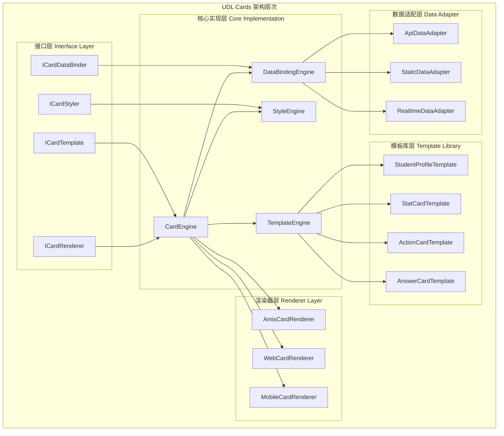

# UDL Cards 详细实现方案

## 概述

UDL Cards是CodeSpirit框架中UI描述语言的核心组件，专门用于构建自适应卡片界面。本文档详细描述了UDL Cards的技术实现方案，包括架构设计、接口定义、核心算法和集成方式。

## 技术架构

### 核心架构图



## 核心接口设计

### 1. 卡片模板接口

```csharp
/// <summary>
/// 卡片模板接口
/// </summary>
public interface ICardTemplate
{
    /// <summary>
    /// 模板标识符
    /// </summary>
    string TemplateId { get; }
    
    /// <summary>
    /// 模板名称
    /// </summary>
    string Name { get; }
    
    /// <summary>
    /// 模板描述
    /// </summary>
    string Description { get; }
    
    /// <summary>
    /// 支持的数据类型
    /// </summary>
    Type[] SupportedDataTypes { get; }
    
    /// <summary>
    /// 模板配置
    /// </summary>
    CardTemplateConfig Config { get; }
    
    /// <summary>
    /// 验证数据是否匹配模板
    /// </summary>
    bool IsDataCompatible(object data);
    
    /// <summary>
    /// 生成卡片配置
    /// </summary>
    Task<CardConfig> GenerateCardConfig(object data, CardRenderContext context);
}
```

### 2. 卡片渲染器接口

```csharp
/// <summary>
/// 卡片渲染器接口
/// </summary>
public interface ICardRenderer
{
    /// <summary>
    /// 渲染器名称
    /// </summary>
    string RendererName { get; }
    
    /// <summary>
    /// 支持的平台
    /// </summary>
    string[] SupportedPlatforms { get; }
    
    /// <summary>
    /// 渲染卡片
    /// </summary>
    Task<CardRenderResult> RenderCard(CardConfig config, CardRenderContext context);
    
    /// <summary>
    /// 批量渲染卡片
    /// </summary>
    Task<CardRenderResult[]> RenderCards(CardConfig[] configs, CardRenderContext context);
}
```

### 3. 数据绑定接口

```csharp
/// <summary>
/// 卡片数据绑定器接口
/// </summary>
public interface ICardDataBinder
{
    /// <summary>
    /// 绑定数据到卡片
    /// </summary>
    Task<object> BindData(CardDataBinding binding, CardRenderContext context);
    
    /// <summary>
    /// 解析绑定表达式
    /// </summary>
    DataBindingExpression ParseBinding(string bindingExpression);
    
    /// <summary>
    /// 验证绑定有效性
    /// </summary>
    bool ValidateBinding(CardDataBinding binding);
}
```

## 核心数据模型

### 1. 卡片配置模型

```csharp
/// <summary>
/// 卡片配置
/// </summary>
public class CardConfig
{
    /// <summary>
    /// 卡片ID
    /// </summary>
    public string Id { get; set; }
    
    /// <summary>
    /// 卡片类型
    /// </summary>
    public CardType Type { get; set; }
    
    /// <summary>
    /// 模板引用
    /// </summary>
    public string TemplateId { get; set; }
    
    /// <summary>
    /// 卡片标题
    /// </summary>
    public CardContent Title { get; set; }
    
    /// <summary>
    /// 卡片副标题
    /// </summary>
    public CardContent Subtitle { get; set; }
    
    /// <summary>
    /// 卡片内容
    /// </summary>
    public CardContent Content { get; set; }
    
    /// <summary>
    /// 卡片操作
    /// </summary>
    public List<CardAction> Actions { get; set; } = new();
    
    /// <summary>
    /// 样式配置
    /// </summary>
    public CardStyle Style { get; set; }
    
    /// <summary>
    /// 数据绑定
    /// </summary>
    public CardDataBinding DataBinding { get; set; }
    
    /// <summary>
    /// 响应式配置
    /// </summary>
    public Dictionary<string, CardConfig> ResponsiveConfigs { get; set; } = new();
}
```

### 2. 卡片内容模型

```csharp
/// <summary>
/// 卡片内容
/// </summary>
public class CardContent
{
    /// <summary>
    /// 内容类型
    /// </summary>
    public CardContentType Type { get; set; }
    
    /// <summary>
    /// 静态文本内容
    /// </summary>
    public string Text { get; set; }
    
    /// <summary>
    /// 模板内容
    /// </summary>
    public string Template { get; set; }
    
    /// <summary>
    /// 字段列表（用于信息展示卡片）
    /// </summary>
    public List<CardField> Fields { get; set; } = new();
    
    /// <summary>
    /// 统计信息（用于统计卡片）
    /// </summary>
    public CardStatistics Statistics { get; set; }
    
    /// <summary>
    /// 布局配置
    /// </summary>
    public CardLayout Layout { get; set; }
}
```

### 3. 数据绑定模型

```csharp
/// <summary>
/// 卡片数据绑定
/// </summary>
public class CardDataBinding
{
    /// <summary>
    /// 数据源类型
    /// </summary>
    public DataSourceType SourceType { get; set; }
    
    /// <summary>
    /// 数据源配置
    /// </summary>
    public string SourceConfig { get; set; }
    
    /// <summary>
    /// API端点（用于API数据源）
    /// </summary>
    public string ApiEndpoint { get; set; }
    
    /// <summary>
    /// 静态数据（用于静态数据源）
    /// </summary>
    public object StaticData { get; set; }
    
    /// <summary>
    /// 数据转换规则
    /// </summary>
    public List<DataTransformRule> TransformRules { get; set; } = new();
    
    /// <summary>
    /// 刷新间隔（毫秒）
    /// </summary>
    public int? RefreshInterval { get; set; }
    
    /// <summary>
    /// 缓存策略
    /// </summary>
    public CacheStrategy CacheStrategy { get; set; }
}
```

## 预定义模板实现

### 1. 考生信息卡片模板

```csharp
/// <summary>
/// 考生信息卡片模板
/// </summary>
public class StudentProfileCardTemplate : ICardTemplate
{
    public string TemplateId => "student-profile-card";
    public string Name => "考生信息卡片";
    public string Description => "展示考生基本信息的卡片模板";
    public Type[] SupportedDataTypes => new[] { typeof(StudentProfileDto) };

    public CardTemplateConfig Config => new()
    {
        DefaultStyle = new CardStyle
        {
            Size = CardSize.Medium,
            Variant = CardVariant.Profile,
            Background = CardBackground.Gradient
        },
        RequiredFields = new[] { "name", "studentNumber" },
        OptionalFields = new[] { "gender", "admissionTicket", "phoneNumber" }
    };

    public bool IsDataCompatible(object data)
    {
        return data is StudentProfileDto || 
               (data != null && HasRequiredProperties(data, Config.RequiredFields));
    }

    public async Task<CardConfig> GenerateCardConfig(object data, CardRenderContext context)
    {
        var config = new CardConfig
        {
            Id = $"student-profile-{Guid.NewGuid():N}",
            Type = CardType.InfoCard,
            TemplateId = TemplateId,
            Style = ApplyContextStyle(Config.DefaultStyle, context)
        };

        // 配置标题
        config.Title = new CardContent
        {
            Type = CardContentType.Template,
            Template = "考生信息"
        };

        // 配置内容字段
        config.Content = new CardContent
        {
            Type = CardContentType.FieldList,
            Layout = new CardLayout 
            { 
                Type = LayoutType.Flex,
                Direction = FlexDirection.Row,
                Wrap = FlexWrap.Wrap
            },
            Fields = GenerateFields(data)
        };

        return config;
    }

    private List<CardField> GenerateFields(object data)
    {
        var fields = new List<CardField>();
        var dataDict = ObjectToDictionary(data);

        // 姓名字段
        if (dataDict.ContainsKey("name"))
        {
            fields.Add(new CardField
            {
                Key = "name",
                Label = "姓名",
                Value = dataDict["name"]?.ToString(),
                Icon = "fa-user",
                Style = new FieldStyle { Weight = FontWeight.Bold }
            });
        }

        // 学号字段
        if (dataDict.ContainsKey("studentNumber"))
        {
            fields.Add(new CardField
            {
                Key = "studentNumber",
                Label = "学号",
                Value = dataDict["studentNumber"]?.ToString(),
                Icon = "fa-id-card"
            });
        }

        // 其他字段...
        AddOptionalField(fields, dataDict, "gender", "性别", "fa-venus-mars");
        AddOptionalField(fields, dataDict, "admissionTicket", "准考证号", "fa-ticket", "未设置");

        return fields;
    }
}
```

### 2. 统计卡片模板

```csharp
/// <summary>
/// 统计卡片模板
/// </summary>
public class StatCardTemplate : ICardTemplate
{
    public string TemplateId => "stat-card";
    public string Name => "统计卡片";
    public string Description => "展示统计数据的卡片模板";
    public Type[] SupportedDataTypes => new[] { typeof(StatisticsDto) };

    public CardTemplateConfig Config => new()
    {
        DefaultStyle = new CardStyle
        {
            Size = CardSize.Medium,
            Variant = CardVariant.Statistics,
            Background = CardBackground.Auto
        }
    };

    public async Task<CardConfig> GenerateCardConfig(object data, CardRenderContext context)
    {
        var config = new CardConfig
        {
            Id = $"stat-card-{Guid.NewGuid():N}",
            Type = CardType.StatCard,
            TemplateId = TemplateId,
            Style = ApplyContextStyle(Config.DefaultStyle, context)
        };

        var stats = ExtractStatistics(data);

        // 配置内容
        config.Content = new CardContent
        {
            Type = CardContentType.Statistics,
            Statistics = stats,
            Layout = new CardLayout 
            { 
                Type = LayoutType.Center 
            }
        };

        // 配置标题
        config.Title = new CardContent
        {
            Type = CardContentType.Text,
            Text = stats.Label
        };

        return config;
    }

    private CardStatistics ExtractStatistics(object data)
    {
        var dataDict = ObjectToDictionary(data);
        
        return new CardStatistics
        {
            Value = dataDict.GetValueOrDefault("value")?.ToString() ?? "0",
            Total = dataDict.GetValueOrDefault("total")?.ToString(),
            Label = dataDict.GetValueOrDefault("label")?.ToString() ?? "统计",
            Format = dataDict.GetValueOrDefault("format")?.ToString() ?? "{value}",
            Percentage = CalculatePercentage(dataDict),
            Status = DetermineStatus(dataDict),
            Icon = dataDict.GetValueOrDefault("icon")?.ToString() ?? "fa-chart-bar"
        };
    }
}
```

## 核心引擎实现

### 1. 卡片引擎

```csharp
/// <summary>
/// UDL Cards 核心引擎
/// </summary>
public class CardEngine
{
    private readonly IServiceProvider _serviceProvider;
    private readonly IMemoryCache _cache;
    private readonly ILogger<CardEngine> _logger;
    private readonly Dictionary<string, ICardTemplate> _templates;
    private readonly Dictionary<string, ICardRenderer> _renderers;

    public CardEngine(
        IServiceProvider serviceProvider,
        IMemoryCache cache,
        ILogger<CardEngine> logger)
    {
        _serviceProvider = serviceProvider;
        _cache = cache;
        _logger = logger;
        _templates = new Dictionary<string, ICardTemplate>();
        _renderers = new Dictionary<string, ICardRenderer>();
        
        RegisterDefaultTemplates();
        RegisterDefaultRenderers();
    }

    /// <summary>
    /// 渲染单个卡片
    /// </summary>
    public async Task<CardRenderResult> RenderCard(CardRequest request)
    {
        try
        {
            // 1. 验证请求
            ValidateRequest(request);

            // 2. 获取或生成卡片配置
            var config = await GetOrGenerateCardConfig(request);

            // 3. 绑定数据
            if (config.DataBinding != null)
            {
                await BindCardData(config, request.Context);
            }

            // 4. 获取渲染器
            var renderer = GetRenderer(request.Context.Platform);

            // 5. 渲染卡片
            var result = await renderer.RenderCard(config, request.Context);

            // 6. 缓存结果
            CacheRenderResult(request, result);

            return result;
        }
        catch (Exception ex)
        {
            _logger.LogError(ex, "Failed to render card: {TemplateId}", request.TemplateId);
            throw;
        }
    }

    /// <summary>
    /// 批量渲染卡片
    /// </summary>
    public async Task<CardRenderResult[]> RenderCards(CardRequest[] requests)
    {
        var tasks = requests.Select(RenderCard);
        return await Task.WhenAll(tasks);
    }

    /// <summary>
    /// 注册卡片模板
    /// </summary>
    public void RegisterTemplate(ICardTemplate template)
    {
        _templates[template.TemplateId] = template;
        _logger.LogInformation("Registered card template: {TemplateId}", template.TemplateId);
    }

    /// <summary>
    /// 注册渲染器
    /// </summary>
    public void RegisterRenderer(ICardRenderer renderer)
    {
        _renderers[renderer.RendererName] = renderer;
        _logger.LogInformation("Registered card renderer: {RendererName}", renderer.RendererName);
    }

    private async Task<CardConfig> GetOrGenerateCardConfig(CardRequest request)
    {
        // 尝试从缓存获取
        var cacheKey = GenerateCacheKey(request);
        if (_cache.TryGetValue(cacheKey, out CardConfig cachedConfig))
        {
            return cachedConfig;
        }

        // 生成新配置
        var template = GetTemplate(request.TemplateId);
        var config = await template.GenerateCardConfig(request.Data, request.Context);

        // 缓存配置
        _cache.Set(cacheKey, config, TimeSpan.FromMinutes(30));

        return config;
    }

    private async Task BindCardData(CardConfig config, CardRenderContext context)
    {
        var dataBinder = _serviceProvider.GetRequiredService<ICardDataBinder>();
        
        if (config.DataBinding != null)
        {
            var boundData = await dataBinder.BindData(config.DataBinding, context);
            
            // 更新卡片配置中的数据引用
            UpdateDataReferences(config, boundData);
        }
    }
}
```

### 2. AMIS渲染器实现

```csharp
/// <summary>
/// AMIS卡片渲染器
/// </summary>
public class AmisCardRenderer : ICardRenderer
{
    public string RendererName => "amis";
    public string[] SupportedPlatforms => new[] { "web", "mobile-web" };

    public async Task<CardRenderResult> RenderCard(CardConfig config, CardRenderContext context)
    {
        var amisConfig = new JObject();

        // 基础配置
        amisConfig["type"] = "card";
        amisConfig["className"] = GenerateClassName(config);

        // 渲染标题
        if (config.Title != null)
        {
            amisConfig["header"] = await RenderCardHeader(config, context);
        }

        // 渲染内容
        amisConfig["body"] = await RenderCardBody(config, context);

        // 渲染操作
        if (config.Actions?.Any() == true)
        {
            amisConfig["actions"] = await RenderCardActions(config.Actions, context);
        }

        // 应用样式
        if (config.Style != null)
        {
            ApplyCardStyle(amisConfig, config.Style, context);
        }

        return new CardRenderResult
        {
            Success = true,
            Content = amisConfig.ToString(),
            ContentType = "application/json",
            Metadata = new Dictionary<string, object>
            {
                ["cardId"] = config.Id,
                ["templateId"] = config.TemplateId,
                ["renderTime"] = DateTime.UtcNow
            }
        };
    }

    private async Task<JObject> RenderCardHeader(CardConfig config, CardRenderContext context)
    {
        var header = new JObject();

        // 标题
        if (config.Title != null)
        {
            header["title"] = await RenderContent(config.Title, context);
        }

        // 副标题
        if (config.Subtitle != null)
        {
            header["subTitle"] = await RenderContent(config.Subtitle, context);
        }

        return header;
    }

    private async Task<JToken> RenderCardBody(CardConfig config, CardRenderContext context)
    {
        if (config.Content == null)
        {
            return new JArray();
        }

        switch (config.Content.Type)
        {
            case CardContentType.FieldList:
                return RenderFieldList(config.Content.Fields, context);
            
            case CardContentType.Statistics:
                return RenderStatistics(config.Content.Statistics, context);
            
            case CardContentType.Template:
                return RenderTemplate(config.Content.Template, context);
            
            default:
                return new JArray();
        }
    }

    private JToken RenderFieldList(List<CardField> fields, CardRenderContext context)
    {
        var body = new JArray();

        foreach (var field in fields)
        {
            var fieldConfig = new JObject
            {
                ["type"] = "tpl",
                ["tpl"] = GenerateFieldTemplate(field),
                ["className"] = "card-field"
            };

            body.Add(fieldConfig);
        }

        return body;
    }

    private string GenerateFieldTemplate(CardField field)
    {
        var icon = !string.IsNullOrEmpty(field.Icon) ? $"<i class=\"{field.Icon}\"></i> " : "";
        var label = $"<span class=\"field-label\">{field.Label}：</span>";
        var value = $"<span class=\"field-value\">{field.Value ?? field.Fallback ?? ""}</span>";
        
        return $"<div class=\"field-item\">{icon}{label}{value}</div>";
    }
}
```

## 前端SDK实现

### JavaScript SDK

```typescript
/**
 * UDL Cards JavaScript SDK
 */
export class UDLCardsSDK {
    private config: UDLCardsConfig;
    private cache: Map<string, any>;
    private eventBus: EventBus;

    constructor(config: UDLCardsConfig) {
        this.config = config;
        this.cache = new Map();
        this.eventBus = new EventBus();
        this.initialize();
    }

    /**
     * 渲染单个卡片
     */
    async renderCard(
        containerId: string, 
        request: CardRenderRequest
    ): Promise<CardRenderResult> {
        try {
            // 验证容器
            const container = this.getContainer(containerId);
            
            // 发送渲染请求
            const response = await this.sendRenderRequest(request);
            
            // 渲染到容器
            await this.renderToContainer(container, response);
            
            // 绑定事件
            this.bindCardEvents(container, response);
            
            // 触发渲染完成事件
            this.eventBus.emit('card-rendered', {
                containerId,
                cardId: response.metadata.cardId,
                templateId: response.metadata.templateId
            });

            return response;
        } catch (error) {
            this.handleRenderError(containerId, error);
            throw error;
        }
    }

    /**
     * 批量渲染卡片
     */
    async renderCards(
        containerId: string,
        requests: CardRenderRequest[]
    ): Promise<CardRenderResult[]> {
        const container = this.getContainer(containerId);
        
        // 并行渲染所有卡片
        const renderPromises = requests.map(request => 
            this.sendRenderRequest(request)
        );
        
        const results = await Promise.all(renderPromises);
        
        // 渲染到容器
        await this.renderCardsToContainer(container, results);
        
        return results;
    }

    /**
     * 使用预定义模板渲染卡片
     */
    async renderWithTemplate(
        containerId: string,
        templateId: string,
        data: any,
        options?: CardRenderOptions
    ): Promise<CardRenderResult> {
        const request: CardRenderRequest = {
            templateId,
            data,
            context: {
                platform: options?.platform || 'web',
                theme: options?.theme || 'default',
                ...options?.context
            }
        };

        return this.renderCard(containerId, request);
    }

    /**
     * 刷新卡片数据
     */
    async refreshCard(cardId: string): Promise<void> {
        const cardElement = document.querySelector(`[data-card-id="${cardId}"]`);
        if (!cardElement) {
            throw new Error(`Card not found: ${cardId}`);
        }

        const originalRequest = this.getCardRequest(cardId);
        if (!originalRequest) {
            throw new Error(`Original request not found for card: ${cardId}`);
        }

        // 重新渲染卡片
        const container = cardElement.parentElement!;
        await this.renderCard(container.id, originalRequest);
    }

    /**
     * 注册卡片事件监听器
     */
    onCardEvent(event: string, callback: (data: any) => void): void {
        this.eventBus.on(event, callback);
    }

    private async sendRenderRequest(request: CardRenderRequest): Promise<CardRenderResult> {
        // 检查缓存
        const cacheKey = this.generateCacheKey(request);
        if (this.cache.has(cacheKey)) {
            return this.cache.get(cacheKey);
        }

        // 发送API请求
        const response = await fetch(`${this.config.apiBaseUrl}/api/udl/cards/render`, {
            method: 'POST',
            headers: {
                'Content-Type': 'application/json',
                'Authorization': `Bearer ${this.config.token}`
            },
            body: JSON.stringify(request)
        });

        if (!response.ok) {
            throw new Error(`Render request failed: ${response.statusText}`);
        }

        const result = await response.json();
        
        // 缓存结果
        this.cache.set(cacheKey, result);
        
        return result;
    }

    private async renderToContainer(
        container: HTMLElement, 
        result: CardRenderResult
    ): Promise<void> {
        if (result.contentType === 'application/json') {
            // 使用AMIS渲染器
            await this.renderWithAmis(container, JSON.parse(result.content));
        } else {
            // 直接插入HTML
            container.innerHTML = result.content;
        }
    }

    private async renderWithAmis(container: HTMLElement, config: any): Promise<void> {
        // 使用AMIS SDK渲染
        const amisScoped = await import('amis');
        
        amisScoped.render(
            config,
            {
                // AMIS渲染上下文
            },
            {
                container: container
            }
        );
    }
}

// 使用示例
const udlCardsSDK = new UDLCardsSDK({
    apiBaseUrl: '/api/udl',
    token: 'your-auth-token',
    theme: 'default'
});

// 渲染考生信息卡片
await udlCardsSDK.renderWithTemplate(
    'student-info-container',
    'student-profile-card',
    {
        name: '张三',
        studentNumber: '2024001',
        gender: '男',
        admissionTicket: 'T2024001'
    }
);
```

## 集成示例

### 1. 在监考大屏中使用

```javascript
// 监考大屏集成示例
class ExamMonitorDashboard {
    constructor() {
        this.udlSDK = new UDLCardsSDK({
            apiBaseUrl: '/exam/api/udl',
            theme: 'large-screen'
        });
        this.initializeDashboard();
    }

    async initializeDashboard() {
        // 渲染统计卡片
        await Promise.all([
            this.renderStatCard('total-students', 'stat-card', 'totalStudents'),
            this.renderStatCard('online-students', 'stat-card', 'onlineStudents'),
            this.renderStatCard('submitted-count', 'stat-card', 'submittedCount'),
            this.renderStatCard('cheating-count', 'stat-card', 'cheatingCount')
        ]);

        // 设置自动刷新
        this.setupAutoRefresh();
    }

    async renderStatCard(containerId, templateId, dataKey) {
        await this.udlSDK.renderWithTemplate(
            containerId,
            templateId,
            {
                binding: `api://exam/monitor/stats.${dataKey}`,
                label: this.getStatLabel(dataKey),
                format: '{value}'
            },
            {
                platform: 'large-screen',
                theme: 'monitor'
            }
        );
    }

    setupAutoRefresh() {
        setInterval(async () => {
            const cardIds = this.getAllCardIds();
            await Promise.all(
                cardIds.map(cardId => this.udlSDK.refreshCard(cardId))
            );
        }, 10000); // 每10秒刷新
    }
}
```

### 2. 在考试客户端中使用

```javascript
// 考试客户端集成示例
class ExamClient {
    constructor() {
        this.udlSDK = new UDLCardsSDK({
            apiBaseUrl: '/exam/api/udl',
            theme: 'client'
        });
        this.initializeClient();
    }

    async initializeClient() {
        // 渲染考生信息卡片
        await this.udlSDK.renderWithTemplate(
            'student-profile-section',
            'student-profile-card',
            {
                binding: 'api://exam/client/profile'
            }
        );

        // 渲染答题卡
        await this.udlSDK.renderWithTemplate(
            'answer-card-section',
            'answer-card',
            {
                binding: 'api://exam/client/questions'
            }
        );

        // 监听卡片事件
        this.udlSDK.onCardEvent('answer-card-click', (data) => {
            this.scrollToQuestion(data.questionId);
        });
    }

    scrollToQuestion(questionId) {
        const questionElement = document.getElementById(`question-${questionId}`);
        if (questionElement) {
            questionElement.scrollIntoView({ behavior: 'smooth' });
        }
    }
}
```

## 测试方案

### 1. 单元测试

```csharp
[TestClass]
public class CardEngineTests
{
    private CardEngine _cardEngine;
    private Mock<IServiceProvider> _mockServiceProvider;
    private Mock<IMemoryCache> _mockCache;

    [TestInitialize]
    public void Setup()
    {
        _mockServiceProvider = new Mock<IServiceProvider>();
        _mockCache = new Mock<IMemoryCache>();
        
        _cardEngine = new CardEngine(
            _mockServiceProvider.Object,
            _mockCache.Object,
            Mock.Of<ILogger<CardEngine>>()
        );
    }

    [TestMethod]
    public async Task RenderCard_WithValidRequest_ReturnsSuccess()
    {
        // Arrange
        var request = new CardRequest
        {
            TemplateId = "student-profile-card",
            Data = new { name = "张三", studentNumber = "2024001" },
            Context = new CardRenderContext { Platform = "web" }
        };

        // Act
        var result = await _cardEngine.RenderCard(request);

        // Assert
        Assert.IsTrue(result.Success);
        Assert.IsNotNull(result.Content);
    }
}
```

### 2. 集成测试

```csharp
[TestClass]
public class CardIntegrationTests
{
    private TestServer _server;
    private HttpClient _client;

    [TestInitialize]
    public void Setup()
    {
        var builder = WebApplication.CreateBuilder();
        // 配置测试服务...
        
        _server = new TestServer(builder);
        _client = _server.CreateClient();
    }

    [TestMethod]
    public async Task RenderCard_EndToEnd_ReturnsValidAmisConfig()
    {
        // Arrange
        var request = new CardRenderRequest
        {
            TemplateId = "student-profile-card",
            Data = new { name = "测试学生", studentNumber = "TEST001" }
        };

        // Act
        var response = await _client.PostAsync("/api/udl/cards/render", 
            new StringContent(JsonSerializer.Serialize(request), Encoding.UTF8, "application/json"));

        // Assert
        response.EnsureSuccessStatusCode();
        var content = await response.Content.ReadAsStringAsync();
        var result = JsonSerializer.Deserialize<CardRenderResult>(content);
        
        Assert.IsTrue(result.Success);
        Assert.IsTrue(IsValidAmisConfig(result.Content));
    }
}
```

## 部署和配置

### 1. 服务注册

```csharp
// Program.cs 或 Startup.cs
public static void Main(string[] args)
{
    var builder = WebApplication.CreateBuilder(args);

    // 注册UDL Cards服务
    builder.Services.AddUDLCards(options =>
    {
        options.DefaultPlatform = "web";
        options.DefaultTheme = "default";
        options.CacheExpiration = TimeSpan.FromMinutes(30);
        options.EnableAutoRefresh = true;
    });

    // 注册自定义模板
    builder.Services.AddScoped<ICardTemplate, StudentProfileCardTemplate>();
    builder.Services.AddScoped<ICardTemplate, StatCardTemplate>();
    
    // 注册渲染器
    builder.Services.AddScoped<ICardRenderer, AmisCardRenderer>();

    var app = builder.Build();

    // 配置UDL Cards中间件
    app.UseUDLCards();

    app.Run();
}
```

### 2. 配置文件

```json
{
  "UDLCards": {
    "DefaultPlatform": "web",
    "DefaultTheme": "default",
    "Cache": {
      "ExpirationMinutes": 30,
      "MaxSize": 1000
    },
    "Templates": {
      "Directory": "Templates/Cards",
      "AutoLoad": true
    },
    "Renderers": {
      "Default": "amis",
      "EnableMultiple": true
    },
    "Api": {
      "BasePath": "/api/udl/cards",
      "RateLimiting": {
        "RequestsPerMinute": 100
      }
    }
  }
}
```

## 性能优化

### 1. 缓存策略

- **模板缓存**: 预编译常用模板配置
- **渲染结果缓存**: 缓存静态数据的渲染结果
- **数据缓存**: 缓存API数据，支持TTL和LRU策略

### 2. 渲染优化

- **批量渲染**: 支持一次请求渲染多个卡片
- **增量更新**: 仅更新变化的卡片部分
- **懒加载**: 大型卡片列表支持虚拟滚动

### 3. 网络优化

- **请求合并**: 合并多个卡片的数据请求
- **压缩传输**: 启用GZIP压缩
- **CDN支持**: 静态资源CDN分发

## 总结

UDL Cards的详细实现方案提供了完整的技术架构和实现指导，包括：

1. **清晰的接口设计**: 定义了核心接口和数据模型
2. **可扩展的模板系统**: 支持自定义模板和预定义模板
3. **多平台渲染支持**: 基于AMIS的渲染器实现
4. **完整的SDK**: 前端JavaScript SDK便于集成
5. **实际应用示例**: 监考大屏和考试客户端的集成案例
6. **测试和部署指南**: 完整的测试策略和部署配置

这个实现方案为UDL Cards的开发提供了详细的技术指导，确保系统的可维护性、可扩展性和性能表现。 