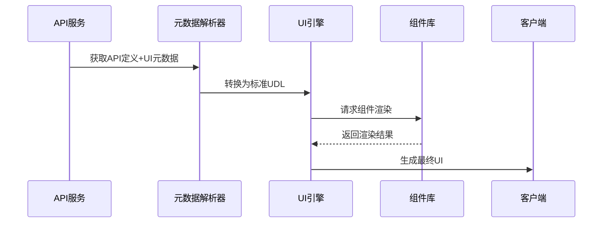
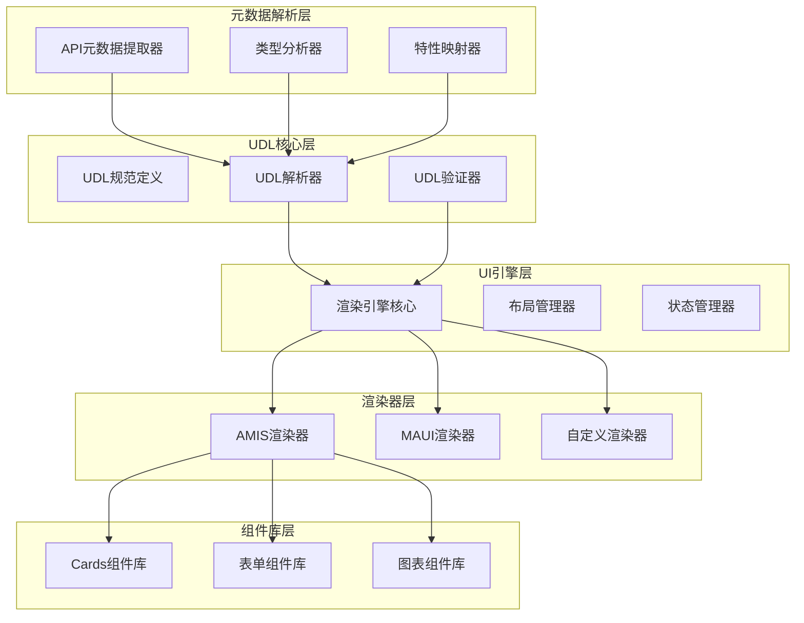
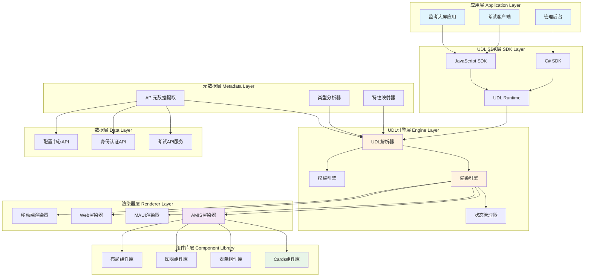
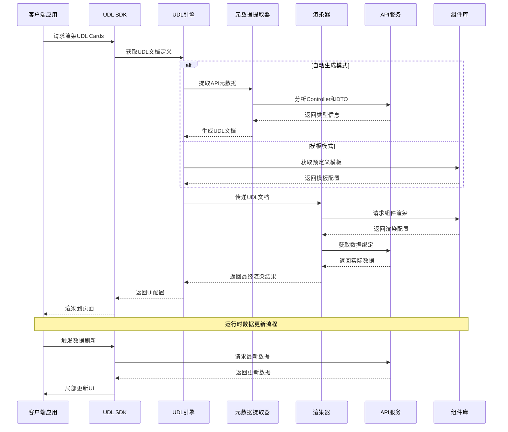
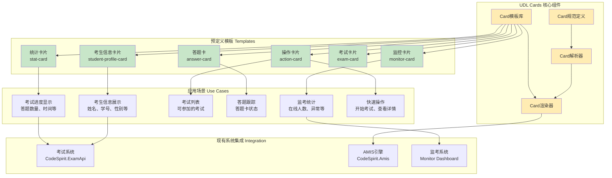

# UDL（UI描述语言）设计方案

## 概述

UDL（UI Description Language）是CodeSpirit框架中的统一UI描述语言，旨在解决跨平台、跨应用场景下内容呈现的一致性与开发效率问题。通过标准化的UI描述规范，支持Web渲染、移动端渲染、大屏渲染等多模态输出，实现"一次定义，处处使用"的目标。

## 整体架构设计

### 系统架构图



### 核心模块设计



### 整体技术架构图



## UDL规范定义

### 1. UDL基础结构

```json
{
  "version": "1.0",
  "type": "udl-document",
  "metadata": {
    "id": "unique-document-id",
    "title": "文档标题",
    "description": "文档描述",
    "created": "2024-01-01T00:00:00Z",
    "updated": "2024-01-01T00:00:00Z",
    "author": "author-id",
    "tags": ["tag1", "tag2"]
  },
  "data": {
    "sources": [],
    "bindings": {}
  },
  "layout": {
    "type": "container",
    "children": []
  },
  "styles": {
    "theme": "default",
    "variables": {},
    "classes": {}
  },
  "scripts": {
    "events": {},
    "actions": {}
  }
}
```

### 2. UDL Cards 核心规范

#### 基础Card结构
```json
{
  "type": "card",
  "id": "card-unique-id",
  "title": "卡片标题",
  "subtitle": "卡片副标题",
  "content": {
    "type": "content-type",
    "data": {},
    "layout": "layout-type"
  },
  "actions": [],
  "styling": {
    "size": "medium",
    "variant": "default",
    "background": "auto",
    "border": "auto"
  },
  "responsive": {
    "mobile": {},
    "tablet": {},
    "desktop": {},
    "large-screen": {}
  }
}
```

#### 支持的Card类型

##### 信息展示卡片
```json
{
  "type": "info-card",
  "template": "student-profile",
  "data": {
    "binding": "api://exam/client/profile"
  },
  "content": {
    "fields": [
      {
        "key": "name",
        "label": "姓名",
        "type": "text",
        "icon": "fa-user"
      },
      {
        "key": "studentNumber", 
        "label": "学号",
        "type": "text",
        "icon": "fa-id-card"
      }
    ]
  }
}
```

##### 统计卡片
```json
{
  "type": "stat-card",
  "template": "exam-progress",
  "data": {
    "binding": "api://exam/monitor/stats"
  },
  "content": {
    "value": {
      "binding": "answeredCount"
    },
    "total": {
      "binding": "totalQuestions"
    },
    "label": "答题进度",
    "format": "{value}/{total} ({percentage}%)"
  }
}
```

##### 操作卡片
```json
{
  "type": "action-card", 
  "template": "exam-list-item",
  "data": {
    "binding": "api://exam/client/available"
  },
  "content": {
    "title": {
      "binding": "name"
    },
    "description": {
      "binding": "description"
    },
    "metadata": [
      {
        "label": "考试时长",
        "value": {
          "binding": "duration",
          "format": "{value}分钟"
        }
      }
    ]
  },
  "actions": [
    {
      "type": "primary",
      "label": "开始考试",
      "action": "navigate",
      "target": "/exam/{id}"
    }
  ]
}
```

## UDL工作流程

### 系统处理流程图



## 元数据解析层实现

### API元数据提取器

基于现有的CodeSpirit.Amis组件，扩展元数据提取功能：

```csharp
public class UDLMetadataExtractor
{
    public UDLDocument ExtractFromController(Type controllerType)
    {
        var document = new UDLDocument
        {
            Version = "1.0",
            Type = "udl-document",
            Metadata = ExtractControllerMetadata(controllerType)
        };

        // 提取CRUD操作
        var crudActions = DetectCrudActions(controllerType);
        document.Layout = GenerateLayoutFromActions(crudActions);

        // 提取数据绑定
        document.Data = ExtractDataBindings(controllerType);

        return document;
    }

    private UDLLayout GenerateLayoutFromActions(CrudActions actions)
    {
        var layout = new UDLContainer();

        if (actions.HasList)
        {
            layout.Children.Add(GenerateListCard(actions.ListMethod));
        }

        if (actions.HasCreate)
        {
            layout.Children.Add(GenerateCreateCard(actions.CreateMethod));
        }

        // 其他操作...

        return layout;
    }
}
```

### 类型分析器

```csharp
public class UDLTypeAnalyzer
{
    public UDLCardSpec AnalyzeDto(Type dtoType)
    {
        var card = new UDLCardSpec
        {
            Type = "info-card",
            Template = GenerateTemplateName(dtoType)
        };

        var properties = dtoType.GetProperties();
        foreach (var prop in properties)
        {
            var field = AnalyzeProperty(prop);
            card.Content.Fields.Add(field);
        }

        return card;
    }

    private UDLField AnalyzeProperty(PropertyInfo property)
    {
        var field = new UDLField
        {
            Key = property.Name.ToCamelCase(),
            Label = GetDisplayName(property),
            Type = MapToUDLType(property.PropertyType)
        };

        // 分析特性
        var attributes = property.GetCustomAttributes();
        foreach (var attr in attributes)
        {
            ApplyAttributeToField(field, attr);
        }

        return field;
    }
}
```

## UI引擎层实现

### 渲染引擎核心

```csharp
public class UDLRenderEngine
{
    private readonly IServiceProvider _serviceProvider;
    private readonly Dictionary<string, IUDLRenderer> _renderers;

    public UDLRenderEngine(IServiceProvider serviceProvider)
    {
        _serviceProvider = serviceProvider;
        _renderers = new Dictionary<string, IUDLRenderer>();
        RegisterDefaultRenderers();
    }

    public async Task<RenderResult> RenderAsync(UDLDocument document, RenderContext context)
    {
        var renderer = GetRenderer(context.Platform);
        return await renderer.RenderAsync(document, context);
    }

    private void RegisterDefaultRenderers()
    {
        _renderers["amis"] = _serviceProvider.GetService<AmisUDLRenderer>();
        _renderers["maui"] = _serviceProvider.GetService<MauiUDLRenderer>();
    }
}
```

### AMIS渲染器实现

```csharp
public class AmisUDLRenderer : IUDLRenderer
{
    public async Task<RenderResult> RenderAsync(UDLDocument document, RenderContext context)
    {
        var amisConfig = new JObject();
        
        // 渲染布局
        amisConfig["type"] = "page";
        amisConfig["body"] = await RenderLayout(document.Layout, context);
        
        // 应用样式
        if (document.Styles != null)
        {
            amisConfig["css"] = ConvertStylesToAmis(document.Styles);
        }

        return new RenderResult
        {
            Content = amisConfig.ToString(),
            ContentType = "application/json"
        };
    }

    private async Task<JToken> RenderLayout(UDLLayout layout, RenderContext context)
    {
        switch (layout.Type)
        {
            case "card":
                return await RenderCard((UDLCard)layout, context);
            case "container":
                return await RenderContainer((UDLContainer)layout, context);
            default:
                throw new NotSupportedException($"Layout type {layout.Type} not supported");
        }
    }

    private async Task<JObject> RenderCard(UDLCard card, RenderContext context)
    {
        var amisCard = new JObject
        {
            ["type"] = "card",
            ["header"] = new JObject
            {
                ["title"] = await ResolveBinding(card.Title, context),
                ["subTitle"] = await ResolveBinding(card.Subtitle, context)
            }
        };

        // 渲染卡片内容
        amisCard["body"] = await RenderCardContent(card.Content, context);

        // 渲染操作按钮
        if (card.Actions?.Any() == true)
        {
            amisCard["actions"] = await RenderActions(card.Actions, context);
        }

        return amisCard;
    }
}
```

## UDL Cards 组件库

### Cards组件关系图



### 预定义模板

#### 考生信息卡片模板
```json
{
  "template": "student-profile-card",
  "type": "info-card",
  "styling": {
    "size": "medium",
    "variant": "profile"
  },
  "content": {
    "layout": "flex",
    "fields": [
      {
        "key": "name",
        "label": "姓名", 
        "type": "text",
        "icon": "fa-user",
        "styling": { "weight": "bold" }
      },
      {
        "key": "studentNumber",
        "label": "学号",
        "type": "text", 
        "icon": "fa-id-card"
      },
      {
        "key": "gender",
        "label": "性别",
        "type": "text",
        "icon": "fa-venus-mars"
      },
      {
        "key": "admissionTicket",
        "label": "准考证号",
        "type": "text",
        "icon": "fa-ticket",
        "fallback": "未设置"
      }
    ]
  }
}
```

#### 考试状态卡片模板
```json
{
  "template": "exam-status-card",
  "type": "stat-card", 
  "styling": {
    "size": "large",
    "variant": "dashboard"
  },
  "content": {
    "value": {
      "binding": "answeredCount"
    },
    "total": {
      "binding": "totalQuestions"  
    },
    "label": "答题进度",
    "format": "{value}/{total}",
    "percentage": {
      "binding": "progressPercentage",
      "format": "{value}%"
    },
    "status": {
      "binding": "status",
      "mapping": {
        "in-progress": "进行中",
        "completed": "已完成",
        "timeout": "已超时"
      }
    }
  }
}
```

#### 答题卡组件模板
```json
{
  "template": "answer-card",
  "type": "interactive-card",
  "data": {
    "binding": "api://exam/questions"
  },
  "content": {
    "type": "grid",
    "itemTemplate": {
      "type": "answer-item",
      "content": {
        "number": {
          "binding": "index"
        },
        "status": {
          "binding": "answered",
          "mapping": {
            "true": "answered",
            "false": "unanswered"
          }
        }
      },
      "actions": [
        {
          "type": "click",
          "action": "scroll-to-question",
          "params": {
            "questionId": {
              "binding": "id"
            }
          }
        }
      ]
    }
  }
}
```

### 组件库实现

```csharp
public class UDLCardsComponentLibrary
{
    private readonly Dictionary<string, UDLCardTemplate> _templates;

    public UDLCardsComponentLibrary()
    {
        _templates = new Dictionary<string, UDLCardTemplate>();
        LoadPredefinedTemplates();
    }

    public UDLCardTemplate GetTemplate(string templateName)
    {
        return _templates.TryGetValue(templateName, out var template) 
            ? template 
            : throw new ArgumentException($"Template {templateName} not found");
    }

    public void RegisterTemplate(string name, UDLCardTemplate template)
    {
        _templates[name] = template;
    }

    private void LoadPredefinedTemplates()
    {
        // 加载预定义模板
        LoadTemplatesFromAssembly();
        LoadTemplatesFromConfiguration();
    }
}
```

## SDK集成方案

### 前端SDK设计

```typescript
// UDL Cards SDK
export class UDLCardsSDK {
    private apiBaseUrl: string;
    private renderer: UDLRenderer;

    constructor(config: UDLConfig) {
        this.apiBaseUrl = config.apiBaseUrl;
        this.renderer = new AmisRenderer(config.renderConfig);
    }

    async renderCards(containerId: string, dataSource: string): Promise<void> {
        // 获取UDL定义
        const udlDocument = await this.fetchUDLDocument(dataSource);
        
        // 渲染到容器
        await this.renderer.render(containerId, udlDocument);
    }

    async renderCard(containerId: string, cardTemplate: string, data: any): Promise<void> {
        const cardConfig = await this.getCardTemplate(cardTemplate);
        const renderedCard = await this.renderer.renderCard(cardConfig, data);
        
        const container = document.getElementById(containerId);
        container.innerHTML = renderedCard;
    }

    private async fetchUDLDocument(dataSource: string): Promise<UDLDocument> {
        const response = await fetch(`${this.apiBaseUrl}${dataSource}`);
        return await response.json();
    }
}

// 使用示例
const udlSDK = new UDLCardsSDK({
    apiBaseUrl: '/api/udl',
    renderConfig: {
        platform: 'amis',
        theme: 'default'
    }
});

// 渲染考生信息卡片
await udlSDK.renderCard('student-info-container', 'student-profile-card', {
    name: '张三',
    studentNumber: '2024001',
    gender: '男'
});

// 渲染答题卡
await udlSDK.renderCards('answer-card-container', '/exam/udl/answer-card');
```

### 后端API接口

```csharp
[ApiController]
[Route("api/udl")]
public class UDLController : ControllerBase
{
    private readonly UDLMetadataExtractor _extractor;
    private readonly UDLRenderEngine _renderEngine;

    [HttpGet("generate/{controllerName}")]
    public async Task<ActionResult<UDLDocument>> GenerateUDL(string controllerName)
    {
        var controllerType = GetControllerType(controllerName);
        var udlDocument = _extractor.ExtractFromController(controllerType);
        return Ok(udlDocument);
    }

    [HttpPost("render")]
    public async Task<ActionResult<RenderResult>> RenderUDL([FromBody] RenderRequest request)
    {
        var context = new RenderContext
        {
            Platform = request.Platform,
            Theme = request.Theme,
            ViewportSize = request.ViewportSize
        };

        var result = await _renderEngine.RenderAsync(request.Document, context);
        return Ok(result);
    }

    [HttpGet("template/{templateName}")]
    public ActionResult<UDLCardTemplate> GetCardTemplate(string templateName)
    {
        var template = _componentLibrary.GetTemplate(templateName);
        return Ok(template);
    }
}
```

## 应用场景实现

### 监考大屏场景

```json
{
  "version": "1.0",
  "type": "udl-document", 
  "metadata": {
    "id": "exam-monitor-dashboard",
    "title": "监考大屏",
    "description": "考试监控大屏显示"
  },
  "data": {
    "sources": [
      {
        "id": "exam-stats",
        "url": "/exam/api/exam/Monitor/exam/{examId}",
        "refresh": 10000
      }
    ]
  },
  "layout": {
    "type": "dashboard",
    "children": [
      {
        "type": "card",
        "template": "exam-header-card",
        "span": "full-width",
        "data": { "binding": "exam-stats.exam" }
      },
      {
        "type": "grid",
        "columns": 4,
        "children": [
          {
            "type": "card",
            "template": "stat-card",
            "data": { 
              "binding": "exam-stats.totalStudents",
              "label": "总人数"
            }
          },
          {
            "type": "card", 
            "template": "stat-card",
            "data": {
              "binding": "exam-stats.onlineStudents",
              "label": "在线人数"
            }
          },
          {
            "type": "card",
            "template": "stat-card", 
            "data": {
              "binding": "exam-stats.submittedCount",
              "label": "已交卷"
            }
          },
          {
            "type": "card",
            "template": "stat-card",
            "data": {
              "binding": "exam-stats.cheatingCount", 
              "label": "异常行为"
            }
          }
        ]
      }
    ]
  },
  "styles": {
    "theme": "large-screen",
    "variables": {
      "primaryColor": "#3f51b5",
      "fontSize": "18px"
    }
  }
}
```

### 考试客户端场景

```json
{
  "version": "1.0",
  "type": "udl-document",
  "metadata": {
    "id": "exam-client-ui",
    "title": "考试客户端",
    "description": "学生考试界面"
  },
  "data": {
    "sources": [
      {
        "id": "student-profile",
        "url": "/exam/api/exam/client/profile"
      },
      {
        "id": "exam-data", 
        "url": "/exam/api/exam/client/current"
      }
    ]
  },
  "layout": {
    "type": "exam-layout",
    "header": {
      "type": "card",
      "template": "student-profile-card",
      "data": { "binding": "student-profile" }
    },
    "main": {
      "type": "container",
      "children": [
        {
          "type": "card",
          "template": "exam-info-card",
          "data": { "binding": "exam-data.exam" }
        },
        {
          "type": "card", 
          "template": "answer-card",
          "data": { "binding": "exam-data.questions" }
        }
      ]
    }
  },
  "responsive": {
    "mobile": {
      "layout": {
        "type": "mobile-exam-layout"
      }
    }
  }
}
```

## 技术实现路线图

### 第一阶段：UDL Cards 基础实现

**时间周期**：4-6周

**主要任务**：
1. 定义UDL Cards核心规范
2. 实现基于AMIS的渲染器
3. 创建预定义卡片模板库
4. 开发前端SDK基础功能
5. 集成到现有考试系统

**交付成果**：
- UDL Cards规范文档 v1.0
- AmisUDLRenderer 实现
- 基础卡片模板（信息卡片、统计卡片、操作卡片）
- JavaScript SDK
- 考试客户端集成demo

### 第二阶段：元数据自动生成

**时间周期**：3-4周

**主要任务**：
1. 扩展现有AmisGenerator支持UDL输出
2. 实现API元数据自动提取
3. 开发UDL文档生成工具
4. 完善类型分析和映射

**交付成果**：
- UDLMetadataExtractor
- 自动化UDL生成工具
- 类型映射配置
- 批量转换工具

### 第三阶段：多平台渲染支持

**时间周期**：6-8周

**主要任务**：
1. 设计多平台渲染器接口
2. 实现MAUI渲染器（可选）
3. 支持响应式布局
4. 优化大屏显示效果

**交付成果**：
- 多平台渲染架构
- 响应式UDL规范扩展
- 大屏优化模板
- 性能优化方案

### 第四阶段：生态完善

**时间周期**：4-6周

**主要任务**：
1. 完善组件库和模板
2. 开发可视化编辑器
3. 建立模板市场
4. 完善文档和示例

**交付成果**：
- 完整组件库
- UDL可视化编辑器
- 模板市场平台
- 完整技术文档

## 性能和扩展性考虑

### 性能优化

1. **模板缓存**：预编译常用模板，减少运行时解析开销
2. **增量渲染**：支持局部更新，避免全页面重渲染
3. **懒加载**：大型数据集分页加载
4. **CDN支持**：静态资源CDN分发

### 扩展性设计

1. **插件架构**：支持自定义组件和渲染器
2. **主题系统**：可配置的主题和样式
3. **国际化**：多语言支持
4. **版本管理**：向后兼容的版本升级策略

## 总结

UDL设计方案基于CodeSpirit现有的AMIS组件架构，通过标准化的UI描述语言实现跨平台UI一致性。第一阶段重点实现UDL Cards，满足监考大屏和考试客户端的实际需求，后续逐步扩展到完整的UI描述语言生态系统。

该方案充分利用了现有的技术积累，通过渐进式的实现路径，确保在满足当前业务需求的同时，为未来的扩展奠定坚实基础。 