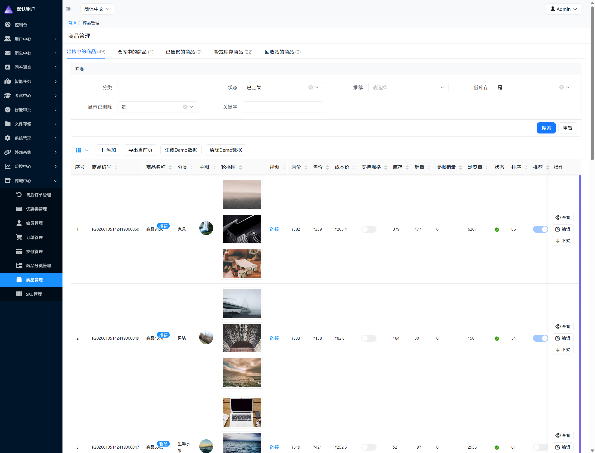
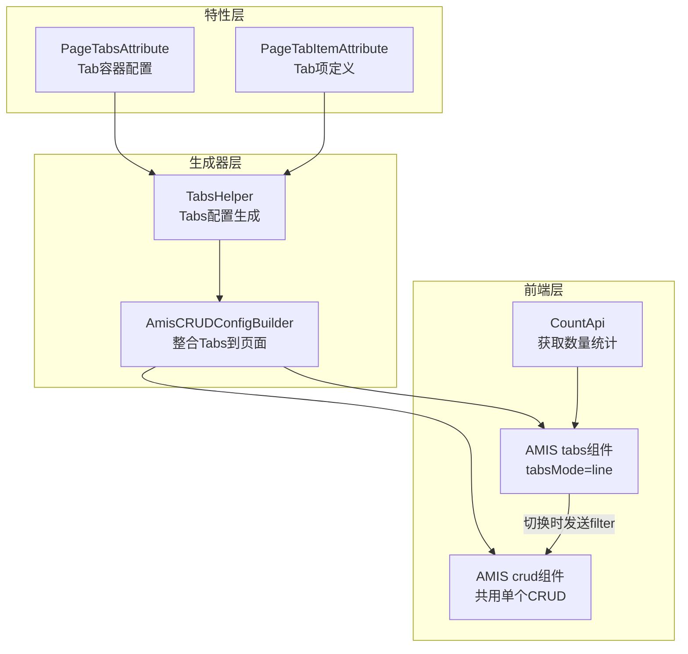
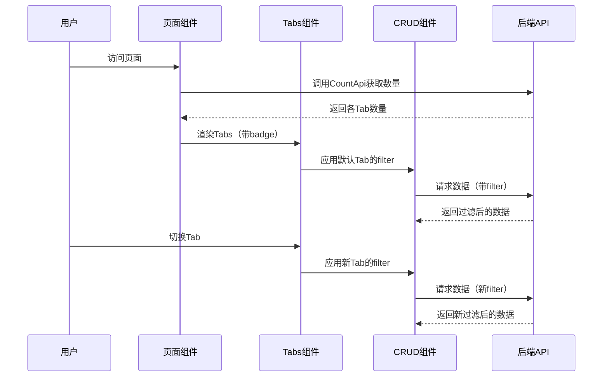

# CodeSpirit 页面顶部Tab功能指南

## 概述

CodeSpirit 提供了页面顶部Tab自动生成功能，允许开发者在查询DTO上通过特性标记或强类型配置自动生成顶部Tab切换界面。每个Tab对应不同的数据过滤条件，支持显示数量badge，实现类似"出售中的商品"、"仓库中的商品"等分类展示场景。



### 主要特性

- ✅ **声明式配置**：通过特性标记或强类型配置即可完成Tab配置
- ✅ **强类型安全**：使用强类型配置提供编译时类型检查
- ✅ **自动过滤**：Tab切换时自动应用过滤条件到CRUD
- ✅ **自动统计**：强类型配置自动生成统计逻辑
- ✅ **数量Badge**：支持显示各Tab的数据数量（静态）
- ✅ **灵活排序**：支持自定义Tab顺序
- ✅ **样式定制**：支持Tab样式模式（line、card、radio）
- ✅ **图标支持**：支持为Tab添加图标

## 架构设计

### 整体架构



### 数据流程



## 配置方式对比

CodeSpirit 支持两种Tab配置方式：**传统特性标记方式**和**强类型配置方式**（推荐）。

### 传统方式（特性标记）

```csharp
[PageTabs(CountApi = "api/mall/Products/tab-counts", DefaultTab = "on_sale")]
[PageTabItem(Key = "on_sale", Title = "出售中的商品", Filter = "{\"status\": 1}", Order = 1)]
[PageTabItem(Key = "off_sale", Title = "仓库中的商品", Filter = "{\"status\": 2}", Order = 2)]
public class ProductQueryDto : QueryDtoBase
{
    public ProductStatus? Status { get; set; }
}
```

**问题**：
- ❌ Filter 是字符串，没有类型检查
- ❌ 统计字段命名靠约定，容易出错
- ❌ 统计逻辑需要手动实现，容易与 Filter 不一致

### 强类型方式（推荐）

```csharp
[PageTabs<ProductTabsConfig>]
public class ProductQueryDto : QueryDtoBase
{
    public ProductStatus? Status { get; set; }
}
```

**优势**：
- ✅ 强类型，编译时检查
- ✅ Filter 和统计逻辑统一定义
- ✅ 自动生成统计方法
- ✅ 代码复用性高
- ✅ 避免字符串拼写错误

> 💡 **推荐**：新项目优先使用强类型配置方式，传统方式仍然兼容，可在同一项目中混用。

## 特性说明

### PageTabsAttribute

应用于查询DTO类，用于配置Tab容器。

| 属性 | 类型 | 默认值 | 说明 |
|------|------|--------|------|
| `CountApi` | string | "" | 获取各Tab数量的API路径 |
| `TabsMode` | TabsMode | Line | Tab样式模式枚举（Line/Card/Radio） |
| `DefaultTab` | string | "" | 默认选中的Tab key |
| `ShowBadge` | bool | true | 是否显示数量badge |

#### TabsMode 枚举

| 枚举值 | 说明 |
|--------|------|
| `Line` | 横向Tab（默认） |
| `Card` | 卡片Tab |
| `Radio` | 单选Tab |

### PageTabItemAttribute

应用于查询DTO类（AllowMultiple），用于定义单个Tab。

| 属性 | 类型 | 默认值 | 说明 |
|------|------|--------|------|
| `Key` | string | "" | Tab唯一标识（用于defaultKey和badge变量名） |
| `Title` | string | "" | Tab显示标题 |
| `Filter` | string | "" | 过滤条件JSON字符串 |
| `Order` | int | 0 | Tab排序顺序 |
| `Icon` | string | "" | Tab图标（可选） |
| `BadgeLevel` | BadgeLevel | Default | Badge样式级别枚举 |

#### BadgeLevel 枚举

| 枚举值 | 说明 | AMIS 样式类 | 效果 |
|--------|------|------------|------|
| `Default` | 默认样式（不指定级别） | `text-muted` | 静音灰色 |
| `Info` | 信息样式 | `text-info` | 信息蓝色 |
| `Success` | 成功样式 | `text-success` | 成功绿色 |
| `Warning` | 警告样式 | `text-warning` | 警告橙色 |
| `Danger` | 危险样式 | `text-danger` | 危险红色 |

> 💡 **自动应用**：系统会自动根据 BadgeLevel 为 Tab 数量 badge 应用 [AMIS 官方文本颜色样式](https://aisuda.bce.baidu.com/amis/zh-CN/style/typography/text-color)，确保样式与主题一致。

## 快速开始（强类型配置）

### 1. 创建 Tabs 配置类

在 `Configuration` 文件夹中创建配置类：

```csharp
using CodeSpirit.Amis.Enums;
using CodeSpirit.Amis.Tabs;
using CodeSpirit.MallApi.Dtos.Product;
using CodeSpirit.MallApi.Models;
using CodeSpirit.MallApi.Models.Enums;
using Microsoft.EntityFrameworkCore;

namespace CodeSpirit.MallApi.Configuration;

/// <summary>
/// 商品Tab配置
/// </summary>
public class ProductTabsConfig : TabsConfigBase<ProductQueryDto>
{
    /// <summary>
    /// Tab键常量
    /// </summary>
    public static class TabKeys
    {
        public const string OnSale = "on_sale";
        public const string OffSale = "off_sale";
        public const string SoldOut = "sold_out";
        public const string LowStock = "low_stock";
        public const string Deleted = "deleted";
    }

    /// <summary>
    /// 配置Tabs
    /// </summary>
    public override void Configure(TabsBuilder<ProductQueryDto> builder)
    {
        // 配置容器
        builder.SetCountApi("api/mall/Products/tab-counts")
               .SetDefaultTab(TabKeys.OnSale)
               .SetTabsMode(TabsMode.Line)
               .SetShowBadge(true);

        // 出售中的商品
        builder.AddTab(TabKeys.OnSale, "出售中的商品")
               .WithFilter(q => q.Status = ProductStatus.OnSale)
               .WithOrder(1)
               .WithCustomCount<Product>(async query =>
                   await query.Where(x => x.Status == ProductStatus.OnSale).CountAsync());

        // 仓库中的商品
        builder.AddTab(TabKeys.OffSale, "仓库中的商品")
               .WithFilter(q => q.Status = ProductStatus.OffSale)
               .WithOrder(2)
               .WithCustomCount<Product>(async query =>
                   await query.Where(x => x.Status == ProductStatus.OffSale).CountAsync());

        // 已售罄的商品
        builder.AddTab(TabKeys.SoldOut, "已售罄的商品")
               .WithFilter(q => q.Status = ProductStatus.SoldOut)
               .WithOrder(3)
               .WithCustomCount<Product>(async query =>
                   await query.Where(x => x.Status == ProductStatus.SoldOut).CountAsync());

        // 警戒库存商品
        builder.AddTab(TabKeys.LowStock, "警戒库存商品")
               .WithFilter(q => q.LowStock = true)
               .WithOrder(4)
               .WithBadgeLevel(BadgeLevel.Warning)
               .WithCustomCount<Product>(async query =>
                   await query.Where(x => x.Stock <= 10 || 
                          (x.HasSpec && x.Specs.Any(s => s.IsEnabled && s.Stock <= 10)))
                          .CountAsync());

        // 回收站的商品
        builder.AddTab(TabKeys.Deleted, "回收站的商品")
               .WithFilter(q => q.ShowDeleted = true)
               .WithOrder(5)
               .WithCustomCount<Product>(async query =>
                   await query.IgnoreQueryFilters().Where(x => x.IsDeleted).CountAsync());
    }
}
```

### 2. 在查询 DTO 上应用配置

```csharp
using CodeSpirit.Amis.Attributes;
using CodeSpirit.Core.Dtos;
using CodeSpirit.MallApi.Configuration;
using CodeSpirit.MallApi.Models.Enums;

namespace CodeSpirit.MallApi.Dtos.Product;

/// <summary>
/// 商品查询参数
/// </summary>
[PageTabs<ProductTabsConfig>]
public class ProductQueryDto : QueryDtoBase
{
    public ProductStatus? Status { get; set; }
    public bool? LowStock { get; set; }
    public bool? ShowDeleted { get; set; }
}
```

### 3. 在 Service 中使用自动生成的统计方法

```csharp
using CodeSpirit.Amis.Tabs;
using CodeSpirit.MallApi.Configuration;
using CodeSpirit.MallApi.Dtos.Product;
using CodeSpirit.MallApi.Models;

public class ProductService : IProductService
{
    private readonly MallDbContext _dbContext;

    public async Task<Dictionary<string, int>> GetTabCountsAsync()
    {
        var baseQuery = _dbContext.Products.AsQueryable();

        // 使用强类型配置自动生成统计
        return await TabsCountGenerator.GenerateCountsAsync<ProductQueryDto, Product>(
            baseQuery,
            typeof(ProductTabsConfig));
    }
}
```

### 4. 添加控制器端点

```csharp
[HttpGet("tab-counts")]
[DisplayName("获取Tab数量统计")]
public async Task<ActionResult<ApiResponse<Dictionary<string, int>>>> GetTabCounts()
{
    var counts = await _productService.GetTabCountsAsync();
    return SuccessResponse(counts);
}
```

### 5. 实现查询过滤逻辑

在查询方法中处理Tab的过滤条件：

```csharp
private async Task<PageList<ProductDto>> GetProductsFromDatabaseAsync(ProductQueryDto queryDto)
{
    var query = _dbContext.Products.AsQueryable();

    // 处理软删除查询
    if (queryDto.ShowDeleted == true)
    {
        using (_dbContext.DataFilter?.Disable<ISoftDeleteAuditable>())
        {
            query = _dbContext.Products.Where(x => x.IsDeleted);
            // ... 其他查询逻辑
        }
    }

    // 处理状态过滤
    if (queryDto.Status.HasValue)
    {
        query = query.Where(x => x.Status == queryDto.Status.Value);
    }

    // 处理低库存过滤
    if (queryDto.LowStock == true)
    {
        query = query.Where(x => x.Stock <= 10 || 
                (x.HasSpec && x.Specs.Any(s => s.IsEnabled && s.Stock <= 10)));
    }

    // ... 其他查询逻辑
}
```

## TabsBuilder API 参考

### 容器配置方法

| 方法 | 说明 | 示例 |
|------|------|------|
| `SetCountApi(string)` | 设置统计 API 路径 | `.SetCountApi("api/mall/Products/tab-counts")` |
| `SetDefaultTab(string)` | 设置默认选中的 Tab | `.SetDefaultTab("on_sale")` |
| `SetTabsMode(TabsMode)` | 设置 Tab 样式枚举 | `.SetTabsMode(TabsMode.Line)` |
| `SetShowBadge(bool)` | 是否显示数量 badge | `.SetShowBadge(true)` |

### Tab 项配置方法

| 方法 | 说明 | 示例 |
|------|------|------|
| `AddTab(string key, string title)` | 添加 Tab 项 | `.AddTab("on_sale", "出售中的商品")` |
| `WithFilter(Action<TQueryDto>)` | 设置过滤条件（强类型） | `.WithFilter(q => q.Status = ProductStatus.OnSale)` |
| `WithOrder(int)` | 设置排序顺序 | `.WithOrder(1)` |
| `WithIcon(string)` | 设置图标 | `.WithIcon("fa fa-check")` |
| `WithBadgeLevel(BadgeLevel)` | 设置 Badge 样式级别枚举 | `.WithBadgeLevel(BadgeLevel.Warning)` |
| `WithCustomCount<TEntity>(Func<...>)` | 设置自定义统计方法（必须） | `.WithCustomCount<Product>(async query => ...)` |

## 高级用法

### 复杂的统计逻辑

强类型配置支持复杂的 EF Core 查询逻辑：

```csharp
builder.AddTab(TabKeys.LowStock, "警戒库存商品")
       .WithFilter(q => q.LowStock = true)
       .WithBadgeLevel(BadgeLevel.Warning)  // 自动应用 text-warning 样式
       .WithCustomCount<Product>(async query =>
       {
           // 支持复杂的统计逻辑
           return await query
               .Where(x => x.Stock <= 10 || 
                      (x.HasSpec && x.Specs.Any(s => s.IsEnabled && s.Stock <= 10)))
               .CountAsync();
       });
```

### 软删除数据统计（多租户场景）

⚠️ **重要**：在多租户场景下，不能在 `WithCustomCount` 中使用 `IgnoreQueryFilters()`，因为它会忽略多租户过滤器，导致统计结果包含其他租户的数据。

**正确做法**：在 Service 层使用 `IDataFilter` 单独处理回收站统计：

```csharp
// ProductTabsConfig.cs - 配置类中使用占位符
builder.AddTab(TabKeys.Deleted, "回收站的商品")
       .WithFilter(q => q.ShowDeleted = true)
       .WithCustomCount<Product>(async query => 0); // 占位符，实际统计在 Service 层

// ProductService.cs - Service 层手动处理统计
public async Task<Dictionary<string, int>> GetTabCountsAsync()
{
    var baseQuery = _dbContext.Products.AsQueryable();
    
    // 使用强类型配置自动生成统计（不包含回收站）
    var counts = await TabsCountGenerator.GenerateCountsAsync<ProductQueryDto, Product>(
        baseQuery,
        typeof(ProductTabsConfig));
    
    // 单独处理回收站统计，使用 IDataFilter 仅禁用软删除过滤器
    using (_dbContext.DataFilter?.Disable<ISoftDeleteAuditable>())
    {
        var deletedCount = await _dbContext.Products
            .Where(x => x.IsDeleted)
            .CountAsync();
        counts["deletedCount"] = deletedCount;
    }
    
    return counts;
}
```

### 使用 Tab 键常量

定义常量避免拼写错误：

```csharp
public static class TabKeys
{
    public const string OnSale = "on_sale";
    public const string OffSale = "off_sale";
    public const string SoldOut = "sold_out";
    public const string LowStock = "low_stock";
    public const string Deleted = "deleted";
}

// 使用常量
builder.SetDefaultTab(TabKeys.OnSale);
builder.AddTab(TabKeys.OnSale, "出售中的商品");
```

### BadgeLevel 样式应用

系统会自动根据 BadgeLevel 为 Tab 数量 badge 应用 [AMIS 官方文本颜色样式类](https://aisuda.bce.baidu.com/amis/zh-CN/style/typography/text-color)：

```csharp
// 默认灰色
builder.AddTab(TabKeys.OnSale, "出售中的商品")
       .WithCustomCount<Product>(async query => await query.CountAsync());

// 蓝色 - 信息
builder.AddTab(TabKeys.Info, "信息提示")
       .WithBadgeLevel(BadgeLevel.Info)
       .WithCustomCount<Product>(async query => await query.CountAsync());

// 绿色 - 成功
builder.AddTab(TabKeys.Published, "已发布")
       .WithBadgeLevel(BadgeLevel.Success)
       .WithCustomCount<Product>(async query => await query.CountAsync());

// 橙色 - 警告
builder.AddTab(TabKeys.LowStock, "警戒库存")
       .WithBadgeLevel(BadgeLevel.Warning)
       .WithCustomCount<Product>(async query => await query.CountAsync());

// 红色 - 危险
builder.AddTab(TabKeys.Error, "错误状态")
       .WithBadgeLevel(BadgeLevel.Danger)
       .WithCustomCount<Product>(async query => await query.CountAsync());
```

## 自动化特性

系统自动完成：
- ✅ 将 `WithFilter` 中的条件转换为前端 JSON
- ✅ 自动生成统计键名（如 `on_sale` → `onSaleCount`）
- ✅ 根据 BadgeLevel 应用 AMIS 官方样式类（`text-info`、`text-warning` 等）
- ✅ 统一管理 Filter 和统计逻辑，避免不一致
- ✅ 编译时类型检查

## 配置说明

### Badge变量命名规则

Badge变量名遵循规则：`{Key}Count`（Key 会自动转换为驼峰式命名）

- Tab Key为 `on_sale` → Badge变量为 `onSaleCount`
- Tab Key为 `low_stock` → Badge变量为 `lowStockCount`

### CountApi响应格式

CountApi应返回包含各Tab数量的字典：

```json
{
  "onSaleCount": 25,
  "offSaleCount": 10,
  "soldOutCount": 5,
  "lowStockCount": 3,
  "deletedCount": 2
}
```

### Filter 自动转换

强类型配置中，`WithFilter` 的条件会自动转换为前端 JSON：

```csharp
// 后端配置
.WithFilter(q => q.Status = ProductStatus.OnSale)

// 自动转换为前端 JSON
{"status": 1}
```

## 注意事项

### 1. WithCustomCount 必须提供

⚠️ 使用强类型配置时，每个 Tab 必须调用 `WithCustomCount`，否则会抛出异常。

```csharp
// ✅ 正确：提供统计逻辑
builder.AddTab(TabKeys.OnSale, "出售中的商品")
       .WithFilter(q => q.Status = ProductStatus.OnSale)
       .WithCustomCount<Product>(async query => 
           await query.Where(x => x.Status == ProductStatus.OnSale).CountAsync());

// ❌ 错误：缺少 WithCustomCount
builder.AddTab(TabKeys.OnSale, "出售中的商品")
       .WithFilter(q => q.Status = ProductStatus.OnSale);
```

### 2. WithFilter 仅用于前端

⚠️ `WithFilter` 中的条件仅用于前端过滤，后端需要在查询方法中处理相应的查询参数。

```csharp
// 前端配置
.WithFilter(q => q.Status = ProductStatus.OnSale)

// 后端查询方法需要处理 Status 参数
if (queryDto.Status.HasValue)
{
    query = query.Where(x => x.Status == queryDto.Status.Value);
}
```

### 3. 软删除查询与统计（多租户安全）

⚠️ **安全警告**：在多租户场景下，处理软删除数据时必须谨慎！

#### 查询列表时

查询已删除数据时，使用 `IDataFilter` 临时禁用软删除过滤器：

```csharp
if (queryDto.ShowDeleted == true)
{
    using (_dbContext.DataFilter?.Disable<ISoftDeleteAuditable>())
    {
        query = _dbContext.Products.Where(x => x.IsDeleted);
        // ... 其他查询逻辑
    }
}
```

#### 统计数量时

**❌ 错误做法**：在 `WithCustomCount` 中使用 `IgnoreQueryFilters()`

```csharp
// ❌ 危险！会统计所有租户的已删除数据
builder.AddTab(TabKeys.Deleted, "回收站")
       .WithCustomCount<Product>(async query =>
           await query.IgnoreQueryFilters().Where(x => x.IsDeleted).CountAsync());
```

**✅ 正确做法**：在 Service 层使用 `IDataFilter`

```csharp
// 配置类中使用占位符
builder.AddTab(TabKeys.Deleted, "回收站")
       .WithCustomCount<Product>(async query => 0);

// Service 层手动处理
public async Task<Dictionary<string, int>> GetTabCountsAsync()
{
    var counts = await TabsCountGenerator.GenerateCountsAsync<ProductQueryDto, Product>(
        baseQuery, typeof(ProductTabsConfig));
    
    // 使用 IDataFilter 保证租户隔离
    using (_dbContext.DataFilter?.Disable<ISoftDeleteAuditable>())
    {
        counts["deletedCount"] = await _dbContext.Products
            .Where(x => x.IsDeleted)
            .CountAsync();
    }
    
    return counts;
}
```

**原因**：`IgnoreQueryFilters()` 会忽略**所有**全局过滤器（包括多租户过滤器），而 `IDataFilter.Disable<ISoftDeleteAuditable>()` 只禁用软删除过滤器，保留多租户隔离。

### 4. Filter 和统计逻辑保持一致

⚠️ `WithFilter` 和 `WithCustomCount` 中的条件应该保持一致，避免前端显示的数量与实际数据不符。

```csharp
// ✅ 正确：条件一致
builder.AddTab(TabKeys.OnSale, "出售中的商品")
       .WithFilter(q => q.Status = ProductStatus.OnSale)
       .WithCustomCount<Product>(async query =>
           await query.Where(x => x.Status == ProductStatus.OnSale).CountAsync());

// ❌ 错误：条件不一致
builder.AddTab(TabKeys.OnSale, "出售中的商品")
       .WithFilter(q => q.Status = ProductStatus.OnSale)
       .WithCustomCount<Product>(async query =>
           await query.Where(x => x.Status == ProductStatus.OffSale).CountAsync()); // 错误
```

### 5. Badge变量命名

- Tab的Key会自动转换为驼峰式命名后加上 `Count` 后缀
- 例如：`on_sale` → `onSaleCount`，`low_stock` → `lowStockCount`
- `TabsCountGenerator` 会自动生成正确的字典键名

### 6. CountApi路径

- 如果CountApi以 `/` 开头，视为绝对路径，直接使用
- 如果CountApi不以 `/` 开头，会拼接基础API路径
- 建议使用相对路径（如 `api/mall/Products/tab-counts`），由系统自动拼接

### 7. 默认选中Tab

- AMIS的tabs组件使用 `activeKey` 属性设置默认激活的Tab
- 如果未指定 `DefaultTab`，会自动选中第一个Tab（按Order排序后的第一个）

### 8. Tab排序

- Tab按 `Order` 属性排序，数字越小越靠前
- 如果Order相同，按Key字母顺序排序

### 9. 性能考虑

- CountApi在页面初始化时调用一次，获取静态数量
- 数量不会自动刷新，需要用户刷新页面
- 对于频繁变化的数据，考虑添加缓存或使用后台定时更新

## 最佳实践

### 1. 配置类命名与组织

- 配置类命名：`{EntityName}TabsConfig`（如 `ProductTabsConfig`）
- 放置位置：项目的 `Configuration` 文件夹
- 使用静态内部类 `TabKeys` 集中管理 Tab 键常量

```csharp
public class ProductTabsConfig : TabsConfigBase<ProductQueryDto>
{
    public static class TabKeys
    {
        public const string OnSale = "on_sale";
        public const string OffSale = "off_sale";
    }
}
```

### 2. Tab 键命名规范

- 使用下划线命名：`on_sale`、`low_stock`、`sold_out`
- 定义为常量，避免拼写错误
- 使用描述性名称，清晰表达 Tab 含义

### 3. Filter 和统计逻辑

- Filter 和统计逻辑必须保持一致
- 复杂统计逻辑使用 `WithCustomCount`
- 考虑性能，避免 N+1 查询
- **多租户场景**：软删除统计在 Service 层使用 `IDataFilter`

```csharp
// ✅ 推荐：Filter 和统计一致
builder.AddTab(TabKeys.LowStock, "警戒库存")
       .WithFilter(q => q.LowStock = true)
       .WithCustomCount<Product>(async query =>
           await query.Where(x => x.Stock <= 10).CountAsync());

// ✅ 推荐：软删除统计使用占位符
builder.AddTab(TabKeys.Deleted, "回收站")
       .WithFilter(q => q.ShowDeleted = true)
       .WithCustomCount<Product>(async query => 0); // Service 层处理

// ❌ 错误：使用 IgnoreQueryFilters() 会破坏多租户隔离
builder.AddTab(TabKeys.Deleted, "回收站")
       .WithCustomCount<Product>(async query =>
           await query.IgnoreQueryFilters().Where(x => x.IsDeleted).CountAsync());
```

### 4. 代码复用

- 将通用的统计逻辑提取为方法
- 使用常量避免硬编码
- 考虑创建基类配置共享公共逻辑

### 5. 统计接口优化

- 使用 `TabsCountGenerator.GenerateCountsAsync` 自动生成统计
- 考虑添加缓存，减少数据库压力
- 对于大数据量，考虑使用后台定时更新

```csharp
public async Task<Dictionary<string, int>> GetTabCountsAsync()
{
    var baseQuery = _dbContext.Products.AsQueryable();
    
    // 使用自动生成器
    return await TabsCountGenerator.GenerateCountsAsync<ProductQueryDto, Product>(
        baseQuery,
        typeof(ProductTabsConfig));
}
```

### 6. 错误处理

- CountApi失败时，Tab仍可正常显示（badge显示为空）
- 建议添加日志记录，便于排查问题
- 在统计方法中捕获异常，返回默认值

### 7. 样式类自动适配

✅ **AMIS 样式集成**：系统使用 [AMIS 官方文本颜色样式类](https://aisuda.bce.baidu.com/amis/zh-CN/style/typography/text-color)。

**优势**：
- ✅ 自动适配 AMIS 主题
- ✅ 语义化样式命名
- ✅ 统一的视觉体验
- ✅ 无需手动维护颜色值

生成的 HTML：
```html
<!-- BadgeLevel.Warning -->
<span class='text-warning'>(${lowStockCount})</span>

<!-- BadgeLevel.Danger -->
<span class='text-danger'>(${errorCount})</span>
```

### 8. 多租户安全

⚠️ **关键安全原则**：在多租户系统中，必须确保每个租户只能看到自己的数据。

**安全检查清单**：
- ✅ 实体类实现 `IMultiTenant` 接口
- ✅ 软删除统计在 Service 层使用 `IDataFilter`
- ✅ 避免在 `WithCustomCount` 中使用 `IgnoreQueryFilters()`
- ✅ 定期审计统计逻辑，确保租户隔离

```csharp
// ✅ 安全：使用 IDataFilter 仅禁用软删除过滤器
using (_dbContext.DataFilter?.Disable<ISoftDeleteAuditable>())
{
    var count = await _dbContext.Products
        .Where(x => x.IsDeleted)
        .CountAsync(); // 仍然应用多租户过滤器
}

// ❌ 危险：忽略所有过滤器，包括多租户
var count = await _dbContext.Products
    .IgnoreQueryFilters()
    .Where(x => x.IsDeleted)
    .CountAsync(); // 可能统计到其他租户的数据！
```

## 与传统方式的兼容性

强类型配置方式与传统的特性标记方式完全兼容，可以在同一项目中混用：

```csharp
// 传统方式（仍然支持）
[PageTabs(CountApi = "api/orders/tab-counts")]
[PageTabItem(Key = "pending", Title = "待处理", Filter = "{\"status\": 1}")]
public class OrderQueryDto : QueryDtoBase { }

// 强类型方式（推荐）
[PageTabs<ProductTabsConfig>]
public class ProductQueryDto : QueryDtoBase { }
```

## 与PageAside的区别

| 特性 | PageTabs | PageAside |
|------|----------|-----------|
| 位置 | 页面顶部 | 页面侧边栏 |
| 用途 | 数据分类切换 | 查询条件筛选 |
| 配置方式 | 特性标记 或 强类型配置 | 特性标记 |
| 数量显示 | 支持badge | 不支持 |
| 过滤方式 | 自动应用filter | 表单提交 |
| 统计支持 | 自动生成（强类型） | 不支持 |
| 使用场景 | 状态分类、类型切换 | 复杂查询条件 |

## 总结

页面顶部Tab功能为CodeSpirit框架提供了强大的数据分类展示能力。**强类型配置方式**通过统一管理 Filter 和统计逻辑，提供了更好的类型安全和代码复用性，有效避免了传统方式中容易出现的不一致问题。

### 主要优势

- ✅ **类型安全**：编译时检查，避免字符串拼写错误
- ✅ **逻辑统一**：Filter 和统计在同一处定义，确保一致性
- ✅ **自动生成**：使用 `TabsCountGenerator` 自动生成统计方法
- ✅ **样式集成**：自动应用 [AMIS 官方样式类](https://aisuda.bce.baidu.com/amis/zh-CN/style/typography/text-color)，适配主题
- ✅ **代码复用**：配置类可以被多处引用和继承
- ✅ **易于维护**：集中管理 Tab 配置，修改更方便

### 适用场景

该功能特别适用于需要按状态、类型等维度分类展示数据的场景：
- 商品管理（在售/下架/售罄）
- 订单管理（待处理/已完成/已取消）
- 任务管理（进行中/已完成/已逾期）
- 内容管理（草稿/已发布/已归档）

**建议**：新项目优先使用强类型配置方式，传统方式仍然兼容，可根据具体需求选择使用。

