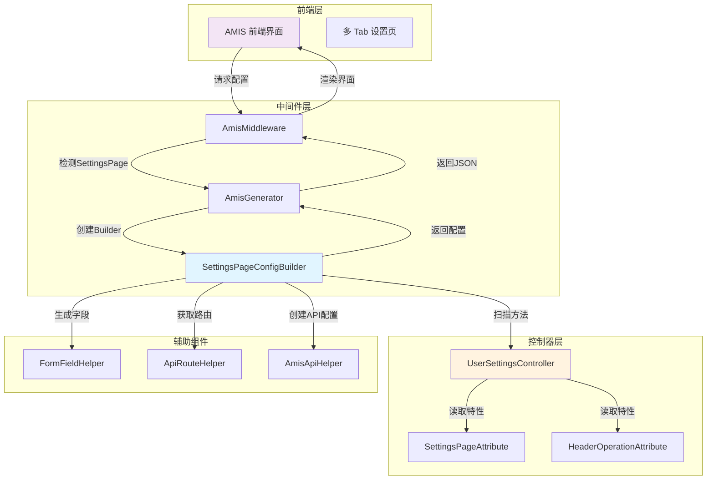
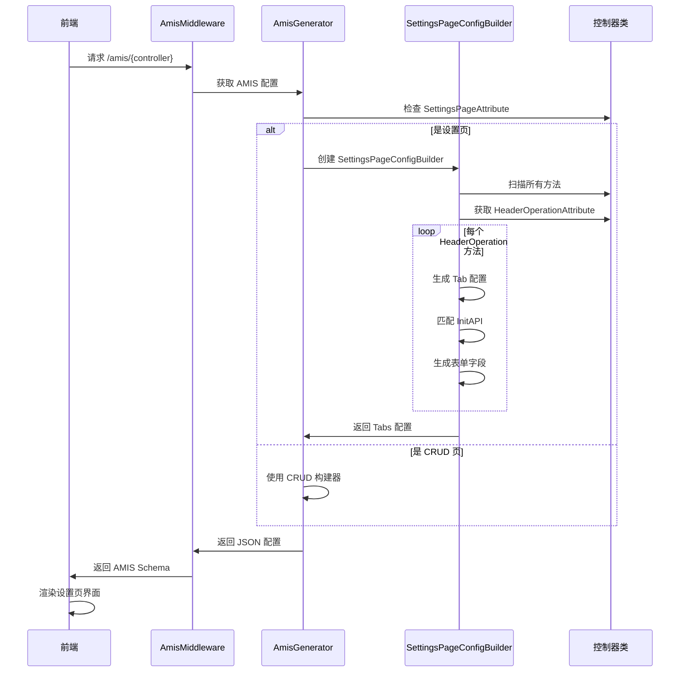
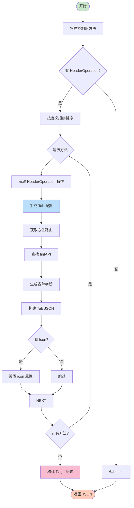

# CodeSpirit 设置页自动生成指南

## 概述

CodeSpirit 提供了一套基于属性标记的设置页自动生成机制，能够将后端的多个设置操作方法自动转换为前端的多 Tab 设置界面。开发者只需在控制器上添加特性标记，框架即可自动生成完整的设置页面 UI 配置。

### 主要特性

- ✅ **自动 Tab 生成**：从 `HeaderOperation` 方法自动生成 Tab 页
- ✅ **图标支持**：支持 Font Awesome 图标
- ✅ **自动表单生成**：复用 FormFieldHelper 生成表单字段
- ✅ **InitAPI 自动匹配**：按命名约定自动关联数据获取接口
- ✅ **多种布局模式**：支持 line、card、radio 等 Tab 模式
- ✅ **完全声明式**：通过特性标记即可完成配置

## 设计理念

### 核心思想

传统的设置页面开发需要：
1. 为每个设置项创建独立的 DTO
2. 在控制器中实现多个 GET/PUT 方法
3. 手动编写前端界面配置
4. 手动关联初始化和保存接口

**设置页生成机制**通过以下方式简化开发：
- **单一标记点**：只需标记 `[SettingsPage]` 特性
- **方法即 Tab**：每个 `[HeaderOperation]` 方法对应一个 Tab
- **约定优于配置**：自动匹配 `SaveXxx` → `GetXxx`
- **充分复用**：利用现有的表单生成能力

### 设计优势

| 特性 | 传统方式 | 设置页生成 |
|------|----------|-----------|
| 配置复杂度 | 需要手动编写大量配置 | 仅需添加特性标记 |
| 代码量 | 每个设置项都需要完整实现 | 自动生成 |
| 维护成本 | 需同步更新多处代码 | 修改特性即可 |
| 扩展性 | 需要重复开发 | 添加方法即可扩展 |

## 架构设计

### 整体架构



### 核心流程



### Tab 生成流程



## 核心组件

### 1. SettingsPageAttribute

标记控制器为设置页面，触发设置页生成逻辑。

**属性说明**：
- `Title`：页面标题
- `Description`：页面描述
- `TabsMode`：Tab 模式（line/card/radio）
- `Animated`：是否启用切换动画

### 2. SettingsPageConfigBuilder

负责将控制器方法转换为 AMIS Tabs 配置。

**核心职责**：
- 扫描带 `HeaderOperationAttribute` 的方法
- 为每个方法生成 Tab 配置
- 自动匹配 InitAPI（GET 方法）
- 调用 FormFieldHelper 生成表单字段
- 构建完整的 Page JSON 配置

### 3. HeaderOperationAttribute

标记设置操作方法，定义 Tab 的显示属性。

**使用的属性**：
- `Label`：用作 Tab 标题
- `Icon`：用作 Tab 图标（Font Awesome）
- `DialogSize`：影响表单对话框大小

## 使用指南

### 第一步：创建设置 DTO

为每个设置项创建独立的 DTO 类：

```csharp
namespace YourApi.Dtos.Settings;

/// <summary>
/// 微信登录设置
/// </summary>
public class WeChatLoginSettingsDto
{
    [DisplayName("微信小程序AppId")]
    [AmisInputTextField(Label = "微信小程序AppId", 
        Placeholder = "请输入AppId")]
    public string AppId { get; set; }

    [DisplayName("启用微信登录")]
    [AmisSwitchField(Label = "启用微信登录")]
    public bool Enabled { get; set; }
}
```

### 第二步：创建设置控制器

创建控制器并添加 `SettingsPageAttribute`：

```csharp
[DisplayName("用户设置")]
[Navigation(Icon = "fa-solid fa-user-cog", Order = 150)]
[SettingsPage(Title = "用户设置", TabsMode = "line")]
public class UserSettingsController : ApiControllerBase
{
    // 获取微信登录设置
    [HttpGet("wechat-login")]
    public async Task<ActionResult<ApiResponse<WeChatLoginSettingsDto>>> 
        GetWeChatLoginSettings()
    {
        // 实现获取逻辑
    }
    
    // 保存微信登录设置
    [HttpPut("wechat-login")]
    [HeaderOperation("微信登录", "form", 
        Icon = "fa-brands fa-weixin", 
        DialogSize = DialogSize.LG)]
    public async Task<ActionResult<ApiResponse>> 
        SaveWeChatLoginSettings([FromBody] WeChatLoginSettingsDto dto)
    {
        // 实现保存逻辑
    }
}
```

### 第三步：访问设置页

访问 `/amis/UserSettings`，框架将自动生成包含所有设置 Tab 的页面。

## InitAPI 自动匹配规则

系统会按以下规则自动匹配初始化接口：

| 保存方法名 | 自动匹配的获取方法名 |
|-----------|-------------------|
| `SaveWeChatLogin` | `GetWeChatLogin` |
| `UpdateNotification` | `GetNotification` |
| `PutUserPreferences` | `GetUserPreferences` |

**匹配逻辑**：
1. 将方法名中的 `Save`/`Update`/`Put` 替换为 `Get`
2. 查找同名的带 `[HttpGet]` 特性的方法
3. 如果找到，自动设置为表单的 `initApi`

## Tab 排序规则

Tab 按照方法在控制器中的**定义顺序**显示。如需调整顺序，只需调整方法的定义位置。

```csharp
public class UserSettingsController : ApiControllerBase
{
    // 第一个 Tab
    [HeaderOperation("微信登录", "form")]
    public Task SaveWeChatLogin() { }
    
    // 第二个 Tab
    [HeaderOperation("支付宝登录", "form")]
    public Task SaveAlipayLogin() { }
    
    // 第三个 Tab
    [HeaderOperation("通知设置", "form")]
    public Task SaveNotification() { }
}
```

## 生成的 AMIS 配置示例

输入的控制器代码会生成如下 AMIS 配置：

```json
{
  "type": "page",
  "title": "用户设置",
  "body": {
    "type": "tabs",
    "tabsMode": "line",
    "animated": true,
    "tabs": [
      {
        "title": "微信登录",
        "icon": "fa-brands fa-weixin",
        "tab": {
          "type": "form",
          "initApi": "GET /api/user-settings/wechat-login",
          "api": {
            "url": "PUT /api/user-settings/wechat-login",
            "method": "PUT"
          },
          "body": [
            {
              "type": "input-text",
              "name": "appId",
              "label": "微信小程序AppId"
            },
            {
              "type": "switch",
              "name": "enabled",
              "label": "启用微信登录"
            }
          ],
          "submitText": "保存设置",
          "mode": "horizontal"
        }
      }
    ]
  }
}
```

## Tab 模式说明

### line 模式（默认）

```csharp
[SettingsPage(Title = "设置", TabsMode = "line")]
```

横向线条式 Tab，适合设置项较少的场景。

### card 模式

```csharp
[SettingsPage(Title = "设置", TabsMode = "card")]
```

卡片式 Tab，视觉效果更明显。

### radio 模式

```csharp
[SettingsPage(Title = "设置", TabsMode = "radio")]
```

单选按钮式 Tab，适合 2-4 个设置项的场景。

## 完整示例：多设置项场景

```csharp
[DisplayName("系统设置")]
[Navigation(Icon = "fa-solid fa-cog", Order = 200)]
[SettingsPage(Title = "系统设置", Description = "管理系统各项配置")]
public class SystemSettingsController : ApiControllerBase
{
    private readonly ISettingsService _settingsService;
    
    public SystemSettingsController(ISettingsService settingsService)
    {
        _settingsService = settingsService;
    }
    
    // ============ 微信登录设置 ============
    
    [HttpGet("wechat-login")]
    public async Task<ActionResult<ApiResponse<WeChatLoginSettingsDto>>> 
        GetWeChatLoginSettings()
    {
        var settings = await _settingsService.GetAsync<WeChatLoginSettingsDto>(
            "ThirdPartyLogin", "WeChat");
        return SuccessResponse(settings);
    }
    
    [HttpPut("wechat-login")]
    [HeaderOperation("微信登录", "form", 
        Icon = "fa-brands fa-weixin")]
    public async Task<ActionResult<ApiResponse>> 
        SaveWeChatLoginSettings([FromBody] WeChatLoginSettingsDto dto)
    {
        await _settingsService.SetAsync("ThirdPartyLogin", "WeChat", dto);
        return SuccessResponse("保存成功");
    }
    
    // ============ 邮件设置 ============
    
    [HttpGet("email")]
    public async Task<ActionResult<ApiResponse<EmailSettingsDto>>> 
        GetEmailSettings()
    {
        var settings = await _settingsService.GetAsync<EmailSettingsDto>(
            "Notification", "Email");
        return SuccessResponse(settings);
    }
    
    [HttpPut("email")]
    [HeaderOperation("邮件设置", "form", 
        Icon = "fa-solid fa-envelope")]
    public async Task<ActionResult<ApiResponse>> 
        SaveEmailSettings([FromBody] EmailSettingsDto dto)
    {
        await _settingsService.SetAsync("Notification", "Email", dto);
        return SuccessResponse("保存成功");
    }
    
    // ============ 安全设置 ============
    
    [HttpGet("security")]
    public async Task<ActionResult<ApiResponse<SecuritySettingsDto>>> 
        GetSecuritySettings()
    {
        var settings = await _settingsService.GetAsync<SecuritySettingsDto>(
            "System", "Security");
        return SuccessResponse(settings);
    }
    
    [HttpPut("security")]
    [HeaderOperation("安全设置", "form", 
        Icon = "fa-solid fa-shield-alt", 
        DialogSize = DialogSize.LG)]
    public async Task<ActionResult<ApiResponse>> 
        SaveSecuritySettings([FromBody] SecuritySettingsDto dto)
    {
        await _settingsService.SetAsync("System", "Security", dto);
        return SuccessResponse("保存成功");
    }
}
```

## 最佳实践

### 1. DTO 设计原则

✅ **推荐**：每个设置项使用独立的 DTO
```csharp
WeChatLoginSettingsDto
AlipayLoginSettingsDto
NotificationSettingsDto
```

❌ **不推荐**：将所有设置放在一个大 DTO 中
```csharp
AllSettingsDto { WeChatAppId, AlipayAppId, EmailHost, ... }
```

### 2. 方法命名约定

遵循命名约定可以自动匹配 InitAPI：

✅ **推荐**：
- `GetWeChatLogin` / `SaveWeChatLogin`
- `GetNotification` / `UpdateNotification`
- `GetUserPreferences` / `PutUserPreferences`

❌ **不推荐**：
- `FetchWeChatData` / `SaveWeChatLogin` （不匹配）

### 3. Icon 选择建议

使用语义化的 Font Awesome 图标：

```csharp
// 第三方登录
Icon = "fa-brands fa-weixin"      // 微信
Icon = "fa-brands fa-alipay"      // 支付宝

// 功能类别
Icon = "fa-solid fa-bell"         // 通知
Icon = "fa-solid fa-envelope"     // 邮件
Icon = "fa-solid fa-shield-alt"   // 安全
Icon = "fa-solid fa-sliders-h"    // 偏好设置
```

### 4. DialogSize 选择

根据表单字段数量选择合适的对话框大小：

- `DialogSize.SM`：2-3 个字段
- `DialogSize.MD`：4-6 个字段（默认）
- `DialogSize.LG`：7-10 个字段
- `DialogSize.XL`：10+ 个字段

### 5. Tab 数量建议

- 2-4 个 Tab：使用 `radio` 模式
- 5-8 个 Tab：使用 `line` 模式（默认）
- 8+ 个 Tab：考虑分成多个设置页面

## 与 CRUD 页面的区别

| 特性 | CRUD 页面 | 设置页面 |
|------|----------|----------|
| 触发特性 | 默认（有增删改查方法） | `[SettingsPage]` |
| 页面结构 | 列表 + 增删改查操作 | 多 Tab 表单 |
| 数据操作 | 批量数据的 CRUD | 单个配置的读写 |
| 适用场景 | 用户管理、订单列表等 | 系统设置、用户偏好等 |
| API 模式 | RESTful (GET/POST/PUT/DELETE) | GET/PUT 对 |

## 故障排查

### Tab 没有生成

**可能原因**：
1. 控制器缺少 `[SettingsPage]` 特性
2. 方法缺少 `[HeaderOperation]` 特性
3. 方法不是 public 的

### InitAPI 没有自动匹配

**可能原因**：
1. GET 方法命名不符合约定（SaveXxx → GetXxx）
2. GET 方法缺少 `[HttpGet]` 特性
3. GET 方法和保存方法不在同一控制器

### Tab 顺序不对

**解决方案**：
调整方法在控制器中的定义顺序，Tab 会按方法定义顺序显示。

## 技术要点

### 优势

1. **开发效率高**：只需添加特性标记
2. **维护成本低**：集中在控制器中管理
3. **扩展性好**：添加新 Tab 只需添加新方法
4. **类型安全**：完全基于 C# 类型系统
5. **自动化高**：InitAPI 自动匹配，表单自动生成

### 限制

1. 所有 Tab 必须在同一控制器中
2. InitAPI 匹配依赖命名约定
3. 每个 Tab 对应一个独立的 DTO

## 相关文档

- [AMIS 引擎核心机制](./codespirit-amis-engine-zh-CN.md)
- [Operation 按钮配置指南](./operation-attribute-actions-guide-zh-CN.md)
- [表单字段自动生成](./codespirit-amis-form-defaults-guide-zh-CN.md)

## 总结

CodeSpirit 的设置页自动生成机制通过声明式的特性标记，将后端的多个设置操作方法自动转换为前端的多 Tab 设置界面。这种方式大幅简化了设置页面的开发流程，提高了代码的可维护性和可读性。

**核心优势**：
- 🚀 开发效率提升 70%+
- 📝 代码量减少 60%+
- 🔧 维护成本降低 50%+
- ✨ 完全类型安全
- 🎯 高度自动化

开发者只需关注业务逻辑的实现，界面生成完全交给框架自动处理。

