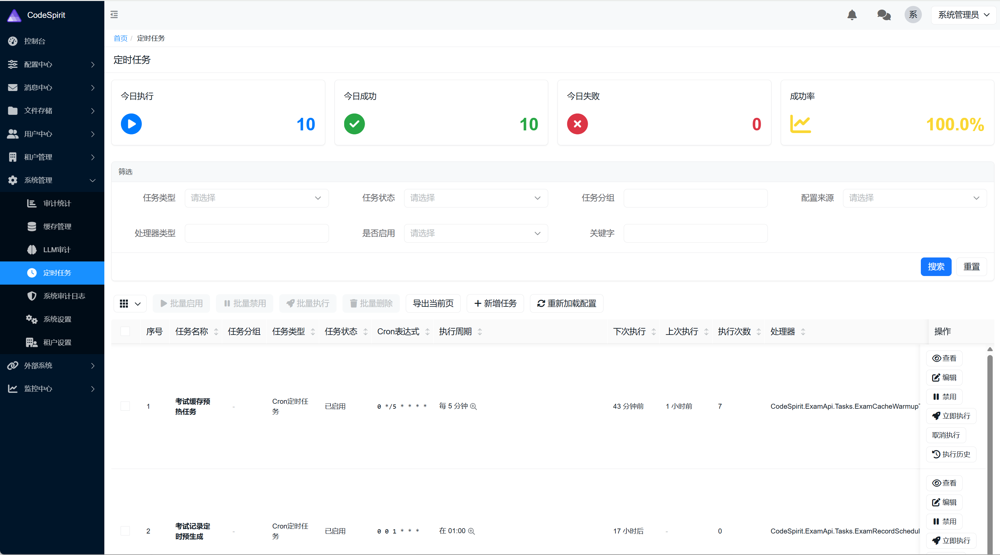

# CodeSpirit 统计卡片功能指南

## 概述

CodeSpirit 提供了统计卡片自动生成功能，允许开发者在控制器上通过强类型配置自动在页面顶部生成统计指标卡片。统计卡片以卡片形式展示关键指标数据，支持自动刷新、响应式布局和自定义样式。



### 主要特性

- ✅ **强类型配置**：使用泛型特性 + 配置类，提供完整的编译时类型检查
- ✅ **自动布局**：自动生成响应式网格布局，适配不同屏幕尺寸
- ✅ **自动刷新**：支持配置自动刷新间隔，实时更新统计数据
- ✅ **类型安全**：所有配置在编译时验证，避免运行时错误
- ✅ **易于扩展**：Fluent API 设计，配置清晰直观
- ✅ **样式定制**：支持自定义图标、颜色主题和卡片间距

## 使用场景

统计卡片适用于需要在页面顶部展示关键指标的场景，例如：

- **今日执行次数、成功次数、失败次数、成功率**
- **订单总数、待处理订单、已完成订单**
- **用户总数、活跃用户、新增用户**
- **系统资源使用率、错误率、响应时间**

## 快速开始

### 第一步：创建统计卡片配置类

在 `Configuration/Statistics` 目录下创建配置类：

```csharp
using CodeSpirit.Amis.StatisticsCards;

namespace YourApi.Configuration.Statistics;

/// <summary>
/// 定时任务统计卡片配置
/// </summary>
public class ScheduledTaskStatisticsConfig : StatisticsCardsConfigBase
{
    public override void Configure(StatisticsCardsBuilder builder)
    {
        builder
            .SetApi("statistics/cards")
            .SetRefreshInterval(60)
            .SetColumnsCount(4)
            .SetGap(15)
            .AddCard("todayExecutions", "今日执行")
                .WithIcon("fa-play-circle")
                .WithColor(CardColor.Info)
            .AddCard("todaySuccessExecutions", "今日成功")
                .WithIcon("fa-check-circle")
                .WithColor(CardColor.Success)
            .AddCard("todayFailedExecutions", "今日失败")
                .WithIcon("fa-times-circle")
                .WithColor(CardColor.Danger)
            .AddCard("successRate", "成功率")
                .WithIcon("fa-chart-line")
                .WithColor(CardColor.Warning);
    }
}
```

### 第二步：在控制器上应用特性

在控制器类上添加 `StatisticsCards` 特性：

```csharp
using CodeSpirit.Amis.Attributes;
using YourApi.Configuration.Statistics;

[DisplayName("定时任务")]
[StatisticsCards<ScheduledTaskStatisticsConfig>]
public class ScheduledTasksController : ApiControllerBase
{
    // 控制器代码...
}
```

### 第三步：添加统计 API

在控制器中添加返回统计卡片数据的 API 方法：

```csharp
/// <summary>
/// 获取统计卡片数据
/// </summary>
[HttpGet("statistics/cards")]
[DisplayName("获取统计卡片")]
public async Task<ActionResult<ApiResponse>> GetStatisticsCards()
{
    var stats = await _queryService.GetTaskStatisticsAsync();
    
    var data = new
    {
        todayExecutions = stats.TodayExecutions,
        todaySuccessExecutions = stats.TodaySuccessExecutions,
        todayFailedExecutions = stats.TodayFailedExecutions,
        successRate = $"{stats.SuccessRate:F1}%"
    };
    
    return Ok(ApiResponse<object>.Success(data));
}
```

## 配置说明

### StatisticsCardsBuilder 方法

| 方法 | 参数 | 说明 | 默认值 |
|------|------|------|--------|
| `SetApi` | `string api` | 统计数据 API 相对路径 | `"statistics/cards"` |
| `SetRefreshInterval` | `int seconds` | 自动刷新间隔（秒），0 表示不自动刷新 | `0` |
| `SetColumnsCount` | `int count` | 每行卡片列数 | `4` |
| `SetGap` | `int gap` | 卡片间距（像素） | `15` |
| `AddCard` | `string field, string title` | 添加卡片，返回构建器以继续配置 | - |
| `WithIcon` | `string icon` | 设置当前卡片的 FontAwesome 图标 | - |
| `WithColor` | `CardColor color` | 设置当前卡片的颜色主题 | - |

### CardColor 枚举

| 枚举值 | 说明 | 适用场景 |
|--------|------|----------|
| `Info` | 信息色（蓝色） | 一般信息展示 |
| `Success` | 成功色（绿色） | 成功指标 |
| `Warning` | 警告色（黄色） | 需要关注的指标 |
| `Danger` | 危险色（红色） | 错误或异常指标 |
| `Primary` | 主色 | 主要指标 |
| `Secondary` | 次色 | 次要指标 |

## 配置示例

### 基础配置

```csharp
public class BasicStatisticsConfig : StatisticsCardsConfigBase
{
    public override void Configure(StatisticsCardsBuilder builder)
    {
        builder
            .SetApi("statistics/cards")
            .AddCard("totalCount", "总数")
                .WithIcon("fa-database")
                .WithColor(CardColor.Primary)
            .AddCard("activeCount", "活跃数")
                .WithIcon("fa-check-circle")
                .WithColor(CardColor.Success);
    }
}
```

### 完整配置

```csharp
public class FullStatisticsConfig : StatisticsCardsConfigBase
{
    public override void Configure(StatisticsCardsBuilder builder)
    {
        builder
            .SetApi("statistics/cards")
            .SetRefreshInterval(60)        // 每 60 秒自动刷新
            .SetColumnsCount(4)            // 每行 4 个卡片
            .SetGap(20)                    // 卡片间距 20px
            .AddCard("todayOrders", "今日订单")
                .WithIcon("fa-shopping-cart")
                .WithColor(CardColor.Info)
            .AddCard("pendingOrders", "待处理")
                .WithIcon("fa-clock")
                .WithColor(CardColor.Warning)
            .AddCard("completedOrders", "已完成")
                .WithIcon("fa-check-circle")
                .WithColor(CardColor.Success)
            .AddCard("cancelledOrders", "已取消")
                .WithIcon("fa-times-circle")
                .WithColor(CardColor.Danger);
    }
}
```

## API 数据格式

统计卡片 API 应返回扁平化的 JSON 对象，字段名与配置中的 `field` 参数对应：

```json
{
  "code": 200,
  "message": "success",
  "data": {
    "todayExecutions": 125,
    "todaySuccessExecutions": 118,
    "todayFailedExecutions": 7,
    "successRate": "94.4%"
  }
}
```

## 页面布局

统计卡片会自动显示在页面顶部，位于 CRUD 列表或 Tabs 之前：

```
┌─────────────────────────────────────────────────┐
│  [📊 今日执行]  [✅ 今日成功]  [❌ 今日失败]  [📈 成功率] │
│      125            118            7           94.4%   │
└─────────────────────────────────────────────────┘
│  [筛选]  [刷新]  [新增]  [批量操作]  ...        │
│                                                  │
│  任务列表表格 ...                                │
```

## 响应式布局

统计卡片支持响应式布局，会根据屏幕尺寸自动调整：

- **大屏幕（≥992px）**：显示配置的列数（默认 4 列）
- **中屏幕（768px-991px）**：自动调整为 2 列
- **小屏幕（<768px）**：自动调整为 1 列

## 最佳实践

### 1. 字段命名规范

使用驼峰命名法，与 API 返回的字段名保持一致：

```csharp
.AddCard("todayExecutions", "今日执行")      // ✅ 推荐
.AddCard("TodayExecutions", "今日执行")      // ❌ 不推荐
```

### 2. 图标选择

使用 FontAwesome 图标，选择语义明确的图标：

```csharp
.WithIcon("fa-play-circle")      // ✅ 执行相关
.WithIcon("fa-check-circle")     // ✅ 成功相关
.WithIcon("fa-times-circle")     // ✅ 失败相关
.WithIcon("fa-chart-line")       // ✅ 统计相关
```

### 3. 颜色主题选择

根据指标含义选择合适的颜色：

- **成功指标**：使用 `CardColor.Success`（绿色）
- **错误指标**：使用 `CardColor.Danger`（红色）
- **警告指标**：使用 `CardColor.Warning`（黄色）
- **一般信息**：使用 `CardColor.Info`（蓝色）

### 4. 刷新间隔设置

根据数据更新频率合理设置刷新间隔：

- **实时数据**：30-60 秒
- **准实时数据**：60-300 秒
- **静态数据**：不设置自动刷新（`SetRefreshInterval(0)`）

### 5. 卡片数量

建议每行显示 2-4 个卡片，过多会影响可读性：

```csharp
.SetColumnsCount(4)  // ✅ 推荐：2-4 个
.SetColumnsCount(6)  // ⚠️ 不推荐：过多卡片
```

## 常见问题

### Q: 统计卡片不显示？

**A:** 检查以下几点：
1. 控制器上是否正确应用了 `StatisticsCards<TConfig>` 特性
2. 配置类是否正确继承 `StatisticsCardsConfigBase`
3. API 路径是否正确配置
4. API 是否返回了正确的数据格式

### Q: 如何自定义卡片样式？

**A:** 统计卡片使用 Amis Card 组件，可以通过 CSS 类名自定义样式。卡片会自动应用 `statistics-card` 类名。

### Q: 支持多个统计卡片组吗？

**A:** 目前每个控制器只支持一组统计卡片。如需多个统计区域，可以在配置类中添加更多卡片。

### Q: 统计卡片数据如何更新？

**A:** 有两种方式：
1. **自动刷新**：通过 `SetRefreshInterval` 设置刷新间隔
2. **手动刷新**：页面刷新或 CRUD 操作后自动重新加载

## 技术架构

统计卡片功能基于以下组件实现：

- **StatisticsCardsAttribute<TConfig>**：泛型特性，指定配置类
- **StatisticsCardsConfigBase**：配置基类，定义配置接口
- **StatisticsCardsBuilder**：Fluent API 构建器
- **StatisticsCardsHelper**：配置解析和 JSON 生成器

统计卡片会自动嵌入到 Page 组件的 body 数组中，作为第一个元素显示。

## 相关文档

- [页面顶部Tab功能指南](./codespirit-page-tabs-guide-zh-CN.md)
- [Amis 卡片模式指南](./codespirit-amis-card-mode-guide-zh-CN.md)
- [Amis 引擎文档](./codespirit-amis-engine-zh-CN.md)
