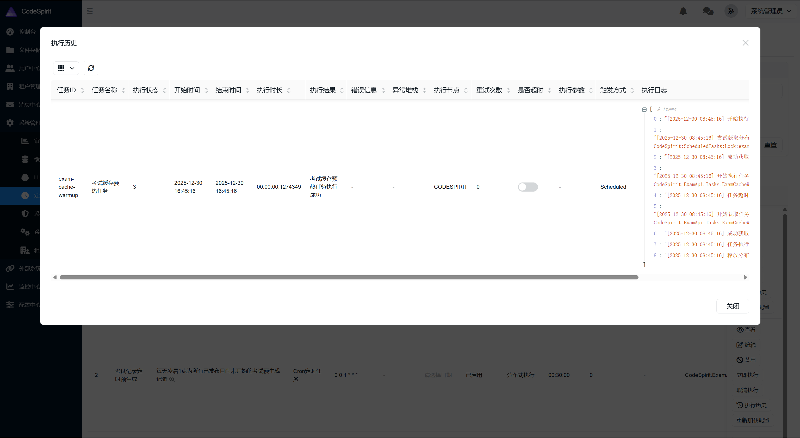
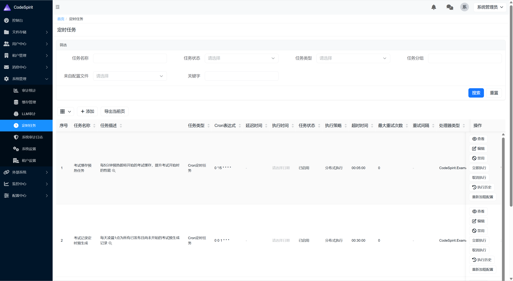

# CrudDialogOperation 使用指南

## 概述

`CrudDialogOperationAttribute` 是 CodeSpirit.Amis 框架中用于在弹窗中显示列表数据的操作特性。它封装了常见的"点击按钮 → 弹出对话框 → 显示列表数据"的使用模式，简化了开发流程。

### 设计目标

- **简化使用**：通过特性配置即可生成完整的 CRUD 对话框，无需手动编写 AMIS schema

- **类型安全**：基于 C# 类型自动生成列配置，编译时检查

- **灵活配置**：支持自定义列、行操作、分页等配置

- **统一体验**：与框架其他操作特性保持一致的使用方式

  

## 特性说明

### 继承关系

`CrudDialogOperationAttribute` 继承自 `OperationAttribute`，因此可以使用所有 `OperationAttribute` 的基础属性（如 `Icon`、`DialogSize`、`VisibleOn` 等）。

### 核心属性

| 属性 | 类型 | 必填 | 默认值 | 说明 |
|------|------|------|--------|------|
| `DataApi` | string | 是 | - | 数据API路由（支持模板变量，如 `${id}`） |
| `DataType` | Type | 是 | - | 要显示的数据类型（DTO） |
| `EnablePagination` | bool | 否 | true | 是否启用分页 |
| `PerPage` | int | 否 | 10 | 每页数量 |
| `PerPageOptions` | int[] | 否 | [10, 20, 50, 100] | 每页选项 |
| `EnableSearch` | bool | 否 | false | 是否启用搜索 |
| `EnableExport` | bool | 否 | false | 是否启用导出 |
| `EnableRefresh` | bool | 否 | true | 是否启用刷新 |
| `RowActions` | string | 否 | - | 行操作按钮配置（JSON格式） |
| `CustomColumns` | string | 否 | - | 自定义列配置（JSON格式，可选） |

## 使用示例

### 基础示例

最简单的使用方式，只需要指定数据 API 和数据类型：

```csharp
[HttpGet("{id}/executions")]
[CrudDialogOperation("执行历史",
    DataApi = "/api/web/ScheduledTasks/${id}/executions/data",
    DataType = typeof(TaskExecution))]
[DisplayName("获取执行历史")]
public ActionResult<ApiResponse> GetTaskExecutions(string id)
{
    return GenerateCrudDialogSchema(new Dictionary<string, string> { { "id", id } });
}

/// <summary>
/// 获取任务执行历史数据
/// </summary>
[HttpGet("{id}/executions/data")]
[DisplayName("获取执行历史数据")]
public async Task<ActionResult<ApiResponse>> GetTaskExecutionsData(string id, [FromQuery] QueryDtoBase queryDto)
{
    var result = await _queryService.GetExecutionHistoryAsync(id, queryDto);
    return Ok(ApiResponse<object>.Success(result));
}
```

### 完整配置示例

包含所有配置选项的完整示例：

```csharp
[HttpGet("{id}/executions")]
[CrudDialogOperation("执行历史",
    DataApi = "/api/web/ScheduledTasks/${id}/executions/data",
    DataType = typeof(TaskExecution),
    Icon = "fa-solid fa-clock-rotate-left",
    DialogSize = DialogSize.XL,
    EnablePagination = true,
    PerPage = 20,
    PerPageOptions = new[] { 10, 20, 50, 100 },
    EnableSearch = true,
    EnableExport = true,
    EnableRefresh = true,
    RowActions = """[
        {
            "type": "button",
            "label": "详情",
            "level": "link",
            "actionType": "dialog",
            "dialog": {
                "title": "执行详情",
                "size": "lg",
                "body": {
                    "type": "form",
                    "wrapWithPanel": false,
                    "controls": [
                        {"type": "static", "name": "taskName", "label": "任务名称"},
                        {"type": "static", "name": "startTime", "label": "开始时间", "format": "YYYY-MM-DD HH:mm:ss"},
                        {"type": "static", "name": "status", "label": "执行状态"}
                    ]
                }
            }
        }
    ]""")]
[DisplayName("获取执行历史")]
public ActionResult<ApiResponse> GetTaskExecutions(string id)
{
    return GenerateCrudDialogSchema(new Dictionary<string, string> { { "id", id } });
}
```

*注意：当前为简单实现，后续会继续优化RowActions，实现基于Dto的方法自动生成，而不是在此定义UI结构。*



### 使用自定义列配置

如果自动生成的列不满足需求，可以使用 `CustomColumns` 属性自定义列：

```csharp
[HttpGet("{id}/orders")]
[CrudDialogOperation("订单列表",
    DataApi = "/api/web/Orders/${id}/items",
    DataType = typeof(OrderItemDto),
    CustomColumns = """[
        {
            "name": "productName",
            "label": "产品名称",
            "type": "text"
        },
        {
            "name": "quantity",
            "label": "数量",
            "type": "text"
        },
        {
            "name": "price",
            "label": "单价",
            "type": "text",
            "tpl": "${price} 元"
        },
        {
            "name": "total",
            "label": "总价",
            "type": "text",
            "tpl": "${quantity * price} 元"
        }
    ]""")]
[DisplayName("查看订单")]
public ActionResult<ApiResponse> GetOrderItems(string id)
{
    return GenerateCrudDialogSchema(new Dictionary<string, string> { { "id", id } });
}
```

## 列生成机制

### 自动生成列

`CrudDialogHandler` 会根据 `DataType` 指定的类型自动生成列配置：

1. **优先级1**：如果提供了 `CustomColumns`，直接使用自定义配置
2. **优先级2**：检查属性上的 `AmisColumnAttribute` 特性
3. **优先级3**：基于属性类型和 `DisplayNameAttribute` 自动生成

### 列名转换规则

为了与 API 返回的 JSON 数据匹配，列名会自动转换为 camelCase：

- `TaskId` → `taskId`
- `TaskName` → `taskName`
- `StartTime` → `startTime`

如果属性上有 `JsonPropertyAttribute`，则优先使用其 `PropertyName`。

### 列类型推断

根据属性类型自动推断列类型：

- `DateTime` / `DateTimeOffset` → `datetime` 类型，格式为 `YYYY-MM-DD HH:mm:ss`
- `bool` → `switch` 类型
- `int` / `long` / `decimal` → `text` 类型
- 其他类型 → `text` 类型

## 基类方法

### GenerateCrudDialogSchema

`AmisApiControllerBase` 提供了 `GenerateCrudDialogSchema` 方法，简化了 schema 生成：

```csharp
protected ActionResult<ApiResponse> GenerateCrudDialogSchema(Dictionary<string, string> templateVariables = null)
```

**参数说明**：
- `templateVariables`：模板变量字典，用于替换 `DataApi` 中的变量（如 `${id}`）

**使用示例**：
```csharp
public ActionResult<ApiResponse> GetTaskExecutions(string id)
{
    // 替换 DataApi 中的 ${id} 变量
    return GenerateCrudDialogSchema(new Dictionary<string, string> { { "id", id } });
}
```

## 数据 API 要求

### 返回格式

数据 API 必须返回标准的 `ApiResponse<PageList<T>>` 格式：

```csharp
public async Task<ActionResult<ApiResponse>> GetTaskExecutionsData(string id, [FromQuery] QueryDtoBase queryDto)
{
    var result = await _queryService.GetExecutionHistoryAsync(id, queryDto);
    return Ok(ApiResponse<object>.Success(result));
}
```

### 查询参数

数据 API 会自动接收以下查询参数（由 AMIS CRUD 组件传递）：

- `page`：当前页码
- `perPage`：每页数量
- `orderBy`：排序字段
- `orderDir`：排序方向（asc/desc）

### 模板变量

`DataApi` 支持模板变量，可以在运行时动态替换：

```csharp
DataApi = "/api/web/ScheduledTasks/${id}/executions/data"
```

在控制器方法中通过 `GenerateCrudDialogSchema` 传递变量值：

```csharp
return GenerateCrudDialogSchema(new Dictionary<string, string> { { "id", id } });
```

## 配置选项详解

### 分页配置

```csharp
EnablePagination = true,        // 启用分页
PerPage = 20,                    // 每页显示20条
PerPageOptions = new[] { 10, 20, 50, 100 }  // 每页选项
```

### 工具栏配置

```csharp
EnableRefresh = true,   // 显示刷新按钮
EnableSearch = true,    // 显示搜索按钮
EnableExport = true,    // 显示导出按钮
```

### 行操作配置

`RowActions` 是一个 JSON 格式的字符串数组，配置每行的操作按钮：

```csharp
RowActions = """[
    {
        "type": "button",
        "label": "详情",
        "level": "link",
        "actionType": "dialog",
        "dialog": {
            "title": "详情",
            "body": { /* AMIS schema */ }
        }
    },
    {
        "type": "button",
        "label": "删除",
        "level": "danger",
        "actionType": "ajax",
        "api": "/api/web/Items/${id}",
        "confirmText": "确定要删除吗？"
    }
]"""
```

## 最佳实践

### 1. 使用基类方法

优先使用 `AmisApiControllerBase.GenerateCrudDialogSchema` 方法，而不是手动生成 schema：

```csharp
// ✅ 推荐
public ActionResult<ApiResponse> GetTaskExecutions(string id)
{
    return GenerateCrudDialogSchema(new Dictionary<string, string> { { "id", id } });
}

// ❌ 不推荐：手动生成 schema
public ActionResult<ApiResponse> GetTaskExecutions(string id)
{
    // 大量手动代码...
}
```

### 2. 分离 Schema 和数据接口

将 schema 生成接口和数据接口分离：

```csharp
// Schema 接口（用于生成弹窗配置）
[HttpGet("{id}/executions")]
[CrudDialogOperation(...)]
public ActionResult<ApiResponse> GetTaskExecutions(string id) { ... }

// 数据接口（用于获取实际数据）
[HttpGet("{id}/executions/data")]
public async Task<ActionResult<ApiResponse>> GetTaskExecutionsData(string id, [FromQuery] QueryDtoBase queryDto) { ... }
```

### 3. 使用 DTO 类型

为列表数据定义专门的 DTO 类型，而不是直接使用实体类型：

```csharp
// ✅ 推荐：使用 DTO
[CrudDialogOperation(..., DataType = typeof(TaskExecutionDto))]

// ❌ 不推荐：直接使用实体
[CrudDialogOperation(..., DataType = typeof(TaskExecution))]
```

### 4. 合理使用自定义列

只有在自动生成的列不满足需求时才使用 `CustomColumns`：

```csharp
// ✅ 优先使用自动生成
[CrudDialogOperation(..., DataType = typeof(TaskExecution))]

// ✅ 必要时使用自定义列
[CrudDialogOperation(..., CustomColumns = "...")]
```

### 5. 使用原始字符串字面量

配置 JSON 字符串时，使用原始字符串字面量（`"""`）避免转义：

```csharp
// ✅ 推荐
RowActions = """[{"type": "button", "label": "详情"}]"""

// ❌ 不推荐：需要转义
RowActions = "[{\"type\": \"button\", \"label\": \"详情\"}]"
```

## 注意事项

### 1. 列名匹配

确保生成的列名与 API 返回的 JSON 字段名匹配。框架会自动将属性名转换为 camelCase，但如果 API 返回的字段名不同，需要使用 `CustomColumns` 或 `JsonPropertyAttribute`。

### 2. 权限检查

在生成 schema 时不会进行权限检查，权限检查应该在数据 API 中进行。

### 3. 模板变量

`DataApi` 中的模板变量（如 `${id}`）需要在调用 `GenerateCrudDialogSchema` 时提供对应的值。

### 4. 数据格式

数据 API 必须返回 `PageList<T>` 格式的数据，包含 `items` 和 `total` 字段。

### 5. 性能考虑

- Schema 生成只在弹窗初始化时执行一次，不会产生死循环
- 大量数据时建议启用分页
- 自定义列配置会覆盖自动生成的列

## 常见问题

### Q1: 为什么列名不匹配？

**A**: 检查 API 返回的 JSON 字段名是否为 camelCase。如果属性名是 PascalCase，框架会自动转换为 camelCase。如果仍然不匹配，可以使用 `CustomColumns` 或 `JsonPropertyAttribute`。

### Q2: 如何自定义列的类型？

**A**: 有两种方式：
1. 在 DTO 属性上使用 `AmisColumnAttribute` 特性
2. 使用 `CustomColumns` 属性提供完整的列配置

### Q3: 如何添加行操作按钮？

**A**: 使用 `RowActions` 属性，提供 JSON 格式的按钮配置数组。

### Q4: 如何禁用某些列？

**A**: 在 DTO 属性上使用 `IgnoreColumnAttribute` 特性，或在 `CustomColumns` 中不包含该列。

### Q5: 如何支持排序？

**A**: 列默认支持排序（`sortable: true`），数据 API 需要处理 `orderBy` 和 `orderDir` 参数。

## 相关文档

- [OperationAttribute Actions 配置使用指南](./operation-attribute-actions-guide-zh-CN.md)
- [CodeSpirit.Amis 智能界面生成引擎](./codespirit-amis-engine-zh-CN.md)
- [AMIS 列推断机制](./amis-column-inference-zh-CN.md)

## 更新日志

### v1.0.0 (2025-12-30)

- ✨ 新增 `CrudDialogOperationAttribute` 特性
- ✨ 支持自动列生成和自定义列配置
- ✨ 支持分页、搜索、导出、刷新等工具栏功能
- ✨ 支持行操作按钮配置
- ✨ 在 `AmisApiControllerBase` 中提供 `GenerateCrudDialogSchema` 方法
- 🐛 修复列名 camelCase 转换问题

