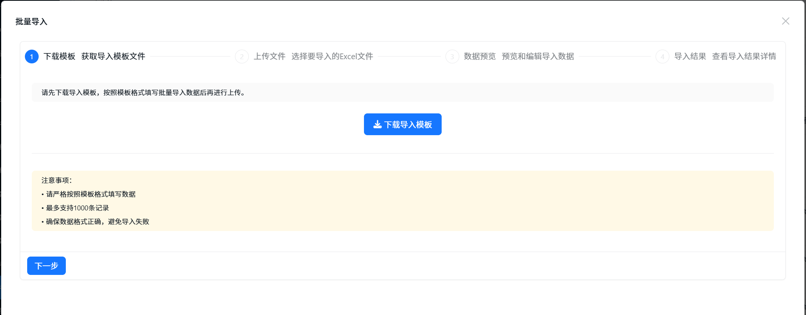
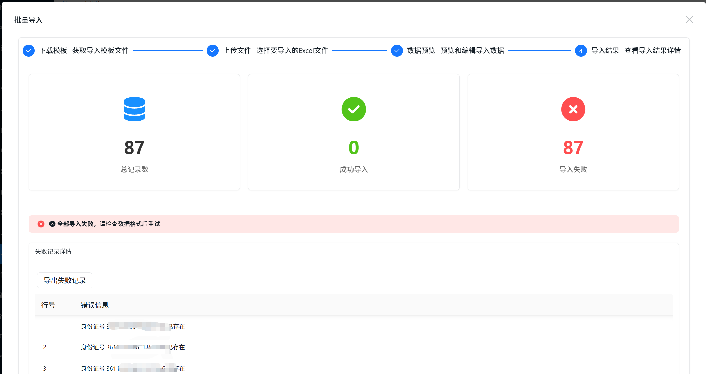
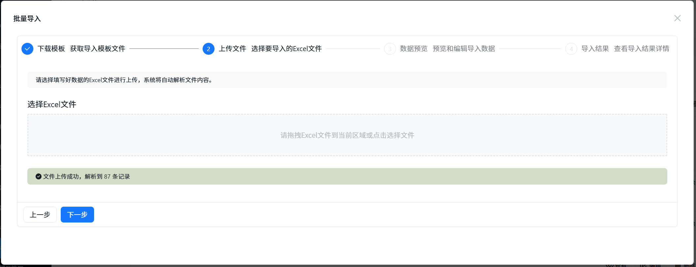
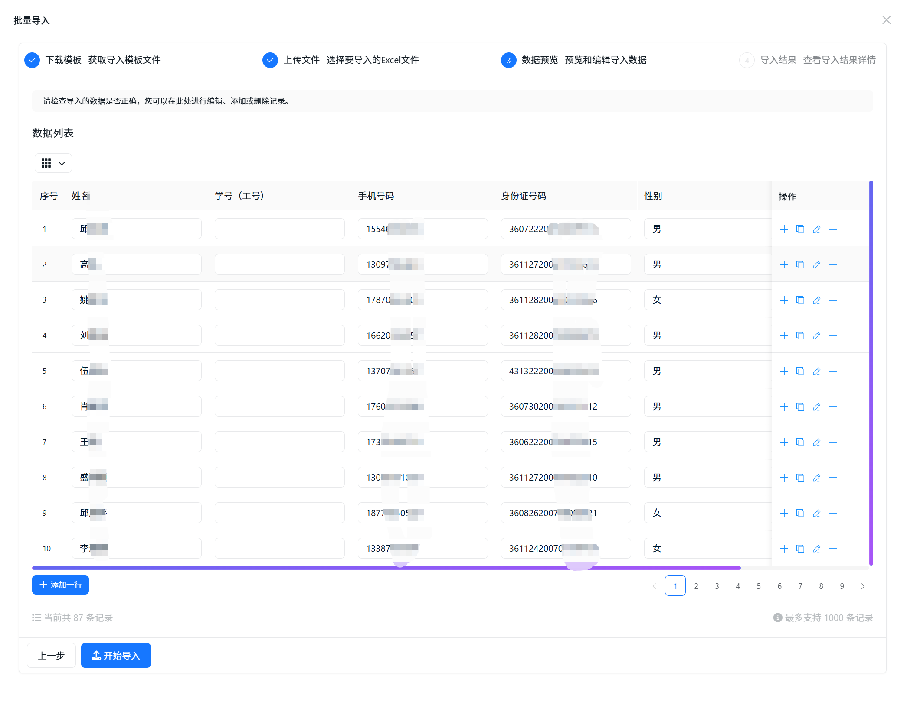

# 增强批量导入组件使用指南

## 概述

增强批量导入组件是基于AMIS框架开发的高级导入功能，提供了完整的导入体验，包括模板下载、数据预览、结果展示和失败记录处理等功能。

本组件提供**两种实现方式**：
1. **集成式（推荐）** - 功能已完全集成到 `BaseCRUDIService` 基类，所有服务自动继承增强导入能力
2. **扩展方法式** - 通过扩展方法实现，适用于无法修改基类的场景

---

## 🎯 推荐方案：集成式（BaseCRUDIService）

### 核心优势

1. **统一导入体验** - 所有服务自动继承增强批量导入功能
2. **简化代码结构** - 无需编写扩展方法，减少重复代码
3. **更好的封装性** - 导入逻辑封装在服务层，符合单一职责原则
4. **易于维护** - 集中管理导入逻辑，修改更加方便

### 架构设计

```
┌─────────────────────────────────────────────────────────────┐
│            集成式增强批量导入架构                             │
├─────────────────────────────────────────────────────────────┤
│                                                             │
│  ┌─────────────────┐                                        │
│  │   Controller    │                                        │
│  │                 │                                        │
│  │ StudentsCtrl    │                                        │
│  │                 │                                        │
│  └─────────────────┘                                        │
│           │                                                 │
│           │  EnhancedBatchImportAsync(importData)           │
│           ▼                                                 │
│  ┌─────────────────────────────────────────────────────┐    │
│  │           BaseCRUDIService (基类)                    │    │
│  │                                                      │    │
│  │  + EnhancedBatchImportAsync()                       │    │
│  │  + GetImportResultAsync()                           │    │
│  │  + ExportFailedRecordsAsync()                       │    │
│  │                                                      │    │
│  │  # ProcessImportItemAsync() - 可重写               │    │
│  │  # ValidateImportItemAsync() - 可重写               │    │
│  │                                                      │    │
│  └─────────────────────────────────────────────────────┘    │
│           │                                                 │
│           │ 使用                                            │
│           ▼                                                 │
│  ┌─────────────────────────────────────────────────────┐    │
│  │        EnhancedBatchImportHelper                     │    │
│  │                                                      │    │
│  │  处理验证、导入逻辑、缓存、错误收集                   │    │
│  │                                                      │    │
│  └─────────────────────────────────────────────────────┘    │
│           │                                                 │
│           ▼                                                 │
│  ┌─────────────────────────────────────────────────────┐    │
│  │           IDistributedCache                          │    │
│  │                                                      │    │
│  │      Redis / SQL Server Cache                       │    │
│  │                                                      │    │
│  └─────────────────────────────────────────────────────┘    │
│                                                             │
└─────────────────────────────────────────────────────────────┘
```

### 快速开始

#### 1. 创建批量导入 DTO

```csharp
using System.ComponentModel;
using System.ComponentModel.DataAnnotations;
using Newtonsoft.Json;

namespace CodeSpirit.ExamApi.Dtos.Student
{
    /// <summary>
    /// 学生批量导入DTO
    /// </summary>
    public class StudentBatchImportDto
    {
        /// <summary>
        /// 姓名
        /// </summary>
        [Required(ErrorMessage = "姓名不能为空")]
        [DisplayName("姓名")]
        [JsonProperty("姓名")]
        public string Name { get; set; } = string.Empty;

        /// <summary>
        /// 学号（工号）
        /// </summary>
        [DisplayName("学号（工号）")]
        [JsonProperty("学号（工号）")]
        public string? StudentNumber { get; set; }

        /// <summary>
        /// 身份证号码
        /// </summary>
        [Required(ErrorMessage = "身份证号码不能为空")]
        [DisplayName("身份证号码")]
        [JsonProperty("身份证号码")]
        public string IdNo { get; set; } = string.Empty;

        /// <summary>
        /// 手机号
        /// </summary>
        [DisplayName("手机号")]
        [JsonProperty("手机号")]
        public string? PhoneNumber { get; set; }
    }
}
```

**DTO要求**：
1. **必须添加JsonProperty特性**：用于Excel列名映射
2. **必须添加DisplayName特性**：用于显示友好的字段名
3. **添加验证特性**：如Required、StringLength等

#### 2. 服务层实现

##### 2.1 继承 BaseCRUDIService

```csharp
public class StudentService : BaseCRUDIService<Student, StudentDto, long, 
    CreateStudentDto, UpdateStudentDto, StudentBatchImportDto>, 
    IStudentService
{
    public StudentService(
        IRepository<Student> repository,
        IMapper mapper,
        EnhancedBatchImportHelper<StudentBatchImportDto> importHelper)
        : base(repository, mapper, importHelper)
    {
    }
}
```

**说明**：
- 构造函数必须注入 `EnhancedBatchImportHelper<TBatchImportDto>`
- 调用基类构造函数时传入 `importHelper`

##### 2.2 重写导入方法（可选）

如果需要自定义导入逻辑，重写以下方法：

```csharp
/// <summary>
/// 处理单条导入数据（重写）
/// </summary>
protected override async Task<string?> ProcessImportItemAsync(
    StudentBatchImportDto importDto, int index)
{
    try
    {
        // 检查身份证号是否已存在
        var existingStudent = await GetStudentByIdNoAsync(importDto.IdNo);
        if (existingStudent != null)
        {
            return $"身份证号 {importDto.IdNo} 已存在";
        }

        // 映射并创建学生
        var createDto = Mapper.Map<CreateStudentDto>(importDto);
        await CreateAsync(createDto);
        
        return null; // 成功
    }
    catch (Exception ex)
    {
        return ex.Message; // 返回错误消息
    }
}

/// <summary>
/// 验证单条导入数据（重写）
/// </summary>
protected override Task<List<ValidationError>> ValidateImportItemAsync(
    StudentBatchImportDto importDto, int index)
{
    var errors = new List<ValidationError>();
    
    // 验证身份证号格式
    if (!IsValidIdNumber(importDto.IdNo))
    {
        errors.Add(new ValidationError
        {
            Index = index,
            ErrorMessage = "身份证号格式不正确",
            ErrorFields = new List<string> { nameof(importDto.IdNo) }
        });
    }
    
    // 验证手机号格式
    if (!string.IsNullOrEmpty(importDto.PhoneNumber) && 
        !IsValidPhoneNumber(importDto.PhoneNumber))
    {
        errors.Add(new ValidationError
        {
            Index = index,
            ErrorMessage = "手机号格式不正确",
            ErrorFields = new List<string> { nameof(importDto.PhoneNumber) }
        });
    }
    
    return Task.FromResult(errors);
}
```

**说明**：
- `ProcessImportItemAsync` - 处理单条数据的导入逻辑，返回 `null` 表示成功，返回错误消息表示失败
- `ValidateImportItemAsync` - 自定义验证逻辑，DataAnnotations 验证会自动执行
- 如果不重写这些方法，基类会提供默认实现

#### 3. 控制器使用

```csharp
[DisplayName("考生管理")]
[Navigation(Icon = "fa-solid fa-user-graduate")]
public class StudentsController : ApiControllerBase
{
    private readonly IStudentService _studentService;

    public StudentsController(IStudentService studentService)
    {
        _studentService = studentService;
    }

    /// <summary>
    /// 批量导入考生
    /// </summary>
    [HttpPost("batch/import")]
    [DisplayName("批量导入考生")]
    [HeaderOperation("批量导入", "form", null, DialogSize = DialogSize.XL, 
        Icon = "fa fa-upload", Actions = "")]
    public async Task<ActionResult<ApiResponse<BatchImportResultDto>>> BatchImport(
        [FromBody] EnhancedBatchImportDtoBase<StudentBatchImportDto> importDto)
    {
        var result = await _studentService.EnhancedBatchImportAsync(importDto.ImportData);
        return SuccessResponse(result);
    }

    /// <summary>
    /// 下载导入模板
    /// </summary>
    [HttpGet("import/template")]
    [DisplayName("下载导入模板")]
    public async Task<ActionResult> DownloadImportTemplate()
    {
        var templateService = HttpContext.RequestServices
            .GetRequiredService<IImportTemplateService>();
        var templateBytes = await templateService
            .GenerateExcelTemplateAsync<StudentBatchImportDto>();
        var fileName = $"考生导入模板_{DateTime.Now:yyyyMMdd}.xlsx";
        
        return File(templateBytes, 
            "application/vnd.openxmlformats-officedocument.spreadsheetml.sheet", 
            fileName);
    }
}
```

**说明**：
- 控制器只需要注入服务接口，无需注入 `EnhancedBatchImportHelper` 或 `IMapper`
- 直接调用 `EnhancedBatchImportAsync` 方法即可
- 代码更加简洁清晰

### 方法说明

#### BaseCRUDIService 提供的方法

| 方法 | 说明 | 返回值 |
|------|------|--------|
| `EnhancedBatchImportAsync(importData)` | 执行增强批量导入 | `BatchImportResultDto` |
| `GetImportResultAsync(importId)` | 获取导入结果 | `BatchImportResultDto?` |
| `ExportFailedRecordsAsync(failedRecords)` | 导出失败记录 | `byte[]` |

#### 可重写的受保护方法

| 方法 | 说明 | 默认行为 |
|------|------|----------|
| `ProcessImportItemAsync(dto, index)` | 处理单条导入数据 | 映射并添加到数据库 |
| `ValidateImportItemAsync(dto, index)` | 自定义验证逻辑 | 不执行额外验证 |

### 最佳实践

#### 1. 服务层职责分离

```csharp
protected override async Task<string?> ProcessImportItemAsync(
    StudentBatchImportDto importDto, int index)
{
    try
    {
        // 1. 业务验证
        var existingStudent = await GetStudentByIdNoAsync(importDto.IdNo);
        if (existingStudent != null)
        {
            return $"身份证号 {importDto.IdNo} 已存在";
        }

        // 2. 数据映射
        var createDto = Mapper.Map<CreateStudentDto>(importDto);
        
        // 3. 执行创建
        await CreateAsync(createDto);
        
        return null;
    }
    catch (Exception ex)
    {
        return ex.Message;
    }
}
```

#### 2. 自定义验证

```csharp
protected override Task<List<ValidationError>> ValidateImportItemAsync(
    StudentBatchImportDto importDto, int index)
{
    var errors = new List<ValidationError>();
    
    // 只在这里添加无法通过 DataAnnotations 验证的逻辑
    if (!IsBusinessRuleValid(importDto))
    {
        errors.Add(new ValidationError
        {
            Index = index,
            ErrorMessage = "不符合业务规则",
            ErrorFields = new List<string> { /* ... */ }
        });
    }
    
    return Task.FromResult(errors);
}
```

#### 3. 错误处理

```csharp
protected override async Task<string?> ProcessImportItemAsync(
    StudentBatchImportDto importDto, int index)
{
    try
    {
        // 导入逻辑
        await CreateAsync(createDto);
        return null;
    }
    catch (AppServiceException ex)
    {
        // 业务异常，返回友好消息
        return ex.Message;
    }
    catch (Exception ex)
    {
        // 系统异常，记录日志并返回通用消息
        _logger.LogError(ex, "导入第{Index}行失败", index);
        return "系统错误，请稍后重试";
    }
}
```

### 注意事项

1. **构造函数** - 必须在服务构造函数中注入 `EnhancedBatchImportHelper<TBatchImportDto>`
2. **方法重写** - 如果不重写 `ProcessImportItemAsync`，基类会提供默认实现（直接映射并保存）
3. **验证顺序** - DataAnnotations 验证优先执行，然后执行自定义验证
4. **分布式缓存** - 导入结果会缓存24小时，支持多实例部署
5. **事务处理** - 建议在 `ProcessImportItemAsync` 中不要开启事务，由调用方控制

---

## 📦 备选方案：扩展方法式

### 适用场景

当以下情况时，可以使用扩展方法式：
- 无法修改 `BaseCRUDIService` 基类
- 服务类已经使用了其他继承结构
- 需要更灵活的导入逻辑控制

### 设计背景

#### 原始问题
1. **多重继承限制**：服务类已继承 `BaseCRUDIService`，无法再继承批量导入基类
2. **分布式缓存需求**：原设计使用 `IMemoryCache`，在分布式环境下无法共享导入结果
3. **代码复用困难**：每个服务都需要重复实现相似的导入逻辑

#### 解决方案：组合模式 + 分布式缓存

### 架构设计

```
┌─────────────────────────────────────────────────────────────┐
│                    增强批量导入架构                           │
├─────────────────────────────────────────────────────────────┤
│                                                             │
│  ┌─────────────────┐    ┌──────────────────────────────┐    │
│  │   Controller    │    │     Service Extensions      │    │
│  │                 │    │                              │    │
│  │ StudentsCtrl    │───▶│ StudentServiceExtensions     │    │
│  │                 │    │                              │    │
│  └─────────────────┘    └──────────────────────────────┘    │
│           │                           │                     │
│           │                           ▼                     │
│           │              ┌──────────────────────────────┐    │
│           │              │  EnhancedBatchImportHelper   │    │
│           │              │                              │    │
│           │              │  + EnhancedBatchImportAsync  │    │
│           │              │  + GetImportResultAsync      │    │
│           │              │  + ExportFailedRecordsAsync  │    │
│           │              │                              │    │
│           │              └──────────────────────────────┘    │
│           │                           │                     │
│           │                           ▼                     │
│           │              ┌──────────────────────────────┐    │
│           │              │    IDistributedCache         │    │
│           │              │                              │    │
│           │              │  Redis / SQL Server Cache   │    │
│           │              │                              │    │
│           │              └──────────────────────────────┘    │
│           │                                                 │
│           ▼                                                 │
│  ┌─────────────────┐                                       │
│  │  StudentService │                                       │
│  │                 │                                       │
│  │ : BaseCRUDIService                                      │
│  │                 │                                       │
│  └─────────────────┘                                       │
│                                                             │
└─────────────────────────────────────────────────────────────┘
```

### 使用方法

#### 1. 创建增强导入DTO

```csharp
using CodeSpirit.Shared.Dtos.Common;

public class StudentEnhancedImportDto : EnhancedBatchImportDtoBase<StudentBatchImportDto>
{
    // 继承自EnhancedBatchImportDtoBase，自动包含增强导入功能
}
```

#### 2. 创建扩展方法

```csharp
using CodeSpirit.Shared.Services;
using CodeSpirit.Shared.Dtos.Common;

namespace CodeSpirit.ExamApi.Services.Extensions
{
    public static class StudentServiceExtensions
    {
        public static async Task<BatchImportResultDto> EnhancedBatchImportAsync(
            this IStudentService studentService,
            EnhancedBatchImportHelper<StudentBatchImportDto> helper,
            IMapper mapper,
            IEnumerable<StudentBatchImportDto> importData)
        {
            return await helper.EnhancedBatchImportAsync(
                importData,
                async (dto, index) =>
                {
                    try
                    {
                        // 检查身份证号是否已存在
                        var existingStudent = await studentService.GetStudentByIdNoAsync(dto.IdNo);
                        if (existingStudent != null)
                        {
                            return $"身份证号 {dto.IdNo} 已存在";
                        }

                        // 映射并创建学生
                        var createDto = mapper.Map<CreateStudentDto>(dto);
                        await studentService.CreateAsync(createDto);
                        
                        return null; // 成功
                    }
                    catch (Exception ex)
                    {
                        return ex.Message; // 返回错误消息
                    }
                },
                async (dto, index) =>
                {
                    // 自定义验证逻辑
                    var errors = new List<ValidationError>();
                    
                    // 验证身份证号格式
                    if (!IsValidIdNumber(dto.IdNo))
                    {
                        errors.Add(new ValidationError
                        {
                            Index = index,
                            ErrorMessage = "身份证号格式不正确",
                            ErrorFields = new List<string> { nameof(dto.IdNo) }
                        });
                    }
                    
                    return errors;
                }
            );
        }
    }
}
```

#### 3. 在控制器中使用

```csharp
public class StudentsController : ApiControllerBase
{
    private readonly IStudentService _studentService;
    private readonly EnhancedBatchImportHelper<StudentBatchImportDto> _importHelper;
    private readonly IMapper _mapper;

    public StudentsController(
        IStudentService studentService,
        EnhancedBatchImportHelper<StudentBatchImportDto> importHelper,
        IMapper mapper)
    {
        _studentService = studentService;
        _importHelper = importHelper;
        _mapper = mapper;
    }

    [HttpPost("batch/import")]
    public async Task<ActionResult<ApiResponse<BatchImportResultDto>>> EnhancedBatchImport(
        [FromBody] EnhancedBatchImportDtoBase<StudentBatchImportDto> importDto)
    {
        var result = await _studentService.EnhancedBatchImportAsync(_importHelper, _mapper, importDto.ImportData);
        return SuccessResponse(result);
    }

    [HttpGet("import/template")]
    public async Task<ActionResult> DownloadImportTemplate()
    {
        var templateService = HttpContext.RequestServices.GetRequiredService<IImportTemplateService>();
        var templateBytes = await templateService.GenerateExcelTemplateAsync<StudentBatchImportDto>();
        var fileName = $"考生导入模板_{DateTime.Now:yyyyMMdd}.xlsx";
        
        return File(templateBytes, 
            "application/vnd.openxmlformats-officedocument.spreadsheetml.sheet", 
            fileName);
    }
}
```

#### 4. 配置特性参数

```csharp
[AmisEnhancedImportField(
    Label = "批量导入学生数据",
    Placeholder = "请先下载模板，填写数据后上传Excel文件",
    MaxLength = 500,  // 自定义最大导入条数
    ShowTemplateDownload = true,
    ShowImportResult = true,
    TemplateDownloadText = "下载学生导入模板",
    ImportButtonText = "开始导入学生"
)]
public List<StudentBatchImportDto> ImportData { get; set; }
```

### 配置说明

#### AmisEnhancedImportFieldAttribute 参数

| 参数 | 类型 | 默认值 | 说明 |
|------|------|--------|------|
| CreateInputTable | bool | true | 是否创建输入表格预览 |
| MaxLength | int | 1000 | 最大导入条数限制 |
| TemplateDownloadApi | string | "" | 模板下载API路径 |
| SubmitApi | string | "" | 数据提交API路径 |
| ShowTemplateDownload | bool | true | 是否显示模板下载按钮 |
| ShowImportResult | bool | true | 是否显示导入结果 |
| TemplateDownloadText | string | "下载导入模板" | 模板下载按钮文本 |
| ImportButtonText | string | "开始导入" | 导入按钮文本 |

---

## 🔄 方案对比

### 集成式 vs 扩展方法式

| 对比项 | 集成式（推荐） | 扩展方法式 |
|--------|---------------|-----------|
| **代码复杂度** | ✅ 简单，直接调用 | ⚠️ 需要创建扩展方法 |
| **依赖注入** | ✅ 只需注入服务 | ⚠️ 需要注入多个依赖 |
| **代码维护** | ✅ 集中在服务层 | ⚠️ 分散在扩展方法 |
| **学习成本** | ✅ 低，符合直觉 | ⚠️ 需要了解扩展方法 |
| **灵活性** | ⚠️ 受基类约束 | ✅ 更灵活 |
| **适用场景** | ✅ 大多数场景 | ⚠️ 特殊场景 |

### 代码对比示例

#### ❌ 扩展方法式

```csharp
// 需要创建扩展方法类
public static class StudentServiceExtensions
{
    public static async Task<BatchImportResultDto> EnhancedBatchImportAsync(
        this IStudentService studentService,
        EnhancedBatchImportHelper<StudentBatchImportDto> helper,
        IMapper mapper,
        IEnumerable<StudentBatchImportDto> importData)
    {
        return await helper.EnhancedBatchImportAsync(
            importData,
            async (dto, index) =>
            {
                // 导入逻辑...
            },
            async (dto, index) =>
            {
                // 验证逻辑...
            }
        );
    }
}

// 控制器需要注入多个依赖
public StudentsController(
    IStudentService studentService,
    EnhancedBatchImportHelper<StudentBatchImportDto> importHelper,
    IMapper mapper)

// 调用方式复杂
var result = await _studentService.EnhancedBatchImportAsync(
    _importHelper, _mapper, importDto.ImportData);
```

#### ✅ 集成式

```csharp
// 服务类中直接重写方法
public class StudentService : BaseCRUDIService<...>
{
    protected override async Task<string?> ProcessImportItemAsync(
        StudentBatchImportDto importDto, int index)
    {
        // 导入逻辑...
    }
    
    protected override Task<List<ValidationError>> ValidateImportItemAsync(
        StudentBatchImportDto importDto, int index)
    {
        // 验证逻辑...
    }
}

// 控制器只需注入服务
public StudentsController(IStudentService studentService)

// 调用方式简单
var result = await _studentService.EnhancedBatchImportAsync(importDto.ImportData);
```

### 迁移指南

如果你的项目正在使用扩展方法式，按以下步骤迁移到集成式：

#### Step 1: 更新服务构造函数

```diff
public StudentService(
    IRepository<Student> repository,
    IMapper mapper,
+   EnhancedBatchImportHelper<StudentBatchImportDto> importHelper)
-   : base(repository, mapper)
+   : base(repository, mapper, importHelper)
```

#### Step 2: 将扩展方法逻辑移到服务类

将 `StudentServiceExtensions` 中的导入逻辑移到 `StudentService` 类中作为重写方法。

#### Step 3: 简化控制器

```diff
public StudentsController(
-   IStudentService studentService,
-   EnhancedBatchImportHelper<StudentBatchImportDto> importHelper,
-   IMapper mapper)
+   IStudentService studentService)

-var result = await _studentService.EnhancedBatchImportAsync(
-   _importHelper, _mapper, importDto.ImportData);
+var result = await _studentService.EnhancedBatchImportAsync(importDto.ImportData);
```

#### Step 4: 删除扩展方法文件

迁移完成后，可以删除 `*ServiceExtensions.cs` 文件。

---

## 📊 导入结果结构

```csharp
public class BatchImportResultDto
{
    public string ImportId { get; set; }          // 导入ID
    public int SuccessCount { get; set; }         // 成功数量
    public int FailedCount { get; set; }          // 失败数量
    public int TotalCount { get; set; }           // 总数量
    public ImportStatus Status { get; set; }      // 导入状态
    public string Message { get; set; }           // 导入消息
    public List<ImportFailedRecord> FailedRecords { get; set; } // 失败记录
    public DateTime StartTime { get; set; }       // 开始时间
    public DateTime? EndTime { get; set; }        // 结束时间
}
```

---

## 🎨 功能特性

### 主要功能

#### 1. 模板下载
- 根据导入DTO自动生成Excel模板
- 包含字段说明、示例数据和验证规则
- 支持自定义模板文件名




#### 2. 数据限制
- 默认限制最多1000条记录
- 基于InputTable的maxLength属性
- 可自定义最大导入条数

#### 3. 结果展示
- 显示导入成功和失败统计
- 展示失败记录详情表格
- 支持复制和导出失败记录



#### 4. 用户体验增强
- 拖拽上传Excel文件
- 实时数据预览
- 进度跟踪和状态反馈





### 自动功能

以下功能由基类自动提供：

- ✅ DataAnnotations 验证
- ✅ 分布式缓存支持
- ✅ 详细的错误收集
- ✅ 导入结果统计
- ✅ 失败记录导出
- ✅ 导入进度跟踪

### 前端界面

使用增强批量导入后，前端自动生成：

1. **导入说明区域**：显示导入限制和操作提示
2. **模板下载按钮**：一键下载Excel导入模板
3. **文件上传区域**：支持拖拽上传Excel文件
4. **数据预览表格**：实时显示上传的数据内容
5. **导入结果展示**：显示成功/失败统计和详细信息
6. **失败记录处理**：支持复制和导出失败记录

---

## ⚙️ 服务注册

在Startup.cs或Program.cs中注册相关服务：

```csharp
// 注册共享服务（包含分布式缓存和导入模板服务）
services.AddSystemServices(configuration, typeof(Program), webHostEnvironment);

// 注册AMIS服务（包含增强导入字段工厂）
services.AddAmisServices(configuration);

// 注册增强批量导入助手（已在AddSystemServices中自动注册）
// services.AddScoped(typeof(EnhancedBatchImportHelper<>));
```

---

## 🌟 架构优势

### 1. 解决多重继承问题
- ✅ **组合优于继承**：使用组合模式，避免继承冲突
- ✅ **灵活扩展**：任何服务都可以通过扩展方法获得增强导入功能
- ✅ **代码复用**：核心逻辑在 `EnhancedBatchImportHelper` 中统一实现

### 2. 分布式友好
- ✅ **分布式缓存**：使用 `IDistributedCache` 支持 Redis、SQL Server Cache 等
- ✅ **多实例共享**：导入结果可在多个服务实例间共享
- ✅ **高可用性**：缓存失效不影响核心业务功能

### 3. 高度可定制
- ✅ **自定义验证**：通过委托函数或方法重写实现复杂业务验证
- ✅ **灵活处理**：导入逻辑完全由业务服务控制
- ✅ **错误处理**：详细的错误收集和展示机制

### 4. 性能优化
- ✅ **批量处理**：支持大批量数据导入
- ✅ **异步处理**：非阻塞的导入过程
- ✅ **内存优化**：流式处理，避免内存溢出

---

## 📝 注意事项

1. **导入结果展示**：导入结果直接在批量导入接口的响应中返回，前端通过 Wizard 组件的 `adaptor` 函数获取数据并在最后一步展示
2. **失败记录导出**：使用 Amis 内置的 `export-excel` 组件在前端完成，无需后端接口支持
3. **模板生成**：依赖 ClosedXML 库生成 Excel 模板
4. **大批量导入**：建议控制单次导入数量，默认限制 1000 条记录
5. **数据验证**：支持 DataAnnotations 验证和自定义验证逻辑
6. **AutoMapper配置**：确保已配置 `TBatchImportDto` 到 `TCreateDto` 的映射

---

## 🔌 扩展性

### 1. 支持其他实体

使用集成式方案，只需继承 `BaseCRUDIService` 即可：

```csharp
public class TeacherService : BaseCRUDIService<Teacher, TeacherDto, long,
    CreateTeacherDto, UpdateTeacherDto, TeacherBatchImportDto>,
    ITeacherService
{
    public TeacherService(
        IRepository<Teacher> repository,
        IMapper mapper,
        EnhancedBatchImportHelper<TeacherBatchImportDto> importHelper)
        : base(repository, mapper, importHelper)
    {
    }
}
```

### 2. 支持不同的缓存策略

可以通过配置或继承来支持不同的缓存策略：

```csharp
public class CustomBatchImportHelper<T> : EnhancedBatchImportHelper<T>
{
    // 自定义缓存逻辑
}
```

### 3. 其他扩展功能
- 自定义模板生成逻辑
- 实现异步导入处理
- 添加导入进度跟踪
- 集成文件存储服务
- 支持多种文件格式导入

---

## 📈 数据流程

```
┌─────────────┐    ┌─────────────┐    ┌─────────────┐    ┌─────────────┐
│   前端上传   │───▶│  Controller │───▶│   Service   │───▶│   Helper    │
│   Excel文件  │    │             │    │             │    │             │
└─────────────┘    └─────────────┘    └─────────────┘    └─────────────┘
                            │                                     │
                            │                                     ▼
                            │                          ┌─────────────┐
                            │                          │ 数据验证     │
                            │                          │ DataAnnotations │
                            │                          │ + 自定义验证  │
                            │                          └─────────────┘
                            │                                     │
                            │                                     ▼
                            │                          ┌─────────────┐
                            │                          │ 批量处理     │
                            │                          │ 逐条导入     │
                            │                          │ 错误收集     │
                            │                          └─────────────┘
                            │                                     │
                            ▼                                     ▼
                   ┌─────────────────────────────────────────────┐
                   │           返回导入结果                        │
                   │  SuccessCount / FailedCount / FailedRecords │
                   └─────────────────────────────────────────────┘
                            │
                            ▼
                   ┌─────────────┐
                   │ 前端展示结果 │
                   │ Wizard最后步骤│
                   └─────────────┘
```

---

## 📚 总结

### 集成式增强批量导入方案的优势

1. **统一性** - 所有服务自动获得增强导入能力
2. **简洁性** - 无需扩展方法，代码更简洁
3. **可维护性** - 逻辑集中在服务层，易于维护
4. **扩展性** - 通过方法重写实现自定义逻辑
5. **分布式友好** - 支持分布式缓存和多实例部署

### 选择建议

- **优先使用集成式方案** - 适合大多数场景，代码更简洁易维护
- **特殊场景使用扩展方法式** - 当无法修改基类或需要更灵活的控制时使用

新的架构设计通过组合模式和分布式缓存，完美解决了原有的多重继承和分布式部署问题，同时提供了更好的灵活性和扩展性。这种设计模式可以作为其他类似功能的参考实现！
