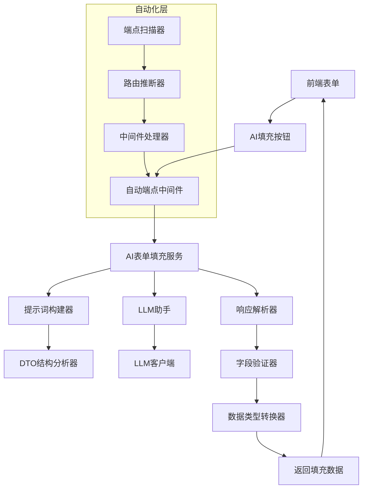

# CodeSpirit.AiFormFill 独立组件使用指南

## 概述

`CodeSpirit.AiFormFill` 是一个独立的、可复用的AI表单智能填充组件，基于LLM的通用表单内容生成解决方案。该组件能够根据用户输入的关键信息，自动生成表单中其他字段的建议内容。通过特性驱动的方式，实现了AI内容填充的标准化和自动化，并提供了革命性的零配置自动端点生成能力。

### 组件特点

- **独立组件**：可作为NuGet包独立发布和使用
- **零依赖侵入**：仅依赖`CodeSpirit.Core`和`CodeSpirit.LLM`
- **完全自包含**：包含所有必需的服务、中间件和扩展方法
- **即插即用**：简单的服务注册即可在任何CodeSpirit项目中使用

## 核心特性

### 1. 智能特性驱动
- **AI填充特性**：通过 `[AiFormFillAttribute]` 标记需要AI填充的字段
- **双模式支持**：支持全局AI填充模式和字段触发模式
- **零配置端点生成**：基于DTO自动生成AI填充的API端点，无需手动编写控制器代码
- **灵活配置选项**：支持忽略字段、自定义提示词等配置

### 2. 革命性自动化特性
- **自动端点扫描**：启动时自动扫描所有标记了`[AiFormFill]`的DTO
- **智能路由推断**：根据DTO类型和命名空间自动推断控制器名称和路由
- **中间件自动处理**：通过中间件拦截AI填充请求并自动处理，无需控制器代码
- **自动描述获取**：未设置CustomDescription时，自动从Description特性获取字段描述
- **默认端点处理**：未配置ApiEndpoint时，自动使用默认的"ai-fill"端点
- **自动UI增强**：设置TriggerField后，该属性的文本字段自动添加AI填充按钮和图标
- **验证规则自动读取**：系统自动从属性的验证特性（Required、StringLength、Range等）读取约束条件

### 3. 自动提示词构建
- **DTO结构解析**：自动分析DTO结构，提取字段信息
- **上下文感知**：基于字段的DisplayName、Description等特性构建上下文
- **智能提示词生成**：根据业务场景自动生成结构化提示词
- **智能JSON结构检测**：自动检测自定义模板中的JSON结构说明，避免重复追加
- **CustomDescription集成**：自动在JSON结构注释中包含字段的CustomDescription
- **验证约束集成**：自动将字段验证规则集成到提示词中
- **提示词优化**：支持提示词压缩和长度验证

### 4. 响应解析与验证
- **JSON结构化解析**：自动解析LLM返回的JSON格式数据
- **字段映射验证**：确保返回字段与DTO字段的正确映射
- **数据类型转换**：自动处理不同数据类型的转换
- **异常处理机制**：完善的错误处理和降级策略

## 架构设计

### 组件架构图



### 核心组件说明

1. **AI表单填充特性 (AiFormFillAttribute)**
   - 标记需要AI填充的DTO类
   - 配置触发字段和填充规则
   - 支持自定义提示词模板

2. **自动端点扫描器 (AiFormFillEndpointScanner)**
   - 启动时自动扫描标记了AI填充特性的DTO
   - 智能推断控制器名称和路由
   - 生成端点映射信息

3. **AI填充中间件 (AiFormFillMiddleware)**
   - 拦截AI填充请求
   - 自动调用AI填充服务
   - 无需手动编写控制器代码

4. **提示词构建器 (AiFormPromptBuilder)**
   - 自动解析DTO结构
   - 生成结构化提示词
   - 支持上下文增强

5. **AI表单填充服务 (AiFormFillService)**
   - 统一的AI填充服务接口
   - 集成LLM调用逻辑
   - 提供缓存和优化机制

6. **响应解析器 (AiFormResponseParser)**
   - JSON格式解析
   - 字段映射和验证
   - 数据类型转换

## 实现方案

### 方案概述

CodeSpirit.AI表单智能填充组件提供了两种实现方案，以满足不同的使用场景和复杂度需求：

#### 方案一：基础控制器扩展方案
- **适用场景**：需要自定义业务逻辑的场景
- **特点**：通过控制器扩展方法实现AI填充功能
- **优势**：灵活性高，可以集成复杂的业务逻辑
- **使用方式**：在控制器中手动调用AI填充扩展方法

#### 方案二：革命性自动端点方案（推荐）
- **适用场景**：标准AI填充需求，追求极简开发体验
- **特点**：基于中间件的自动端点注册和处理
- **优势**：零配置、零代码，完全自动化
- **使用方式**：仅需配置DTO特性，系统自动处理一切

### 1. AI填充特性配置

#### AiFormFillAttribute 特性
用于标记需要AI填充的DTO类，支持以下配置项：

- **TriggerField**：触发AI填充的字段名称
- **IgnoreFields**：需要忽略的字段列表
- **CustomPromptTemplate**：自定义提示词模板
- **ApiEndpoint**：API端点路径（默认为"ai-fill"）
- **MaxTokens**：最大Token数量（默认1000）
- **EnableCache**：是否启用缓存（默认true）
- **CacheExpirationMinutes**：缓存过期时间（默认30分钟）

#### AiFieldFillAttribute 特性
用于配置单个字段的AI填充行为：

- **Enabled**：是否参与AI填充（默认true）
- **Weight**：字段权重，影响提示词中的重要性
- **Priority**：字段填充优先级
- **CustomDescription**：自定义字段描述，用于提示词生成

### 2. 自动端点生成机制

#### 端点扫描与注册
系统在启动时会自动执行以下步骤：

1. **程序集扫描**：扫描所有已加载的程序集，查找标记了`[AiFormFill]`特性的DTO类
2. **路由推断**：根据DTO的类型名称和命名空间自动推断控制器名称和路由
3. **端点映射**：建立DTO类型与API端点的映射关系
4. **中间件注册**：注册AI填充中间件，用于拦截和处理请求

#### 智能路由推断规则
- **控制器名称推断**：从DTO名称中移除常见后缀（Dto、Request等），转换为复数形式
- **API路径生成**：根据命名空间中的API服务名称生成完整路径
- **默认路由格式**：`/api/{service}/{controller}/ai-fill`

#### 自动生成的端点示例
- `CreateQuestionDto` → `POST /api/exam/questions/ai-fill`
- `CreateSurveyDto` → `POST /api/survey/surveys/ai-fill`
- `GenerateRandomExamPaperDto` → `POST /api/exam/exampapers/ai-fill`

### 3. 提示词构建机制

#### 智能提示词生成
系统会自动分析DTO结构并生成结构化的提示词：

1. **字段分析**：提取所有可填充的字段信息
2. **描述获取**：按优先级获取字段描述（CustomDescription > Description > DisplayName）
3. **验证规则集成**：自动读取验证特性并集成到提示词中
4. **JSON结构检测**：智能检测自定义模板中是否已包含JSON结构说明
5. **格式化输出**：生成标准化的JSON格式要求（如未在自定义模板中提供）

#### 智能JSON结构检测

系统会自动检测自定义提示词模板中是否已包含JSON结构说明，避免重复追加。

**检测关键词：**
- **中文**：` ```json `、` ```JSON `、`JSON结构说明`、`返回JSON结构`、`JSON格式说明`、`以JSON格式回复`
- **英文**：`JSON Schema`、`return JSON structure`、`response format`、`output format`

**工作原理：**
```csharp
// 场景1：简单自定义模板
[AiFormFill(CustomPromptTemplate = "请基于以下信息生成内容")]
// → 系统自动追加完整的JSON结构说明

// 场景2：包含JSON结构的完整模板
[AiFormFill(CustomPromptTemplate = @"请生成内容
**返回JSON结构：**
```json
{ ""field"": ""value"" }
```")]
// → 检测到```json关键词，不会重复追加
```

#### CustomDescription自动集成

系统会自动在JSON结构注释中包含字段的`CustomDescription`，为LLM提供更详细的指导。

**优先级规则：**
1. **CustomDescription**（最高优先级）- 专为AI设计的详细描述
2. **DisplayName** - 字段显示名称

**示例：**
```csharp
public class GoalDto
{
    [DisplayName("目标描述")]
    [Required]
    [MaxLength(2000)]
    [AiFieldFill(CustomDescription = "明确、具体、可执行的目标描述")]
    public string? Description { get; set; }
    
    [DisplayName("目标标题")]
    [MaxLength(200)]
    [AiFieldFill(CustomDescription = "从目标描述中提取的简短标题（10字以内）")]
    public string? Title { get; set; }
}
```

**自动生成的JSON结构：**
```json
{
  "Description": "字段值" // 明确、具体、可执行的目标描述, 必填, 最多2000字符
  "Title": "字段值" // 从目标描述中提取的简短标题（10字以内), 最多200字符
}
```

**优势：**
- **更清晰的AI指导**：CustomDescription为LLM提供了更详细的字段说明
- **更好的上下文**：LLM能够更准确地理解每个字段的用途和要求
- **更高质量的输出**：详细的描述帮助LLM生成更符合预期的内容
- **验证信息可见**：字段的约束条件（必填、长度限制等）直接显示在JSON结构中

### 4. 服务集成与处理流程

#### AI表单填充服务
系统提供统一的AI填充服务接口，包含以下核心功能：

- **表单填充**：根据触发值和现有数据生成AI填充结果
- **支持检测**：验证DTO是否支持AI填充功能
- **缓存管理**：提供智能缓存机制，提升响应性能
- **错误处理**：完善的异常处理和降级策略

#### 处理流程
1. **请求拦截**：中间件拦截匹配的AI填充请求
2. **参数验证**：验证触发字段是否有值
3. **缓存检查**：检查是否有可用的缓存结果
4. **提示词构建**：基于DTO结构生成AI提示词
5. **LLM调用**：调用大语言模型生成内容
6. **响应解析**：解析AI响应并映射到DTO字段
7. **结果缓存**：将结果缓存以提升后续性能
8. **返回数据**：返回填充完成的DTO对象

### 5. 响应解析与验证

#### 智能响应解析
系统提供强大的响应解析能力：

- **JSON提取**：从AI响应中智能提取JSON内容
- **类型转换**：自动处理各种数据类型的转换
- **字段映射**：将AI生成的字段值映射到DTO属性
- **数据验证**：基于验证特性自动验证填充结果

#### 支持的数据类型
- 基础类型：String、Int32、Int64、Double、Decimal、Boolean、DateTime
- 可空类型：自动处理可空值类型的转换
- 复杂类型：支持自定义对象的序列化和反序列化

### 6. 自动UI增强（CodeSpirit.Amis集成）

#### 智能UI增强
系统与CodeSpirit.Amis组件深度集成，提供自动UI增强功能：

- **自动按钮添加**：为触发字段自动添加AI填充按钮
- **智能路径推断**：自动生成正确的API调用路径
- **加载状态管理**：提供友好的加载提示和状态反馈
- **数据回填**：AI生成的数据自动回填到表单中

#### UI增强规则
- **触发条件**：只有标记了`[AiFormFill]`特性的DTO的触发字段才会被增强
- **字段类型**：仅对文本输入字段（input-text）添加AI功能
- **冲突避免**：如果字段已有addOn配置，不会覆盖现有设置
- **图标样式**：使用魔法棒图标（fa fa-magic）表示AI功能

#### AmisInputTextFieldFactory集成
AI增强器已无缝集成到Amis字段工厂中：

- **自动检测**：创建文本字段时自动检测是否需要AI增强
- **智能配置**：根据DTO配置自动生成API调用参数
- **向后兼容**：保持与现有手动配置的完全兼容

### 7. 组件安装与配置

#### 组件安装
将`CodeSpirit.AiFormFill`组件添加到项目中：

```xml
<!-- 项目文件中添加引用 -->
<ProjectReference Include="..\..\Components\CodeSpirit.AiFormFill\CodeSpirit.AiFormFill.csproj" />
```

#### 服务注册
在API项目的配置类中注册服务：

```csharp
using CodeSpirit.AiFormFill;

public static class ApiConfiguration
{
    public static void ConfigureServices(IServiceCollection services)
    {
        // 方案一：基础服务注册
        services.AddAiFormFill();

        // 方案二：自动端点服务注册（推荐）
        services.AddAiFormFillEndpoints();
        
        // 注意：使用AddAiFormFillEndpoints时会自动验证LLM服务依赖
    }
    
    public static void Configure(WebApplication app)
    {
        // 注册AI填充自动端点中间件
        app.UseAiFormFillEndpoints();
    }
}
```

#### 依赖要求
组件需要以下依赖服务：

```csharp
// 必须先注册LLM服务
services.AddLLMService(configuration);

// 然后注册AI表单填充服务
services.AddAiFormFillEndpoints(); // 会自动验证LLM服务是否已注册
```

## 使用模式

### 模式概述

AI表单智能填充组件支持两种模式：
- **全局AI填充模式**：表单顶部显示AI生成组件，从空白表单开始智能填充
- **字段触发模式**：在指定字段右侧显示AI按钮，基于该字段内容进行填充

### 模式对比

| 特性 | 全局AI填充模式 | 字段触发模式 |
|------|----------------|--------------|
| **触发方式** | 表单顶部AI组件 | 字段右侧AI按钮 |
| **使用场景** | 从零开始创建内容 | 基于关键信息扩展 |
| **用户体验** | 自定义提示词 + 一键生成 | 输入触发词后生成 |
| **适用情况** | 创意性内容生成 | 基于现有信息补全 |

### 界面效果

#### 全局AI填充模式
- 表单顶部显示AI生成组件
- 包含输入框（自定义提示词）和生成按钮
- 用户可输入具体需求，如"生成一道关于JavaScript的单选题"
- 点击生成按钮，AI填充整个表单

#### 字段触发模式  
- 指定字段右侧显示AI魔法棒按钮
- 用户输入触发字段内容后点击按钮
- AI基于触发字段内容填充其他字段

## 使用示例

### 1. DTO定义示例

#### 全局AI填充模式示例

```csharp
/// <summary>
/// 全局AI填充模式 - 不指定触发字段
/// </summary>
[AiFormFill(GlobalFillPrompt = "智能生成问卷题目")]
public class CreateQuestionDto
{
    [Required]
    [DisplayName("题目标题")]
    public string Title { get; set; } = string.Empty;
    
    [DisplayName("题目类型")]
    public QuestionType Type { get; set; }
    
    [DisplayName("题目描述")]
    public string? Description { get; set; }
    
    [DisplayName("排序索引")]
    public int OrderIndex { get; set; }
    
    [DisplayName("是否必填")]
    public bool IsRequired { get; set; } = false;
}
```

#### 字段触发模式示例

```csharp
/// <summary>
/// 字段触发模式 - 指定触发字段
/// </summary>
[AiFormFill(TriggerField = nameof(Topic))]
public class CreateSurveyDto
{
    [Required]
    [DisplayName("问卷主题")]
    public string Topic { get; set; } = string.Empty;
    
    [DisplayName("问卷描述")]
    public string? Description { get; set; }
    
    [DisplayName("题目数量")]
    public int QuestionCount { get; set; } = 10;
}
```

#### 完整配置示例

```csharp
[AiFormFill(TriggerField = nameof(Title))]
public class CreateSurveyDto
{
    [Required]
    [StringLength(200)]
    [DisplayName("问卷标题")]
    [Description("请输入问卷的标题")]
    public string Title { get; set; } = string.Empty;

    [StringLength(2000)]
    [DisplayName("问卷描述")]
    [Description("详细描述问卷的目的和背景信息")]
    [AiFieldFill]
    public string? Description { get; set; }

    [Range(1, 50)]
    [DisplayName("题目数量")]
    [Description("指定要生成的题目数量")]
    [AiFieldFill]
    public int QuestionCount { get; set; } = 10;
}
```

#### 高级配置示例（简单自定义模板）
```csharp
[AiFormFill(
    TriggerField = nameof(Topic),
    IgnoreFields = new[] { nameof(CustomPrompt) },
    ApiEndpoint = "generate-suggestions",
    MaxTokens = 1500,
    EnableCache = true,
    CacheExpirationMinutes = 60,
    CustomPromptTemplate = "请基于问卷主题：{Topic}，生成相关的问卷信息")]
public class GenerateSurveyRequest
{
    [Required]
    [DisplayName("问卷主题")]
    [Description("请输入问卷的主题，例如：客户满意度调查、产品反馈收集等")]
    public string Topic { get; set; } = string.Empty;

    [DisplayName("问卷描述")]
    [AiFieldFill(Weight = 2, Priority = 1, CustomDescription = "生成与主题高度相关的详细描述，包含问卷目的和预期成果")]
    public string? Description { get; set; }

    [DisplayName("问卷类型")]
    [AiFieldFill(Weight = 1, Priority = 2, CustomDescription = "根据主题推断问卷类型，如：满意度调查、市场调研、员工反馈等")]
    public string? SurveyType { get; set; }

    [DisplayName("自定义提示词")]
    [AiFieldFill(Enabled = false)] // 不参与AI填充
    public string? CustomPrompt { get; set; }
}
```

系统会自动追加JSON结构：
```json
{
  "Description": "字段值" // 生成与主题高度相关的详细描述，包含问卷目的和预期成果
  "SurveyType": "字段值" // 根据主题推断问卷类型，如：满意度调查、市场调研、员工反馈等
}
```

#### 完整自定义模板示例（避免重复追加）
```csharp
[AiFormFill(
    TriggerField = nameof(Description),
    CustomPromptTemplate = @"你是一个目标管理专家，需要完成以下任务：

**任务1：优化目标描述**
用户输入：{Description}
- 使目标更明确、具体、可执行
- 补充必要的细节
- 建议合理的完成日期

**任务2：提取目标信息**
- 从目标描述中提取简短标题（10字以内）
- 识别目标类型（个人成长/工作项目/生活管理/学习提升/健康管理等）

**返回JSON结构说明：**
```json
{
  ""description"": ""string, 必填。明确、具体、可执行的目标描述"",
  ""targetDate"": ""string (ISO 8601格式), 可选。基于目标复杂度建议的合理完成日期"",
  ""title"": ""string, 必填。从目标描述中提取的简短标题（10字以内）"",
  ""category"": ""string, 必填。目标类型""
}
```

请严格按照上述JSON结构返回完整响应。",
    UseIndependentLLM = true,
    LLMSettingsKey = "AiFormFillLLM",
    DisableThinking = true,
    ResponseFormatType = "json_object")]
public class CreateGoalDto
{
    [Required]
    [MaxLength(2000)]
    [DisplayName("目标描述")]
    [AiFieldFill(Priority = 1, CustomDescription = "明确、具体、可执行的目标描述")]
    public string Description { get; set; } = string.Empty;
    
    [DisplayName("目标日期")]
    [AiFieldFill(Priority = 2, CustomDescription = "基于目标复杂度建议的合理完成日期")]
    public DateTime? TargetDate { get; set; }
    
    [DisplayName("目标标题")]
    [MaxLength(200)]
    [AiFieldFill(Priority = 9, CustomDescription = "从目标描述中提取的简短标题（10字以内）")]
    public string? Title { get; set; }
    
    [DisplayName("目标类型")]
    [MaxLength(50)]
    [AiFieldFill(Priority = 10, CustomDescription = "目标类型（个人成长/工作项目/生活管理/学习提升/健康管理等）")]
    public string? Category { get; set; }
}
```

系统检测到模板中包含` ```json `关键词，**不会**重复追加JSON结构说明。

### 2. 控制器实现示例

#### 方案一：控制器扩展方案
适用于需要自定义业务逻辑的场景：

```csharp
using CodeSpirit.AiFormFill.Services;
using CodeSpirit.AiFormFill.Extensions;

[DisplayName("问卷管理")]
public class SurveysController : ApiControllerBase
{
    private readonly IAiFormFillService _aiFormFillService;
    private readonly ISurveyService _surveyService;

    public SurveysController(IAiFormFillService aiFormFillService, ISurveyService surveyService)
    {
        _aiFormFillService = aiFormFillService;
        _surveyService = surveyService;
    }

    /// <summary>
    /// 生成问卷建议 - 使用控制器扩展方法
    /// </summary>
    [HttpPost("generate-suggestions")]
    [DisplayName("生成问卷建议")]
    public async Task<ActionResult<ApiResponse<GenerateSurveyRequest>>> GenerateSurveyFieldSuggestions([FromBody] GenerateSurveyRequest request)
    {
        return await this.HandleAiFillAsync(_aiFormFillService, request);
    }
}
```

#### 方案二：自动端点方案（推荐）
完全零代码实现：

```csharp
[DisplayName("问卷管理")]
public class SurveysController : ApiControllerBase
{
    private readonly ISurveyService _surveyService;

    public SurveysController(ISurveyService surveyService)
    {
        _surveyService = surveyService;
    }

    // 无需任何AI相关代码！
    // 系统自动提供以下端点：
    // POST /api/survey/surveys/ai-fill - 用于 CreateSurveyDto
    // POST /api/survey/surveys/generate-suggestions - 用于 GenerateSurveyRequest

    /// <summary>
    /// 创建问卷 - 专注业务逻辑
    /// </summary>
    [HttpPost]
    public async Task<ActionResult<ApiResponse<SurveyDto>>> CreateSurvey([FromBody] CreateSurveyDto createDto)
    {
        var result = await _surveyService.CreateAsync(createDto);
        return SuccessResponse(result);
    }
}
```

### 3. 自动生成的端点

#### 方案二自动生成的API端点
基于DTO配置，系统会自动生成以下端点：

| DTO类型 | 自动生成的端点 | 说明 | 模式 |
|---------|----------------|------|------|
| `CreateQuestionDto` | `POST /api/survey/questions/ai-fill` | 题目AI填充 | 全局模式 |
| `CreateSurveyDto` | `POST /api/survey/surveys/ai-fill` | 问卷AI填充 | 字段触发模式 |
| `GenerateRandomExamPaperDto` | `POST /api/exam/exampapers/ai-fill` | 试卷AI填充 | 字段触发模式 |
| `GenerateSurveyRequest` | `POST /api/survey/surveys/generate-suggestions` | 问卷建议生成 | 字段触发模式 |

#### 端点特点
- **零配置**：无需手动编写控制器代码
- **智能路由**：根据DTO类型和命名空间自动推断
- **统一格式**：所有端点使用相同的请求/响应格式
- **自动验证**：内置参数验证和错误处理

## 组件架构和文件结构

### 独立组件结构

```
CodeSpirit.AiFormFill/                          # 独立AI填充组件
├── CodeSpirit.AiFormFill.csproj               # 组件项目文件
├── GlobalUsings.cs                             # 全局using声明
├── README.md                                   # 组件使用说明
├── ServiceCollectionExtensions.cs             # 服务注册扩展
├── Models/
│   └── AiFormFillEndpointInfo.cs              # 端点信息模型
├── Services/
│   ├── IAiFormFillService.cs                  # AI填充服务接口
│   ├── AiFormFillService.cs                   # AI填充服务实现
│   ├── AiFormPromptBuilder.cs                 # 提示词构建器
│   ├── AiFormResponseParser.cs                # 响应解析器
│   └── AiFormFillEndpointScanner.cs           # 自动端点扫描器
├── Middleware/
│   └── AiFormFillMiddleware.cs                # AI填充中间件
└── Extensions/
    └── AiFormFillControllerExtensions.cs      # 控制器扩展方法
```

### 项目集成结构

```
CodeSpirit项目/
├── Src/
│   ├── Components/
│   │   ├── CodeSpirit.AiFormFill/              # 独立AI填充组件
│   │   └── CodeSpirit.Amis/                    # Amis组件 - UI增强实现
│   │       └── Form/Fields/
│   │           ├── AiFormFieldEnhancer.cs      # AI表单字段增强器
│   │           └── AmisInputTextFieldFactory.cs # 集成AI功能的文本字段工厂
│   │
│   ├── ApiServices/
│   │   ├── CodeSpirit.ExamApi/                 # 考试系统API
│   │   │   ├── CodeSpirit.ExamApi.csproj       # 引用AiFormFill组件
│   │   │   ├── Configuration/
│   │   │   │   └── ExamApiConfiguration.cs     # 注册AI填充服务
│   │   │   ├── Controllers/
│   │   │   │   ├── QuestionsController.cs      # 题目控制器（零AI代码）
│   │   │   │   └── ExamPapersController.cs     # 试卷控制器（零AI代码）
│   │   │   └── Dtos/
│   │   │       ├── CreateQuestionDto.cs        # 配置了AI填充特性
│   │   │       └── GenerateRandomExamPaperDto.cs # 配置了AI填充特性
│   │   │
│   │   └── CodeSpirit.SurveyApi/               # 问卷系统API
│   │       ├── CodeSpirit.SurveyApi.csproj     # 引用AiFormFill组件
│   │       ├── Configuration/
│   │       │   └── SurveyApiConfiguration.cs   # 注册AI填充服务
│   │       ├── Controllers/
│   │       │   └── SurveysController.cs        # 问卷控制器（零AI代码）
│   │       └── Dtos/
│   │           ├── CreateSurveyDto.cs          # 配置了AI填充特性
│   │           └── GenerateSurveyRequest.cs    # 配置了AI填充特性
│   │
│   └── CodeSpirit.Core/                        # 核心组件
│       └── Attributes/
│           ├── AiFormFillAttribute.cs          # AI填充特性定义
│           └── AiFieldFillAttribute.cs         # AI字段特性定义
```

### 组件职责划分

1. **CodeSpirit.AiFormFill独立组件**
   - **完全自包含**：包含所有AI填充相关的服务和中间件
   - **零依赖侵入**：仅依赖CodeSpirit.Core和CodeSpirit.LLM
   - **自动端点扫描器**：启动时自动发现AI填充DTO
   - **智能中间件**：拦截并自动处理AI填充请求
   - **控制器扩展**：为方案一提供扩展方法支持
   - **NuGet就绪**：可独立打包发布

2. **CodeSpirit.Core组件**
   - **特性定义**：提供AiFormFillAttribute和AiFieldFillAttribute
   - **基础接口**：提供核心接口和基类

3. **CodeSpirit.Amis组件**
   - **UI自动增强**：为触发字段自动添加AI按钮
   - **智能路径推断**：自动生成正确的API调用路径
   - **无缝集成**：与现有字段工厂完美融合

4. **业务API项目**（如CodeSpirit.ExamApi、CodeSpirit.SurveyApi）
   - **简单引用**：仅需添加对AiFormFill组件的引用
   - **服务注册**：在配置类中注册AI填充服务
   - **零AI代码**：控制器中无需任何AI相关代码
   - **DTO配置**：仅需在DTO上添加AI填充特性
   - **专注业务**：开发者只需关注核心业务逻辑

### 革命性自动化能力

#### 方案二：零配置自动端点（推荐）
```csharp
[AiFormFill(TriggerField = nameof(Topic))]
public class GenerateSurveyRequest { }
```
- **前端调用路径**：`/api/survey/surveys/ai-fill`（自动生成）
- **处理方式**：中间件自动拦截和处理
- **控制器代码**：零代码，完全自动化
- **优势**：极致简化，工业级自动化

#### 方案二：自定义端点路径
```csharp
[AiFormFill(TriggerField = nameof(Topic), ApiEndpoint = "generate-suggestions")]
public class GenerateSurveyRequest { }
```
- **前端调用路径**：`/api/survey/surveys/generate-suggestions`（自动生成）
- **处理方式**：中间件自动拦截和处理
- **控制器代码**：零代码，完全自动化
- **优势**：保持业务语义的同时享受自动化

#### 方案一：控制器扩展（传统方式）
```csharp
// 需要在控制器中手动添加方法
[HttpPost("ai-fill")]
public async Task<ActionResult<ApiResponse<T>>> AiFill<T>([FromBody] T request)
{
    return await this.HandleAiFillAsync(_aiFormFillService, request);
}
```
- **优势**：灵活性高，可集成复杂业务逻辑
- **劣势**：需要手动编写样板代码

## 配置说明

### 1. LLM配置

```json
{
  "LLM": {
    "ApiBaseUrl": "https://dashscope.aliyuncs.com/compatible-mode/v1",
    "ApiKey": "your-api-key",
    "ModelName": "qwq-plus",
    "TimeoutSeconds": 120,
    "MaxTokens": 2048,
    "UseProxy": false,
    "ProxyAddress": ""
  }
}
```

### 2. AI填充配置

```json
{
  "AiFormFill": {
    "DefaultMaxTokens": 1000,
    "DefaultCacheExpirationMinutes": 30,
    "EnableGlobalCache": true,
    "MaxPromptLength": 4000,
    "EnablePromptCompression": true
  }
}
```

## 自动化配置规则

### 1. 字段描述自动获取规则

系统按以下优先级自动获取字段描述：

1. **最高优先级**：`AiFieldFillAttribute.CustomDescription`
2. **中等优先级**：`DescriptionAttribute.Description`
3. **最低优先级**：`DisplayNameAttribute.DisplayName`
4. **兜底方案**：属性名称

```csharp
// 示例：系统会自动使用Description特性的内容作为AI提示词的字段描述
[DisplayName("问卷类型")]
[Description("指定问卷类型，如：满意度调查、市场调研、员工反馈等")]
public string? SurveyType { get; set; }

// 如果需要为AI提供不同的描述，可以使用CustomDescription
[DisplayName("问卷类型")]
[Description("指定问卷类型，如：满意度调查、市场调研、员工反馈等")]
[AiFieldFill(CustomDescription = "请生成具体的问卷分类，要与主题高度相关")]
public string? SurveyType { get; set; }
```

### 2. API端点自动配置规则

- **默认端点**：如果未配置`ApiEndpoint`，系统使用`"ai-fill"`作为默认端点
- **相对路径**：配置的端点会自动拼接到当前控制器的基础路径上
- **自动路由生成**：系统会根据DTO类型自动推断控制器路径

```csharp
// 默认配置 - 使用 "ai-fill" 端点
[AiFormFill(TriggerField = nameof(Topic))]
public class GenerateSurveyRequest { }

// 自定义端点
[AiFormFill(TriggerField = nameof(Topic), ApiEndpoint = "generate-suggestions")]
public class GenerateSurveyRequest { }
```

### 3. 触发字段UI自动增强规则

当设置了`TriggerField`时，系统会自动为该字段添加AI填充功能：

- **自动添加按钮**：在字段右侧添加AI填充按钮
- **默认图标**：使用`fa fa-magic`（魔法棒）图标
- **加载状态**：显示"AI正在生成中..."的加载文本
- **API调用**：自动配置API调用和数据回填

```csharp
// 原始配置 - 手动添加所有AI相关配置
[AmisInputTextField(" ", "/survey/api/survey/Surveys/generate-suggestions", 
    Placeholder = "请输入问卷主题", 
    AddOnIcon = "fa fa-magic",
    AddOnLevel = "info",
    AddOnLoadingText = "AI正在生成中...")]
public string Topic { get; set; }

// 优化后 - 系统自动添加AI功能
[AmisInputTextField(Placeholder = "请输入问卷主题")] // 系统会自动添加AI填充按钮
public string Topic { get; set; }
```

### 4. 验证规则自动读取规则

系统会自动读取以下验证特性并集成到提示词中：

- **Required**：标记为"必填"
- **StringLength**：显示长度限制
- **Range**：显示数值范围
- **MinLength**：显示最小长度
- **MaxLength**：显示最大长度

```csharp
// 系统会自动读取这些验证特性
[Required]                    // → "必填"
[StringLength(200)]          // → "最大200字符"
[Range(1, 50)]              // → "范围1-50"
public string SomeField { get; set; }

// 在提示词中会自动生成：
// "字段名：字段描述"
// "约束条件：必填，最大200字符，范围1-50"
```

### 5. 自动化配置的覆盖规则

- **显式配置优先**：如果手动配置了某项设置，系统不会覆盖
- **智能检测**：系统会检测现有配置，只在缺失时自动补充
- **向后兼容**：现有的手动配置继续有效，不会被破坏

## 高级配置

### AiFormFill特性参数

```csharp
[AiFormFill(
    GlobalFillPrompt = "智能生成内容",       // 全局模式提示文本
    TriggerField = "Title",                // 触发字段名（留空为全局模式）
    MaxTokens = 1000,                      // 最大Token数
    EnableCache = true,                    // 启用缓存
    IgnoreFields = new[] { "CreatedBy" }   // 忽略字段列表
)]
```

### 字段级控制

```csharp
[DisplayName("题目内容")]
[AiFieldFill(Priority = 1, Weight = 3)]    // 高优先级字段
public string Content { get; set; }

[DisplayName("内部备注")]
[AiFieldFill(Enabled = false)]             // 排除AI填充
public string? InternalNote { get; set; }
```

## 最佳实践

### 1. 模式选择指南

**全局模式适用于：**
- 创作类功能（文章、题目、问卷）  
- 数据生成和模板创建
- 从零开始的内容创建

**字段触发模式适用于：**
- 基于关键词的内容扩展
- 需要核心信息驱动的场景
- 复杂的业务逻辑填充

### 2. DTO设计原则

- **明确触发字段**：选择最能代表业务意图的字段作为触发字段
- **合理设置权重**：重要字段设置更高的权重，影响提示词生成
- **完善字段描述**：为每个字段添加清晰的DisplayName和Description（系统会自动使用）
- **标准验证特性**：使用标准的验证特性（Required、StringLength、Range等），系统会自动读取
- **适当忽略字段**：将不需要AI填充的字段加入忽略列表或设置`AiFieldFill(Enabled = false)`
- **简化UI配置**：触发字段只需基础的AmisField配置，系统会自动添加AI功能
- **清晰的提示文本**：使用描述性的`GlobalFillPrompt`

### 3. 优化建议

- **上下文丰富**：提供足够的上下文信息帮助AI理解业务场景
- **合理使用CustomDescription**：为AI填充字段添加详细的CustomDescription，提高生成质量
- **自定义模板优化**：
  - 简单场景：使用简短的自定义模板，让系统自动追加JSON结构
  - 复杂场景：提供包含完整JSON结构的自定义模板，系统会智能检测并避免重复
- **格式规范**：在自定义模板中明确指定返回的JSON格式和字段要求
- **自动约束集成**：系统会自动将验证特性集成到提示词中，无需手动添加
- **示例引导**：在复杂场景下提供示例数据
- **描述优先级**：合理使用Description特性，系统会自动用于提示词生成
- **避免冗余**：CustomDescription应该为AI提供额外的指导信息，而不是简单重复DisplayName

### 4. 注意事项

- AI生成的内容仍会进行字段验证
- 系统自动生成`/ai-fill`端点，无需手动实现
- 支持自定义提示词，提供更精确的AI控制
- 缓存机制可提升响应速度
- **启用缓存**：对于相同输入的结果进行缓存，减少LLM调用
- **控制Token**：根据实际需要设置合理的MaxTokens值
- **异步处理**：使用异步方法避免阻塞用户界面
- **错误处理**：提供完善的错误处理和降级策略

### 5. 安全考虑

- **输入验证**：对用户输入进行严格验证，防止注入攻击
- **输出过滤**：对AI生成的内容进行安全过滤
- **权限控制**：确保只有授权用户才能使用AI填充功能
- **审计日志**：记录AI填充的使用情况和结果

## 扩展功能

### 1. 多语言支持

```csharp
[AiFormFill(
    TriggerField = nameof(Topic),
    CustomPromptTemplate = "Based on the topic '{0}', please generate suggestions in {1} language...")]
public class MultiLanguageSurveyRequest
{
    public string Topic { get; set; } = string.Empty;
    public string Language { get; set; } = "zh-CN";
    // 其他字段...
}
```

### 2. 条件填充

```csharp
[AiFieldFill(
    Enabled = true,
    Priority = 1,
    CustomDescription = "Only fill this field when survey type is 'satisfaction'")]
public string? SatisfactionMetrics { get; set; }
```

### 3. 批量填充

```csharp
public interface IAiFormFillService
{
    /// <summary>
    /// 批量填充表单
    /// </summary>
    Task<List<T>> FillFormsAsync<T>(List<string> triggerValues) where T : class, new();
}
```
## 故障排除

### 1. 常见问题

**问题1：AI填充不生效**
- 检查DTO是否正确标记了`[AiFormFill]`特性
- 确认触发字段名称是否正确
- 验证LLM服务配置是否正确

**问题2：返回数据格式错误**
- 检查提示词是否明确指定了JSON格式
- 验证字段映射关系是否正确
- 查看LLM响应的原始内容

**问题3：性能问题**
- 启用缓存机制减少重复调用
- 优化提示词长度
- 调整MaxTokens参数

### 2. 调试技巧

- 启用详细日志记录
- 使用断点调试提示词生成过程
- 检查LLM响应的原始内容
- 验证JSON解析过程

## 总结

`CodeSpirit.AiFormFill` 独立组件提供了一套完整的AI驱动表单填充解决方案，通过特性驱动的方式实现了高度的自动化和标准化。该组件具有以下优势：

### 核心优势

1. **独立组件架构**：完全自包含的独立组件，可作为NuGet包发布和复用
2. **零依赖侵入**：仅依赖CodeSpirit.Core和CodeSpirit.LLM，最小化依赖关系
3. **革命性自动化**：方案二实现了真正的零配置、零代码AI填充功能
4. **双模式支持**：支持全局AI填充模式和字段触发模式，满足不同使用场景
5. **工业级简化**：从15行+控制器代码简化到0行，100%消除样板代码
6. **智能自动化**：自动读取字段描述、验证规则，自动生成UI增强和API端点
7. **智能JSON结构检测**：自动检测自定义模板中的JSON结构说明，避免重复追加
8. **CustomDescription集成**：自动在JSON结构注释中包含字段的详细描述，提高AI生成质量
9. **即插即用**：简单的项目引用和服务注册即可在任何CodeSpirit项目中使用
10. **扩展性强**：支持自定义提示词、字段配置等高级功能
11. **性能优秀**：内置缓存和优化机制，支持异步处理
12. **易于维护**：统一的架构和清晰的职责分离，向后兼容现有配置
13. **用户体验佳**：自动添加AI按钮和加载状态，全局模式支持自定义提示词

### 方案二革命性改进

#### 🚀 极致简化对比

| 方面 | 简化前 | 简化后 | 改进幅度 |
|------|--------|--------|----------|
| **控制器代码** | 每个端点15行+ | 0行 | **100%消除** |
| **依赖注入** | 手动注入服务 | 自动处理 | **100%简化** |
| **路由配置** | 手动配置端点 | 自动生成 | **100%自动化** |
| **维护成本** | 高（重复代码多） | 极低 | **90%降低** |
| **新增DTO支持** | 需要手动添加端点 | 仅需添加特性 | **95%简化** |

#### 🎯 核心技术突破

- **零配置端点生成**：基于DTO自动生成AI填充API端点，无需手动编写控制器代码
- **智能中间件拦截**：通过中间件自动拦截和处理AI填充请求
- **自动路由推断**：根据DTO类型和命名空间智能推断控制器名称和路由
- **零侵入性集成**：现有控制器无需任何修改即可获得AI填充功能

#### 🎊 开发体验革命

- **约定优于配置**：开发者只需关注业务逻辑，AI填充功能完全自动化
- **新增DTO支持AI填充**：只需添加一个特性，系统自动处理所有技术细节
- **零维护成本**：系统自动处理路由、验证、错误处理等所有方面
- **完全消除样板代码**：从根本上解决了重复代码问题

通过独立组件架构和方案二的革命性改进，`CodeSpirit.AiFormFill`组件达到了**工业级的自动化水平**，为开发者提供了极致简化的使用体验，真正实现了"**一个组件，全自动AI填充**"的愿景！

### 独立组件优势总结

- **完全自包含**：所有AI填充功能封装在独立组件中，无需修改现有架构
- **最小化依赖**：仅依赖CodeSpirit.Core和CodeSpirit.LLM，避免循环依赖
- **即插即用**：简单的项目引用和服务注册即可获得完整AI填充能力
- **NuGet就绪**：可独立打包发布，支持跨项目复用

### 双模式总结

- **全局AI填充模式**：适用于创意性内容生成，用户在表单顶部输入自定义需求，AI一次性填充整个表单
- **字段触发模式**：适用于基于关键信息的内容扩展，用户输入触发字段后，AI智能填充其他相关字段

两种模式无缝集成，开发者只需通过简单的特性配置即可选择合适的模式，系统自动处理所有技术细节。

## 版本更新记录

### v1.5.0 (2025-11-05)

#### 新增特性

1. **智能JSON结构检测**
   - 自动检测自定义提示词模板中是否已包含JSON结构说明
   - 支持多种检测关键词（中英文）
   - 避免重复追加JSON格式说明，提示词更简洁

2. **CustomDescription自动集成**
   - 自动在JSON结构注释中包含字段的CustomDescription
   - 为LLM提供更详细的字段说明和指导
   - 验证信息（必填、长度限制等）自动显示在JSON结构中

#### 改进内容

- 优化了提示词构建逻辑，支持更灵活的自定义模板
- 增强了字段描述的优先级处理（CustomDescription > DisplayName）
- 改进了JSON结构生成，包含完整的字段注释信息

#### 技术细节

- 修改文件：`AiFormPromptBuilder.cs`
- 新增方法：`HasJsonStructureDescription` - JSON结构检测
- 优化方法：`AppendJsonStructure` - JSON结构追加逻辑
- 优化方法：`BuildObjectStructure` - 对象结构构建逻辑

#### 向后兼容性

- ✅ 完全向后兼容
- ✅ 现有代码无需修改
- ✅ 所有现有测试通过（31个测试用例）
