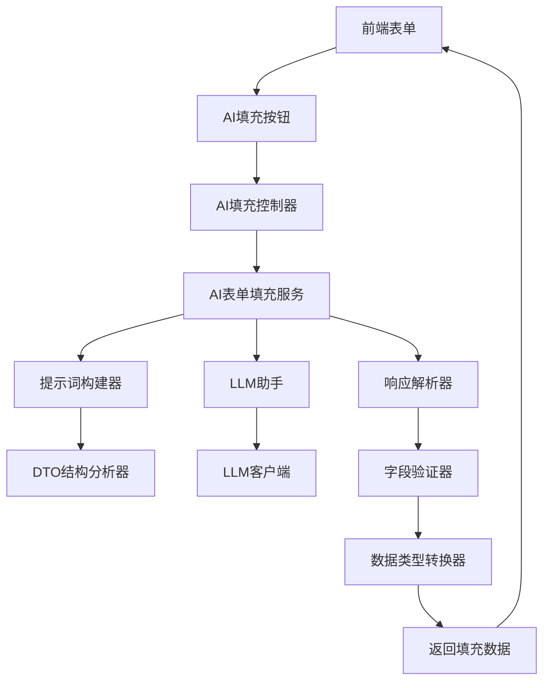

# CodeSpirit.AI表单智能填充组件使用指南

## 概述

CodeSpirit.AI表单智能填充组件是一个基于LLM的通用表单内容生成解决方案，能够根据用户输入的关键信息，自动生成表单中其他字段的建议内容。该组件通过特性驱动的方式，实现了AI内容填充的标准化和自动化。

## 核心特性

### 1. 智能特性驱动
- **AI填充特性**：通过 `[AiFormFillAttribute]` 标记需要AI填充的字段
- **触发字段配置**：指定触发AI填充的关键字段
- **自动API端点生成**：基于DTO自动生成AI填充的API端点
- **灵活配置选项**：支持忽略字段、自定义提示词等配置

### 2. 智能自动化特性
- **自动描述获取**：未设置CustomDescription时，自动从Description特性获取字段描述
- **默认端点处理**：未配置ApiEndpoint时，自动使用默认的"ai-fill"端点
- **自动UI增强**：设置TriggerField后，该属性的文本字段自动添加AI填充按钮和图标
- **验证规则自动读取**：系统自动从属性的验证特性（Required、StringLength、Range等）读取约束条件

### 3. 自动提示词构建
- **DTO结构解析**：自动分析DTO结构，提取字段信息
- **上下文感知**：基于字段的DisplayName、Description等特性构建上下文
- **智能提示词生成**：根据业务场景自动生成结构化提示词
- **验证约束集成**：自动将字段验证规则集成到提示词中
- **提示词优化**：支持提示词压缩和长度验证

### 4. 响应解析与验证
- **JSON结构化解析**：自动解析LLM返回的JSON格式数据
- **字段映射验证**：确保返回字段与DTO字段的正确映射
- **数据类型转换**：自动处理不同数据类型的转换
- **异常处理机制**：完善的错误处理和降级策略

## 架构设计

### 组件架构图



### 核心组件说明

1. **AI表单填充特性 (AiFormFillAttribute)**
   - 标记需要AI填充的DTO类
   - 配置触发字段和填充规则
   - 支持自定义提示词模板

2. **提示词构建器 (PromptBuilder)**
   - 自动解析DTO结构
   - 生成结构化提示词
   - 支持上下文增强

3. **AI表单填充服务 (AiFormFillService)**
   - 统一的AI填充服务接口
   - 集成LLM调用逻辑
   - 提供缓存和优化机制

4. **响应解析器 (ResponseParser)**
   - JSON格式解析
   - 字段映射和验证
   - 数据类型转换

## 实现方案

### 1. AI填充特性设计

```csharp
/// <summary>
/// AI表单填充特性
/// </summary>
[AttributeUsage(AttributeTargets.Class, AllowMultiple = false)]
public class AiFormFillAttribute : Attribute
{
    /// <summary>
    /// 触发AI填充的字段名称
    /// </summary>
    public string TriggerField { get; set; } = string.Empty;

    /// <summary>
    /// 需要忽略的字段列表
    /// </summary>
    public string[] IgnoreFields { get; set; } = Array.Empty<string>();

    /// <summary>
    /// 自定义提示词模板
    /// </summary>
    public string? CustomPromptTemplate { get; set; }

    /// <summary>
    /// API端点路径（相对路径）
    /// 如果未配置，将使用默认的"ai-fill"端点
    /// </summary>
    public string ApiEndpoint { get; set; } = "ai-fill";

    /// <summary>
    /// 最大Token数量
    /// </summary>
    public int MaxTokens { get; set; } = 1000;

    /// <summary>
    /// 是否启用缓存
    /// </summary>
    public bool EnableCache { get; set; } = true;

    /// <summary>
    /// 缓存过期时间（分钟）
    /// </summary>
    public int CacheExpirationMinutes { get; set; } = 30;
}
```

### 2. 字段填充特性设计

```csharp
/// <summary>
/// AI字段填充特性
/// </summary>
[AttributeUsage(AttributeTargets.Property, AllowMultiple = false)]
public class AiFieldFillAttribute : Attribute
{
    /// <summary>
    /// 是否参与AI填充
    /// </summary>
    public bool Enabled { get; set; } = true;

    /// <summary>
    /// 字段权重（影响提示词中的重要性）
    /// </summary>
    public int Weight { get; set; } = 1;

    /// <summary>
    /// 字段填充优先级
    /// </summary>
    public int Priority { get; set; } = 0;

    /// <summary>
    /// 自定义字段描述（用于提示词生成）
    /// 如果未设置，将自动从属性的Description特性获取
    /// </summary>
    public string? CustomDescription { get; set; }

    /// <summary>
    /// 字段验证规则（已废弃，系统会自动从属性的验证特性读取）
    /// </summary>
    [Obsolete("ValidationRule已废弃，系统会自动从属性的验证特性读取")]
    public string? ValidationRule { get; set; }
}
```

### 3. 提示词构建器实现

```csharp
/// <summary>
/// AI表单提示词构建器
/// </summary>
public class AiFormPromptBuilder
{
    /// <summary>
    /// 构建表单填充提示词
    /// </summary>
    /// <typeparam name="T">DTO类型</typeparam>
    /// <param name="triggerValue">触发字段的值</param>
    /// <param name="customTemplate">自定义模板</param>
    /// <returns>构建的提示词</returns>
    public string BuildPrompt<T>(string triggerValue, string? customTemplate = null) where T : class
    {
        var dtoType = typeof(T);
        var aiFormFillAttr = dtoType.GetCustomAttribute<AiFormFillAttribute>();
        
        if (aiFormFillAttr == null)
        {
            throw new InvalidOperationException($"类型 {dtoType.Name} 未标记 AiFormFillAttribute 特性");
        }

        // 使用自定义模板或生成默认模板
        if (!string.IsNullOrEmpty(customTemplate))
        {
            return BuildCustomPrompt<T>(triggerValue, customTemplate);
        }

        return BuildDefaultPrompt<T>(triggerValue, aiFormFillAttr);
    }

    /// <summary>
    /// 构建默认提示词
    /// </summary>
    private string BuildDefaultPrompt<T>(string triggerValue, AiFormFillAttribute attr) where T : class
    {
        var dtoType = typeof(T);
        var properties = GetFillableProperties<T>(attr.IgnoreFields);
        
        var promptBuilder = new StringBuilder();
        
        // 添加基础上下文
        promptBuilder.AppendLine($"基于输入的{attr.TriggerField}：\"{triggerValue}\"，请为以下表单字段生成合适的内容：");
        promptBuilder.AppendLine();

        // 添加字段描述
        foreach (var prop in properties)
        {
            var displayName = GetDisplayName(prop);
            var description = GetFieldDescription(prop); // 智能获取字段描述
            var validationInfo = GetValidationInfo(prop); // 自动获取验证信息
            
            promptBuilder.AppendLine($"{properties.IndexOf(prop) + 1}. {displayName}：{description}");
            
            // 添加验证约束信息
            if (!string.IsNullOrEmpty(validationInfo))
            {
                promptBuilder.AppendLine($"   约束条件：{validationInfo}");
            }
        }

        // 添加输出格式要求
        promptBuilder.AppendLine();
        promptBuilder.AppendLine("请以JSON格式回复，格式如下：");
        promptBuilder.AppendLine("{");
        
        foreach (var prop in properties)
        {
            var jsonPropertyName = GetJsonPropertyName(prop);
            promptBuilder.AppendLine($"  \"{jsonPropertyName}\": \"字段值\",");
        }
        
        promptBuilder.AppendLine("}");
        
        // 添加要求和约束
        promptBuilder.AppendLine();
        promptBuilder.AppendLine("要求：");
        promptBuilder.AppendLine("- 内容要与输入信息高度相关");
        promptBuilder.AppendLine("- 生成的内容要符合实际业务场景");
        promptBuilder.AppendLine("- 确保JSON格式正确");
        promptBuilder.AppendLine("- 字段值要简洁明了");

        return promptBuilder.ToString();
    }

    /// <summary>
    /// 智能获取字段描述
    /// </summary>
    /// <param name="property">属性信息</param>
    /// <returns>字段描述</returns>
    private string GetFieldDescription(PropertyInfo property)
    {
        var aiFieldAttr = property.GetCustomAttribute<AiFieldFillAttribute>();
        
        // 优先使用自定义描述
        if (!string.IsNullOrEmpty(aiFieldAttr?.CustomDescription))
        {
            return aiFieldAttr.CustomDescription;
        }
        
        // 其次使用Description特性
        var descriptionAttr = property.GetCustomAttribute<DescriptionAttribute>();
        if (!string.IsNullOrEmpty(descriptionAttr?.Description))
        {
            return descriptionAttr.Description;
        }
        
        // 最后使用DisplayName
        var displayNameAttr = property.GetCustomAttribute<DisplayNameAttribute>();
        return displayNameAttr?.DisplayName ?? property.Name;
    }

    /// <summary>
    /// 自动获取验证信息
    /// </summary>
    /// <param name="property">属性信息</param>
    /// <returns>验证信息</returns>
    private string GetValidationInfo(PropertyInfo property)
    {
        var validationRules = new List<string>();
        
        // Required特性
        if (property.GetCustomAttribute<RequiredAttribute>() != null)
        {
            validationRules.Add("必填");
        }
        
        // StringLength特性
        var stringLengthAttr = property.GetCustomAttribute<StringLengthAttribute>();
        if (stringLengthAttr != null)
        {
            if (stringLengthAttr.MinimumLength > 0)
            {
                validationRules.Add($"长度{stringLengthAttr.MinimumLength}-{stringLengthAttr.MaximumLength}字符");
            }
            else
            {
                validationRules.Add($"最大{stringLengthAttr.MaximumLength}字符");
            }
        }
        
        // Range特性
        var rangeAttr = property.GetCustomAttribute<RangeAttribute>();
        if (rangeAttr != null)
        {
            validationRules.Add($"范围{rangeAttr.Minimum}-{rangeAttr.Maximum}");
        }
        
        // MinLength特性
        var minLengthAttr = property.GetCustomAttribute<MinLengthAttribute>();
        if (minLengthAttr != null)
        {
            validationRules.Add($"最少{minLengthAttr.Length}字符");
        }
        
        // MaxLength特性
        var maxLengthAttr = property.GetCustomAttribute<MaxLengthAttribute>();
        if (maxLengthAttr != null)
        {
            validationRules.Add($"最多{maxLengthAttr.Length}字符");
        }
        
        return string.Join("，", validationRules);
    }
}
```

### 4. AI表单填充服务实现

```csharp
/// <summary>
/// AI表单填充服务接口
/// </summary>
public interface IAiFormFillService
{
    /// <summary>
    /// 填充表单字段
    /// </summary>
    /// <typeparam name="T">DTO类型</typeparam>
    /// <param name="triggerValue">触发值</param>
    /// <param name="existingData">现有数据</param>
    /// <returns>填充后的数据</returns>
    Task<T> FillFormAsync<T>(string triggerValue, T? existingData = null) where T : class, new();

    /// <summary>
    /// 验证DTO是否支持AI填充
    /// </summary>
    /// <typeparam name="T">DTO类型</typeparam>
    /// <returns>是否支持</returns>
    bool IsAiFillSupported<T>() where T : class;
}

/// <summary>
/// AI表单填充服务实现
/// </summary>
public class AiFormFillService : IAiFormFillService, IScopedDependency
{
    private readonly LLMAssistant _llmAssistant;
    private readonly AiFormPromptBuilder _promptBuilder;
    private readonly AiFormResponseParser _responseParser;
    private readonly IMemoryCache _cache;
    private readonly ILogger<AiFormFillService> _logger;

    public AiFormFillService(
        LLMAssistant llmAssistant,
        AiFormPromptBuilder promptBuilder,
        AiFormResponseParser responseParser,
        IMemoryCache cache,
        ILogger<AiFormFillService> logger)
    {
        _llmAssistant = llmAssistant;
        _promptBuilder = promptBuilder;
        _responseParser = responseParser;
        _cache = cache;
        _logger = logger;
    }

    /// <summary>
    /// 填充表单字段
    /// </summary>
    public async Task<T> FillFormAsync<T>(string triggerValue, T? existingData = null) where T : class, new()
    {
        try
        {
            var dtoType = typeof(T);
            var aiFormFillAttr = dtoType.GetCustomAttribute<AiFormFillAttribute>();
            
            if (aiFormFillAttr == null)
            {
                throw new InvalidOperationException($"类型 {dtoType.Name} 未标记 AiFormFillAttribute 特性");
            }

            // 检查缓存
            if (aiFormFillAttr.EnableCache)
            {
                var cacheKey = GenerateCacheKey<T>(triggerValue);
                if (_cache.TryGetValue(cacheKey, out T? cachedResult))
                {
                    _logger.LogInformation("从缓存获取AI填充结果：{Type}", dtoType.Name);
                    return cachedResult!;
                }
            }

            // 构建提示词
            var prompt = _promptBuilder.BuildPrompt<T>(triggerValue, aiFormFillAttr.CustomPromptTemplate);
            
            _logger.LogInformation("开始AI表单填充，类型：{Type}，触发值：{TriggerValue}", dtoType.Name, triggerValue);

            // 调用LLM
            var llmResponse = await _llmAssistant.GenerateContentAsync(prompt, aiFormFillAttr.MaxTokens);

            // 解析响应
            var result = await _responseParser.ParseResponseAsync<T>(llmResponse, existingData);

            // 设置触发字段的值
            var triggerProperty = dtoType.GetProperty(aiFormFillAttr.TriggerField);
            if (triggerProperty != null && triggerProperty.CanWrite)
            {
                triggerProperty.SetValue(result, triggerValue);
            }

            // 缓存结果
            if (aiFormFillAttr.EnableCache)
            {
                var cacheKey = GenerateCacheKey<T>(triggerValue);
                var cacheOptions = new MemoryCacheEntryOptions
                {
                    AbsoluteExpirationRelativeToNow = TimeSpan.FromMinutes(aiFormFillAttr.CacheExpirationMinutes)
                };
                _cache.Set(cacheKey, result, cacheOptions);
            }

            _logger.LogInformation("AI表单填充完成：{Type}", dtoType.Name);
            return result;
        }
        catch (Exception ex)
        {
            _logger.LogError(ex, "AI表单填充失败，类型：{Type}，触发值：{TriggerValue}", typeof(T).Name, triggerValue);
            throw new BusinessException($"AI表单填充失败：{ex.Message}");
        }
    }

    /// <summary>
    /// 验证DTO是否支持AI填充
    /// </summary>
    public bool IsAiFillSupported<T>() where T : class
    {
        return typeof(T).GetCustomAttribute<AiFormFillAttribute>() != null;
    }

    /// <summary>
    /// 生成缓存键
    /// </summary>
    private string GenerateCacheKey<T>(string triggerValue) where T : class
    {
        return $"AiFormFill:{typeof(T).Name}:{triggerValue.GetHashCode()}";
    }
}
```

### 5. 响应解析器实现

```csharp
/// <summary>
/// AI表单响应解析器
/// </summary>
public class AiFormResponseParser
{
    private readonly ILogger<AiFormResponseParser> _logger;

    public AiFormResponseParser(ILogger<AiFormResponseParser> logger)
    {
        _logger = logger;
    }

    /// <summary>
    /// 解析LLM响应
    /// </summary>
    /// <typeparam name="T">目标类型</typeparam>
    /// <param name="llmResponse">LLM响应</param>
    /// <param name="existingData">现有数据</param>
    /// <returns>解析后的对象</returns>
    public async Task<T> ParseResponseAsync<T>(string llmResponse, T? existingData = null) where T : class, new()
    {
        try
        {
            // 提取JSON部分
            var jsonContent = ExtractJsonContent(llmResponse);
            
            // 解析JSON
            var jsonObject = JsonConvert.DeserializeObject<JObject>(jsonContent);
            if (jsonObject == null)
            {
                throw new ArgumentException("无法解析JSON内容");
            }

            // 创建结果对象
            var result = existingData ?? new T();
            var dtoType = typeof(T);
            var aiFormFillAttr = dtoType.GetCustomAttribute<AiFormFillAttribute>();
            
            // 获取可填充的属性
            var properties = GetFillableProperties<T>(aiFormFillAttr?.IgnoreFields ?? Array.Empty<string>());

            // 填充属性值
            foreach (var property in properties)
            {
                var jsonPropertyName = GetJsonPropertyName(property);
                
                if (jsonObject.TryGetValue(jsonPropertyName, out var jsonValue))
                {
                    try
                    {
                        var convertedValue = ConvertJsonValue(jsonValue, property.PropertyType);
                        if (convertedValue != null && property.CanWrite)
                        {
                            property.SetValue(result, convertedValue);
                        }
                    }
                    catch (Exception ex)
                    {
                        _logger.LogWarning(ex, "转换属性值失败：{PropertyName}, 值：{Value}", property.Name, jsonValue);
                    }
                }
            }

            // 验证结果
            await ValidateResultAsync(result);

            return result;
        }
        catch (Exception ex)
        {
            _logger.LogError(ex, "解析AI响应失败：{Response}", llmResponse);
            throw new BusinessException($"解析AI响应失败：{ex.Message}");
        }
    }

    /// <summary>
    /// 提取JSON内容
    /// </summary>
    private string ExtractJsonContent(string response)
    {
        // 使用正则表达式提取JSON部分
        var jsonMatch = Regex.Match(response, @"\{[\s\S]*\}", RegexOptions.Multiline);
        if (!jsonMatch.Success)
        {
            throw new ArgumentException("响应中未找到有效的JSON格式");
        }
        return jsonMatch.Value;
    }

    /// <summary>
    /// 转换JSON值到目标类型
    /// </summary>
    private object? ConvertJsonValue(JToken jsonValue, Type targetType)
    {
        if (jsonValue.Type == JTokenType.Null)
            return null;

        // 处理可空类型
        var underlyingType = Nullable.GetUnderlyingType(targetType) ?? targetType;

        return underlyingType.Name switch
        {
            nameof(String) => jsonValue.ToString(),
            nameof(Int32) => jsonValue.ToObject<int>(),
            nameof(Int64) => jsonValue.ToObject<long>(),
            nameof(Double) => jsonValue.ToObject<double>(),
            nameof(Decimal) => jsonValue.ToObject<decimal>(),
            nameof(Boolean) => jsonValue.ToObject<bool>(),
            nameof(DateTime) => jsonValue.ToObject<DateTime>(),
            _ => jsonValue.ToObject(underlyingType)
        };
    }

    /// <summary>
    /// 验证解析结果
    /// </summary>
    private async Task ValidateResultAsync<T>(T result) where T : class
    {
        // 可以在这里添加数据验证逻辑
        // 例如：使用 DataAnnotations 进行验证
        var validationContext = new ValidationContext(result);
        var validationResults = new List<ValidationResult>();
        
        if (!Validator.TryValidateObject(result, validationContext, validationResults, true))
        {
            var errors = string.Join(", ", validationResults.Select(r => r.ErrorMessage));
            throw new ValidationException($"AI填充结果验证失败：{errors}");
        }
    }
}
```

### 6. 自动UI增强器（CodeSpirit.Amis集成）

```csharp
/// <summary>
/// AI表单字段增强器 - 集成到CodeSpirit.Amis组件中
/// </summary>
public class AiFormFieldEnhancer
{
    private readonly UtilityHelper _utilityHelper;

    /// <summary>
    /// 构造函数
    /// </summary>
    /// <param name="utilityHelper">实用工具类</param>
    public AiFormFieldEnhancer(UtilityHelper utilityHelper)
    {
        _utilityHelper = utilityHelper;
    }

    /// <summary>
    /// 增强字段配置，自动添加AI填充功能
    /// </summary>
    /// <param name="field">字段配置</param>
    /// <param name="member">成员信息</param>
    /// <param name="dtoType">DTO类型</param>
    /// <returns>增强后的字段配置</returns>
    public JObject EnhanceField(JObject field, ICustomAttributeProvider member, Type dtoType)
    {
        if (field == null || dtoType == null) return field;

        // 检查DTO是否标记了AI填充特性
        var aiFormFillAttr = dtoType.GetCustomAttribute<AiFormFillAttribute>();
        if (aiFormFillAttr == null) return field;

        var fieldName = field["name"]?.ToString();
        if (string.IsNullOrEmpty(fieldName) || fieldName != aiFormFillAttr.TriggerField) 
            return field;

        // 只对文本输入字段添加AI功能
        var fieldType = field["type"]?.ToString();
        if (fieldType != "input-text") return field;

        // 检查是否已经配置了addOn，避免覆盖现有配置
        if (field["addOn"] != null) return field;

        // 自动添加AI填充按钮
        var apiEndpoint = string.IsNullOrEmpty(aiFormFillAttr.ApiEndpoint) 
            ? "ai-fill" 
            : aiFormFillAttr.ApiEndpoint;

        var controllerPath = GetControllerPath(dtoType);

        field["addOn"] = new JObject
        {
            ["type"] = "button",
            ["label"] = " ",
            ["icon"] = "fa fa-magic", // 魔法棒图标
            ["level"] = "info",
            ["actionType"] = "ajax",
            ["loadingText"] = "AI正在生成中...",
            ["api"] = new JObject
            {
                ["method"] = "post",
                ["url"] = $"/{controllerPath}/{apiEndpoint}",
                ["data"] = new JObject
                {
                    ["&"] = "$$" // 传递整个表单数据
                },
                ["responseData"] = new JObject
                {
                    ["&"] = "$$" // 将API返回的数据合并到表单中
                }
            }
        };

        return field;
    }

    /// <summary>
    /// 获取控制器路径
    /// </summary>
    /// <param name="dtoType">DTO类型</param>
    /// <returns>控制器路径</returns>
    private string GetControllerPath(Type dtoType)
    {
        // 检查是否配置了自定义端点
        var aiFormFillAttr = dtoType.GetCustomAttribute<AiFormFillAttribute>();
        
        // 如果使用默认端点，指向CodeSpirit.Web的通用AI填充控制器
        if (string.IsNullOrEmpty(aiFormFillAttr?.ApiEndpoint) || aiFormFillAttr.ApiEndpoint == "ai-fill")
        {
            return "api/ai-form-fill"; // 指向CodeSpirit.Web项目的默认控制器
        }

        // 如果配置了自定义端点，则根据DTO类型推断业务控制器路径
        var typeName = dtoType.Name;
        
        // 移除常见的DTO后缀
        if (typeName.EndsWith("Request"))
            typeName = typeName.Substring(0, typeName.Length - 7);
        else if (typeName.EndsWith("Dto"))
            typeName = typeName.Substring(0, typeName.Length - 3);

        // 根据命名空间推断API路径
        var namespaceParts = dtoType.Namespace?.Split('.') ?? Array.Empty<string>();
        
        // 查找API服务名称
        var apiServicePart = namespaceParts.FirstOrDefault(part => part.EndsWith("Api"));
        if (!string.IsNullOrEmpty(apiServicePart))
        {
            // 移除Api后缀，转换为小写
            var serviceName = apiServicePart.Substring(0, apiServicePart.Length - 3).ToLower();
            
            // 构建完整路径：api/{service}/{controller}
            return $"api/{serviceName}/{typeName.ToLower()}";
        }

        // 默认路径
        return $"api/{typeName.ToLower()}";
    }
}
```

#### AmisInputTextFieldFactory集成

AI增强器已集成到`AmisInputTextFieldFactory`中，会在创建文本输入字段时自动检查并添加AI功能：

```csharp
/// <summary>
/// AMIS InputText 字段工厂，集成AI增强功能
/// </summary>
public class AmisInputTextFieldFactory : AmisFieldAttributeFactoryBase
{
    private readonly AiFormFieldEnhancer _aiEnhancer;

    public AmisInputTextFieldFactory(AiFormFieldEnhancer aiEnhancer)
    {
        _aiEnhancer = aiEnhancer;
    }

    public override JObject CreateField(ICustomAttributeProvider member, UtilityHelper utilityHelper)
    {
        (JObject field, AmisInputTextFieldAttribute attr) = CreateField<AmisInputTextFieldAttribute>(member, utilityHelper);
        if (field != null && attr != null)
        {
            // 处理手动配置的addOn
            if (attr.EnableAddOn && !string.IsNullOrEmpty(attr.AddOnLabel))
            {
                // ... 手动配置逻辑
            }
            else
            {
                // 如果没有手动配置addOn，尝试自动添加AI填充功能
                var dtoType = GetDtoTypeFromContext(member);
                if (dtoType != null)
                {
                    field = _aiEnhancer.EnhanceField(field, member, dtoType);
                }
            }
        }
        return field;
    }
}
```

### 7. 默认API端点实现（CodeSpirit.Web）

```csharp
/// <summary>
/// AI表单填充控制器扩展 - 放在CodeSpirit.Web项目中
/// </summary>
public static class AiFormFillControllerExtensions
{
    /// <summary>
    /// 注册AI填充端点
    /// </summary>
    /// <typeparam name="TDto">DTO类型</typeparam>
    /// <param name="controller">控制器实例</param>
    /// <param name="aiFormFillService">AI填充服务</param>
    /// <returns>AI填充结果</returns>
    public static async Task<ActionResult<ApiResponse<TDto>>> HandleAiFillAsync<TDto>(
        this ControllerBase controller,
        IAiFormFillService aiFormFillService,
        TDto request) where TDto : class, new()
    {
        try
        {
            var dtoType = typeof(TDto);
            var aiFormFillAttr = dtoType.GetCustomAttribute<AiFormFillAttribute>();
            
            if (aiFormFillAttr == null)
            {
                return controller.BadRequest(ApiResponse.Fail<TDto>("该表单不支持AI填充功能"));
            }

            // 获取触发字段的值
            var triggerProperty = dtoType.GetProperty(aiFormFillAttr.TriggerField);
            if (triggerProperty == null)
            {
                return controller.BadRequest(ApiResponse.Fail<TDto>($"未找到触发字段：{aiFormFillAttr.TriggerField}"));
            }

            var triggerValue = triggerProperty.GetValue(request)?.ToString();
            if (string.IsNullOrEmpty(triggerValue?.Trim()))
            {
                return controller.BadRequest(ApiResponse.Fail<TDto>($"请先输入{GetDisplayName(triggerProperty)}"));
            }

            // 执行AI填充
            var result = await aiFormFillService.FillFormAsync(triggerValue, request);
            
            return controller.Ok(ApiResponse.Success(result));
        }
        catch (BusinessException ex)
        {
            return controller.BadRequest(ApiResponse.Fail<TDto>(ex.Message));
        }
        catch (Exception ex)
        {
            return controller.StatusCode(500, ApiResponse.Fail<TDto>("AI填充服务暂时不可用，请稍后重试"));
        }
    }

    /// <summary>
    /// 获取属性显示名称
    /// </summary>
    private static string GetDisplayName(PropertyInfo property)
    {
        var displayAttr = property.GetCustomAttribute<DisplayNameAttribute>();
        return displayAttr?.DisplayName ?? property.Name;
    }
}
```

## 使用示例

### 1. DTO定义示例

```csharp
/// <summary>
/// 生成问卷请求
/// </summary>
[DisplayName("生成问卷请求")]
[AiFormFill(
    TriggerField = nameof(Topic),
    IgnoreFields = new[] { nameof(CustomPrompt) },
    ApiEndpoint = "generate-suggestions",
    MaxTokens = 1000,
    EnableCache = true,
    CacheExpirationMinutes = 30)]
public class GenerateSurveyRequest
{
    /// <summary>
    /// 问卷主题
    /// </summary>
    [Required]
    [StringLength(200)]
    [DisplayName("问卷主题")]
    [Description("请输入问卷的主题，例如：客户满意度调查、产品反馈收集等")]
    [AmisInputTextField(Placeholder = "请输入问卷主题")] // 系统会自动添加AI填充按钮
    public string Topic { get; set; } = string.Empty;

    /// <summary>
    /// 问卷描述
    /// </summary>
    [StringLength(2000)]
    [DisplayName("问卷描述")]
    [Description("详细描述问卷的目的和背景信息，帮助AI更好地生成相关题目")]
    [AiFieldFill(Weight = 2, Priority = 1)]
    [AmisTextareaField(Placeholder = "请输入问卷描述")]
    public string? Description { get; set; }

    /// <summary>
    /// 问卷类型
    /// </summary>
    [StringLength(100)]
    [DisplayName("问卷类型")]
    [Description("指定问卷类型，如：满意度调查、市场调研、员工反馈等")]
    [AiFieldFill(Weight = 1, Priority = 2)]
    [AmisFormField(Type = "input-text", Placeholder = "请输入问卷类型")]
    public string? SurveyType { get; set; }

    /// <summary>
    /// 题目数量
    /// </summary>
    [Range(1, 50)]
    [DisplayName("题目数量")]
    [Description("指定要生成的题目数量，建议5-20题为佳")]
    [AiFieldFill(Weight = 1, Priority = 3)] // 系统会自动从Range特性读取验证规则
    [AmisNumberField(DefaultValue = 10)]
    public int QuestionCount { get; set; } = 10;

    /// <summary>
    /// 自定义提示词
    /// </summary>
    [StringLength(4000)]
    [DisplayName("自定义提示词")]
    [Description("可选：提供自定义的AI提示词来指导问卷生成，留空则使用默认提示词")]
    [AiFieldFill(Enabled = false)] // 不参与AI填充
    [AmisTextareaField(Placeholder = "请输入自定义提示词（可选）")]
    public string? CustomPrompt { get; set; }
}
```

### 2. 控制器实现示例

#### 业务控制器实现（在原业务API项目中）

```csharp
/// <summary>
/// 问卷控制器 - 保持在CodeSpirit.SurveyApi项目中
/// </summary>
[DisplayName("问卷管理")]
[Navigation(Icon = "fa-solid fa-poll")]
public class SurveysController : ApiControllerBase
{
    private readonly ISurveyLLMGeneratorService _llmGeneratorService;

    public SurveysController(ISurveyLLMGeneratorService llmGeneratorService)
    {
        _llmGeneratorService = llmGeneratorService;
    }

    /// <summary>
    /// 生成问卷建议 - 使用具体的业务服务
    /// </summary>
    /// <param name="request">生成建议请求</param>
    /// <returns>问卷建议数据</returns>
    [HttpPost("generate-suggestions")]
    [DisplayName("生成问卷建议")]
    public async Task<ActionResult<ApiResponse<GenerateSurveyRequest>>> GenerateSurveyFieldSuggestions([FromBody] GenerateSurveyRequest request)
    {
        // 如果主题为空，返回错误
        if (string.IsNullOrEmpty(request.Topic?.Trim()))
        {
            return BadResponse<GenerateSurveyRequest>("请先输入问卷主题");
        }

        // 基于主题生成其他字段的建议
        var suggestions = await _llmGeneratorService.GenerateFieldSuggestionsAsync(request.Topic);
        
        // 返回包含建议内容的请求对象
        var result = new GenerateSurveyRequest
        {
            Topic = request.Topic,
            Description = suggestions.Description,
            SurveyType = suggestions.SurveyType,
            QuestionCount = suggestions.QuestionCount,
            TargetAudience = suggestions.TargetAudience,
            Goals = suggestions.Goals,
            CustomPrompt = request.CustomPrompt
        };

        return SuccessResponse(result);
    }
}
```

#### 默认AI填充控制器（在CodeSpirit.Web项目中）

```csharp
/// <summary>
/// 默认AI表单填充控制器 - 放在CodeSpirit.Web项目中
/// 提供通用的AI填充端点，供所有业务API使用
/// </summary>
[DisplayName("AI表单填充")]
[Route("api/ai-form-fill")]
public class AiFormFillController : ApiControllerBase
{
    private readonly IAiFormFillService _aiFormFillService;

    public AiFormFillController(IAiFormFillService aiFormFillService)
    {
        _aiFormFillService = aiFormFillService;
    }

    /// <summary>
    /// 通用AI填充端点
    /// 所有标记了[AiFormFill]特性的DTO都可以使用此端点
    /// </summary>
    /// <typeparam name="T">DTO类型</typeparam>
    /// <param name="request">请求对象</param>
    /// <returns>AI填充结果</returns>
    [HttpPost("ai-fill")]
    [DisplayName("AI填充")]
    public async Task<ActionResult<ApiResponse<T>>> AiFill<T>([FromBody] T request) where T : class, new()
    {
        return await this.HandleAiFillAsync(_aiFormFillService, request);
    }

    /// <summary>
    /// 检查DTO是否支持AI填充
    /// </summary>
    /// <typeparam name="T">DTO类型</typeparam>
    /// <returns>是否支持AI填充</returns>
    [HttpGet("check-support")]
    [DisplayName("检查AI填充支持")]
    public ActionResult<ApiResponse<bool>> CheckAiFillSupport<T>() where T : class
    {
        var isSupported = _aiFormFillService.IsAiFillSupported<T>();
        return SuccessResponse(isSupported);
    }
}
```

### 4. 服务注册示例

```csharp
/// <summary>
/// 服务注册扩展
/// </summary>
public static class ServiceCollectionExtensions
{
    /// <summary>
    /// 添加AI表单填充服务
    /// </summary>
    public static IServiceCollection AddAiFormFill(this IServiceCollection services)
    {
        services.AddScoped<IAiFormFillService, AiFormFillService>();
        services.AddScoped<AiFormPromptBuilder>();
        services.AddScoped<AiFormResponseParser>();
        services.AddMemoryCache();
        
        return services;
    }
}
```

## 项目结构和文件位置

### 核心文件分布

```
CodeSpirit/
├── Src/
│   ├── CodeSpirit.Web/                          # Web项目 - 默认AI填充端点
│   │   ├── Extensions/
│   │   │   └── AiFormFillControllerExtensions.cs    # AI填充控制器扩展
│   │   └── Controllers/
│   │       ├── ApiControllerBase.cs                 # API控制器基类
│   │       └── AiFormFillController.cs              # 默认AI填充控制器
│   │
│   ├── ApiServices/
│   │   └── CodeSpirit.SurveyApi/                # 业务API项目 - 具体业务逻辑
│   │       ├── Controllers/
│   │       │   └── SurveysController.cs             # 问卷控制器（保持原位置）
│   │       ├── Services/
│   │       │   └── SurveyLLMGeneratorService.cs     # 具体的AI生成服务
│   │       └── Dtos/
│   │           └── GenerateSurveyRequest.cs         # 业务DTO
│   │
│   └── Components/
│       └── CodeSpirit.Amis/                     # Amis组件 - UI增强实现
│           ├── Form/Fields/
│           │   ├── AiFormFieldEnhancer.cs           # AI表单字段增强器
│           │   └── AmisInputTextFieldFactory.cs     # 集成AI功能的文本字段工厂
│           └── AmisExtensions.cs                    # 服务注册扩展
```

### 组件职责划分

1. **CodeSpirit.Web项目**
   - 提供**默认的通用AI填充API端点**（`/api/ai-form-fill/ai-fill`）
   - 包含控制器扩展方法和工具类
   - 供所有业务API项目共享使用

2. **CodeSpirit.Amis组件**
   - 负责UI层面的AI增强功能
   - 自动为触发字段添加AI按钮
   - 集成到现有的字段工厂中
   - 自动生成正确的API调用路径

3. **业务API项目**（如CodeSpirit.SurveyApi）
   - **保持在原来的位置**，不需要迁移
   - 定义具体的DTO和业务逻辑
   - 实现具体的AI填充服务
   - 可以选择使用默认端点或自定义端点

### API路由策略

系统采用智能路由策略，根据配置自动选择合适的端点：

#### 1. 默认路由（推荐）
```csharp
[AiFormFill(TriggerField = nameof(Topic))] // 使用默认端点
public class GenerateSurveyRequest { }
```
- **前端调用路径**：`/api/ai-form-fill/ai-fill`
- **处理控制器**：`CodeSpirit.Web.Controllers.AiFormFillController`
- **优势**：统一管理，减少重复代码

#### 2. 自定义路由
```csharp
[AiFormFill(TriggerField = nameof(Topic), ApiEndpoint = "generate-suggestions")]
public class GenerateSurveyRequest { }
```
- **前端调用路径**：`/api/survey/surveys/generate-suggestions`
- **处理控制器**：`CodeSpirit.SurveyApi.Controllers.SurveysController`
- **优势**：业务逻辑更加定制化

## 配置说明

### 1. LLM配置

```json
{
  "LLM": {
    "ApiBaseUrl": "https://dashscope.aliyuncs.com/compatible-mode/v1",
    "ApiKey": "your-api-key",
    "ModelName": "qwq-plus",
    "TimeoutSeconds": 120,
    "MaxTokens": 2048,
    "UseProxy": false,
    "ProxyAddress": ""
  }
}
```

### 2. AI填充配置

```json
{
  "AiFormFill": {
    "DefaultMaxTokens": 1000,
    "DefaultCacheExpirationMinutes": 30,
    "EnableGlobalCache": true,
    "MaxPromptLength": 4000,
    "EnablePromptCompression": true
  }
}
```

## 自动化配置规则

### 1. 字段描述自动获取规则

系统按以下优先级自动获取字段描述：

1. **最高优先级**：`AiFieldFillAttribute.CustomDescription`
2. **中等优先级**：`DescriptionAttribute.Description`
3. **最低优先级**：`DisplayNameAttribute.DisplayName`
4. **兜底方案**：属性名称

```csharp
// 示例：系统会自动使用Description特性的内容作为AI提示词的字段描述
[DisplayName("问卷类型")]
[Description("指定问卷类型，如：满意度调查、市场调研、员工反馈等")]
public string? SurveyType { get; set; }

// 如果需要为AI提供不同的描述，可以使用CustomDescription
[DisplayName("问卷类型")]
[Description("指定问卷类型，如：满意度调查、市场调研、员工反馈等")]
[AiFieldFill(CustomDescription = "请生成具体的问卷分类，要与主题高度相关")]
public string? SurveyType { get; set; }
```

### 2. API端点自动配置规则

- **默认端点**：如果未配置`ApiEndpoint`，系统使用`"ai-fill"`作为默认端点
- **相对路径**：配置的端点会自动拼接到当前控制器的基础路径上
- **自动路由生成**：系统会根据DTO类型自动推断控制器路径

```csharp
// 默认配置 - 使用 "ai-fill" 端点
[AiFormFill(TriggerField = nameof(Topic))]
public class GenerateSurveyRequest { }

// 自定义端点
[AiFormFill(TriggerField = nameof(Topic), ApiEndpoint = "generate-suggestions")]
public class GenerateSurveyRequest { }
```

### 3. 触发字段UI自动增强规则

当设置了`TriggerField`时，系统会自动为该字段添加AI填充功能：

- **自动添加按钮**：在字段右侧添加AI填充按钮
- **默认图标**：使用`fa fa-magic`（魔法棒）图标
- **加载状态**：显示"AI正在生成中..."的加载文本
- **API调用**：自动配置API调用和数据回填

```csharp
// 原始配置 - 手动添加所有AI相关配置
[AmisInputTextField(" ", "/survey/api/survey/Surveys/generate-suggestions", 
    Placeholder = "请输入问卷主题", 
    AddOnIcon = "fa fa-magic",
    AddOnLevel = "info",
    AddOnLoadingText = "AI正在生成中...")]
public string Topic { get; set; }

// 优化后 - 系统自动添加AI功能
[AmisInputTextField(Placeholder = "请输入问卷主题")] // 系统会自动添加AI填充按钮
public string Topic { get; set; }
```

### 4. 验证规则自动读取规则

系统会自动读取以下验证特性并集成到提示词中：

- **Required**：标记为"必填"
- **StringLength**：显示长度限制
- **Range**：显示数值范围
- **MinLength**：显示最小长度
- **MaxLength**：显示最大长度

```csharp
// 系统会自动读取这些验证特性
[Required]                    // → "必填"
[StringLength(200)]          // → "最大200字符"
[Range(1, 50)]              // → "范围1-50"
public string SomeField { get; set; }

// 在提示词中会自动生成：
// "字段名：字段描述"
// "约束条件：必填，最大200字符，范围1-50"
```

### 5. 自动化配置的覆盖规则

- **显式配置优先**：如果手动配置了某项设置，系统不会覆盖
- **智能检测**：系统会检测现有配置，只在缺失时自动补充
- **向后兼容**：现有的手动配置继续有效，不会被破坏

## 最佳实践

### 1. DTO设计原则

- **明确触发字段**：选择最能代表业务意图的字段作为触发字段
- **合理设置权重**：重要字段设置更高的权重，影响提示词生成
- **完善字段描述**：为每个字段添加清晰的DisplayName和Description（系统会自动使用）
- **标准验证特性**：使用标准的验证特性（Required、StringLength、Range等），系统会自动读取
- **适当忽略字段**：将不需要AI填充的字段加入忽略列表或设置`AiFieldFill(Enabled = false)`
- **简化UI配置**：触发字段只需基础的AmisField配置，系统会自动添加AI功能

### 2. 提示词优化

- **上下文丰富**：提供足够的上下文信息帮助AI理解业务场景
- **格式规范**：明确指定返回的JSON格式和字段要求
- **自动约束集成**：系统会自动将验证特性集成到提示词中，无需手动添加
- **示例引导**：在复杂场景下提供示例数据
- **描述优先级**：合理使用Description特性，系统会自动用于提示词生成

### 3. 性能优化

- **启用缓存**：对于相同输入的结果进行缓存，减少LLM调用
- **控制Token**：根据实际需要设置合理的MaxTokens值
- **异步处理**：使用异步方法避免阻塞用户界面
- **错误处理**：提供完善的错误处理和降级策略

### 4. 安全考虑

- **输入验证**：对用户输入进行严格验证，防止注入攻击
- **输出过滤**：对AI生成的内容进行安全过滤
- **权限控制**：确保只有授权用户才能使用AI填充功能
- **审计日志**：记录AI填充的使用情况和结果

## 扩展功能

### 1. 多语言支持

```csharp
[AiFormFill(
    TriggerField = nameof(Topic),
    CustomPromptTemplate = "Based on the topic '{0}', please generate suggestions in {1} language...")]
public class MultiLanguageSurveyRequest
{
    public string Topic { get; set; } = string.Empty;
    public string Language { get; set; } = "zh-CN";
    // 其他字段...
}
```

### 2. 条件填充

```csharp
[AiFieldFill(
    Enabled = true,
    Priority = 1,
    CustomDescription = "Only fill this field when survey type is 'satisfaction'")]
public string? SatisfactionMetrics { get; set; }
```

### 3. 批量填充

```csharp
public interface IAiFormFillService
{
    /// <summary>
    /// 批量填充表单
    /// </summary>
    Task<List<T>> FillFormsAsync<T>(List<string> triggerValues) where T : class, new();
}
```

## 故障排除

### 1. 常见问题

**问题1：AI填充不生效**
- 检查DTO是否正确标记了`[AiFormFill]`特性
- 确认触发字段名称是否正确
- 验证LLM服务配置是否正确

**问题2：返回数据格式错误**
- 检查提示词是否明确指定了JSON格式
- 验证字段映射关系是否正确
- 查看LLM响应的原始内容

**问题3：性能问题**
- 启用缓存机制减少重复调用
- 优化提示词长度
- 调整MaxTokens参数

### 2. 调试技巧

- 启用详细日志记录
- 使用断点调试提示词生成过程
- 检查LLM响应的原始内容
- 验证JSON解析过程

## 总结

CodeSpirit.AI表单智能填充组件提供了一套完整的AI驱动表单填充解决方案，通过特性驱动的方式实现了高度的自动化和标准化。该组件具有以下优势：

1. **开发效率极高**：通过简单的特性配置即可实现完整的AI填充功能，大幅减少样板代码
2. **智能自动化**：自动读取字段描述、验证规则，自动生成UI增强，无需手动配置
3. **扩展性强**：支持自定义提示词、字段配置等高级功能
4. **性能优秀**：内置缓存和优化机制，支持异步处理
5. **易于维护**：统一的架构和清晰的职责分离，向后兼容现有配置
6. **用户体验佳**：自动添加AI按钮和加载状态，提供流畅的交互体验

### 核心改进亮点

- **零配置AI按钮**：设置TriggerField后自动添加AI填充按钮，无需手动配置UI
- **智能描述提取**：自动从Description特性获取字段描述用于AI提示词
- **验证规则集成**：自动读取并集成验证特性到AI提示词中
- **默认端点处理**：提供合理的默认配置，减少必要的配置项

通过合理使用该组件，开发者只需要专注于业务逻辑和字段定义，系统会自动处理AI填充的所有技术细节，显著提升表单填写的用户体验，减少用户的输入负担，提高数据质量和一致性。
