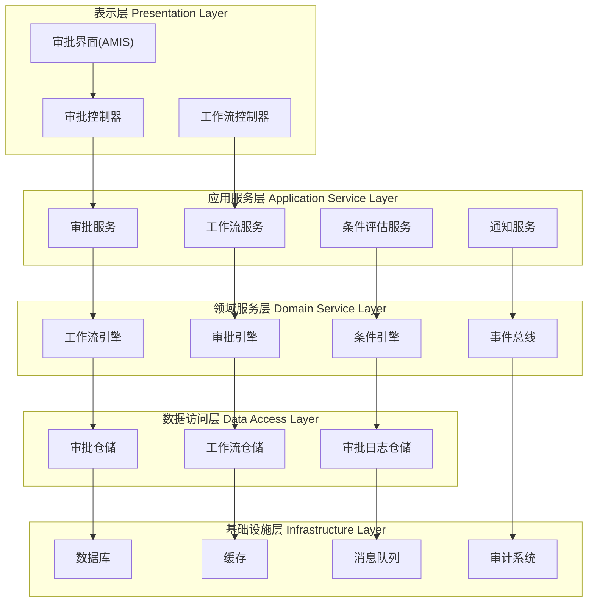

# CodeSpirit.Approval 审批模块实现方案

## 📋 目录

1. [概述](#概述)
2. [核心架构](#核心架构)
3. [核心模型设计](#核心模型设计)
4. [工作流引擎](#工作流引擎)
5. [核心服务接口](#核心服务接口)
6. [审批日志系统](#审批日志系统)
7. [集成方案](#集成方案)
8. [使用示例](#使用示例)
9. [扩展性设计](#扩展性设计)

## 概述

CodeSpirit.Approval 是一个轻量级、灵活的审批模块，支持复杂的审批流程管理。该模块基于 CodeSpirit 框架的统一架构设计，提供完整的审批流程解决方案。

### 核心特性

- 🔄 **灵活的工作流引擎** - 支持串行、并行、条件分支等复杂流程
- 👥 **多种审批模式** - 支持加签、会签、或签等场景
- 📋 **条件分支支持** - 基于业务规则的动态流程控制
- 📧 **抄送机制** - 灵活的消息通知和抄送功能
- 📊 **完整的审批日志** - 全程可追溯的操作记录
- 🏢 **多租户支持** - 完整的租户数据隔离
- ⚡ **高性能设计** - 异步处理和缓存优化
- 🔧 **易于集成** - 与现有 CodeSpirit 组件无缝集成

## 核心架构



## 核心模型设计

### 1. 工作流定义模型

```csharp
/// <summary>
/// 工作流定义
/// </summary>
public class WorkflowDefinition : AuditableEntityBase<long>, IMultiTenant
{
    /// <summary>
    /// 租户ID
    /// </summary>
    [Required]
    [StringLength(50)]
    public string TenantId { get; set; } = string.Empty;
    
    /// <summary>
    /// 工作流名称
    /// </summary>
    [Required]
    [StringLength(100)]
    [DisplayName("工作流名称")]
    public string Name { get; set; } = string.Empty;
    
    /// <summary>
    /// 工作流代码（唯一标识）
    /// </summary>
    [Required]
    [StringLength(50)]
    [DisplayName("工作流代码")]
    public string Code { get; set; } = string.Empty;
    
    /// <summary>
    /// 工作流描述
    /// </summary>
    [StringLength(500)]
    [DisplayName("描述")]
    public string Description { get; set; } = string.Empty;
    
    /// <summary>
    /// 工作流版本
    /// </summary>
    [Required]
    [DisplayName("版本")]
    public int Version { get; set; } = 1;
    
    /// <summary>
    /// 是否启用
    /// </summary>
    [DisplayName("是否启用")]
    public bool IsEnabled { get; set; } = true;
    
    /// <summary>
    /// 工作流配置（JSON格式）
    /// </summary>
    [Required]
    [DisplayName("工作流配置")]
    public string Configuration { get; set; } = string.Empty;
    
    /// <summary>
    /// 审批表单Schema（符合AMIS要求的JSON结构）
    /// </summary>
    [DisplayName("审批表单Schema")]
    public string? FormSchema { get; set; }
    
    /// <summary>
    /// 工作流节点集合
    /// </summary>
    public virtual ICollection<WorkflowNode> Nodes { get; set; } = new List<WorkflowNode>();
}

/// <summary>
/// 工作流节点
/// </summary>
public class WorkflowNode : EntityBase<long>
{
    /// <summary>
    /// 工作流定义ID
    /// </summary>
    [Required]
    [StringLength(50)]
    public string WorkflowDefinitionId { get; set; } = string.Empty;
    
    /// <summary>
    /// 节点名称
    /// </summary>
    [Required]
    [StringLength(100)]
    [DisplayName("节点名称")]
    public string Name { get; set; } = string.Empty;
    
    /// <summary>
    /// 节点类型
    /// </summary>
    [Required]
    [DisplayName("节点类型")]
    public WorkflowNodeType NodeType { get; set; }
    
    /// <summary>
    /// 审批模式
    /// </summary>
    [DisplayName("审批模式")]
    public ApprovalMode ApprovalMode { get; set; } = ApprovalMode.Sequential;
    
    /// <summary>
    /// 节点配置（JSON格式）
    /// </summary>
    [DisplayName("节点配置")]
    public string Configuration { get; set; } = string.Empty;
    
    /// <summary>
    /// 审批人配置
    /// </summary>
    public virtual ICollection<WorkflowNodeApprover> Approvers { get; set; } = new List<WorkflowNodeApprover>();
    
    /// <summary>
    /// 条件配置
    /// </summary>
    public virtual ICollection<WorkflowNodeCondition> Conditions { get; set; } = new List<WorkflowNodeCondition>();
    
    /// <summary>
    /// 工作流定义
    /// </summary>
    public virtual WorkflowDefinition WorkflowDefinition { get; set; } = null!;
}

/// <summary>
/// 工作流节点审批人
/// </summary>
public class WorkflowNodeApprover : EntityBase<long>
{
    /// <summary>
    /// 工作流节点ID
    /// </summary>
    [Required]
    [StringLength(50)]
    public string WorkflowNodeId { get; set; } = string.Empty;
    
    /// <summary>
    /// 审批人类型
    /// </summary>
    [Required]
    [DisplayName("审批人类型")]
    public ApproverType ApproverType { get; set; }
    
    /// <summary>
    /// 审批人值（用户ID、角色ID、部门ID等）
    /// </summary>
    [Required]
    [StringLength(50)]
    [DisplayName("审批人值")]
    public string ApproverValue { get; set; } = string.Empty;
    
    /// <summary>
    /// 审批人名称
    /// </summary>
    [StringLength(100)]
    [DisplayName("审批人名称")]
    public string ApproverName { get; set; } = string.Empty;
    
    
    /// <summary>
    /// 工作流节点
    /// </summary>
    public virtual WorkflowNode WorkflowNode { get; set; } = null!;
}
```

### 2. 审批实例模型

```csharp
/// <summary>
/// 审批实例
/// </summary>
public class ApprovalInstance : AuditableEntityBase<long>, IMultiTenant
{
    /// <summary>
    /// 租户ID
    /// </summary>
    [Required]
    [StringLength(50)]
    public string TenantId { get; set; } = string.Empty;
    
    /// <summary>
    /// 工作流定义ID
    /// </summary>
    [Required]
    [StringLength(50)]
    public string WorkflowDefinitionId { get; set; } = string.Empty;
    
    /// <summary>
    /// 审批标题
    /// </summary>
    [Required]
    [StringLength(200)]
    [DisplayName("审批标题")]
    public string Title { get; set; } = string.Empty;
    
    /// <summary>
    /// 业务实体类型（微服务名称.实体类型，如：ExamApi.ExamSession）
    /// </summary>
    [Required]
    [StringLength(100)]
    [DisplayName("业务实体类型")]
    public string EntityType { get; set; } = string.Empty;
    
    /// <summary>
    /// 业务实体ID
    /// </summary>
    [Required]
    [StringLength(50)]
    [DisplayName("业务实体ID")]
    public string EntityId { get; set; } = string.Empty;
    
    /// <summary>
    /// 申请人ID
    /// </summary>
    [Required]
    [StringLength(50)]
    [DisplayName("申请人ID")]
    public string ApplicantId { get; set; } = string.Empty;
    
    /// <summary>
    /// 申请人姓名
    /// </summary>
    [StringLength(100)]
    [DisplayName("申请人姓名")]
    public string ApplicantName { get; set; } = string.Empty;
    
    /// <summary>
    /// 当前状态
    /// </summary>
    [Required]
    [DisplayName("当前状态")]
    public ApprovalStatus Status { get; set; } = ApprovalStatus.Pending;
    
    /// <summary>
    /// 当前节点ID
    /// </summary>
    [DisplayName("当前节点ID")]
    public long? CurrentNodeId { get; set; }
    
    /// <summary>
    /// 申请时间
    /// </summary>
    [Required]
    [DisplayName("申请时间")]
    public DateTime ApplyTime { get; set; } = DateTime.UtcNow;
    
    /// <summary>
    /// 完成时间
    /// </summary>
    [DisplayName("完成时间")]
    public DateTime? CompletedTime { get; set; }
    
    /// <summary>
    /// 业务数据（JSON格式）
    /// </summary>
    [DisplayName("业务数据")]
    public string BusinessData { get; set; } = string.Empty;
    
    /// <summary>
    /// 风险评估结果（JSON格式）
    /// </summary>
    [DisplayName("风险评估结果")]
    public string? RiskAssessmentResult { get; set; }
    
    /// <summary>
    /// 智能审批建议（JSON格式）
    /// </summary>
    [DisplayName("智能审批建议")]
    public string? IntelligentSuggestion { get; set; }
    
    /// <summary>
    /// 审批任务集合
    /// </summary>
    public virtual ICollection<ApprovalTask> Tasks { get; set; } = new List<ApprovalTask>();
    
    /// <summary>
    /// 工作流定义
    /// </summary>
    public virtual WorkflowDefinition WorkflowDefinition { get; set; } = null!;
}

/// <summary>
/// 审批任务
/// </summary>
public class ApprovalTask : AuditableEntityBase<long>
{
    /// <summary>
    /// 审批实例ID
    /// </summary>
    [Required]
    public long ApprovalInstanceId { get; set; }
    
    /// <summary>
    /// 工作流节点ID
    /// </summary>
    [Required]
    public long WorkflowNodeId { get; set; }
    
    /// <summary>
    /// 审批人ID
    /// </summary>
    [Required]
    [StringLength(50)]
    [DisplayName("审批人ID")]
    public string ApproverId { get; set; } = string.Empty;
    
    /// <summary>
    /// 审批人姓名
    /// </summary>
    [StringLength(100)]
    [DisplayName("审批人姓名")]
    public string ApproverName { get; set; } = string.Empty;
    
    /// <summary>
    /// 任务状态
    /// </summary>
    [Required]
    [DisplayName("任务状态")]
    public TaskStatus Status { get; set; } = TaskStatus.Pending;
    
    /// <summary>
    /// 审批结果
    /// </summary>
    [DisplayName("审批结果")]
    public ApprovalResult? Result { get; set; }
    
    /// <summary>
    /// 审批意见
    /// </summary>
    [StringLength(1000)]
    [DisplayName("审批意见")]
    public string Comment { get; set; } = string.Empty;
    
    /// <summary>
    /// 分配时间
    /// </summary>
    [Required]
    [DisplayName("分配时间")]
    public DateTime AssignedTime { get; set; } = DateTime.UtcNow;
    
    /// <summary>
    /// 处理时间
    /// </summary>
    [DisplayName("处理时间")]
    public DateTime? ProcessedTime { get; set; }
    
    /// <summary>
    /// 是否为加签任务
    /// </summary>
    [DisplayName("是否为加签任务")]
    public bool IsAdditionalSign { get; set; } = false;
    
    /// <summary>
    /// 加签发起人ID
    /// </summary>
    [DisplayName("加签发起人ID")]
    public string? AdditionalSignInitiatorId { get; set; }
    
    /// <summary>
    /// 审批实例
    /// </summary>
    public virtual ApprovalInstance ApprovalInstance { get; set; } = null!;
}
```

### 3. 枚举定义

```csharp
/// <summary>
/// 工作流节点类型
/// </summary>
public enum WorkflowNodeType
{
    /// <summary>
    /// 开始节点
    /// </summary>
    [Description("开始节点")]
    Start = 1,
    
    /// <summary>
    /// 审批节点
    /// </summary>
    [Description("审批节点")]
    Approval = 2,
    
    /// <summary>
    /// 条件节点
    /// </summary>
    [Description("条件节点")]
    Condition = 3,
    
    /// <summary>
    /// 并行网关
    /// </summary>
    [Description("并行网关")]
    ParallelGateway = 4,
    
    /// <summary>
    /// 排他网关
    /// </summary>
    [Description("排他网关")]
    ExclusiveGateway = 5,
    
    /// <summary>
    /// 抄送节点
    /// </summary>
    [Description("抄送节点")]
    CarbonCopy = 6,
    
    /// <summary>
    /// 结束节点
    /// </summary>
    [Description("结束节点")]
    End = 7
}

/// <summary>
/// 审批模式
/// </summary>
public enum ApprovalMode
{
    /// <summary>
    /// 串行审批（依次审批）
    /// </summary>
    [Description("串行审批")]
    Sequential = 1,
    
    /// <summary>
    /// 并行审批（同时审批）
    /// </summary>
    [Description("并行审批")]
    Parallel = 2,
    
    /// <summary>
    /// 会签（所有人都需要审批）
    /// </summary>
    [Description("会签")]
    CounterSign = 3,
    
    /// <summary>
    /// 或签（任意一人审批即可）
    /// </summary>
    [Description("或签")]
    OrSign = 4
}

/// <summary>
/// 审批人类型
/// </summary>
public enum ApproverType
{
    /// <summary>
    /// 指定用户
    /// </summary>
    [Description("指定用户")]
    User = 1,
    
    /// <summary>
    /// 角色
    /// </summary>
    [Description("角色")]
    Role = 2,
    
    /// <summary>
    /// 部门
    /// </summary>
    [Description("部门")]
    Department = 3,
    
    /// <summary>
    /// 发起人
    /// </summary>
    [Description("发起人")]
    Initiator = 4,
    
    /// <summary>
    /// 发起人上级
    /// </summary>
    [Description("发起人上级")]
    InitiatorSuperior = 5,
    
    /// <summary>
    /// 动态表达式
    /// </summary>
    [Description("动态表达式")]
    Expression = 6
}

/// <summary>
/// 审批状态
/// </summary>
public enum ApprovalStatus
{
    /// <summary>
    /// 待审批
    /// </summary>
    [Description("待审批")]
    Pending = 1,
    
    /// <summary>
    /// 审批中
    /// </summary>
    [Description("审批中")]
    InProgress = 2,
    
    /// <summary>
    /// 已通过
    /// </summary>
    [Description("已通过")]
    Approved = 3,
    
    /// <summary>
    /// 已拒绝
    /// </summary>
    [Description("已拒绝")]
    Rejected = 4,
    
    /// <summary>
    /// 已撤回
    /// </summary>
    [Description("已撤回")]
    Withdrawn = 5,
    
    /// <summary>
    /// 已取消
    /// </summary>
    [Description("已取消")]
    Cancelled = 6
}

/// <summary>
/// 任务状态
/// </summary>
public enum TaskStatus
{
    /// <summary>
    /// 待处理
    /// </summary>
    [Description("待处理")]
    Pending = 1,
    
    /// <summary>
    /// 已完成
    /// </summary>
    [Description("已完成")]
    Completed = 2,
    
    /// <summary>
    /// 已跳过
    /// </summary>
    [Description("已跳过")]
    Skipped = 3,
    
    /// <summary>
    /// 已取消
    /// </summary>
    [Description("已取消")]
    Cancelled = 4
}

/// <summary>
/// 审批结果
/// </summary>
public enum ApprovalResult
{
    /// <summary>
    /// 同意
    /// </summary>
    [Description("同意")]
    Approve = 1,
    
    /// <summary>
    /// 拒绝
    /// </summary>
    [Description("拒绝")]
    Reject = 2,
    
    /// <summary>
    /// 转交
    /// </summary>
    [Description("转交")]
    Transfer = 3,
    
    /// <summary>
    /// 加签
    /// </summary>
    [Description("加签")]
    AdditionalSign = 4
}
```

## 工作流引擎

### 1. 工作流引擎接口

```csharp
/// <summary>
/// 工作流引擎接口
/// </summary>
public interface IWorkflowEngine
{
    /// <summary>
    /// 启动工作流
    /// </summary>
    /// <param name="workflowCode">工作流代码</param>
    /// <param name="entityType">业务实体类型</param>
    /// <param name="entityId">业务实体ID</param>
    /// <param name="applicantId">申请人ID</param>
    /// <param name="title">审批标题</param>
    /// <param name="businessData">业务数据</param>
    /// <param name="tenantId">租户ID</param>
    /// <returns>审批实例</returns>
    Task<ApprovalInstance> StartWorkflowAsync(
        string workflowCode,
        string entityType,
        string entityId,
        string applicantId,
        string title,
        object? businessData = null,
        string? tenantId = null);
    
    /// <summary>
    /// 处理审批任务
    /// </summary>
    /// <param name="taskId">任务ID</param>
    /// <param name="approverId">审批人ID</param>
    /// <param name="result">审批结果</param>
    /// <param name="comment">审批意见</param>
    /// <returns>处理结果</returns>
    Task<WorkflowProcessResult> ProcessTaskAsync(
        string taskId,
        string approverId,
        ApprovalResult result,
        string comment = "");
    
    /// <summary>
    /// 加签
    /// </summary>
    /// <param name="taskId">当前任务ID</param>
    /// <param name="approverId">加签人ID</param>
    /// <param name="comment">加签理由</param>
    /// <returns>加签结果</returns>
    Task<ApprovalTask> AddSignAsync(
        string taskId,
        string approverId,
        string comment = "");
    
    /// <summary>
    /// 转交任务
    /// </summary>
    /// <param name="taskId">任务ID</param>
    /// <param name="fromUserId">转交人ID</param>
    /// <param name="toUserId">接收人ID</param>
    /// <param name="comment">转交理由</param>
    /// <returns>转交结果</returns>
    Task<ApprovalTask> TransferTaskAsync(
        string taskId,
        string fromUserId,
        string toUserId,
        string comment = "");
    
    /// <summary>
    /// 撤回审批
    /// </summary>
    /// <param name="instanceId">审批实例ID</param>
    /// <param name="applicantId">申请人ID</param>
    /// <param name="reason">撤回理由</param>
    /// <returns>撤回结果</returns>
    Task<bool> WithdrawAsync(
        string instanceId,
        string applicantId,
        string reason = "");
    
    /// <summary>
    /// 获取用户待办任务
    /// </summary>
    /// <param name="userId">用户ID</param>
    /// <param name="tenantId">租户ID</param>
    /// <returns>待办任务列表</returns>
    Task<List<ApprovalTask>> GetPendingTasksAsync(
        string userId,
        string? tenantId = null);
    
    /// <summary>
    /// 获取审批实例详情
    /// </summary>
    /// <param name="instanceId">实例ID</param>
    /// <returns>审批实例</returns>
    Task<ApprovalInstance?> GetInstanceAsync(string instanceId);
}

/// <summary>
/// 工作流处理结果
/// </summary>
public class WorkflowProcessResult
{
    /// <summary>
    /// 是否成功
    /// </summary>
    public bool Success { get; set; }
    
    /// <summary>
    /// 消息
    /// </summary>
    public string Message { get; set; } = string.Empty;
    
    /// <summary>
    /// 审批实例
    /// </summary>
    public ApprovalInstance? Instance { get; set; }
    
    /// <summary>
    /// 下一步任务
    /// </summary>
    public List<ApprovalTask> NextTasks { get; set; } = new();
}
```

### 2. 条件引擎接口

```csharp
/// <summary>
/// 条件引擎接口
/// </summary>
public interface IConditionEngine
{
    /// <summary>
    /// 评估条件表达式
    /// </summary>
    /// <param name="expression">条件表达式</param>
    /// <param name="context">上下文数据</param>
    /// <returns>评估结果</returns>
    Task<bool> EvaluateAsync(string expression, Dictionary<string, object> context);
    
    /// <summary>
    /// 获取下一个节点
    /// </summary>
    /// <param name="currentNodeId">当前节点ID</param>
    /// <param name="context">上下文数据</param>
    /// <returns>下一个节点列表</returns>
    Task<List<WorkflowNode>> GetNextNodesAsync(string currentNodeId, Dictionary<string, object> context);
    
    /// <summary>
    /// 解析审批人
    /// </summary>
    /// <param name="approverConfig">审批人配置</param>
    /// <param name="context">上下文数据</param>
    /// <returns>审批人列表</returns>
    Task<List<string>> ResolveApproversAsync(WorkflowNodeApprover approverConfig, Dictionary<string, object> context);
}

/// <summary>
/// 智能审批服务接口
/// </summary>
public interface IIntelligentApprovalService : IScopedDependency
{
    /// <summary>
    /// 风险识别
    /// </summary>
    /// <param name="instanceId">审批实例ID</param>
    /// <param name="businessData">业务数据</param>
    /// <param name="workflowCode">工作流代码</param>
    /// <returns>风险评估结果</returns>
    Task<RiskAssessmentResult> AssessRiskAsync(long instanceId, object businessData, string workflowCode);
    
    /// <summary>
    /// 智能审批建议
    /// </summary>
    /// <param name="instanceId">审批实例ID</param>
    /// <param name="taskId">任务ID</param>
    /// <param name="businessData">业务数据</param>
    /// <param name="historicalData">历史审批数据</param>
    /// <returns>智能审批建议</returns>
    Task<IntelligentApprovalSuggestion> GetApprovalSuggestionAsync(
        long instanceId, 
        long taskId, 
        object businessData, 
        List<ApprovalHistoryData> historicalData);
    
    /// <summary>
    /// 异常检测
    /// </summary>
    /// <param name="businessData">业务数据</param>
    /// <param name="entityType">业务实体类型</param>
    /// <returns>异常检测结果</returns>
    Task<AnomalyDetectionResult> DetectAnomaliesAsync(object businessData, string entityType);
    
    /// <summary>
    /// 合规性检查
    /// </summary>
    /// <param name="businessData">业务数据</param>
    /// <param name="workflowCode">工作流代码</param>
    /// <returns>合规性检查结果</returns>
    Task<ComplianceCheckResult> CheckComplianceAsync(object businessData, string workflowCode);
}

/// <summary>
/// 风险评估结果
/// </summary>
public class RiskAssessmentResult
{
    /// <summary>
    /// 风险等级
    /// </summary>
    [DisplayName("风险等级")]
    public RiskLevel RiskLevel { get; set; } = RiskLevel.Low;
    
    /// <summary>
    /// 风险分数（0-100）
    /// </summary>
    [DisplayName("风险分数")]
    public int RiskScore { get; set; }
    
    /// <summary>
    /// 风险因子列表
    /// </summary>
    [DisplayName("风险因子")]
    public List<RiskFactor> RiskFactors { get; set; } = new();
    
    /// <summary>
    /// 风险描述
    /// </summary>
    [DisplayName("风险描述")]
    public string Description { get; set; } = string.Empty;
    
    /// <summary>
    /// 建议措施
    /// </summary>
    [DisplayName("建议措施")]
    public List<string> Recommendations { get; set; } = new();
    
    /// <summary>
    /// 评估时间
    /// </summary>
    [DisplayName("评估时间")]
    public DateTime AssessmentTime { get; set; } = DateTime.UtcNow;
}

/// <summary>
/// 智能审批建议
/// </summary>
public class IntelligentApprovalSuggestion
{
    /// <summary>
    /// 建议结果
    /// </summary>
    [DisplayName("建议结果")]
    public ApprovalResult SuggestedResult { get; set; }
    
    /// <summary>
    /// 置信度（0-1）
    /// </summary>
    [DisplayName("置信度")]
    public double Confidence { get; set; }
    
    /// <summary>
    /// 建议理由
    /// </summary>
    [DisplayName("建议理由")]
    public string Reasoning { get; set; } = string.Empty;
    
    /// <summary>
    /// 参考案例
    /// </summary>
    [DisplayName("参考案例")]
    public List<SimilarCase> SimilarCases { get; set; } = new();
    
    /// <summary>
    /// 关键指标分析
    /// </summary>
    [DisplayName("关键指标分析")]
    public Dictionary<string, object> KeyMetrics { get; set; } = new();
    
    /// <summary>
    /// 生成时间
    /// </summary>
    [DisplayName("生成时间")]
    public DateTime GeneratedTime { get; set; } = DateTime.UtcNow;
}

/// <summary>
/// 风险等级
/// </summary>
public enum RiskLevel
{
    /// <summary>
    /// 低风险
    /// </summary>
    [Display(Name = "低风险")]
    Low = 1,
    
    /// <summary>
    /// 中风险
    /// </summary>
    [Display(Name = "中风险")]
    Medium = 2,
    
    /// <summary>
    /// 高风险
    /// </summary>
    [Display(Name = "高风险")]
    High = 3,
    
    /// <summary>
    /// 极高风险
    /// </summary>
    [Display(Name = "极高风险")]
    Critical = 4
}

/// <summary>
/// 风险因子
/// </summary>
public class RiskFactor
{
    /// <summary>
    /// 因子名称
    /// </summary>
    [DisplayName("因子名称")]
    public string Name { get; set; } = string.Empty;
    
    /// <summary>
    /// 因子类型
    /// </summary>
    [DisplayName("因子类型")]
    public string Type { get; set; } = string.Empty;
    
    /// <summary>
    /// 风险值
    /// </summary>
    [DisplayName("风险值")]
    public double Value { get; set; }
    
    /// <summary>
    /// 权重
    /// </summary>
    [DisplayName("权重")]
    public double Weight { get; set; }
    
    /// <summary>
    /// 描述
    /// </summary>
    [DisplayName("描述")]
    public string Description { get; set; } = string.Empty;
}

/// <summary>
/// 相似案例
/// </summary>
public class SimilarCase
{
    /// <summary>
    /// 案例ID
    /// </summary>
    [DisplayName("案例ID")]
    public long CaseId { get; set; }
    
    /// <summary>
    /// 相似度
    /// </summary>
    [DisplayName("相似度")]
    public double Similarity { get; set; }
    
    /// <summary>
    /// 案例结果
    /// </summary>
    [DisplayName("案例结果")]
    public ApprovalResult Result { get; set; }
    
    /// <summary>
    /// 案例描述
    /// </summary>
    [DisplayName("案例描述")]
    public string Description { get; set; } = string.Empty;
}

/// <summary>
/// 异常检测结果
/// </summary>
public class AnomalyDetectionResult
{
    /// <summary>
    /// 是否存在异常
    /// </summary>
    [DisplayName("是否存在异常")]
    public bool HasAnomalies { get; set; }
    
    /// <summary>
    /// 异常列表
    /// </summary>
    [DisplayName("异常列表")]
    public List<Anomaly> Anomalies { get; set; } = new();
    
    /// <summary>
    /// 异常分数
    /// </summary>
    [DisplayName("异常分数")]
    public double AnomalyScore { get; set; }
}

/// <summary>
/// 异常信息
/// </summary>
public class Anomaly
{
    /// <summary>
    /// 异常类型
    /// </summary>
    [DisplayName("异常类型")]
    public string Type { get; set; } = string.Empty;
    
    /// <summary>
    /// 异常字段
    /// </summary>
    [DisplayName("异常字段")]
    public string Field { get; set; } = string.Empty;
    
    /// <summary>
    /// 异常值
    /// </summary>
    [DisplayName("异常值")]
    public object Value { get; set; } = new();
    
    /// <summary>
    /// 期望值
    /// </summary>
    [DisplayName("期望值")]
    public object ExpectedValue { get; set; } = new();
    
    /// <summary>
    /// 异常描述
    /// </summary>
    [DisplayName("异常描述")]
    public string Description { get; set; } = string.Empty;
}

/// <summary>
/// 合规性检查结果
/// </summary>
public class ComplianceCheckResult
{
    /// <summary>
    /// 是否合规
    /// </summary>
    [DisplayName("是否合规")]
    public bool IsCompliant { get; set; }
    
    /// <summary>
    /// 违规项列表
    /// </summary>
    [DisplayName("违规项列表")]
    public List<ComplianceViolation> Violations { get; set; } = new();
    
    /// <summary>
    /// 合规分数
    /// </summary>
    [DisplayName("合规分数")]
    public double ComplianceScore { get; set; }
}

/// <summary>
/// 违规项
/// </summary>
public class ComplianceViolation
{
    /// <summary>
    /// 规则名称
    /// </summary>
    [DisplayName("规则名称")]
    public string RuleName { get; set; } = string.Empty;
    
    /// <summary>
    /// 违规描述
    /// </summary>
    [DisplayName("违规描述")]
    public string Description { get; set; } = string.Empty;
    
    /// <summary>
    /// 严重程度
    /// </summary>
    [DisplayName("严重程度")]
    public ComplianceSeverity Severity { get; set; }
}

/// <summary>
/// 合规严重程度
/// </summary>
public enum ComplianceSeverity
{
    /// <summary>
    /// 信息
    /// </summary>
    [Display(Name = "信息")]
    Info = 1,
    
    /// <summary>
    /// 警告
    /// </summary>
    [Display(Name = "警告")]
    Warning = 2,
    
    /// <summary>
    /// 错误
    /// </summary>
    [Display(Name = "错误")]
    Error = 3,
    
    /// <summary>
    /// 严重错误
    /// </summary>
    [Display(Name = "严重错误")]
    Critical = 4
}

/// <summary>
/// 审批历史数据
/// </summary>
public class ApprovalHistoryData
{
    /// <summary>
    /// 实例ID
    /// </summary>
    public long InstanceId { get; set; }
    
    /// <summary>
    /// 业务数据
    /// </summary>
    public object BusinessData { get; set; } = new();
    
    /// <summary>
    /// 审批结果
    /// </summary>
    public ApprovalStatus Result { get; set; }
    
    /// <summary>
    /// 处理时间
    /// </summary>
    public DateTime ProcessedTime { get; set; }
    
    /// <summary>
    /// 审批人ID
    /// </summary>
    public string ApproverId { get; set; } = string.Empty;
}
```

## 核心服务接口

### 1. 审批服务接口

```csharp
/// <summary>
/// 审批服务接口
/// </summary>
public interface IApprovalService : IScopedDependency
{
    /// <summary>
    /// 发起审批
    /// </summary>
    /// <param name="request">审批请求</param>
    /// <returns>审批实例</returns>
    Task<ApprovalInstance> StartApprovalAsync(StartApprovalRequest request);
    
    /// <summary>
    /// 审批任务
    /// </summary>
    /// <param name="request">审批请求</param>
    /// <returns>审批结果</returns>
    Task<ApprovalResult> ApproveTaskAsync(ApproveTaskRequest request);
    
    /// <summary>
    /// 获取我的待办
    /// </summary>
    /// <param name="userId">用户ID</param>
    /// <param name="pageIndex">页码</param>
    /// <param name="pageSize">页大小</param>
    /// <returns>待办任务分页列表</returns>
    Task<PagedList<ApprovalTaskDto>> GetMyPendingTasksAsync(string userId, int pageIndex = 1, int pageSize = 20);
    
    /// <summary>
    /// 获取我的已办
    /// </summary>
    /// <param name="userId">用户ID</param>
    /// <param name="pageIndex">页码</param>
    /// <param name="pageSize">页大小</param>
    /// <returns>已办任务分页列表</returns>
    Task<PagedList<ApprovalTaskDto>> GetMyCompletedTasksAsync(string userId, int pageIndex = 1, int pageSize = 20);
    
    /// <summary>
    /// 获取我发起的审批
    /// </summary>
    /// <param name="applicantId">申请人ID</param>
    /// <param name="pageIndex">页码</param>
    /// <param name="pageSize">页大小</param>
    /// <returns>审批实例分页列表</returns>
    Task<PagedList<ApprovalInstanceDto>> GetMyApplicationsAsync(string applicantId, int pageIndex = 1, int pageSize = 20);
    
    /// <summary>
    /// 获取审批详情
    /// </summary>
    /// <param name="instanceId">实例ID</param>
    /// <returns>审批详情</returns>
    Task<ApprovalInstanceDetailDto?> GetApprovalDetailAsync(long instanceId);
    
    /// <summary>
    /// 获取智能审批建议
    /// </summary>
    /// <param name="taskId">任务ID</param>
    /// <returns>智能审批建议</returns>
    Task<IntelligentApprovalSuggestion> GetIntelligentSuggestionAsync(long taskId);
    
    /// <summary>
    /// 获取风险评估结果
    /// </summary>
    /// <param name="instanceId">实例ID</param>
    /// <returns>风险评估结果</returns>
    Task<RiskAssessmentResult> GetRiskAssessmentAsync(long instanceId);
    
    /// <summary>
    /// 撤回审批
    /// </summary>
    /// <param name="instanceId">实例ID</param>
    /// <param name="applicantId">申请人ID</param>
    /// <param name="reason">撤回理由</param>
    /// <returns>撤回结果</returns>
    Task<bool> WithdrawApprovalAsync(long instanceId, string applicantId, string reason);
}

/// <summary>
/// 发起审批请求
/// </summary>
public class StartApprovalRequest
{
    /// <summary>
    /// 工作流代码
    /// </summary>
    [Required]
    public string WorkflowCode { get; set; } = string.Empty;
    
    /// <summary>
    /// 业务实体类型
    /// </summary>
    [Required]
    public string EntityType { get; set; } = string.Empty;
    
    /// <summary>
    /// 业务实体ID
    /// </summary>
    [Required]
    public string EntityId { get; set; } = string.Empty;
    
    /// <summary>
    /// 审批标题
    /// </summary>
    [Required]
    public string Title { get; set; } = string.Empty;
    
    /// <summary>
    /// 业务数据
    /// </summary>
    public object? BusinessData { get; set; }
}

/// <summary>
/// 审批任务请求
/// </summary>
public class ApproveTaskRequest
{
    /// <summary>
    /// 任务ID
    /// </summary>
    [Required]
    public string TaskId { get; set; } = string.Empty;
    
    /// <summary>
    /// 审批结果
    /// </summary>
    [Required]
    public ApprovalResult Result { get; set; }
    
    /// <summary>
    /// 审批意见
    /// </summary>
    public string Comment { get; set; } = string.Empty;
    
    /// <summary>
    /// 转交目标用户ID（当结果为转交时）
    /// </summary>
    public string? TransferToUserId { get; set; }
    
    /// <summary>
    /// 加签用户ID（当结果为加签时）
    /// </summary>
    public string? AdditionalSignUserId { get; set; }
}
```

### 2. 工作流管理服务接口

```csharp
/// <summary>
/// 工作流管理服务接口
/// </summary>
public interface IWorkflowManagementService : IScopedDependency
{
    /// <summary>
    /// 创建工作流定义
    /// </summary>
    /// <param name="request">创建请求</param>
    /// <returns>工作流定义</returns>
    Task<WorkflowDefinition> CreateWorkflowAsync(CreateWorkflowRequest request);
    
    /// <summary>
    /// 更新工作流定义
    /// </summary>
    /// <param name="id">工作流ID</param>
    /// <param name="request">更新请求</param>
    /// <returns>工作流定义</returns>
    Task<WorkflowDefinition> UpdateWorkflowAsync(string id, UpdateWorkflowRequest request);
    
    /// <summary>
    /// 删除工作流定义
    /// </summary>
    /// <param name="id">工作流ID</param>
    /// <returns>删除结果</returns>
    Task<bool> DeleteWorkflowAsync(string id);
    
    /// <summary>
    /// 启用/禁用工作流
    /// </summary>
    /// <param name="id">工作流ID</param>
    /// <param name="enabled">是否启用</param>
    /// <returns>操作结果</returns>
    Task<bool> SetWorkflowEnabledAsync(string id, bool enabled);
    
    /// <summary>
    /// 获取工作流定义列表
    /// </summary>
    /// <param name="query">查询条件</param>
    /// <returns>工作流定义分页列表</returns>
    Task<PagedList<WorkflowDefinitionDto>> GetWorkflowsAsync(WorkflowQueryDto query);
    
    /// <summary>
    /// 获取工作流定义详情
    /// </summary>
    /// <param name="id">工作流ID</param>
    /// <returns>工作流定义详情</returns>
    Task<WorkflowDefinitionDetailDto?> GetWorkflowDetailAsync(string id);
    
    /// <summary>
    /// 复制工作流定义
    /// </summary>
    /// <param name="sourceId">源工作流ID</param>
    /// <param name="newName">新工作流名称</param>
    /// <param name="newCode">新工作流代码</param>
    /// <returns>新工作流定义</returns>
    Task<WorkflowDefinition> CopyWorkflowAsync(string sourceId, string newName, string newCode);
}
```

## 审批日志系统

### 1. 审批日志模型

```csharp
/// <summary>
/// 审批日志
/// </summary>
public class ApprovalLog : EntityBase<string>, IMultiTenant
{
    /// <summary>
    /// 租户ID
    /// </summary>
    [Required]
    [StringLength(50)]
    public string TenantId { get; set; } = string.Empty;
    
    /// <summary>
    /// 审批实例ID
    /// </summary>
    [Required]
    [StringLength(50)]
    public string ApprovalInstanceId { get; set; } = string.Empty;
    
    /// <summary>
    /// 任务ID（可选）
    /// </summary>
    [StringLength(50)]
    public string? TaskId { get; set; }
    
    /// <summary>
    /// 操作类型
    /// </summary>
    [Required]
    [DisplayName("操作类型")]
    public ApprovalLogType LogType { get; set; }
    
    /// <summary>
    /// 操作人ID
    /// </summary>
    [Required]
    [StringLength(50)]
    [DisplayName("操作人ID")]
    public string OperatorId { get; set; } = string.Empty;
    
    /// <summary>
    /// 操作人姓名
    /// </summary>
    [StringLength(100)]
    [DisplayName("操作人姓名")]
    public string OperatorName { get; set; } = string.Empty;
    
    /// <summary>
    /// 操作时间
    /// </summary>
    [Required]
    [DisplayName("操作时间")]
    public DateTime OperationTime { get; set; } = DateTime.UtcNow;
    
    /// <summary>
    /// 操作结果
    /// </summary>
    [DisplayName("操作结果")]
    public ApprovalResult? Result { get; set; }
    
    /// <summary>
    /// 操作内容/意见
    /// </summary>
    [StringLength(1000)]
    [DisplayName("操作内容")]
    public string Content { get; set; } = string.Empty;
    
    /// <summary>
    /// 扩展数据（JSON格式）
    /// </summary>
    [DisplayName("扩展数据")]
    public string ExtensionData { get; set; } = string.Empty;
    
    /// <summary>
    /// IP地址
    /// </summary>
    [StringLength(45)]
    [DisplayName("IP地址")]
    public string IpAddress { get; set; } = string.Empty;
    
    /// <summary>
    /// 用户代理
    /// </summary>
    [StringLength(500)]
    [DisplayName("用户代理")]
    public string UserAgent { get; set; } = string.Empty;
}

/// <summary>
/// 审批日志类型
/// </summary>
public enum ApprovalLogType
{
    /// <summary>
    /// 发起审批
    /// </summary>
    [Description("发起审批")]
    Start = 1,
    
    /// <summary>
    /// 审批通过
    /// </summary>
    [Description("审批通过")]
    Approve = 2,
    
    /// <summary>
    /// 审批拒绝
    /// </summary>
    [Description("审批拒绝")]
    Reject = 3,
    
    /// <summary>
    /// 转交任务
    /// </summary>
    [Description("转交任务")]
    Transfer = 4,
    
    /// <summary>
    /// 加签
    /// </summary>
    [Description("加签")]
    AdditionalSign = 5,
    
    /// <summary>
    /// 撤回审批
    /// </summary>
    [Description("撤回审批")]
    Withdraw = 6,
    
    /// <summary>
    /// 取消审批
    /// </summary>
    [Description("取消审批")]
    Cancel = 7,
    
    /// <summary>
    /// 系统自动处理
    /// </summary>
    [Description("系统自动处理")]
    System = 8
}
```

### 2. 审批日志服务

```csharp
/// <summary>
/// 审批日志服务接口
/// </summary>
public interface IApprovalLogService : IScopedDependency
{
    /// <summary>
    /// 记录审批日志
    /// </summary>
    /// <param name="log">审批日志</param>
    /// <returns>记录结果</returns>
    Task<bool> LogAsync(ApprovalLog log);
    
    /// <summary>
    /// 批量记录审批日志
    /// </summary>
    /// <param name="logs">审批日志列表</param>
    /// <returns>记录结果</returns>
    Task<bool> LogBatchAsync(List<ApprovalLog> logs);
    
    /// <summary>
    /// 获取审批日志
    /// </summary>
    /// <param name="instanceId">审批实例ID</param>
    /// <returns>审批日志列表</returns>
    Task<List<ApprovalLogDto>> GetLogsAsync(string instanceId);
    
    /// <summary>
    /// 获取用户操作日志
    /// </summary>
    /// <param name="userId">用户ID</param>
    /// <param name="pageIndex">页码</param>
    /// <param name="pageSize">页大小</param>
    /// <returns>操作日志分页列表</returns>
    Task<PagedList<ApprovalLogDto>> GetUserLogsAsync(string userId, int pageIndex = 1, int pageSize = 20);
}
```

## 集成方案

### 1. 与现有组件集成

```csharp
/// <summary>
/// 审批模块服务注册扩展
/// </summary>
public static class ApprovalServiceCollectionExtensions
{
    /// <summary>
    /// 添加审批服务
    /// </summary>
    /// <param name="services">服务集合</param>
    /// <param name="configuration">配置</param>
    /// <returns>服务集合</returns>
    public static IServiceCollection AddApprovalServices(
        this IServiceCollection services,
        IConfiguration configuration)
    {
        // 注册配置
        services.Configure<ApprovalOptions>(configuration.GetSection("Approval"));
        
        // 注册核心服务
        services.AddScoped<IApprovalService, ApprovalService>();
        services.AddScoped<IWorkflowManagementService, WorkflowManagementService>();
        services.AddScoped<IWorkflowEngine, WorkflowEngine>();
        services.AddScoped<IConditionEngine, ConditionEngine>();
        services.AddScoped<IApprovalLogService, ApprovalLogService>();
        
        // 注册仓储
        services.AddScoped<IApprovalRepository, ApprovalRepository>();
        services.AddScoped<IWorkflowRepository, WorkflowRepository>();
        services.AddScoped<IApprovalLogRepository, ApprovalLogRepository>();
        
        // 注册LLM智能审批服务
        services.AddScoped<IIntelligentApprovalService, IntelligentApprovalService>();
        
        // 集成审计组件
        services.AddAuditServices(configuration);
        
        // 集成事件总线
        services.AddEventBus(configuration);
        
        // 集成LLM服务（基于CodeSpirit.LLM）
        services.AddLLMServices(configuration);
        
        // 集成缓存
        services.AddMemoryCache();
        services.AddStackExchangeRedisCache(options =>
        {
            options.Configuration = configuration.GetConnectionString("Redis");
        });
        
        return services;
    }
}

/// <summary>
/// 审批配置选项
/// </summary>
public class ApprovalOptions
{
    /// <summary>
    /// 是否启用
    /// </summary>
    public bool Enabled { get; set; } = true;
    
    /// <summary>
    /// 默认超时时间（小时）
    /// </summary>
    public int DefaultTimeoutHours { get; set; } = 72;
    
    /// <summary>
    /// 是否启用自动提醒
    /// </summary>
    public bool EnableAutoReminder { get; set; } = true;
    
    /// <summary>
    /// 提醒间隔（小时）
    /// </summary>
    public int ReminderIntervalHours { get; set; } = 24;
    
    /// <summary>
    /// 是否启用审批日志
    /// </summary>
    public bool EnableApprovalLog { get; set; } = true;
    
    /// <summary>
    /// 缓存配置
    /// </summary>
    public CacheOptions Cache { get; set; } = new();
    
    /// <summary>
    /// 通知配置
    /// </summary>
    public NotificationOptions Notification { get; set; } = new();
}
```

### 2. 微服务事件集成

基于 `TenantAwareEventBus` 实现跨微服务的事件通信，确保业务数据更新通过事件订阅处理。

```csharp
/// <summary>
/// 审批事件基类（租户感知）
/// </summary>
public abstract class ApprovalEvent : TenantAwareEventBase
{
    /// <summary>
    /// 审批实例ID
    /// </summary>
    public string InstanceId { get; set; } = string.Empty;
    
    /// <summary>
    /// 业务实体类型（微服务名称.实体类型）
    /// </summary>
    public string EntityType { get; set; } = string.Empty;
    
    /// <summary>
    /// 业务实体ID
    /// </summary>
    public string EntityId { get; set; } = string.Empty;
}

/// <summary>
/// 审批启动事件
/// </summary>
public class ApprovalStartedEvent : ApprovalEvent
{
    /// <summary>
    /// 申请人ID
    /// </summary>
    public string ApplicantId { get; set; } = string.Empty;
    
    /// <summary>
    /// 工作流代码
    /// </summary>
    public string WorkflowCode { get; set; } = string.Empty;
    
    /// <summary>
    /// 审批标题
    /// </summary>
    public string Title { get; set; } = string.Empty;
    
    /// <summary>
    /// 业务数据快照
    /// </summary>
    public string BusinessDataSnapshot { get; set; } = string.Empty;
}

/// <summary>
/// 审批完成事件
/// </summary>
public class ApprovalCompletedEvent : ApprovalEvent
{
    /// <summary>
    /// 审批结果
    /// </summary>
    public ApprovalStatus Result { get; set; }
    
    /// <summary>
    /// 完成时间
    /// </summary>
    public DateTime CompletedTime { get; set; }
    
    /// <summary>
    /// 最终审批意见
    /// </summary>
    public string FinalComment { get; set; } = string.Empty;
}

/// <summary>
/// 任务分配事件
/// </summary>
public class TaskAssignedEvent : ApprovalEvent
{
    /// <summary>
    /// 任务ID
    /// </summary>
    public string TaskId { get; set; } = string.Empty;
    
    /// <summary>
    /// 审批人ID
    /// </summary>
    public string ApproverId { get; set; } = string.Empty;
    
    /// <summary>
    /// 节点名称
    /// </summary>
    public string NodeName { get; set; } = string.Empty;
    
    /// <summary>
    /// 分配时间
    /// </summary>
    public DateTime AssignedTime { get; set; } = DateTime.UtcNow;
}

/// <summary>
/// 业务数据状态更新事件（由业务微服务发布）
/// </summary>
public class BusinessDataStatusChangedEvent : TenantAwareEventBase
{
    /// <summary>
    /// 业务实体类型
    /// </summary>
    public string EntityType { get; set; } = string.Empty;
    
    /// <summary>
    /// 业务实体ID
    /// </summary>
    public string EntityId { get; set; } = string.Empty;
    
    /// <summary>
    /// 新状态
    /// </summary>
    public string NewStatus { get; set; } = string.Empty;
    
    /// <summary>
    /// 更新的业务数据
    /// </summary>
    public string UpdatedBusinessData { get; set; } = string.Empty;
    
    /// <summary>
    /// 更新原因
    /// </summary>
    public string UpdateReason { get; set; } = string.Empty;
}
```

#### 事件处理器示例

```csharp
/// <summary>
/// 审批完成事件处理器（在业务微服务中实现）
/// </summary>
public class ApprovalCompletedEventHandler : ITenantAwareEventHandler<ApprovalCompletedEvent>
{
    private readonly IExamSessionService _examSessionService;
    private readonly ILogger<ApprovalCompletedEventHandler> _logger;
    
    public ApprovalCompletedEventHandler(
        IExamSessionService examSessionService,
        ILogger<ApprovalCompletedEventHandler> logger)
    {
        _examSessionService = examSessionService;
        _logger = logger;
    }
    
    public async Task HandleAsync(ApprovalCompletedEvent @event)
    {
        try
        {
            // 根据业务实体类型处理不同的业务逻辑
            if (@event.EntityType == "ExamApi.ExamSession")
            {
                await HandleExamSessionApprovalAsync(@event);
            }
            else if (@event.EntityType == "ExamApi.ExamPlan")
            {
                await HandleExamPlanApprovalAsync(@event);
            }
            
            _logger.LogInformation("审批完成事件处理成功: {EntityType}-{EntityId}, 结果: {Result}", 
                @event.EntityType, @event.EntityId, @event.Result);
        }
        catch (Exception ex)
        {
            _logger.LogError(ex, "处理审批完成事件失败: {EntityType}-{EntityId}", 
                @event.EntityType, @event.EntityId);
            throw;
        }
    }
    
    private async Task HandleExamSessionApprovalAsync(ApprovalCompletedEvent @event)
    {
        var examSession = await _examSessionService.GetByIdAsync(@event.EntityId);
        if (examSession == null) return;
        
        // 根据审批结果更新考试会话状态
        switch (@event.Result)
        {
            case ApprovalStatus.Approved:
                examSession.Status = ExamSessionStatus.Approved;
                examSession.ApprovedTime = @event.CompletedTime;
                break;
            case ApprovalStatus.Rejected:
                examSession.Status = ExamSessionStatus.Rejected;
                examSession.RejectedTime = @event.CompletedTime;
                examSession.RejectionReason = @event.FinalComment;
                break;
        }
        
        await _examSessionService.UpdateAsync(examSession);
    }
}

/// <summary>
/// 业务数据状态变更事件处理器（在审批微服务中实现）
/// </summary>
public class BusinessDataStatusChangedEventHandler : ITenantAwareEventHandler<BusinessDataStatusChangedEvent>
{
    private readonly IApprovalService _approvalService;
    private readonly ILogger<BusinessDataStatusChangedEventHandler> _logger;
    
    public BusinessDataStatusChangedEventHandler(
        IApprovalService approvalService,
        ILogger<BusinessDataStatusChangedEventHandler> logger)
    {
        _approvalService = approvalService;
        _logger = logger;
    }
    
    public async Task HandleAsync(BusinessDataStatusChangedEvent @event)
    {
        try
        {
            // 查找相关的审批实例
            var instances = await _approvalService.GetApprovalsByEntityAsync(@event.EntityType, @event.EntityId);
            
            foreach (var instance in instances.Where(i => i.Status == ApprovalStatus.InProgress))
            {
                // 更新审批实例的业务数据快照
                instance.BusinessData = @event.UpdatedBusinessData;
                await _approvalService.UpdateInstanceAsync(instance);
                
                _logger.LogInformation("已同步业务数据到审批实例: {InstanceId}", instance.Id);
            }
        }
        catch (Exception ex)
        {
            _logger.LogError(ex, "处理业务数据状态变更事件失败: {EntityType}-{EntityId}", 
                @event.EntityType, @event.EntityId);
            throw;
        }
    }
}
```

### 3. 审批表单Schema设计

为了与AMIS前端框架无缝集成，工作流定义支持审批表单Schema配置：

```csharp
/// <summary>
/// 审批表单Schema示例
/// </summary>
public class ApprovalFormSchemaExample
{
    /// <summary>
    /// 请假申请表单Schema
    /// </summary>
    public static string LeaveApplicationFormSchema = JsonSerializer.Serialize(new
    {
        type = "form",
        title = "请假申请审批",
        body = new object[]
        {
            new
            {
                type = "static",
                name = "applicantInfo",
                label = "申请人信息",
                value = "${applicantName} (${applicantId})"
            },
            new
            {
                type = "static",
                name = "applyTime",
                label = "申请时间",
                value = "${applyTime|date:YYYY-MM-DD HH:mm:ss}"
            },
            new
            {
                type = "divider"
            },
            new
            {
                type = "static",
                name = "leaveType",
                label = "请假类型",
                value = "${businessData.leaveType}"
            },
            new
            {
                type = "static",
                name = "leaveDays",
                label = "请假天数",
                value = "${businessData.days}天"
            },
            new
            {
                type = "static",
                name = "leaveDate",
                label = "请假时间",
                value = "${businessData.startDate} 至 ${businessData.endDate}"
            },
            new
            {
                type = "static",
                name = "leaveReason",
                label = "请假原因",
                value = "${businessData.reason}"
            },
            new
            {
                type = "divider"
            },
            new
            {
                type = "textarea",
                name = "comment",
                label = "审批意见",
                placeholder = "请输入审批意见",
                required = true,
                maxLength = 500
            },
            new
            {
                type = "radios",
                name = "result",
                label = "审批结果",
                required = true,
                options = new object[]
                {
                    new { label = "同意", value = "Approve" },
                    new { label = "拒绝", value = "Reject" },
                    new { label = "转交", value = "Transfer" },
                    new { label = "加签", value = "AdditionalSign" }
                }
            },
            new
            {
                type = "select",
                name = "transferToUserId",
                label = "转交给",
                placeholder = "请选择转交对象",
                source = "/api/users/search",
                visibleOn = "${result === 'Transfer'}",
                required = true,
                requiredOn = "${result === 'Transfer'}"
            },
            new
            {
                type = "select",
                name = "additionalSignUserId",
                label = "加签给",
                placeholder = "请选择加签对象",
                source = "/api/users/search",
                visibleOn = "${result === 'AdditionalSign'}",
                required = true,
                requiredOn = "${result === 'AdditionalSign'}"
            }
        },
        actions = new object[]
        {
            new
            {
                type = "submit",
                label = "提交审批",
                level = "primary"
            },
            new
            {
                type = "button",
                label = "取消",
                actionType = "cancel"
            }
        }
    });
    
    /// <summary>
    /// 采购申请表单Schema
    /// </summary>
    public static string PurchaseOrderFormSchema = JsonSerializer.Serialize(new
    {
        type = "form",
        title = "采购申请审批",
        body = new object[]
        {
            new
            {
                type = "static",
                name = "applicantInfo",
                label = "申请人",
                value = "${applicantName}"
            },
            new
            {
                type = "static",
                name = "totalAmount",
                label = "采购总金额",
                value = "¥${businessData.totalAmount|number:0,0.00}"
            },
            new
            {
                type = "table",
                name = "items",
                label = "采购明细",
                source = "${businessData.items}",
                columns = new object[]
                {
                    new { name = "itemName", label = "物品名称" },
                    new { name = "quantity", label = "数量" },
                    new { name = "unitPrice", label = "单价", type = "tpl", tpl = "¥${unitPrice|number:0,0.00}" },
                    new { name = "totalPrice", label = "小计", type = "tpl", tpl = "¥${totalPrice|number:0,0.00}" }
                }
            },
            new
            {
                type = "textarea",
                name = "comment",
                label = "审批意见",
                placeholder = "请输入审批意见",
                required = true
            },
            new
            {
                type = "radios",
                name = "result",
                label = "审批结果",
                required = true,
                options = new object[]
                {
                    new { label = "同意", value = "Approve" },
                    new { label = "拒绝", value = "Reject" }
                }
            }
        }
    });
}
```

#### 表单Schema使用方式

```csharp
// 在创建工作流定义时设置表单Schema
var workflowRequest = new CreateWorkflowRequest
{
    Name = "请假审批流程",
    Code = "LEAVE_APPROVAL",
    Description = "员工请假审批流程",
    FormSchema = ApprovalFormSchemaExample.LeaveApplicationFormSchema,
    // ... 其他配置
};
```

### 4. LLM智能审批服务实现示例

```csharp
/// <summary>
/// 智能审批服务实现示例
/// </summary>
public class IntelligentApprovalService : IIntelligentApprovalService
{
    private readonly ILLMService _llmService;
    private readonly IApprovalRepository _approvalRepository;
    private readonly ILogger<IntelligentApprovalService> _logger;
    private readonly IMemoryCache _cache;
    
    /// <summary>
    /// 构造函数
    /// </summary>
    public IntelligentApprovalService(
        ILLMService llmService,
        IApprovalRepository approvalRepository,
        ILogger<IntelligentApprovalService> logger,
        IMemoryCache cache)
    {
        _llmService = llmService;
        _approvalRepository = approvalRepository;
        _logger = logger;
        _cache = cache;
    }
    
    /// <summary>
    /// 风险识别
    /// </summary>
    public async Task<RiskAssessmentResult> AssessRiskAsync(long instanceId, object businessData, string workflowCode)
    {
        try
        {
            var cacheKey = $"risk_assessment_{instanceId}";
            if (_cache.TryGetValue(cacheKey, out RiskAssessmentResult cachedResult))
            {
                return cachedResult;
            }
            
            var prompt = BuildRiskAssessmentPrompt(businessData, workflowCode);
            var llmResponse = await _llmService.ChatAsync(new LLMRequest
            {
                Messages = new List<LLMMessage>
                {
                    new LLMMessage { Role = "system", Content = GetRiskAssessmentSystemPrompt() },
                    new LLMMessage { Role = "user", Content = prompt }
                },
                Temperature = 0.1, // 低温度确保结果稳定
                MaxTokens = 1000
            });
            
            var result = ParseRiskAssessmentResponse(llmResponse.Content);
            
            // 缓存结果30分钟
            _cache.Set(cacheKey, result, TimeSpan.FromMinutes(30));
            
            _logger.LogInformation("风险评估完成: 实例={InstanceId}, 风险等级={RiskLevel}, 分数={Score}", 
                instanceId, result.RiskLevel, result.RiskScore);
            
            return result;
        }
        catch (Exception ex)
        {
            _logger.LogError(ex, "风险评估失败: 实例={InstanceId}", instanceId);
            
            // 返回默认低风险结果
            return new RiskAssessmentResult
            {
                RiskLevel = RiskLevel.Low,
                RiskScore = 10,
                Description = "风险评估服务暂时不可用，默认为低风险",
                AssessmentTime = DateTime.UtcNow
            };
        }
    }
    
    /// <summary>
    /// 智能审批建议
    /// </summary>
    public async Task<IntelligentApprovalSuggestion> GetApprovalSuggestionAsync(
        long instanceId, 
        long taskId, 
        object businessData, 
        List<ApprovalHistoryData> historicalData)
    {
        try
        {
            var cacheKey = $"approval_suggestion_{taskId}";
            if (_cache.TryGetValue(cacheKey, out IntelligentApprovalSuggestion cachedSuggestion))
            {
                return cachedSuggestion;
            }
            
            var prompt = BuildApprovalSuggestionPrompt(businessData, historicalData);
            var llmResponse = await _llmService.ChatAsync(new LLMRequest
            {
                Messages = new List<LLMMessage>
                {
                    new LLMMessage { Role = "system", Content = GetApprovalSuggestionSystemPrompt() },
                    new LLMMessage { Role = "user", Content = prompt }
                },
                Temperature = 0.2,
                MaxTokens = 1500
            });
            
            var suggestion = ParseApprovalSuggestionResponse(llmResponse.Content);
            
            // 缓存建议15分钟
            _cache.Set(cacheKey, suggestion, TimeSpan.FromMinutes(15));
            
            _logger.LogInformation("智能审批建议生成: 任务={TaskId}, 建议={Suggestion}, 置信度={Confidence}", 
                taskId, suggestion.SuggestedResult, suggestion.Confidence);
            
            return suggestion;
        }
        catch (Exception ex)
        {
            _logger.LogError(ex, "生成智能审批建议失败: 任务={TaskId}", taskId);
            
            // 返回默认建议
            return new IntelligentApprovalSuggestion
            {
                SuggestedResult = ApprovalResult.Approve,
                Confidence = 0.5,
                Reasoning = "智能建议服务暂时不可用，建议人工审批",
                GeneratedTime = DateTime.UtcNow
            };
        }
    }
    
    private string GetRiskAssessmentSystemPrompt()
    {
        return @"你是一个专业的风险评估专家。请根据提供的业务数据进行风险评估，并返回JSON格式的结果。
评估维度包括：
1. 金额风险：涉及金额的大小和合理性
2. 时间风险：时间安排的紧急程度和合理性
3. 合规风险：是否符合相关规定和流程
4. 历史风险：基于历史数据的风险模式
5. 异常风险：数据中的异常情况

返回格式：
{
  \"riskLevel\": \"Low|Medium|High|Critical\",
  \"riskScore\": 0-100,
  \"riskFactors\": [
    {
      \"name\": \"风险因子名称\",
      \"type\": \"风险类型\",
      \"value\": 风险值,
      \"weight\": 权重,
      \"description\": \"描述\"
    }
  ],
  \"description\": \"风险描述\",
  \"recommendations\": [\"建议1\", \"建议2\"]
}";
    }
    
    private string BuildRiskAssessmentPrompt(object businessData, string workflowCode)
    {
        return $@"请对以下业务数据进行风险评估：

工作流类型：{workflowCode}
业务数据：{JsonSerializer.Serialize(businessData, new JsonSerializerOptions { WriteIndented = true })}

请分析潜在风险并提供评估结果。";
    }
    
    private RiskAssessmentResult ParseRiskAssessmentResponse(string response)
    {
        try
        {
            return JsonSerializer.Deserialize<RiskAssessmentResult>(response) ?? new RiskAssessmentResult();
        }
        catch
        {
            return new RiskAssessmentResult
            {
                RiskLevel = RiskLevel.Medium,
                RiskScore = 50,
                Description = "解析LLM响应失败，使用默认中等风险评估"
            };
        }
    }
}
```

## 使用示例

### 1. 创建工作流定义

```csharp
// 创建简单的请假审批流程
var workflowRequest = new CreateWorkflowRequest
{
    Name = "请假审批流程",
    Code = "LEAVE_APPROVAL",
    Description = "员工请假审批流程",
    Configuration = JsonSerializer.Serialize(new
    {
        timeout = 72, // 72小时超时
        autoReminder = true,
        reminderInterval = 24
    }),
    Nodes = new List<CreateWorkflowNodeRequest>
    {
        // 开始节点
        new CreateWorkflowNodeRequest
        {
            Name = "开始",
            NodeType = WorkflowNodeType.Start
        },
        
        // 直属上级审批
        new CreateWorkflowNodeRequest
        {
            Name = "直属上级审批",
            NodeType = WorkflowNodeType.Approval,
            ApprovalMode = ApprovalMode.Sequential,
            Approvers = new List<CreateWorkflowNodeApproverRequest>
            {
                new CreateWorkflowNodeApproverRequest
                {
                    ApproverType = ApproverType.InitiatorSuperior,
                    ApproverValue = "1" // 上级层级
                }
            }
        },
        
        // 条件节点：请假天数判断
        new CreateWorkflowNodeRequest
        {
            Name = "请假天数判断",
            NodeType = WorkflowNodeType.Condition,
            Conditions = new List<CreateWorkflowNodeConditionRequest>
            {
                new CreateWorkflowNodeConditionRequest
                {
                    Expression = "businessData.days > 3",
                    NextNodeName = "部门经理审批"
                },
                new CreateWorkflowNodeConditionRequest
                {
                    Expression = "businessData.days <= 3",
                    NextNodeName = "结束"
                }
            }
        },
        
        // 部门经理审批
        new CreateWorkflowNodeRequest
        {
            Name = "部门经理审批",
            NodeType = WorkflowNodeType.Approval,
            ApprovalMode = ApprovalMode.Sequential,
            Approvers = new List<CreateWorkflowNodeApproverRequest>
            {
                new CreateWorkflowNodeApproverRequest
                {
                    ApproverType = ApproverType.Role,
                    ApproverValue = "DEPT_MANAGER"
                }
            }
        },
        
        // HR抄送
        new CreateWorkflowNodeRequest
        {
            Name = "HR抄送",
            NodeType = WorkflowNodeType.CarbonCopy,
            Approvers = new List<CreateWorkflowNodeApproverRequest>
            {
                new CreateWorkflowNodeApproverRequest
                {
                    ApproverType = ApproverType.Role,
                    ApproverValue = "HR"
                }
            }
        },
        
        // 结束节点
        new CreateWorkflowNodeRequest
        {
            Name = "结束",
            NodeType = WorkflowNodeType.End
        }
    }
};

var workflow = await workflowManagementService.CreateWorkflowAsync(workflowRequest);
```

### 2. 微服务架构下的审批发起

```csharp
// 在业务微服务（如ExamApi）中发起审批
public class ExamSessionController : ApiControllerBase
{
    private readonly IExamSessionService _examSessionService;
    private readonly ITenantAwareEventBus _eventBus;
    
    [HttpPost("{id}/submit-for-approval")]
    public async Task<ActionResult<ApiResponse>> SubmitForApproval(string id)
    {
        var examSession = await _examSessionService.GetByIdAsync(id);
        if (examSession == null)
            return NotFound();
        
        // 更新业务状态
        examSession.Status = ExamSessionStatus.PendingApproval;
        await _examSessionService.UpdateAsync(examSession);
        
        // 发布审批启动事件
        var approvalEvent = new ApprovalStartedEvent
        {
            EntityType = "ExamApi.ExamSession",
            EntityId = examSession.Id,
            ApplicantId = CurrentUser.Id,
            WorkflowCode = "EXAM_SESSION_APPROVAL",
            Title = $"考试会话审批 - {examSession.Name}",
            BusinessDataSnapshot = JsonSerializer.Serialize(new
            {
                examSessionId = examSession.Id,
                examSessionName = examSession.Name,
                examDate = examSession.ExamDate,
                duration = examSession.Duration,
                participantCount = examSession.ParticipantCount,
                createdBy = examSession.CreatedBy
            })
        };
        
        await _eventBus.PublishAsync(approvalEvent);
        
        return Success("审批申请已提交");
    }
}

// 在审批微服务中处理审批启动事件
public class ApprovalStartedEventHandler : ITenantAwareEventHandler<ApprovalStartedEvent>
{
    private readonly IApprovalService _approvalService;
    
    public async Task HandleAsync(ApprovalStartedEvent @event)
    {
        var approvalRequest = new StartApprovalRequest
        {
            WorkflowCode = @event.WorkflowCode,
            EntityType = @event.EntityType,
            EntityId = @event.EntityId,
            Title = @event.Title,
            BusinessData = JsonSerializer.Deserialize<object>(@event.BusinessDataSnapshot)
        };
        
        var instance = await _approvalService.StartApprovalAsync(approvalRequest);
        
        // 发布任务分配事件
        var tasks = await _approvalService.GetPendingTasksByInstanceAsync(instance.Id);
        foreach (var task in tasks)
        {
            await _eventBus.PublishAsync(new TaskAssignedEvent
            {
                InstanceId = instance.Id,
                TaskId = task.Id,
                ApproverId = task.ApproverId,
                NodeName = task.NodeName,
                EntityType = @event.EntityType,
                EntityId = @event.EntityId
            });
        }
    }
}
```

### 3. 处理审批任务

```csharp
// 审批通过
var approveRequest = new ApproveTaskRequest
{
    TaskId = "task_001",
    Result = ApprovalResult.Approve,
    Comment = "同意请假，注意工作交接"
};

var result = await approvalService.ApproveTaskAsync(approveRequest);

// 加签处理
var addSignRequest = new ApproveTaskRequest
{
    TaskId = "task_002",
    Result = ApprovalResult.AdditionalSign,
    Comment = "需要副经理也审批一下",
    AdditionalSignUserId = "user_003"
};

var addSignResult = await approvalService.ApproveTaskAsync(addSignRequest);
```

### 4. LLM智能审批功能使用

```csharp
// 获取智能审批建议
var suggestion = await approvalService.GetIntelligentSuggestionAsync(taskId: 12345);

Console.WriteLine($"智能建议: {suggestion.SuggestedResult}");
Console.WriteLine($"置信度: {suggestion.Confidence:P}");
Console.WriteLine($"建议理由: {suggestion.Reasoning}");

// 获取风险评估结果
var riskAssessment = await approvalService.GetRiskAssessmentAsync(instanceId: 67890);

Console.WriteLine($"风险等级: {riskAssessment.RiskLevel}");
Console.WriteLine($"风险分数: {riskAssessment.RiskScore}");
Console.WriteLine($"风险描述: {riskAssessment.Description}");

// 在审批任务处理中集成智能建议
public async Task<ActionResult<ApiResponse>> ProcessTaskWithAI(long taskId)
{
    try
    {
        // 获取任务信息
        var task = await approvalService.GetTaskByIdAsync(taskId);
        if (task == null) return NotFound();
        
        // 获取智能建议
        var suggestion = await approvalService.GetIntelligentSuggestionAsync(taskId);
        
        // 获取风险评估
        var riskAssessment = await approvalService.GetRiskAssessmentAsync(task.ApprovalInstanceId);
        
        // 构建响应数据
        var response = new
        {
            Task = task,
            IntelligentSuggestion = suggestion,
            RiskAssessment = riskAssessment,
            SimilarCases = suggestion.SimilarCases.Take(3), // 显示前3个相似案例
            RiskFactors = riskAssessment.RiskFactors.Where(f => f.Value > 0.5) // 显示重要风险因子
        };
        
        return Success(response);
    }
    catch (Exception ex)
    {
        return Error($"获取智能审批信息失败: {ex.Message}");
    }
}

// 基于风险等级的自动路由
public async Task<List<string>> GetApproversWithRiskRouting(long instanceId, long nodeId)
{
    var riskAssessment = await intelligentApprovalService.AssessRiskAsync(instanceId, businessData, workflowCode);
    
    // 根据风险等级调整审批人
    var baseApprovers = await GetBaseApprovers(nodeId);
    
    switch (riskAssessment.RiskLevel)
    {
        case RiskLevel.High:
        case RiskLevel.Critical:
            // 高风险需要额外的高级审批人
            var seniorApprovers = await GetSeniorApprovers();
            return baseApprovers.Concat(seniorApprovers).ToList();
            
        case RiskLevel.Medium:
            // 中风险需要部门经理审批
            var managerApprovers = await GetManagerApprovers();
            return baseApprovers.Concat(managerApprovers).ToList();
            
        default:
            return baseApprovers;
    }
}
```

### 5. 查询审批信息

```csharp
// 获取我的待办（使用long类型ID）
var pendingTasks = await approvalService.GetMyPendingTasksAsync("user_001");

// 获取审批详情（使用long类型ID）
var detail = await approvalService.GetApprovalDetailAsync(instanceId: 123456L);

// 获取审批日志（使用long类型ID）
var logs = await approvalLogService.GetLogsAsync(instanceId: 123456L);

// 获取包含智能分析的完整审批信息
public async Task<ApprovalDetailWithAI> GetApprovalDetailWithAIAsync(long instanceId)
{
    var instance = await approvalService.GetApprovalDetailAsync(instanceId);
    var riskAssessment = await approvalService.GetRiskAssessmentAsync(instanceId);
    var logs = await approvalLogService.GetLogsAsync(instanceId);
    
    // 获取当前待办任务的智能建议
    var pendingTasks = instance.Tasks.Where(t => t.Status == TaskStatus.Pending);
    var suggestions = new List<IntelligentApprovalSuggestion>();
    
    foreach (var task in pendingTasks)
    {
        var suggestion = await approvalService.GetIntelligentSuggestionAsync(task.Id);
        suggestions.Add(suggestion);
    }
    
    return new ApprovalDetailWithAI
    {
        Instance = instance,
        RiskAssessment = riskAssessment,
        Logs = logs,
        IntelligentSuggestions = suggestions
    };
}
```

## 扩展性设计

### 1. 自定义审批人解析器

```csharp
/// <summary>
/// 自定义审批人解析器接口
/// </summary>
public interface ICustomApproverResolver
{
    /// <summary>
    /// 解析器类型
    /// </summary>
    string ResolverType { get; }
    
    /// <summary>
    /// 解析审批人
    /// </summary>
    /// <param name="config">配置</param>
    /// <param name="context">上下文</param>
    /// <returns>审批人ID列表</returns>
    Task<List<string>> ResolveAsync(string config, Dictionary<string, object> context);
}

/// <summary>
/// 示例：部门负责人解析器
/// </summary>
public class DepartmentManagerResolver : ICustomApproverResolver
{
    public string ResolverType => "DEPT_MANAGER";
    
    public async Task<List<string>> ResolveAsync(string config, Dictionary<string, object> context)
    {
        // 根据申请人部门获取部门负责人
        var applicantId = context["applicantId"].ToString();
        var department = await GetUserDepartment(applicantId);
        var manager = await GetDepartmentManager(department.Id);
        
        return new List<string> { manager.Id };
    }
}
```

### 2. 自定义条件表达式

```csharp
/// <summary>
/// 自定义条件函数接口
/// </summary>
public interface ICustomConditionFunction
{
    /// <summary>
    /// 函数名称
    /// </summary>
    string FunctionName { get; }
    
    /// <summary>
    /// 执行函数
    /// </summary>
    /// <param name="parameters">参数</param>
    /// <param name="context">上下文</param>
    /// <returns>执行结果</returns>
    Task<object> ExecuteAsync(object[] parameters, Dictionary<string, object> context);
}

/// <summary>
/// 示例：获取用户级别函数
/// </summary>
public class GetUserLevelFunction : ICustomConditionFunction
{
    public string FunctionName => "getUserLevel";
    
    public async Task<object> ExecuteAsync(object[] parameters, Dictionary<string, object> context)
    {
        var userId = parameters[0].ToString();
        var user = await GetUser(userId);
        return user.Level;
    }
}
```

### 3. 审批事件处理器

```csharp
/// <summary>
/// 审批启动事件处理器
/// </summary>
public class ApprovalStartedEventHandler : INotificationHandler<ApprovalStartedEvent>
{
    private readonly INotificationService _notificationService;
    private readonly ILogger<ApprovalStartedEventHandler> _logger;
    
    public ApprovalStartedEventHandler(
        INotificationService notificationService,
        ILogger<ApprovalStartedEventHandler> logger)
    {
        _notificationService = notificationService;
        _logger = logger;
    }
    
    public async Task Handle(ApprovalStartedEvent notification, CancellationToken cancellationToken)
    {
        try
        {
            // 发送通知给相关人员
            await _notificationService.SendApprovalStartedNotificationAsync(notification);
            
            // 记录日志
            _logger.LogInformation("审批流程已启动：{InstanceId}", notification.InstanceId);
        }
        catch (Exception ex)
        {
            _logger.LogError(ex, "处理审批启动事件失败：{InstanceId}", notification.InstanceId);
        }
    }
}
```

---

## 总结

CodeSpirit.Approval 审批模块提供了一个完整、灵活、可扩展的审批流程解决方案。通过模块化设计和事件驱动架构，能够满足各种复杂的业务审批需求，同时保持良好的性能和可维护性。

该模块与 CodeSpirit 框架的其他组件（如审计、权限、多租户等）无缝集成，为企业级应用提供了强大的审批流程管理能力。
