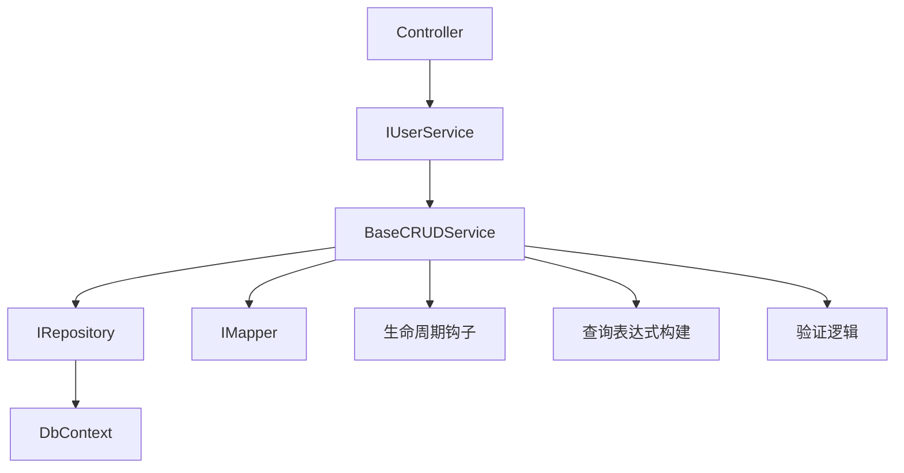
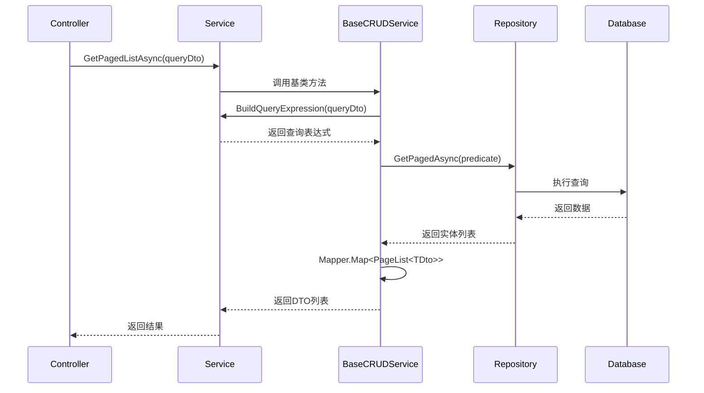

# CodeSpirit.BaseCRUDService 使用指南

## 概述

`BaseCRUDService` 是 CodeSpirit 框架中的核心服务基类，为业务服务层提供了标准化的增删改查（CRUD）操作实现。该基类封装了常用的数据操作模式，简化了业务服务的开发，同时提供了强大的扩展机制，支持自定义查询逻辑和业务处理。

## 核心特性

### 1. **标准化CRUD操作**
- ✅ 统一的增删改查接口
- ✅ 分页查询支持
- ✅ 批量删除操作
- ✅ 事务支持

### 2. **灵活的查询构建**
- ✅ 支持自定义查询表达式
- ✅ 动态查询条件组合
- ✅ 查询DTO自动解析
- ✅ 性能优化的查询构建

### 3. **扩展性设计**
- ✅ 虚方法重写机制
- ✅ 生命周期钩子函数
- ✅ 验证逻辑自定义
- ✅ 映射配置支持

### 4. **类型安全**
- ✅ 强类型泛型设计
- ✅ 编译时类型检查
- ✅ 自动映射支持
- ✅ 类型约束保护

## 类定义

```csharp
public abstract class BaseCRUDService<TEntity, TDto, TKey, TCreateDto, TUpdateDto> 
    : IBaseCRUDService<TEntity, TDto, TKey, TCreateDto, TUpdateDto>
    where TEntity : class
    where TDto : class
    where TKey : IEquatable<TKey>
    where TCreateDto : class
    where TUpdateDto : class
```

### 泛型参数说明

| 参数 | 描述 | 示例 |
|------|------|------|
| `TEntity` | 实体类型 | `User` |
| `TDto` | 数据传输对象类型 | `UserDto` |
| `TKey` | 主键类型 | `long`, `int`, `Guid` |
| `TCreateDto` | 创建DTO类型 | `CreateUserDto` |
| `TUpdateDto` | 更新DTO类型 | `UpdateUserDto` |

## 基础使用

### 1. 创建服务类

```csharp
/// <summary>
/// 用户服务实现
/// </summary>
public class UserService : BaseCRUDService<User, UserDto, long, CreateUserDto, UpdateUserDto>, IUserService
{
    /// <summary>
    /// 构造函数
    /// </summary>
    /// <param name="repository">用户仓储</param>
    /// <param name="mapper">对象映射器</param>
    public UserService(IRepository<User> repository, IMapper mapper)
        : base(repository, mapper)
    {
    }
}
```

### 2. 服务接口定义

```csharp
/// <summary>
/// 用户服务接口
/// </summary>
public interface IUserService : IBaseCRUDService<User, UserDto, long, CreateUserDto, UpdateUserDto>
{
    // 可以添加额外的业务方法
    Task<UserDto> GetByEmailAsync(string email);
}
```

### 3. 服务注册

```csharp
// 在Program.cs或ServiceCollectionExtensions中注册
services.AddScoped<IUserService, UserService>();
```

## 标准CRUD操作

### 1. 查询操作

```csharp
// 获取单个实体
var user = await userService.GetAsync(1);

// 获取所有实体
var allUsers = await userService.GetAllAsync();

// 分页查询（基础版本）
var pagedUsers = await userService.GetPagedListAsync(
    page: 1,
    perPage: 20,
    predicate: x => x.IsActive,
    orderBy: "Name",
    orderDir: "asc"
);

// 分页查询（使用查询DTO）
var queryDto = new UserQueryDto 
{ 
    Page = 1, 
    PerPage = 20,
    Name = "张三",
    IsActive = true
};
var pagedResult = await userService.GetPagedListAsync(queryDto);
```

### 2. 创建操作

```csharp
var createDto = new CreateUserDto
{
    Name = "张三",
    Email = "zhangsan@example.com",
    Phone = "13800138000"
};

var createdUser = await userService.CreateAsync(createDto);
```

### 3. 更新操作

```csharp
var updateDto = new UpdateUserDto
{
    Name = "李四",
    Email = "lisi@example.com"
};

await userService.UpdateAsync(1, updateDto);
```

### 4. 删除操作

```csharp
// 单个删除
await userService.DeleteAsync(1);

// 批量删除
var ids = new[] { 1L, 2L, 3L };
var (successCount, failedIds) = await userService.BatchDeleteAsync(ids);
```

## 查询表达式重写功能

### 1. 功能概述

查询表达式重写是 `BaseCRUDService` 的核心增强功能，允许子类自定义查询逻辑，支持复杂的业务查询需求。

### 2. 重写BuildQueryExpression方法

```csharp
public class UserService : BaseCRUDService<User, UserDto, long, CreateUserDto, UpdateUserDto>
{
    /// <summary>
    /// 构建查询表达式（重写基类方法）
    /// </summary>
    /// <param name="queryDto">查询DTO</param>
    /// <returns>查询表达式</returns>
    protected override Expression<Func<User, bool>>? BuildQueryExpression(object? queryDto)
    {
        if (queryDto is UserQueryDto query)
        {
            var predicate = PredicateBuilder.New<User>(true);
            
            // 姓名模糊搜索
            if (!string.IsNullOrEmpty(query.Name))
            {
                predicate = predicate.And(x => x.Name.Contains(query.Name));
            }
            
            // 邮箱模糊搜索
            if (!string.IsNullOrEmpty(query.Email))
            {
                predicate = predicate.And(x => x.Email.Contains(query.Email));
            }
            
            // 状态筛选
            if (query.IsActive.HasValue)
            {
                predicate = predicate.And(x => x.IsActive == query.IsActive.Value);
            }
            
            // 创建时间范围
            if (query.CreatedFrom.HasValue)
            {
                predicate = predicate.And(x => x.CreatedAt >= query.CreatedFrom.Value);
            }
            
            if (query.CreatedTo.HasValue)
            {
                predicate = predicate.And(x => x.CreatedAt <= query.CreatedTo.Value);
            }
            
            // 角色筛选
            if (query.RoleIds?.Any() == true)
            {
                predicate = predicate.And(x => x.UserRoles.Any(ur => query.RoleIds.Contains(ur.RoleId)));
            }
            
            return predicate;
        }
        
        return null;
    }
}
```

### 3. 复杂查询示例（WorkflowDefinitionService）

```csharp
public class WorkflowDefinitionService : BaseCRUDService<WorkflowDefinition, WorkflowDefinitionDto, long, CreateWorkflowDefinitionDto, UpdateWorkflowDefinitionDto>
{
    /// <summary>
    /// 构建查询表达式（重写基类方法）
    /// </summary>
    protected override Expression<Func<WorkflowDefinition, bool>>? BuildQueryExpression(object? queryDto)
    {
        return BuildQueryExpressionInternal(queryDto);
    }
    
    /// <summary>
    /// 内部查询构建方法
    /// </summary>
    private Expression<Func<WorkflowDefinition, bool>> BuildQueryExpressionInternal(object? query)
    {
        var predicate = PredicateBuilder.New<WorkflowDefinition>(true);

        if (query is WorkflowDefinitionQueryDto queryDto)
        {
            // 工作流名称搜索
            if (!string.IsNullOrEmpty(queryDto.Name))
            {
                predicate = predicate.And(x => x.Name.Contains(queryDto.Name));
            }

            // 工作流代码搜索
            if (!string.IsNullOrEmpty(queryDto.Code))
            {
                predicate = predicate.And(x => x.Code.Contains(queryDto.Code));
            }

            // 启用状态筛选
            if (queryDto.IsEnabled.HasValue)
            {
                predicate = predicate.And(x => x.IsEnabled == queryDto.IsEnabled.Value);
            }

            // 版本筛选
            if (queryDto.Version.HasValue)
            {
                predicate = predicate.And(x => x.Version == queryDto.Version.Value);
            }

            // 分类筛选
            if (queryDto.CategoryId.HasValue)
            {
                predicate = predicate.And(x => x.CategoryId == queryDto.CategoryId.Value);
            }
        }

        return predicate;
    }
}
```

## 生命周期钩子函数

### 1. 创建生命周期

```csharp
public class UserService : BaseCRUDService<User, UserDto, long, CreateUserDto, UpdateUserDto>
{
    /// <summary>
    /// 验证创建DTO
    /// </summary>
    protected override async Task ValidateCreateDto(CreateUserDto createDto)
    {
        // 检查邮箱是否已存在
        var existingUser = await Repository.CreateQuery()
            .FirstOrDefaultAsync(x => x.Email == createDto.Email);
            
        if (existingUser != null)
        {
            throw new BusinessException("邮箱已存在");
        }
    }
    
    /// <summary>
    /// 创建前处理
    /// </summary>
    protected override async Task OnCreating(User entity, CreateUserDto createDto)
    {
        // 设置创建时间和创建者
        entity.CreatedAt = DateTime.UtcNow;
        entity.CreatedBy = _currentUser.Id ?? 0;
        
        // 生成用户编号
        entity.UserNo = await GenerateUserNoAsync();
        
        // 设置默认密码
        entity.PasswordHash = HashPassword("123456");
    }
    
    /// <summary>
    /// 创建后处理
    /// </summary>
    protected override async Task OnCreated(User entity, CreateUserDto createDto)
    {
        // 发送欢迎邮件
        await _emailService.SendWelcomeEmailAsync(entity.Email, entity.Name);
        
        // 记录审计日志
        await _auditService.LogAsync("用户创建", $"创建用户: {entity.Name}");
    }
}
```

### 2. 更新生命周期

```csharp
/// <summary>
/// 验证更新DTO
/// </summary>
protected override async Task ValidateUpdateDto(long id, UpdateUserDto updateDto)
{
    // 如果修改了邮箱，检查新邮箱是否已存在
    if (!string.IsNullOrEmpty(updateDto.Email))
    {
        var existingUser = await Repository.CreateQuery()
            .FirstOrDefaultAsync(x => x.Email == updateDto.Email && x.Id != id);
            
        if (existingUser != null)
        {
            throw new BusinessException("邮箱已存在");
        }
    }
}

/// <summary>
/// 更新前处理
/// </summary>
protected override async Task OnUpdating(User entity, UpdateUserDto updateDto)
{
    // 设置更新时间和更新者
    entity.UpdatedAt = DateTime.UtcNow;
    entity.UpdatedBy = _currentUser.Id ?? 0;
    
    // 如果修改了敏感信息，记录变更日志
    if (entity.Email != updateDto.Email)
    {
        await _changeLogService.LogAsync(entity.Id, "Email", entity.Email, updateDto.Email);
    }
}

/// <summary>
/// 更新后处理
/// </summary>
protected override async Task OnUpdated(User entity)
{
    // 清除用户缓存
    await _cacheService.RemoveAsync($"user_{entity.Id}");
    
    // 记录审计日志
    await _auditService.LogAsync("用户更新", $"更新用户: {entity.Name}");
}
```

### 3. 删除生命周期

```csharp
/// <summary>
/// 删除前处理
/// </summary>
protected override async Task OnDeleting(User entity)
{
    // 检查是否可以删除
    var hasOrders = await _orderRepository.CreateQuery()
        .AnyAsync(x => x.UserId == entity.Id);
        
    if (hasOrders)
    {
        throw new BusinessException("用户存在关联订单，无法删除");
    }
    
    // 软删除相关数据
    await _userRoleRepository.DeleteByUserIdAsync(entity.Id);
}

/// <summary>
/// 删除后处理
/// </summary>
protected override async Task OnDeleted(User entity)
{
    // 清除所有相关缓存
    await _cacheService.RemovePatternAsync($"user_{entity.Id}*");
    
    // 记录审计日志
    await _auditService.LogAsync("用户删除", $"删除用户: {entity.Name}");
    
    // 发送通知
    await _notificationService.NotifyUserDeletedAsync(entity);
}
```

## 高级功能

### 1. 自定义实体获取

```csharp
/// <summary>
/// 获取要更新的实体（包含关联数据）
/// </summary>
protected override async Task<User> GetEntityForUpdate(long id, UpdateUserDto updateDto)
{
    var entity = await Repository.CreateQuery()
        .Include(x => x.UserRoles)
        .ThenInclude(x => x.Role)
        .Include(x => x.Profile)
        .FirstOrDefaultAsync(x => x.Id == id);
        
    return entity ?? throw new BusinessException("用户不存在");
}
```

### 2. 复杂业务逻辑封装

```csharp
public class ProductService : BaseCRUDService<Product, ProductDto, long, CreateProductDto, UpdateProductDto>
{
    /// <summary>
    /// 创建前处理 - 产品业务逻辑
    /// </summary>
    protected override async Task OnCreating(Product entity, CreateProductDto createDto)
    {
        // 生成产品编码
        entity.ProductCode = await GenerateProductCodeAsync(createDto.CategoryId);
        
        // 设置默认库存
        entity.Stock = createDto.InitialStock ?? 0;
        
        // 计算成本价格
        entity.CostPrice = await CalculateCostPriceAsync(createDto);
        
        // 设置上架状态
        entity.Status = ProductStatus.Draft; // 默认草稿状态
        
        // 创建时间戳
        entity.CreatedAt = DateTime.UtcNow;
        entity.CreatedBy = _currentUser.Id ?? 0;
    }
    
    /// <summary>
    /// 更新前处理 - 价格变更逻辑
    /// </summary>
    protected override async Task OnUpdating(Product entity, UpdateProductDto updateDto)
    {
        // 如果价格发生变更，记录价格历史
        if (updateDto.Price.HasValue && entity.Price != updateDto.Price.Value)
        {
            await _priceHistoryService.RecordPriceChangeAsync(
                entity.Id, 
                entity.Price, 
                updateDto.Price.Value,
                "手动调价"
            );
        }
        
        // 如果修改了库存，更新库存记录
        if (updateDto.Stock.HasValue && entity.Stock != updateDto.Stock.Value)
        {
            await _stockService.UpdateStockAsync(
                entity.Id,
                updateDto.Stock.Value - entity.Stock,
                "库存调整"
            );
        }
    }
}
```

### 3. 多租户支持

```csharp
public class TenantAwareService<TEntity> : BaseCRUDService<TEntity, TDto, long, CreateDto, UpdateDto>
    where TEntity : class, ITenantEntity
{
    private readonly ITenantContext _tenantContext;
    
    protected override Expression<Func<TEntity, bool>>? BuildQueryExpression(object? queryDto)
    {
        var predicate = PredicateBuilder.New<TEntity>(true);
        
        // 自动添加租户过滤
        predicate = predicate.And(x => x.TenantId == _tenantContext.TenantId);
        
        // 其他查询条件...
        
        return predicate;
    }
    
    protected override async Task OnCreating(TEntity entity, CreateDto createDto)
    {
        // 自动设置租户ID
        entity.TenantId = _tenantContext.TenantId;
        
        await base.OnCreating(entity, createDto);
    }
}
```

## 最佳实践

### 1. **服务设计原则**

```csharp
// ✅ 好的实践
public class UserService : BaseCRUDService<User, UserDto, long, CreateUserDto, UpdateUserDto>, IUserService
{
    private readonly IEmailService _emailService;
    private readonly ICacheService _cacheService;
    private readonly ICurrentUser _currentUser;
    
    public UserService(
        IRepository<User> repository,
        IMapper mapper,
        IEmailService emailService,
        ICacheService cacheService,
        ICurrentUser currentUser)
        : base(repository, mapper)
    {
        _emailService = emailService;
        _cacheService = cacheService;
        _currentUser = currentUser;
    }
    
    // 明确的业务方法
    public async Task<UserDto> GetByEmailAsync(string email)
    {
        var user = await Repository.CreateQuery()
            .FirstOrDefaultAsync(x => x.Email == email);
        return Mapper.Map<UserDto>(user);
    }
}
```

### 2. **查询优化**

```csharp
// ✅ 使用索引友好的查询
protected override Expression<Func<Product, bool>>? BuildQueryExpression(object? queryDto)
{
    if (queryDto is ProductQueryDto query)
    {
        var predicate = PredicateBuilder.New<Product>(true);
        
        // 精确匹配放在前面（使用索引）
        if (query.CategoryId.HasValue)
        {
            predicate = predicate.And(x => x.CategoryId == query.CategoryId.Value);
        }
        
        if (query.Status.HasValue)
        {
            predicate = predicate.And(x => x.Status == query.Status.Value);
        }
        
        // 模糊搜索放在后面
        if (!string.IsNullOrEmpty(query.Name))
        {
            predicate = predicate.And(x => x.Name.Contains(query.Name));
        }
        
        return predicate;
    }
    
    return null;
}
```

### 3. **错误处理**

```csharp
// ✅ 适当的异常处理
protected override async Task ValidateCreateDto(CreateUserDto createDto)
{
    // 业务规则验证
    if (string.IsNullOrEmpty(createDto.Email))
    {
        throw new BusinessException("邮箱不能为空");
    }
    
    if (!IsValidEmail(createDto.Email))
    {
        throw new BusinessException("邮箱格式不正确");
    }
    
    // 数据一致性检查
    var existingUser = await Repository.CreateQuery()
        .FirstOrDefaultAsync(x => x.Email == createDto.Email);
        
    if (existingUser != null)
    {
        throw new BusinessException("邮箱已存在");
    }
}
```

### 4. **性能优化**

```csharp
// ✅ 合理使用包含关系
protected override async Task<User> GetEntityForUpdate(long id, UpdateUserDto updateDto)
{
    // 只包含必要的关联数据
    var query = Repository.CreateQuery().Where(x => x.Id == id);
    
    // 根据更新内容决定是否包含关联数据
    if (updateDto.RoleIds?.Any() == true)
    {
        query = query.Include(x => x.UserRoles);
    }
    
    if (!string.IsNullOrEmpty(updateDto.Avatar))
    {
        query = query.Include(x => x.Profile);
    }
    
    var entity = await query.FirstOrDefaultAsync();
    return entity ?? throw new BusinessException("用户不存在");
}
```

### 5. **缓存策略**

```csharp
public class CachedUserService : BaseCRUDService<User, UserDto, long, CreateUserDto, UpdateUserDto>
{
    private readonly IMemoryCache _cache;
    private const int CacheExpiryMinutes = 30;
    
    public override async Task<UserDto> GetAsync(long id)
    {
        var cacheKey = $"user_{id}";
        
        if (_cache.TryGetValue(cacheKey, out UserDto cachedUser))
        {
            return cachedUser;
        }
        
        var user = await base.GetAsync(id);
        if (user != null)
        {
            _cache.Set(cacheKey, user, TimeSpan.FromMinutes(CacheExpiryMinutes));
        }
        
        return user;
    }
    
    protected override async Task OnUpdated(User entity)
    {
        // 清除缓存
        _cache.Remove($"user_{entity.Id}");
        
        await base.OnUpdated(entity);
    }
}
```

## 常见问题

### 1. **Q: 如何处理软删除？**

```csharp
public class SoftDeleteService<TEntity> : BaseCRUDService<TEntity, TDto, long, CreateDto, UpdateDto>
    where TEntity : class, ISoftDeletable
{
    public override async Task DeleteAsync(long id)
    {
        var entity = await Repository.GetByIdAsync(id);
        if (entity == null) return;
        
        // 软删除
        entity.IsDeleted = true;
        entity.DeletedAt = DateTime.UtcNow;
        entity.DeletedBy = _currentUser.Id ?? 0;
        
        await Repository.UpdateAsync(entity);
    }
    
    protected override Expression<Func<TEntity, bool>>? BuildQueryExpression(object? queryDto)
    {
        var predicate = PredicateBuilder.New<TEntity>(true);
        
        // 默认过滤已删除的记录
        predicate = predicate.And(x => !x.IsDeleted);
        
        // 其他查询条件...
        
        return predicate;
    }
}
```

### 2. **Q: 如何实现审计日志？**

```csharp
public class AuditableService<TEntity> : BaseCRUDService<TEntity, TDto, long, CreateDto, UpdateDto>
    where TEntity : class, IAuditable
{
    private readonly IAuditService _auditService;
    
    protected override async Task OnCreated(TEntity entity, CreateDto createDto)
    {
        await _auditService.LogAsync(new AuditLog
        {
            EntityType = typeof(TEntity).Name,
            EntityId = entity.Id.ToString(),
            Action = "Create",
            OldValues = null,
            NewValues = JsonConvert.SerializeObject(entity),
            UserId = _currentUser.Id,
            Timestamp = DateTime.UtcNow
        });
        
        await base.OnCreated(entity, createDto);
    }
    
    protected override async Task OnUpdated(TEntity entity)
    {
        // 记录更新日志
        await _auditService.LogAsync(new AuditLog
        {
            EntityType = typeof(TEntity).Name,
            EntityId = entity.Id.ToString(),
            Action = "Update",
            NewValues = JsonConvert.SerializeObject(entity),
            UserId = _currentUser.Id,
            Timestamp = DateTime.UtcNow
        });
        
        await base.OnUpdated(entity);
    }
}
```

### 3. **Q: 如何处理复杂的查询条件？**

```csharp
protected override Expression<Func<Order, bool>>? BuildQueryExpression(object? queryDto)
{
    if (queryDto is OrderQueryDto query)
    {
        var predicate = PredicateBuilder.New<Order>(true);
        
        // 状态筛选（支持多状态）
        if (query.Statuses?.Any() == true)
        {
            predicate = predicate.And(x => query.Statuses.Contains(x.Status));
        }
        
        // 日期范围查询
        if (query.DateFrom.HasValue)
        {
            predicate = predicate.And(x => x.OrderDate >= query.DateFrom.Value);
        }
        
        if (query.DateTo.HasValue)
        {
            predicate = predicate.And(x => x.OrderDate <= query.DateTo.Value);
        }
        
        // 金额范围查询
        if (query.AmountFrom.HasValue)
        {
            predicate = predicate.And(x => x.TotalAmount >= query.AmountFrom.Value);
        }
        
        if (query.AmountTo.HasValue)
        {
            predicate = predicate.And(x => x.TotalAmount <= query.AmountTo.Value);
        }
        
        // 客户搜索（支持姓名和手机号）
        if (!string.IsNullOrEmpty(query.CustomerKeyword))
        {
            predicate = predicate.And(x => 
                x.Customer.Name.Contains(query.CustomerKeyword) ||
                x.Customer.Phone.Contains(query.CustomerKeyword));
        }
        
        // 产品搜索
        if (!string.IsNullOrEmpty(query.ProductKeyword))
        {
            predicate = predicate.And(x => 
                x.OrderItems.Any(item => item.Product.Name.Contains(query.ProductKeyword)));
        }
        
        return predicate;
    }
    
    return null;
}
```

## 技术架构

### 1. **依赖关系图**



### 2. **调用流程**



## 版本历史

### v2.1.0 (2025-09-22)
- ✅ 添加查询表达式重写功能
- ✅ 支持自定义查询逻辑
- ✅ 增强分页查询方法
- ✅ 完善文档和示例

### v2.0.0 (2024-12-01)
- ✅ 重构生命周期钩子函数
- ✅ 添加批量删除功能
- ✅ 优化映射配置
- ✅ 提升性能和稳定性

### v1.0.0 (2024-06-01)
- ✅ 初始版本发布
- ✅ 基础CRUD操作支持
- ✅ 泛型类型安全设计
- ✅ AutoMapper集成

---

**文档维护**: CodeSpirit 开发团队  
**最后更新**: 2025-09-22  
**适用版本**: CodeSpirit v2.1.0+
