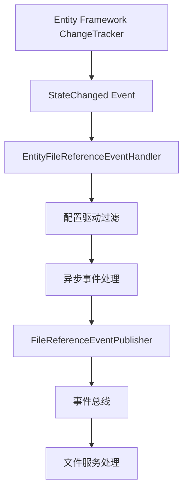

# CodeSpirit.EntityFileReferenceHandler 实体文件引用事件处理器使用指南

## 概述

`EntityFileReferenceHandlerBase<T>` 是一个通用的实体文件引用事件处理器基类，基于Entity Framework的ChangeTracker事件订阅机制，自动处理实体增删改操作时的文件引用事件发布，支持配置驱动的文件引用事件处理。

## 核心特性

- ✅ **自动化事件处理**: 基于EF Core ChangeTracker自动触发
- ✅ **配置驱动**: 通过简单配置即可支持新实体
- ✅ **异步处理**: 不阻塞数据库保存操作
- ✅ **异常隔离**: 文件引用事件处理失败不影响主业务
- ✅ **类型安全**: 编译时类型检查
- ✅ **高度可复用**: 可在多个项目中复用核心逻辑
- ✅ **可扩展**: 支持自定义处理逻辑
- ✅ **日志完整**: 详细的调试和错误信息

## 架构设计

### 核心组件

```
CodeSpirit.Shared
├── EventBus/Handlers/
│   └── EntityFileReferenceHandlerBase<T>.cs    # 通用基类
│
具体项目 (如 CodeSpirit.IdentityApi)
├── EventHandlers/
│   └── EntityFileReferenceEventHandler.cs      # 业务配置实现
```

### 工作原理



## 快速开始

### 1. 继承基类并提供配置

```csharp
using CodeSpirit.Shared.EventBus.Handlers;

public class MyEntityFileReferenceEventHandler : EntityFileReferenceHandlerBase<MyEntityFileReferenceEventHandler>
{
    /// <summary>
    /// 实体文件字段配置
    /// </summary>
    protected override Dictionary<Type, EntityFileConfig> EntityConfigs { get; } = new()
    {
        // 配置产品实体的文件字段映射
        [typeof(Product)] = new("产品", 
            product => ((Product)product).ImageUrl ?? string.Empty, 
            product => ((Product)product).Id.ToString(), 
            product => ((Product)product).Name, 
            "ProductImage", "产品图片"),
            
        // 配置分类实体的文件字段映射
        [typeof(Category)] = new("分类", 
            category => ((Category)category).IconUrl ?? string.Empty, 
            category => ((Category)category).Id.ToString(), 
            category => ((Category)category).Name, 
            "CategoryIcon", "分类图标")
    };

    public MyEntityFileReferenceEventHandler(
        IServiceProvider serviceProvider, 
        ILogger<MyEntityFileReferenceEventHandler> logger)
        : base(serviceProvider, logger)
    {
    }
}
```

### 2. 注册服务

```csharp
// 在 ServiceCollectionExtensions.cs 中
public static IServiceCollection AddCustomServices(this IServiceCollection services)
{
    // 注册实体文件引用事件处理器
    services.AddScoped<MyEntityFileReferenceEventHandler>();
    
    return services;
}
```

### 3. 在DbContext中集成

```csharp
public class MyDbContext : DbContext
{
    private readonly MyEntityFileReferenceEventHandler _eventHandler;

    public MyDbContext(
        DbContextOptions options, 
        MyEntityFileReferenceEventHandler eventHandler) : base(options)
    {
        _eventHandler = eventHandler ?? throw new ArgumentNullException(nameof(eventHandler));
        
        // 注册实体状态变更事件
        ChangeTracker.StateChanged += (sender, e) => 
            _eventHandler.HandleEntityStateChanged(e, e.Entry.Entity);
    }
}
```

### 4. 实体实现事件接口

```csharp
using CodeSpirit.Shared.Data;

public class Product : IFullEntityEvent  // 支持增删改事件
{
    public long Id { get; set; }
    public string Name { get; set; }
    public string ImageUrl { get; set; }  // 文件字段
    // ... 其他属性
}

public class Category : IEntityCreatedEvent, IEntityUpdatedEvent  // 只支持增改事件
{
    public long Id { get; set; }
    public string Name { get; set; }
    public string IconUrl { get; set; }  // 文件字段
    // ... 其他属性
}
```

## 配置详解

### EntityFileConfig 参数说明

```csharp
public record EntityFileConfig(
    string EntityType,              // 实体类型描述（用于日志）
    Func<object, string> GetFileUrl,    // 获取文件URL的函数
    Func<object, string> GetEntityId,   // 获取实体ID的函数  
    Func<object, string> GetEntityName, // 获取实体名称的函数
    string FileType,                // 文件类型标识
    string FileDescription          // 文件描述
);
```

### 配置示例

```csharp
[typeof(ApplicationUser)] = new("用户", 
    user => ((ApplicationUser)user).AvatarUrl ?? string.Empty,     // 头像URL
    user => ((ApplicationUser)user).Id.ToString(),                 // 用户ID
    user => ((ApplicationUser)user).Name,                          // 用户名称
    "Avatar",                                                       // 文件类型
    "用户头像"),                                                    // 文件描述

[typeof(TenantInfo)] = new("租户", 
    tenant => ((TenantInfo)tenant).LogoUrl ?? string.Empty,        // Logo URL
    tenant => ((TenantInfo)tenant).TenantId,                       // 租户ID
    tenant => ((TenantInfo)tenant).Name,                           // 租户名称
    "Logo",                                                         // 文件类型
    "租户Logo")                                                     // 文件描述
```

## 高级用法

### 1. 自定义文件引用处理

```csharp
public class AdvancedEntityFileReferenceEventHandler : EntityFileReferenceHandlerBase<AdvancedEntityFileReferenceEventHandler>
{
    // 重写方法以支持多文件字段处理
    protected override List<FileReferenceInfo> CreateFileReferences(string fileUrl, EntityFileConfig config)
    {
        var fileReferences = base.CreateFileReferences(fileUrl, config);
        
        // 添加自定义处理逻辑
        // 例如：处理多个文件字段、特殊文件类型等
        
        return fileReferences;
    }
    
    // 自定义实体事件支持检查
    protected override bool IsEntityEventSupported(object entity)
    {
        // 添加自定义的实体事件支持逻辑
        return base.IsEntityEventSupported(entity) && /* 自定义条件 */;
    }
}
```

### 2. 多文件字段支持

```csharp
public class MultiFileEntityHandler : EntityFileReferenceHandlerBase<MultiFileEntityHandler>
{
    protected override List<FileReferenceInfo> CreateFileReferences(string fileUrl, EntityFileConfig config)
    {
        var fileReferences = new List<FileReferenceInfo>();
        
        // 处理主文件
        if (!string.IsNullOrEmpty(fileUrl))
        {
            var fileId = FileReferenceEventPublisher.ExtractFileIdFromUrl(fileUrl);
            fileReferences.Add(FileReferenceEventPublisher.CreateFileReference(
                fileId, fileUrl, config.FileType, config.FileDescription, isPrimary: true));
        }
        
        // 处理附加文件（需要根据具体实体类型判断）
        // if (entity is ProductEntity product && !string.IsNullOrEmpty(product.ThumbnailUrl))
        // {
        //     // 处理缩略图等附加文件
        // }
        
        return fileReferences;
    }
}
```

## 实际应用示例

### CodeSpirit.IdentityApi 中的使用

```csharp
// 文件位置: Src/CodeSpirit.IdentityApi/EventHandlers/EntityFileReferenceEventHandler.cs
public class EntityFileReferenceEventHandler : EntityFileReferenceHandlerBase<EntityFileReferenceEventHandler>
{
    protected override Dictionary<Type, EntityFileConfig> EntityConfigs { get; } = new()
    {
        // 用户头像处理
        [typeof(ApplicationUser)] = new("用户", 
            user => ((ApplicationUser)user).AvatarUrl ?? string.Empty, 
            user => ((ApplicationUser)user).Id.ToString(), 
            user => ((ApplicationUser)user).Name, 
            "Avatar", "用户头像"),
            
        // 租户Logo处理
        [typeof(TenantInfo)] = new("租户", 
            tenant => ((TenantInfo)tenant).LogoUrl ?? string.Empty, 
            tenant => ((TenantInfo)tenant).TenantId, 
            tenant => ((TenantInfo)tenant).Name, 
            "Logo", "租户Logo")
    };

    public EntityFileReferenceEventHandler(
        IServiceProvider serviceProvider, 
        ILogger<EntityFileReferenceEventHandler> logger)
        : base(serviceProvider, logger)
    {
    }
}
```

### 其他项目扩展示例

```csharp
// 电商项目中的使用
public class ECommerceFileReferenceHandler : EntityFileReferenceHandlerBase<ECommerceFileReferenceHandler>
{
    protected override Dictionary<Type, EntityFileConfig> EntityConfigs { get; } = new()
    {
        [typeof(Product)] = new("商品", 
            product => ((Product)product).MainImageUrl ?? string.Empty,
            product => ((Product)product).Id.ToString(),
            product => ((Product)product).Name,
            "ProductMainImage", "商品主图"),
            
        [typeof(Brand)] = new("品牌", 
            brand => ((Brand)brand).LogoUrl ?? string.Empty,
            brand => ((Brand)brand).Id.ToString(),
            brand => ((Brand)brand).Name,
            "BrandLogo", "品牌Logo"),
            
        [typeof(Order)] = new("订单", 
            order => ((Order)order).ReceiptUrl ?? string.Empty,
            order => ((Order)order).Id.ToString(),
            order => ((Order)order).OrderNo,
            "OrderReceipt", "订单凭证")
    };
}
```

## 依赖关系

### 必要的NuGet包

- `Microsoft.EntityFrameworkCore` - EF Core支持
- `Microsoft.Extensions.DependencyInjection` - 依赖注入
- `Microsoft.Extensions.Logging` - 日志记录

### 项目依赖

- `CodeSpirit.Core` - 核心接口定义
- `CodeSpirit.Shared` - 共享组件
- `CodeSpirit.Shared.EventBus` - 事件总线组件

## 性能考虑

### 优化特性

1. **异步处理**: 使用 `Task.Run` 避免阻塞SaveChanges操作
2. **快速过滤**: 通过 `ContainsKey` 和接口检查快速过滤不支持的实体
3. **服务作用域**: 使用 `CreateScope()` 确保服务正确释放
4. **异常隔离**: 文件引用事件处理异常不影响主数据库操作

### 性能监控

```csharp
// 日志示例
_logger.LogDebug("{EntityType}文件引用事件发布成功: {EntityId}, {Operation}, {FileCount}个文件", 
    config.EntityType, entityId, operationType, fileReferences.Count);
```

## 故障排除

### 常见问题

1. **FileReferenceEventPublisher服务未注册**
   - 确保在启动时调用了 `AddEventBus()` 方法

2. **实体事件不触发**
   - 检查实体是否实现了相应的事件接口 (`IEntityCreatedEvent` 等)
   - 确认实体类型已在 `EntityConfigs` 中配置

3. **文件引用事件处理失败**
   - 查看日志中的详细错误信息
   - 检查文件URL格式是否正确
   - 确认文件服务是否正常运行

### 调试技巧

```csharp
// 启用详细日志
_logger.LogDebug("开始处理实体文件引用事件: EntityType={EntityType}, State={State}", 
    entity.GetType().Name, e.NewState);
```

## 总结

`EntityFileReferenceHandlerBase` 提供了一个强大而灵活的文件引用事件处理框架，通过配置驱动的方式大大简化了在不同项目中处理实体文件引用的复杂性。它的设计遵循了单一职责原则和开闭原则，既保证了代码的可复用性，又提供了良好的扩展能力。
