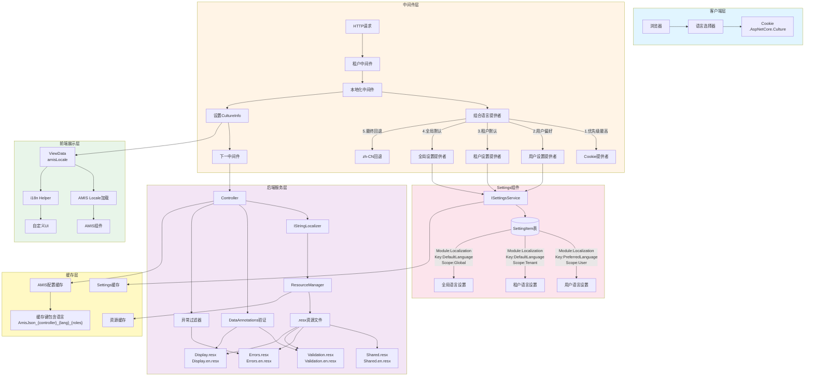
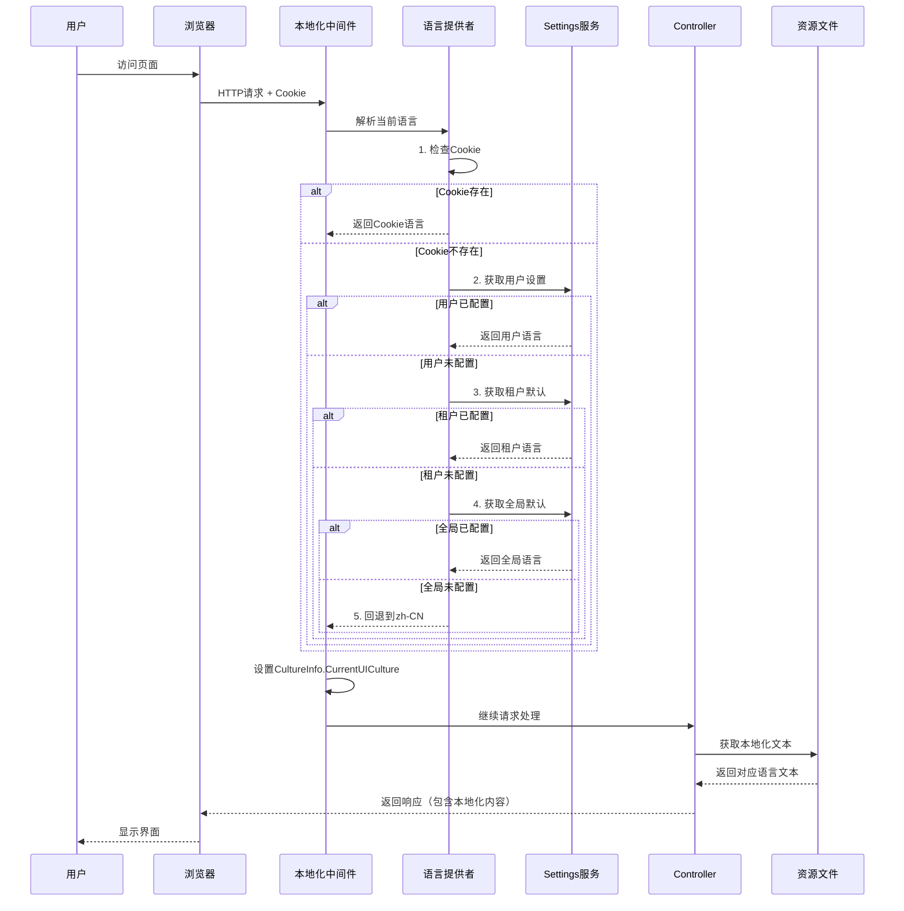

# CodeSpirit.Localization 多语言国际化组件设计文档

## 📋 文档信息

- **组件名称**：CodeSpirit.Localization
- **版本**：1.0.0
- **创建日期**：2024-12
- **最后更新**：2025-12-18
- **状态**：已实施 ✅

## 1. 概述

### 1.1 组件简介

CodeSpirit.Localization 是一个完整的前后端多语言国际化解决方案，提供从后端 API 到前端 UI 的全栈多语言支持。组件设计遵循"零侵入、高灵活、易扩展"的原则，通过 Settings 组件实现配置持久化，支持全局、租户、用户三级语言配置。

### 1.2 核心特性

- ✅ **双语支持**：内置中英文双语，可扩展更多语言
- ✅ **全栈覆盖**：后端 API + 前端 UI + AMIS 组件
- ✅ **多级配置**：全局默认 → 租户默认 → 用户偏好 → Cookie
- ✅ **类型安全**：基于 .resx 资源文件，编译时强类型访问
- ✅ **动态切换**：用户可实时切换语言，无需重新登录
- ✅ **AMIS 兼容**：深度集成 AMIS locale 机制，支持组件本地化
- ✅ **DataAnnotations 支持**：验证特性自动本地化
- ✅ **DTO描述多语言**：支持字段描述信息的多语言
- ✅ **缓存优化**：多层缓存机制，提升性能
- ✅ **零侵入设计**：利用 Settings 组件存储配置，无需修改业务表结构

### 1.3 技术栈

| 层级 | 技术 | 说明 |
|------|------|------|
| 后端框架 | .NET 9 | ASP.NET Core 本地化基础设施 |
| 资源管理 | .resx 资源文件 | 编译时强类型，支持多语言 |
| 配置存储 | CodeSpirit.Settings | 三级语言配置持久化 |
| 前端框架 | AMIS 6.13.0 | 低代码 UI 框架，内置 locale 支持 |
| 中间件 | RequestLocalizationMiddleware | 语言解析和文化设置 |
| DI 容器 | Microsoft.Extensions.DependencyInjection | 服务注册和依赖注入 |

## 2. 架构设计

### 2.1 整体架构图



### 2.2 语言解析流程



### 2.3 AMIS 缓存与本地化集成

```mermaid
graph LR
    subgraph Request["请求处理"]
        A[HTTP请求] --> B[本地化中间件]
        B --> C[AMIS中间件]
    end
    
    subgraph CacheKey["缓存键生成"]
        C --> D[CachingHelper.GenerateCacheKey]
        D --> E[获取当前语言]
        D --> F[获取用户角色]
        D --> G[获取控制器名称]
        E --> H["缓存键:<br/>AmisJson_{controller}_{lang}_{roles}"]
        F --> H
        G --> H
    end
    
    subgraph CacheHit["缓存命中"]
        H --> I{缓存是否存在?}
        I -->|是| J[返回缓存配置]
        I -->|否| K[生成新配置]
        K --> L[调用AmisGenerator]
        L --> M[使用UtilityHelper.GetCurrentCulture]
        M --> N[GetDisplayName获取本地化Label]
        N --> O[ResourceManager.GetString]
        O --> P[生成本地化AMIS配置]
        P --> Q[写入缓存]
        Q --> J
    end
    
    subgraph Response["响应"]
        J --> R[返回AMIS JSON]
        R --> S[前端渲染]
    end
    
    style Request fill:#e3f2fd
    style CacheKey fill:#fff3e0
    style CacheHit fill:#f3e5f5
    style Response fill:#e8f5e9
```



## 3. 核心模块说明

### 3.1 语言提供者模块

#### 3.1.1 ILanguageProvider 接口

```csharp
/// <summary>
/// 语言提供者接口
/// </summary>
public interface ILanguageProvider
{
    /// <summary>
    /// 异步获取语言代码
    /// </summary>
    /// <returns>语言代码（如 "zh-CN", "en"），如果无法确定则返回 null</returns>
    Task<string?> GetLanguageAsync();
}
```

**设计原则**：
- 单一职责：每个提供者只负责一个语言来源
- 异步设计：支持从数据库等异步源读取
- 可空返回：无法确定语言时返回 null，由下一级提供者继续尝试

#### 3.1.2 CompositeLanguageProvider（组合提供者）

```csharp
/// <summary>
/// 组合语言提供者，按优先级链式查找语言
/// </summary>
public class CompositeLanguageProvider : ILanguageProvider
{
    private readonly IEnumerable<ILanguageProvider> _providers;
    
    public CompositeLanguageProvider(IEnumerable<ILanguageProvider> providers)
    {
        _providers = providers;
    }
    
    public async Task<string?> GetLanguageAsync()
    {
        foreach (var provider in _providers)
        {
            var language = await provider.GetLanguageAsync();
            if (!string.IsNullOrEmpty(language))
            {
                return language;
            }
        }
        return null;
    }
}
```

**优先级顺序**（由 DI 容器配置）：
1. CookieLanguageProvider - 用户手动切换
2. UserSettingsLanguageProvider - 用户偏好设置
3. TenantSettingsLanguageProvider - 租户默认设置
4. GlobalSettingsLanguageProvider - 全局默认设置

#### 3.1.3 CookieLanguageProvider（Cookie 提供者）

```csharp
/// <summary>
/// 从 Cookie 中读取语言设置（最高优先级）
/// </summary>
public class CookieLanguageProvider : ILanguageProvider
{
    private readonly IHttpContextAccessor _httpContextAccessor;
    
    public Task<string?> GetLanguageAsync()
    {
        var httpContext = _httpContextAccessor.HttpContext;
        if (httpContext == null) return Task.FromResult<string?>(null);
        
        // Cookie 格式: c=zh-CN|uic=zh-CN
        var cultureCookie = httpContext.Request.Cookies[".AspNetCore.Culture"];
        if (string.IsNullOrEmpty(cultureCookie)) return Task.FromResult<string?>(null);
        
        var parts = cultureCookie.Split('|');
        foreach (var part in parts)
        {
            if (part.StartsWith("uic="))
            {
                return Task.FromResult<string?>(part.Substring(4));
            }
        }
        
        return Task.FromResult<string?>(null);
    }
}
```

**设计要点**：
- 读取标准 ASP.NET Core Culture Cookie
- 解析 `uic=` 部分（UI Culture）
- 容错处理：Cookie 格式错误时返回 null

#### 3.1.4 UserSettingsLanguageProvider（用户设置提供者）

```csharp
/// <summary>
/// 从用户设置中读取语言偏好
/// </summary>
public class UserSettingsLanguageProvider : ILanguageProvider
{
    private readonly ISettingsService _settingsService;
    private readonly ICurrentUser _currentUser;
    
    public async Task<string?> GetLanguageAsync()
    {
        if (!_currentUser.IsAuthenticated)
            return null;
        
        return await _settingsService.GetUserSettingAsync(
            module: "Localization",
            key: "PreferredLanguage",
            userId: _currentUser.UserId!
        );
    }
}
```

**集成点**：
- 依赖 `ICurrentUser` 获取当前用户
- 依赖 `ISettingsService` 读取设置
- 仅对已认证用户生效

#### 3.1.5 TenantSettingsLanguageProvider（租户设置提供者）

```csharp
/// <summary>
/// 从租户设置中读取默认语言
/// </summary>
public class TenantSettingsLanguageProvider : ILanguageProvider
{
    private readonly ISettingsService _settingsService;
    private readonly ITenantContext _tenantContext;
    
    public async Task<string?> GetLanguageAsync()
    {
        var tenantId = _tenantContext.TenantId;
        if (string.IsNullOrEmpty(tenantId))
            return null;
        
        return await _settingsService.GetTenantSettingAsync(
            module: "Localization",
            key: "DefaultLanguage",
            tenantId: tenantId
        );
    }
}
```

**多租户集成**：
- 依赖 `ITenantContext` 获取当前租户
- 通过 Settings 组件实现租户级配置隔离

#### 3.1.6 GlobalSettingsLanguageProvider（全局设置提供者）

```csharp
/// <summary>
/// 从全局设置中读取系统默认语言
/// </summary>
public class GlobalSettingsLanguageProvider : ILanguageProvider
{
    private readonly ISettingsService _settingsService;
    private readonly LocalizationOptions _options;
    
    public async Task<string?> GetLanguageAsync()
    {
        var language = await _settingsService.GetGlobalSettingAsync(
            module: "Localization",
            key: "DefaultLanguage"
        );
        
        // 如果全局设置也不存在，回退到配置文件中的默认值
        return language ?? _options.DefaultCulture;
    }
}
```

**最终回退**：
- 全局设置不存在时，使用 `appsettings.json` 中的默认值
- 确保系统始终有可用的语言配置

### 3.2 中间件模块

#### 3.2.1 UseCodeSpiritRequestLocalization 中间件

```csharp
/// <summary>
/// CodeSpirit 请求本地化中间件
/// </summary>
public static IApplicationBuilder UseCodeSpiritRequestLocalization(
    this IApplicationBuilder app)
{
    // 自定义中间件：解析语言并设置 CultureInfo
    app.Use(async (context, next) =>
    {
        // 从 DI 容器获取本地化服务（Scoped）
        var localizationService = context.RequestServices
            .GetRequiredService<ILocalizationService>();
        
        // 按优先级解析当前语言
        var language = await localizationService.GetCurrentLanguageAsync();
        
        // 设置当前线程的文化信息
        var culture = new CultureInfo(language);
        CultureInfo.CurrentCulture = culture;
        CultureInfo.CurrentUICulture = culture;
        
        await next();
    });
    
    // ASP.NET Core 内置本地化中间件（设置 IRequestCultureFeature）
    app.UseRequestLocalization();
    
    return app;
}
```

**中间件顺序**（Program.cs 中的配置）：
```csharp
app.UseCodeSpiritMultiTenant();          // 1. 租户解析
app.UseCodeSpiritRequestLocalization();   // 2. 语言解析
app.UseAuthentication();                  // 3. 身份认证
app.UseAuthorization();                   // 4. 授权
app.UseAmis();                            // 5. AMIS配置生成
```

**设计要点**：
- 在租户中间件之后：确保 `ITenantContext` 可用
- 在认证中间件之前：支持匿名用户的语言设置
- 在 AMIS 中间件之前：确保 AMIS 生成时能访问正确的 `CultureInfo`

### 3.3 资源管理模块

#### 3.3.1 资源文件结构

```
CodeSpirit.Localization/Resources/
├── Shared.resx                    # 通用UI文本（中文，默认）
├── Shared.en.resx                 # 通用UI文本（英文）
├── Errors.resx                    # 错误消息（中文）
├── Errors.en.resx                 # 错误消息（英文）
├── Validation.resx                # 验证消息（中文）
├── Validation.en.resx             # 验证消息（英文）
├── Display.resx                   # 字段显示名称（中文）
└── Display.en.resx                # 字段显示名称（英文）
```

**资源文件命名约定**：
- **Shared**: 通用文本（按钮、标签、菜单等）
- **Errors**: 业务错误消息
- **Validation**: 数据验证错误模板
- **Display**: DTO 字段显示名称

#### 3.3.2 ResourceManager 集成

每个资源文件都会自动生成对应的强类型类：

```csharp
// 自动生成的代码（DisplayResources.Designer.cs）
namespace CodeSpirit.Localization.Resources
{
    [GeneratedCode("...")]
    public class DisplayResources
    {
        private static ResourceManager resourceMan;
        
        public static ResourceManager ResourceManager
        {
            get
            {
                if (resourceMan == null)
                {
                    resourceMan = new ResourceManager(
                        "CodeSpirit.Localization.Resources.Display", 
                        typeof(DisplayResources).Assembly);
                }
                return resourceMan;
            }
        }
        
        // 静态属性（使用当前 UI 文化）
        public static string Content
        {
            get
            {
                return ResourceManager.GetString("Content", 
                    CultureInfo.CurrentUICulture) ?? "Content";
            }
        }
        
        // ... 其他属性
    }
}
```

**使用方式**：

```csharp
// 方式1：直接使用静态属性（简单，但依赖线程文化）
var text = DisplayResources.Content;

// 方式2：通过 ResourceManager 指定文化（推荐，明确）
var text = DisplayResources.ResourceManager.GetString(
    "Content", 
    new CultureInfo("en")
);

// 方式3：使用 IStringLocalizer（最灵活，支持DI）
var text = _localizer["Content"];
```

### 3.4 缓存优化模块

#### 3.4.1 CachingHelper - AMIS 配置缓存

```csharp
/// <summary>
/// AMIS 配置缓存辅助类
/// </summary>
public class CachingHelper
{
    private readonly IMemoryCache _cache;
    private readonly ICurrentUser _currentUser;
    private readonly IHttpContextAccessor? _httpContextAccessor;
    
    /// <summary>
    /// 生成缓存键（包含语言信息）
    /// </summary>
    public string GenerateCacheKey(string controllerName)
    {
        string rolesHash = GetUserRolesHash();
        string language = GetCurrentLanguage();
        
        // 缓存键格式：AmisJson_{controller}_{language}_{rolesHash}
        return $"AmisJson_{controllerName.ToLower()}_{language}_{rolesHash.GetHashCode()}";
    }
    
    /// <summary>
    /// 获取当前请求的语言代码
    /// </summary>
    private string GetCurrentLanguage()
    {
        try
        {
            var httpContext = _httpContextAccessor?.HttpContext;
            if (httpContext != null)
            {
                // 1. 优先从 RequestCultureFeature 获取
                var requestCultureFeature = httpContext.Features
                    .Get<IRequestCultureFeature>();
                if (requestCultureFeature?.RequestCulture?.UICulture != null)
                {
                    return requestCultureFeature.RequestCulture.UICulture.Name;
                }
                
                // 2. 回退：直接从 Cookie 读取
                var cultureCookie = httpContext.Request.Cookies[".AspNetCore.Culture"];
                if (!string.IsNullOrEmpty(cultureCookie))
                {
                    // 解析 uic= 部分
                    var parts = cultureCookie.Split('|');
                    foreach (var part in parts)
                    {
                        if (part.StartsWith("uic="))
                        {
                            return part.Substring(4);
                        }
                    }
                }
            }
        }
        catch { }
        
        // 3. 最终回退：当前线程文化
        return CultureInfo.CurrentUICulture.Name;
    }
}
```

**缓存键示例**：
```
AmisJson_codespirit.examapi.controllers.questioncontroller_zh-cn_123456
AmisJson_codespirit.examapi.controllers.questioncontroller_en_123456
```

**优化效果**：
- 不同语言的配置分别缓存
- 切换语言后自动使用对应语言的缓存
- 避免重复生成 AMIS 配置

#### 3.4.2 UtilityHelper - 语言获取优化

```csharp
/// <summary>
/// 工具辅助类（Scoped 服务）
/// </summary>
public class UtilityHelper
{
    private readonly IHttpContextAccessor? _httpContextAccessor;
    
    /// <summary>
    /// 获取当前请求的语言文化信息
    /// </summary>
    public CultureInfo GetCurrentCulture()
    {
        try
        {
            var httpContext = _httpContextAccessor?.HttpContext;
            if (httpContext != null)
            {
                // 1. 优先从请求特性获取
                var requestCultureFeature = httpContext.Features
                    .Get<IRequestCultureFeature>();
                if (requestCultureFeature?.RequestCulture?.UICulture != null)
                {
                    return requestCultureFeature.RequestCulture.UICulture;
                }
                
                // 2. 回退：从 Cookie 解析
                var cultureCookie = httpContext.Request.Cookies[".AspNetCore.Culture"];
                if (!string.IsNullOrEmpty(cultureCookie))
                {
                    var parts = cultureCookie.Split('|');
                    foreach (var part in parts)
                    {
                        if (part.StartsWith("uic="))
                        {
                            var language = part.Substring(4);
                            if (!string.IsNullOrEmpty(language))
                            {
                                try
                                {
                                    return new CultureInfo(language);
                                }
                                catch { }
                            }
                        }
                    }
                }
            }
        }
        catch { }
        
        // 3. 最终回退：线程文化
        return CultureInfo.CurrentUICulture;
    }
}
```

**在 AMIS 生成中的使用**：
```csharp
// CustomAttributeProviderExtensions.cs
public static string GetDisplayName(
    this ICustomAttributeProvider member, 
    UtilityHelper? utilityHelper = null)
{
    var displayAttr = member.GetCustomAttribute<DisplayAttribute>();
    if (displayAttr?.ResourceType != null)
    {
        var currentCulture = utilityHelper?.GetCurrentCulture() 
            ?? CultureInfo.CurrentUICulture;
        
        var resourceManager = displayAttr.ResourceType
            .GetProperty("ResourceManager", BindingFlags.Public | BindingFlags.Static)
            ?.GetValue(null) as ResourceManager;
        
        if (resourceManager != null)
        {
            var localizedText = resourceManager.GetString(
                displayAttr.Name, 
                currentCulture
            );
            if (!string.IsNullOrEmpty(localizedText))
            {
                return localizedText;
            }
        }
    }
    
    // 回退逻辑...
}
```

### 3.5 前端集成模块

#### 3.5.1 i18n-helper.js - 前端国际化辅助

```javascript
/**
 * CodeSpirit 前端国际化辅助类
 */
window.CodeSpirit = window.CodeSpirit || {};
window.CodeSpirit.i18n = {
    /**
     * 获取当前语言
     * @returns {string} 语言代码（如 'zh-CN', 'en'）
     */
    getCurrentLanguage() {
        const cookie = document.cookie
            .split('; ')
            .find(row => row.startsWith('.AspNetCore.Culture='));
        
        if (cookie) {
            const value = cookie.split('=')[1];
            const parts = value.split('|');
            for (const part of parts) {
                if (part.startsWith('uic=')) {
                    return part.substring(4);
                }
            }
        }
        
        return 'zh-CN'; // 默认中文
    },
    
    /**
     * 切换语言
     * @param {string} lang - 语言代码（'zh-CN' 或 'en'）
     */
    switchLanguage(lang) {
        // 设置 Cookie（365天有效期）
        const cookieValue = `c=${lang}|uic=${lang}`;
        document.cookie = `.AspNetCore.Culture=${cookieValue}; path=/; max-age=31536000`;
        
        // 刷新页面以应用新语言
        location.reload();
    },
    
    /**
     * 获取翻译文本（简化版，主要用于自定义UI）
     * @param {string} key - 资源键
     * @param {object} params - 参数
     * @returns {string} 翻译后的文本
     */
    t(key, params = {}) {
        let text = this.resources[key] || key;
        Object.keys(params).forEach(k => {
            text = text.replace(`{${k}}`, params[k]);
        });
        return text;
    },
    
    // 资源字典（由服务器端注入）
    resources: {}
};
```

**在页面中使用**：
```javascript
// tenant-admin.js 中的语言选择器
{
    type: 'select',
    name: 'language',
    value: '${language}',
    options: [
        { label: '简体中文', value: 'zh-CN' },
        { label: 'English', value: 'en' }
    ],
    onEvent: {
        change: {
            actions: [{
                actionType: 'custom',
                script: `
                    var lang = event.data && event.data.value;
                    if (window.CodeSpirit && window.CodeSpirit.i18n && lang) {
                        window.CodeSpirit.i18n.switchLanguage(lang);
                    }
                `
            }]
        }
    }
}
```

#### 3.5.2 AMIS Locale 集成

在 `_Layout.cshtml` 中动态加载 AMIS locale：

```cshtml
@{
    var currentCulture = System.Globalization.CultureInfo.CurrentUICulture;
    var amisLocale = currentCulture.Name.StartsWith("en") ? "en-US" : "zh-CN";
}

<!-- 设置全局变量 -->
<script>
    window.amisLocale = '@amisLocale';
    window.CodeSpirit = window.CodeSpirit || {};
    window.CodeSpirit.i18n = window.CodeSpirit.i18n || {};
    window.CodeSpirit.i18n.currentLanguage = '@currentCulture.Name';
</script>

<!-- 动态加载 AMIS locale 文件（仅用于非内置语言）-->
@if (amisLocale != "zh-CN" && amisLocale != "en-US")
{
    <script>
        // AMIS 1.1.0+ 内置 zh-CN 和 en-US，只需加载其他语言
        (function() {
            var script = document.createElement('script');
            script.src = '/sdk/@(sdkVersion)/locale/@(amisLocale).js';
            script.async = true;
            script.onload = function() {
                console.log('AMIS locale loaded: @amisLocale');
            };
            document.head.appendChild(script);
        })();
    </script>
}

<!-- 初始化 AMIS -->
<script>
    let amisInstance = amis.embed('#root', amisConfig, {
        locale: window.amisLocale, // 设置 locale
        // ... 其他配置
    });
</script>
```

**AMIS 内置组件自动本地化**：
- 日期选择器
- 分页组件
- 表格排序
- 验证提示
- 确认对话框
- 等等

## 4. DataAnnotations 本地化

### 4.1 验证特性配置

#### 4.1.1 全局配置（推荐）

在 `Program.cs` 或扩展方法中：

```csharp
public static IMvcBuilder AddCodeSpiritDataAnnotationsLocalization(
    this IMvcBuilder builder)
{
    return builder.AddDataAnnotationsLocalization(options =>
    {
        options.DataAnnotationLocalizerProvider = (type, factory) =>
        {
            // 所有验证消息统一使用 ValidationResources
            var validationType = Type.GetType(
                "CodeSpirit.Localization.Resources.ValidationResources, CodeSpirit.Localization"
            );
            if (validationType != null)
            {
                return factory.Create(validationType);
            }
            return factory.Create(type);
        };
    });
}
```

#### 4.1.2 DTO 中的使用

```csharp
/// <summary>
/// 创建题目DTO
/// </summary>
public class CreateQuestionDto
{
    /// <summary>
    /// 题目内容
    /// </summary>
    [Display(Name = "Content", ResourceType = typeof(DisplayResources))]
    [Required(ErrorMessageResourceType = typeof(ValidationResources), 
             ErrorMessageResourceName = nameof(ValidationResources.Required))]
    [StringLength(2000, 
        ErrorMessageResourceType = typeof(ValidationResources),
        ErrorMessageResourceName = nameof(ValidationResources.StringLengthMax))]
    public string Content { get; set; } = string.Empty;
    
    /// <summary>
    /// 题目类型
    /// </summary>
    [Display(Name = "Type", ResourceType = typeof(DisplayResources))]
    [Required(ErrorMessageResourceType = typeof(ValidationResources), 
             ErrorMessageResourceName = nameof(ValidationResources.Required))]
    public QuestionType Type { get; set; }
}
```

**资源文件示例**：

```xml
<!-- ValidationResources.resx -->
<data name="Required" xml:space="preserve">
  <value>{0}不能为空</value>
</data>
<data name="StringLengthMax" xml:space="preserve">
  <value>{0}最多{1}字符</value>
</data>

<!-- ValidationResources.en.resx -->
<data name="Required" xml:space="preserve">
  <value>{0} is required</value>
</data>
<data name="StringLengthMax" xml:space="preserve">
  <value>{0} must not exceed {1} characters</value>
</data>

<!-- DisplayResources.resx -->
<data name="Content" xml:space="preserve">
  <value>题目内容</value>
</data>

<!-- DisplayResources.en.resx -->
<data name="Content" xml:space="preserve">
  <value>Content</value>
</data>
```

**验证错误输出**：
- 中文：`题目内容不能为空`、`题目内容最多2000字符`
- 英文：`Content is required`、`Content must not exceed 2000 characters`

### 4.2 DTO 描述信息多语言

除了验证消息，DTO 字段的描述信息（Description）也支持多语言，通过 `LocalizedDescriptionAttribute` 实现。

**特性说明**：
- 继承自 `DescriptionAttribute`，完全向后兼容
- 支持 `ResourceKey` + `ResourceType` 模式
- 运行时根据当前文化自动解析资源
- 支持回退文本机制

**资源文件组织**：
- **共享资源**：`CodeSpirit.Localization/Resources/` - 通用资源
- **服务资源**：`ApiServices/{ServiceName}/Resources/` - 服务特定资源

**使用示例**：

```csharp
using CodeSpirit.Core.Attributes;
using CodeSpirit.ExamApi.Resources;

public class CreateQuestionDto
{
    [LocalizedDescription(
        "根据题目内容生成合适的选项",  // 回退文本
        ResourceKey = "Description.Question.Options",
        ResourceType = typeof(ExamDisplayResources)
    )]
    public List<string> Options { get; set; }
}
```

**资源键命名规范**：`Description.{EntityName}.{PropertyName}`

详细使用说明请参考：[多语言国际化使用指南](../../01-Core-Docs/多语言国际化使用指南.md#4-dto-描述信息多语言)

## 5. 使用指南

### 5.1 后端开发

#### 5.1.1 在 Controller 中使用

```csharp
[ApiController]
[Route("api/[controller]")]
public class ExamController : ApiControllerBase
{
    private readonly IStringLocalizer<Shared> _sharedLocalizer;
    private readonly IStringLocalizer<Errors> _errorsLocalizer;
    
    public ExamController(
        IStringLocalizer<Shared> sharedLocalizer,
        IStringLocalizer<Errors> errorsLocalizer)
    {
        _sharedLocalizer = sharedLocalizer;
        _errorsLocalizer = errorsLocalizer;
    }
    
    [HttpPost]
    public async Task<IActionResult> CreateExam(CreateExamDto dto)
    {
        if (dto.StartTime < DateTime.Now)
        {
            throw new BusinessException("Errors.InvalidStartTime");
        }
        
        // ... 业务逻辑
        
        return Ok(new ApiResponse
        {
            Status = 1,
            Msg = _sharedLocalizer["Success.Created"],
            Data = result
        });
    }
}
```

#### 5.1.2 异常处理

```csharp
// 使用资源键（推荐）
throw new BusinessException("Errors.NotFound");

// 带参数
throw new BusinessException("Errors.InvalidRange", minValue, maxValue);

// 全局异常过滤器会自动本地化
public class HttpResponseExceptionFilter : IExceptionFilter
{
    private readonly IStringLocalizer<Errors> _localizer;
    
    public void OnException(ExceptionContext context)
    {
        if (context.Exception is BusinessException be)
        {
            var message = _localizer[be.ResourceKey, be.Parameters ?? Array.Empty<object>()];
            context.Result = new JsonResult(new ApiResponse
            {
                Status = 0,
                Msg = message.Value
            });
        }
    }
}
```

### 5.2 前端开发

#### 5.2.1 Razor 页面

```cshtml
@inject IStringLocalizer<Shared> Localizer

<h1>@Localizer["PageTitle.ExamList"]</h1>

<button>@Localizer["Common.Save"]</button>
<button>@Localizer["Common.Cancel"]</button>
```

#### 5.2.2 JavaScript

```javascript
// 获取当前语言
const lang = window.CodeSpirit.i18n.getCurrentLanguage(); // 'zh-CN' 或 'en'

// 切换语言
window.CodeSpirit.i18n.switchLanguage('en');

// 获取翻译（自定义UI）
const text = window.CodeSpirit.i18n.t('Common.Save');
```

#### 5.2.3 AMIS 配置

```javascript
// 在页面初始化时设置 locale
let amisInstance = amis.embed('#root', {
    type: 'page',
    title: '考试列表',
    body: [
        {
            type: 'button',
            label: '@Localizer["Common.Save"]', // 服务器端注入
            actionType: 'submit'
        }
    ]
}, {
    locale: window.amisLocale, // 'zh-CN' 或 'en-US'
    data: {
        language: window.CodeSpirit.i18n.getCurrentLanguage()
    }
});
```

### 5.3 语言配置管理

#### 5.3.1 通过 API 设置

```csharp
[ApiController]
[Route("api/localization")]
public class LocalizationController : ApiControllerBase
{
    private readonly ISettingsService _settingsService;
    
    /// <summary>
    /// 设置用户语言偏好
    /// </summary>
    [HttpPost("user-preference")]
    public async Task<IActionResult> SetUserLanguage([FromBody] string language)
    {
        await _settingsService.SetUserSettingAsync(
            module: "Localization",
            key: "PreferredLanguage",
            value: language,
            userId: CurrentUser.UserId!,
            reason: "用户手动设置语言偏好"
        );
        
        return Ok(new ApiResponse { Status = 1, Msg = "设置成功" });
    }
    
    /// <summary>
    /// 设置租户默认语言
    /// </summary>
    [HttpPost("tenant-default")]
    [Authorize(Roles = "TenantAdmin")]
    public async Task<IActionResult> SetTenantLanguage([FromBody] string language)
    {
        await _settingsService.SetTenantSettingAsync(
            module: "Localization",
            key: "DefaultLanguage",
            value: language,
            tenantId: CurrentUser.TenantId!,
            reason: "租户管理员设置默认语言"
        );
        
        return Ok(new ApiResponse { Status = 1, Msg = "设置成功" });
    }
}
```

#### 5.3.2 通过 Settings 管理界面

管理员可以直接在 Settings 管理界面中配置：

- **Module**: Localization
- **Key**: DefaultLanguage（全局/租户）或 PreferredLanguage（用户）
- **Value**: zh-CN / en
- **Scope**: Global / Tenant / User

## 6. 扩展性设计

### 6.1 添加新语言

#### 步骤 1：更新配置

```json
{
  "Localization": {
    "SupportedCultures": [
      { "Code": "zh-CN", "DisplayName": "简体中文" },
      { "Code": "en", "DisplayName": "English" },
      { "Code": "ja", "DisplayName": "日本語" }
    ]
  }
}
```

#### 步骤 2：添加资源文件

```
Resources/
├── Shared.ja.resx
├── Errors.ja.resx
├── Validation.ja.resx
└── Display.ja.resx
```

#### 步骤 3：下载 AMIS locale

从 AMIS 官方获取 `ja-JP.js` 并放置到：
```
wwwroot/sdk/6.13.0/locale/ja-JP.js
```

#### 步骤 4：更新语言选择器

```javascript
{
    type: 'select',
    name: 'language',
    options: [
        { label: '简体中文', value: 'zh-CN' },
        { label: 'English', value: 'en' },
        { label: '日本語', value: 'ja' }
    ]
}
```

### 6.2 添加自定义资源文件

各 API 服务可添加独立的资源文件：

```
Src/ApiServices/CodeSpirit.ExamApi/
└── Resources/
    ├── ExamResources.resx
    └── ExamResources.en.resx
```

```csharp
// 在 Controller 中使用
private readonly IStringLocalizer<ExamResources> _examLocalizer;

public ExamController(IStringLocalizer<ExamResources> examLocalizer)
{
    _examLocalizer = examLocalizer;
}

public IActionResult GetMessage()
{
    var message = _examLocalizer["Exam.Title"];
    return Ok(new { message });
}
```

### 6.3 自定义语言提供者

如需从其他来源读取语言配置（如外部配置中心），可实现自定义提供者：

```csharp
public class ExternalConfigLanguageProvider : ILanguageProvider
{
    private readonly IExternalConfigService _configService;
    
    public async Task<string?> GetLanguageAsync()
    {
        try
        {
            return await _configService.GetValueAsync("app.language");
        }
        catch
        {
            return null;
        }
    }
}

// 注册
services.AddScoped<ILanguageProvider, ExternalConfigLanguageProvider>();
```

## 7. 性能优化

### 7.1 多层缓存机制

#### 7.1.1 编译时缓存
- .resx 资源文件编译为程序集资源
- ResourceManager 自动缓存加载的资源

#### 7.1.2 应用层缓存
- Settings 配置使用分布式缓存
- AMIS 配置按语言和角色分别缓存

#### 7.1.3 HTTP 缓存
- AMIS locale 文件设置 Cache-Control
- 静态资源文件设置长期缓存

### 7.2 性能指标

| 操作 | 耗时 | 说明 |
|------|------|------|
| 语言解析（缓存命中）| < 1ms | 从 Settings 缓存读取 |
| 语言解析（缓存未命中）| < 50ms | 查询数据库 |
| 资源查找 | < 1ms | ResourceManager 缓存 |
| AMIS 配置生成（缓存命中）| < 5ms | 从内存缓存读取 |
| AMIS 配置生成（缓存未命中）| 50-200ms | 首次生成 |
| 语言切换 | 200-500ms | 刷新页面 |

## 8. 常见问题

### Q1: 为什么选择 Settings 组件而不是在用户表添加字段？

**A**: 
- ✅ 无需数据库迁移，零侵入
- ✅ 自动记录配置变更历史
- ✅ 支持导入导出
- ✅ 统一的配置管理界面
- ✅ 易于扩展其他配置（时区、主题等）

### Q2: 切换语言后，已打开的 AMIS 页面如何更新？

**A**: 采用刷新页面的方式（简单可靠）：
```javascript
window.CodeSpirit.i18n.switchLanguage = function(lang) {
    document.cookie = `.AspNetCore.Culture=c=${lang}|uic=${lang}; path=/; max-age=31536000`;
    location.reload(); // 刷新页面
};
```

### Q3: 如何处理枚举类型的多语言？

**A**: 使用 Display 特性和资源文件：
```csharp
public enum QuestionType
{
    [Display(Name = "QuestionType.SingleChoice", ResourceType = typeof(DisplayResources))]
    SingleChoice = 1,
    
    [Display(Name = "QuestionType.MultipleChoice", ResourceType = typeof(DisplayResources))]
    MultipleChoice = 2
}
```

### Q4: 大量现有代码需要迁移吗？

**A**: 采用渐进式迁移，现有硬编码中文的代码继续正常工作，可以长期共存。

### Q5: 如何确保翻译质量？

**A**: 
1. 开发阶段：机器翻译初步完成
2. Review 阶段：业务人员审核专业术语
3. 测试阶段：使用英文环境测试
4. 持续改进：收集用户反馈，定期更新

## 9. 相关文档

- [多语言国际化使用指南](../01-Core-Docs/07-i18n-localization-guide-zh-CN.md)
- [CodeSpirit.Settings 组件使用指南](./codespirit-settings-guide-zh-CN.md)
- [ASP.NET Core 全球化和本地化](https://learn.microsoft.com/zh-cn/aspnet/core/fundamentals/localization)
- [AMIS 国际化文档](https://aisuda.bce.baidu.com/amis/zh-CN/docs/extend/i18n)

## 10. 附录

### 10.1 配置文件完整示例

```json
{
  "Localization": {
    "DefaultCulture": "zh-CN",
    "SupportedCultures": [
      {
        "Code": "zh-CN",
        "DisplayName": "简体中文"
      },
      {
        "Code": "en",
        "DisplayName": "English"
      }
    ],
    "EnableTenantLevelLanguage": true,
    "EnableUserLevelLanguage": true,
    "FallbackToParentCultures": true,
    "SettingsModule": "Localization",
    "SettingsKeys": {
      "GlobalDefault": "DefaultLanguage",
      "TenantDefault": "DefaultLanguage",
      "UserPreference": "PreferredLanguage"
    }
  }
}
```

### 10.2 DI 注册完整代码

```csharp
public static IServiceCollection AddCodeSpiritLocalization(
    this IServiceCollection services, 
    IConfiguration configuration)
{
    // 配置选项
    services.Configure<LocalizationOptions>(
        configuration.GetSection("Localization"));
    
    var options = configuration.GetSection("Localization")
        .Get<LocalizationOptions>() ?? new LocalizationOptions();
    
    // 注册语言提供者
    services.AddScoped<CookieLanguageProvider>();
    services.AddScoped<UserSettingsLanguageProvider>();
    services.AddScoped<TenantSettingsLanguageProvider>();
    services.AddScoped<GlobalSettingsLanguageProvider>();
    
    // 注册组合提供者
    services.AddScoped<ILanguageProvider>(provider =>
    {
        var orderedProviders = new List<ILanguageProvider>
        {
            provider.GetRequiredService<CookieLanguageProvider>()
        };
        
        if (options.EnableUserLevelLanguage)
        {
            orderedProviders.Add(provider.GetRequiredService<UserSettingsLanguageProvider>());
        }
        
        if (options.EnableTenantLevelLanguage)
        {
            orderedProviders.Add(provider.GetRequiredService<TenantSettingsLanguageProvider>());
        }
        
        orderedProviders.Add(provider.GetRequiredService<GlobalSettingsLanguageProvider>());
        
        return new CompositeLanguageProvider(orderedProviders);
    });
    
    // 注册本地化服务
    services.AddScoped<ILocalizationService, LocalizationService>();
    services.AddSingleton<LocalizationSettingsInitializer>();
    
    // 配置 RequestLocalizationOptions
    var supportedCultures = options.SupportedCultures
        .Select(c => new CultureInfo(c.Code))
        .ToArray();
    
    services.Configure<RequestLocalizationOptions>(opts =>
    {
        opts.DefaultRequestCulture = new RequestCulture(options.DefaultCulture);
        opts.SupportedCultures = supportedCultures;
        opts.SupportedUICultures = supportedCultures;
        opts.FallBackToParentCultures = options.FallbackToParentCultures;
        opts.FallBackToParentUICultures = options.FallbackToParentCultures;
    });
    
    services.AddLocalization();
    
    return services;
}
```

### 10.3 中间件配置完整示例

```csharp
// Program.cs
var app = builder.Build();

// 中间件顺序（重要！）
app.UseCodeSpiritMultiTenant();          // 1. 租户解析
app.UseCodeSpiritRequestLocalization();   // 2. 语言解析
app.UseAuthentication();                  // 3. 身份认证
app.UseAuthorization();                   // 4. 授权
app.UseAmis();                            // 5. AMIS配置生成

app.MapControllers();
app.Run();
```

---

**文档版本**：1.0.0  
**最后更新**：2024-12-17  
**维护者**：CodeSpirit Team
