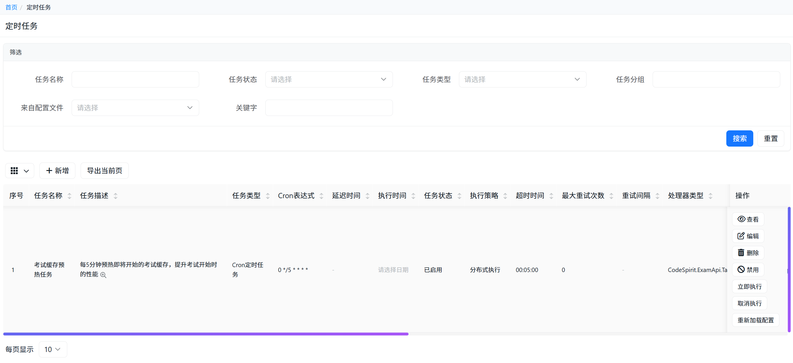

# CodeSpirit.ScheduledTasks 定时任务组件

## 概述

CodeSpirit.ScheduledTasks 是一个基于分布式缓存的定时任务组件，专为 CodeSpirit 框架设计。该组件支持分布式执行、超时终止、配置文件定义任务等功能，无需数据库依赖。

### 设计理念

- **分布式优先**: 天然支持多实例部署，自动协调任务执行
- **高可用性**: 基于Redis缓存，无单点故障
- **简单易用**: 提供简洁的API和可视化管理界面
- **可观测性**: 完整的日志记录和执行历史追踪

## 核心特性

- ✅ **基于缓存存储**: 使用Redis分布式缓存，无需数据库
- ✅ **去中心化架构**: 每个微服务独立管理自己的任务，通过HTTP端点支持跨服务触发
- ✅ **分布式执行**: 利用分布式锁确保多实例环境下任务不重复执行
- ✅ **超时终止**: 支持任务执行超时自动终止机制
- ✅ **多种任务类型**: 支持Cron表达式定时任务和延迟任务
- ✅ **配置文件定义**: 支持通过appsettings.json预定义任务
- ✅ **查询服务**: 提供专门的查询服务接口
- ✅ **AMIS管理界面**: 在Web项目中集成管理界面
- ✅ **JWT认证**: Web UI触发任务时使用JWT认证，复用现有认证体系
- ✅ **服务发现**: 自动注册任务处理器，支持动态服务发现

## 架构设计

### 整体架构（去中心化）

```
┌─────────────────┐         ┌─────────────────┐         ┌─────────────────┐
│   Web UI        │         │   ExamApi       │         │   OtherApi      │
│   (AMIS)        │         │                 │         │                 │
└─────────────────┘         └─────────────────┘         └─────────────────┘
       │                            │                            │
       │  1. 查询任务所属服务        │                            │
       │  (TaskHandlerRegistry)     │                            │
       ├────────────────────────────┼────────────────────────────┤
       │                            │                            │
       │  2. HTTP调用执行端点        │                            │
       │  POST /api/scheduled-tasks │                            │
       │  /execute/{taskId}         │                            │
       │  (JWT认证)                 │                            │
       │                            │                            │
       │  3. 执行任务               │                            │
       │  (TaskExecutor)            │                            │
       │                            │                            │
       │  后台服务                  │  后台服务                  │
       │  (ScheduledTaskBackground) │  (ScheduledTaskBackground) │
       │  扫描本服务任务            │  扫描本服务任务            │
       │  自动执行                  │  自动执行                  │
       │                            │                            │
       └────────────────────────────┴────────────────────────────┘
                            │
                    ┌───────┴────────┐
                    │  Redis Cache   │
                    │  - 任务注册表   │
                    │  - 任务定义     │
                    │  - 执行历史     │
                    │  - 分布式锁     │
                    └────────────────┘
```

### 去中心化设计优势

1. **服务自治**：每个服务独立管理自己的任务，无需中央协调
2. **无单点故障**：没有中央调度器，服务故障不影响其他服务
3. **性能优化**：每个服务只扫描自己的任务，减少Redis查询
4. **易于扩展**：新增服务只需配置ServiceName，无需修改其他服务
5. **简化维护**：代码更清晰，职责更明确



### 核心组件

#### 任务注册表 (ITaskHandlerRegistry)
- 存储任务处理器与服务名的映射关系
- 支持查询任务所属服务
- 基于Redis实现，支持分布式环境
- 服务启动时自动注册任务处理器

#### 任务执行端点 (ScheduledTaskExecutionController)
- 提供统一的HTTP执行端点：`POST /api/scheduled-tasks/execute/{taskId}`
- 使用JWT认证，复用现有认证体系
- 验证任务归属，确保安全执行
- 每个服务都提供此端点，供Web UI调用

#### 任务处理器注册服务 (TaskHandlerRegistrationService)
- 服务启动时自动扫描并注册任务处理器
- 将任务与服务的映射关系写入Redis
- 支持动态服务发现

#### 任务调度器 (ScheduledTaskBackgroundService)
- 扫描待执行任务（只扫描本服务的任务）
- 管理任务执行队列
- 处理任务超时
- 为每个任务创建独立的作用域，确保Scoped服务正确解析

#### 任务执行器 (TaskExecutor)
- 执行具体任务
- 管理执行上下文
- 处理异常和超时
- 支持并发执行和优雅终止
- 从正确的作用域中解析任务处理器和依赖服务

#### 分布式锁提供者 (IDistributedLockProvider)
- 提供分布式锁机制
- 防止任务重复执行
- 支持锁续期和自动过期

#### 缓存服务 (ICacheService)
- 存储任务定义和执行记录
- 提供高性能数据访问
- 支持数据过期策略

### 数据存储结构

```
CodeSpirit:ScheduledTasks:Tasks:{TaskId}              -> 任务定义
CodeSpirit:ScheduledTasks:Executions:{ExecId}         -> 执行记录
CodeSpirit:ScheduledTasks:Index:Active                -> 活跃任务索引
CodeSpirit:ScheduledTasks:Lock:{TaskId}               -> 分布式锁
CodeSpirit:ScheduledTasks:Registry:{ServiceName}      -> 服务任务处理器列表（新增）
CodeSpirit:ScheduledTasks:TaskService:{TaskId}        -> 任务所属服务映射（新增）
```

## 快速开始

### 1. 服务注册

在 `Program.cs` 中注册服务：

```csharp
// 添加定时任务服务（需要指定服务名称，用于任务注册和服务发现）
builder.Services.AddCodeSpiritScheduledTasks(builder.Configuration, "YourServiceName");

// 注册任务处理器（自动注册到任务注册表）
builder.Services.AddTaskHandler<YourTaskHandler>();
```

**重要说明**：
- `ServiceName` 参数用于标识当前服务，任务处理器会自动注册到该服务名下
- 每个服务只执行属于自己服务的任务
- Web UI 通过查询任务注册表找到任务所属服务，然后调用该服务的执行端点

### 2. 配置选项

在 `appsettings.json` 中添加配置：

```json
{
  "ScheduledTasks": {
    "Enabled": true,
    "ServiceName": "your-service",  // ✅ 必填：服务名称，用于任务注册和服务发现
    "DefaultTimeout": "00:30:00",
    "MaxConcurrentTasks": 10,
    "TaskCleanupInterval": "01:00:00",
    "ExecutionHistoryRetention": "7.00:00:00",
    "Tasks": [
      {
        "Id": "daily-cleanup",
        "Name": "每日清理任务",
        "Description": "清理过期数据",
        "Type": "Cron",
        "CronExpression": "0 2 * * *",
        "Timeout": "00:15:00",
        "Enabled": true,
        "HandlerType": "YourApp.Tasks.DailyCleanupTaskHandler"  // ✅ 只需类型名称，无需程序集名称
      }
    ]
  }
}
```

**配置说明**：
- `ServiceName`：必填，用于标识当前服务，任务会自动注册到该服务名下
- `HandlerType`：只需类型名称（如 `YourApp.Tasks.DailyCleanupTaskHandler`），无需包含程序集名称
- `Parameters`：JSON字符串格式，任务处理器中需要自行反序列化

### 3. 创建任务处理器

实现 `ITaskHandler` 接口：

```csharp
public class DailyCleanupTaskHandler : ITaskHandler
{
    private readonly ExamDbContext _dbContext;
    private readonly ILogger<DailyCleanupTaskHandler> _logger;

    public DailyCleanupTaskHandler(
        ExamDbContext dbContext,
        ILogger<DailyCleanupTaskHandler> logger)
    {
        _dbContext = dbContext;
        _logger = logger;
    }

    public async Task<string?> ExecuteAsync(string? parameters, CancellationToken cancellationToken = default)
    {
        _logger.LogInformation("开始执行清理任务");
        
        // 实现任务逻辑
        // 注意：DbContext等Scoped服务会自动从正确的作用域中解析
        await DoCleanupAsync(cancellationToken);
        
        _logger.LogInformation("清理任务执行完成");
        return "清理任务执行成功";
    }

    private async Task DoCleanupAsync(CancellationToken cancellationToken)
    {
        // 任务逻辑实现
        await Task.CompletedTask;
    }
}
```

注册处理器：

```csharp
// ✅ 使用 AddTaskHandler 扩展方法注册（推荐）
builder.Services.AddTaskHandler<DailyCleanupTaskHandler>();

// 或者手动注册（不推荐）
builder.Services.AddScoped<DailyCleanupTaskHandler>();
```

**重要提示**：
- 任务处理器会自动注册到任务注册表
- 使用 `AddTaskHandler<T>()` 可以确保处理器正确注册
- 任务处理器中注入的 `DbContext` 等 Scoped 服务会自动从正确的作用域中解析

## 核心概念

### 任务类型

#### Cron定时任务
使用Cron表达式定义周期性执行的任务，支持秒级精度。

**常用Cron表达式示例：**
- `0 * * * * ?` - 每分钟执行
- `0 0 * * * ?` - 每小时执行
- `0 0 2 * * ?` - 每天凌晨2点执行
- `0 0 9 ? * MON` - 每周一上午9点执行
- `0 0 0 1 * ?` - 每月1号凌晨执行

#### 延迟任务（一次性任务）
指定在某个时间点执行一次的任务，适用于定时通知、延迟处理等场景。

### 任务状态

- **Enabled**: 任务已启用，按计划执行
- **Disabled**: 任务已禁用，不会执行

### 执行状态

- **Running**: 正在执行中
- **Completed**: 执行成功完成
- **Failed**: 执行失败
- **Cancelled**: 被手动取消
- **Timeout**: 执行超时

### 分布式执行机制

组件使用分布式锁确保任务在多实例环境下不重复执行：

- **锁机制**: 基于Redis实现，使用Lua脚本保证原子性
- **锁超时**: 任务超时时间 + 30秒缓冲
- **自动释放**: 任务完成或超时后自动释放锁
- **故障转移**: 支持实例故障后的任务接管

### 超时控制

- 每个任务可配置独立的超时时间
- 超时后自动取消任务执行
- 支持优雅停止，任务可响应取消令牌
- 超时信息会记录在执行历史中

## 服务接口

### IScheduledTaskService（任务管理）

```csharp
// 任务管理
Task<ScheduledTask> CreateTaskAsync(ScheduledTask task);
Task<ScheduledTask?> UpdateTaskAsync(ScheduledTask task);
Task<bool> DeleteTaskAsync(string taskId);
Task<ScheduledTask?> GetTaskAsync(string taskId);

// 任务控制
Task<bool> EnableTaskAsync(string taskId);
Task<bool> DisableTaskAsync(string taskId);
Task<string> TriggerTaskAsync(string taskId);  // Web UI会自动查询任务所属服务并调用对应端点
Task<bool> CancelExecutionAsync(string executionId);

// 配置管理
Task<int> LoadTasksFromConfigurationAsync();  // 自动注册任务到当前服务
```

### ITaskHandlerRegistry（任务注册表）

```csharp
// 注册任务处理器
Task RegisterHandlersAsync(string serviceName, IEnumerable<string> handlerTypes);

// 注册任务所属服务
Task RegisterTaskServiceAsync(string taskId, string serviceName);

// 查询任务所属服务
Task<string?> GetTaskServiceNameAsync(string taskId);

// 检查任务是否属于服务
Task<bool> IsTaskOwnedByServiceAsync(string taskId, string serviceName);

// 获取服务的任务处理器列表
Task<List<string>> GetServiceHandlersAsync(string serviceName);
```

### HTTP执行端点

每个服务都提供了统一的执行端点，供Web UI或其他服务调用：

```http
POST /api/scheduled-tasks/execute/{taskId}
Authorization: Bearer {JWT_TOKEN}
```

**响应示例**：
```json
{
  "status": 0,
  "message": "任务已成功触发执行",
  "data": {
    "executionId": "guid-string"
  }
}
```

**错误响应**：
- `404`：任务不存在
- `400`：任务不属于当前服务 或 任务正在执行中
- `401`：未提供有效的认证令牌
- `500`：任务执行异常

### IScheduledTaskQueryService（查询服务）

```csharp
// 任务查询
Task<PageList<ScheduledTask>> GetTasksPagedAsync(TaskQueryDto queryDto);
Task<PageList<TaskExecution>> GetExecutionHistoryAsync(string taskId, QueryDtoBase queryDto);
Task<PageList<TaskExecution>> GetAllExecutionHistoryAsync(ExecutionQueryDto queryDto);
Task<List<TaskExecution>> GetRunningExecutionsAsync();

// 统计信息
Task<TaskStatistics> GetTaskStatisticsAsync();
```

## Web管理界面

组件提供了完整的基于AMIS的Web管理界面，访问路径：`/api/scheduled-tasks`

### 功能列表

#### 任务列表管理
- 📋 支持分页、搜索、筛选
- ✏️ 创建、编辑、删除任务
- 🔄 启用/禁用任务
- ▶️ 手动触发执行
- 📊 查看任务状态和下次执行时间

#### 执行历史
- 📈 查看任务执行记录
- 🕒 执行时长统计
- ❌ 错误信息查看
- 🔍 按状态、时间筛选

#### 实时监控
- 🔴 正在执行的任务
- 📊 任务统计信息（总数、成功率、失败率等）
- ⚡ 系统状态监控

#### Cron表达式工具
- ✅ Cron表达式验证器
- 📅 下次执行时间预览
- 📝 常用表达式预设

## 配置说明

### 配置选项详解

| 配置项 | 类型 | 默认值 | 说明 |
|--------|------|--------|------|
| Enabled | bool | true | 是否启用定时任务功能 |
| DefaultTimeout | TimeSpan | 00:30:00 | 默认任务超时时间 |
| MaxConcurrentTasks | int | 10 | 最大并发执行任务数 |
| TaskCleanupInterval | TimeSpan | 01:00:00 | 任务清理检查间隔 |
| ExecutionHistoryRetention | TimeSpan | 7.00:00:00 | 执行历史保留时长 |
| Tasks | array | [] | 预定义的任务列表 |

### 任务定义配置

| 字段 | 类型 | 必填 | 说明 |
|------|------|------|------|
| Id | string | 是 | 任务唯一标识 |
| Name | string | 是 | 任务名称 |
| Description | string | 否 | 任务描述 |
| Type | enum | 是 | 任务类型（Cron/OneTime） |
| CronExpression | string | 条件 | Cron表达式（Cron类型必填） |
| ScheduledTime | DateTime | 条件 | 计划执行时间（OneTime类型必填） |
| HandlerType | string | 是 | 任务处理器完整类型名称 |
| Timeout | TimeSpan | 否 | 超时时间（使用默认值） |
| Enabled | bool | 否 | 是否启用（默认true） |

## 使用场景

### 典型应用场景

1. **数据清理**: 定期清理过期数据、临时文件、日志等
2. **数据同步**: 定时从外部系统同步数据
3. **报表生成**: 定时生成日报、周报、月报
4. **健康检查**: 定期检查系统健康状态
5. **缓存预热**: 定时预热常用数据缓存
6. **消息提醒**: 定时发送通知、提醒消息
7. **数据备份**: 定期执行数据备份任务
8. **统计分析**: 定时统计分析业务数据

## 最佳实践

### 任务设计原则

1. **幂等性**: 确保任务可以安全地重复执行
2. **超时设置**: 根据任务复杂度合理设置超时时间
3. **任务拆分**: 避免单个任务执行时间过长
4. **错误处理**: 实现完善的异常处理和日志记录

### 性能优化

1. **并发控制**: 合理设置最大并发任务数
2. **执行时间**: 避免在业务高峰期执行重任务
3. **资源管理**: 及时释放资源，避免内存泄漏
4. **缓存策略**: 合理利用缓存减少数据访问

### 监控和维护

1. **日志记录**: 记录任务执行的关键信息
2. **执行历史**: 定期检查执行历史，关注失败任务
3. **性能指标**: 监控任务执行时长和成功率
4. **告警设置**: 设置任务失败告警

### 安全考虑

1. **权限控制**: 限制任务管理操作的访问权限
2. **处理器验证**: 验证任务处理器类型的合法性
3. **输入验证**: 验证Cron表达式和配置参数
4. **审计日志**: 记录任务创建、修改、删除操作

## 故障排除

### 常见问题

#### 任务不执行
**可能原因**:
- 任务未启用
- Cron表达式错误
- 任务处理器类型配置错误
- 分布式锁被其他实例持有
- ServiceName未配置或配置错误
- 任务未注册到当前服务

**排查步骤**:
1. 检查任务状态是否为 Enabled
2. 验证Cron表达式是否正确
3. 确认任务处理器类型是否注册（使用 `AddTaskHandler<T>`）
4. 检查 `ServiceName` 配置是否正确
5. 验证任务是否已注册到当前服务（查看Redis中的注册表）
6. 检查日志中的锁获取信息
7. 查看任务注册服务的日志，确认处理器注册成功

#### 任务重复执行
**可能原因**:
- 分布式锁配置问题
- Redis连接不稳定
- 实例时钟不同步

**排查步骤**:
1. 检查Redis连接状态
2. 验证分布式锁配置
3. 确认各实例时钟同步

#### 任务超时
**可能原因**:
- 超时时间设置过短
- 任务逻辑执行时间过长
- 系统资源不足

**解决方案**:
1. 调整超时时间设置
2. 优化任务执行逻辑
3. 检查系统资源使用情况

### 调试技巧

1. **启用详细日志**: 在配置中设置日志级别为 Debug
2. **查看执行历史**: 使用管理界面查看任务执行详情
3. **检查缓存状态**: 直接查询Redis中的任务数据
4. **手动触发**: 使用管理界面手动触发任务进行测试

## 技术实现要点

### 分布式锁实现
- 使用Redis SET NX EX命令实现
- 基于Lua脚本保证原子性
- 支持自动过期和锁续期

### 任务调度算法
- 采用时间轮算法实现高效调度
- 支持秒级精度的任务触发
- 内存友好的数据结构设计

### Cron表达式解析
- 使用 Cronos 库解析标准6位Cron表达式
- 支持秒、分、时、日、月、星期字段
- 提供下次执行时间计算

### 并发控制
- 使用 SemaphoreSlim 限制本地并发数
- 分布式锁防止跨实例重复执行
- 支持优雅停止和取消

## 项目结构

```
Src/Components/CodeSpirit.ScheduledTasks/
├── Models/                           # 数据模型
│   ├── ScheduledTask.cs             # 定时任务模型
│   ├── TaskExecution.cs             # 任务执行记录
│   ├── TaskStatus.cs                # 任务状态枚举
│   └── ExecutionStatus.cs           # 执行状态枚举
├── Configuration/                    # 配置选项
│   └── ScheduledTasksOptions.cs
├── Services/                         # 服务实现
│   ├── IScheduledTaskService.cs
│   ├── ScheduledTaskService.cs
│   ├── IScheduledTaskQueryService.cs
│   ├── ScheduledTaskQueryService.cs
│   ├── ITaskExecutor.cs
│   ├── TaskExecutor.cs
│   ├── ITaskHandlerRegistry.cs      # ✅ 任务注册表接口（新增）
│   └── TaskHandlerRegistry.cs       # ✅ 任务注册表实现（新增）
├── Background/                       # 后台服务
│   ├── ScheduledTaskBackgroundService.cs
│   └── TaskHandlerRegistrationService.cs  # ✅ 任务处理器注册服务（新增）
├── Controllers/                      # API控制器
│   └── ScheduledTaskExecutionController.cs # ✅ 统一执行端点（新增）
├── Extensions/                       # 扩展方法
│   └── ServiceCollectionExtensions.cs
└── Helpers/                         # 辅助类
    ├── CronHelper.cs
    └── TaskTimeoutHelper.cs
```

## 测试支持

组件包含完整的单元测试和集成测试：

```bash
# 运行测试
dotnet test Tests/Components/CodeSpirit.ScheduledTasks.Tests/
```

**测试覆盖**:
- ✅ 核心服务功能测试
- ✅ Cron表达式解析测试
- ✅ 任务执行器测试
- ✅ 分布式锁测试
- ✅ 配置加载测试
- ✅ 并发执行测试
- ✅ 任务注册表测试（新增）
- ✅ 执行端点控制器测试（新增）

## 依赖组件

- **CodeSpirit.Caching** - 提供缓存和分布式锁支持
- **CodeSpirit.Amis** - 提供Web管理界面
- **Cronos** - Cron表达式解析库

## 版本信息

- **当前版本**: v1.0.0
- **兼容框架**: .NET 10.0+
- **创建日期**: 2024年
- **开发状态**: 🎉 开发完成，生产可用

### 已实现功能
- ✅ 核心数据模型和服务
- ✅ 去中心化架构（每个服务独立管理任务）
- ✅ 分布式任务调度
- ✅ Cron表达式和延迟任务支持
- ✅ 超时控制和取消机制
- ✅ Web管理界面（支持跨服务触发）
- ✅ HTTP执行端点（JWT认证）
- ✅ 任务处理器自动注册
- ✅ 服务发现机制
- ✅ 单元测试覆盖
- ✅ 完整文档

### 未来规划
- 🔄 任务依赖关系支持
- 🔄 更丰富的重试策略
- 🔄 任务执行结果通知（邮件、webhook等）
- 🔄 更多的监控指标和告警
- 🔄 任务工作流支持
- 🔄 动态任务参数传递
- 🔄 可视化任务编辑器
- 🔄 任务执行链路追踪
- 🔄 更完善的服务发现机制

## 部署建议

### 环境要求
- **.NET 10.0+**
- **Redis 6.0+** (支持分布式锁)
- **内存**: 建议至少512MB可用内存
- **CPU**: 支持多核处理器

### 生产环境配置建议
```json
{
  "ScheduledTasks": {
    "Enabled": true,
    "DefaultTimeout": "00:30:00",
    "MaxConcurrentTasks": 20,
    "TaskCleanupInterval": "00:30:00",
    "ExecutionHistoryRetention": "30.00:00:00"
  }
}
```

### 监控建议
- 设置任务执行失败率告警（建议阈值: >5%）
- 监控Redis连接状态
- 跟踪任务执行时长趋势
- 监控内存和CPU使用情况
- 记录长时间运行的任务

## 相关资源

### 文档链接
- [CodeSpirit.Caching统一缓存组件指南](./CodeSpirit.Caching统一缓存组件指南.md)
- [CodeSpirit.Amis智能界面生成引擎](../02-UI-Generation/CodeSpirit.Amis智能界面生成引擎.md)
- [CodeSpirit.Audit分布式审计完整指南](./CodeSpirit.Audit分布式审计完整指南.md)

### 技术支持
- **项目仓库**: 提交Issue进行问题反馈
- **技术文档**: 查看相关组件文档
- **开发团队**: 内部技术支持渠道

---

