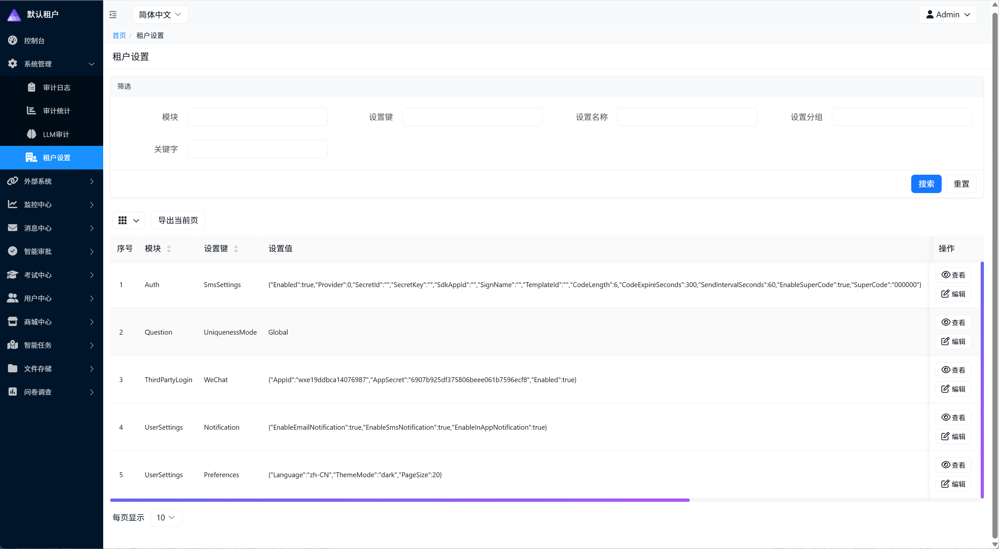

# CodeSpirit.Settings - Settings Management Component Guide

## 1. Component Overview

CodeSpirit.Settings is a comprehensive settings management component in the CodeSpirit framework, providing a complete application configuration management solution. This component supports global settings and user personalized settings management, allowing convenient centralized management of various application configurations while maintaining configuration history for auditing and rollback purposes.


### 1.1 Key Features

- **Multi-level Settings Management**: Supports global settings, user settings, module settings, organization settings, and role settings

- **Rich Setting Types**: Supports various data types including string, number, boolean, datetime, JSON, single-select, multi-select, and more

- **History Tracking**: Records setting change history, supporting version tracking and auditing

- **Batch Operations**: Supports batch import/export of settings for environment migration and backup

- **Type-safe Access**: Provides generic methods and extension methods for convenient type conversion

- **Easy Integration**: Provides simple extension methods for quick integration into existing applications

  

## 2. Quick Start

### 2.1 Basic Usage

#### Getting Settings

```csharp
// Inject settings service
private readonly ISettingsService _settingsService;

public MyService(ISettingsService settingsService)
{
    _settingsService = settingsService;
}

// Method 1: Traditional approach (requires manual module and key parameters)
var value = await _settingsService.GetGlobalSettingAsync("System", "Theme");
var userValue = await _settingsService.GetUserSettingAsync("System", "Theme", userId);
var config = await _settingsService.GetGlobalSettingAsync<AppConfig>("System", "Configuration");

// Method 2: Using SettingsDto attribute (recommended, avoids string typos)
// 1. Define DTO with attribute
[SettingsDto("System", "Theme")]
public class ThemeSettingsDto
{
    public string Theme { get; set; } = "Light";
}

// 2. Use simplified API (automatically retrieves module/key from attribute)
var themeSettings = await _settingsService.GetGlobalSettingAsync<ThemeSettingsDto>();
var userThemeSettings = await _settingsService.GetUserSettingAsync<ThemeSettingsDto>(userId);
var tenantThemeSettings = await _settingsService.GetTenantSettingAsync<ThemeSettingsDto>(tenantId);
```

#### Setting Values

```csharp
// Method 1: Traditional approach (requires manual module and key parameters)
await _settingsService.SetGlobalSettingAsync("System", "Theme", "Dark", "Update default theme");
await _settingsService.SetUserSettingAsync("System", "Theme", "Light", userId, "User preference setting");

var config = new AppConfig { /* configuration content */ };
await _settingsService.SetGlobalSettingAsync("System", "Configuration", config);

// Method 2: Using SettingsDto attribute (recommended)
[SettingsDto("System", "Theme")]
public class ThemeSettingsDto
{
    public string Theme { get; set; } = "Light";
}

var themeSettings = new ThemeSettingsDto { Theme = "Dark" };
await _settingsService.SetGlobalSettingAsync(themeSettings, "Update default theme");
await _settingsService.SetTenantSettingAsync(themeSettings, tenantId, "Tenant theme setting");
```

## 3. Core Concepts

### 3.1 Setting Item Structure

A setting item consists of the following core fields:

- **Module**: The module or functional area to which the setting belongs
- **Key**: Unique identifier for the setting
- **Value**: The actual value of the setting
- **Name**: Display name of the setting
- **Description**: Detailed description of the setting
- **ValueType**: Data type of the setting value
- **Scope**: Application scope of the setting
- **ScopeId**: When scope is not global, specifies the ID of the object to which the setting applies

### 3.2 Setting Scopes

Setting scopes define the applicability of a setting:

- **Global**: Settings applicable to the entire application
- **User**: User personalized settings
- **Module**: Module-specific settings
- **Organization**: Organization-level settings
- **Role**: Role-level settings
- **Tenant**: Tenant-level settings

### 3.3 Setting Value Types

Supports multiple setting value types to accommodate different configuration needs:

- **String**: Text type
- **Integer**: Integer type
- **Boolean**: Logical type
- **Decimal**: Floating-point number type
- **DateTime**: Date and time type
- **Json**: Complex data in JSON format
- **Select**: Single selection
- **MultiSelect**: Multiple selection
- **Password**: Encrypted password storage
- **RichText**: Rich text format
- **Color**: Color value

## 4. Advanced Features

### 4.1 Setting Definition Management

```csharp
// Create setting definition
var settingItem = new SettingItem
{
    Module = "System",
    Key = "MaxFileSize",
    Name = "Maximum File Size",
    Description = "Maximum file size limit for uploads (MB)",
    Value = "10",
    ValueType = SettingValueType.Integer,
    Scope = SettingScope.Global
};

await _settingsService.CreateOrUpdateSettingDefinitionAsync(settingItem);

// Get setting definition
var definition = await _settingsService.GetSettingDefinitionAsync("System", "MaxFileSize");
```

### 4.2 Settings History Management

```csharp
// Get setting history
var history = await _settingsService.GetSettingHistoryAsync("System", "Theme");
```

### 4.3 Tenant Settings Management

Tenant settings allow configuring independent setting values for each tenant. When a tenant setting doesn't exist, it automatically inherits the global setting.

```csharp
// Get tenant setting (returns global setting if tenant setting doesn't exist)
var tenantTheme = await _settingsService.GetTenantSettingAsync("System", "Theme", tenantId);

// Set tenant setting
await _settingsService.SetTenantSettingAsync("System", "Theme", "Dark", tenantId, "Tenant theme setting");

// Get all tenant settings (merges global and tenant settings)
var allTenantSettings = await _settingsService.GetAllTenantSettingsAsync("System", tenantId);

// Batch set tenant settings
var settings = new Dictionary<string, string>
{
    { "Theme", "Dark" },
    { "Language", "zh-CN" }
};
await _settingsService.BatchSetTenantSettingsAsync("System", settings, tenantId, "Batch update tenant settings");

// Reset tenant setting to global default
await _settingsService.ResetTenantSettingToDefaultAsync("System", "Theme", tenantId);
```

**Relationship between Tenant Settings and Global Settings:**
- Tenant settings take precedence over global settings
- If a tenant setting doesn't exist, the global setting value is automatically returned
- After resetting a tenant setting, it will revert to the global setting value
- Tenant settings are completely isolated; settings between different tenants don't affect each other

### 4.4 Settings Import/Export

```csharp
// Export settings
var exportData = await _settingsService.ExportSettingsAsync("System");

// Import settings
await _settingsService.ImportSettingsAsync("System", exportData);
```

### 4.4 Batch Settings Management

```csharp
// Batch set global settings
var settings = new Dictionary<string, string>
{
    ["Theme"] = "Dark",
    ["Language"] = "zh-CN",
    ["TimeZone"] = "Asia/Shanghai"
};

await _settingsService.BatchSetGlobalSettingsAsync("System", settings, "System initialization");

// Batch set user settings
await _settingsService.BatchSetUserSettingsAsync("System", settings, userId, "User preference initialization");
```

### 4.5 Extension Methods

You can use Settings extension methods to easily retrieve values of different types from the settings dictionary:

```csharp
// Get all settings
var allSettings = await _settingsService.GetAllGlobalSettingsAsync("System");

// Use extension methods to get typed values
int maxSize = allSettings.GetInt("MaxFileSize", 10);
bool isDarkMode = allSettings.GetBool("DarkMode", false);
decimal taxRate = allSettings.GetDecimal("TaxRate", 0.17m);
AppConfig config = allSettings.GetJson<AppConfig>("Configuration");
```

## 5. Best Practices

### 5.1 Modular Settings

Organize application settings by functional modules, for example:

- `System`: System-level configuration
- `Security`: Security-related settings
- `UI`: User interface settings
- `Notification`: Notification-related settings

### 5.2 Settings Caching

For frequently accessed settings, consider implementing a caching layer to improve performance:

```csharp
// Cache key format: {Module}:{Scope}:{ScopeId}:{Key}
var cacheKey = $"Settings:System:Global::{key}";
```

### 5.3 Using SettingsDto Attribute (Recommended)

Adding the `[SettingsDto]` attribute to settings DTOs simplifies API calls and avoids inconsistencies in module name/configuration key strings:

```csharp
// Define settings DTO
[SettingsDto("ThirdPartyLogin", "WeChat")]
public class WeChatLoginSettingsDto
{
    public string AppId { get; set; } = string.Empty;
    public string AppSecret { get; set; } = string.Empty;
    public bool Enabled { get; set; } = false;
}

// Read settings (no need to manually pass module/key)
var settings = await _settingsService.GetTenantSettingAsync<WeChatLoginSettingsDto>(tenantId);

// Save settings
await _settingsService.SetTenantSettingAsync(dto, tenantId, "Update WeChat configuration");
```

**Advantages:**
- ✅ Type-safe: Compile-time checking with IDE IntelliSense
- ✅ Centralized management: Configuration keys are defined on DTO classes, modifications only need to be made in one place
- ✅ Avoids inconsistencies: Eliminates module name/configuration key string typos
- ✅ Performance optimization: Reflection results are automatically cached, reflecting only once per type

### 5.4 Define Constants (Traditional Approach)

If using the traditional approach, define constants for commonly used setting keys to avoid hardcoding:

```csharp
public static class SettingKeys
{
    public static class System
    {
        public const string Theme = "Theme";
        public const string Language = "Language";
        public const string TimeZone = "TimeZone";
    }
}
```

## 6. Integration Examples

### 6.1 Integration with ASP.NET Core

```csharp
// Use in controller
[ApiController]
[Route("api/[controller]")]
public class SettingsController : ControllerBase
{
    private readonly ISettingsService _settingsService;
    
    public SettingsController(ISettingsService settingsService)
    {
        _settingsService = settingsService;
    }
    
    [HttpGet("global/{module}/{key}")]
    public async Task<IActionResult> GetGlobalSetting(string module, string key)
    {
        var value = await _settingsService.GetGlobalSettingAsync(module, key);
        return Ok(value);
    }
    
    [HttpGet("user/{module}/{key}")]
    public async Task<IActionResult> GetUserSetting(string module, string key)
    {
        var userId = User.FindFirst(ClaimTypes.NameIdentifier)?.Value;
        var value = await _settingsService.GetUserSettingAsync(module, key, userId);
        return Ok(value);
    }
}
```

### 6.2 Integration with CodeSpirit.Amis

You can leverage the CodeSpirit.Amis component to automatically generate settings management UI:

```csharp
// Add settings form in Amis page
[HttpGet("settings/form")]
public IActionResult GetSettingsForm()
{
    var form = new Form
    {
        Title = "System Settings",
        Mode = "horizontal",
        Controls = new List<FormControl>
        {
            new FormControlSwitch { Label = "Dark Mode", Name = "darkMode" },
            new FormControlSelect { Label = "Language", Name = "language", Options = new[] { "Chinese", "English" } },
            new FormControlNumber { Label = "Items Per Page", Name = "pageSize", Min = 10, Max = 100 }
        }
    };
    
    return Ok(form.ToAmisSchema());
}
```

## 7. Settings Management API Reference

The component provides comprehensive APIs to support various settings management operations:

### Global Settings Management
- `GetGlobalSettingAsync(string module, string key)` - Get global setting
- `GetGlobalSettingAsync<T>(string module, string key)` - Get typed global setting
- `GetGlobalSettingAsync<T>()` - Get typed global setting (automatically retrieves module/key from DTO attribute, requires `[SettingsDto]` marking)
- `GetAllGlobalSettingsAsync(string module)` - Get all global settings for a module
- `SetGlobalSettingAsync(string module, string key, string value, string? reason)` - Set global setting
- `SetGlobalSettingAsync<T>(string module, string key, T value, string? reason)` - Set typed global setting
- `SetGlobalSettingAsync<T>(T value, string? reason)` - Set typed global setting (automatically retrieves module/key from DTO attribute, requires `[SettingsDto]` marking)
- `BatchSetGlobalSettingsAsync(string module, Dictionary<string, string> settings, string? reason)` - Batch set global settings

### User Settings Management
- `GetUserSettingAsync(string module, string key, string userId)` - Get user setting
- `GetUserSettingAsync<T>(string module, string key, string userId)` - Get typed user setting
- `GetUserSettingAsync<T>(string userId)` - Get typed user setting (automatically retrieves module/key from DTO attribute, requires `[SettingsDto]` marking)
- `GetAllUserSettingsAsync(string module, string userId)` - Get all user settings
- `SetUserSettingAsync(string module, string key, string value, string userId, string? reason)` - Set user setting
- `SetUserSettingAsync<T>(string module, string key, T value, string userId, string? reason)` - Set typed user setting
- `SetUserSettingAsync<T>(T value, string userId, string? reason)` - Set typed user setting (automatically retrieves module/key from DTO attribute, requires `[SettingsDto]` marking)
- `BatchSetUserSettingsAsync(string module, Dictionary<string, string> settings, string userId, string? reason)` - Batch set user settings
- `ResetUserSettingToDefaultAsync(string module, string? key, string userId)` - Reset user setting to global default

### Tenant Settings Management
- `GetTenantSettingAsync(string module, string key, string tenantId)` - Get tenant setting
- `GetTenantSettingAsync<T>(string module, string key, string tenantId)` - Get typed tenant setting
- `GetTenantSettingAsync<T>(string tenantId)` - Get typed tenant setting (automatically retrieves module/key from DTO attribute, requires `[SettingsDto]` marking)
- `GetAllTenantSettingsAsync(string module, string tenantId)` - Get all tenant settings
- `SetTenantSettingAsync(string module, string key, string value, string tenantId, string? reason)` - Set tenant setting
- `SetTenantSettingAsync<T>(string module, string key, T value, string tenantId, string? reason)` - Set typed tenant setting
- `SetTenantSettingAsync<T>(T value, string tenantId, string? reason)` - Set typed tenant setting (automatically retrieves module/key from DTO attribute, requires `[SettingsDto]` marking)
- `BatchSetTenantSettingsAsync(string module, Dictionary<string, string> settings, string tenantId, string? reason)` - Batch set tenant settings
- `ResetTenantSettingToDefaultAsync(string module, string? key, string tenantId)` - Reset tenant setting to global default

### Settings Definition Management
- `GetSettingDefinitionAsync(string module, string key)` - Get setting definition
- `GetAllSettingDefinitionsAsync(string module)` - Get all setting definitions for a module
- `CreateOrUpdateSettingDefinitionAsync(SettingItem settingItem)` - Create or update setting definition
- `DeleteSettingDefinitionAsync(string module, string key)` - Delete setting definition

### Settings History and Import/Export
- `GetSettingHistoryAsync(string module, string key)` - Get setting history
- `ExportSettingsAsync(string module)` - Export settings
- `ImportSettingsAsync(string module, string settingsJson)` - Import settings

## 8. Summary

The CodeSpirit.Settings component provides a complete settings management solution, supporting multi-level settings, type-safe access, version history, and other features to meet configuration management needs in various application scenarios. Through this component, developers can easily implement centralized configuration management, improving application configurability and user experience.

