# CodeSpirit Configuration Center (V2.0) Architecture Overview

## Overview

CodeSpirit Configuration Center is a **distributed configuration management system tailored for the CodeSpirit framework**, based on SSE (Server-Sent Events) real-time push technology, providing centralized configuration management, real-time configuration updates, and service health monitoring capabilities.

**Design Philosophy:**
- 🎯 **Deep Framework Integration**: Seamless integration with the CodeSpirit unified startup framework, automatically loaded without developer awareness
- 🎨 **Unified Management Platform**: Manage all application configurations through a unified web interface, eliminating scattered configuration files
- 🚀 **Real-time Effectiveness**: Configuration changes are pushed to all application instances in seconds without restarting services
- 🔧 **Out-of-the-box**: Automatic integration by the unified startup framework, new services can use the configuration center with zero configuration

**Core Features:**
- ✅ **Real-time Push**: Second-level configuration change notifications based on SSE
- ✅ **Intelligent Fallback**: Automatically degrade to lightweight polling mode when SSE is unavailable
- ✅ **Lightweight SDK**: Client only depends on HTTP, no Redis/RabbitMQ required
- ✅ **Automatic Integration**: Automatically loaded by the unified startup framework, zero configuration
- ✅ **Health Monitoring**: Real-time health checks based on SSE connection status
- ✅ **Distributed Friendly**: Supports multi-instance deployment and load balancing
- ✅ **Visual Management**: Complete configuration management interface provided by the system platform

**Last Updated:** 2026-01-08 (v2.1 - Added polling fallback mechanism)

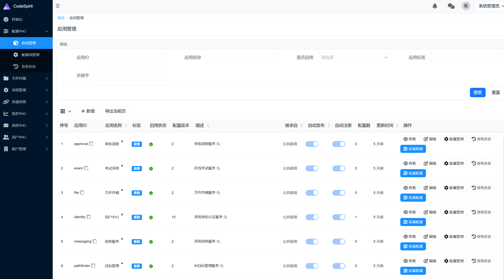

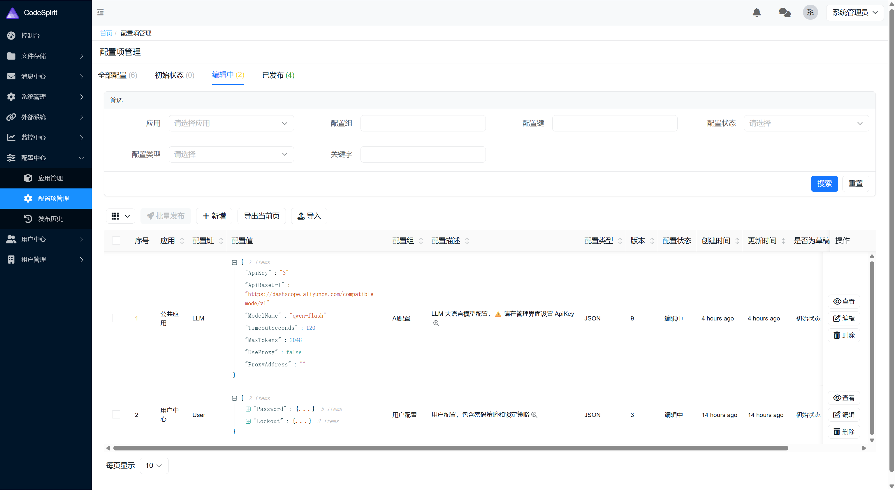

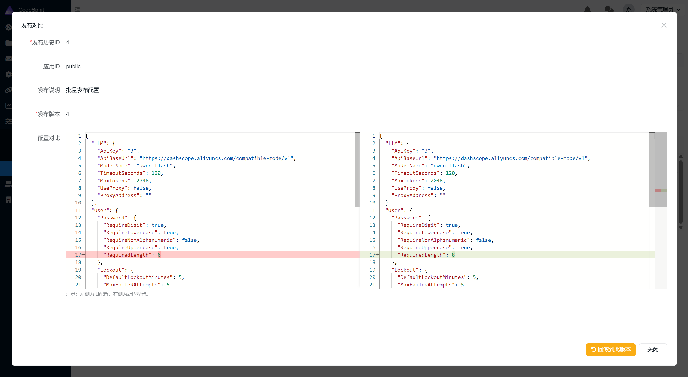

---

## System Architecture

### Overall Architecture Diagram

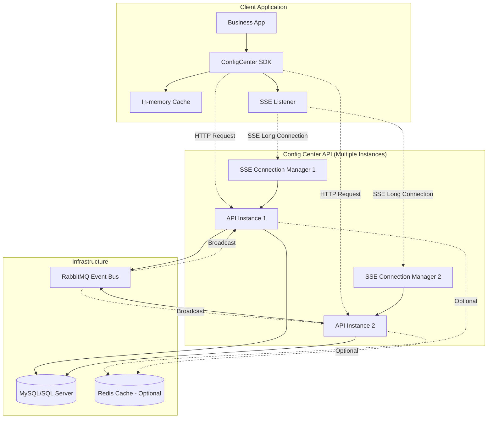

---

## Core Components

### Component Positioning and Responsibility Division

The CodeSpirit configuration management system consists of two core components, each with distinct responsibilities:

| Component | Position | Responsibilities | Deployment Location |
|-----------|----------|-------------------|---------------------|
| **Configuration Center (ConfigCenter API)** | Configuration management server | • Configuration data storage and management (CRUD)<br>• Configuration versioning and publishing process<br>• Real-time push of configuration changes (SSE)<br>• Service health status monitoring<br>• Provide management interface (system platform) | Independently deployed API service |
| **Configuration Component (ConfigCenter SDK)** | Configuration consumption client | • Pull configuration from configuration center<br>• Integrate into application configuration system (IConfiguration)<br>• Local configuration caching<br>• Real-time monitoring of configuration changes<br>• Automatic hot reload of application configuration | Integrated in business applications |

**Collaboration Flow:**
```
System Platform (UI) → Configuration Center API → EventBus → All API Instances → SSE Push → Configuration Component (SDK) → Application Configuration Hot Reload
```

### 1. Configuration Center API (Server-side)

**Position:** Centralized server-side for configuration management, providing complete lifecycle management for configurations.

**Core Responsibilities:**
- **Configuration Management**: CRUD operations, versioning, and publishing process for configuration data
- **Real-time Push**: Push configuration change events to clients via SSE
- **Connection Management**: Maintain SSE long connections with all clients
- **Event Broadcasting**: Synchronize configuration changes across multiple instances via EventBus
- **Health Monitoring**: Monitor client service health based on SSE connection status
- **Visual Interface**: Configuration management UI integrated in the system platform

**Key Services:**
- `ConfigItemService`: Configuration item management
- `SseConnectionManager`: SSE connection lifecycle management
- `ConfigChangedEventHandler`: Configuration change event handling
- `ConfigNotificationService`: Configuration change notification

**API Endpoints:**
- `GET /api/config/client/config/{appId}`: Get complete configuration
- `GET /api/config/client/config/{appId}/version`: Get configuration version (lightweight, for polling)
- `GET /api/config/client/events/{appId}`: SSE event subscription
- `POST /api/config/management/publish`: Publish configuration

### 2. ConfigCenter SDK (Client-side Component)

**Position:** Lightweight configuration client component seamlessly integrated into ASP.NET Core configuration system.

**Core Responsibilities:**
- **Configuration Integration**: Acts as ASP.NET Core Configuration Provider, injecting remote configuration into `IConfiguration`
- **Cache Management**: Memory cache configuration data, providing millisecond-level read performance
- **Real-time Monitoring**: Background service maintains SSE long connection, listening for configuration change events
- **Hot Reload**: Automatically refresh configuration when change notification received, no need to restart application
- **Automatic Integration**: Automatically loaded through the unified startup framework, zero configuration for developers

**Key Components:**
- `ConfigCenterConfigurationProvider`: ASP.NET Core configuration provider
- `InMemoryConfigCache`: In-memory cache (process-level)
- `SseEventListener`: Background SSE listening service (HostedService, supports polling fallback)
- `ConfigCenterClient`: HTTP client wrapper (includes lightweight version check API)

**Technical Advantages:**
- ✅ Lightweight: Only depends on `System.Net.Http` and `Microsoft.Extensions.Caching.Memory`
- ✅ Zero External Dependencies: No Redis or RabbitMQ client required
- ✅ High Performance: In-memory cache, configuration read <1ms
- ✅ Auto Reconnect: Automatically retry after SSE connection disconnects (5-second interval)
- ✅ Intelligent Fallback: Automatically switch to polling mode when SSE fails (configurable threshold)
- ✅ Efficient Polling: Only transmit version number (~50 bytes), fetch complete configuration only when version changes

### 3. Event Bus (Server-side)

**Responsibilities:**
- Broadcast configuration change events between API instances
- Ensure all instances synchronize and push to clients

**Event Flow:**
```
Configuration Publish → EventBus.Publish(ConfigChangedEvent) → All API Instances → Each SSE Connection Manager → Client
```

---

## Configuration Center vs Settings Component

CodeSpirit provides two configuration management solutions serving different scenarios:

| Dimension | **Configuration Center (ConfigCenter)** | **Settings Component (CodeSpirit.Settings)** |
|-----------|------------------------------------------|-----------------------------------------------|
| **Position** | Framework-level configuration management | Business-level settings management |
| **Configuration Type** | Static basic configuration | Dynamic business settings |
| **Typical Configuration** | • JWT authentication parameters<br>• LLM API keys<br>• Database connections<br>• Audit log configuration<br>• Log levels | • User theme preferences<br>• Tenant feature toggles<br>• Module parameter configuration<br>• Organization rule settings<br>• Role permission configuration |
| **Configuration Granularity** | Application-level (by AppId) | Multi-level (Global/User/Tenant/Organization/Role/Module) |
| **Change Frequency** | Low (admin operations) | High (users/tenants can configure themselves) |
| **Push Mechanism** | ✅ SSE real-time push to all instances | ❌ On-demand read, no push |
| **Integration Method** | Integrated into `IConfiguration` | Called via `ISettingsService` |
| **Automatic Hot Reload** | ✅ Configuration changes take effect automatically | ❌ Need to actively re-read |
| **Historical Versions** | ✅ Complete version control and rollback | ✅ History tracking |
| **Access Permissions** | Administrators only (system platform) | Users/tenants can configure themselves |
| **Storage Location** | Configuration center dedicated table | Business database settings table |
| **Scope of Effect** | Affects entire application runtime | Affects user experience and business logic |

### Usage Scenario Selection

#### Scenarios for Using Configuration Center (ConfigCenter):
✅ **Framework-level Basic Configuration**: Configuration that affects application startup and runtime
- JWT authentication configuration (SecretKey, Issuer, Audience)
- LLM API configuration (ApiKey, ModelName, Temperature)
- Database connection strings
- Audit log configuration (GreptimeDB connection)
- Log level configuration
- Cache configuration (Redis connection)
- Message queue configuration (RabbitMQ connection)

**Characteristics**: Need real-time push to all service instances, configuration takes effect automatically after changes

#### Scenarios for Using Settings Component (CodeSpirit.Settings):
✅ **Business-level Dynamic Settings**: Configuration that affects user experience and business logic
- User personalization settings (theme, language, timezone)
- Tenant feature toggles (enable/disable specific feature modules)
- Tenant custom configuration (Logo, brand color, company info)
- Module parameter configuration (items per page, approval process configuration)
- Organization rule settings (attendance rules, reimbursement standards)
- Role permission configuration (default permissions, data permissions)

**Characteristics**: Different users/tenants have different settings values, need multi-level inheritance and override

### Typical Example Comparison

#### Example 1: Theme Configuration

**Scenario**: User personalized theme settings

```csharp
// ❌ Should not use configuration center: User-level settings don't need push to all instances
// Configuration center is application-level, all instances share

// ✅ Should use Settings component: Supports user-level settings
[SettingsDto("UI", "Theme")]
public class ThemeSettingsDto
{
    public string Theme { get; set; } = "Light";
    public string PrimaryColor { get; set; } = "#1890ff";
}

// Get user theme settings (if user hasn't set, return global default)
var userTheme = await _settingsService.GetUserSettingAsync<ThemeSettingsDto>(userId);
```

#### Example 2: LLM API Configuration

**Scenario**: Large language model API key configuration

```csharp
// ✅ Should use configuration center: Framework-level configuration, needs real-time push
// All service instances need to use the same LLM configuration

// Configure in system platform's configuration center interface
// public app → LLM configuration items → Set ApiKey
// After publishing configuration, all service instances automatically get updates via SSE

// Read directly from IConfiguration in code (configuration center configuration is already loaded)
var apiKey = _configuration["LLM:ApiKey"];
```

#### Example 3: Tenant WeChat Login Configuration

**Scenario**: Different tenants use different WeChat AppId/AppSecret

```csharp
// ✅ Should use Settings component: Tenant-level settings, different for each tenant
[SettingsDto("ThirdPartyLogin", "WeChat")]
public class WeChatLoginSettingsDto
{
    public string AppId { get; set; } = string.Empty;
    public string AppSecret { get; set; } = string.Empty;
    public bool Enabled { get; set; } = false;
}

// Get tenant's WeChat configuration (if tenant hasn't configured, return global default)
var wechatConfig = await _settingsService.GetTenantSettingAsync<WeChatLoginSettingsDto>(tenantId);
```

### Collaborative Usage Example

In actual projects, both are usually used together:

```csharp
// Configuration Center: LLM global configuration (all tenants share the same LLM service)
// public app → LLM configuration items
{
  "ApiKey": "sk-xxxxx",
  "ApiBaseUrl": "https://dashscope.aliyuncs.com/compatible-mode/v1",
  "ModelName": "qwen-plus",
  "Temperature": 0.7
}

// Settings Component: Tenant-level AI feature toggles (tenants can choose to enable/disable AI features)
[SettingsDto("AI", "Features")]
public class AiFeaturesSettingsDto
{
    public bool EnableAiFormFill { get; set; } = true;      // Enable AI form fill
    public bool EnableSmartApproval { get; set; } = true;   // Enable smart approval
    public bool EnableAiCards { get; set; } = false;        // Enable AI cards
}

var aiFeaturesConfig = await _settingsService.GetTenantSettingAsync<AiFeaturesSettingsDto>(tenantId);

// Usage: First check if tenant enabled AI features, then use configuration center's LLM config to call API
if (aiFeaturesConfig.EnableAiFormFill)
{
    var llmApiKey = _configuration["LLM:ApiKey"];  // Read from configuration center
    // Call LLM API...
}
```

### Summary

- **Configuration Center**: Focuses on **framework-level, application-level configuration**, emphasizes **real-time push** and **automatic hot reload**
- **Settings Component**: Focuses on **business-level, multi-level settings**, emphasizes **flexibility** and **user-configurable**

They complement each other to form CodeSpirit's complete configuration management system.

---

## Configuration Migration Guide

### Unified Migration of Business Configuration to Configuration Center

To achieve centralized management and real-time updates of configurations, **CodeSpirit framework's core business configurations have been migrated from local `appsettings.json` to the configuration center**. Developers can uniformly manage these configurations through the management interface of the system platform without modifying configuration files.

### Migrated Configuration List

The following configurations have been migrated to the `public` application in the configuration center (public configuration, shared by all services):

| Configuration Item | Description | Configuration Example | Scope of Impact |
|-------------------|-------------|----------------------|-----------------|
| **JWT** | JWT authentication configuration | `SecretKey`, `Issuer`, `Audience`, `ExpiresInMinutes` | All services requiring authentication |
| **LLM** | Large language model configuration | `ApiKey`, `ApiBaseUrl`, `ModelName`, `Temperature` | AI features (smart approval, AI cards, etc.) |
| **AiFormFillLLM** | AI form fill dedicated LLM configuration | `ApiKey`, `ApiBaseUrl`, `ModelName` | AI form intelligent fill feature |
| **Audit** | Audit log configuration | `EnableAudit`, `RetentionDays`, `GreptimeDBEndpoint` | Audit log storage and query |
| **Logging** | Log level configuration | `LogLevel:Default`, `LogLevel:Microsoft` | Log output of all services |

> **💡 Development Tip**: Local `appsettings.json` has higher priority than configuration center, convenient for temporarily overriding configurations during development and debugging.

### Configuration Management Process

#### 1. Initialize Configuration (First Startup)

When starting the application for the first time, if there is no configuration data in the configuration center, the unified startup framework will:
1. **Automatically create default configuration**: Create default configuration for the `public` application in the configuration center (using framework built-in defaults)
2. **Load into application**: Load configuration into `IConfiguration`, application can start normally
3. **Prompt configuration**: Prompt developers in the configuration center interface of the system platform to supplement necessary configurations (such as LLM ApiKey)

#### 2. Modify Configuration (Runtime)

During application runtime, administrators can modify configurations through the system platform:
1. **Login to system platform**: https://localhost:7120 (account: `systemadmin` / password: `CodeSpirit@2025`)
2. **Enter configuration center**: Left menu → Configuration Center → Application Configuration → Select `public` application
3. **Edit configuration**: Click configuration item to edit, modify JSON configuration content
4. **Publish configuration**: Click "Publish" button, configuration center pushes to all services via SSE
5. **Automatic effect**: All services automatically refresh configuration after receiving push, **no restart required**

#### 3. Configuration Priority

Application configuration read priority (from high to low):
```
1. Aspire environment variables (highest) → Infrastructure configuration (database, Redis, etc.)
2. appsettings.json → Local configuration (can override configuration center)
3. Configuration center → Business configuration (default configuration source)
```

### Before and After Configuration Migration Comparison

**Before Migration (appsettings.json):**
```json
{
  "JWT": {
    "SecretKey": "your-secret-key-here-must-be-at-least-32-characters-long",
    "Issuer": "CodeSpirit",
    "Audience": "CodeSpiritApp"
  },
  "LLM": {
    "ApiKey": "sk-xxxxx",
    "ModelName": "qwen-plus"
  }
}
```

❌ **Problems**:
- Configuration scattered in multiple services' configuration files
- Modify configuration requires restarting services
- Configuration not synchronized in multi-instance deployment
- Sensitive information (e.g., ApiKey) stored in plaintext in code repository

**After Migration (Configuration Center):**
```
System Platform → Configuration Center → public application
├── JWT configuration item
│   └── {"SecretKey": "...", "Issuer": "...", "Audience": "..."}
├── LLM configuration item
│   └── {"ApiKey": "...", "ModelName": "qwen-plus", ...}
└── AiFormFillLLM configuration item
    └── {"ApiKey": "...", "ModelName": "qwen-plus", ...}
```

✅ **Advantages**:
- Centralized configuration management, unified interface operation
- Modify configuration takes effect in real-time, no restart needed
- Automatic synchronization across multiple instances
- Secure storage of sensitive information (database encryption)
- Configuration version control, supports rollback

### Development Environment Configuration Guide

> **For detailed configuration steps, please refer to**: [Development Environment Setup and Startup Guide - Configuration Management Chapter](../../Docs/01-Core-Docs/03-development-environment-setup-en.md#configuration-management)

**Quick Configuration of LLM API Key (Required):**

1. Start application and access system platform: https://localhost:7120
2. Login (`systemadmin` / `CodeSpirit@2025`)
3. Enter configuration center → Application configuration → `public` application
4. Edit `LLM` configuration item, set `ApiKey` field
5. Edit `AiFormFillLLM` configuration item, set `ApiKey` field
6. Click "Save" and "Publish" configuration
7. Refresh application page, AI features can be used

> **💡 Alibaba Cloud Tongyi Qianwen Recommendation**: Free quota during development phase is fully sufficient, see [Alibaba Cloud Tongyi Qianwen Free Experience Guide](../../Docs/01-Core-Docs/阿里云通义千问免费体验指南.md)

---

## Workflow

### 1. Application Startup Flow

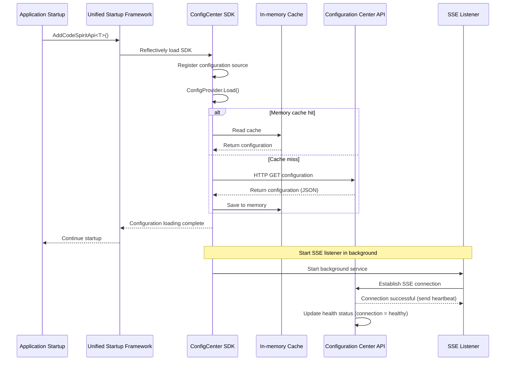

### 2. Configuration Change Push Flow

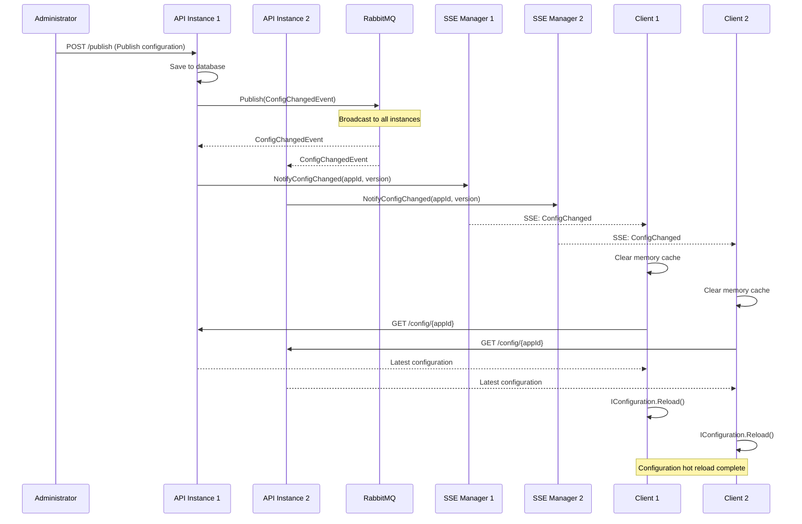

### 3. SSE Connection Lifecycle and Polling Fallback

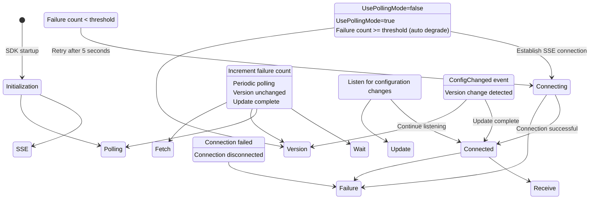

### 4. Polling Fallback Mechanism (Aspire Environment Adaptation)

**Background**: In Aspire development environment, service discovery proxy may buffer SSE responses, making real-time push unavailable.

**Solution**: SDK provides automatic downgrade capability to lightweight polling mode.

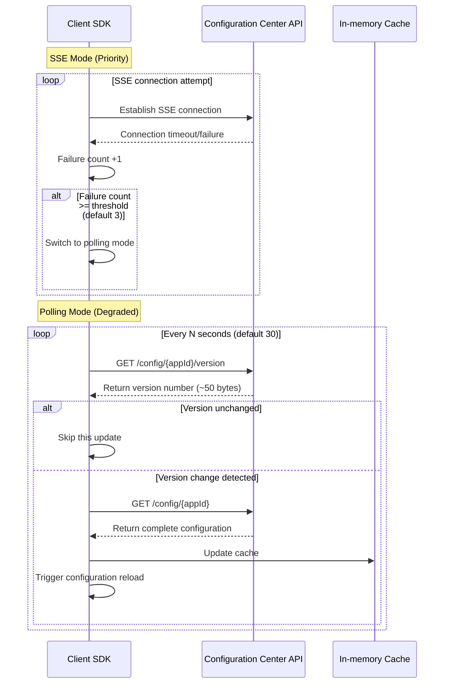

**Configuration Options:**

```json
{
  "ConfigCenter": {
    "UsePollingMode": false,
    "PollingIntervalSeconds": 30,
    "SseFailureThresholdBeforePolling": 3
  }
}
```

| Option | Description | Default Value |
|--------|-------------|---------------|
| `UsePollingMode` | Whether to directly use polling mode (skip SSE) | `false` |
| `PollingIntervalSeconds` | Polling interval (seconds) | `30` |
| `SseFailureThresholdBeforePolling` | SSE failure count before switching to polling | `3` |

**Polling Optimization:**
- ✅ **Lightweight Version Check**: Only transmit about 50 bytes each time, not complete configuration (possibly several KB)
- ✅ **On-demand Fetch**: Only fetch complete configuration when version changes
- ✅ **Reduce Pressure**: Significantly reduce server and network load compared to frequently fetching complete configuration

### 5. Health Check Mechanism

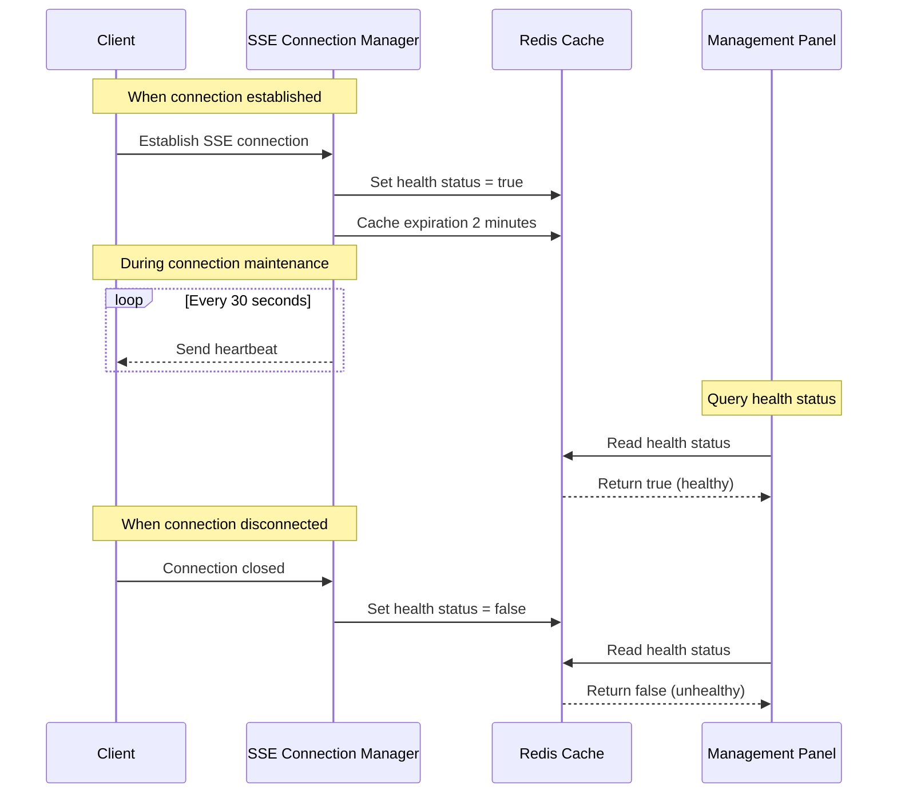

---

## Data Flow

### Configuration Read Priority

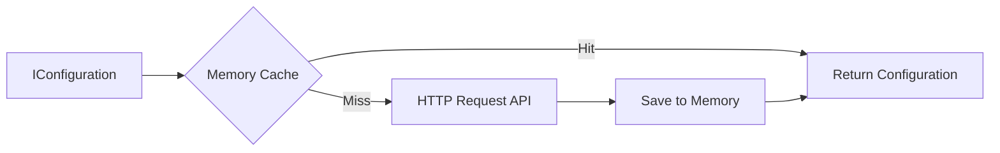

**Priority Order:**
1. **Memory Cache** (fastest, <1ms)
2. **Configuration Center API** (cache miss, 100-500ms)
3. **Local Configuration File** (fallback when API unavailable)

### Configuration Write Flow

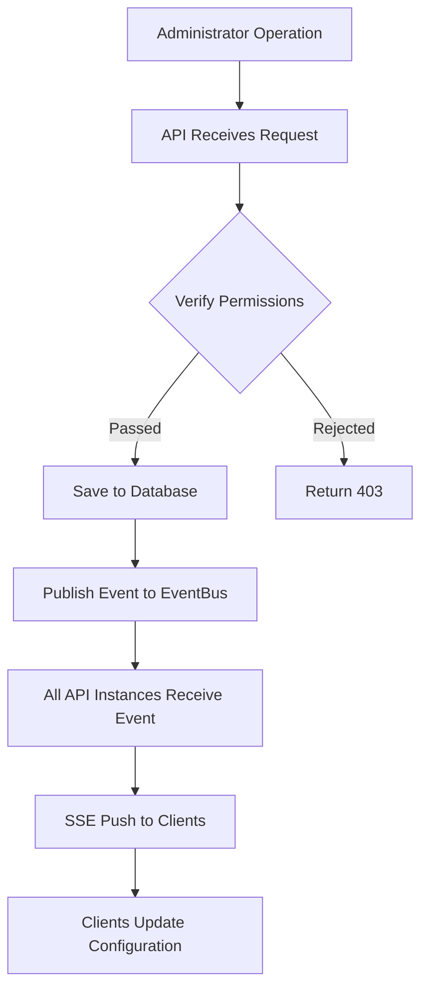

---

## Key Technical Decisions

### 1. Why Choose SSE Instead of WebSocket?

| Feature | SSE | WebSocket |
|---------|-----|-----------|
| **Communication** | Unidirectional (server→client) | Bidirectional |
| **Protocol** | HTTP | WebSocket protocol |
| **Complexity** | Simple | Complex |
| **Penetration** | Good (standard HTTP) | Poor (requires special configuration) |
| **Use Case** | Server push | Real-time bidirectional communication |

**Conclusion**: Configuration center only needs server push of configuration changes, SSE fully meets requirements and is simpler.

### 2. Why Client Uses Memory Cache Instead of Redis?

| Dimension | Memory Cache | Redis |
|-----------|--------------|-------|
| **Dependency** | No external dependency | Requires Redis service |
| **Performance** | <1ms | 1-5ms (network overhead) |
| **Complexity** | Low | Medium |
| **Distributed** | Process-level | Cross-process sharing |
| **Applicability** | Single-instance application | Distributed application |

**Conclusion**:

- Client applications typically run as single instances, no need for cross-process sharing
- Memory cache has better performance and fewer dependencies
- Configuration changes are pushed in real-time via SSE, no need for shared cache

### 3. Why Server Still Needs EventBus?

**Scenario**: Configuration center API deployed with multiple instances, clients connect to different instances

**Problem**: Configuration change request hits instance A, but clients connect to instance B

**Solution**: Use EventBus to broadcast events to all instances
- Instance A receives change request → Publish event to EventBus
- Instance B subscribes to event → Notify its SSE clients
- All clients can receive notifications

---

## Performance Characteristics

### Response Time

| Operation | Response Time | Description |
|-----------|---------------|-------------|
| Configuration read (cache hit) | <1ms | Memory read |
| Configuration read (cache miss) | 100-500ms | HTTP request |
| Configuration change push (SSE) | <1s | SSE real-time push |
| Configuration change detection (polling) | 30s | Polling interval (configurable) |
| Version check request | 10-50ms | Lightweight API (~50 bytes) |
| Complete configuration request | 100-500ms | Get all configuration items |
| SSE connection establishment | 50-200ms | HTTP handshake |
| SSE reconnection interval | 5s | Auto retry |

### Resource Consumption

**Client (per application):**
- Memory: < 1MB (configuration data)
- Connection: 1 SSE long connection (SSE mode) or no long connection (polling mode)
- CPU: Almost negligible (event-driven or scheduled polling)
- Network (polling mode): ~50 bytes/polling cycle (version check) + several KB/configuration change (on-demand)

**Server (per instance):**
- Memory: ~100MB (base framework)
- Connection: n SSE connections (n = number of SSE mode clients)
- Database connection pool: 20-100
- QPS: SSE mode negligible, polling mode = client count / polling interval

### Concurrency Capability

- **SSE connections**: Single instance supports 10,000+ concurrent connections
- **Configuration read QPS**: 10,000+ (database bottleneck)
- **Configuration push latency**: <1 second (SSE real-time push)

---

## Deployment Architecture

### Single Instance Deployment

```
┌─────────────────┐
│  Client App 1   │───SSE───┐
└─────────────────┘          │
┌─────────────────┐          ├─→ ┌──────────────────┐
│  Client App 2   │───SSE───┤   │ Config Center API │
└─────────────────┘          │   └──────────────────┘
┌─────────────────┐          │            │
│  Client App 3   │───SSE───┘            │
└─────────────────┘                       ↓
                                  ┌──────────────┐
                                  │   Database   │
                                  └──────────────┘
```

**Characteristics:**
- Simple, suitable for small deployments
- No EventBus required
- Single point of failure risk

### Multi-Instance Deployment (Recommended)

```
┌─────────────┐     ┌──────────────────┐
│ Clients 1-3 │─SSE─│ API Instance 1   │
└─────────────┘     └──────────────────┘
                             │
┌─────────────┐              ↓
│   Load      │     ┌──────────────────┐
│  Balancer   │     │ EventBus(RabbitMQ)│
└─────────────┘     └──────────────────┘
      ↑                      ↑
      │                      │
┌─────────────┐              │
│ Clients 4-6 │─SSE─┌──────────────────┐
└─────────────┘     │ API Instance 2   │
                    └──────────────────┘
                             │
                             ↓
                    ┌──────────────────┐
                    │ Database + Redis │
                    └──────────────────┘
```

**Characteristics:**
- High availability, no single point of failure
- Horizontal scaling
- Requires EventBus for synchronization

---

## Security

### Authentication and Authorization

- **Client SDK**: No authentication required (intranet access)
- **Management API**: JWT authentication + permission control
- **SSE endpoint**: Anonymous access allowed (AppId-based isolation)

### Data Encryption

- **Transmission encryption**: HTTPS (production environment)
- **Sensitive configuration**: Encrypted storage in database
- **Configuration versioning**: Prevent configuration rollback attacks

### Multi-tenant Isolation

- Data isolation based on `AppId`
- Configuration items grouped by application
- SSE connections managed by `AppId`

---

## Operations Monitoring

### Health Check

- **Endpoint**: `/health`
- **Metrics**: Database connection, Redis connection, SSE connection count
- **Status**: Real-time health monitoring based on SSE connection status

### Logging

**Key Logs:**
- Configuration load success/failure
- SSE connection establishment/disconnection
- Configuration change push
- Health status change

**Log Levels:**
- `Information`: Normal operations
- `Warning`: Connection disconnection, retry
- `Error`: Configuration load failure, API exception

### Metrics Monitoring

**Recommended Monitoring Items:**
- SSE connection count (by AppId)
- Configuration read QPS
- Configuration push latency
- API response time
- Database query time

---

## Fault Handling

### Common Failure Scenarios

| Failure | Impact | Recovery Mechanism |
|---------|--------|-------------------|
| API unavailable | New applications start using local configuration | Degrade to local configuration |
| SSE connection disconnected | Cannot receive real-time push | Auto reconnect after 5 seconds, switch to polling after 3 failures |
| SSE buffered by proxy (Aspire) | SSE functionality unavailable | Auto switch to polling mode |
| Database unavailable | API cannot read/write configuration | Applications continue using cached configuration |
| EventBus unavailable | Multi-instance push not synchronized | Single instance can still push normally |
| Network jitter | SSE brief disconnection or polling failure | Auto reconnect/next polling + reload configuration |

### Degradation Strategy

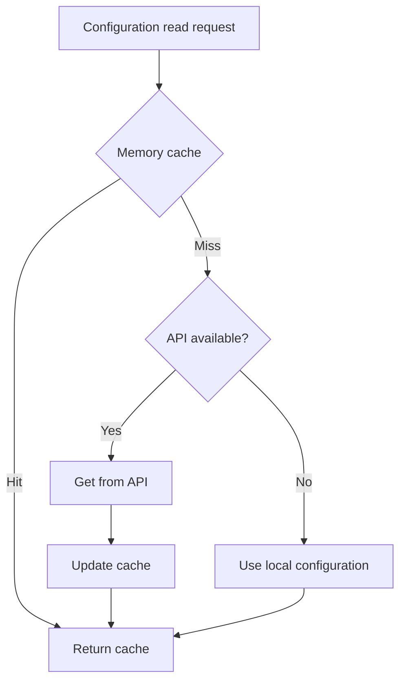

---

## Related Documentation

### Configuration Center Related
- [Configuration Center SDK Integration Summary](./config-center-sdk-integration-summary-en.md)
- [Configuration Center SDK Auto Integration Guide](./config-center-sdk-auto-integration-en.md)
- [Development Environment Setup and Startup Guide - Configuration Management Chapter](../01-Core-Docs/03-development-environment-setup-en.md#configuration-management)

### Settings Component Related
- [CodeSpirit.Settings Settings Management Component Usage Guide](./codespirit-settings-guide-en.md) - Business-level multi-level settings management

### Framework Specifications
- [Unified Startup Framework Specification](../../.cursor/rules/startup-framework.mdc)
- [API Design Specification](../../.cursor/rules/api-design.mdc)

---

## Changelog

- **2026-01-08 v2.1**: Added polling fallback mechanism
  - Added lightweight version check API (`GET /config/{appId}/version`)
  - SDK supports automatic downgrade to polling mode when SSE fails
  - Optimized polling efficiency: only transmit version number, fetch complete configuration on-demand
  - Adapt to Aspire environment (service discovery proxy buffers SSE)
  - Added configurable polling parameters (interval, failure threshold)
  - Cascade update child application version numbers (when parent app publishes)
- **2026-01-08 v2.0**: First created architecture overview document
  - Latest architecture based on SSE real-time push
  - Detailed system components and workflows
  - Added performance characteristics and deployment architecture
  - Added technical decisions and fault handling descriptions
