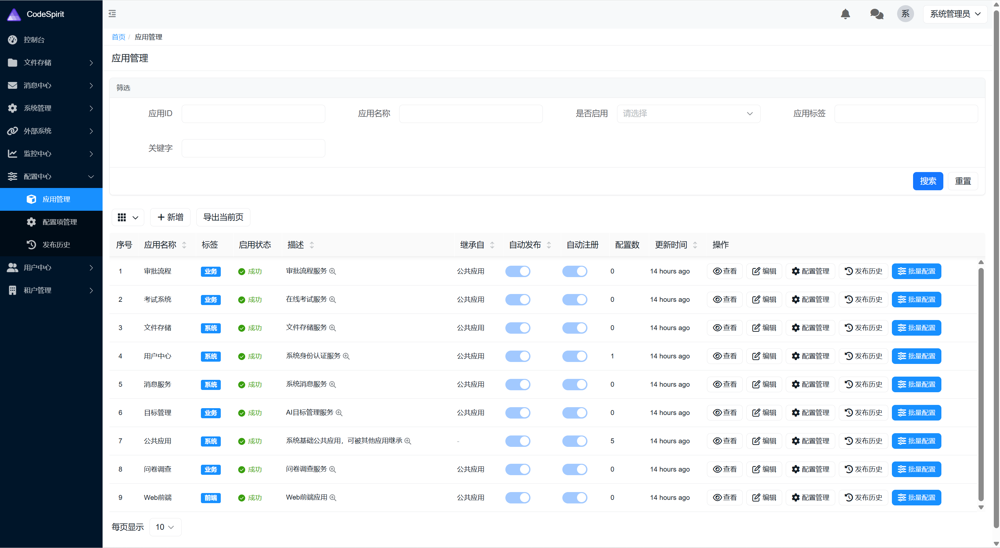
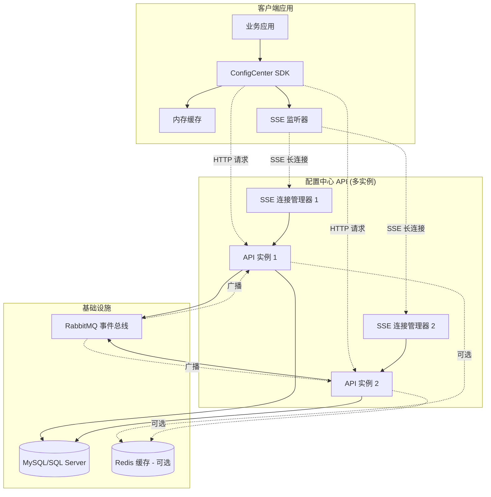
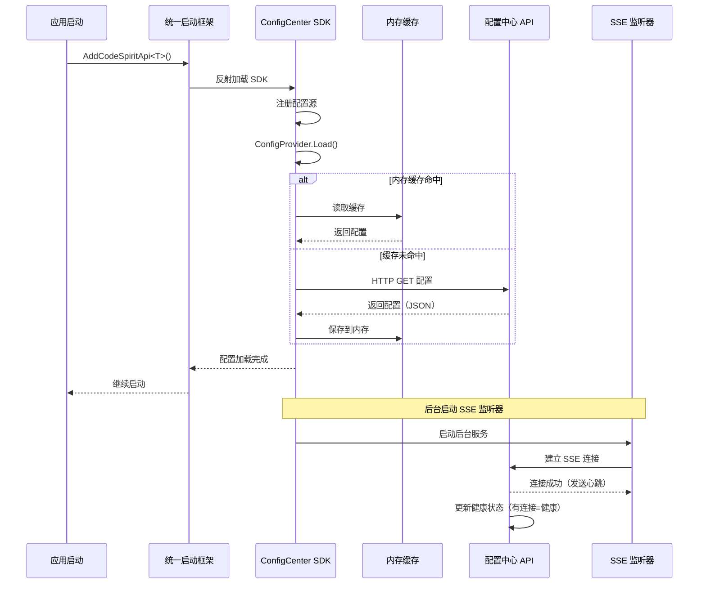
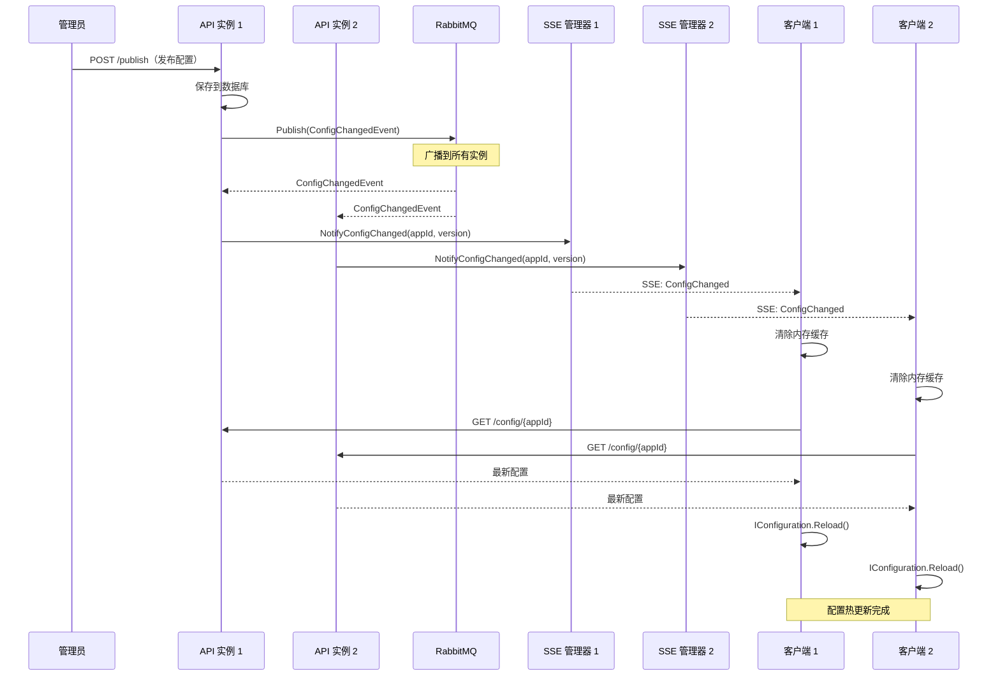
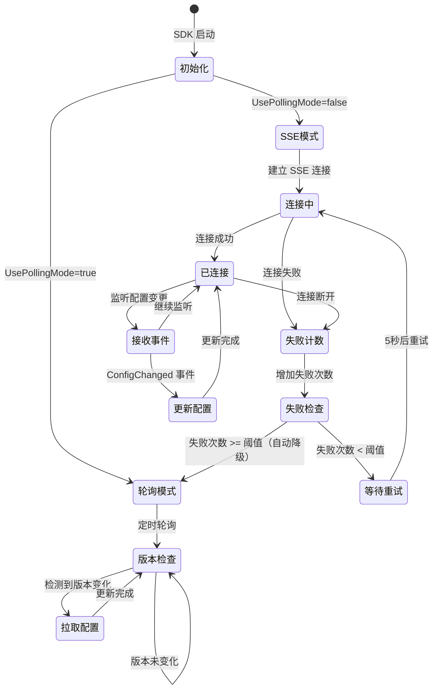
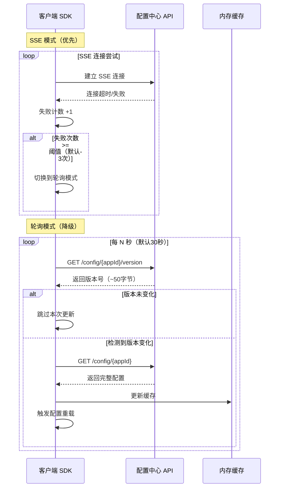
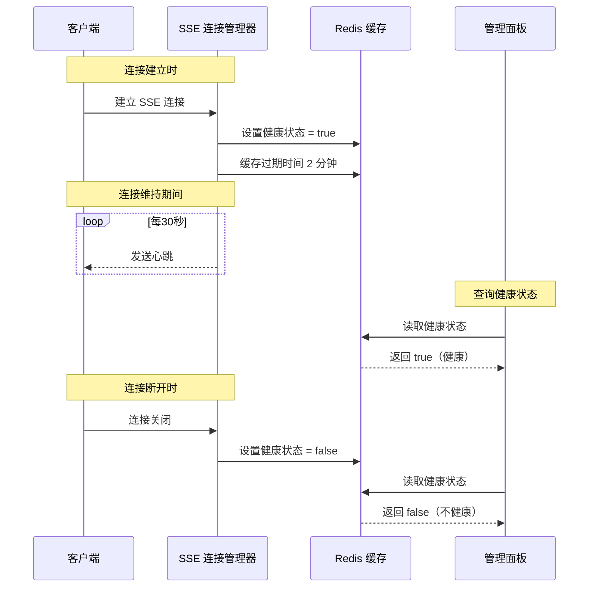
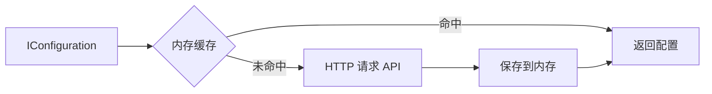
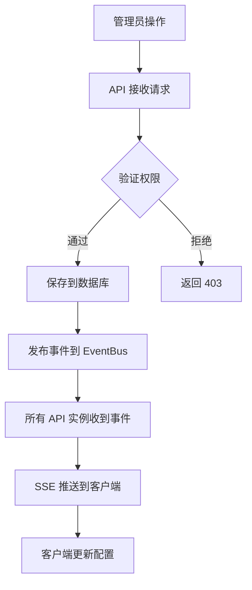
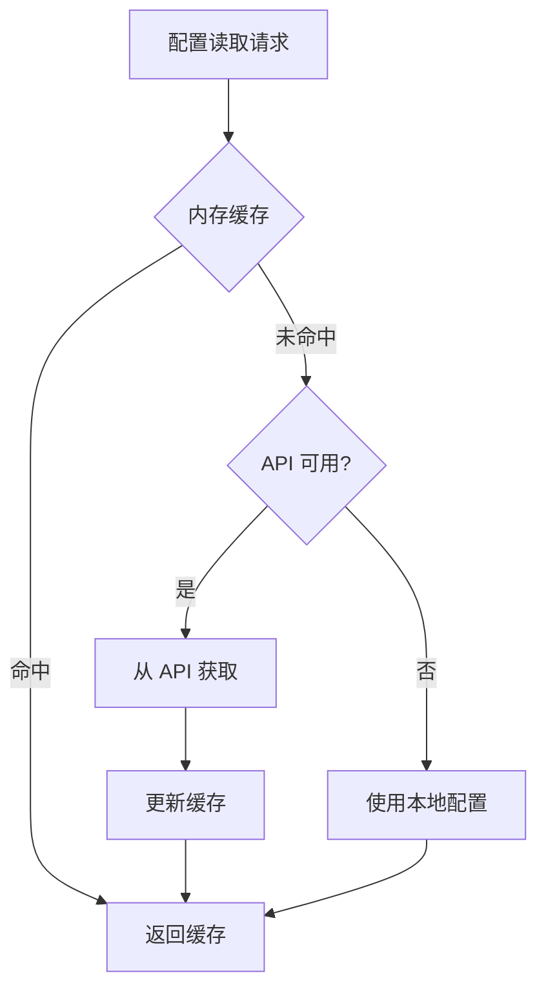

# CodeSpirit 配置中心（V2.0）架构概览

## 概述

CodeSpirit 配置中心是**专为 CodeSpirit 框架量身定制**的分布式配置管理系统，基于 SSE（Server-Sent Events）实时推送技术，提供集中化配置管理、实时配置更新和服务健康监控能力。

**设计理念：**
- 🎯 **框架深度集成**：与 CodeSpirit 统一启动框架无缝整合，开发者无感知自动加载
- 🎨 **统一管理平台**：通过系统平台 Web 界面统一管理所有应用配置，告别分散的配置文件
- 🚀 **实时生效**：配置变更秒级推送到所有应用实例，无需重启服务
- 🔧 **开箱即用**：统一启动框架自动集成，新服务零配置即可使用配置中心

**核心特点：**
- ✅ **实时推送**：基于 SSE 的秒级配置变更通知
- ✅ **智能回退**：SSE 不可用时自动降级到轻量级轮询模式
- ✅ **轻量级 SDK**：客户端仅依赖 HTTP，无需 Redis/RabbitMQ
- ✅ **自动集成**：统一启动框架自动加载，零配置
- ✅ **健康监控**：基于 SSE 连接状态的实时健康检查
- ✅ **分布式友好**：支持多实例部署和负载均衡
- ✅ **可视化管理**：系统平台提供完整的配置管理界面

**最后更新：** 2026-01-08（v2.1 - 新增轮询回退机制）




---

## 系统架构

### 总体架构图



---

## 核心组件

### 组件定位与职责划分

CodeSpirit 配置管理体系由两个核心组件组成，各司其职：

| 组件 | 定位 | 职责 | 部署位置 |
|------|------|------|----------|
| **配置中心（ConfigCenter API）** | 配置管理服务端 | • 配置数据的存储与管理（CRUD）<br>• 配置版本控制与发布流程<br>• 实时推送配置变更（SSE）<br>• 服务健康状态监控<br>• 提供管理界面（系统平台） | 独立部署的 API 服务 |
| **配置组件（ConfigCenter SDK）** | 配置消费客户端 | • 从配置中心拉取配置<br>• 集成到应用配置系统（IConfiguration）<br>• 本地配置缓存<br>• 实时监听配置变更<br>• 自动热更新应用配置 | 集成在业务应用中 |

**协作流程：**
```
系统平台（UI） → 配置中心 API → EventBus → 所有 API 实例 → SSE 推送 → 配置组件（SDK） → 应用配置热更新
```

### 1. 配置中心 API（服务端）

**定位：** 配置管理的集中式服务端，提供配置的完整生命周期管理。

**核心职责：**
- **配置管理**：配置数据的 CRUD 操作、版本控制、发布流程
- **实时推送**：通过 SSE 向客户端推送配置变更事件
- **连接管理**：维护与所有客户端的 SSE 长连接
- **事件广播**：通过 EventBus 在多实例间同步配置变更
- **健康监控**：基于 SSE 连接状态监控客户端服务健康
- **可视化界面**：集成在系统平台中的配置管理 UI

**关键服务：**
- `ConfigItemService`: 配置项管理
- `SseConnectionManager`: SSE 连接生命周期管理
- `ConfigChangedEventHandler`: 配置变更事件处理
- `ConfigNotificationService`: 配置变更通知

**API 端点：**
- `GET /api/config/client/config/{appId}`: 获取完整配置
- `GET /api/config/client/config/{appId}/version`: 获取配置版本（轻量级，用于轮询）
- `GET /api/config/client/events/{appId}`: SSE 事件订阅
- `POST /api/config/management/publish`: 发布配置

### 2. ConfigCenter SDK（客户端组件）

**定位：** 轻量级的配置客户端组件，无缝集成到 ASP.NET Core 配置系统。

**核心职责：**
- **配置集成**：作为 ASP.NET Core Configuration Provider，将远程配置注入 `IConfiguration`
- **缓存管理**：内存缓存配置数据，提供毫秒级读取性能
- **实时监听**：后台服务维护 SSE 长连接，监听配置变更事件
- **热更新**：收到变更通知后自动刷新配置，无需重启应用
- **自动集成**：通过统一启动框架自动加载，开发者零配置使用

**关键组件：**
- `ConfigCenterConfigurationProvider`: ASP.NET Core 配置提供程序
- `InMemoryConfigCache`: 内存缓存（进程级）
- `SseEventListener`: 后台 SSE 监听服务（HostedService，支持轮询回退）
- `ConfigCenterClient`: HTTP 客户端封装（含轻量级版本检查API）

**技术优势：**
- ✅ 轻量级：仅依赖 `System.Net.Http` 和 `Microsoft.Extensions.Caching.Memory`
- ✅ 零外部依赖：无需 Redis 或 RabbitMQ 客户端
- ✅ 高性能：内存缓存，配置读取 <1ms
- ✅ 自动重连：SSE 连接断开自动重试（5秒间隔）
- ✅ 智能回退：SSE 失败自动切换到轮询模式（可配置阈值）
- ✅ 高效轮询：仅传输版本号（~50字节），版本变化时才拉取完整配置

### 3. 事件总线（服务端）

**职责：**
- 配置变更事件在 API 实例间广播
- 确保所有实例同步推送给客户端

**事件流：**
```
配置发布 → EventBus.Publish(ConfigChangedEvent) → 所有 API 实例 → 各自的 SSE 连接管理器 → 客户端
```

---

## 配置中心 vs Settings 组件

CodeSpirit 提供了两套配置管理方案，分别服务于不同的场景：

| 维度 | **配置中心（ConfigCenter）** | **Settings 组件（CodeSpirit.Settings）** |
|------|---------------------------|----------------------------------------|
| **定位** | 框架级配置管理 | 业务级设置管理 |
| **配置类型** | 静态基础配置 | 动态业务设置 |
| **典型配置** | • JWT 认证参数<br>• LLM API 密钥<br>• 数据库连接<br>• 审计日志配置<br>• 日志级别 | • 用户主题偏好<br>• 租户功能开关<br>• 模块参数配置<br>• 组织规则设置<br>• 角色权限配置 |
| **配置粒度** | 应用级（按 AppId） | 多级（全局/用户/租户/组织/角色/模块） |
| **变更频率** | 低（管理员操作） | 高（用户/租户可自行配置） |
| **推送机制** | ✅ SSE 实时推送到所有实例 | ❌ 按需读取，无推送 |
| **集成方式** | 集成到 `IConfiguration` | 通过 `ISettingsService` 调用 |
| **自动热更新** | ✅ 配置变更自动生效 | ❌ 需主动重新读取 |
| **历史版本** | ✅ 完整版本控制和回滚 | ✅ 历史记录追踪 |
| **访问权限** | 仅管理员（系统平台） | 用户/租户可自行配置 |
| **存储位置** | 配置中心专用表 | 业务数据库设置表 |
| **作用范围** | 影响整个应用运行 | 影响用户体验和业务逻辑 |

### 使用场景选择

#### 使用配置中心（ConfigCenter）的场景：
✅ **框架级基础配置**：影响应用启动和运行的配置
- JWT 认证配置（SecretKey、Issuer、Audience）
- LLM API 配置（ApiKey、ModelName、Temperature）
- 数据库连接字符串
- 审计日志配置（GreptimeDB 连接）
- 日志级别配置
- 缓存配置（Redis 连接）
- 消息队列配置（RabbitMQ 连接）

**特点**：需要实时推送到所有服务实例，配置变更后自动生效

#### 使用 Settings 组件（CodeSpirit.Settings）的场景：
✅ **业务级动态设置**：影响用户体验和业务逻辑的配置
- 用户个性化设置（主题、语言、时区）
- 租户功能开关（启用/禁用某个功能模块）
- 租户自定义配置（Logo、品牌色、公司信息）
- 模块参数配置（每页显示数、审批流程配置）
- 组织规则设置（考勤规则、报销标准）
- 角色权限配置（默认权限、数据权限）

**特点**：不同用户/租户有不同的设置值，需要多级继承和覆盖

### 典型示例对比

#### 示例 1：主题配置

**场景**：用户个性化主题设置

```csharp
// ❌ 不应使用配置中心：用户级设置不需要推送到所有实例
// 配置中心是应用级配置，所有实例共享

// ✅ 应使用 Settings 组件：支持用户级设置
[SettingsDto("UI", "Theme")]
public class ThemeSettingsDto
{
    public string Theme { get; set; } = "Light";
    public string PrimaryColor { get; set; } = "#1890ff";
}

// 获取用户主题设置（如果用户未设置，返回全局默认值）
var userTheme = await _settingsService.GetUserSettingAsync<ThemeSettingsDto>(userId);
```

#### 示例 2：LLM API 配置

**场景**：大语言模型 API 密钥配置

```csharp
// ✅ 应使用配置中心：框架级配置，需要实时推送
// 所有服务实例都需要使用相同的 LLM 配置

// 在系统平台的配置中心界面配置
// public 应用 → LLM 配置项 → 设置 ApiKey
// 配置发布后，所有服务实例通过 SSE 自动获取更新

// 在代码中直接从 IConfiguration 读取（已自动加载配置中心的配置）
var apiKey = _configuration["LLM:ApiKey"];
```

#### 示例 3：租户微信登录配置

**场景**：不同租户使用不同的微信 AppId/AppSecret

```csharp
// ✅ 应使用 Settings 组件：租户级设置，每个租户不同
[SettingsDto("ThirdPartyLogin", "WeChat")]
public class WeChatLoginSettingsDto
{
    public string AppId { get; set; } = string.Empty;
    public string AppSecret { get; set; } = string.Empty;
    public bool Enabled { get; set; } = false;
}

// 获取租户的微信配置（如果租户未配置，返回全局默认配置）
var wechatConfig = await _settingsService.GetTenantSettingAsync<WeChatLoginSettingsDto>(tenantId);
```

### 协同使用示例

在实际项目中，两者通常协同使用：

```csharp
// 配置中心：LLM 全局配置（所有租户共享同一个 LLM 服务）
// public 应用 → LLM 配置项
{
  "ApiKey": "sk-xxxxx",
  "ApiBaseUrl": "https://dashscope.aliyuncs.com/compatible-mode/v1",
  "ModelName": "qwen-plus",
  "Temperature": 0.7
}

// Settings 组件：租户级 AI 功能开关（租户可以选择启用/禁用 AI 功能）
[SettingsDto("AI", "Features")]
public class AiFeaturesSettingsDto
{
    public bool EnableAiFormFill { get; set; } = true;      // 启用 AI 表单填充
    public bool EnableSmartApproval { get; set; } = true;   // 启用智能审批
    public bool EnableAiCards { get; set; } = false;        // 启用 AI 卡片
}

var aiFeaturesConfig = await _settingsService.GetTenantSettingAsync<AiFeaturesSettingsDto>(tenantId);

// 使用：先检查租户是否启用 AI 功能，再使用配置中心的 LLM 配置调用 API
if (aiFeaturesConfig.EnableAiFormFill)
{
    var llmApiKey = _configuration["LLM:ApiKey"];  // 从配置中心读取
    // 调用 LLM API...
}
```

### 总结

- **配置中心**：专注于**框架级、应用级配置**，强调**实时推送**和**自动热更新**
- **Settings 组件**：专注于**业务级、多级设置**，强调**灵活性**和**用户可配置**

两者互补，共同构成 CodeSpirit 完整的配置管理体系。

---

## 配置迁移说明

### 业务配置统一迁移到配置中心

为了实现配置的集中化管理和实时更新，**CodeSpirit 框架的核心业务配置已从本地 `appsettings.json` 迁移到配置中心**。开发者可以通过系统平台的管理界面统一管理这些配置，无需修改配置文件。

### 已迁移配置列表

以下配置已迁移到配置中心的 `public` 应用（公共配置，所有服务共享）：

| 配置项 | 说明 | 配置示例 | 影响范围 |
|-------|------|---------|----------|
| **JWT** | JWT 认证配置 | `SecretKey`、`Issuer`、`Audience`、`ExpiresInMinutes` | 所有需要身份认证的服务 |
| **LLM** | 大语言模型配置 | `ApiKey`、`ApiBaseUrl`、`ModelName`、`Temperature` | AI 功能（智能审批、AI 卡片等） |
| **AiFormFillLLM** | AI 表单填充专用 LLM 配置 | `ApiKey`、`ApiBaseUrl`、`ModelName` | AI 表单智能填充功能 |
| **Audit** | 审计日志配置 | `EnableAudit`、`RetentionDays`、`GreptimeDBEndpoint` | 审计日志存储与查询 |
| **Logging** | 日志级别配置 | `LogLevel:Default`、`LogLevel:Microsoft` | 所有服务的日志输出 |

> **💡 开发提示**：本地 `appsettings.json` 优先级高于配置中心，方便开发调试时临时覆盖配置。

### 配置管理流程

#### 1. 初始化配置（首次启动）

首次启动应用时，如果配置中心中没有配置数据，统一启动框架会：
1. **自动创建默认配置**：在配置中心创建 `public` 应用的默认配置（使用框架内置的默认值）
2. **加载到应用**：将配置加载到 `IConfiguration`，应用可以正常启动
3. **提示配置**：在系统平台的配置中心界面提示开发者补充必要配置（如 LLM ApiKey）

#### 2. 修改配置（运行时）

应用运行期间，管理员可以通过系统平台修改配置：
1. **登录系统平台**：https://localhost:7120（账号：`systemadmin` / 密码：`CodeSpirit@2025`）
2. **进入配置中心**：左侧菜单 → 配置中心 → 应用配置 → 选择 `public` 应用
3. **编辑配置**：点击配置项编辑，修改 JSON 配置内容
4. **发布配置**：点击「发布」按钮，配置中心通过 SSE 推送到所有服务
5. **自动生效**：所有服务收到推送后自动刷新配置，**无需重启**

#### 3. 配置优先级

应用配置读取优先级（从高到低）：
```
1. Aspire 环境变量（最高）  → 基础设施配置（数据库、Redis等）
2. appsettings.json        → 本地配置（可覆盖配置中心）
3. 配置中心                → 业务配置（默认配置源）
```

### 配置迁移前后对比

**迁移前（appsettings.json）：**
```json
{
  "JWT": {
    "SecretKey": "your-secret-key-here-must-be-at-least-32-characters-long",
    "Issuer": "CodeSpirit",
    "Audience": "CodeSpiritApp"
  },
  "LLM": {
    "ApiKey": "sk-xxxxx",
    "ModelName": "qwen-plus"
  }
}
```

❌ **问题**：
- 配置分散在多个服务的配置文件中
- 修改配置需要重启服务
- 多实例部署时配置不同步
- 敏感信息（如 ApiKey）明文存储在代码仓库

**迁移后（配置中心）：**
```
系统平台 → 配置中心 → public 应用
├── JWT 配置项
│   └── {"SecretKey": "...", "Issuer": "...", "Audience": "..."}
├── LLM 配置项
│   └── {"ApiKey": "...", "ModelName": "qwen-plus", ...}
└── AiFormFillLLM 配置项
    └── {"ApiKey": "...", "ModelName": "qwen-plus", ...}
```

✅ **优势**：
- 配置集中管理，统一界面操作
- 修改配置实时生效，无需重启
- 多实例自动同步
- 敏感信息安全存储（数据库加密）
- 配置版本控制，支持回滚

### 开发环境配置指南

> **详细配置步骤请参考**：[开发环境搭建及启动指南 - 配置管理章节](../../Docs/01-Core-Docs/03-development-environment-setup-zh-CN.md#配置管理)

**快速配置 LLM API 密钥（必需）：**

1. 启动应用后访问系统平台：https://localhost:7120
2. 登录（`systemadmin` / `CodeSpirit@2025`）
3. 进入配置中心 → 应用配置 → `public` 应用
4. 编辑 `LLM` 配置项，设置 `ApiKey` 字段
5. 编辑 `AiFormFillLLM` 配置项，设置 `ApiKey` 字段
6. 点击「保存」并「发布」配置
7. 刷新应用页面，AI 功能即可使用

> **💡 阿里云通义千问推荐**：开发阶段免费额度完全够用，详见 [阿里云通义千问免费体验指南](../../Docs/01-Core-Docs/阿里云通义千问免费体验指南.md)

---

## 工作流程

### 1. 应用启动流程



### 2. 配置变更推送流程



### 3. SSE 连接生命周期与轮询回退



### 4. 轮询回退机制（Aspire 环境适配）

**背景：** 在 Aspire 开发环境中，服务发现代理可能缓冲 SSE 响应，导致实时推送不可用。

**解决方案：** SDK 提供自动降级到轻量级轮询模式的能力。



**配置选项：**

```json
{
  "ConfigCenter": {
    "UsePollingMode": false,
    "PollingIntervalSeconds": 30,
    "SseFailureThresholdBeforePolling": 3
  }
}
```

| 选项 | 说明 | 默认值 |
|------|------|--------|
| `UsePollingMode` | 是否直接使用轮询模式（跳过 SSE） | `false` |
| `PollingIntervalSeconds` | 轮询间隔（秒） | `30` |
| `SseFailureThresholdBeforePolling` | SSE 失败多少次后自动切换到轮询 | `3` |

**轮询优化：**
- ✅ **轻量级版本检查**：每次仅传输约 50 字节，而非完整配置（可能数 KB）
- ✅ **按需拉取**：仅当版本变化时才拉取完整配置
- ✅ **降低压力**：相比频繁拉取完整配置，显著降低服务器和网络负载

### 5. 健康检查机制



---

## 数据流

### 配置读取优先级



**优先级顺序：**
1. **内存缓存**（最快，<1ms）
2. **配置中心 API**（缓存未命中，100-500ms）
3. **本地配置文件**（API 不可用时降级）

### 配置写入流程



---

## 关键技术决策

### 1. 为什么选择 SSE 而非 WebSocket？

| 特性 | SSE | WebSocket |
|------|-----|-----------|
| **通信方式** | 单向（服务端→客户端） | 双向 |
| **协议** | HTTP | WebSocket 协议 |
| **复杂度** | 简单 | 复杂 |
| **穿透性** | 好（标准 HTTP） | 较差（需特殊配置） |
| **适用场景** | 服务端推送 | 实时双向通信 |

**结论：** 配置中心只需服务端推送配置变更，SSE 完全满足需求且更简单。

### 2. 为什么客户端使用内存缓存而非 Redis？

| 维度 | 内存缓存 | Redis |
|------|---------|-------|
| **依赖** | 无外部依赖 | 需 Redis 服务 |
| **性能** | <1ms | 1-5ms（网络开销） |
| **复杂度** | 低 | 中等 |
| **分布式** | 进程级 | 跨进程共享 |
| **适用性** | 单实例应用 | 分布式应用 |

**结论：** 

- 客户端应用通常单实例运行，无需跨进程共享
- 内存缓存性能更好，依赖更少
- 配置变更通过 SSE 实时推送，无需共享缓存

### 3. 为什么服务端仍需 EventBus？

**场景：** 配置中心 API 多实例部署，客户端连接分散在不同实例

**问题：** 配置变更请求打到实例 A，但客户端连接在实例 B

**解决方案：** 使用 EventBus 广播事件到所有实例
- 实例 A 收到变更请求 → 发布事件到 EventBus
- 实例 B 订阅事件 → 通知自己的 SSE 客户端
- 所有客户端都能收到通知

---

## 性能特点

### 响应时间

| 操作 | 响应时间 | 说明 |
|------|---------|------|
| 配置读取（缓存命中） | <1ms | 内存读取 |
| 配置读取（缓存未命中） | 100-500ms | HTTP 请求 |
| 配置变更推送（SSE） | <1s | SSE 实时推送 |
| 配置变更检测（轮询） | 30s | 轮询间隔（可配置） |
| 版本检查请求 | 10-50ms | 轻量级 API（~50字节） |
| 完整配置请求 | 100-500ms | 获取所有配置项 |
| SSE 连接建立 | 50-200ms | HTTP 握手 |
| SSE 重连间隔 | 5s | 自动重试 |

### 资源消耗

**客户端（每应用）：**
- 内存：< 1MB（配置数据）
- 连接：1 个 SSE 长连接（SSE 模式）或无长连接（轮询模式）
- CPU：几乎可忽略（事件驱动或定时轮询）
- 网络（轮询模式）：~50 字节/轮询周期（版本检查）+ 数 KB/配置变更（按需）

**服务端（每实例）：**
- 内存：~100MB（基础框架）
- 连接：n 个 SSE 连接（n = SSE 模式客户端数量）
- 数据库连接池：20-100 个
- QPS：SSE 模式忽略不计，轮询模式 = 客户端数 / 轮询间隔

### 并发能力

- **SSE 连接数**：单实例支持 10,000+ 并发连接
- **配置读取 QPS**：10,000+（数据库瓶颈）
- **配置推送延迟**：<1 秒（SSE 实时推送）

---

## 部署架构

### 单实例部署

```
┌─────────────────┐
│  客户端应用 1   │───SSE───┐
└─────────────────┘          │
┌─────────────────┐          ├─→ ┌──────────────────┐
│  客户端应用 2   │───SSE───┤   │ 配置中心 API     │
└─────────────────┘          │   └──────────────────┘
┌─────────────────┐          │            │
│  客户端应用 3   │───SSE───┘            │
└─────────────────┘                       ↓
                                  ┌──────────────┐
                                  │   数据库     │
                                  └──────────────┘
```

**特点：**
- 简单，适合小型部署
- 无需 EventBus
- 单点故障风险

### 多实例部署（推荐）

```
┌─────────────┐     ┌──────────────────┐
│ 客户端 1-3  │─SSE─│ API 实例 1       │
└─────────────┘     └──────────────────┘
                             │
┌─────────────┐              ↓
│ 负载均衡器  │     ┌──────────────────┐
└─────────────┘     │ EventBus(RabbitMQ)│
      ↑             └──────────────────┘
      │                      ↑
┌─────────────┐              │
│ 客户端 4-6  │─SSE─┌──────────────────┐
└─────────────┘     │ API 实例 2       │
                    └──────────────────┘
                             │
                             ↓
                    ┌──────────────────┐
                    │   数据库 + Redis │
                    └──────────────────┘
```

**特点：**
- 高可用，无单点故障
- 水平扩展
- 需要 EventBus 同步

---

## 安全性

### 认证与授权

- **客户端 SDK**：无需认证（内网访问）
- **管理 API**：JWT 认证 + 权限控制
- **SSE 端点**：允许匿名（基于 AppId 隔离）

### 数据加密

- **传输加密**：HTTPS（生产环境）
- **敏感配置**：数据库加密存储
- **配置版本**：防止配置回滚攻击

### 多租户隔离

- 基于 `AppId` 的数据隔离
- 配置项按应用分组
- SSE 连接按 `AppId` 管理

---

## 运维监控

### 健康检查

- **端点**：`/health`
- **指标**：数据库连接、Redis 连接、SSE 连接数
- **状态**：基于 SSE 连接状态的实时健康监控

### 日志

**关键日志：**
- 配置加载成功/失败
- SSE 连接建立/断开
- 配置变更推送
- 健康状态变更

**日志级别：**
- `Information`: 正常操作
- `Warning`: 连接断开、重试
- `Error`: 配置加载失败、API 异常

### 指标监控

**推荐监控项：**
- SSE 连接数（按 AppId）
- 配置读取 QPS
- 配置推送延迟
- API 响应时间
- 数据库查询耗时

---

## 故障处理

### 常见故障场景

| 故障 | 影响 | 恢复机制 |
|------|------|---------|
| API 不可用 | 新应用启动使用本地配置 | 降级到本地配置 |
| SSE 连接断开 | 无法接收实时推送 | 5秒后自动重连，3次失败后切换轮询 |
| SSE 被代理缓冲（Aspire） | SSE 功能不可用 | 自动切换到轮询模式 |
| 数据库不可用 | API 无法读写配置 | 应用继续使用缓存配置 |
| EventBus 不可用 | 多实例推送不同步 | 单实例仍可正常推送 |
| 网络抖动 | SSE 短暂断开或轮询失败 | 自动重连/下次轮询 + 重新加载配置 |

### 降级策略



---

## 相关文档

### 配置中心相关
- [配置中心 SDK 统一集成总结](./config-center-sdk-integration-summary-zh-CN.md)
- [配置中心 SDK 自动集成说明](./config-center-sdk-auto-integration-zh-CN.md)
- [开发环境搭建及启动指南 - 配置管理章节](../01-Core-Docs/03-development-environment-setup-zh-CN.md#配置管理)

### Settings 组件相关
- [CodeSpirit.Settings 设置管理组件使用指南](./codespirit-settings-guide-zh-CN.md) - 业务级多级设置管理

### 框架规范
- [统一启动框架规范](../../.cursor/rules/startup-framework.mdc)
- [API 设计规范](../../.cursor/rules/api-design.mdc)

---

## 更新日志

- **2026-01-08 v2.1**: 新增轮询回退机制
  - 新增轻量级版本检查 API（`GET /config/{appId}/version`）
  - SDK 支持 SSE 失败自动降级到轮询模式
  - 优化轮询效率：仅传输版本号，按需拉取完整配置
  - 适配 Aspire 环境（服务发现代理缓冲 SSE）
  - 添加可配置的轮询参数（间隔、失败阈值）
  - 级联更新子应用版本号（父应用发布时）
- **2026-01-08 v2.0**: 首次创建架构概览文档
  - 基于 SSE 实时推送的最新架构
  - 详细说明系统组件和工作流程
  - 补充性能特点和部署架构
  - 添加技术决策和故障处理说明

