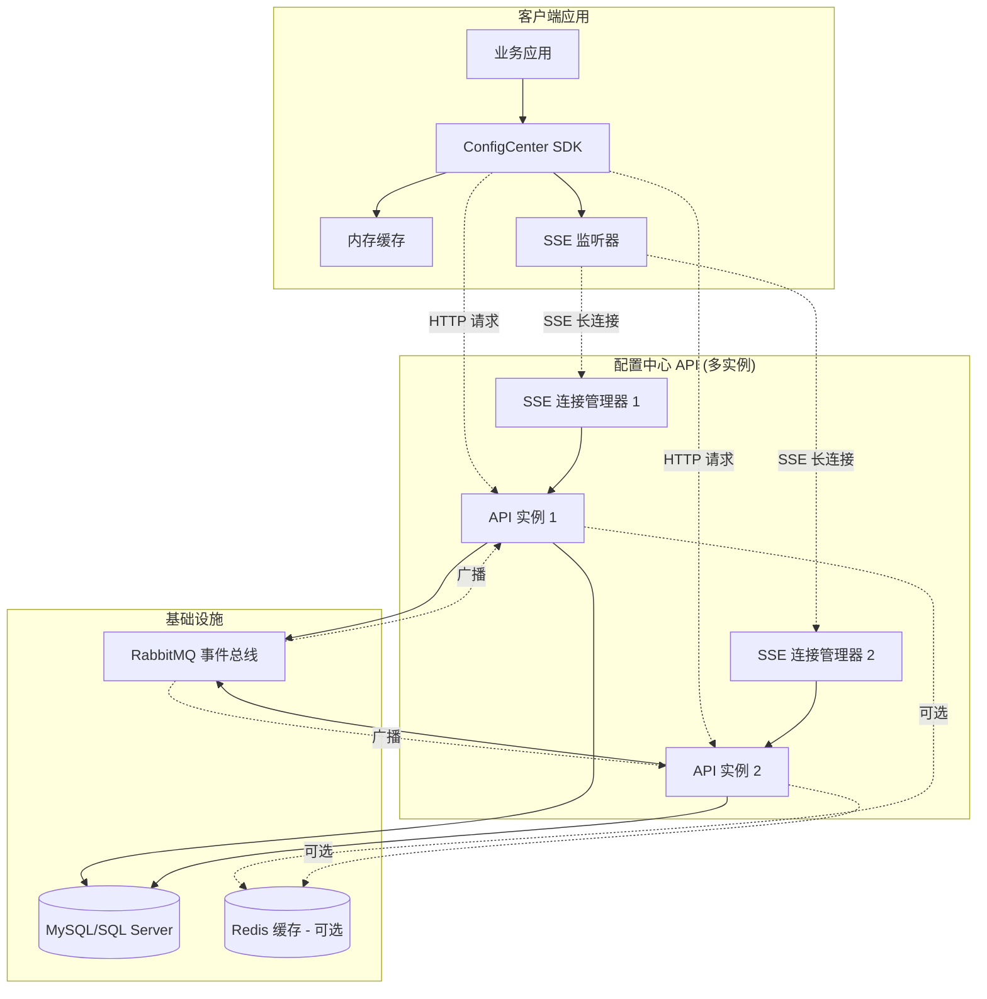
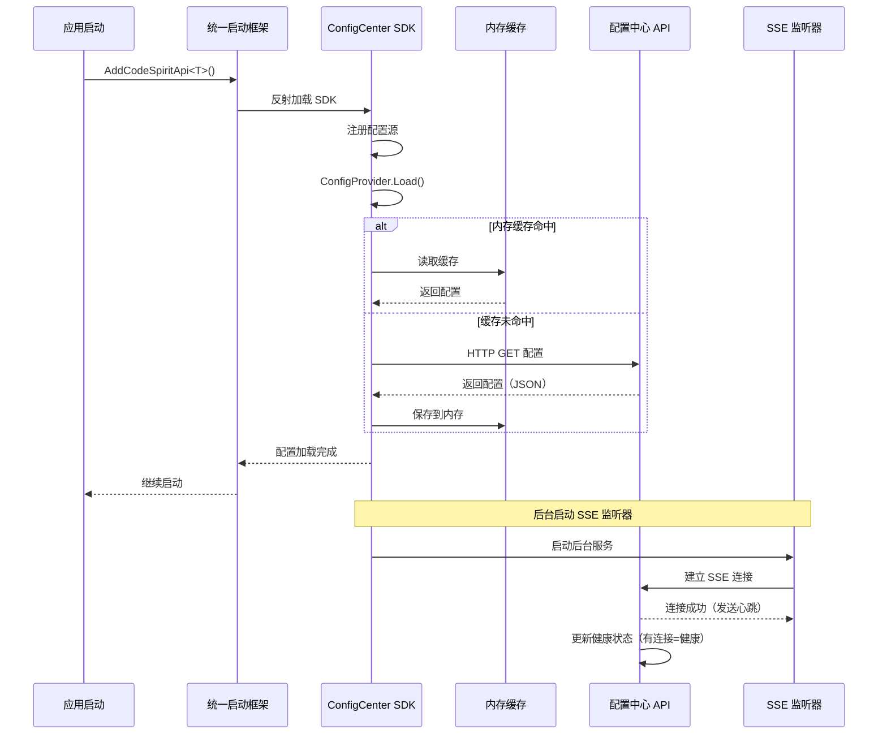
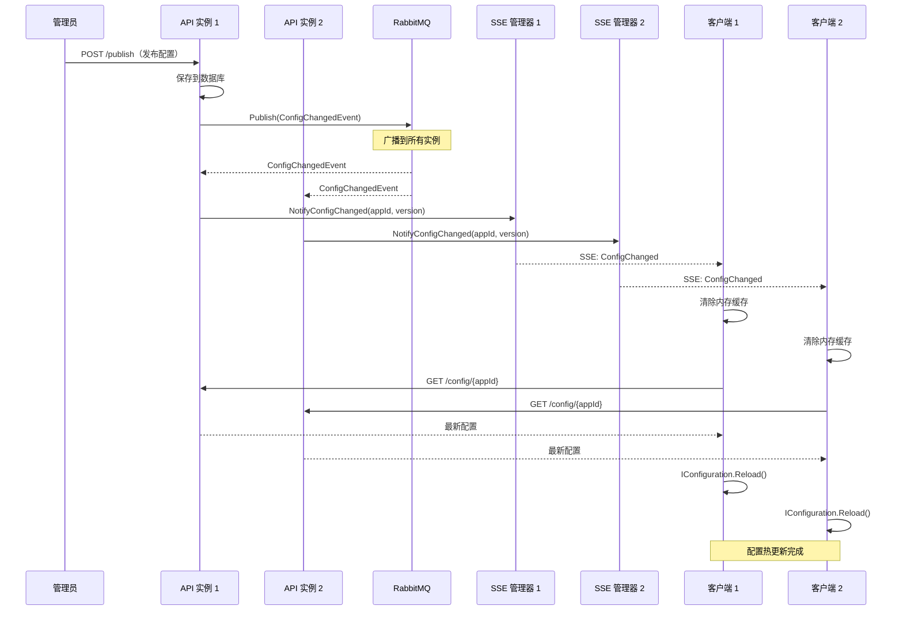
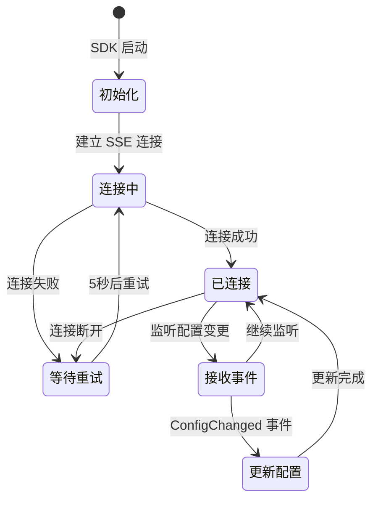
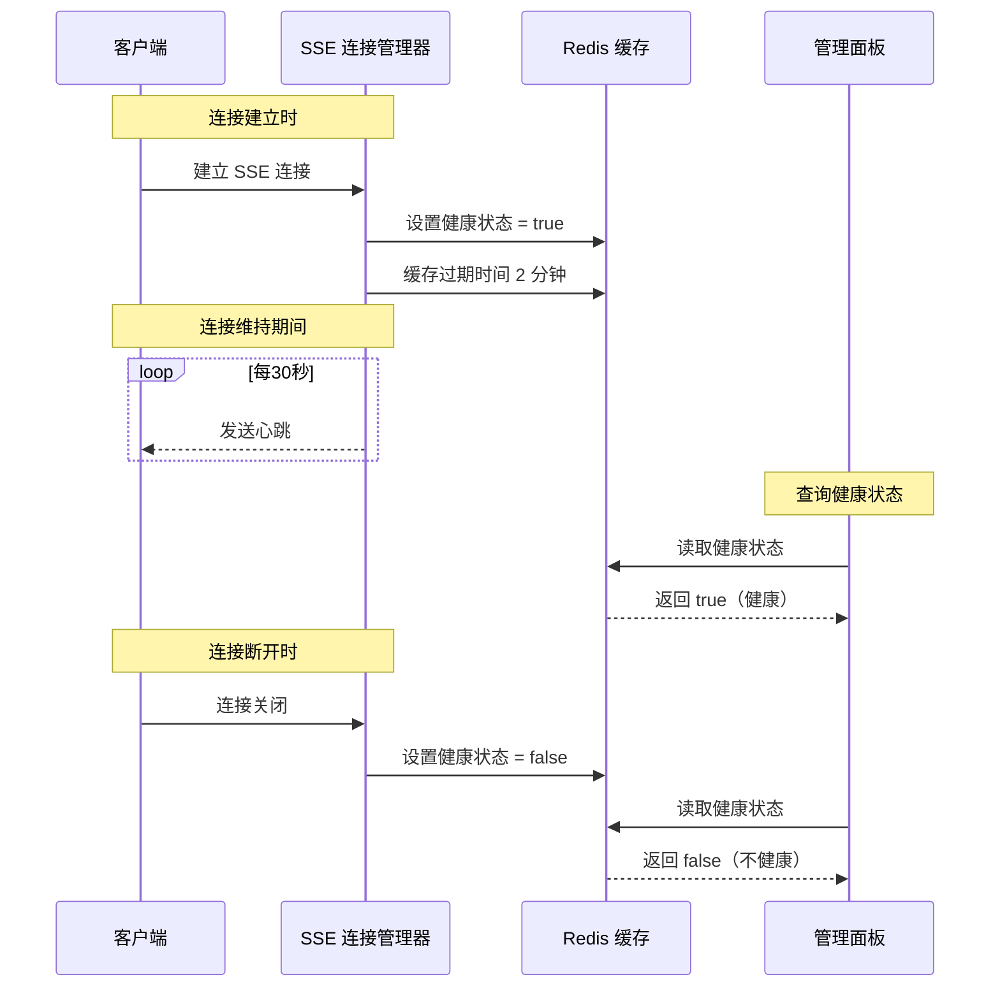
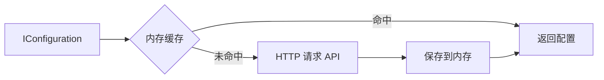
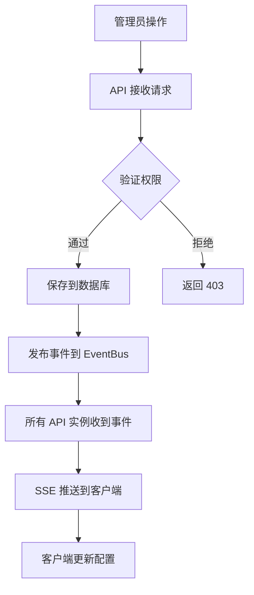
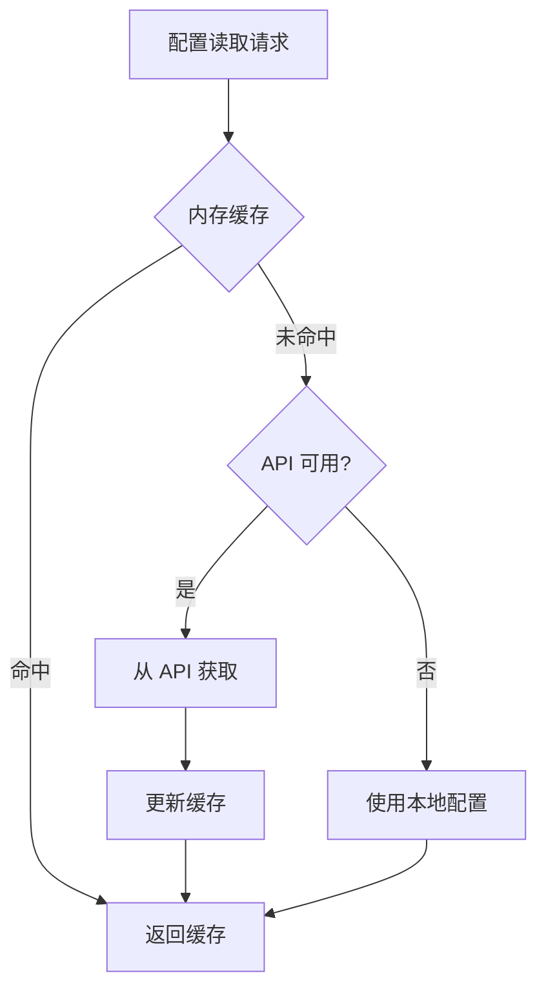

# CodeSpirit 配置中心架构概览

## 概述

CodeSpirit 配置中心是一个基于 SSE（Server-Sent Events）实时推送的分布式配置管理系统，提供集中化配置管理、实时配置更新和服务健康监控能力。

**核心特点：**
- ✅ **实时推送**：基于 SSE 的秒级配置变更通知
- ✅ **轻量级 SDK**：客户端仅依赖 HTTP，无需 Redis/RabbitMQ
- ✅ **自动集成**：统一启动框架自动加载，零配置
- ✅ **健康监控**：基于 SSE 连接状态的实时健康检查
- ✅ **分布式友好**：支持多实例部署和负载均衡

**最后更新：** 2026-01-08

---

## 系统架构

### 总体架构图



---

## 核心组件

### 1. 配置中心 API

**职责：**
- 配置数据的 CRUD 操作
- SSE 连接管理
- 配置变更事件广播
- 服务健康状态管理

**关键服务：**
- `ConfigItemService`: 配置项管理
- `SseConnectionManager`: SSE 连接生命周期管理
- `ConfigChangedEventHandler`: 配置变更事件处理
- `ConfigNotificationService`: 配置变更通知

**API 端点：**
- `GET /api/config/client/{appId}`: 获取配置
- `GET /api/config/client/events/{appId}`: SSE 事件订阅
- `POST /api/config/management/publish`: 发布配置

### 2. ConfigCenter SDK

**职责：**
- 配置加载和缓存
- SSE 连接维护
- 配置热更新

**关键组件：**
- `ConfigCenterConfigurationProvider`: ASP.NET Core 配置提供程序
- `InMemoryConfigCache`: 内存缓存
- `SseEventListener`: 后台 SSE 监听服务
- `ConfigCenterClient`: HTTP 客户端

**依赖：**
- ✅ `System.Net.Http`（HTTP 客户端）
- ✅ `Microsoft.Extensions.Caching.Memory`（内存缓存）
- ❌ 无需 Redis 客户端
- ❌ 无需 RabbitMQ 客户端

### 3. 事件总线（服务端）

**职责：**
- 配置变更事件在 API 实例间广播
- 确保所有实例同步推送给客户端

**事件流：**
```
配置发布 → EventBus.Publish(ConfigChangedEvent) → 所有 API 实例 → 各自的 SSE 连接管理器 → 客户端
```

---

## 工作流程

### 1. 应用启动流程



### 2. 配置变更推送流程



### 3. SSE 连接生命周期



### 4. 健康检查机制



---

## 数据流

### 配置读取优先级



**优先级顺序：**
1. **内存缓存**（最快，<1ms）
2. **配置中心 API**（缓存未命中，100-500ms）
3. **本地配置文件**（API 不可用时降级）

### 配置写入流程



---

## 关键技术决策

### 1. 为什么选择 SSE 而非 WebSocket？

| 特性 | SSE | WebSocket |
|------|-----|-----------|
| **通信方式** | 单向（服务端→客户端） | 双向 |
| **协议** | HTTP | WebSocket 协议 |
| **复杂度** | 简单 | 复杂 |
| **穿透性** | 好（标准 HTTP） | 较差（需特殊配置） |
| **适用场景** | 服务端推送 | 实时双向通信 |

**结论：** 配置中心只需服务端推送配置变更，SSE 完全满足需求且更简单。

### 2. 为什么客户端使用内存缓存而非 Redis？

| 维度 | 内存缓存 | Redis |
|------|---------|-------|
| **依赖** | 无外部依赖 | 需 Redis 服务 |
| **性能** | <1ms | 1-5ms（网络开销） |
| **复杂度** | 低 | 中等 |
| **分布式** | 进程级 | 跨进程共享 |
| **适用性** | 单实例应用 | 分布式应用 |

**结论：** 
- 客户端应用通常单实例运行，无需跨进程共享
- 内存缓存性能更好，依赖更少
- 配置变更通过 SSE 实时推送，无需共享缓存

### 3. 为什么服务端仍需 EventBus？

**场景：** 配置中心 API 多实例部署，客户端连接分散在不同实例

**问题：** 配置变更请求打到实例 A，但客户端连接在实例 B

**解决方案：** 使用 EventBus 广播事件到所有实例
- 实例 A 收到变更请求 → 发布事件到 EventBus
- 实例 B 订阅事件 → 通知自己的 SSE 客户端
- 所有客户端都能收到通知

---

## 性能特点

### 响应时间

| 操作 | 响应时间 | 说明 |
|------|---------|------|
| 配置读取（缓存命中） | <1ms | 内存读取 |
| 配置读取（缓存未命中） | 100-500ms | HTTP 请求 |
| 配置变更推送 | <1s | SSE 推送 |
| SSE 连接建立 | 50-200ms | HTTP 握手 |
| SSE 重连间隔 | 5s | 自动重试 |

### 资源消耗

**客户端（每应用）：**
- 内存：< 1MB（配置数据）
- 连接：1 个 SSE 长连接
- CPU：几乎可忽略（事件驱动）

**服务端（每实例）：**
- 内存：~100MB（基础框架）
- 连接：n 个 SSE 连接（n = 客户端数量）
- 数据库连接池：20-100 个

### 并发能力

- **SSE 连接数**：单实例支持 10,000+ 并发连接
- **配置读取 QPS**：10,000+（数据库瓶颈）
- **配置推送延迟**：<1 秒（SSE 实时推送）

---

## 部署架构

### 单实例部署

```
┌─────────────────┐
│  客户端应用 1   │───SSE───┐
└─────────────────┘          │
┌─────────────────┐          ├─→ ┌──────────────────┐
│  客户端应用 2   │───SSE───┤   │ 配置中心 API     │
└─────────────────┘          │   └──────────────────┘
┌─────────────────┐          │            │
│  客户端应用 3   │───SSE───┘            │
└─────────────────┘                       ↓
                                  ┌──────────────┐
                                  │   数据库     │
                                  └──────────────┘
```

**特点：**
- 简单，适合小型部署
- 无需 EventBus
- 单点故障风险

### 多实例部署（推荐）

```
┌─────────────┐     ┌──────────────────┐
│ 客户端 1-3  │─SSE─│ API 实例 1       │
└─────────────┘     └──────────────────┘
                             │
┌─────────────┐              ↓
│ 负载均衡器  │     ┌──────────────────┐
└─────────────┘     │ EventBus(RabbitMQ)│
      ↑             └──────────────────┘
      │                      ↑
┌─────────────┐              │
│ 客户端 4-6  │─SSE─┌──────────────────┐
└─────────────┘     │ API 实例 2       │
                    └──────────────────┘
                             │
                             ↓
                    ┌──────────────────┐
                    │   数据库 + Redis │
                    └──────────────────┘
```

**特点：**
- 高可用，无单点故障
- 水平扩展
- 需要 EventBus 同步

---

## 安全性

### 认证与授权

- **客户端 SDK**：无需认证（内网访问）
- **管理 API**：JWT 认证 + 权限控制
- **SSE 端点**：允许匿名（基于 AppId 隔离）

### 数据加密

- **传输加密**：HTTPS（生产环境）
- **敏感配置**：数据库加密存储
- **配置版本**：防止配置回滚攻击

### 多租户隔离

- 基于 `AppId` 的数据隔离
- 配置项按应用分组
- SSE 连接按 `AppId` 管理

---

## 运维监控

### 健康检查

- **端点**：`/health`
- **指标**：数据库连接、Redis 连接、SSE 连接数
- **状态**：基于 SSE 连接状态的实时健康监控

### 日志

**关键日志：**
- 配置加载成功/失败
- SSE 连接建立/断开
- 配置变更推送
- 健康状态变更

**日志级别：**
- `Information`: 正常操作
- `Warning`: 连接断开、重试
- `Error`: 配置加载失败、API 异常

### 指标监控

**推荐监控项：**
- SSE 连接数（按 AppId）
- 配置读取 QPS
- 配置推送延迟
- API 响应时间
- 数据库查询耗时

---

## 故障处理

### 常见故障场景

| 故障 | 影响 | 恢复机制 |
|------|------|---------|
| API 不可用 | 新应用启动使用本地配置 | 降级到本地配置 |
| SSE 连接断开 | 无法接收实时推送 | 5秒后自动重连 |
| 数据库不可用 | API 无法读写配置 | 应用继续使用缓存配置 |
| EventBus 不可用 | 多实例推送不同步 | 单实例仍可正常推送 |
| 网络抖动 | SSE 短暂断开 | 自动重连 + 重新加载配置 |

### 降级策略



---

## 相关文档

- [配置中心 SDK 统一集成总结](./config-center-sdk-integration-summary-zh-CN.md)
- [配置中心 SDK 自动集成说明](./config-center-sdk-auto-integration-zh-CN.md)
- [统一启动框架规范](../../.cursor/rules/startup-framework.mdc)
- [API 设计规范](../../.cursor/rules/api-design.mdc)

---

## 更新日志

- **2026-01-08**: 首次创建架构概览文档
  - 基于 SSE 实时推送的最新架构
  - 详细说明系统组件和工作流程
  - 补充性能特点和部署架构
  - 添加技术决策和故障处理说明

