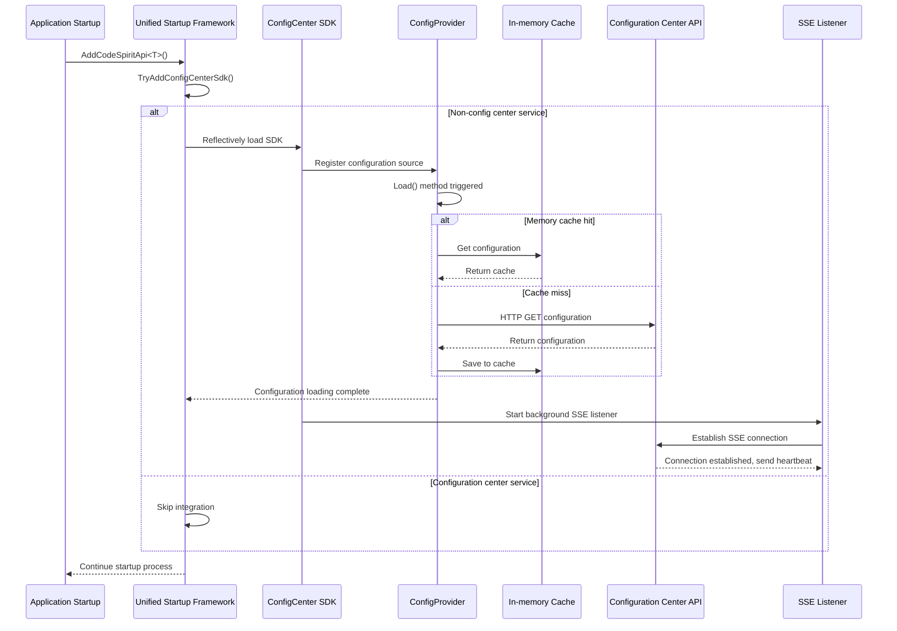
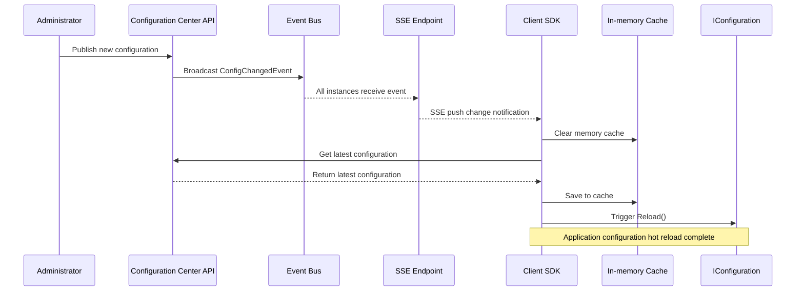
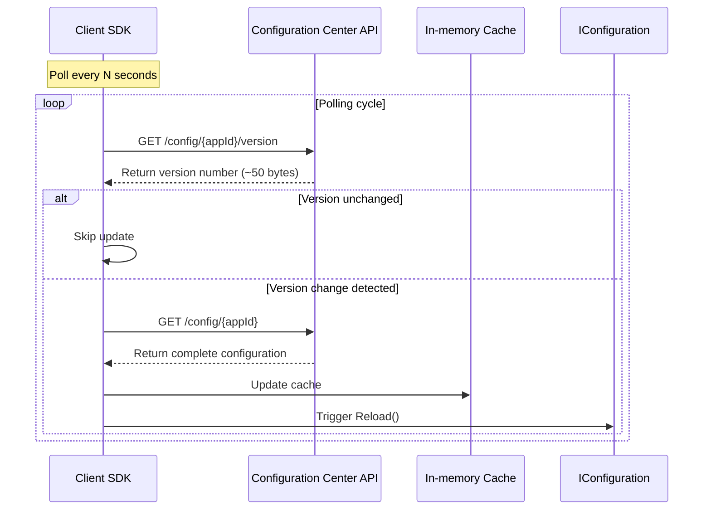
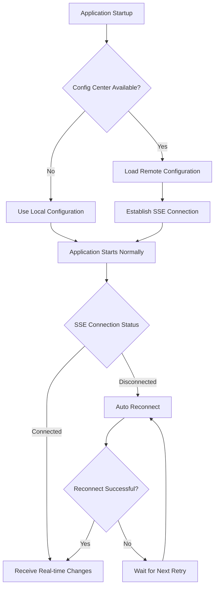

# Configuration Center SDK Auto Integration Guide

## Overview

Starting from the unified startup framework, all services using `builder.AddCodeSpiritApi<T>()` will automatically integrate the configuration center SDK without manual calls to `AddCodeSpiritConfigCenter()`.

**Architecture Features:**
- ✅ Zero Configuration: Auto integration, no manual calls needed
- ✅ Lightweight: Only depends on HTTP, no Redis, RabbitMQ clients
- ✅ Real-time Push: SSE-based configuration change notifications
- ✅ Intelligent Fallback: Automatically switch to lightweight polling when SSE unavailable
- ✅ Auto Degradation: Use local configuration when API unavailable

**Last Updated:** 2026-01-08 v2.1 (Added polling fallback mechanism)

## Integration Method

### Auto Integration

**Location:** `Src/CodeSpirit.Shared/Startup/ApiStartupExtensions.cs`

**Implementation:** Dynamically load configuration center SDK through reflection to avoid circular dependency

```csharp
// Program.cs - No modification needed
var builder = WebApplication.CreateBuilder(args);

// Auto integrate configuration center SDK
builder.AddCodeSpiritApi<IdentityApiConfiguration>();

var app = builder.Build();
```

### Workflow



## Configuration Loading Timing

### Timing Guarantees

- ✅ **Before WebApplication.Build()**: Configuration source added during builder phase
- ✅ **Before service registration**: Configuration loading executed early in `AddCodeSpiritApi` method
- ✅ **Before IConfiguration usage**: Configuration provider's `Load()` method automatically called during configuration building

### Verification Methods

**Method 1: Console Log**

Check console output when starting application:

```
[ConfigCenter SDK] Auto integrated into service: identity
```

**Method 2: Breakpoint Debugging**

Set breakpoint in `ConfigCenterConfigurationProvider.Load()` method to verify:
1. Whether it's called
2. Whether timing is before application startup
3. Whether configuration successfully loaded into `Data` dictionary

**Method 3: Use Configuration Value**

Read configuration center's configuration in service's `ConfigureServices` method:

```csharp
public override void ConfigureServices(IServiceCollection services, IConfiguration configuration)
{
    var customValue = configuration["YourConfigKey"];
    Console.WriteLine($"[Config Center] Read configuration: YourConfigKey = {customValue}");

    // ... other configurations
}
```

## Auto Exclusion Logic

### Configuration Center Service Itself

Configuration center service (ServiceName = "config") will automatically skip SDK integration:

```csharp
if (serviceName.Equals("config", StringComparison.OrdinalIgnoreCase))
{
    Console.WriteLine($"[ConfigCenter SDK] Skip configuration center service itself: {serviceName}");
    return;
}
```

### Services without SDK Installed

If a service's project doesn't reference `CodeSpirit.ConfigCenter.Sdk`, it will automatically skip:

```csharp
catch (FileNotFoundException)
{
    // Configuration center SDK not loaded, ignore
}
```

## Configuration Priority

### Configuration Source Order

1. **Command line arguments** (highest priority)
2. **Environment variables**
3. **appsettings.{Environment}.json**
4. **appsettings.json**
5. **Configuration center** (loaded through SDK)

### Configuration Override Rules

- Local configuration (appsettings) overrides configuration center configuration
- To prioritize configuration center, adjust configuration source order
- Or use higher priority key names in configuration center

## Configuration Change Notification Mechanism

### Dual Mode Architecture

SDK supports two configuration change notification modes, automatically selecting the optimal solution:

#### 1. SSE Real-time Push (Priority Mode)

SDK automatically maintains SSE connection with configuration center in background:



**Features:**
- ✅ **Second-level push**: Configuration changes pushed to all clients immediately
- ✅ **Auto reconnect**: Automatically re-establish after connection disconnect
- ✅ **No polling needed**: Based on server push, low resource consumption
- ✅ **Distributed synchronization**: All clients update synchronously in multi-instance environment

#### 2. Lightweight Polling (Intelligent Fallback)

When SSE is unavailable (e.g., Aspire proxy buffering), automatically switch to lightweight polling:



**Features:**
- ✅ **Auto downgrade**: Automatically switch after SSE fails 3 times
- ✅ **Lightweight**: Only transmit version number (~50 bytes), not complete configuration
- ✅ **On-demand fetch**: Only fetch complete configuration when version changes
- ✅ **Configurable**: Support custom polling interval

**Configuration Options:**

```json
{
  "ConfigCenter": {
    "UsePollingMode": false,
    "PollingIntervalSeconds": 30,
    "SseFailureThresholdBeforePolling": 3
  }
}
```

| Configuration Item | Description | Default Value | Use Case |
|------------------|-------------|---------------|----------|
| `UsePollingMode` | Directly use polling mode | `false` | Set to `true` for Aspire environment |
| `PollingIntervalSeconds` | Polling interval (seconds) | `30` | Adjust based on configuration change frequency |
| `SseFailureThresholdBeforePolling` | SSE failure count before switching | `3` | Lower when network unstable |

## Fault Handling and Recovery

### Configuration Center Unavailable



**Degradation Strategy:**
- ✅ **No impact on startup**: Use local configuration when API unavailable
- ✅ **Auto retry**: Automatically reconnect after SSE connection disconnect
- ✅ **Log recording**: Console output integration and connection status

**Log Example:**
```
[ConfigCenter SDK] Auto integrated into service: identity
[ConfigCenter SDK] Configuration loading complete, version: 123
[SSE Listener] SSE connection established
[SSE Listener] SSE connection disconnected, retry in 5 seconds...
```

### Service Recovery

- **API recovery**: Automatically fetch latest configuration on next SSE reconnect
- **Configuration change**: Push in real-time via SSE, no waiting needed
- **Zero intervention**: No need to manually restart application or clear cache

## Manual Integration (Optional)

For more fine-grained control, you can manually integrate before the unified startup framework:

```csharp
var builder = WebApplication.CreateBuilder(args);

// Manual integration (configurable options)
builder.AddCodeSpiritConfigCenter(options =>
{
    options.AppId = "custom-app-id";
    options.CacheExpirationMinutes = 60;
});

// Unified startup framework will detect integration and skip auto integration
builder.AddCodeSpiritApi<MyApiConfiguration>();
```

## Notes

### ✅ Advantages
- Auto integration, zero configuration
- Lightweight, no external dependencies (SDK side)
- Real-time push, second-level updates (SSE mode)
- Intelligent fallback, polling backup (Aspire adaptation)
- Polling optimization, low network overhead (only transmit version number)
- Auto degradation, strong fault tolerance
- Configuration center service automatically excluded
- Services without SDK automatically skipped

### ⚠️ Considerations
- First startup fetches configuration from API (~100-500ms)
- SSE long connections require firewall support (polling mode has no restriction)
- Aspire environment recommended to directly enable polling mode (`UsePollingMode=true`)
- Configuration update delay in polling mode (default 30 seconds, configurable)
- To prioritize configuration center over local configuration, need to adjust configuration source order
- Multi-instance environment requires EventBus configuration (server-side)

### 📊 Performance Characteristics

| Scenario | Duration | Description |
|----------|----------|-------------|
| First load (no memory cache) | 100-500ms | HTTP request configuration center API |
| Cache hit | <1ms | Memory cache read |
| Configuration change push (SSE) | <1s | SSE real-time push |
| Configuration change detection (polling) | 30s | Polling interval (configurable) |
| Version check request | 10-50ms | Lightweight API (~50 bytes) |
| SSE reconnect | 5s interval | Auto retry after connection disconnect |

**Polling Mode Efficiency Comparison:**

| Solution | Traffic per Poll | Daily Traffic at 30-second Interval (Single App) |
|----------|-----------------|--------------------------------------------------|
| Traditional polling (complete config) | ~5KB | ~14.4MB |
| Lightweight polling (version number) | ~50 bytes | ~144KB |
| **Savings Ratio** | **99%** | **99%** |

## Related Documentation

- [Configuration Center Refactoring Plan v4](../../../c:\Users\codel\.cursor\plans\配置中心重构方案v4_234c5555.plan.md)
- [Unified Startup Framework Specification](.cursor/rules/startup-framework.mdc)
- [CodeSpirit.ConfigCenter.Sdk Usage Guide](./config-center-sdk-usage-en.md)

## Changelog

- **2026-01-08 v2.1**: Added polling fallback mechanism
  - Added lightweight version check API (`GET /config/{appId}/version`)
  - SDK supports automatic downgrade to polling mode when SSE fails
  - Polling optimization: only transmit version number, fetch complete configuration on-demand
  - Added polling-related configuration options (`UsePollingMode`, `PollingIntervalSeconds`, etc.)
  - Adapt to Aspire environment (service discovery proxy buffers SSE)
- **2026-01-08 v2.0**: Architecture optimization - Adopt SSE real-time push solution
  - SDK dependency simplified: only HTTP client needed
  - Configuration push: changed from MQ to SSE
  - Health check: based on SSE connection status
  - Cache strategy: changed from Redis to memory cache
- **2026-01-07**: Implemented auto integration in unified startup framework using reflection to avoid circular dependency
