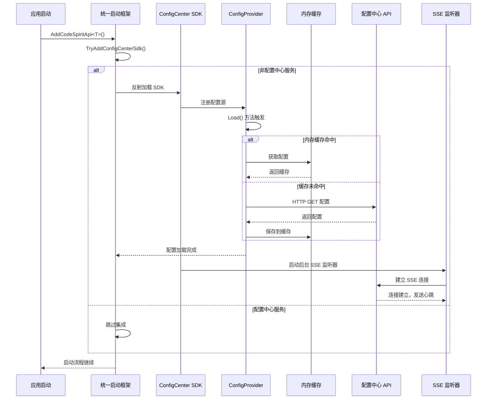
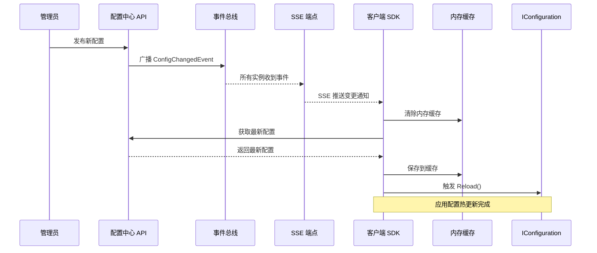
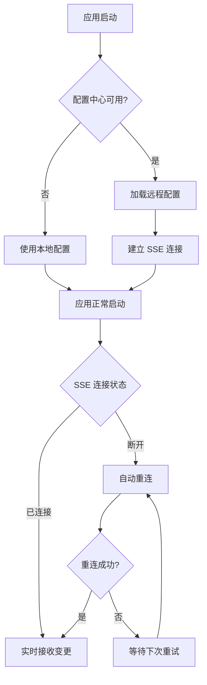

# 配置中心 SDK 自动集成说明

## 概述

从统一启动框架开始，所有使用 `builder.AddCodeSpiritApi<T>()` 的服务都会自动集成配置中心 SDK，无需手动调用 `AddCodeSpiritConfigCenter()`。

**架构特点：**
- ✅ 零配置：自动集成，无需手动调用
- ✅ 轻量级：仅依赖 HTTP，无需 Redis、RabbitMQ 客户端
- ✅ 实时推送：基于 SSE 的配置变更通知
- ✅ 自动降级：API 不可用时使用本地配置

**最后更新：** 2026-01-08（架构优化：SSE 实时推送）

## 集成方式

### 自动集成

**位置：** `Src/CodeSpirit.Shared/Startup/ApiStartupExtensions.cs`

**实现方式：** 通过反射动态加载配置中心 SDK，避免循环依赖

```csharp
// Program.cs - 无需修改
var builder = WebApplication.CreateBuilder(args);

// 自动集成配置中心 SDK
builder.AddCodeSpiritApi<IdentityApiConfiguration>();

var app = builder.Build();
```

### 工作流程



## 配置加载时机

### 时机保证

- ✅ **在 WebApplication.Build() 之前**：配置源在构建器阶段添加
- ✅ **在服务注册之前**：配置加载在 `AddCodeSpiritApi` 方法早期执行
- ✅ **在 IConfiguration 使用之前**：配置提供程序的 `Load()` 方法在配置构建时自动调用

### 验证方式

**方法一：控制台日志**

启动应用时查看控制台输出：

```
[ConfigCenter SDK] 已自动集成到服务: identity
```

**方法二：断点调试**

在 `ConfigCenterConfigurationProvider.Load()` 方法设置断点，验证：
1. 是否被调用
2. 调用时机是否在应用启动之前
3. 配置是否成功加载到 `Data` 字典

**方法三：使用配置值**

在服务的 `ConfigureServices` 方法中读取配置中心的配置：

```csharp
public override void ConfigureServices(IServiceCollection services, IConfiguration configuration)
{
    var customValue = configuration["YourConfigKey"];
    Console.WriteLine($"[配置中心] 读取配置: YourConfigKey = {customValue}");
    
    // ... 其他配置
}
```

## 自动排除逻辑

### 配置中心服务本身

配置中心服务（ServiceName = "config"）会自动跳过 SDK 集成：

```csharp
if (serviceName.Equals("config", StringComparison.OrdinalIgnoreCase))
{
    Console.WriteLine($"[ConfigCenter SDK] 跳过配置中心服务自身: {serviceName}");
    return;
}
```

### SDK 未安装的服务

如果某个服务的项目没有引用 `CodeSpirit.ConfigCenter.Sdk`，会自动跳过：

```csharp
catch (FileNotFoundException)
{
    // 配置中心 SDK 未加载，忽略
}
```

## 配置优先级

### 配置源顺序

1. **命令行参数** (最高优先级)
2. **环境变量**
3. **appsettings.{Environment}.json**
4. **appsettings.json**
5. **配置中心** (通过 SDK 加载)

### 配置覆盖规则

- 本地配置（appsettings）会覆盖配置中心的配置
- 如需配置中心优先，调整配置源添加顺序
- 或在配置中心中使用更高优先级的键名

## 配置变更实时通知

### SSE 长连接

SDK 在后台自动维护与配置中心的 SSE 连接：



### 配置热更新特点

- ✅ **秒级推送**：配置变更后立即推送到所有客户端
- ✅ **自动重连**：连接断开后自动重新建立
- ✅ **无需轮询**：基于服务端推送，资源消耗低
- ✅ **分布式同步**：多实例环境下所有客户端同步更新

## 故障处理与恢复

### 配置中心不可用



**降级策略：**
- ✅ **不影响启动**：API 不可用时使用本地配置
- ✅ **自动重试**：SSE 连接断开后自动重连
- ✅ **日志记录**：控制台输出集成和连接状态

**日志示例：**
```
[ConfigCenter SDK] 已自动集成到服务: identity
[ConfigCenter SDK] 配置加载完成，版本: 123
[SSE Listener] SSE 连接已建立
[SSE Listener] SSE 连接断开，5秒后重试...
```

### 服务恢复

- **API 恢复**：下次 SSE 重连时自动获取最新配置
- **配置变更**：通过 SSE 实时推送，无需等待
- **零干预**：无需手动重启应用或清理缓存

## 手动集成（可选）

如需更精细的控制，可在统一启动框架之前手动集成：

```csharp
var builder = WebApplication.CreateBuilder(args);

// 手动集成（可配置选项）
builder.AddCodeSpiritConfigCenter(options =>
{
    options.AppId = "custom-app-id";
    options.CacheExpirationMinutes = 60;
});

// 统一启动框架会检测到已集成，跳过自动集成
builder.AddCodeSpiritApi<MyApiConfiguration>();
```

## 注意事项

### ✅ 优势
- 自动集成，零配置
- 轻量级，无外部依赖（SDK 侧）
- 实时推送，秒级更新
- 自动降级，容错性强
- 配置中心服务自动排除
- SDK 未安装的服务自动跳过

### ⚠️ 注意
- 首次启动时需从 API 获取配置（约 100-500ms）
- SSE 长连接需防火墙支持
- 如需配置中心优先于本地配置，需调整配置源顺序
- 多实例环境需配置 EventBus（服务端）

### 📊 性能特点

| 场景 | 耗时 | 说明 |
|------|------|------|
| 首次加载（内存无缓存） | 100-500ms | HTTP 请求配置中心 API |
| 缓存命中 | <1ms | 内存缓存读取 |
| 配置变更推送 | <1s | SSE 实时推送 |
| SSE 重连 | 5s 间隔 | 连接断开后自动重试 |

## 相关文档

- [配置中心重构方案 v4](../../../c:\Users\codel\.cursor\plans\配置中心重构方案v4_234c5555.plan.md)
- [统一启动框架规范](.cursor/rules/startup-framework.mdc)
- [CodeSpirit.ConfigCenter.Sdk 使用指南](./config-center-sdk-usage-zh-CN.md)

## 更新日志

- **2026-01-08**: 架构优化 - 采用 SSE 实时推送方案
  - SDK 依赖简化：仅需 HTTP 客户端
  - 配置推送：从 MQ 改为 SSE
  - 健康检查：基于 SSE 连接状态
  - 缓存策略：从 Redis 改为内存缓存
- **2026-01-07**: 在统一启动框架中实现自动集成，采用反射方式避免循环依赖

