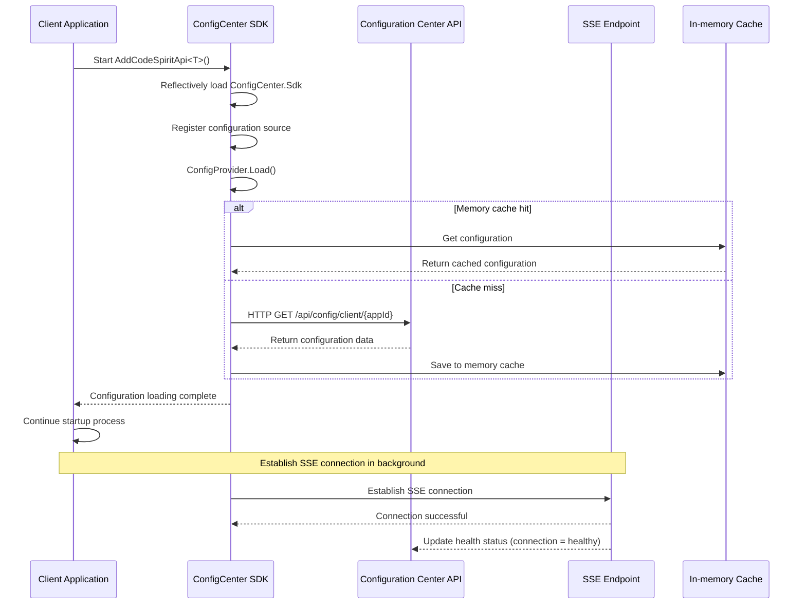
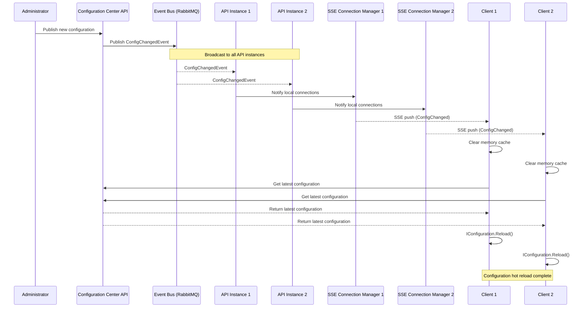

# Configuration Center SDK Unified Integration Implementation Summary

## Implementation Date

**Date:** 2026-01-07
**Last Updated:** 2026-01-08 v2.1 (Added polling fallback mechanism)

## Implementation Plan

**Plan:** Plan 1 - Integrate configuration center SDK in unified startup framework

## Implementation Content

### 1. Modify Unified Startup Framework

**File:** `Src/CodeSpirit.Shared/Startup/ApiStartupExtensions.cs`

**Modifications:**
- Added configuration center SDK auto integration in `AddCodeSpiritApi<TConfig>` method
- Added `TryAddConfigCenterSdk()` private method to load SDK via reflection
- Used reflection to avoid circular dependency issues

**Key Code:**
```csharp
public static IServiceCollection AddCodeSpiritApi<TConfig>(
    this WebApplicationBuilder builder,
    TConfig? configuration = null)
    where TConfig : class, IApiServiceConfiguration, new()
{
    var config = configuration ?? new TConfig();

    // Basic service registration
    builder.AddServiceDefaults(config.ServiceName);

    // ✅ Add configuration center SDK (before other services)
    TryAddConfigCenterSdk(builder);

    // ... other service registrations ...
}
```

### 2. Add SDK References to All API Services

**Services with Added References:**

| Service | Project File | Status |
|---------|--------------|--------|
| Identity | `CodeSpirit.IdentityApi.csproj` | ✅ Already referenced |
| Exam | `CodeSpirit.ExamApi.csproj` | ✅ Added |
| Survey | `CodeSpirit.SurveyApi.csproj` | ✅ Added |
| Messaging | `CodeSpirit.MessagingApi.csproj` | ✅ Added |
| FileStorage | `CodeSpirit.FileStorageApi.csproj` | ✅ Added |
| Approval | `CodeSpirit.ApprovalApi.csproj` | ✅ Added |
| Pathfinder | `CodeSpirit.PathfinderApi.csproj` | ✅ Added |
| **ConfigCenter** | `CodeSpirit.ConfigCenter.csproj` | ⚠️ Auto excluded |

**Configuration Center Service Exclusion Logic:**
```csharp
if (serviceName.Equals("config", StringComparison.OrdinalIgnoreCase))
{
    Console.WriteLine($"[ConfigCenter SDK] Skip configuration center service itself: {serviceName}");
    return;
}
```

### 3. Create Integration Documentation

**New Documents:**
- `config-center-sdk-auto-integration-en.md` - Auto integration guide
- `config-center-sdk-integration-summary-en.md` - Implementation summary (this document)

## Workflow

### Startup Sequence



### Configuration Loading Priority

1. **Memory Cache** (Fastest, priority - SDK local)
2. **Configuration Center API** (When cache misses)
3. **Local Configuration** (Fallback when load fails)

### Configuration Change Real-time Push Flow



## Technical Highlights

### 1. Dual Mode Architecture: SSE Real-time Push + Polling Fallback

**SSE Mode (Priority):**
- **Low latency**: Configuration changes pushed to clients in seconds
- **Lightweight**: Based on HTTP long connection, no additional middleware needed
- **Auto reconnect**: Automatically re-establish after connection disconnect
- **Bidirectional heartbeat**: Server sends periodic heartbeats, client detects connection status

**Polling Mode (Intelligent Fallback):**
- **Auto downgrade**: Automatically switch after SSE fails continuously (default 3 times)
- **Lightweight check**: Only transmit version number (~50 bytes), not complete configuration
- **On-demand fetch**: Only fetch complete configuration when version changes
- **Configurable**: Support custom polling interval and failure threshold

**Architecture Advantages:**
- Prioritize SSE, simpler than WebSocket, more real-time than traditional polling
- Auto adapt to environment: Automatically degrade in Aspire and other SSE-unavailable environments
- Polling optimization: Network overhead reduced by 99%+ compared to directly polling complete configuration
- High availability: Two modes backup each other, ensuring configuration update reliability

### 2. Connection Status-based Health Check

**Innovation**: No longer use scheduled polling of `/health` endpoint, but based on SSE connection status:
- ✅ **Has SSE connection** = Service healthy
- ❌ **No SSE connection** = Service unhealthy

**Advantages:**
- Real-time: Health status updates immediately when connection established/disconnected
- Resource saving: No scheduled HTTP requests needed
- Accuracy: Connection status directly reflects service availability

### 3. Memory Cache + HTTP Architecture

**Zero External Dependencies (SDK Side):**
- Memory cache: Fast read, reload after application restart
- HTTP client: Fetch configuration and receive SSE push
- No Redis, RabbitMQ client dependencies

**Server-side Distributed Synchronization:**
- Use EventBus (RabbitMQ) to synchronize events between API instances
- Each instance maintains its own SSE connections
- Configuration changes broadcast to all clients of all instances

### 4. Reflection Loading to Avoid Circular Dependency

Dynamically load SDK through reflection, `CodeSpirit.Shared` doesn't need to reference `CodeSpirit.ConfigCenter.Sdk`, avoiding circular dependency.

### 5. Fault Degradation and Recovery

**Startup Phase:**
- SDK load failure → Skip, use local configuration
- API connection failure → Skip, use local configuration
- Application starts normally without impact

**Runtime Phase:**
- SSE connection disconnect → Auto reconnect
- After API recovery → Push latest configuration
- No manual intervention needed

## Verification Methods

### 1. Console Log

Start any API service (non-ConfigCenter), check console output:

```
[ConfigCenter SDK] Auto integrated into service: identity
```

### 2. Breakpoint Debugging

Set breakpoints at:
- `ApiStartupExtensions.TryAddConfigCenterSdk()` - Verify reflection call
- `ConfigCenterConfigurationProvider.Load()` - Verify configuration loading
- Service's `ConfigureServices` method - Verify configuration available

### 3. Read Configuration Value

Verify in service's `ConfigureServices`:

```csharp
public override void ConfigureServices(IServiceCollection services, IConfiguration configuration)
{
    var customValue = configuration["YourConfigKey"];
    Console.WriteLine($"[Config Center] Read configuration: YourConfigKey = {customValue}");
}
```

### 4. Application Startup Test

```powershell
# Start Aspire
aspire run

# Or start single service
dotnet run --project Src/ApiServices/CodeSpirit.IdentityApi
```

Check:
1. Whether console outputs integration success message
2. Whether application starts normally
3. Whether configuration center Dashboard shows service registered

## Configuration Example

### appsettings.json

Client services don't need special configuration, SDK will automatically:
- Get configuration center address from Aspire service discovery (`ConnectionStrings:config`)
- Set AppId based on service name
- Auto register application

**Optional Configuration:**

```json
{
  "ConfigCenter": {
    "AppId": "identity",
    "CacheExpirationMinutes": 60,
    "AutoRegister": true,
    "UsePollingMode": false,
    "PollingIntervalSeconds": 30,
    "SseFailureThresholdBeforePolling": 3
  }
}
```

**Polling-related Configuration Description:**

| Configuration Item | Description | Default Value | Recommended Scenario |
|------------------|-------------|---------------|---------------------|
| `UsePollingMode` | Whether to directly use polling mode | `false` | Can set to `true` for Aspire environment |
| `PollingIntervalSeconds` | Polling interval (seconds) | `30` | Adjust based on configuration change frequency |
| `SseFailureThresholdBeforePolling` | SSE failure count before switching to polling | `3` | Can lower when network unstable |

## Notes

### ✅ Advantages

- **Zero code integration**: All services auto integrated, no need to modify Program.cs
- **Avoid circular dependency**: Dynamic loading through reflection
- **Fault degradation**: SDK unavailability doesn't affect application startup
- **Correct configuration loading timing**: Loading completes before application startup
- **Auto exclusion logic**: Configuration center service automatically skipped

### ⚠️ Considerations

1. **First startup**: Fetch configuration from API when no memory cache (~100-500ms)
2. **Configuration priority**: Local configuration (appsettings) has higher priority than configuration center
3. **Service dependency**: Configuration center API needs to run normally (optional Redis cache)
4. **Project reference**: New services need to add `CodeSpirit.ConfigCenter.Sdk` project reference
5. **SSE connection**: Firewall needs to allow HTTP long connections

### 🔧 Troubleshooting

| Problem | Possible Cause | Solution |
|---------|----------------|----------|
| No integration log | Project reference not added | Add `CodeSpirit.ConfigCenter.Sdk.csproj` reference |
| Slow startup | API unavailable | Check configuration center API connection, or use local configuration |
| Configuration not taking effect | Local configuration override | Check appsettings.json, ensure configuration key names correct |
| Configuration center also integrated | Exclusion logic failed | Check if ServiceName is "config" |
| Configuration update delay 30 seconds | Switched to polling mode | Normal phenomenon when SSE unavailable, can adjust `PollingIntervalSeconds` |
| SSE always failing | Aspire proxy buffering | Set `UsePollingMode=true` to directly use polling |
| Health status inaccurate | SSE connection abnormal | Check network connection and firewall settings |

## Future Plans

- ✅ Unified startup framework integration
- ✅ All API services add SDK references
- ✅ Create integration documentation
- 🔲 Performance testing (configuration load duration)
- 🔲 Stress testing (multiple services starting simultaneously)
- 🔲 Fault testing (Redis/API unavailable scenarios)
- 🔲 Update project documentation and README

## Architecture Evolution History

### v1: Redis + RabbitMQ Push (Deprecated)
- Client depends on Redis and RabbitMQ
- Configuration cached in Redis
- Configuration changes pushed via MQ
- **Issue**: Too many dependencies, high client complexity

### v2: SSE Real-time Push (Current Architecture)
- Client only depends on HTTP
- Configuration cached in memory
- Configuration changes pushed via SSE
- **Advantage**: Few dependencies, good real-time performance, simple architecture

## Fixed Historical Issues

### Issue 1: Dependency Injection Lifetime Conflict (Fixed)
**Detailed Documentation**: [Dependency Injection Lifetime Fix Guide](./config-center-sdk-di-lifetime-fix-en.md)

### Issue 2: JWT Configuration Loading Timing Issue (Fixed)
**Detailed Documentation**: [Configuration Loading Timing Fix Guide](./config-center-sdk-config-loading-timing-fix-en.md)

## Related Documentation

- [Configuration Center Refactoring Plan v4](../../../c:\Users\codel\.cursor\plans\配置中心重构方案v4_234c5555.plan.md)
- [Configuration Center SDK Auto Integration Guide](./config-center-sdk-auto-integration-en.md)
- [Dependency Injection Lifetime Fix](./config-center-sdk-di-lifetime-fix-en.md)
- [Configuration Loading Timing Fix](./config-center-sdk-config-loading-timing-fix-en.md)
- [Unified Startup Framework Specification](.cursor/rules/startup-framework.mdc)

## Changelog

- **2026-01-08 v2.1**: Added polling fallback mechanism
  - Added lightweight version check API
  - SDK supports automatic downgrade to polling mode when SSE fails
  - Polling optimization: only transmit version number, fetch complete configuration on-demand
  - Cascade update child application version numbers when parent app publishes
  - Added polling-related configuration options
- **2026-01-08 v2.0**: Architecture optimization - Adopt SSE real-time push to replace Redis+MQ solution
  - Removed SDK dependencies on Redis and RabbitMQ
  - Changed to memory cache + SSE push
  - Health check based on SSE connection status
  - Server-side uses EventBus for distributed synchronization
- **2026-01-07**: Completed Plan 1 implementation, all main API services have integrated configuration center SDK
- **2026-01-07**: Fixed dependency injection lifetime conflict issue
- **2026-01-07**: Fixed JWT configuration loading timing issue
