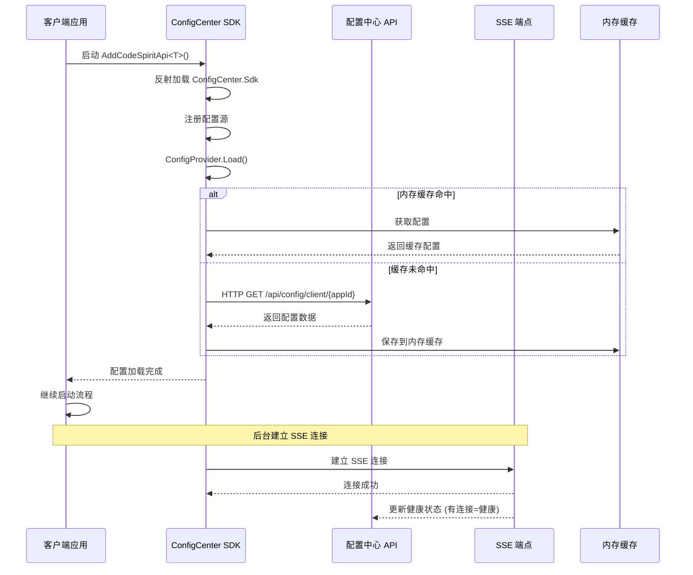
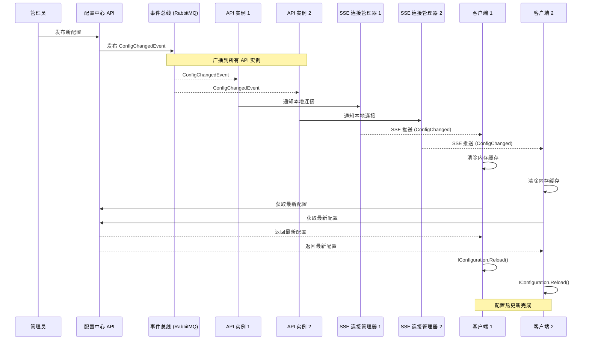

# 配置中心 SDK 统一集成实施总结

## 实施时间

**日期：** 2026-01-07  
**最后更新：** 2026-01-08 v2.1（新增轮询回退机制）

## 实施方案

**方案：** 方案一 - 在统一启动框架中集成配置中心 SDK

## 实施内容

### 1. 修改统一启动框架

**文件：** `Src/CodeSpirit.Shared/Startup/ApiStartupExtensions.cs`

**修改内容：**
- 在 `AddCodeSpiritApi<TConfig>` 方法中添加配置中心 SDK 自动集成
- 新增 `TryAddConfigCenterSdk()` 私有方法，通过反射加载 SDK
- 采用反射方式避免循环依赖问题

**关键代码：**
```csharp
public static IServiceCollection AddCodeSpiritApi<TConfig>(
    this WebApplicationBuilder builder,
    TConfig? configuration = null) 
    where TConfig : class, IApiServiceConfiguration, new()
{
    var config = configuration ?? new TConfig();
    
    // 基础服务注册
    builder.AddServiceDefaults(config.ServiceName);
    
    // ✅ 添加配置中心 SDK（在其他服务之前）
    TryAddConfigCenterSdk(builder);
    
    // ... 其他服务注册 ...
}
```

### 2. 为所有 API 服务添加 SDK 引用

**已添加引用的服务：**

| 服务 | 项目文件 | 状态 |
|------|---------|------|
| Identity | `CodeSpirit.IdentityApi.csproj` | ✅ 已有引用 |
| Exam | `CodeSpirit.ExamApi.csproj` | ✅ 已添加 |
| Survey | `CodeSpirit.SurveyApi.csproj` | ✅ 已添加 |
| Messaging | `CodeSpirit.MessagingApi.csproj` | ✅ 已添加 |
| FileStorage | `CodeSpirit.FileStorageApi.csproj` | ✅ 已添加 |
| Approval | `CodeSpirit.ApprovalApi.csproj` | ✅ 已添加 |
| Pathfinder | `CodeSpirit.PathfinderApi.csproj` | ✅ 已添加 |
| **ConfigCenter** | `CodeSpirit.ConfigCenter.csproj` | ⚠️ 自动排除 |

**配置中心服务排除逻辑：**
```csharp
if (serviceName.Equals("config", StringComparison.OrdinalIgnoreCase))
{
    Console.WriteLine($"[ConfigCenter SDK] 跳过配置中心服务自身: {serviceName}");
    return;
}
```

### 3. 创建集成文档

**新增文档：**
- `config-center-sdk-auto-integration-zh-CN.md` - 自动集成说明
- `config-center-sdk-integration-summary-zh-CN.md` - 实施总结（本文档）

## 工作流程

### 启动时序



### 配置加载优先级

1. **内存缓存** （最快，首选 - SDK 本地）
2. **配置中心 API** （缓存未命中时）
3. **本地配置** （加载失败时降级）

### 配置变更实时推送流程



## 技术亮点

### 1. 双模式架构：SSE 实时推送 + 轮询回退

**SSE 模式（优先）：**
- **低延迟**：配置变更秒级推送到客户端
- **轻量级**：基于 HTTP 长连接，无需额外中间件
- **自动重连**：连接断开后自动重新建立
- **双向心跳**：服务端定期发送心跳，客户端检测连接状态

**轮询模式（智能回退）：**
- **自动降级**：SSE 连续失败达到阈值（默认3次）后自动切换
- **轻量级检查**：仅传输版本号（~50字节），而非完整配置
- **按需拉取**：仅当版本变化时才获取完整配置
- **可配置**：支持自定义轮询间隔和失败阈值

**架构优势：**
- 优先使用 SSE，相比 WebSocket 更简单，相比传统轮询更实时
- 自动适配环境：在 Aspire 等 SSE 不可用的环境中自动降级
- 轮询优化：相比直接轮询完整配置，网络开销降低 99%+
- 高可用：两种模式互为备份，确保配置更新可靠性

### 2. 基于连接状态的健康检查

**创新点：** 不再使用定时轮询 `/health` 端点，而是基于 SSE 连接状态：
- ✅ **有 SSE 连接** = 服务健康
- ❌ **无 SSE 连接** = 服务不健康

**优势：**
- 实时性：连接建立/断开立即更新健康状态
- 资源节省：无需定时 HTTP 请求
- 准确性：连接状态直接反映服务可用性

### 3. 内存缓存 + HTTP 架构

**零外部依赖（SDK 侧）：**
- 内存缓存：快速读取，应用重启后重新加载
- HTTP 客户端：获取配置和接收 SSE 推送
- 无需 Redis、RabbitMQ 客户端依赖

**服务端分布式同步：**
- 使用 EventBus（RabbitMQ）在 API 实例间同步事件
- 每个实例维护自己的 SSE 连接
- 配置变更广播到所有实例的所有客户端

### 4. 反射加载避免循环依赖

通过反射动态加载 SDK，`CodeSpirit.Shared` 无需引用 `CodeSpirit.ConfigCenter.Sdk`，避免循环依赖。

### 5. 故障降级与恢复

**启动阶段：**
- SDK 加载失败 → 跳过，使用本地配置
- API 连接失败 → 跳过，使用本地配置
- 应用正常启动不受影响

**运行阶段：**
- SSE 连接断开 → 自动重连
- API 恢复后 → 推送最新配置
- 无需手动干预

## 验证方式

### 1. 控制台日志

启动任一 API 服务（非 ConfigCenter），查看控制台输出：

```
[ConfigCenter SDK] 已自动集成到服务: identity
```

### 2. 断点调试

在以下位置设置断点：
- `ApiStartupExtensions.TryAddConfigCenterSdk()` - 验证反射调用
- `ConfigCenterConfigurationProvider.Load()` - 验证配置加载
- 服务的 `ConfigureServices` 方法 - 验证配置已可用

### 3. 读取配置值

在服务的 `ConfigureServices` 中验证：

```csharp
public override void ConfigureServices(IServiceCollection services, IConfiguration configuration)
{
    var customValue = configuration["YourConfigKey"];
    Console.WriteLine($"[配置中心] 读取配置: YourConfigKey = {customValue}");
}
```

### 4. 启动应用测试

```powershell
# 启动 Aspire
aspire run

# 或启动单个服务
dotnet run --project Src/ApiServices/CodeSpirit.IdentityApi
```

查看：
1. 控制台是否输出集成成功信息
2. 应用是否正常启动
3. 配置中心的 Dashboard 是否显示服务已注册

## 配置示例

### appsettings.json

客户端服务无需特殊配置，SDK 会自动：
- 从 Aspire 服务发现获取配置中心地址（`ConnectionStrings:config`）
- 根据服务名自动设置 AppId
- 自动注册应用

**可选配置：**

```json
{
  "ConfigCenter": {
    "AppId": "identity",
    "CacheExpirationMinutes": 60,
    "AutoRegister": true,
    "UsePollingMode": false,
    "PollingIntervalSeconds": 30,
    "SseFailureThresholdBeforePolling": 3
  }
}
```

**轮询相关配置说明：**

| 配置项 | 说明 | 默认值 | 推荐场景 |
|--------|------|--------|----------|
| `UsePollingMode` | 是否直接使用轮询模式 | `false` | Aspire 环境可设为 `true` |
| `PollingIntervalSeconds` | 轮询间隔（秒） | `30` | 根据配置变更频率调整 |
| `SseFailureThresholdBeforePolling` | SSE 失败多少次后切换轮询 | `3` | 网络不稳定时可降低 |

## 注意事项

### ✅ 优点

- **零代码集成**：所有服务自动集成，无需修改 Program.cs
- **避免循环依赖**：通过反射动态加载
- **故障降级**：SDK 不可用时不影响应用启动
- **配置加载时机正确**：在应用启动前加载完成
- **自动排除逻辑**：配置中心服务自动跳过

### ⚠️ 注意事项

1. **首次启动**：内存无缓存时会从 API 获取（约 100-500ms）
2. **配置优先级**：本地配置（appsettings）优先级高于配置中心
3. **服务依赖**：配置中心 API 需正常运行（可选 Redis 缓存）
4. **项目引用**：新服务需要添加 `CodeSpirit.ConfigCenter.Sdk` 项目引用
5. **SSE 连接**：防火墙需允许 HTTP 长连接

### 🔧 故障排查

| 问题 | 可能原因 | 解决方案 |
|------|---------|---------|
| 没有集成日志 | 未添加项目引用 | 添加 `CodeSpirit.ConfigCenter.Sdk.csproj` 引用 |
| 启动慢 | API 不可用 | 检查配置中心 API 连接，或使用本地配置 |
| 配置未生效 | 本地配置覆盖 | 检查 appsettings.json，确保配置键名正确 |
| 配置中心也集成了 | 排除逻辑失败 | 检查 ServiceName 是否为 "config" |
| 配置更新延迟 30 秒 | 已切换到轮询模式 | SSE 不可用时正常现象，可调整 `PollingIntervalSeconds` |
| SSE 一直失败 | Aspire 代理缓冲 | 设置 `UsePollingMode=true` 直接使用轮询 |
| 健康状态不准确 | SSE 连接异常 | 检查网络连接和防火墙设置 |

## 后续计划

- ✅ 统一启动框架集成
- ✅ 所有 API 服务添加 SDK 引用
- ✅ 创建集成文档
- 🔲 性能测试（配置加载耗时）
- 🔲 压力测试（大量服务同时启动）
- 🔲 故障测试（Redis/API 不可用场景）
- 🔲 更新项目文档和 README

## 架构演进历史

### v1: Redis + RabbitMQ 推送（已废弃）
- 客户端依赖 Redis 和 RabbitMQ
- 配置缓存在 Redis
- 配置变更通过 MQ 推送
- **问题**：依赖过多，客户端复杂度高

### v2: SSE 实时推送（当前架构）
- 客户端仅依赖 HTTP
- 配置缓存在内存
- 配置变更通过 SSE 推送
- **优势**：依赖少、实时性好、架构简单

## 已修复的历史问题

### 问题 1: 依赖注入生命周期冲突（已修复）
**详细文档：** [依赖注入生命周期修复说明](./config-center-sdk-di-lifetime-fix-zh-CN.md)

### 问题 2: JWT 配置加载时机问题（已修复）
**详细文档：** [配置加载时机修复说明](./config-center-sdk-config-loading-timing-fix-zh-CN.md)

## 相关文档

- [配置中心重构方案 v4](../../../c:\Users\codel\.cursor\plans\配置中心重构方案v4_234c5555.plan.md)
- [配置中心 SDK 自动集成说明](./config-center-sdk-auto-integration-zh-CN.md)
- [依赖注入生命周期修复](./config-center-sdk-di-lifetime-fix-zh-CN.md)
- [配置加载时机修复](./config-center-sdk-config-loading-timing-fix-zh-CN.md)
- [统一启动框架规范](.cursor/rules/startup-framework.mdc)

## 更新日志

- **2026-01-08 v2.1**: 新增轮询回退机制
  - 新增轻量级版本检查 API
  - SDK 支持 SSE 失败自动降级到轮询模式
  - 轮询优化：仅传输版本号，按需拉取完整配置
  - 父应用发布时级联更新子应用版本号
  - 添加轮询相关配置选项
- **2026-01-08 v2.0**: 架构优化 - 采用 SSE 实时推送替代 Redis+MQ 方案
  - 移除 SDK 对 Redis 和 RabbitMQ 的依赖
  - 改用内存缓存 + SSE 推送
  - 基于 SSE 连接状态的健康检查
  - 服务端使用 EventBus 进行分布式同步
- **2026-01-07**: 完成方案一实施，所有主要 API 服务已集成配置中心 SDK
- **2026-01-07**: 修复依赖注入生命周期冲突问题
- **2026-01-07**: 修复 JWT 配置加载时机问题

