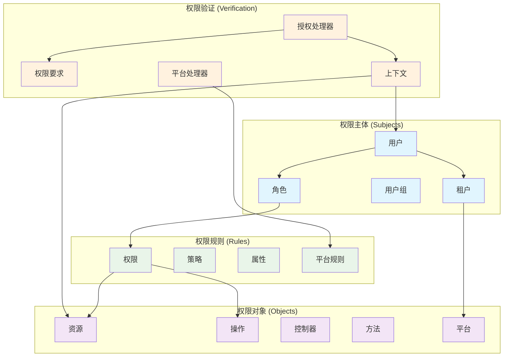

# CodeSpirit.Authorization 权限组件详解

## 概述

CodeSpirit.Authorization是框架的核心权限管理组件，实现了基于角色的访问控制（RBAC）和基于属性的访问控制（ABAC）的混合权限模型，以及多租户平台权限验证系统。该组件提供了灵活、细粒度的权限控制机制，支持动态权限验证、权限树管理、多层级权限继承和多租户隔离。

## 权限模型架构



## 多租户平台权限验证系统

### 1. 平台类型定义

系统支持四种平台类型，用于区分不同的访问权限级别：

```csharp
/// <summary>
/// 平台类型枚举
/// </summary>
public enum PlatformType
{
    /// <summary>
    /// 无权限 - 禁止访问
    /// </summary>
    None = 0,

    /// <summary>
    /// 系统平台 - 仅系统租户可访问
    /// </summary>
    System = 1,

    /// <summary>
    /// 租户平台 - 仅业务租户可访问
    /// </summary>
    Tenant = 2,

    /// <summary>
    /// 通用平台 - 系统租户和业务租户都可访问
    /// </summary>
    Both = 3
}
```

### 2. 租户类型分类

系统将租户分为三种类型：

- **系统租户 (system)**: 系统管理租户，拥有系统级权限
- **默认租户 (default)**: 默认租户，通常用于初始化，无业务权限
- **业务租户**: 除系统和默认租户外的所有租户，拥有业务级权限

### 3. 平台权限验证矩阵

| 用户租户类型 | PlatformType.System | PlatformType.Tenant | PlatformType.Both | PlatformType.None |
|-------------|-------------------|-------------------|------------------|------------------|
| system      | ✅ 允许            | ❌ 拒绝            | ✅ 允许           | ❌ 拒绝          |
| default     | ❌ 拒绝            | ❌ 拒绝            | ❌ 拒绝           | ❌ 拒绝          |
| business    | ❌ 拒绝            | ✅ 允许            | ✅ 允许           | ❌ 拒绝          |

### 4. 平台权限要求 (PlatformRequirement)

平台权限要求定义了访问特定平台功能所需的租户类型：

```csharp
/// <summary>
/// 平台权限要求
/// </summary>
public class PlatformRequirement : IAuthorizationRequirement
{
    /// <summary>
    /// 平台类型
    /// </summary>
    public PlatformType PlatformType { get; }

    /// <summary>
    /// 构造函数
    /// </summary>
    /// <param name="platformType">平台类型</param>
    public PlatformRequirement(PlatformType platformType)
    {
        PlatformType = platformType;
    }
}
```

### 5. 平台权限特性 (PlatformAttribute)

平台权限特性提供了声明式的权限控制方式：

```csharp
/// <summary>
/// 平台权限特性
/// </summary>
[AttributeUsage(AttributeTargets.Class | AttributeTargets.Method)]
public class PlatformAttribute : AuthorizeAttribute
{
    /// <summary>
    /// 构造函数
    /// </summary>
    /// <param name="platformType">平台类型</param>
    public PlatformAttribute(PlatformType platformType)
    {
        Policy = $"Platform_{platformType}";
    }
}
```

### 6. 平台权限验证处理器 (PlatformAuthorizationHandler)

平台权限验证处理器负责执行具体的权限验证逻辑：

```csharp
/// <summary>
/// 平台权限验证处理器
/// </summary>
public class PlatformAuthorizationHandler : AuthorizationHandler<PlatformRequirement>
{
    private readonly ICurrentUser _currentUser;
    private readonly ILogger<PlatformAuthorizationHandler> _logger;

    public PlatformAuthorizationHandler(ICurrentUser currentUser, ILogger<PlatformAuthorizationHandler> logger)
    {
        _currentUser = currentUser;
        _logger = logger;
    }

    protected override Task HandleRequirementAsync(
        AuthorizationHandlerContext context,
        PlatformRequirement requirement)
    {
        var platformType = requirement.PlatformType;
        var currentUserTenantId = _currentUser.TenantId;
        
        // 如果用户未认证，直接拒绝
        if (!_currentUser.IsAuthenticated)
        {
            _logger.LogWarning("用户未认证，无法访问 {PlatformType} 平台功能", platformType);
            return Task.CompletedTask;
        }
        
        // 判断用户租户类型
        var isSystemTenant = currentUserTenantId == "system";
        var isDefaultTenant = currentUserTenantId == "default";
        var isBusinessTenant = !string.IsNullOrEmpty(currentUserTenantId) && !isSystemTenant && !isDefaultTenant;

        var hasAccess = platformType switch
        {
            PlatformType.System => isSystemTenant,
            PlatformType.Tenant => isBusinessTenant,
            PlatformType.Both => isSystemTenant || isBusinessTenant,
            PlatformType.None => false,
            _ => false
        };

        if (hasAccess)
        {
            context.Succeed(requirement);
            _logger.LogDebug("用户 {UserId} (租户: {TenantId}) 成功访问 {PlatformType} 平台功能", 
                _currentUser.Id, currentUserTenantId, platformType);
        }
        else
        {
            _logger.LogWarning("用户 {UserId} (租户: {TenantId}) 无权访问 {PlatformType} 平台功能", 
                _currentUser.Id, currentUserTenantId, platformType);
        }

        return Task.CompletedTask;
    }
}
```

### 7. 使用示例

#### 7.1 控制器级别权限控制

```csharp
/// <summary>
/// 系统管理控制器 - 只有系统租户用户可以访问
/// </summary>
[Platform(PlatformType.System)]
[ApiController]
[Route("api/[controller]")]
public class SystemManagementController : ControllerBase
{
    [HttpGet("tenants")]
    public IActionResult GetTenants()
    {
        return Ok("系统租户管理功能");
    }
}

/// <summary>
/// 租户业务控制器 - 只有业务租户用户可以访问
/// </summary>
[Platform(PlatformType.Tenant)]
[ApiController]
[Route("api/[controller]")]
public class TenantBusinessController : ControllerBase
{
    [HttpGet("data")]
    public IActionResult GetBusinessData()
    {
        return Ok("租户业务数据");
    }
}

/// <summary>
/// 通用功能控制器 - 系统租户和业务租户都可以访问
/// </summary>
[Platform(PlatformType.Both)]
[ApiController]
[Route("api/[controller]")]
public class CommonController : ControllerBase
{
    [HttpGet("info")]
    public IActionResult GetInfo()
    {
        return Ok("通用信息");
    }
}
```

#### 7.2 方法级别权限控制

```csharp
[ApiController]
[Route("api/[controller]")]
public class MixedController : ControllerBase
{
    /// <summary>
    /// 系统管理功能 - 只有系统租户用户可以访问
    /// </summary>
    [HttpGet("system-management")]
    [Platform(PlatformType.System)]
    public IActionResult SystemManagement()
    {
        return Ok("系统管理功能");
    }

    /// <summary>
    /// 租户业务功能 - 只有业务租户用户可以访问
    /// </summary>
    [HttpGet("tenant-business")]
    [Platform(PlatformType.Tenant)]
    public IActionResult TenantBusiness()
    {
        return Ok("租户业务功能");
    }

    /// <summary>
    /// 通用功能 - 系统租户和业务租户都可以访问
    /// </summary>
    [HttpGet("common-feature")]
    [Platform(PlatformType.Both)]
    public IActionResult CommonFeature()
    {
        return Ok("通用功能");
    }
}
```

#### 7.3 组合权限控制

```csharp
/// <summary>
/// 高级功能控制器 - 需要同时满足平台权限和角色权限
/// </summary>
[Platform(PlatformType.Tenant)]
[ApiController]
[Route("api/[controller]")]
public class AdvancedController : ControllerBase
{
    /// <summary>
    /// 高级操作 - 需要租户平台权限和特定角色权限
    /// </summary>
    [HttpPost("advanced-operation")]
    [Permission(Name = "advanced_operation")]
    public IActionResult AdvancedOperation()
    {
        return Ok("高级操作完成");
    }
}
```

### 8. 服务注册和配置

#### 8.1 完整权限系统注册

```csharp
// 注册完整的权限系统（包括角色权限和平台权限）
services.AddCodeSpiritAuthorization();
```

#### 8.2 仅平台权限注册

```csharp
// 仅注册平台权限系统
services.AddPlatformAuthorization();
```

#### 8.3 自定义配置

```csharp
services.AddAuthorization(options =>
{
    // 手动配置平台策略
    options.AddPolicy("Platform_System", policy =>
        policy.Requirements.Add(new PlatformRequirement(PlatformType.System)));
    
    options.AddPolicy("Platform_Tenant", policy =>
        policy.Requirements.Add(new PlatformRequirement(PlatformType.Tenant)));
    
    options.AddPolicy("Platform_Both", policy =>
        policy.Requirements.Add(new PlatformRequirement(PlatformType.Both)));
});

// 注册平台权限处理器
services.AddScoped<IAuthorizationHandler, PlatformAuthorizationHandler>();
```

### 9. 最佳实践

#### 9.1 权限设计原则

1. **最小权限原则**: 默认拒绝访问，只授予必要的权限
2. **职责分离**: 系统管理功能与业务功能严格分离
3. **防御性编程**: 对未认证用户和默认租户一律拒绝访问

#### 9.2 使用建议

1. **系统管理功能**: 使用 `PlatformType.System`
2. **租户业务功能**: 使用 `PlatformType.Tenant`
3. **通用功能**: 使用 `PlatformType.Both`
4. **禁止访问**: 使用 `PlatformType.None`

#### 9.3 错误处理

```csharp
[HttpGet("protected")]
[Platform(PlatformType.System)]
public IActionResult ProtectedAction()
{
    try
    {
        // 业务逻辑
        return Ok("操作成功");
    }
    catch (UnauthorizedAccessException)
    {
        return Forbid("权限不足");
    }
    catch (Exception ex)
    {
        _logger.LogError(ex, "操作失败");
        return StatusCode(500, "内部错误");
    }
}
```

### 10. 单元测试

平台权限系统提供了完整的单元测试覆盖：

```csharp
[Theory]
[InlineData("system", true)]
[InlineData("business", false)]
[InlineData("default", false)]
public void SystemPlatform_ShouldReturnCorrectResult(string tenantId, bool expectedResult)
{
    // 测试系统平台权限验证逻辑
    var result = IsSystemTenant(tenantId);
    Assert.Equal(expectedResult, result);
}

[Fact]
public async Task PlatformAuthorizationHandler_WithSystemTenant_ShouldSucceedForSystemPlatform()
{
    // 测试平台权限处理器的完整流程
    SetupMockUser(isAuthenticated: true, tenantId: "system");
    var handler = new PlatformAuthorizationHandler(_mockCurrentUser.Object, _mockLogger.Object);
    var context = new AuthorizationHandlerContext(
        new[] { new PlatformRequirement(PlatformType.System) },
        null,
        null);

    await handler.HandleAsync(context);

    Assert.True(context.HasSucceeded);
}
```

## 核心组件设计

### 1. 权限节点 (PermissionNode)

权限节点是权限系统的基础数据结构，用于描述权限树中的一个节点（既可以表示控制器，也可以表示动作）。

```csharp
/// <summary>
/// 权限节点类，用于描述权限树中的一个节点（既可以表示控制器，也可以表示动作）。
/// 新增 RequestMethod 属性，用于记录动作所支持的 HTTP 请求方法。
/// </summary>
public class PermissionNode
{
    /// <summary>
    /// 节点名称（控制器名称或动作名称，唯一）
    /// </summary>
    public string Name { get; set; }

    /// <summary>
    /// 显示名称
    /// </summary>
    public string DisplayName { get; set; }

    /// <summary>
    /// 节点描述（可以通过 DisplayNameAttribute 或 PermissionAttribute 指定）
    /// </summary>
    public string Description { get; set; }

    /// <summary>
    /// 父节点名称，如果是动作则指向所属控制器；如果为空，则表示根节点
    /// </summary>
    public string Parent { get; set; }

    /// <summary>
    /// 请求路径（仅对动作节点有效，通过 RouteAttribute 获取）
    /// </summary>
    public string Path { get; set; }

    /// <summary>
    /// 请求方法（例如 GET、POST、PUT、DELETE 等，仅对动作节点有效）
    /// </summary>
    public string RequestMethod { get; set; }

    /// <summary>
    /// 子节点集合
    /// </summary>
    public List<PermissionNode> Children { get; set; } = [];

    /// <summary>
    /// 构造函数
    /// </summary>
    /// <param name="name">节点名称</param>
    /// <param name="description">节点描述</param>
    /// <param name="parent">父节点名称</param>
    /// <param name="path">请求路径</param>
    /// <param name="requestMethod">请求方法</param>
    /// <param name="displayName">显示名称</param>
    public PermissionNode(string name, string description, string parent = "", string path = "", string requestMethod = "", string displayName = null)
    {
        Name = name;
        Description = description;
        Parent = parent;
        Path = path;
        RequestMethod = requestMethod;
        DisplayName = displayName;
    }
}
```

### 2. 权限服务接口 (IPermissionService)

权限服务是权限管理的核心接口，提供权限查询、验证和管理功能。

```csharp
/// <summary>
/// 权限服务接口：用于管理和查询应用的权限
/// </summary>
public interface IPermissionService
{
    /// <summary>
    /// 获取权限树，即所有控制器及其下属动作组成的节点集合
    /// </summary>
    /// <returns>权限树根节点列表</returns>
    List<PermissionNode> GetPermissionTree();

    /// <summary>
    /// 检查权限
    /// </summary>
    /// <param name="permissionName">权限名称</param>
    /// <param name="userPermissions">用户权限集合</param>
    /// <returns>是否有权限</returns>
    bool HasPermission(string permissionName, ISet<string> userPermissions);

    /// <summary>
    /// 初始化权限树
    /// </summary>
    Task InitializePermissionTree();
}
```

### 3. 权限要求 (PermissionRequirement)

权限要求定义了访问资源所需的权限条件。

```csharp
/// <summary>
/// 权限要求
/// </summary>
public class PermissionRequirement : IAuthorizationRequirement
{
    /// <summary>
    /// 权限名称
    /// </summary>
    public string Permission { get; }

    /// <summary>
    /// 是否允许匿名访问
    /// </summary>
    public bool AllowAnonymous { get; set; }

    /// <summary>
    /// 权限策略
    /// </summary>
    public string Policy { get; set; }

    /// <summary>
    /// 属性要求
    /// </summary>
    public Dictionary<string, object> AttributeRequirements { get; set; } = new Dictionary<string, object>();

    public PermissionRequirement(string permission)
    {
        Permission = permission ?? throw new ArgumentNullException(nameof(permission));
    }

    public PermissionRequirement(string permission, string policy) : this(permission)
    {
        Policy = policy;
    }
}
```

### 4. 权限授权处理器 (RolePermissionAuthorizationHandler)

授权处理器负责执行具体的权限验证逻辑。

```csharp
/// <summary>
/// 角色权限授权处理器
/// </summary>
public class RolePermissionAuthorizationHandler : AuthorizationHandler<PermissionRequirement>
{
    private readonly IPermissionService _permissionService;
    private readonly ICurrentUser _currentUser;
    private readonly ILogger<RolePermissionAuthorizationHandler> _logger;
    private readonly IMemoryCache _cache;

    public RolePermissionAuthorizationHandler(
        IPermissionService permissionService,
        ICurrentUser currentUser,
        ILogger<RolePermissionAuthorizationHandler> logger,
        IMemoryCache cache)
    {
        _permissionService = permissionService;
        _currentUser = currentUser;
        _logger = logger;
        _cache = cache;
    }

    protected override async Task HandleRequirementAsync(
        AuthorizationHandlerContext context,
        PermissionRequirement requirement)
    {
        try
        {
            // 检查是否允许匿名访问
            if (requirement.AllowAnonymous)
            {
                context.Succeed(requirement);
                return;
            }

            // 检查用户是否已认证
            if (!_currentUser.IsAuthenticated)
            {
                _logger.LogWarning("用户未认证，权限验证失败。权限: {Permission}", requirement.Permission);
                context.Fail();
                return;
            }

            // 超级管理员直接通过
            if (_currentUser.IsInRole("SuperAdmin"))
            {
                context.Succeed(requirement);
                return;
            }

            // 获取用户权限（使用缓存）
            var cacheKey = $"user_permissions_{_currentUser.Id}";
            var userPermissions = await _cache.GetOrCreateAsync(cacheKey, async entry =>
            {
                entry.AbsoluteExpirationRelativeToNow = TimeSpan.FromMinutes(30);
                return await _permissionService.GetUserPermissionsAsync(_currentUser.Id.Value);
            });

            // 创建授权上下文
            var authContext = new AuthorizationContext
            {
                User = _currentUser,
                HttpContext = context.Resource as HttpContext,
                Requirements = requirement.AttributeRequirements
            };

            // 验证权限
            var hasPermission = _permissionService.HasPermission(
                requirement.Permission, 
                userPermissions, 
                authContext);

            if (hasPermission)
            {
                _logger.LogDebug("用户 {UserId} 权限验证成功。权限: {Permission}", 
                    _currentUser.Id, requirement.Permission);
                context.Succeed(requirement);
            }
            else
            {
                _logger.LogWarning("用户 {UserId} 权限验证失败。权限: {Permission}", 
                    _currentUser.Id, requirement.Permission);
                context.Fail();
            }
        }
        catch (Exception ex)
        {
            _logger.LogError(ex, "权限验证过程中发生异常。权限: {Permission}", requirement.Permission);
            context.Fail();
        }
    }
}

/// <summary>
/// 授权上下文
/// </summary>
public class AuthorizationContext
{
    /// <summary>
    /// 当前用户
    /// </summary>
    public ICurrentUser User { get; set; }

    /// <summary>
    /// HTTP上下文
    /// </summary>
    public HttpContext HttpContext { get; set; }

    /// <summary>
    /// 属性要求
    /// </summary>
    public Dictionary<string, object> Requirements { get; set; } = new Dictionary<string, object>();

    /// <summary>
    /// 资源信息
    /// </summary>
    public object Resource { get; set; }

    /// <summary>
    /// 操作信息
    /// </summary>
    public string Action { get; set; }
}
```

## 权限特性系统

### 1. 权限要求特性 (RequirePermissionAttribute)

用于标记控制器或方法需要的权限。

```csharp
/// <summary>
/// 权限要求特性
/// </summary>
[AttributeUsage(AttributeTargets.Class | AttributeTargets.Method, AllowMultiple = true)]
public class RequirePermissionAttribute : Attribute, IAuthorizationRequirement
{
    /// <summary>
    /// 权限名称
    /// </summary>
    public string Permission { get; }

    /// <summary>
    /// 权限策略
    /// </summary>
    public string Policy { get; set; }

    /// <summary>
    /// 是否允许匿名访问
    /// </summary>
    public bool AllowAnonymous { get; set; }

    /// <summary>
    /// 权限描述
    /// </summary>
    public string Description { get; set; }

    /// <summary>
    /// 权限组
    /// </summary>
    public string Group { get; set; }

    public RequirePermissionAttribute(string permission)
    {
        Permission = permission ?? throw new ArgumentNullException(nameof(permission));
    }
}

/// <summary>
/// 操作权限特性
/// </summary>
[AttributeUsage(AttributeTargets.Method)]
public class OperationAttribute : Attribute
{
    /// <summary>
    /// 操作名称
    /// </summary>
    public string Name { get; set; }

    /// <summary>
    /// 操作描述
    /// </summary>
    public string Description { get; set; }

    /// <summary>
    /// 操作类型
    /// </summary>
    public OperationType Type { get; set; }

    /// <summary>
    /// 是否记录审计日志
    /// </summary>
    public bool AuditLog { get; set; } = true;

    public OperationAttribute(string name, OperationType type = OperationType.Query)
    {
        Name = name;
        Type = type;
    }
}

/// <summary>
/// 操作类型枚举
/// </summary>
public enum OperationType
{
    /// <summary>
    /// 查询操作
    /// </summary>
    Query = 1,

    /// <summary>
    /// 创建操作
    /// </summary>
    Create = 2,

    /// <summary>
    /// 更新操作
    /// </summary>
    Update = 3,

    /// <summary>
    /// 删除操作
    /// </summary>
    Delete = 4,

    /// <summary>
    /// 导入操作
    /// </summary>
    Import = 5,

    /// <summary>
    /// 导出操作
    /// </summary>
    Export = 6,

    /// <summary>
    /// 自定义操作
    /// </summary>
    Custom = 99
}
```

### 2. 页面权限特性 (PageAttribute)

用于标记页面级别的权限控制。

```csharp
/// <summary>
/// 页面权限特性
/// </summary>
[AttributeUsage(AttributeTargets.Class)]
public class PageAttribute : Attribute
{
    /// <summary>
    /// 页面名称
    /// </summary>
    public string Name { get; set; }

    /// <summary>
    /// 页面标题
    /// </summary>
    public string Title { get; set; }

    /// <summary>
    /// 页面描述
    /// </summary>
    public string Description { get; set; }

    /// <summary>
    /// 页面图标
    /// </summary>
    public string Icon { get; set; }

    /// <summary>
    /// 页面路径
    /// </summary>
    public string Path { get; set; }

    /// <summary>
    /// 父级页面
    /// </summary>
    public string Parent { get; set; }

    /// <summary>
    /// 排序顺序
    /// </summary>
    public int Order { get; set; }

    /// <summary>
    /// 是否在菜单中显示
    /// </summary>
    public bool ShowInMenu { get; set; } = true;

    /// <summary>
    /// 是否需要权限验证
    /// </summary>
    public bool RequireAuth { get; set; } = true;

    public PageAttribute(string name)
    {
        Name = name;
    }
}
```

## 权限服务实现

### 1. 权限服务实现类

```csharp
/// <summary>
/// 权限服务实现
/// </summary>
public class PermissionService : IPermissionService, IScopedDependency
{
    private readonly IServiceProvider _serviceProvider;
    private readonly IMemoryCache _cache;
    private readonly ILogger<PermissionService> _logger;
    private readonly IConfiguration _configuration;
    private static readonly object _lockObject = new object();
    private static List<PermissionNode> _permissionTree;

    public PermissionService(
        IServiceProvider serviceProvider,
        IMemoryCache cache,
        ILogger<PermissionService> logger,
        IConfiguration configuration)
    {
        _serviceProvider = serviceProvider;
        _cache = cache;
        _logger = logger;
        _configuration = configuration;
    }

    public List<PermissionNode> GetPermissionTree()
    {
        if (_permissionTree == null)
        {
            lock (_lockObject)
            {
                if (_permissionTree == null)
                {
                    _permissionTree = BuildPermissionTree();
                }
            }
        }
        return _permissionTree;
    }

    public bool HasPermission(string permissionName, ISet<string> userPermissions)
    {
        if (string.IsNullOrEmpty(permissionName))
            return true;

        // 检查直接权限
        if (userPermissions.Contains(permissionName))
            return true;

        // 检查通配符权限
        if (CheckWildcardPermissions(permissionName, userPermissions))
            return true;

        // 检查继承权限
        if (CheckInheritedPermissions(permissionName, userPermissions))
            return true;

        // 检查属性权限（ABAC）
        if (CheckAttributeBasedPermissions(permissionName, userPermissions))
            return true;

        return false;
    }

    public async Task InitializePermissionTree()
    {
        lock (_lockObject)
        {
            _permissionTree = BuildPermissionTree();
        }
        
        _logger.LogInformation("权限树初始化完成，共 {Count} 个权限节点", 
            CountPermissionNodes(_permissionTree));
    }

    private List<PermissionNode> BuildPermissionTree()
    {
        var nodes = new List<PermissionNode>();
        var assemblies = AppDomain.CurrentDomain.GetAssemblies()
            .Where(a => a.FullName.StartsWith("CodeSpirit"));

        foreach (var assembly in assemblies)
        {
            var controllers = assembly.GetTypes()
                .Where(t => t.IsSubclassOf(typeof(ControllerBase)) && !t.IsAbstract);

            foreach (var controller in controllers)
            {
                var controllerNode = CreateControllerNode(controller);
                if (controllerNode != null)
                {
                    nodes.Add(controllerNode);
                }
            }
        }

        return BuildHierarchy(nodes);
    }

    private PermissionNode CreateControllerNode(Type controllerType)
    {
        var controllerName = controllerType.Name.Replace("Controller", "");
        var pageAttr = controllerType.GetCustomAttribute<PageAttribute>();
        var requirePermissionAttr = controllerType.GetCustomAttribute<RequirePermissionAttribute>();

        var node = new PermissionNode
        {
            Name = controllerName,
            DisplayName = pageAttr?.Title ?? controllerName,
            Description = pageAttr?.Description ?? $"{controllerName}管理",
            Type = PermissionType.Controller,
            ControllerName = controllerName,
            Level = 1,
            Order = pageAttr?.Order ?? 0
        };

        // 添加操作权限
        var methods = controllerType.GetMethods(BindingFlags.Public | BindingFlags.Instance)
            .Where(m => m.IsPublic && !m.IsSpecialName && m.DeclaringType == controllerType);

        foreach (var method in methods)
        {
            var actionNode = CreateActionNode(method, controllerName);
            if (actionNode != null)
            {
                node.Children.Add(actionNode);
            }
        }

        return node;
    }

    private PermissionNode CreateActionNode(MethodInfo method, string controllerName)
    {
        var operationAttr = method.GetCustomAttribute<OperationAttribute>();
        var requirePermissionAttr = method.GetCustomAttribute<RequirePermissionAttribute>();
        
        if (operationAttr == null && requirePermissionAttr == null)
            return null;

        var actionName = method.Name;
        var permissionName = requirePermissionAttr?.Permission ?? $"{controllerName}.{actionName}";

        var node = new PermissionNode
        {
            Name = permissionName,
            DisplayName = operationAttr?.Name ?? actionName,
            Description = operationAttr?.Description ?? $"{actionName}操作",
            Type = PermissionType.Action,
            ControllerName = controllerName,
            ActionName = actionName,
            ParentName = controllerName,
            Level = 2,
            HttpMethod = GetHttpMethod(method)
        };

        return node;
    }

    private string GetHttpMethod(MethodInfo method)
    {
        var httpMethodAttrs = method.GetCustomAttributes()
            .Where(attr => attr.GetType().Name.StartsWith("Http") && attr.GetType().Name.EndsWith("Attribute"));

        foreach (var attr in httpMethodAttrs)
        {
            var typeName = attr.GetType().Name;
            return typeName.Replace("Http", "").Replace("Attribute", "").ToUpper();
        }

        return "GET"; // 默认GET方法
    }

    private List<PermissionNode> BuildHierarchy(List<PermissionNode> nodes)
    {
        var nodeDict = nodes.ToDictionary(n => n.Name, n => n);
        var rootNodes = new List<PermissionNode>();

        foreach (var node in nodes)
        {
            if (string.IsNullOrEmpty(node.ParentName))
            {
                rootNodes.Add(node);
            }
            else if (nodeDict.TryGetValue(node.ParentName, out var parent))
            {
                parent.Children.Add(node);
            }
        }

        return rootNodes.OrderBy(n => n.Order).ThenBy(n => n.Name).ToList();
    }

    private bool CheckWildcardPermissions(string permission, ISet<string> userPermissions)
    {
        // 检查通配符权限，如 "User.*" 可以匹配 "User.Create", "User.Update" 等
        var parts = permission.Split('.');
        for (int i = parts.Length - 1; i >= 0; i--)
        {
            var wildcardPermission = string.Join(".", parts.Take(i + 1)) + ".*";
            if (userPermissions.Contains(wildcardPermission))
                return true;
        }

        return false;
    }

    private bool CheckInheritedPermissions(string permission, ISet<string> userPermissions)
    {
        // 检查继承权限，如拥有父级权限自动拥有子级权限
        var parts = permission.Split('.');
        for (int i = parts.Length - 1; i > 0; i--)
        {
            var parentPermission = string.Join(".", parts.Take(i));
            if (userPermissions.Contains(parentPermission))
                return true;
        }

        return false;
    }

    private bool CheckAttributeBasedPermissions(string permission, ISet<string> userPermissions)
    {
        // ABAC权限检查逻辑
        // 这里可以根据用户属性、资源属性、环境属性等进行复杂的权限判断
        
        // 示例：检查数据权限
        if (userPermissions.Contains("DataScope"))
        {
            var dataScope = userPermissions.FirstOrDefault(p => p.StartsWith("DataScope"));
            if (dataScope != null)
            {
                var userDataScope = userPermissions.FirstOrDefault(p => p.StartsWith("UserDataScope"));
                if (userDataScope != null)
                {
                    return CheckDataScopePermission(dataScope, userDataScope);
                }
            }
        }

        return false;
    }

    private bool CheckDataScopePermission(string requiredScope, string userScope)
    {
        // 数据权限检查逻辑
        // 1: 全部数据权限
        // 2: 部门数据权限
        // 3: 个人数据权限
        
        if (userScope == "1") // 全部数据权限
            return true;
            
        if (userScope == "2") // 部门数据权限
        {
            // 检查是否为同一部门
            var userDeptId = userPermissions.FirstOrDefault(p => p.StartsWith("DeptId"));
            var resourceDeptId = requiredScope.Split(':')[1];
            return userDeptId == resourceDeptId;
        }
        
        if (userScope == "3") // 个人数据权限
        {
            // 检查是否为本人数据
            var userId = userPermissions.FirstOrDefault(p => p.StartsWith("UserId"));
            var resourceUserId = requiredScope.Split(':')[1];
            return userId == resourceUserId;
        }

        return false;
    }

    private int CountPermissionNodes(List<PermissionNode> nodes)
    {
        int count = nodes.Count;
        foreach (var node in nodes)
        {
            count += CountPermissionNodes(node.Children);
        }
        return count;
    }
}
```

## 权限中间件

### 1. 权限验证中间件

```csharp
/// <summary>
/// 权限验证中间件
/// </summary>
public class PermissionMiddleware
{
    private readonly RequestDelegate _next;
    private readonly ILogger<PermissionMiddleware> _logger;

    public PermissionMiddleware(RequestDelegate next, ILogger<PermissionMiddleware> logger)
    {
        _next = next;
        _logger = logger;
    }

    public async Task InvokeAsync(HttpContext context, IPermissionService permissionService, ICurrentUser currentUser)
    {
        // 获取当前请求的控制器和操作
        var endpoint = context.GetEndpoint();
        if (endpoint == null)
        {
            await _next(context);
            return;
        }

        // 检查是否需要权限验证
        var requirePermissionAttrs = endpoint.Metadata.GetOrderedMetadata<RequirePermissionAttribute>();
        if (!requirePermissionAttrs.Any())
        {
            await _next(context);
            return;
        }

        // 检查是否允许匿名访问
        var allowAnonymous = endpoint.Metadata.GetMetadata<AllowAnonymousAttribute>() != null ||
                           requirePermissionAttrs.Any(attr => attr.AllowAnonymous);
        
        if (allowAnonymous)
        {
            await _next(context);
            return;
        }

        // 验证用户权限
        foreach (var attr in requirePermissionAttrs)
        {
            if (!await permissionService.HasPermissionAsync(currentUser.Id.Value, attr.Permission))
            {
                _logger.LogWarning("用户 {UserId} 访问 {Path} 权限不足，需要权限: {Permission}", 
                    currentUser.Id, context.Request.Path, attr.Permission);
                
                context.Response.StatusCode = 403;
                await context.Response.WriteAsync("权限不足");
                return;
            }
        }

        await _next(context);
    }
}
```

## 权限配置和扩展

### 1. 权限配置扩展

```csharp
/// <summary>
/// 权限配置扩展
/// </summary>
public static class AuthorizationExtensions
{
    /// <summary>
    /// 添加权限服务
    /// </summary>
    public static IServiceCollection AddPermissionServices(this IServiceCollection services)
    {
        services.AddScoped<IPermissionService, PermissionService>();
        services.AddScoped<IAuthorizationHandler, RolePermissionAuthorizationHandler>();
        
        services.AddAuthorization(options =>
        {
            // 添加默认权限策略
            options.DefaultPolicy = new AuthorizationPolicyBuilder()
                .RequireAuthenticatedUser()
                .Build();

            // 添加自定义权限策略
            options.AddPolicy("RequirePermission", policy =>
                policy.Requirements.Add(new PermissionRequirement("default")));
        });

        return services;
    }

    /// <summary>
    /// 使用权限中间件
    /// </summary>
    public static IApplicationBuilder UsePermissionMiddleware(this IApplicationBuilder app)
    {
        return app.UseMiddleware<PermissionMiddleware>();
    }

    /// <summary>
    /// 初始化权限系统
    /// </summary>
    public static async Task InitializePermissionSystemAsync(this IServiceProvider serviceProvider)
    {
        using var scope = serviceProvider.CreateScope();
        var permissionService = scope.ServiceProvider.GetRequiredService<IPermissionService>();
        await permissionService.InitializePermissionTree();
    }
}
```

### 2. 权限策略配置

```csharp
/// <summary>
/// 权限策略配置
/// </summary>
public class PermissionPolicyProvider : IAuthorizationPolicyProvider
{
    private readonly DefaultAuthorizationPolicyProvider _fallbackPolicyProvider;

    public PermissionPolicyProvider(IOptions<AuthorizationOptions> options)
    {
        _fallbackPolicyProvider = new DefaultAuthorizationPolicyProvider(options);
    }

    public Task<AuthorizationPolicy> GetDefaultPolicyAsync()
    {
        return _fallbackPolicyProvider.GetDefaultPolicyAsync();
    }

    public Task<AuthorizationPolicy> GetFallbackPolicyAsync()
    {
        return _fallbackPolicyProvider.GetFallbackPolicyAsync();
    }

    public Task<AuthorizationPolicy> GetPolicyAsync(string policyName)
    {
        if (policyName.StartsWith("Permission:"))
        {
            var permission = policyName.Substring("Permission:".Length);
            var policy = new AuthorizationPolicyBuilder()
                .AddRequirements(new PermissionRequirement(permission))
                .Build();
            return Task.FromResult(policy);
        }

        return _fallbackPolicyProvider.GetPolicyAsync(policyName);
    }
}
```

## 平台权限验证系统

### 1. 平台权限要求 (PlatformRequirement)

平台权限要求定义了基于租户类型的访问控制规则。

```csharp
/// <summary>
/// 平台权限要求
/// </summary>
public class PlatformRequirement : IAuthorizationRequirement
{
    /// <summary>
    /// 平台类型
    /// </summary>
    public PlatformType PlatformType { get; }

    /// <summary>
    /// 构造函数
    /// </summary>
    /// <param name="platformType">平台类型</param>
    public PlatformRequirement(PlatformType platformType)
    {
        PlatformType = platformType;
    }
}
```

### 2. 平台类型枚举 (PlatformType)

定义了不同的平台访问级别。

```csharp
/// <summary>
/// 平台类型枚举
/// </summary>
public enum PlatformType
{
    /// <summary>
    /// 无平台权限 - 拒绝所有访问
    /// </summary>
    None = 0,

    /// <summary>
    /// 系统平台 - 仅系统租户用户可访问
    /// </summary>
    System = 1,

    /// <summary>
    /// 租户平台 - 仅业务租户用户可访问
    /// </summary>
    Tenant = 2,

    /// <summary>
    /// 双平台 - 系统和业务租户用户都可访问
    /// </summary>
    Both = 3
}
```

### 3. 平台权限特性 (PlatformAttribute)

用于标记控制器或方法的平台访问权限。

```csharp
/// <summary>
/// 平台权限特性
/// </summary>
[AttributeUsage(AttributeTargets.Class | AttributeTargets.Method)]
public class PlatformAttribute : AuthorizeAttribute
{
    /// <summary>
    /// 构造函数
    /// </summary>
    /// <param name="platformType">平台类型</param>
    public PlatformAttribute(PlatformType platformType)
    {
        Policy = $"Platform_{platformType}";
    }
}
```

### 4. 平台权限验证处理器 (PlatformAuthorizationHandler)

负责执行平台权限验证逻辑。

```csharp
/// <summary>
/// 平台权限验证处理器
/// </summary>
public class PlatformAuthorizationHandler : AuthorizationHandler<PlatformRequirement>
{
    private readonly ICurrentUser _currentUser;
    private readonly ILogger<PlatformAuthorizationHandler> _logger;

    public PlatformAuthorizationHandler(ICurrentUser currentUser, ILogger<PlatformAuthorizationHandler> logger)
    {
        _currentUser = currentUser;
        _logger = logger;
    }

    protected override Task HandleRequirementAsync(
        AuthorizationHandlerContext context,
        PlatformRequirement requirement)
    {
        var platformType = requirement.PlatformType;
        var currentUserTenantId = _currentUser.TenantId;
        
        // 如果用户未认证，直接拒绝
        if (!_currentUser.IsAuthenticated)
        {
            _logger.LogWarning("用户未认证，无法访问 {PlatformType} 平台功能", platformType);
            return Task.CompletedTask;
        }
        
        // 判断用户租户类型
        var isSystemTenant = currentUserTenantId == "system";
        var isDefaultTenant = currentUserTenantId == "default";
        var isBusinessTenant = !string.IsNullOrEmpty(currentUserTenantId) && !isSystemTenant && !isDefaultTenant;

        var hasAccess = platformType switch
        {
            PlatformType.System => isSystemTenant,
            PlatformType.Tenant => isBusinessTenant,
            PlatformType.Both => isSystemTenant || isBusinessTenant,
            PlatformType.None => false,
            _ => false
        };

        if (hasAccess)
        {
            context.Succeed(requirement);
            _logger.LogDebug("用户 {UserId} (租户: {TenantId}) 成功访问 {PlatformType} 平台功能", 
                _currentUser.Id, currentUserTenantId, platformType);
        }
        else
        {
            _logger.LogWarning("用户 {UserId} (租户: {TenantId}) 无权访问 {PlatformType} 平台功能", 
                _currentUser.Id, currentUserTenantId, platformType);
        }

        return Task.CompletedTask;
    }
}
```

## 权限验证矩阵

### 平台权限验证矩阵

| 用户租户类型 | PlatformType.System | PlatformType.Tenant | PlatformType.Both | PlatformType.None |
|-------------|-------------------|-------------------|------------------|------------------|
| system      | ✅ 允许            | ❌ 拒绝            | ✅ 允许           | ❌ 拒绝           |
| default     | ❌ 拒绝            | ❌ 拒绝            | ❌ 拒绝           | ❌ 拒绝           |
| business    | ❌ 拒绝            | ✅ 允许            | ✅ 允许           | ❌ 拒绝           |

### 权限组合验证示例

```csharp
// 仅平台权限
[Platform(PlatformType.System)]     // 仅系统租户可访问
[Platform(PlatformType.Tenant)]     // 仅业务租户可访问
[Platform(PlatformType.Both)]       // 系统和业务租户都可访问

// 平台权限 + 角色权限组合
[Platform(PlatformType.Tenant)]
[Permission(Name = "advanced_operation", DisplayName = "高级操作")]
// 需要同时满足：业务租户 + 具体权限
```

## 使用示例

### 1. 平台权限控制器配置

```csharp
/// <summary>
/// 系统管理控制器 - 仅系统租户可访问
/// </summary>
[ApiController]
[Route("api/system/[controller]")]
[Platform(PlatformType.System)]
[DisplayName("系统管理")]
public class SystemManagementController : ControllerBase
{
    /// <summary>
    /// 系统用户管理
    /// </summary>
    [HttpGet("users")]
    [Permission(Name = "system_user_management")]
    public async Task<IActionResult> GetSystemUsers()
    {
        // 需要：系统租户 + system_user_management权限
        return Ok();
    }

    /// <summary>
    /// 系统配置管理
    /// </summary>
    [HttpGet("config")]
    [Permission(Name = "system_config_management")]
    public async Task<IActionResult> GetSystemConfig()
    {
        // 需要：系统租户 + system_config_management权限
        return Ok();
    }
}

/// <summary>
/// 租户业务控制器 - 仅业务租户可访问
/// </summary>
[ApiController]
[Route("api/tenant/[controller]")]
[Platform(PlatformType.Tenant)]
[DisplayName("租户业务")]
public class TenantBusinessController : ControllerBase
{
    /// <summary>
    /// 租户数据查询
    /// </summary>
    [HttpGet("data")]
    public async Task<IActionResult> GetTenantData()
    {
        // 仅需要：业务租户身份
        return Ok();
    }

    /// <summary>
    /// 租户高级操作
    /// </summary>
    [HttpPost("advanced")]
    [Permission(Name = "tenant_advanced_operation")]
    public async Task<IActionResult> AdvancedOperation()
    {
        // 需要：业务租户 + tenant_advanced_operation权限
        return Ok();
    }
}

/// <summary>
/// 通用功能控制器 - 系统和业务租户都可访问
/// </summary>
[ApiController]
[Route("api/common/[controller]")]
[Platform(PlatformType.Both)]
[DisplayName("通用功能")]
public class CommonController : ControllerBase
{
    /// <summary>
    /// 获取个人信息
    /// </summary>
    [HttpGet("profile")]
    public async Task<IActionResult> GetProfile()
    {
        // 仅需要：系统或业务租户身份
        return Ok();
    }

    /// <summary>
    /// 审计日志查看
    /// </summary>
    [HttpGet("audit-logs")]
    [Permission(Name = "audit_log_view")]
    public async Task<IActionResult> GetAuditLogs()
    {
        // 需要：(系统或业务租户) + audit_log_view权限
        return Ok();
    }
}
```

### 2. 方法级别平台权限

```csharp
/// <summary>
/// 混合权限控制器
/// </summary>
[ApiController]
[Route("api/[controller]")]
public class MixedController : ControllerBase
{
    /// <summary>
    /// 公开接口 - 无权限要求
    /// </summary>
    [HttpGet("public")]
    public IActionResult PublicInfo()
    {
        return Ok();
    }

    /// <summary>
    /// 系统专用接口
    /// </summary>
    [HttpGet("system-only")]
    [Platform(PlatformType.System)]
    public IActionResult SystemOnly()
    {
        return Ok();
    }

    /// <summary>
    /// 租户专用接口
    /// </summary>
    [HttpGet("tenant-only")]
    [Platform(PlatformType.Tenant)]
    public IActionResult TenantOnly()
    {
        return Ok();
    }

    /// <summary>
    /// 通用接口
    /// </summary>
    [HttpGet("common")]
    [Platform(PlatformType.Both)]
    public IActionResult Common()
    {
        return Ok();
    }
}
```

### 3. Navigation组件集成

```csharp
/// <summary>
/// 带平台权限的导航控制器
/// </summary>
[Navigation(Icon = "fa-solid fa-users", PlatformType = PlatformType.Both)]
[Platform(PlatformType.Both)]
public class UsersController : ControllerBase
{
    [Navigation(Icon = "fa-solid fa-user-gear", PlatformType = PlatformType.System)]
    [Platform(PlatformType.System)]
    public IActionResult SystemUsers() => Ok();

    [Navigation(Icon = "fa-solid fa-user-tag", PlatformType = PlatformType.Tenant)]
    [Platform(PlatformType.Tenant)]
    public IActionResult TenantUsers() => Ok();
}
```

## 单元测试

### 1. 平台权限验证处理器测试

```csharp
/// <summary>
/// 平台权限验证处理器单元测试
/// </summary>
public class PlatformAuthorizationHandlerTests
{
    private readonly Mock<ICurrentUser> _mockCurrentUser;
    private readonly Mock<ILogger<PlatformAuthorizationHandler>> _mockLogger;
    private readonly PlatformAuthorizationHandler _handler;

    public PlatformAuthorizationHandlerTests()
    {
        _mockCurrentUser = new Mock<ICurrentUser>();
        _mockLogger = new Mock<ILogger<PlatformAuthorizationHandler>>();
        _handler = new PlatformAuthorizationHandler(_mockCurrentUser.Object, _mockLogger.Object);
    }

    [Theory]
    [InlineData(PlatformType.System, "system", true)]
    [InlineData(PlatformType.System, "default", false)]
    [InlineData(PlatformType.System, "business", false)]
    [InlineData(PlatformType.Tenant, "system", false)]
    [InlineData(PlatformType.Tenant, "business", true)]
    [InlineData(PlatformType.Both, "system", true)]
    [InlineData(PlatformType.Both, "business", true)]
    [InlineData(PlatformType.Both, "default", false)]
    public async Task HandleRequirementAsync_ShouldReturnCorrectResult(
        PlatformType platformType, string tenantId, bool expectedResult)
    {
        // Arrange
        SetupMockUser(isAuthenticated: true, tenantId: tenantId);
        var context = new AuthorizationHandlerContext(
            new[] { new PlatformRequirement(platformType) },
            null,
            null);

        // Act
        await _handler.HandleRequirementAsync(context, new PlatformRequirement(platformType));

        // Assert
        Assert.Equal(expectedResult, context.HasSucceeded);
    }

    private void SetupMockUser(bool isAuthenticated, string tenantId, long? userId = null)
    {
        _mockCurrentUser.Setup(x => x.IsAuthenticated).Returns(isAuthenticated);
        _mockCurrentUser.Setup(x => x.TenantId).Returns(tenantId);
        _mockCurrentUser.Setup(x => x.Id).Returns(userId);
    }
}
```

### 2. 服务注册测试

```csharp
/// <summary>
/// 服务集合扩展测试
/// </summary>
public class ServiceCollectionExtensionsTests
{
    [Fact]
    public void AddCodeSpiritAuthorization_ShouldRegisterAllRequiredServices()
    {
        // Arrange
        var services = new ServiceCollection();
        services.AddLogging();
        services.AddMemoryCache();

        // Act
        services.AddCodeSpiritAuthorization();

        // Assert
        var serviceProvider = services.BuildServiceProvider();

        // 验证权限服务注册
        Assert.NotNull(serviceProvider.GetService<IPermissionService>());
        Assert.NotNull(serviceProvider.GetService<IHasPermissionService>());

        // 验证授权处理器注册
        var authHandlers = serviceProvider.GetServices<IAuthorizationHandler>().ToList();
        Assert.Contains(authHandlers, h => h.GetType() == typeof(RolePermissionAuthorizationHandler));
        Assert.Contains(authHandlers, h => h.GetType() == typeof(PlatformAuthorizationHandler));

        // 验证策略注册
        var authOptions = serviceProvider.GetService<IOptions<AuthorizationOptions>>()?.Value;
        Assert.NotNull(authOptions);
        Assert.True(authOptions.GetPolicy("Platform_System") != null);
        Assert.True(authOptions.GetPolicy("Platform_Tenant") != null);
        Assert.True(authOptions.GetPolicy("Platform_Both") != null);
    }
}
```

## 最佳实践

### 1. 权限设计原则

1. **平台隔离原则**：系统平台和租户平台功能严格隔离
2. **最小权限原则**：用户只获得完成工作所需的最小权限
3. **权限分层**：平台权限作为第一层，角色权限作为第二层
4. **权限组合**：支持平台权限和角色权限的组合使用

### 2. 性能优化

1. **权限缓存**：使用缓存减少数据库查询
2. **生命周期管理**：
   - `PermissionService`: Singleton（权限树不变）
   - `HasPermissionService`: Scoped（用户会话相关）
   - `PlatformAuthorizationHandler`: Scoped（用户会话相关）
3. **批量验证**：一次性验证多个权限
4. **懒加载**：按需加载权限数据

### 3. 安全考虑

1. **多层验证**：在多个层次进行权限验证
2. **权限日志**：记录权限验证失败的情况
3. **租户隔离**：确保不同租户间的数据隔离
4. **权限审查**：定期审查用户权限分配

### 4. 开发规范

1. **控制器级别**：在控制器上使用 `[Platform]` 特性定义整体平台权限
2. **方法级别**：在特定方法上使用 `[Platform]` 特性覆盖控制器设置
3. **权限组合**：合理使用 `[Platform]` 和 `[Permission]` 的组合
4. **文档注释**：为所有权限配置添加清晰的文档注释

## 总结

CodeSpirit.Authorization权限组件提供了：

1. **完整的权限模型**：支持RBAC、ABAC和平台权限的混合模型
2. **多租户支持**：基于租户的平台级权限隔离
3. **灵活的权限组合**：支持平台权限和角色权限的组合使用
4. **细粒度控制**：支持到方法级别的权限控制
5. **动态权限验证**：支持运行时权限验证
6. **权限树管理**：支持层次化权限组织
7. **高性能缓存**：优化权限验证性能
8. **扩展性设计**：支持自定义权限策略
9. **完整的单元测试**：确保权限验证的正确性和稳定性

该组件为CodeSpirit框架提供了强大而灵活的多租户权限管理能力，确保了系统的安全性、可控性和租户隔离性。 