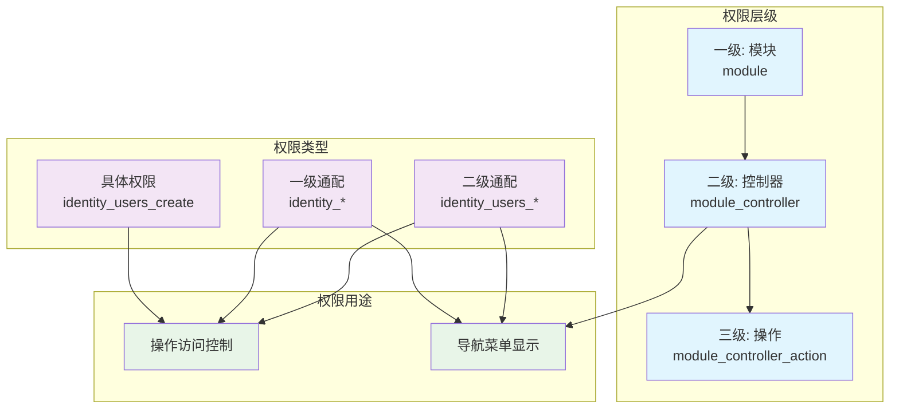

# CodeSpirit.Authorization 权限组件详解

> **文档版本**: v2.0.0  
> **最后更新**: 2025-11-02  
> **适用框架**: .NET 9

## 📖 目录

- [概述](#概述)
- [权限模型](#权限模型)
- [权限格式](#权限格式)
- [权限检查流程](#权限检查流程)
- [导航权限](#导航权限)
- [权限优化](#权限优化)
- [多租户平台权限](#多租户平台权限)
- [核心组件](#核心组件)
- [使用示例](#使用示例)
- [测试指南](#测试指南)
- [迁移指南](#迁移指南)

## 概述

CodeSpirit.Authorization 是框架的核心权限管理组件，实现了基于角色的访问控制（RBAC）和多租户平台权限验证系统。该组件提供了灵活、细粒度的权限控制机制，支持：

- ✅ **显式通配权限**：使用 `*` 明确标识通配权限
- ✅ **三级权限层级**：模块、控制器、操作
- ✅ **导航权限管理**：严格的导航菜单权限控制
- ✅ **自动权限优化**：移除冗余权限，保持存储简洁
- ✅ **多租户支持**：系统租户和业务租户隔离
- ✅ **大小写不敏感**：所有权限匹配不区分大小写
- ✅ **权限继承**：通过 `AllowInheritedPermissions` 支持特定场景的权限继承

## 权限模型

### 权限架构图



### 权限层级结构

权限采用三级层级结构，使用下划线 `_` 分隔：

| 层级 | 格式 | 示例 | 用途 |
|------|------|------|------|
| 一级 | `module` | `identity` | 模块标识（具体权限），不匹配子权限 |
| 二级 | `module_controller` | `identity_users` | 控制器权限（可用于导航） |
| 三级 | `module_controller_action` | `identity_users_create` | 具体操作权限 |

### 通配权限

通配权限必须**显式使用** `*` 号：

| 格式 | 示例 | 覆盖范围 | 用途 |
|------|------|----------|------|
| `module_*` | `identity_*` | 该模块下所有权限 | 模块级完全访问 + 导航 |
| `module_controller_*` | `identity_users_*` | 该控制器下所有操作 | 控制器级完全访问 + 导航 |

## 权限格式

### ✅ 正确的权限格式

```csharp
// ✅ 通配权限 - 必须显式使用 *
"identity_*"              // 匹配 identity 模块下所有权限
"identity_users_*"        // 匹配 identity_users 控制器下所有操作

// ✅ 具体权限 - 明确的操作
"identity_users"          // 二级权限（可用于导航）
"identity_users_create"   // 三级权限（具体操作）

// ✅ 一级权限 - 模块标识
"identity"                // 一级具体权限（不匹配子权限）
```

### ❌ 错误的理解

```csharp
// ❌ 旧逻辑（已废弃）- 不再支持隐式通配
"identity"                // 不会匹配 identity_users_create
"identity_users"          // 不会匹配 identity_users_create

// ✅ 必须改为显式通配
"identity_*"              // 正确
"identity_users_*"        // 正确
```

### 权限命名规范

```csharp
// 自动生成的权限名称
[ApiController]
[Route("api/[controller]")]
[DisplayName("用户管理")]
public class UsersController : ApiControllerBase
{
    // 权限名称: identity_users_create
    [HttpPost]
    [DisplayName("创建用户")]
    public async Task<ActionResult<ApiResponse>> Create([FromBody] CreateUserDto dto)
    {
        // ...
    }
    
    // 权限名称: identity_users_update
    [HttpPut("{id}")]
    [DisplayName("更新用户")]
    public async Task<ActionResult<ApiResponse>> Update(long id, [FromBody] UpdateUserDto dto)
    {
        // ...
    }
}

// 自定义权限名称
[HttpDelete("{id}")]
[Permission("identity_users_delete")]
[DisplayName("删除用户")]
public async Task<ActionResult<ApiResponse>> Delete(long id)
{
    // 使用自定义权限名称
}
```

## 权限检查流程

### 权限匹配算法

```csharp
public bool HasPermission(string permissionName, ISet<string> userPermissions)
{
    // 1. default_ 前缀直接放通（开放接口）
    if (permissionName.StartsWith("default_"))
        return true;

    // 2. 精确匹配（大小写不敏感）
    if (userPermissions.Contains(permissionName, StringComparer.OrdinalIgnoreCase))
        return true;

    // 3. 通配符逐级匹配
    // 权限: identity_users_create
    // 检查: identity_* -> identity_users_*
    var parts = permissionName.Split('_');
    for (int i = 0; i < parts.Length - 1; i++)
    {
        var wildcardPermission = string.Join("_", parts.Take(i + 1)) + "_*";
        
        if (userPermissions.Contains(wildcardPermission, StringComparer.OrdinalIgnoreCase))
            return true;
    }

    return false;
}
```

### 权限匹配示例

```csharp
// 用户拥有: identity_*
HasPermission("identity_users_create")      // ✅ true
HasPermission("identity_users_update")      // ✅ true
HasPermission("identity_roles_delete")      // ✅ true
HasPermission("exam_questions_create")      // ❌ false (不同模块)

// 用户拥有: identity_users_*
HasPermission("identity_users_create")      // ✅ true
HasPermission("identity_users_update")      // ✅ true
HasPermission("identity_roles_delete")      // ❌ false (不同控制器)

// 用户拥有: identity_users_create
HasPermission("identity_users_create")      // ✅ true (精确匹配)
HasPermission("identity_users_update")      // ❌ false (不匹配)

// 用户拥有: identity
HasPermission("identity_users_create")      // ❌ false (一级具体权限不匹配子权限)
```

### 大小写不敏感

所有权限匹配都是大小写不敏感的：

```csharp
// 以下权限等效
"identity_*" == "IDENTITY_*" == "Identity_*"

// 匹配也是大小写不敏感的
HasPermission("IDENTITY_USERS_CREATE")  // ✅ 可以被 identity_* 匹配
```

## 导航权限

导航权限用于控制菜单显示，有严格的提取规则。

### 导航权限提取规则

**只有以下两种权限会被提取为导航权限：**

1. **二级具体权限**（格式：`module_controller`）
2. **通配权限**（格式：`module_*` 或 `module_controller_*`）

**⚠️ 重要：三级权限（`module_controller_action`）不会自动提取为导航权限！**

### 导航权限提取算法

```csharp
private HashSet<string> ExtractNavigationPermissions(ISet<string> permissions)
{
    var navigationPermissions = new HashSet<string>(StringComparer.OrdinalIgnoreCase);

    foreach (var permission in permissions)
    {
        if (permission.EndsWith("_*"))
        {
            var parts = permission.Split('_');
            
            // 只保留一级通配（module_*）和二级通配（module_controller_*）
            if (parts.Length <= 3)
            {
                navigationPermissions.Add(permission);
            }
        }
        else
        {
            var parts = permission.Split('_');
            
            // 只保留二级具体权限（module_controller）
            if (parts.Length == 2)
            {
                navigationPermissions.Add(permission);
            }
        }
    }

    return navigationPermissions;
}
```

### 导航权限示例

```csharp
// 用户拥有的权限
var userPermissions = new[]
{
    "exam_examPapers",              // 二级权限 ✅ 会被提取
    "exam_examRecords_view",        // 三级权限 ❌ 不会被提取
    "exam_questions_*",             // 二级通配 ✅ 会被提取
    "identity_*",                   // 一级通配 ✅ 会被提取
    "reports_sales_export"          // 三级权限 ❌ 不会被提取
};

// 导航权限检查结果
HasNavigationPermission("exam_examPapers")     // ✅ true - 有二级权限
HasNavigationPermission("exam_examRecords")    // ❌ false - 只有三级权限，不提取
HasNavigationPermission("exam_questions")      // ✅ true - 有二级通配
HasNavigationPermission("identity_users")      // ✅ true - 有一级通配
HasNavigationPermission("reports_sales")       // ❌ false - 只有三级权限，不提取
```

### 如何显示导航菜单

如果要让用户看到某个导航菜单，必须赋予以下权限之一：

```csharp
// 选项1：赋予二级权限（精确控制）
"exam_examPapers"

// 选项2：赋予二级通配权限（控制器级别）
"exam_examPapers_*"

// 选项3：赋予一级通配权限（模块级别）
"exam_*"
```

**⚠️ 仅赋予三级权限不会显示导航菜单！**

```csharp
// ❌ 错误做法 - 不会显示导航
var permissions = new[] { "exam_examPapers_view", "exam_examPapers_create" };

// ✅ 正确做法 - 会显示导航
var permissions = new[] { "exam_examPapers" };  // 或 "exam_examPapers_*" 或 "exam_*"
```

## 权限优化

系统会自动优化权限存储，移除冗余的权限。

### 优化规则

当保存权限时，如果存在通配权限，会自动移除被其覆盖的具体权限：

```csharp
// 保存前的权限
var permissionsToSave = new[]
{
    "identity_*",                   // 一级通配
    "identity_users_create",        // 被 identity_* 覆盖
    "identity_users_update",        // 被 identity_* 覆盖
    "identity_roles_delete",        // 被 identity_* 覆盖
    "exam_questions_*",             // 二级通配
    "exam_questions_create",        // 被 exam_questions_* 覆盖
    "exam_questions_update"         // 被 exam_questions_* 覆盖
};

// 保存后的权限（自动优化）
var optimizedPermissions = new[]
{
    "identity_*",                   // 保留
    "exam_questions_*"              // 保留
};
// 冗余权限已被自动移除
```

### 优化算法

```csharp
private string[] OptimizePermissionIds(string[] permissionIds)
{
    var optimizedPermissions = new HashSet<string>(permissionIds, StringComparer.OrdinalIgnoreCase);
    var permissionsToRemove = new HashSet<string>(StringComparer.OrdinalIgnoreCase);

    // 找出所有通配权限
    foreach (var permission in permissionIds)
    {
        if (permission.EndsWith("_*"))
        {
            // 获取通配权限的前缀
            var prefix = permission.Substring(0, permission.Length - 2) + "_";

            // 找出被该通配权限覆盖的具体权限
            foreach (var other in permissionIds)
            {
                if (other != permission && other.StartsWith(prefix))
                {
                    permissionsToRemove.Add(other);
                }
            }
        }
    }

    // 移除冗余权限
    foreach (var permissionToRemove in permissionsToRemove)
    {
        optimizedPermissions.Remove(permissionToRemove);
    }

    return optimizedPermissions.ToArray();
}
```

## 多租户平台权限

### 平台类型定义

系统支持四种平台类型：

```csharp
public enum PlatformType
{
    None = 0,      // 禁止访问
    System = 1,    // 仅系统租户可访问
    Tenant = 2,    // 仅业务租户可访问
    Both = 3       // 系统和业务租户都可访问
}
```

### 租户类型分类

| 租户类型 | TenantId | 说明 |
|---------|----------|------|
| 系统租户 | `system` | 拥有系统级权限 |
| 默认租户 | `default` | 无业务权限 |
| 业务租户 | 其他 | 拥有业务级权限 |

### 平台权限验证矩阵

| 用户租户 | System | Tenant | Both | None |
|---------|--------|--------|------|------|
| system  | ✅     | ❌     | ✅   | ❌   |
| default | ❌     | ❌     | ❌   | ❌   |
| business| ❌     | ✅     | ✅   | ❌   |

### 平台权限使用示例

```csharp
// 控制器级别
[Platform(PlatformType.System)]
[ApiController]
[Route("api/[controller]")]
public class SystemManagementController : ControllerBase
{
    // 只有系统租户可以访问
}

// 方法级别
[ApiController]
[Route("api/[controller]")]
public class MixedController : ControllerBase
{
    [HttpGet("system-only")]
    [Platform(PlatformType.System)]
    public IActionResult SystemOnly() => Ok();

    [HttpGet("tenant-only")]
    [Platform(PlatformType.Tenant)]
    public IActionResult TenantOnly() => Ok();

    [HttpGet("common")]
    [Platform(PlatformType.Both)]
    public IActionResult Common() => Ok();
}
```

## 核心组件

### 1. PermissionService

权限服务的核心实现，提供权限树管理和权限检查功能。

**主要方法：**

```csharp
public interface IPermissionService
{
    /// <summary>
    /// 获取权限树
    /// </summary>
    List<PermissionNode> GetPermissionTree();

    /// <summary>
    /// 检查权限
    /// </summary>
    bool HasPermission(string permissionName, ISet<string> userPermissions);

    /// <summary>
    /// 初始化权限树
    /// </summary>
    Task InitializePermissionTree();
}
```

### 2. HasPermissionService

用于检查当前用户的权限，包括一般权限和导航权限。

**主要方法：**

```csharp
public interface IHasPermissionService
{
    /// <summary>
    /// 检查当前用户是否拥有指定权限
    /// </summary>
    bool HasPermission(string permissionCode);

    /// <summary>
    /// 检查当前用户是否拥有导航权限
    /// </summary>
    bool HasNavigationPermission(string permissionCode);
}
```

### 3. RolePermissionAuthorizationHandler

ASP.NET Core 授权处理器，自动检查控制器和方法的权限。

**功能：**
- 自动从元数据获取权限名称
- 支持 Admin 角色绕过权限检查
- 支持 `AllowInheritedPermissions` 特性

### 4. PlatformAuthorizationHandler

多租户平台权限验证处理器。

**功能：**
- 根据用户租户类型验证平台访问权限
- 支持系统租户、业务租户、双平台访问控制

## 使用示例

### 1. 基本权限配置

```csharp
// 为角色分配权限
var permissions = new[]
{
    // 方式1：使用通配权限（推荐）
    "identity_*",                    // 授予 identity 模块所有权限
    
    // 方式2：使用二级权限（用于导航）
    "exam_examPapers",               // 授予试卷管理导航权限
    
    // 方式3：使用具体权限
    "exam_examRecords_view",         // 授予查看考试记录的权限
    "exam_examRecords_export"        // 授予导出考试记录的权限
};

await roleService.UpdateRolePermissions(roleId, permissions);
```

### 2. 控制器权限配置

```csharp
[ApiController]
[Route("api/[controller]")]
[DisplayName("用户管理")]
public class UsersController : ApiControllerBase
{
    // 自动权限：identity_users_create
    [HttpPost]
    [DisplayName("创建用户")]
    public async Task<ActionResult<ApiResponse>> Create([FromBody] CreateUserDto dto)
    {
        // ...
    }

    // 自定义权限名称
    [HttpPut("{id}")]
    [Permission("identity_users_update")]
    [DisplayName("更新用户")]
    public async Task<ActionResult<ApiResponse>> Update(long id, [FromBody] UpdateUserDto dto)
    {
        // ...
    }
    
    // 权限继承
    [HttpGet("options")]
    [Permission(AllowInheritedPermissions = new[] { "identity_roles" })]
    [DisplayName("获取用户选项")]
    public async Task<ActionResult<ApiResponse<List<UserOptionDto>>>> GetUserOptions()
    {
        // 拥有 identity_users_getOptions 或 identity_roles 权限的用户都可以访问
        // ...
    }
}
```

### 3. 服务层权限检查

```csharp
public class UserService
{
    private readonly IHasPermissionService _hasPermissionService;

    public UserService(IHasPermissionService hasPermissionService)
    {
        _hasPermissionService = hasPermissionService;
    }

    public async Task CreateUser(CreateUserDto dto)
    {
        // 检查具体权限
        if (!_hasPermissionService.HasPermission("identity_users_create"))
        {
            throw new UnauthorizedException("无权创建用户");
        }

        // 业务逻辑中检查特殊权限
        if (dto.IsAdmin)
        {
            if (!_hasPermissionService.HasPermission("identity_users_createAdmin"))
            {
                throw new UnauthorizedException("无权创建管理员用户");
            }
        }
        
        // ...
    }
}
```

### 4. 前端导航权限检查

```typescript
// 前端 TypeScript 示例
async function getNavigationTree() {
    const response = await api.get('/api/navigation');
    const tree = response.data;
    
    // 过滤有权限的导航项
    return tree.filter(node => {
        // 如果用户有二级权限、通配权限，则显示该菜单
        return hasNavigationPermission(node.permission);
    });
}
```

## 测试指南

### 单元测试示例

```csharp
public class PermissionServiceTests
{
    private readonly IPermissionService _permissionService;
    private readonly Mock<ILogger<PermissionService>> _mockLogger;

    public PermissionServiceTests()
    {
        _mockLogger = new Mock<ILogger<PermissionService>>();
        _permissionService = new PermissionService(_mockLogger.Object);
    }

    [Fact]
    public void HasPermission_WhenExactMatch_ReturnsTrue()
    {
        // Arrange
        var permissionName = "identity_users_create";
        var userPermissions = new HashSet<string> { "identity_users_create" };

        // Act
        var result = _permissionService.HasPermission(permissionName, userPermissions);

        // Assert
        Assert.True(result);
    }

    [Fact]
    public void HasPermission_WhenModuleWildcard_ReturnsTrue()
    {
        // Arrange
        var permissionName = "identity_users_create";
        var userPermissions = new HashSet<string> { "identity_*" };

        // Act
        var result = _permissionService.HasPermission(permissionName, userPermissions);

        // Assert
        Assert.True(result);
    }

    [Fact]
    public void HasPermission_WhenControllerWildcard_ReturnsTrue()
    {
        // Arrange
        var permissionName = "identity_users_create";
        var userPermissions = new HashSet<string> { "identity_users_*" };

        // Act
        var result = _permissionService.HasPermission(permissionName, userPermissions);

        // Assert
        Assert.True(result);
    }
}
```

### 完整测试套件

完整的单元测试位于：
- `Tests/Components/CodeSpirit.Authorization.Tests/PermissionServiceTests.cs`
- `Tests/Components/CodeSpirit.Authorization.Tests/HasPermissionServiceTests.cs`
- `Tests/Components/CodeSpirit.Authorization.Tests/OptimizePermissionIdsTests.cs`
- `Tests/Components/CodeSpirit.Authorization.Tests/ExtractNavigationPermissionsTests.cs`

总共 **50 个单元测试**，覆盖所有核心功能。

## 迁移指南

### 从旧版本迁移

如果您的系统之前使用旧的隐式通配逻辑，需要进行以下迁移：

#### 1. 权限数据迁移

```sql
-- 示例：将一级权限转换为通配权限
-- 旧数据：identity
-- 新数据：identity_*

UPDATE Roles 
SET PermissionIds = REPLACE(PermissionIds, '"identity"', '"identity_*"')
WHERE PermissionIds LIKE '%"identity"%'
  AND PermissionIds NOT LIKE '%identity_%';
```

#### 2. 添加导航权限

```csharp
// 如果用户只有三级权限但需要看到导航菜单
// 需要添加对应的二级权限

// 旧配置（只有操作权限，看不到菜单）
var oldPermissions = new[]
{
    "exam_examPapers_view",
    "exam_examPapers_create"
};

// 新配置（添加导航权限）
var newPermissions = new[]
{
    "exam_examPapers",          // 添加：显示导航菜单
    "exam_examPapers_view",
    "exam_examPapers_create"
};

// 或使用通配权限（更简洁）
var betterPermissions = new[]
{
    "exam_examPapers_*"         // 包含所有功能和导航
};
```

#### 3. 更新代码中的权限检查

```csharp
// ❌ 旧代码
if (user.Permissions.Contains("identity"))
{
    // ...
}

// ✅ 新代码
if (await _hasPermissionService.HasPermission("identity_users_create"))
{
    // 使用具体的权限检查
}

// 或者用户应该被赋予通配权限
var permissions = new[] { "identity_*" };
```

### 测试迁移指南

详细的测试迁移指南请参阅：
- [测试迁移指南](../../Tests/Components/CodeSpirit.Authorization.Tests/TEST_MIGRATION_GUIDE.md)
- [迁移状态](../../Tests/Components/CodeSpirit.Authorization.Tests/MIGRATION_STATUS.md)

## 常见问题

### Q1: 为什么我的导航菜单不显示？

**A:** 检查以下几点：
1. 是否只赋予了三级权限？三级权限不会显示导航。
2. 是否需要添加二级权限或通配权限？
3. 使用 `HasNavigationPermission` 方法检查。

### Q2: 通配权限必须用 * 号吗？

**A:** 是的！新逻辑要求显式使用 `*` 号来标识通配权限。

### Q3: 如何给用户完全的模块访问权限？

**A:** 使用一级通配权限：`"identity_*"`

### Q4: 权限是区分大小写的吗？

**A:** 不区分。所有权限匹配都是大小写不敏感的。

## 参考资料

- [权限组件 README](../../Src/Components/CodeSpirit.Authorization/README.md)
- [权限继承使用指南](CodeSpirit.Authorization权限继承使用指南.md)
- [测试文档](../../Tests/Components/CodeSpirit.Authorization.Tests/README.md)
- [完成总结](../../Tests/Components/CodeSpirit.Authorization.Tests/COMPLETION_SUMMARY.md)

## 更新日志

### v2.0.0 (2025-11-02)
- 🔄 **重大变更**：移除隐式通配逻辑，改为显式通配（必须使用 `*`）
- ✨ 新增：自动权限优化功能
- ✨ 新增：严格的导航权限提取规则
- 🔧 修复：大小写不敏感匹配
- 📝 新增：完整的文档和迁移指南
- ✅ 新增：50 个单元测试

### v1.0.0
- 初始版本，使用隐式通配逻辑（已废弃）

---

**维护团队**: CodeSpirit Team  
**最后更新**: 2025-11-02  
**版本**: 2.0.0
