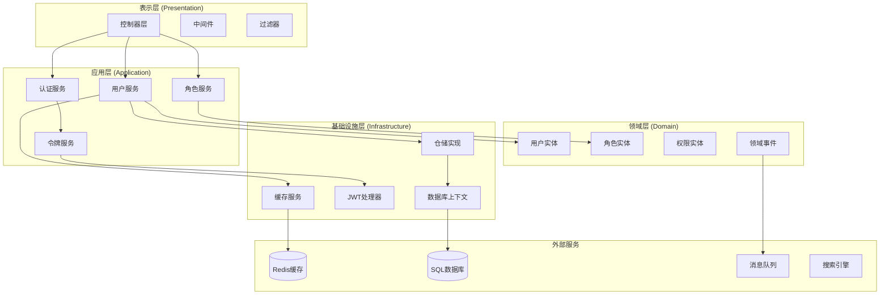

# CodeSpirit.IdentityApi 身份认证服务

## 概述

CodeSpirit.IdentityApi是框架的核心身份认证服务，基于ASP.NET Core Identity构建，提供完整的用户管理、角色管理、权限控制和JWT认证功能。该服务采用Clean Architecture设计，支持多种认证方式和细粒度的权限控制。

## 服务架构



## 核心功能模块

### 1. 用户管理模块

#### 1.1 用户实体设计

```csharp
/// <summary>
/// 应用用户实体
/// </summary>
public class ApplicationUser : IdentityUser<long>, IIsActive, IFullEntityEvent, IFullAuditable
{
    /// <summary>
    /// 姓名
    /// </summary>
    [Required]
    [MaxLength(20)]
    public string Name { get; set; }

    /// <summary>
    /// 身份证号码
    /// </summary>
    [MaxLength(18)]
    public string IdNo { get; set; }

    /// <summary>
    /// 头像地址
    /// </summary>
    [MaxLength(255, ErrorMessage = "图片地址长度不应超过255！")]
    [DataType(DataType.ImageUrl)]
    public string AvatarUrl { get; set; }

    /// <summary>
    /// 最后登录时间
    /// </summary>
    public DateTimeOffset? LastLoginTime { get; set; }

    /// <summary>
    /// 是否激活
    /// </summary>
    public bool IsActive { get; set; }

    /// <summary>
    /// 性别
    /// </summary>
    public Gender Gender { get; internal set; }

    /// <summary>
    /// 用户与角色的多对多关系
    /// </summary>
    public ICollection<ApplicationUserRole> UserRoles { get; set; }

    // IFullAuditable 接口实现
    public long CreatedBy { get; set; }
    public DateTime CreatedAt { get; set; }
    public long? UpdatedBy { get; set; }
    public DateTime? UpdatedAt { get; set; }
    public long? DeletedBy { get; set; }
    public DateTime? DeletedAt { get; set; }
    public bool IsDeleted { get; set; }
}

/// <summary>
/// 性别枚举
/// </summary>
public enum Gender
{
    /// <summary>
    /// 未知
    /// </summary>
    [Display(Name = "未知")]
    Unknown = 0,

    /// <summary>
    /// 男
    /// </summary>
    [Display(Name = "男")]
    Male = 1,

    /// <summary>
    /// 女
    /// </summary>
    [Display(Name = "女")]
    Female = 2
}

**设计特点**:
- 继承自 `IdentityUser<long>`，使用长整型作为主键
- 实现 `IIsActive` 接口，支持激活状态管理
- 实现 `IFullEntityEvent` 接口，支持领域事件
- 实现 `IFullAuditable` 接口，提供完整的审计字段
- 支持软删除功能
- 包含用户基本信息和扩展属性
```

#### 1.2 用户服务接口

```csharp
/// <summary>
/// 用户服务接口
/// </summary>
public interface IUserService
{
    /// <summary>
    /// 创建用户
    /// </summary>
    Task<ApiResponse<UserDto>> CreateUserAsync(CreateUserDto dto);

    /// <summary>
    /// 更新用户
    /// </summary>
    Task<ApiResponse<UserDto>> UpdateUserAsync(long id, UpdateUserDto dto);

    /// <summary>
    /// 删除用户
    /// </summary>
    Task<ApiResponse<bool>> DeleteUserAsync(long id);

    /// <summary>
    /// 获取用户详情
    /// </summary>
    Task<ApiResponse<UserDto>> GetUserAsync(long id);

    /// <summary>
    /// 分页查询用户
    /// </summary>
    Task<ApiResponse<PageList<UserDto>>> GetUsersAsync(UserQueryDto query);

    /// <summary>
    /// 重置用户密码
    /// </summary>
    Task<ApiResponse<bool>> ResetPasswordAsync(long id, ResetPasswordDto dto);

    /// <summary>
    /// 锁定/解锁用户
    /// </summary>
    Task<ApiResponse<bool>> SetUserLockStatusAsync(long id, bool isLocked);

    /// <summary>
    /// 分配角色
    /// </summary>
    Task<ApiResponse<bool>> AssignRolesAsync(long userId, List<string> roleNames);
}
```

#### 1.3 用户DTO设计

```csharp
/// <summary>
/// 创建用户DTO
/// </summary>
public class CreateUserDto
{
    [Required]
    [MaxLength(20)]
    [DisplayName("姓名")]
    public string Name { get; set; }

    [Required]
    [DisplayName("用户名")]
    [MaxLength(256)]
    [RegularExpression(@"^[a-zA-Z0-9_]+$", ErrorMessage = "用户名只能包含字母、数字和下划线")]
    public string UserName { get; set; }

    [Required]
    [DataType(DataType.EmailAddress)]
    [DisplayName("邮箱")]
    public string Email { get; set; }

    [Required]
    [DataType(DataType.PhoneNumber)]
    [DisplayName("手机号")]
    public string PhoneNumber { get; set; }

    [MaxLength(18)]
    [DisplayName("身份证")]
    [RegularExpression(@"^\d{15}|\d{18}$", ErrorMessage = "身份证号码格式不正确")]
    public string IdNo { get; set; }

    [DisplayName("头像")]
    [AmisInputImageField(
        Label = "头像",
        Receiver = "${API_HOST}/api/identity/upload/avatar",
        Accept = "image/png,image/jpeg",
        MaxSize = 1048576,
        Multiple = false
    )]
    public string AvatarUrl { get; set; }

    [DisplayName("性别")]
    public Gender Gender { get; set; }

    [DisplayName("分配角色")]
    [AmisSelectField(
        Source = "${API_HOST}/api/identity/Roles",
        ValueField = "name",
        LabelField = "name",
        Multiple = true,
        Searchable = true
    )]
    public List<string> Roles { get; set; }

    [Required]
    [DataType(DataType.Password)]
    [DisplayName("密码")]
    [MinLength(6)]
    public string Password { get; set; }

    [Required]
    [DataType(DataType.Password)]
    [DisplayName("确认密码")]
    [Compare("Password", ErrorMessage = "密码和确认密码不匹配")]
    public string ConfirmPassword { get; set; }
}

/// <summary>
/// 用户查询DTO
/// </summary>
public class UserQueryDto : PagedRequest
{
    [DisplayName("姓名")]
    public string Name { get; set; }

    [DisplayName("用户名")]
    public string UserName { get; set; }

    [DisplayName("邮箱")]
    public string Email { get; set; }

    [DisplayName("手机号")]
    public string PhoneNumber { get; set; }

    [DisplayName("是否激活")]
    public bool? IsActive { get; set; }

    [DisplayName("创建时间范围")]
    public DateTimeOffset[] CreatedRange { get; set; }
}

/// <summary>
/// 用户信息DTO
/// </summary>
public class UserDto
{
    public long Id { get; set; }
    
    [DisplayName("姓名")]
    public string Name { get; set; }
    
    [DisplayName("用户名")]
    public string UserName { get; set; }
    
    [DisplayName("邮箱")]
    public string Email { get; set; }
    
    [DisplayName("手机号")]
    public string PhoneNumber { get; set; }
    
    [DisplayName("身份证")]
    public string IdNo { get; set; }
    
    [DisplayName("头像")]
    [AmisImageField]
    public string AvatarUrl { get; set; }
    
    [DisplayName("性别")]
    public Gender Gender { get; set; }
    
    [DisplayName("是否激活")]
    [AmisSwitchField]
    public bool IsActive { get; set; }
    
    [DisplayName("最后登录时间")]
    [AmisDateField(Format = "YYYY-MM-DD HH:mm:ss")]
    public DateTimeOffset? LastLoginTime { get; set; }
    
    [DisplayName("创建时间")]
    [AmisDateField(Format = "YYYY-MM-DD HH:mm:ss")]
    public DateTimeOffset CreatedAt { get; set; }
    
    [DisplayName("角色")]
    [AmisTagsField]
    public List<string> Roles { get; set; }
}
```

### 2. 角色管理模块

#### 2.1 角色实体设计

```csharp
/// <summary>
/// 应用角色实体
/// </summary>
public class ApplicationRole : IdentityRole<long>
{
    /// <summary>
    /// 角色描述
    /// </summary>
    [MaxLength(500)]
    public string Description { get; set; }

    /// <summary>
    /// 是否系统角色
    /// </summary>
    public bool IsSystem { get; set; }

    /// <summary>
    /// 创建时间
    /// </summary>
    public DateTimeOffset CreatedAt { get; set; }

    /// <summary>
    /// 更新时间
    /// </summary>
    public DateTimeOffset? UpdatedAt { get; set; }

    /// <summary>
    /// 创建人
    /// </summary>
    public long? CreatedBy { get; set; }

    /// <summary>
    /// 更新人
    /// </summary>
    public long? UpdatedBy { get; set; }
}
```

#### 2.2 角色服务接口

```csharp
/// <summary>
/// 角色服务接口
/// </summary>
public interface IRoleService
{
    /// <summary>
    /// 创建角色
    /// </summary>
    Task<ApiResponse<RoleDto>> CreateRoleAsync(CreateRoleDto dto);

    /// <summary>
    /// 更新角色
    /// </summary>
    Task<ApiResponse<RoleDto>> UpdateRoleAsync(long id, UpdateRoleDto dto);

    /// <summary>
    /// 删除角色
    /// </summary>
    Task<ApiResponse<bool>> DeleteRoleAsync(long id);

    /// <summary>
    /// 获取角色详情
    /// </summary>
    Task<ApiResponse<RoleDto>> GetRoleAsync(long id);

    /// <summary>
    /// 分页查询角色
    /// </summary>
    Task<ApiResponse<PageList<RoleDto>>> GetRolesAsync(RoleQueryDto query);

    /// <summary>
    /// 分配权限
    /// </summary>
    Task<ApiResponse<bool>> AssignPermissionsAsync(long roleId, List<string> permissions);

    /// <summary>
    /// 获取角色权限
    /// </summary>
    Task<ApiResponse<List<string>>> GetRolePermissionsAsync(long roleId);
}
```

### 3. 认证授权模块

#### 3.1 JWT认证配置

```csharp
/// <summary>
/// JWT配置选项
/// </summary>
public class JwtOptions
{
    public string SecretKey { get; set; }
    public string Issuer { get; set; }
    public string Audience { get; set; }
    public int ExpirationMinutes { get; set; } = 60;
    public int RefreshTokenExpirationDays { get; set; } = 7;
}

/// <summary>
/// JWT令牌处理器接口
/// </summary>
public interface IJwtTokenHandler
{
    /// <summary>
    /// 生成访问令牌
    /// </summary>
    Task<string> GenerateAccessTokenAsync(ApplicationUser user);

    /// <summary>
    /// 生成刷新令牌
    /// </summary>
    string GenerateRefreshToken();

    /// <summary>
    /// 验证令牌
    /// </summary>
    ClaimsPrincipal ValidateToken(string token);

    /// <summary>
    /// 从令牌获取用户ID
    /// </summary>
    long? GetUserIdFromToken(string token);
}
```

#### 3.2 认证服务实现

```csharp
/// <summary>
/// 认证服务接口
/// </summary>
public interface IAuthService
{
    /// <summary>
    /// 用户登录
    /// </summary>
    Task<ApiResponse<LoginResultDto>> LoginAsync(LoginDto dto);

    /// <summary>
    /// 刷新令牌
    /// </summary>
    Task<ApiResponse<LoginResultDto>> RefreshTokenAsync(RefreshTokenDto dto);

    /// <summary>
    /// 用户登出
    /// </summary>
    Task<ApiResponse<bool>> LogoutAsync();

    /// <summary>
    /// 修改密码
    /// </summary>
    Task<ApiResponse<bool>> ChangePasswordAsync(ChangePasswordDto dto);

    /// <summary>
    /// 忘记密码
    /// </summary>
    Task<ApiResponse<bool>> ForgotPasswordAsync(ForgotPasswordDto dto);

    /// <summary>
    /// 重置密码
    /// </summary>
    Task<ApiResponse<bool>> ResetPasswordAsync(ResetPasswordDto dto);
}

/// <summary>
/// 登录DTO
/// </summary>
public class LoginDto
{
    [Required]
    [DisplayName("用户名")]
    public string UserName { get; set; }

    [Required]
    [DataType(DataType.Password)]
    [DisplayName("密码")]
    public string Password { get; set; }

    [DisplayName("记住我")]
    public bool RememberMe { get; set; }
}

/// <summary>
/// 登录结果DTO
/// </summary>
public class LoginResultDto
{
    /// <summary>
    /// 访问令牌
    /// </summary>
    public string AccessToken { get; set; }

    /// <summary>
    /// 刷新令牌
    /// </summary>
    public string RefreshToken { get; set; }

    /// <summary>
    /// 令牌类型
    /// </summary>
    public string TokenType { get; set; } = "Bearer";

    /// <summary>
    /// 过期时间（秒）
    /// </summary>
    public int ExpiresIn { get; set; }

    /// <summary>
    /// 用户信息
    /// </summary>
    public UserDto User { get; set; }
}
```

### 4. 权限控制模块

#### 4.1 权限节点定义

```csharp
/// <summary>
/// 权限节点
/// </summary>
public class PermissionNode
{
    /// <summary>
    /// 权限名称
    /// </summary>
    public string Name { get; set; }

    /// <summary>
    /// 显示名称
    /// </summary>
    public string DisplayName { get; set; }

    /// <summary>
    /// 权限描述
    /// </summary>
    public string Description { get; set; }

    /// <summary>
    /// 父级权限
    /// </summary>
    public string ParentName { get; set; }

    /// <summary>
    /// 子权限列表
    /// </summary>
    public List<PermissionNode> Children { get; set; } = new List<PermissionNode>();

    /// <summary>
    /// 是否选中
    /// </summary>
    public bool IsGranted { get; set; }
}
```

#### 4.2 权限授权处理器

```csharp
/// <summary>
/// 角色权限授权处理器
/// </summary>
public class RolePermissionAuthorizationHandler : AuthorizationHandler<PermissionRequirement>
{
    private readonly IPermissionService _permissionService;
    private readonly ICurrentUser _currentUser;

    public RolePermissionAuthorizationHandler(
        IPermissionService permissionService,
        ICurrentUser currentUser)
    {
        _permissionService = permissionService;
        _currentUser = currentUser;
    }

    protected override async Task HandleRequirementAsync(
        AuthorizationHandlerContext context,
        PermissionRequirement requirement)
    {
        if (!_currentUser.IsAuthenticated)
        {
            context.Fail();
            return;
        }

        var hasPermission = await _permissionService.HasPermissionAsync(
            _currentUser.Id.Value, 
            requirement.Permission);

        if (hasPermission)
        {
            context.Succeed(requirement);
        }
        else
        {
            context.Fail();
        }
    }
}
```

## API接口设计

### 1. 用户管理API

```csharp
/// <summary>
/// 用户管理控制器
/// </summary>
[ApiController]
[Route("api/identity/[controller]")]
[Authorize]
public class UsersController : ControllerBase
{
    private readonly IUserService _userService;

    public UsersController(IUserService userService)
    {
        _userService = userService;
    }

    /// <summary>
    /// 创建用户
    /// </summary>
    [HttpPost]
    [RequirePermission("User.Create")]
    public async Task<IActionResult> CreateUser(CreateUserDto dto)
    {
        var result = await _userService.CreateUserAsync(dto);
        return Ok(result);
    }

    /// <summary>
    /// 更新用户
    /// </summary>
    [HttpPut("{id}")]
    [RequirePermission("User.Update")]
    public async Task<IActionResult> UpdateUser(long id, UpdateUserDto dto)
    {
        var result = await _userService.UpdateUserAsync(id, dto);
        return Ok(result);
    }

    /// <summary>
    /// 删除用户
    /// </summary>
    [HttpDelete("{id}")]
    [RequirePermission("User.Delete")]
    public async Task<IActionResult> DeleteUser(long id)
    {
        var result = await _userService.DeleteUserAsync(id);
        return Ok(result);
    }

    /// <summary>
    /// 获取用户详情
    /// </summary>
    [HttpGet("{id}")]
    [RequirePermission("User.View")]
    public async Task<IActionResult> GetUser(long id)
    {
        var result = await _userService.GetUserAsync(id);
        return Ok(result);
    }

    /// <summary>
    /// 分页查询用户
    /// </summary>
    [HttpGet]
    [RequirePermission("User.View")]
    public async Task<IActionResult> GetUsers([FromQuery] UserQueryDto query)
    {
        var result = await _userService.GetUsersAsync(query);
        return Ok(result);
    }

    /// <summary>
    /// 重置用户密码
    /// </summary>
    [HttpPost("{id}/reset-password")]
    [RequirePermission("User.ResetPassword")]
    public async Task<IActionResult> ResetPassword(long id, ResetPasswordDto dto)
    {
        var result = await _userService.ResetPasswordAsync(id, dto);
        return Ok(result);
    }

    /// <summary>
    /// 锁定/解锁用户
    /// </summary>
    [HttpPost("{id}/lock")]
    [RequirePermission("User.Lock")]
    public async Task<IActionResult> SetUserLockStatus(long id, [FromBody] bool isLocked)
    {
        var result = await _userService.SetUserLockStatusAsync(id, isLocked);
        return Ok(result);
    }

    /// <summary>
    /// 分配角色
    /// </summary>
    [HttpPost("{id}/roles")]
    [RequirePermission("User.AssignRole")]
    public async Task<IActionResult> AssignRoles(long id, [FromBody] List<string> roleNames)
    {
        var result = await _userService.AssignRolesAsync(id, roleNames);
        return Ok(result);
    }
}
```

### 2. 认证API

```csharp
/// <summary>
/// 认证控制器
/// </summary>
[ApiController]
[Route("api/identity/[controller]")]
public class AuthController : ControllerBase
{
    private readonly IAuthService _authService;

    public AuthController(IAuthService authService)
    {
        _authService = authService;
    }

    /// <summary>
    /// 用户登录
    /// </summary>
    [HttpPost("login")]
    public async Task<IActionResult> Login(LoginDto dto)
    {
        var result = await _authService.LoginAsync(dto);
        return Ok(result);
    }

    /// <summary>
    /// 刷新令牌
    /// </summary>
    [HttpPost("refresh")]
    public async Task<IActionResult> RefreshToken(RefreshTokenDto dto)
    {
        var result = await _authService.RefreshTokenAsync(dto);
        return Ok(result);
    }

    /// <summary>
    /// 用户登出
    /// </summary>
    [HttpPost("logout")]
    [Authorize]
    public async Task<IActionResult> Logout()
    {
        var result = await _authService.LogoutAsync();
        return Ok(result);
    }

    /// <summary>
    /// 修改密码
    /// </summary>
    [HttpPost("change-password")]
    [Authorize]
    public async Task<IActionResult> ChangePassword(ChangePasswordDto dto)
    {
        var result = await _authService.ChangePasswordAsync(dto);
        return Ok(result);
    }

    /// <summary>
    /// 忘记密码
    /// </summary>
    [HttpPost("forgot-password")]
    public async Task<IActionResult> ForgotPassword(ForgotPasswordDto dto)
    {
        var result = await _authService.ForgotPasswordAsync(dto);
        return Ok(result);
    }

    /// <summary>
    /// 重置密码
    /// </summary>
    [HttpPost("reset-password")]
    public async Task<IActionResult> ResetPassword(ResetPasswordDto dto)
    {
        var result = await _authService.ResetPasswordAsync(dto);
        return Ok(result);
    }
}
```

## 数据库设计

### 1. 用户相关表结构

```sql
-- 用户表
CREATE TABLE AspNetUsers (
    Id BIGINT IDENTITY(1,1) PRIMARY KEY,
    UserName NVARCHAR(256) NOT NULL,
    NormalizedUserName NVARCHAR(256) NOT NULL,
    Email NVARCHAR(256) NOT NULL,
    NormalizedEmail NVARCHAR(256) NOT NULL,
    EmailConfirmed BIT NOT NULL DEFAULT 0,
    PasswordHash NVARCHAR(MAX),
    SecurityStamp NVARCHAR(MAX),
    ConcurrencyStamp NVARCHAR(MAX),
    PhoneNumber NVARCHAR(MAX),
    PhoneNumberConfirmed BIT NOT NULL DEFAULT 0,
    TwoFactorEnabled BIT NOT NULL DEFAULT 0,
    LockoutEnd DATETIMEOFFSET,
    LockoutEnabled BIT NOT NULL DEFAULT 1,
    AccessFailedCount INT NOT NULL DEFAULT 0,
    
    -- 扩展字段
    Name NVARCHAR(20) NOT NULL,
    IdNo NVARCHAR(18),
    AvatarUrl NVARCHAR(500),
    Gender INT NOT NULL DEFAULT 0,
    IsActive BIT NOT NULL DEFAULT 1,
    LastLoginTime DATETIMEOFFSET,
    CreatedAt DATETIMEOFFSET NOT NULL DEFAULT GETUTCDATE(),
    UpdatedAt DATETIMEOFFSET,
    CreatedBy BIGINT,
    UpdatedBy BIGINT
);

-- 角色表
CREATE TABLE AspNetRoles (
    Id BIGINT IDENTITY(1,1) PRIMARY KEY,
    Name NVARCHAR(256) NOT NULL,
    NormalizedName NVARCHAR(256) NOT NULL,
    ConcurrencyStamp NVARCHAR(MAX),
    
    -- 扩展字段
    Description NVARCHAR(500),
    IsSystem BIT NOT NULL DEFAULT 0,
    CreatedAt DATETIMEOFFSET NOT NULL DEFAULT GETUTCDATE(),
    UpdatedAt DATETIMEOFFSET,
    CreatedBy BIGINT,
    UpdatedBy BIGINT
);

-- 用户角色关联表
CREATE TABLE AspNetUserRoles (
    UserId BIGINT NOT NULL,
    RoleId BIGINT NOT NULL,
    PRIMARY KEY (UserId, RoleId),
    FOREIGN KEY (UserId) REFERENCES AspNetUsers(Id) ON DELETE CASCADE,
    FOREIGN KEY (RoleId) REFERENCES AspNetRoles(Id) ON DELETE CASCADE
);

-- 登录日志表
CREATE TABLE LoginLogs (
    Id BIGINT IDENTITY(1,1) PRIMARY KEY,
    UserId BIGINT,
    UserName NVARCHAR(256),
    LoginTime DATETIMEOFFSET NOT NULL,
    IpAddress NVARCHAR(45),
    UserAgent NVARCHAR(500),
    IsSuccess BIT NOT NULL,
    FailureReason NVARCHAR(500),
    FOREIGN KEY (UserId) REFERENCES AspNetUsers(Id)
);
```

## 配置和部署

### 1. 服务配置

```json
{
  "ConnectionStrings": {
    "identity-api": "Server=localhost;Database=CodeSpirit_Identity;Trusted_Connection=true;TrustServerCertificate=true;"
  },
  "Jwt": {
    "SecretKey": "your-super-secret-key-here-must-be-at-least-32-characters",
    "Issuer": "CodeSpirit",
    "Audience": "CodeSpirit.Client",
    "ExpirationMinutes": 60
  },
  "User": {
    "Password": {
      "RequireDigit": true,
      "RequireLowercase": true,
      "RequireNonAlphanumeric": false,
      "RequireUppercase": true,
      "RequiredLength": 6
    },
    "Lockout": {
      "DefaultLockoutMinutes": 5,
      "MaxFailedAttempts": 5
    }
  },
  "Redis": {
    "ConnectionString": "localhost:6379"
  },
  "RabbitMQ": {
    "HostName": "localhost",
    "Port": 5672,
    "UserName": "guest",
    "Password": "guest"
  }
}
```

### 2. 服务注册

```csharp
public static class ServiceCollectionExtensions
{
    public static WebApplicationBuilder AddIdentityApiServices(this WebApplicationBuilder builder)
    {
        // 添加数据库
        builder.Services.AddDatabase(builder.Configuration);
        
        // 添加Identity服务
        builder.Services.AddIdentityServices();
        
        // 添加JWT认证
        builder.Services.AddJwtAuthentication(builder.Configuration);
        
        // 添加自定义服务
        builder.Services.AddCustomServices();
        
        // 添加控制器
        builder.Services.ConfigureDefaultControllers();
        
        // 添加缓存
        builder.AddRedisClient("redis");
        
        // 添加消息队列
        builder.AddRabbitMQClient("rabbitmq");
        
        return builder;
    }
}
```

## 安全考虑

### 1. 密码安全

- 使用ASP.NET Core Identity的密码哈希机制
- 支持密码复杂度配置
- 实现密码历史记录防止重复使用

### 2. 令牌安全

- JWT令牌使用强密钥签名
- 实现令牌黑名单机制
- 支持令牌刷新和自动过期

### 3. 账户安全

- 实现账户锁定机制
- 记录登录日志和异常行为
- 支持多因子认证（计划中）

### 4. API安全

- 所有敏感操作需要权限验证
- 实现请求频率限制
- 记录所有操作的审计日志

## 监控和日志

### 1. 性能监控

- 数据库查询性能监控
- API响应时间监控
- 缓存命中率监控

### 2. 安全监控

- 登录失败次数监控
- 异常IP访问监控
- 权限违规操作监控

### 3. 业务监控

- 用户注册趋势
- 活跃用户统计
- 功能使用情况分析

## 最佳实践

### 1. 开发实践

1. **使用强类型DTO**：确保API接口的类型安全
2. **实现输入验证**：在DTO层面进行数据验证
3. **异常处理**：使用统一的异常处理机制
4. **日志记录**：记录关键操作和异常信息

### 2. 安全实践

1. **最小权限原则**：用户只获得必要的权限
2. **定期密码更新**：强制用户定期更新密码
3. **会话管理**：合理设置会话超时时间
4. **输入过滤**：防止SQL注入和XSS攻击

### 3. 性能实践

1. **缓存策略**：合理使用Redis缓存热点数据
2. **数据库优化**：创建合适的索引和查询优化
3. **分页查询**：大数据量查询使用分页
4. **异步处理**：耗时操作使用异步方法

## 总结

CodeSpirit.IdentityApi提供了完整的身份认证和授权解决方案：

1. **完整的用户管理**：支持用户的全生命周期管理
2. **灵活的角色权限**：基于RBAC的细粒度权限控制
3. **安全的认证机制**：基于JWT的无状态认证
4. **丰富的API接口**：RESTful风格的API设计
5. **强大的扩展性**：支持自定义权限和业务逻辑
6. **完善的监控**：全面的日志记录和性能监控

该服务为整个CodeSpirit框架提供了坚实的安全基础，确保了系统的安全性和可靠性。 