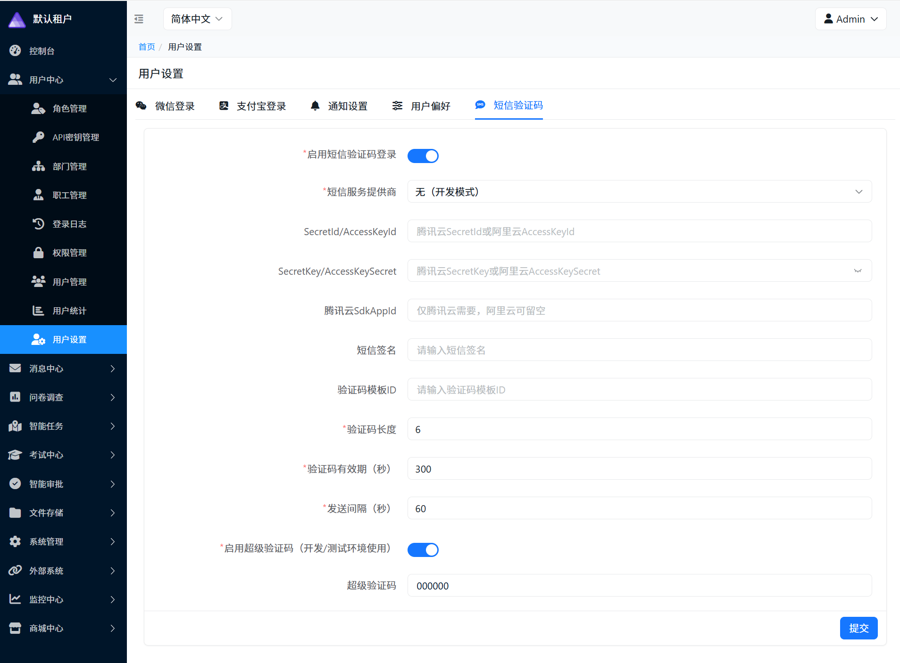
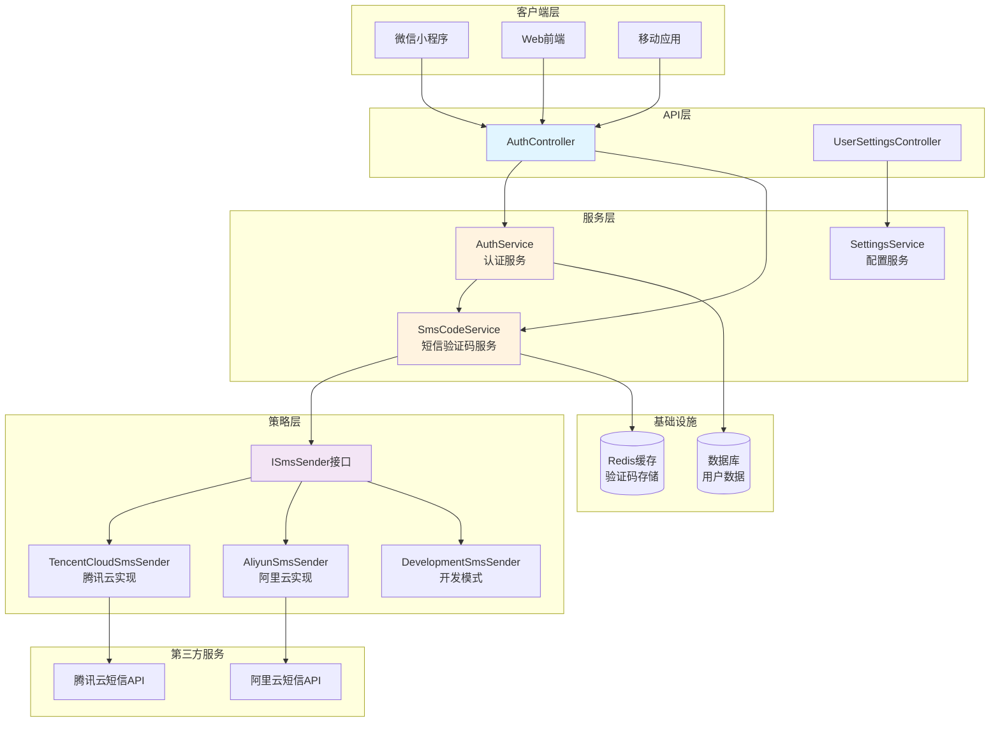
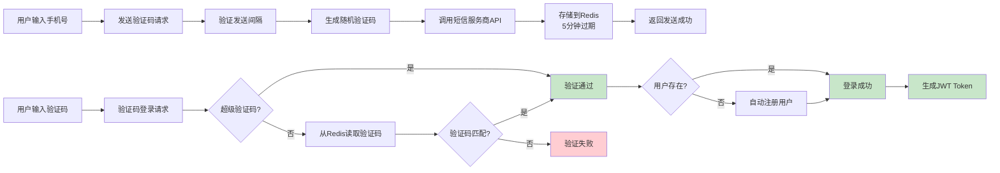
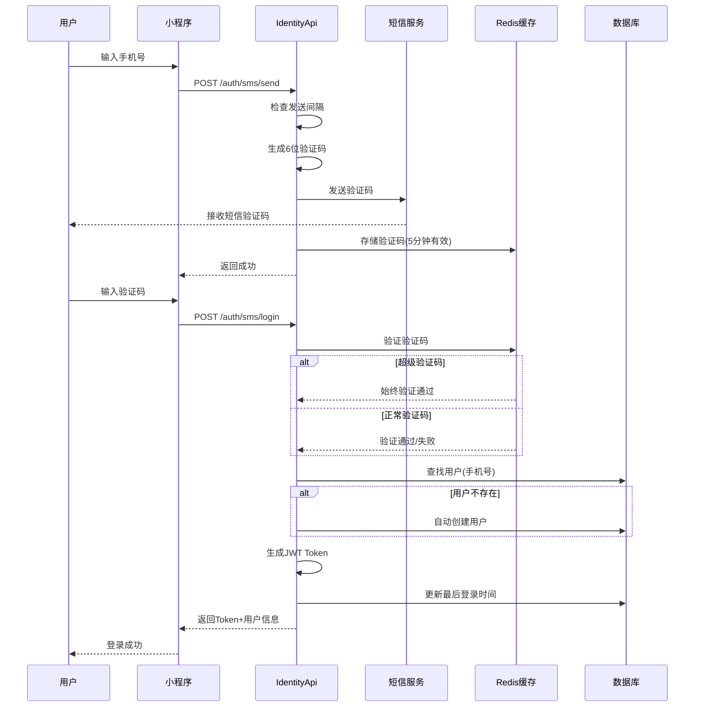
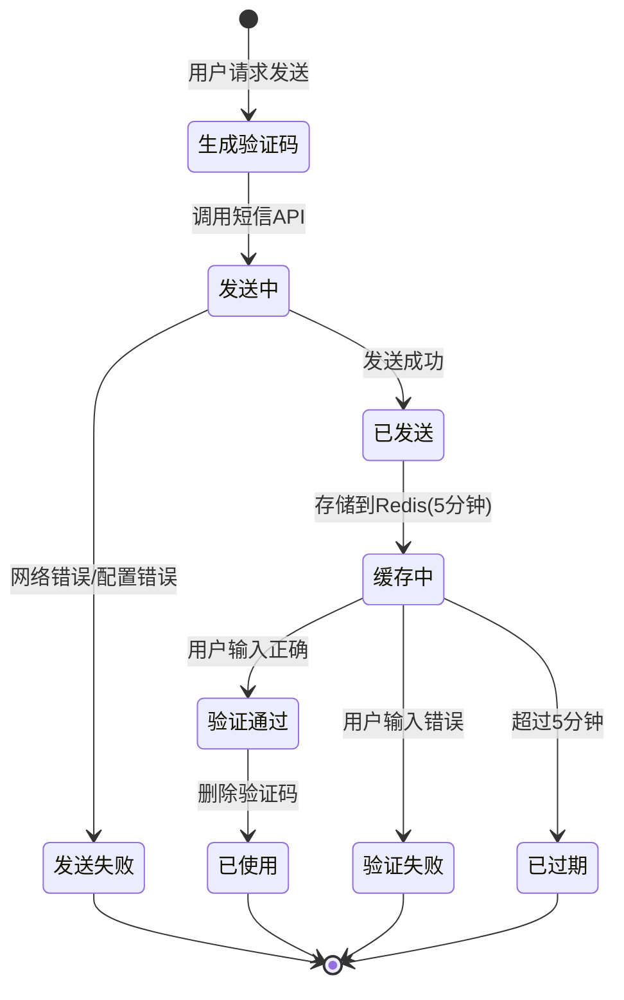
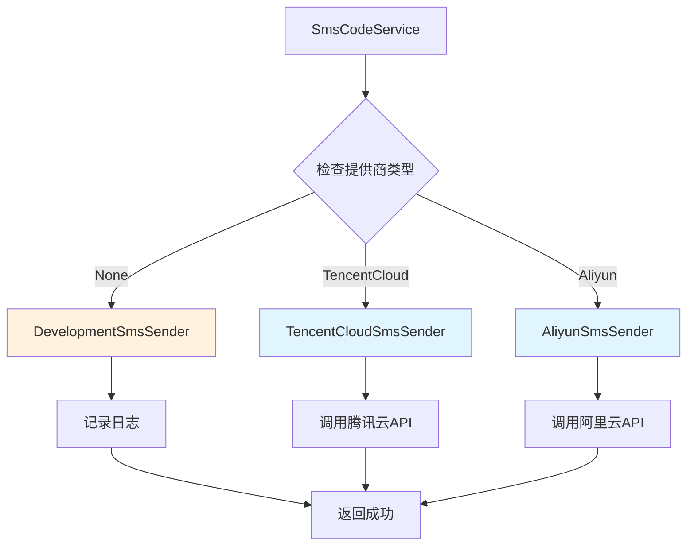
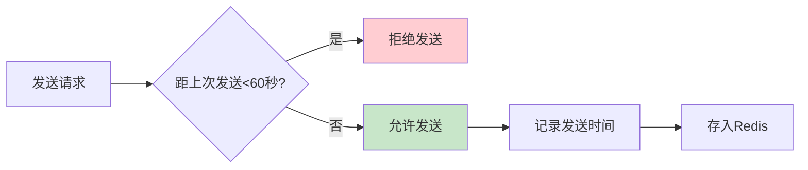
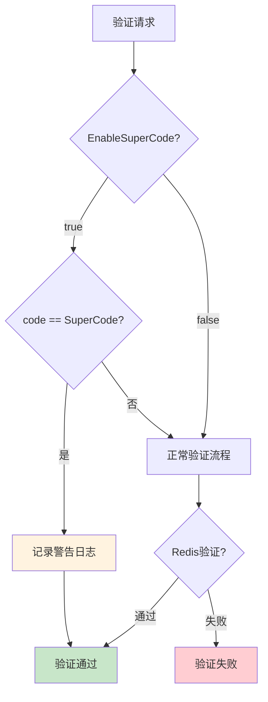
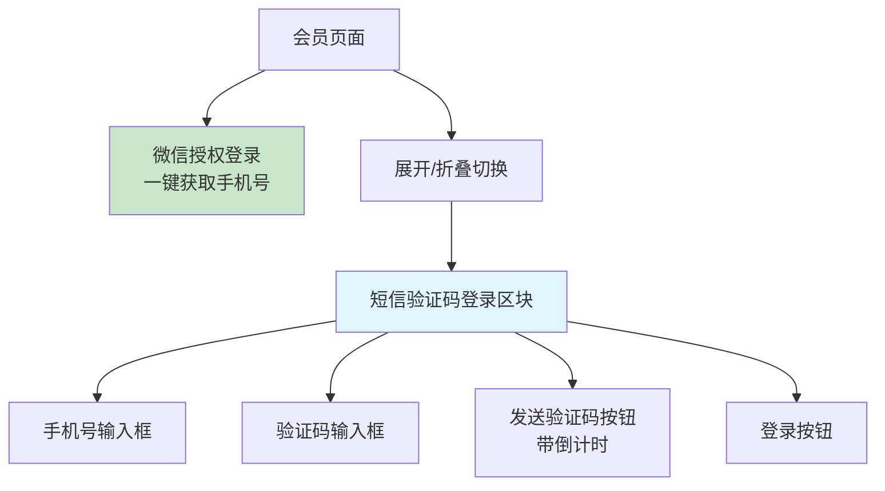

# CodeSpirit 短信验证码登录

## 📋 概述

CodeSpirit 实现了基于短信验证码的登录认证方式，为用户提供便捷的手机号登录能力。系统支持多个短信服务提供商，具备完善的验证码管理和安全防护机制，支持手机号自动注册/登录。

### 核心特性

- ✅ **多提供商支持**：支持腾讯云短信、阿里云短信等主流服务商

- ✅ **自动注册登录**：手机号已存在则登录，不存在则自动注册为会员

- ✅ **灵活配置**：支持验证码长度、有效期、发送间隔等参数配置

- ✅ **多租户隔离**：完善的租户级别配置和数据隔离

- ✅ **安全防护**：发送频率限制、验证码过期机制

- ✅ **开发便利**：超级验证码支持，方便开发和测试环境使用

- ✅ **小程序集成**：提供完整的小程序端UI和API封装

  

---

## 🏗️ 系统架构

### 整体架构图



### 数据流转图



---

## 🔄 登录流程

### 完整登录流程图



### 验证码生命周期



---

## 🔧 核心组件

### 1. 短信服务提供商

系统采用策略模式支持多个短信服务提供商：

| 提供商 | 说明 | 适用场景 |
|--------|------|---------|
| 无（开发模式） | 仅记录日志，不实际发送 | 本地开发环境 |
| 腾讯云短信 | 腾讯云SMS服务 | 生产环境 |
| 阿里云短信 | 阿里云SMS服务 | 生产环境 |

### 2. 验证码配置参数

| 参数 | 默认值 | 说明 |
|-----|--------|-----|
| CodeLength | 6 | 验证码长度（位） |
| CodeExpireSeconds | 300 | 验证码有效期（秒），默认5分钟 |
| SendIntervalSeconds | 60 | 发送间隔（秒），防止频繁发送 |
| EnableSuperCode | false | 是否启用超级验证码 |
| SuperCode | "000000" | 超级验证码内容，始终有效 |

### 3. 短信发送策略



### 4. Redis缓存键设计

验证码缓存键格式：

```
sms:code:{tenantId}:{phoneNumber}
```

- **自动过期**：根据 `CodeExpireSeconds` 配置自动过期
- **租户隔离**：不同租户的验证码独立存储
- **防重放**：验证成功后立即删除

---

## ⚙️ 配置指南

### 1. 短信服务配置

系统提供两种配置方式：

#### UI界面配置（推荐）

通过管理后台的用户设置模块配置：

- **路径**：系统管理 → 用户设置 → 短信验证码设置
- **API端点**：
  - `GET /identity/api/UserSettings/sms` - 获取配置
  - `PUT /identity/api/UserSettings/sms` - 保存配置

**配置项说明**：

| 配置项 | 是否必填 | 说明 |
|--------|---------|------|
| Enabled | 是 | 是否启用短信验证码登录 |
| Provider | 是 | 短信服务提供商（无/腾讯云/阿里云） |
| SecretId | 条件必填 | 腾讯云SecretId 或 阿里云AccessKeyId |
| SecretKey | 条件必填 | 腾讯云SecretKey 或 阿里云AccessKeySecret |
| SdkAppId | 条件必填 | 腾讯云SdkAppId（仅腾讯云需要） |
| SignName | 是 | 短信签名 |
| TemplateId | 是 | 验证码模板ID |

#### 配置示例

**腾讯云配置示例**：
- Provider: `TencentCloud`
- SecretId: `AKIDxxxxxxxxxxxxx`
- SecretKey: `xxxxxxxxxxxxxxxx`
- SdkAppId: `1400xxxxxx`
- SignName: `CodeSpirit`
- TemplateId: `12345`

**阿里云配置示例**：
- Provider: `Aliyun`
- SecretId: `LTAI5txxxxxxxxxxxxx`
- SecretKey: `xxxxxxxxxxxxxxxxx`
- SignName: `CodeSpirit`
- TemplateId: `SMS_123456789`

### 2. 开发环境配置

**超级验证码**：在开发和测试环境中启用超级验证码功能：

- `EnableSuperCode`: `true`
- `SuperCode`: `000000`（或自定义）

**优势**：
- ✅ 无需实际发送短信，节省成本
- ✅ 自动化测试更方便
- ✅ 开发调试更高效

⚠️ **警告**：生产环境必须禁用超级验证码功能！

### 3. 租户级别配置

每个租户可以独立配置短信服务：

- 不同租户可使用不同的短信服务商
- 支持不同的签名和模板
- 独立的费用结算

---

## 🔐 安全机制

### 1. 发送频率限制



**防护措施**：
- 默认60秒内不可重复发送（可配置）
- Redis记录上次发送时间
- 返回友好的错误提示

### 2. 验证码过期机制

- **默认有效期**：5分钟（可配置）
- **自动过期**：Redis自动清除过期数据
- **一次性使用**：验证成功后立即删除

### 3. 超级验证码安全



**安全建议**：
- ⚠️ 仅在开发/测试环境启用
- ⚠️ 生产环境务必设置 `EnableSuperCode = false`
- ✅ 使用时会记录警告日志
- ✅ 可通过监控系统检测异常使用

### 4. 多租户数据隔离

- 所有验证码按租户独立存储
- Redis键包含租户ID
- 不同租户的验证码互不影响

---

## 📱 小程序端集成

### 用户界面

小程序会员页面提供两种登录方式：

1. **微信授权获取手机号**（主要方式，默认展示）
2. **短信验证码登录**（折叠展示，点击展开）



### 交互流程

**发送验证码**：
1. 用户输入手机号
2. 点击"发送验证码"按钮
3. 按钮显示倒计时（60秒）
4. 用户接收短信验证码

**验证码登录**：
1. 用户输入验证码
2. 点击"登录"按钮
3. 系统验证验证码
4. 登录成功，跳转到会员中心

### API端点

小程序端使用以下API：

| 端点 | 方法 | 说明 |
|------|------|------|
| `/auth/sms/send` | POST | 发送验证码 |
| `/auth/sms/login` | POST | 验证码登录 |

---

## 🎯 最佳实践

### 1. 提供商选择

| 提供商 | 优势 | 适用场景 |
|--------|------|---------|
| 腾讯云短信 | 稳定性高、国内到达率好 | 主要服务国内用户 |
| 阿里云短信 | 价格实惠、接入简单 | 中小规模应用 |
| 开发模式 | 无需付费、调试方便 | 开发测试环境 |

### 2. 验证码模板

**推荐模板格式**：

```
【签名】验证码：{1}，{2}分钟内有效，请勿泄露。
```

**示例**：
```
【CodeSpirit】验证码：123456，5分钟内有效，请勿泄露。
```

### 3. 错误处理

| 错误场景 | 处理方式 |
|---------|---------|
| 手机号格式错误 | 前端验证，提示用户重新输入 |
| 发送太频繁 | 显示倒计时，禁用发送按钮 |
| 验证码错误 | 提示用户重新输入，可重试 |
| 验证码过期 | 提示用户重新发送验证码 |
| 短信服务商错误 | 记录日志，提示用户稍后重试 |

### 4. 用户体验优化

✅ **推荐做法**：

- 自动注册：新用户无需单独注册流程
- 倒计时提示：清晰显示重新发送的等待时间
- 友好错误提示：使用易懂的语言说明错误原因
- 自动填充：支持短信验证码自动填充（iOS/Android）

⚠️ **注意事项**：

- 避免过于频繁的验证码发送
- 合理设置验证码有效期（建议5分钟）
- 提供其他登录方式作为备选

---

## 🧪 测试指南

### 开发环境测试

使用超级验证码进行测试：

1. 配置 `EnableSuperCode = true`
2. 设置 `SuperCode = "000000"`
3. 发送验证码请求（实际不发送短信）
4. 使用超级验证码 `000000` 登录
5. 验证登录流程

### 生产环境测试

使用真实短信进行测试：

1. 配置正确的短信服务商参数
2. 使用真实手机号测试
3. 验证短信到达率和速度
4. 测试各种异常场景

### 集成测试

推荐测试场景：

- ✅ 新用户首次登录（自动注册）
- ✅ 老用户重复登录
- ✅ 验证码过期场景
- ✅ 验证码错误场景
- ✅ 发送频率限制
- ✅ 多租户数据隔离
- ✅ 超级验证码功能

---

## 📊 监控与日志

### 关键指标

建议监控以下指标：

| 指标 | 说明 | 告警阈值 |
|------|------|---------|
| 验证码发送成功率 | 成功发送数/总请求数 | < 95% |
| 验证码验证成功率 | 验证通过数/验证请求数 | < 80% |
| 平均发送耗时 | 从请求到发送完成的时间 | > 3秒 |
| 短信服务商错误率 | 服务商返回错误的比例 | > 5% |

### 日志记录

系统会记录以下关键日志：

- 验证码发送请求（包含手机号、租户ID）
- 短信服务商API调用结果
- 验证码验证结果（成功/失败原因）
- 超级验证码使用记录（警告级别）
- 频率限制触发记录

---

## 📚 相关文档

- [CodeSpirit Identity API 指南](./codespirit-identity-api-zh-CN.md)
- [第三方登录架构](./third-party-login-architecture-zh-CN.md)
- [多租户架构指南](../05-Multi-Tenancy/codespirit-multi-tenant-dbcontext-architecture-zh-CN.md)
- [设置管理组件](../03-Core-Components/codespirit-settings-guide-zh-CN.md)
- [Redis缓存使用指南](../06-Infrastructure/codespirit-caching-guide-zh-CN.md)

---

## 🔄 版本历史

| 版本 | 日期 | 说明 |
|-----|------|------|
| v1.0 | 2026-01 | 初始版本，支持腾讯云和阿里云短信 |

---

## 💡 常见问题

### Q1: 验证码收不到怎么办？

**A**: 请按以下步骤排查：
1. 检查短信服务商配置是否正确
2. 确认短信服务商账户余额充足
3. 查看应用日志中的短信发送记录
4. 验证手机号是否在服务商的黑名单中
5. 检查短信签名和模板是否已审核通过

### Q2: 如何防止恶意发送短信？

**A**: 系统内置多重防护：
- 60秒发送间隔限制（可配置）
- Redis记录发送历史
- 可接入图形验证码（需扩展）
- 可添加IP访问频率限制
- 监控异常发送行为

### Q3: 验证码位数可以修改吗？

**A**: 可以，通过 `CodeLength` 参数配置：
- 推荐使用6位数字（安全性与用户体验的平衡）
- 可配置4-8位数字
- 修改后需同步更新短信模板

### Q4: 支持国际短信吗？

**A**: 支持，需要：

- 在短信服务商开通国际短信服务
- 配置国际短信模板
- 注意国际短信费用较高
- 部分国家可能有发送限制

### Q5: 如何切换短信服务商？

**A**: 在管理后台操作：
1. 进入"用户设置 → 短信验证码设置"
2. 修改 `Provider` 为目标服务商
3. 填写对应的配置参数
4. 保存配置即可生效（无需重启服务）

---

*最后更新：2026年1月*

