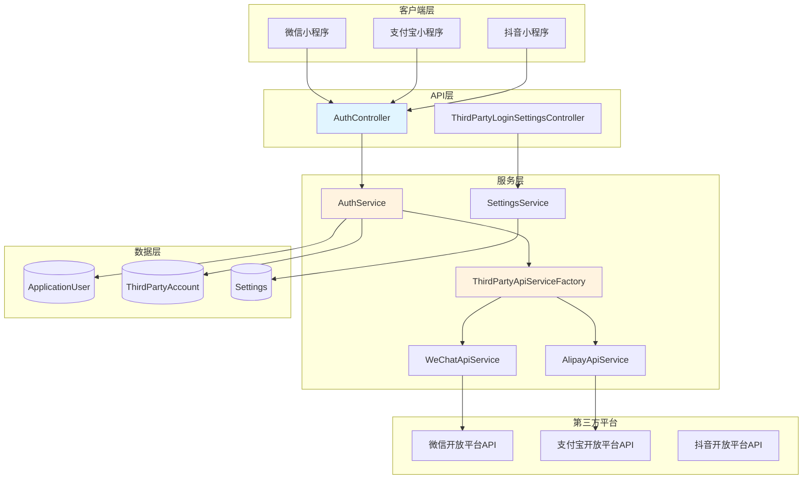
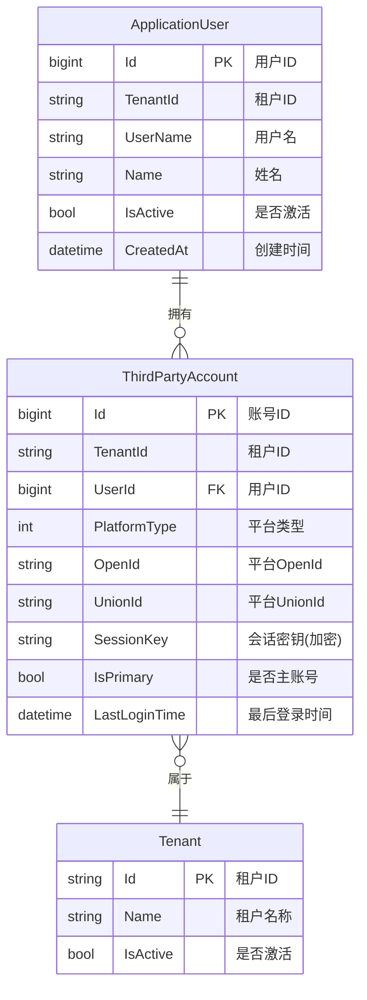
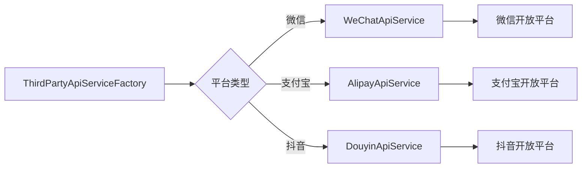
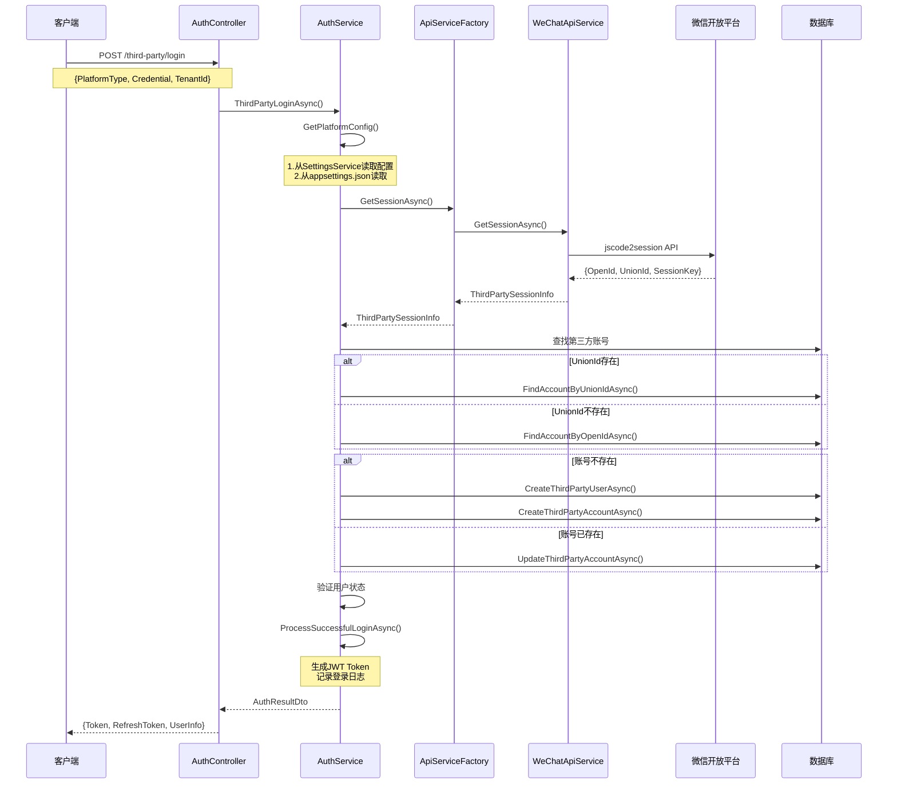
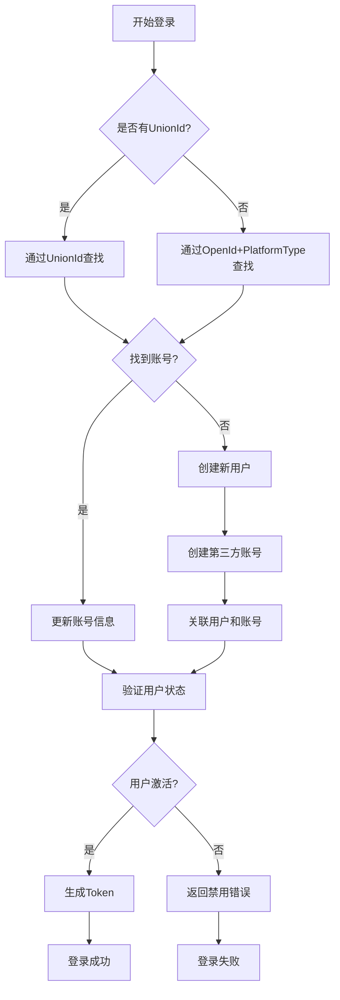
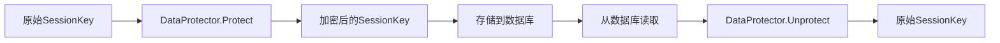
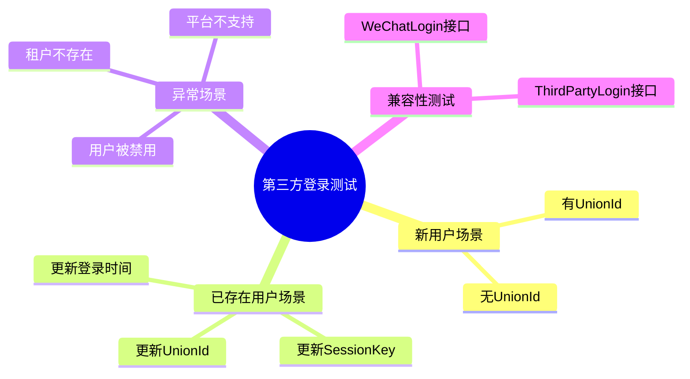
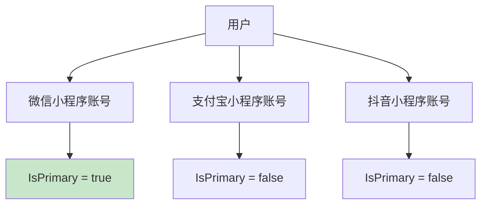

# CodeSpirit 第三方登录通用化架构

## 📋 概述

CodeSpirit 实现了通用化的第三方登录系统，支持微信、支付宝等多种第三方平台的用户认证。系统采用独立关联表设计，确保良好的扩展性和多租户数据隔离。

### 核心特性

- ✅ **通用化设计**：统一的接口支持多种第三方平台
- ✅ **多平台支持**：微信小程序、支付宝小程序、抖音小程序等
- ✅ **多租户隔离**：完善的租户数据隔离机制
- ✅ **UnionId支持**：跨平台用户统一识别
- ✅ **安全加密**：SessionKey等敏感信息加密存储
- ✅ **动态配置**：支持UI界面配置和appsettings配置

---

## 🏗️ 系统架构

### 整体架构图



### 数据模型关系



---

## 🔧 核心组件

### 1. 平台类型枚举

支持的第三方平台类型：

| 平台类型 | 值 | 说明 |
|---------|---|------|
| WeChatMiniProgram | 1 | 微信小程序 |
| AlipayMiniProgram | 2 | 支付宝小程序 |
| DouyinMiniProgram | 3 | 抖音小程序 |
| WeChatOpenPlatform | 10 | 微信开放平台 |

### 2. API服务工厂

**ThirdPartyApiServiceFactory** 负责根据平台类型路由到对应的API服务实现：



### 3. 第三方账号关联表

**ThirdPartyAccount** 表设计要点：

- **租户隔离**：所有查询必须包含 TenantId
- **唯一索引**：
  - `(TenantId, PlatformType, OpenId)` - 确保同一租户下平台OpenId唯一
  - `(TenantId, UnionId)` - 确保同一租户下UnionId唯一（如果存在）
- **级联删除**：用户删除时自动删除关联的第三方账号

---

## 🔄 登录流程

### 完整登录流程图



### 账号查找策略



---

## ⚙️ 配置指南

### 1. appsettings.json 配置

在 `CodeSpirit.IdentityApi` 的 `appsettings.json` 中添加：

```json
{
  "ThirdParty": {
    "WeChat": {
      "AppId": "your_wechat_appid",
      "AppSecret": "your_wechat_appsecret"
    },
    "Alipay": {
      "AppId": "your_alipay_appid",
      "AppSecret": "your_alipay_appsecret",
      "PublicKey": "your_alipay_public_key"
    }
  }
}
```

### 2. UI 界面配置（推荐）

系统提供了 **ThirdPartyLoginSettingsController** 用于动态配置：

**配置优先级**：
1. **SettingsService**（UI配置） - 最高优先级，支持租户级别配置
2. **appsettings.json** - 默认配置，作为备用

**配置API**：
- **GET** `/identity/api/ThirdPartyLoginSettings` - 获取当前租户配置
- **PUT** `/identity/api/ThirdPartyLoginSettings` - 保存配置

### 3. 服务注册

服务已在 `IdentityApiConfiguration` 中自动注册：

```csharp
// 第三方API服务
services.AddScoped<WeChatApiService>();
services.AddScoped<IThirdPartyApiService, ThirdPartyApiServiceFactory>();
```

---

## 🔐 安全机制

### 1. SessionKey 加密存储

使用 ASP.NET Core Data Protection API 加密存储敏感的 SessionKey：



### 2. 多租户数据隔离

所有数据查询都会自动应用租户过滤器：

- 使用 `IgnoreQueryFilters()` 手动控制租户过滤
- 所有方法都验证 `TenantId` 参数
- 数据库索引包含 `TenantId` 字段

### 3. 平台API调用安全

- 使用 HTTPS 加密通信
- AppSecret 存储加密
- 错误信息脱敏处理

---

## 🧪 测试覆盖

系统包含完整的单元测试，覆盖率 **100%**：

### 测试统计

| 测试类别 | 测试数量 | 状态 |
|---------|---------|------|
| 工厂和服务层 | 4 | ✅ 全部通过 |
| 控制器层 | 6 | ✅ 全部通过 |
| 业务逻辑层 | 10 | ✅ 全部通过 |
| **总计** | **20** | **✅ 100%** |

### 测试覆盖场景



---

## 📈 扩展指南

### 添加新平台支持

以添加抖音小程序为例：

#### 1. 添加枚举值

平台类型已预留，无需修改。

#### 2. 实现API服务

创建 `DouyinApiService.cs`：

```csharp
public class DouyinApiService : IThirdPartyApiService
{
    public async Task<ThirdPartySessionInfo> GetSessionAsync(
        ThirdPartyPlatformType platformType, 
        string credential, 
        ThirdPartyPlatformConfig config)
    {
        // 实现抖音API调用逻辑
    }
}
```

#### 3. 更新工厂类

在 `ThirdPartyApiServiceFactory` 中添加路由：

```csharp
ThirdPartyPlatformType.DouyinMiniProgram => 
    await _douyinApiService.GetSessionAsync(platformType, credential, config)
```

#### 4. 添加配置

在 `appsettings.json` 和 `ThirdPartyLoginSettingsDto` 中添加配置字段。

#### 5. 注册服务

在 `IdentityApiConfiguration` 中注册新服务。

---

## 🎯 最佳实践

### 1. 配置管理

✅ **推荐**：使用UI界面配置，支持租户级别差异化
- 便于管理和更新
- 支持多租户独立配置
- 变更无需重启服务

⚠️ **备用**：使用 appsettings.json 作为默认配置

### 2. 错误处理

系统已实现完善的错误处理：

| 错误场景 | 错误码 | 处理方式 |
|---------|--------|---------|
| code无效或已过期 | 40029 | 提示用户重新登录 |
| API调用太频繁 | 45011 | 提示稍后再试 |
| 高风险等级用户 | 40226 | 拒绝登录 |
| 租户不存在 | - | 返回友好提示 |
| 用户被禁用 | - | 返回禁用提示 |

### 3. 性能优化

- ✅ 使用 `AsNoTracking()` 优化只读查询
- ✅ 合理使用 `Include` 避免 N+1 查询
- ✅ 数据库索引优化查询性能
- ✅ 缓存用户权限预热

### 4. 多平台账号管理

一个用户可以关联多个第三方平台：



---

## 📚 相关文档

- [CodeSpirit Identity API 指南](./codespirit-identity-api-zh-CN.md)
- [CodeSpirit 授权指南](./codespirit-authorization-guide-zh-CN.md)
- [多租户架构指南](../05-Multi-Tenancy/codespirit-multi-tenant-dbcontext-architecture-zh-CN.md)
- [设置管理组件](../03-Core-Components/codespirit-settings-guide-zh-CN.md)

---

## 🔄 版本历史

| 版本 | 日期 | 说明 |
|-----|------|------|
| v1.0 | 2025-01 | 初始版本，支持微信小程序登录 |
| v1.1 | 2025-01 | 通用化架构重构，支持多平台 |
| v1.2 | 2025-01 | 添加UI配置支持，完善测试覆盖 |

---

## 💡 常见问题

### Q1: UnionId 什么时候会返回？

**A**: UnionId 只有在满足以下条件时才会返回：
- 小程序与公众号或其他小程序绑定到同一开放平台账号
- 用户在任一平台授权过

### Q2: 如何处理用户在多个平台的统一识别？

**A**: 系统优先使用 UnionId 查找用户：
1. 如果有 UnionId，优先通过 UnionId 查找
2. 如果没有 UnionId，通过 OpenId + PlatformType 查找
3. 当后续获得 UnionId 时，会自动更新账号信息

### Q3: SessionKey 有什么用？

**A**: SessionKey 用于后续的微信API调用，如：
- 解密用户手机号
- 解密用户敏感数据
- 验证数据完整性

### Q4: 如何测试第三方登录？

**A**: 
1. **单元测试**：运行 `dotnet test --filter "FullyQualifiedName~ThirdParty"`
2. **集成测试**：配置测试小程序的 AppId 和 AppSecret
3. **生产环境**：使用真实的小程序进行测试

---

## 📞 技术支持

如有问题或建议，请：
- 查看[完整实现方案](../../.cursor/plans/)
- 提交 Issue 到项目仓库
- 联系技术团队

---

*最后更新：2025年1月*

