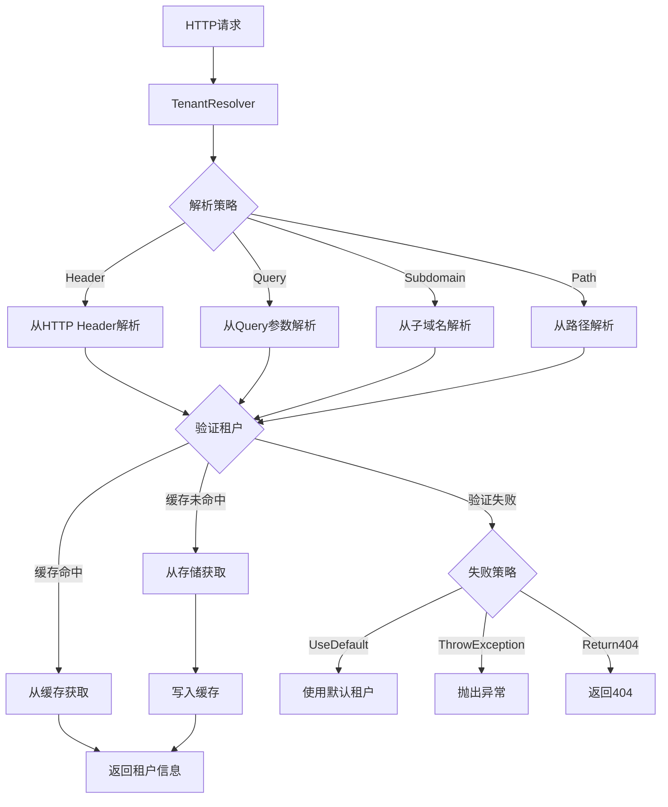

# CodeSpirit.TenantResolver 租户解析器使用指南

## 📋 文档信息

- **组件名称**: CodeSpirit.MultiTenant.TenantResolver
- **文档版本**: v1.0
- **适用版本**: .NET 9.0+
- **更新日期**: 2025年6月

## 🎯 概述

`TenantResolver` 是 CodeSpirit 多租户系统的核心组件，负责从HTTP请求中解析租户信息。它支持多种解析策略、缓存机制和故障处理，确保系统能够准确、高效地识别当前请求所属的租户。

## 🏗️ 架构设计



## 🔧 核心功能

### 1. 多源租户解析

`TenantResolver` 支持从多个来源解析租户ID，按优先级顺序：

```csharp
public async Task<string?> ResolveTenantIdAsync()
{
    var httpContext = _httpContextAccessor.HttpContext;
    
    // 1. 从Header中解析 (优先级最高)
    if (_options.ResolveFromHeader)
    {
        var tenantId = httpContext.Request.Headers[_options.TenantHeaderName].FirstOrDefault();
        if (await ValidateTenantIdAsync(tenantId))
            return tenantId;
    }
    
    // 2. 从Query参数中解析
    if (_options.ResolveFromQuery)
    {
        var tenantId = httpContext.Request.Query[_options.TenantQueryName].FirstOrDefault();
        if (await ValidateTenantIdAsync(tenantId))
            return tenantId;
    }
    
    // 3. 从子域名中解析
    if (_options.ResolveFromSubdomain)
    {
        var host = httpContext.Request.Host.Host;
        var tenantId = ExtractTenantFromSubdomain(host);
        if (await ValidateTenantIdAsync(tenantId))
            return tenantId;
    }
    
    // 4. 从路径中解析
    if (_options.ResolveFromPath)
    {
        var path = httpContext.Request.Path.Value;
        var tenantId = ExtractTenantFromPath(path);
        if (await ValidateTenantIdAsync(tenantId))
            return tenantId;
    }
    
    // 5. 使用失败策略
    return await HandleTenantResolutionFailureAsync();
}
```

### 2. 租户信息缓存

为提升性能，`TenantResolver` 实现了智能缓存机制：

```csharp
public async Task<ITenantInfo?> GetTenantInfoAsync(string tenantId)
{
    // 先从缓存获取
    if (_options.EnableTenantCache)
    {
        var cacheKey = $"tenant_info_{tenantId}";
        var cachedInfo = await _cache.GetStringAsync(cacheKey);
        if (!string.IsNullOrEmpty(cachedInfo))
        {
            return JsonConvert.DeserializeObject<TenantInfo>(cachedInfo);
        }
    }
    
    // 从存储获取并缓存
    var tenantInfo = await _tenantStore.GetTenantAsync(tenantId);
    if (tenantInfo != null && _options.EnableTenantCache)
    {
        await CacheTenantInfo(tenantId, tenantInfo);
    }
    
    return tenantInfo;
}
```

### 3. 故障处理策略

当无法解析到有效租户时，提供三种处理策略：

```csharp
public enum TenantResolutionFailureStrategy
{
    /// <summary>
    /// 使用默认租户 (推荐用于开发和测试环境)
    /// </summary>
    UseDefault,
    
    /// <summary>
    /// 抛出异常 (用于严格的安全要求)
    /// </summary>
    ThrowException,
    
    /// <summary>
    /// 返回404错误 (推荐用于生产环境)
    /// </summary>
    Return404
}
```

## ⚙️ 配置选项

### 基础配置

```json
{
  "MultiTenant": {
    "Enabled": true,
    "DefaultTenantId": "default",
    "EnableTenantValidation": true,
    "EnableTenantCache": true,
    "CacheExpirationMinutes": 30,
    "FailureStrategy": "UseDefault"
  }
}
```

### 解析策略配置

```json
{
  "MultiTenant": {
    "ResolveFromHeader": true,
    "TenantHeaderName": "X-Tenant-Id",
    "ResolveFromQuery": true,
    "TenantQueryName": "tenantId",
    "ResolveFromSubdomain": false,
    "ResolveFromPath": false,
    "TenantPathPrefix": "tenant-"
  }
}
```

### API存储配置

```json
{
  "MultiTenant": {
    "StoreType": "Api",
    "ApiStore": {
      "BaseUrl": "http://identity-api",
      "Timeout": 30,
      "UseApiResponseFormat": true,
      "GetTenantEndpoint": "api/tenants/{tenantId}",
      "GetActiveTenantsEndpoint": "api/tenants/active"
    }
  }
}
```

## 🔍 解析策略详解

### 1. Header解析 (推荐)

**适用场景**: API调用、前端应用、移动应用

```http
GET /api/users
X-Tenant-Id: tenant-123
```

**优势**:
- ✅ 明确、可靠
- ✅ 不影响URL结构
- ✅ 易于缓存
- ✅ 支持API网关转发

**配置**:
```json
{
  "ResolveFromHeader": true,
  "TenantHeaderName": "X-Tenant-Id"
}
```

### 2. Query参数解析

**适用场景**: 简单的Web应用、调试、测试

```http
GET /api/users?tenantId=tenant-123
```

**优势**:
- ✅ 简单直观
- ✅ 便于调试
- ✅ 支持链接分享

**劣势**:
- ⚠️ URL变长
- ⚠️ 缓存键复杂

**配置**:
```json
{
  "ResolveFromQuery": true,
  "TenantQueryName": "tenantId"
}
```

### 3. 子域名解析

**适用场景**: SaaS应用、多租户网站

```http
GET https://tenant-123.yourdomain.com/api/users
```

**优势**:
- ✅ 用户体验好
- ✅ 租户隔离明显
- ✅ 支持独立域名

**劣势**:
- ⚠️ 需要DNS配置
- ⚠️ SSL证书复杂
- ⚠️ 开发环境配置困难

**配置**:
```json
{
  "ResolveFromSubdomain": true
}
```

### 4. 路径解析

**适用场景**: 特殊的URL结构要求

```http
GET /tenant-123/api/users
```

**优势**:
- ✅ 不需要额外配置
- ✅ 可见性好

**劣势**:
- ⚠️ 影响路由设计
- ⚠️ URL变长

**配置**:
```json
{
  "ResolveFromPath": true,
  "TenantPathPrefix": "tenant-"
}
```

## 🚀 使用示例

### 基本使用

```csharp
public class TenantsController : ControllerBase
{
    private readonly ITenantResolver _tenantResolver;

    public TenantsController(ITenantResolver tenantResolver)
    {
        _tenantResolver = tenantResolver;
    }

    [HttpGet("current")]
    public async Task<IActionResult> GetCurrentTenant()
    {
        // 获取当前租户ID
        var tenantId = await _tenantResolver.ResolveTenantIdAsync();
        
        // 获取完整租户信息
        var tenantInfo = await _tenantResolver.GetCurrentTenantInfoAsync();
        
        return Ok(new { tenantId, tenantInfo });
    }
}
```

### 中间件集成

```csharp
public class MultiTenantMiddleware
{
    public async Task InvokeAsync(HttpContext context, ITenantResolver tenantResolver)
    {
        // 解析租户ID
        var tenantId = await tenantResolver.ResolveTenantIdAsync();
        
        if (string.IsNullOrEmpty(tenantId))
        {
            // 根据配置的失败策略处理
            await HandleTenantResolutionFailure(context);
            return;
        }

        // 获取租户信息并验证
        var tenantInfo = await tenantResolver.GetTenantInfoAsync(tenantId);
        if (tenantInfo == null || !tenantInfo.IsActive)
        {
            context.Response.StatusCode = 404;
            await context.Response.WriteAsync("租户不存在或已停用");
            return;
        }

        // 将租户信息添加到上下文
        context.Items["TenantId"] = tenantId;
        context.Items["TenantInfo"] = tenantInfo;

        await _next(context);
    }
}
```

### 服务注册

```csharp
public void ConfigureServices(IServiceCollection services)
{
    // 注册多租户服务
    services.AddCodeSpiritMultiTenant(Configuration);
    
    // 或手动注册
    services.AddScoped<ITenantResolver, TenantResolver>();
    services.Configure<TenantOptions>(Configuration.GetSection("MultiTenant"));
}
```

## 🔒 安全考虑

### 1. 租户验证

```csharp
private async Task<bool> ValidateTenantIdAsync(string tenantId)
{
    // 检查租户格式
    if (string.IsNullOrWhiteSpace(tenantId))
        return false;
    
    // 可选：跳过验证（开发环境）
    if (!_options.EnableTenantValidation)
        return true;
    
    // 从存储验证租户
    var tenantInfo = await GetTenantInfoAsync(tenantId);
    if (tenantInfo == null)
    {
        _logger.LogWarning("租户不存在: {TenantId}", tenantId);
        return false;
    }
    
    // 检查租户状态
    if (!tenantInfo.IsActive)
    {
        _logger.LogWarning("租户已禁用: {TenantId}", tenantId);
        return false;
    }
    
    return true;
}
```

### 2. 输入验证

```csharp
private bool IsValidTenantId(string tenantId)
{
    // 格式验证
    if (string.IsNullOrWhiteSpace(tenantId))
        return false;
    
    // 长度限制
    if (tenantId.Length > 50)
        return false;
    
    // 字符限制 (字母、数字、下划线、连字符)
    return Regex.IsMatch(tenantId, @"^[a-zA-Z0-9_-]+$");
}
```

### 3. 日志记录

```csharp
private async Task<string?> ResolveTenantIdAsync()
{
    var sw = Stopwatch.StartNew();
    
    try
    {
        var tenantId = await DoResolveAsync();
        
        _logger.LogDebug("租户解析成功: {TenantId}, 耗时: {ElapsedMs}ms", 
            tenantId, sw.ElapsedMilliseconds);
            
        return tenantId;
    }
    catch (Exception ex)
    {
        _logger.LogError(ex, "租户解析失败, 耗时: {ElapsedMs}ms", 
            sw.ElapsedMilliseconds);
        throw;
    }
}
```

## 📊 性能优化

### 1. 缓存策略

```csharp
// 缓存配置
{
  "EnableTenantCache": true,
  "CacheExpirationMinutes": 30
}

// 缓存键策略
private string GetCacheKey(string tenantId)
{
    return $"tenant_info_{tenantId}";
}

// 缓存失效
public async Task InvalidateTenantCacheAsync(string tenantId)
{
    var cacheKey = GetCacheKey(tenantId);
    await _cache.RemoveAsync(cacheKey);
}
```

### 2. 批量加载

```csharp
public async Task<IEnumerable<ITenantInfo>> GetActiveTenantsAsync()
{
    // 使用批量查询减少数据库访问
    return await _tenantStore.GetActiveTenantsAsync();
}
```

### 3. 异步处理

```csharp
// 所有方法均为异步，避免阻塞
public async Task<string?> ResolveTenantIdAsync()
public async Task<ITenantInfo?> GetTenantInfoAsync(string tenantId)
public async Task<ITenantInfo?> GetCurrentTenantInfoAsync()
```

## 🔧 故障排除

### 常见问题

**Q1: 租户解析返回null**
```csharp
// 检查配置
var options = serviceProvider.GetService<IOptions<TenantOptions>>().Value;
Console.WriteLine($"Enabled: {options.Enabled}");
Console.WriteLine($"ResolveFromHeader: {options.ResolveFromHeader}");

// 检查HTTP上下文
var httpContext = httpContextAccessor.HttpContext;
var headers = httpContext?.Request.Headers;
Console.WriteLine($"Headers: {string.Join(", ", headers?.Select(h => $"{h.Key}={h.Value}") ?? [])}");
```

**Q2: 缓存不生效**
```csharp
// 验证分布式缓存配置
services.AddStackExchangeRedisCache(options =>
{
    options.Configuration = "localhost:6379";
});

// 检查缓存状态
var cacheKey = $"tenant_info_{tenantId}";
var cached = await _cache.GetStringAsync(cacheKey);
Console.WriteLine($"Cache hit: {cached != null}");
```

**Q3: 性能问题**
```csharp
// 启用性能计数器
var sw = Stopwatch.StartNew();
var result = await _tenantResolver.ResolveTenantIdAsync();
Console.WriteLine($"Resolution time: {sw.ElapsedMilliseconds}ms");

// 检查数据库查询
using var scope = serviceProvider.CreateScope();
var context = scope.ServiceProvider.GetService<TenantDbContext>();
var queryCount = context.Database.GetDbConnection().QueryCount;
```

### 调试技巧

```csharp
// 1. 启用详细日志
{
  "Logging": {
    "LogLevel": {
      "CodeSpirit.MultiTenant": "Debug"
    }
  }
}

// 2. 使用调试端点
[HttpGet("debug/tenant-resolution")]
public async Task<IActionResult> DebugTenantResolution()
{
    var httpContext = HttpContext;
    var headers = httpContext.Request.Headers.ToDictionary(h => h.Key, h => h.Value.ToString());
    var query = httpContext.Request.Query.ToDictionary(q => q.Key, q => q.Value.ToString());
    
    var tenantId = await _tenantResolver.ResolveTenantIdAsync();
    var tenantInfo = tenantId != null ? await _tenantResolver.GetTenantInfoAsync(tenantId) : null;
    
    return Ok(new {
        Headers = headers,
        Query = query,
        Host = httpContext.Request.Host.ToString(),
        Path = httpContext.Request.Path.ToString(),
        ResolvedTenantId = tenantId,
        TenantInfo = tenantInfo
    });
}
```

## 📚 相关文档

- [多租户组件README](../Src/Components/CodeSpirit.MultiTenant/README.md)
- [多租户数据库上下文架构](./CodeSpirit%20多租户数据库上下文架构.md)
- [配置示例](../Tests/Components/CodeSpirit.MultiTenant.Tests/Examples/)
- [IdentityApi集成文档](./CodeSpirit.IdentityApi身份认证服务.md)

## 📞 支持信息

- **组件维护**: 开发团队
- **文档更新**: 架构团队
- **技术支持**: 请提交Issue到项目仓库

---

**版权声明**: 本文档为 CodeSpirit 项目内部文档，仅供团队内部使用。 