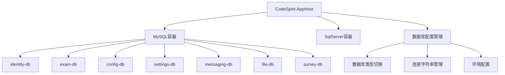
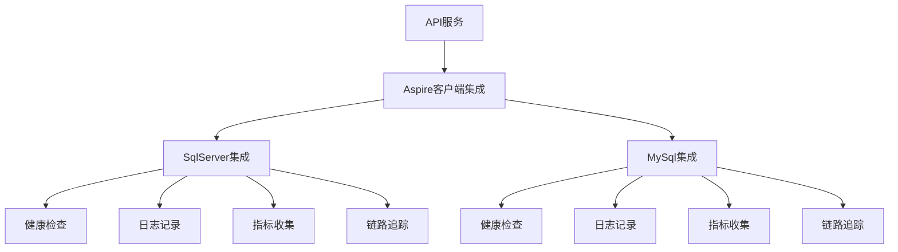

# CodeSpirit.Aspire数据库集成统一方案

## 概述

本方案旨在为CodeSpirit项目提供统一的Aspire数据库集成方案，支持SqlServer和MySql的灵活切换，同时利用Aspire的托管集成和客户端集成能力，提升开发效率和运维便利性。

## 当前现状分析

### 现状问题
1. **缺乏统一的数据库集成方案**: 各服务使用传统的EF配置方式，缺乏Aspire集成
2. **硬编码数据库配置**: 连接字符串分散在各个appsettings.json文件中
3. **缺乏数据库类型切换机制**: 仅支持SqlServer，无法灵活切换到MySql
4. **开发环境启动缓慢**: 使用LocalDB导致首次启动较慢

### 现有配置方式
- 使用传统的`AddDbContext`方式配置EF
- 连接字符串硬编码在appsettings.Development.json中
- 各服务独立配置数据库连接
- 使用LocalDB作为开发数据库

## 方案设计

### 核心目标
1. **统一数据库集成**: 使用Aspire客户端库统一管理数据库连接
2. **支持多数据库**: 同时支持SqlServer和MySql，可灵活切换
3. **托管集成**: 使用Aspire托管集成简化开发环境数据库管理
4. **提升性能**: 使用MySql容器替代LocalDB，提升启动速度
5. **配置统一**: 在AppHost中统一管理数据库资源和连接

### 技术选型

#### Aspire客户端集成包
- **Aspire.Microsoft.EntityFrameworkCore.SqlServer**: SqlServer客户端集成
- **Aspire.Pomelo.EntityFrameworkCore.MySql**: MySql客户端集成

#### Aspire托管集成包
- **Aspire.Hosting.SqlServer**: SqlServer托管集成
- **Aspire.Hosting.MySql**: MySql托管集成

## 架构设计

### 1. 托管集成架构



### 2. 客户端集成架构



## 实现方案

### 1. AppHost托管集成配置

#### 1.1 添加NuGet包引用
在`CodeSpirit.AppHost.csproj`中添加：

```xml
<PackageReference Include="Aspire.Hosting.SqlServer" Version="9.4.1" />
<PackageReference Include="Aspire.Hosting.MySql" Version="9.4.1" />
```

#### 1.2 数据库类型配置
在AppHost中支持通过配置切换数据库类型：

```csharp
// 数据库类型配置
var databaseType = builder.Configuration.GetValue<string>("DatabaseType") ?? "MySql"; // 默认使用MySql

// 根据配置选择数据库
if (databaseType.Equals("MySql", StringComparison.OrdinalIgnoreCase))
{
    // 添加MySQL服务器和数据库
    var mysql = builder.AddMySql("mysql")
                       .WithLifetime(ContainerLifetime.Persistent)
                       .WithDataVolume();
    
    var identityDb = mysql.AddDatabase("identity-db");
    var examDb = mysql.AddDatabase("exam-db");
    var configDb = mysql.AddDatabase("config-db");
    var settingsDb = mysql.AddDatabase("settings-db");
    var messagingDb = mysql.AddDatabase("messaging-db");
    var fileDb = mysql.AddDatabase("file-db");
    var surveyDb = mysql.AddDatabase("survey-db");
}
else if (databaseType.Equals("SqlServer", StringComparison.OrdinalIgnoreCase))
{
    // 添加SQL Server服务器和数据库
    var sqlServer = builder.AddSqlServer("sqlserver")
                           .WithLifetime(ContainerLifetime.Persistent)
                           .WithDataVolume();
    
    var identityDb = sqlServer.AddDatabase("identity-db");
    var examDb = sqlServer.AddDatabase("exam-db");
    var configDb = sqlServer.AddDatabase("config-db");
    var settingsDb = sqlServer.AddDatabase("settings-db");
    var messagingDb = sqlServer.AddDatabase("messaging-db");
    var fileDb = sqlServer.AddDatabase("file-db");
    var surveyDb = sqlServer.AddDatabase("survey-db");
}
```

#### 1.3 服务引用配置
为各个API服务添加数据库引用：

```csharp
var identityService = builder.AddProject<Projects.CodeSpirit_IdentityApi>("identity")
    .WithReference(identityDb)  // 引用数据库资源
    .WithReference(seqService)
    .WithReference(cache)
    .WaitFor(identityDb);  // 等待数据库就绪

var examService = builder.AddProject<Projects.CodeSpirit_ExamApi>("exam")
    .WithReference(examDb)
    .WithReference(settingsDb)  // 考试服务也需要访问设置数据库
    .WithReference(seqService)
    .WithReference(cache)
    .WaitFor(examDb)
    .WaitFor(settingsDb);
```

### 2. 客户端集成配置

#### 2.1 添加NuGet包引用
在各个API服务项目中添加：

```xml
<!-- 根据需要选择一个或两个 -->
<PackageReference Include="Aspire.Microsoft.EntityFrameworkCore.SqlServer" Version="9.4.1" />
<PackageReference Include="Aspire.Pomelo.EntityFrameworkCore.MySql" Version="9.4.1" />
```

#### 2.2 服务注册配置
在各API服务的`Program.cs`中：

```csharp
// 根据配置选择数据库集成
var databaseType = builder.Configuration.GetValue<string>("DatabaseType") ?? "MySql";

if (databaseType.Equals("MySql", StringComparison.OrdinalIgnoreCase))
{
    // 添加MySql集成
    builder.AddMySqlDbContext<IdentityDbContext>("identity-db");
}
else if (databaseType.Equals("SqlServer", StringComparison.OrdinalIgnoreCase))
{
    // 添加SqlServer集成
    builder.AddSqlServerDbContext<IdentityDbContext>("identity-db");
}
```

#### 2.3 配置选项
在`appsettings.json`中可以配置Aspire集成选项：

```json
{
  "Aspire": {
    "Pomelo": {
      "EntityFrameworkCore": {
        "MySql": {
          "DisableHealthChecks": false,
          "DisableTracing": false,
          "DisableMetrics": false,
          "CommandTimeout": 30
        }
      }
    },
    "Microsoft": {
      "EntityFrameworkCore": {
        "SqlServer": {
          "DisableHealthChecks": false,
          "DisableTracing": false,
          "DisableMetrics": false,
          "CommandTimeout": 30
        }
      }
    }
  }
}
```

### 3. 数据库类型切换机制

#### 3.1 配置文件切换
在AppHost的`appsettings.json`中：

```json
{
  "DatabaseType": "MySql",  // 或 "SqlServer"
  "Logging": {
    "LogLevel": {
      "Default": "Information"
    }
  }
}
```

#### 3.2 环境变量切换
支持通过环境变量动态切换：

```bash
# 使用MySql
set DATABASE_TYPE=MySql

# 使用SqlServer
set DATABASE_TYPE=SqlServer
```

#### 3.3 启动参数切换
支持通过命令行参数切换：

```bash
dotnet run --DatabaseType=MySql
dotnet run --DatabaseType=SqlServer
```

### 4. DbContext适配

#### 4.1 抽象基类设计
创建数据库无关的DbContext基类：

```csharp
public abstract class BaseDbContext : MultiTenantDbContext
{
    protected BaseDbContext(DbContextOptions options, IServiceProvider serviceProvider, 
        ICurrentUser currentUser, IHttpContextAccessor httpContextAccessor)
        : base(options, serviceProvider, currentUser, httpContextAccessor)
    {
    }

    protected override void OnModelCreating(ModelBuilder modelBuilder)
    {
        base.OnModelCreating(modelBuilder);
        
        // 应用数据库无关的配置
        ApplyBaseConfigurations(modelBuilder);
        
        // 应用数据库特定的配置
        ApplyDatabaseSpecificConfigurations(modelBuilder);
    }

    protected abstract void ApplyDatabaseSpecificConfigurations(ModelBuilder modelBuilder);

    private void ApplyBaseConfigurations(ModelBuilder modelBuilder)
    {
        // 通用配置逻辑
    }
}
```

#### 4.2 具体DbContext实现
```csharp
public class IdentityDbContext : BaseDbContext
{
    public IdentityDbContext(DbContextOptions<IdentityDbContext> options, 
        IServiceProvider serviceProvider, 
        ICurrentUser currentUser, 
        IHttpContextAccessor httpContextAccessor)
        : base(options, serviceProvider, currentUser, httpContextAccessor)
    {
    }

    protected override void ApplyDatabaseSpecificConfigurations(ModelBuilder modelBuilder)
    {
        // 根据数据库类型应用特定配置
        var databaseType = Database.ProviderName;
        
        if (databaseType.Contains("MySql"))
        {
            // MySql特定配置
            modelBuilder.Entity<User>()
                .Property(e => e.CreatedAt)
                .HasColumnType("datetime(6)");
        }
        else if (databaseType.Contains("SqlServer"))
        {
            // SqlServer特定配置
            modelBuilder.Entity<User>()
                .Property(e => e.CreatedAt)
                .HasColumnType("datetime2");
        }
    }
}
```

## 迁移策略

### 1. 阶段一：基础设施准备
1. 在AppHost项目中添加Aspire托管集成包
2. 在各API服务中添加Aspire客户端集成包
3. 更新项目文件和依赖关系

### 2. 阶段二：配置迁移
1. 更新AppHost的Program.cs，添加数据库资源配置
2. 更新各API服务的Program.cs，使用Aspire客户端集成
3. 移除旧的DbContext配置代码

### 3. 阶段三：测试验证
1. 验证MySql模式下的功能完整性
2. 验证SqlServer模式下的功能完整性
3. 验证数据库切换的无缝性

### 4. 阶段四：清理优化
1. 清理旧的配置文件和代码
2. 优化DbContext工厂类
3. 完善文档和使用指南

## 优势与收益

### 1. 开发体验提升
- **快速启动**: 使用MySql容器替代LocalDB，显著提升启动速度
- **统一管理**: 在AppHost中集中管理所有数据库资源
- **自动化**: Aspire自动处理连接字符串和服务发现

### 2. 运维便利性
- **容器化**: 数据库运行在容器中，易于管理和部署
- **持久化**: 支持数据卷，数据在容器重启后保持
- **监控**: 内置健康检查、日志、指标和链路追踪

### 3. 灵活性
- **多数据库支持**: 支持SqlServer和MySql灵活切换
- **环境适配**: 不同环境可使用不同数据库类型
- **配置简单**: 通过简单配置即可切换数据库类型

### 4. 性能优化
- **连接池**: Aspire集成包含优化的连接池配置
- **重试机制**: 内置数据库连接重试机制
- **资源管理**: 自动管理数据库连接和资源

## 注意事项

### 1. 数据迁移
- 在切换数据库类型时，需要重新执行EF迁移
- 不同数据库的数据类型可能需要适配
- 建议在测试环境充分验证后再应用到生产环境

### 2. 性能考虑
- MySql和SqlServer在某些场景下性能表现可能不同
- 需要根据具体业务场景选择合适的数据库类型
- 建议进行性能测试和对比

### 3. 兼容性
- 确保所有EF迁移在两种数据库下都能正常执行
- 注意SQL语法的差异性
- 某些高级特性可能在不同数据库间存在差异

## 配置示例

### AppHost配置示例
```csharp
// 在CodeSpirit.AppHost/Program.cs中
var databaseType = builder.Configuration.GetValue<string>("DatabaseType") ?? "MySql";

if (databaseType.Equals("MySql", StringComparison.OrdinalIgnoreCase))
{
    var mysql = builder.AddMySql("mysql")
                       .WithLifetime(ContainerLifetime.Persistent)
                       .WithDataVolume();
    
    var identityDb = mysql.AddDatabase("identity-db");
    var examDb = mysql.AddDatabase("exam-db");
    
    var identityService = builder.AddProject<Projects.CodeSpirit_IdentityApi>("identity")
        .WithReference(identityDb)
        .WaitFor(identityDb);
}
```

### API服务配置示例
```csharp
// 在各API服务的Program.cs中
var databaseType = builder.Configuration.GetValue<string>("DatabaseType") ?? "MySql";

if (databaseType.Equals("MySql", StringComparison.OrdinalIgnoreCase))
{
    builder.AddMySqlDbContext<IdentityDbContext>("identity-db");
}
else if (databaseType.Equals("SqlServer", StringComparison.OrdinalIgnoreCase))
{
    builder.AddSqlServerDbContext<IdentityDbContext>("identity-db");
}
```

## 结论

通过引入Aspire数据库集成方案，CodeSpirit项目将获得更好的开发体验、更高的运维效率和更强的灵活性。该方案既保持了向后兼容性，又为未来的扩展提供了良好的基础。建议按照阶段性迁移策略逐步实施，确保平稳过渡。
