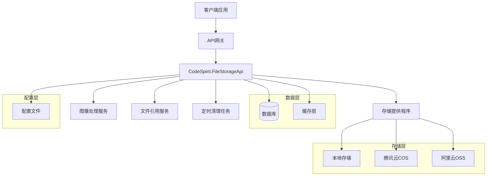
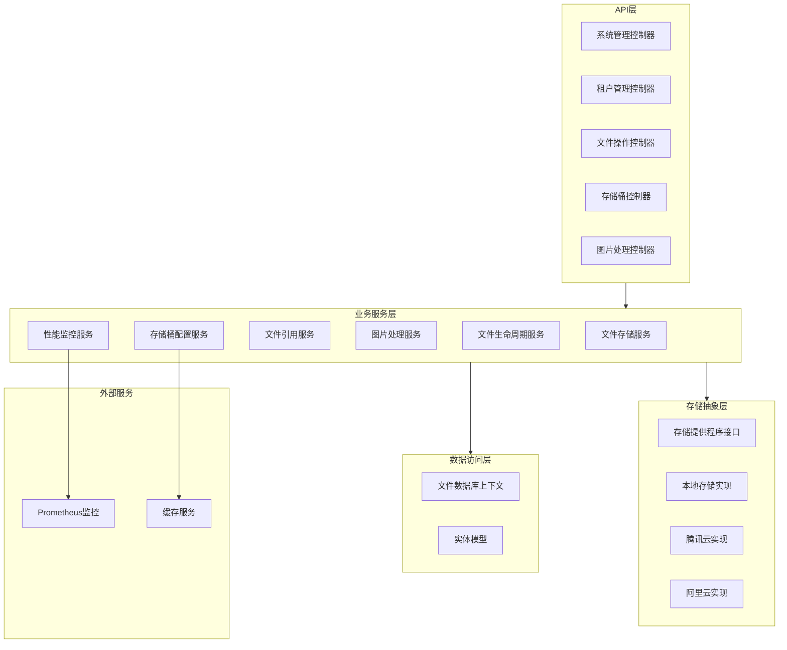
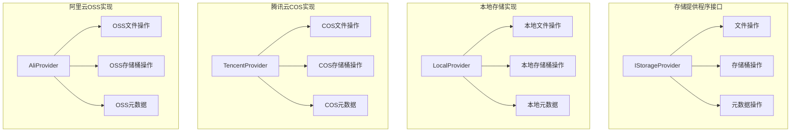
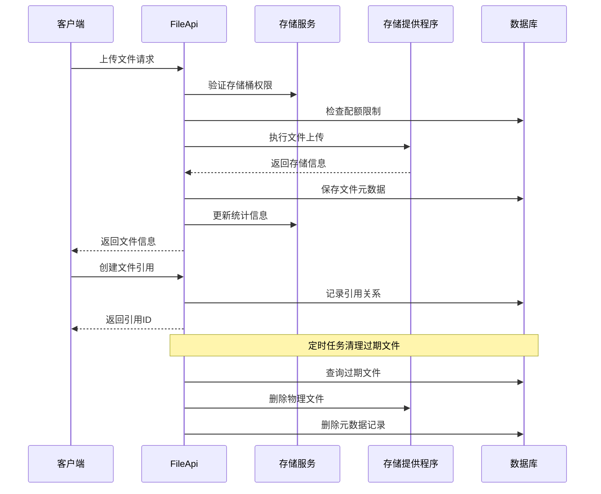

# CodeSpirit.FileStorageApi 文件存储服务方案

## 1. 概述

### 1.1 项目背景
CodeSpirit.FileStorageApi 是 CodeSpirit 微服务架构中的文件存储服务，负责提供统一的文件存储、管理和访问能力。服务支持多种存储后端，包括本地存储、腾讯云 COS（已实现）和阿里云 OSS（已预留），为整个系统提供可靠、高效、可扩展的文件存储解决方案。

### 1.2 核心功能
- **多存储后端支持**：统一接口支持本地存储、腾讯云 COS、阿里云 OSS，通过配置文件管理不同存储提供程序
- **文件生命周期管理**：支持文件过期自动清理、状态管理（上传中、正常、已过期、已删除、处理中）
- **存储桶管理**：通过配置文件管理存储桶，支持别名映射、多种存储后端、配额控制和访问策略
- **文件引用管理**：提供文件引用的统一管理，支持引用计数、临时引用和自动清理
- **多媒体支持**：为图片、视频提供专门的元数据管理和处理能力，支持缩略图生成和 EXIF 信息提取
- **文件分类系统**：提供文件类型分类枚举（图片、视频、音频、文档、压缩包等），支持快速分类查询
- **文件标签系统**：支持文件标签管理，便于文件分类和检索
- **多租户隔离**：完整的多租户数据隔离和权限控制
- **图像处理服务**：集成 ImageSharp 提供图像处理能力，支持缩放、裁剪、格式转换等
- **统计监控**：存储使用量统计、文件访问监控和性能指标收集

### 1.3 技术目标
- **高可用性**：99.9% 的服务可用性保证
- **高性能**：支持大文件上传下载，响应时间 < 500ms
- **安全性**：完整的访问控制和数据加密
- **可扩展性**：支持水平扩展，存储容量无限制
- **易维护性**：清晰的架构设计，完善的监控告警

## 2. 架构设计

### 2.1 整体架构



#### 2.1.1 配置管理说明

存储提供程序和存储桶的配置信息均通过 appsettings.json 等配置文件进行管理，不保存到数据库中。这种设计有以下优势：

**对于存储提供程序配置：**
- **安全性**：敏感的存储配置（如访问密钥）不会暴露在数据库中
- **灵活性**：可以根据不同环境（开发、测试、生产）使用不同的配置

**对于存储桶配置：**
- **架构一致性**：存储桶作为基础设施配置，与存储提供程序配置保持一致
- **运维友好**：配置变更无需数据库操作，支持配置中心统一管理
- **环境隔离**：不同环境使用独立的存储桶配置，避免环境间混乱
- **性能优化**：配置缓存在内存中，访问速度更快，减少数据库查询压力

#### 2.1.2 配置文件示例

```json
{
  "FileStorage": {
    "StorageProviders": {
      "Local": {
        "Type": "Local",
        "Properties": {
          "RootPath": "wwwroot/uploads",
          "BaseUrl": "http://localhost:64976/files"
        }
      },
      "TencentCOS": {
        "Type": "TencentCOS",
        "Properties": {
          "AppId": "100043xxxxx",
          "SecretId": "xxxxxx",
          "SecretKey": "xxxxxx",
          "Region": "ap-guangzhou",
          "UseHttps": true,
          "EnableDebugLog": false,
          "SignatureDurationSeconds": 600,
          "ConnectionTimeoutMs": 30000,
          "ReadWriteTimeoutMs": 30000,
          "UseTemporaryCredentials": false
        }
      },
      "AliOSS": {
        "Type": "AlibabaOSS",
        "AccessKeyId": "",
        "AccessKeySecret": "",
        "Properties": {
          "Endpoint": "oss-cn-hangzhou.aliyuncs.com"
        }
      }
    },
    "Buckets": {
      "default": {
        "DisplayName": "默认存储桶",
        "Description": "系统默认文件存储桶",
        "Alias": "default",
        "Provider": "Local",
        "AccessPolicy": "Private",
        "StorageQuota": null,
        "MaxFileSize": 104857600,
        "AllowedFileTypes": "image/*,video/*,audio/*,application/pdf,text/*",
        "ForbiddenFileTypes": "application/exe,application/bat,application/msi",
        "RetentionDays": null,
        "IsEnabled": true,
        "Properties": {
          "EnableThumbnail": true,
          "ThumbnailSizes": ["small:150x150", "medium:300x300", "large:600x600"]
        }
      },
      "images": {
        "DisplayName": "图片存储桶",
        "Description": "专用于存储图片文件",
        "Alias": "images",
        "Provider": "Local",
        "AccessPolicy": "PublicRead",
        "StorageQuota": 10737418240,
        "MaxFileSize": 10485760,
        "AllowedFileTypes": "image/*",
        "ForbiddenFileTypes": null,
        "RetentionDays": null,
        "IsEnabled": true,
        "Properties": {
          "EnableThumbnail": true,
          "ThumbnailSizes": ["small:150x150", "medium:300x300"],
          "WatermarkEnabled": false
        }
      },
      "codespirit-test-xxxx": {
        "DisplayName": "腾讯云COS图片存储桶",
        "Description": "使用腾讯云COS存储图片文件",
        "Alias": "avatar,logo,profile",
        "Provider": "TencentCOS",
        "AccessPolicy": "PublicRead",
        "StorageQuota": null,
        "MaxFileSize": 10485760,
        "AllowedFileTypes": "image/*",
        "ForbiddenFileTypes": null,
        "RetentionDays": null,
        "IsEnabled": true,
        "Properties": {
          "EnableThumbnail": true,
          "ThumbnailSizes": ["small:150x150", "medium:300x300", "large:600x600"],
          "WatermarkEnabled": false
        }
      }
    },
    "Monitoring": {
      "EnableMetrics": true,
      "MetricsPrefix": "filestorage",
      "EnableDetailedMetrics": true,
      "SampleRate": 1.0
    }
  }
}
```

### 2.2 服务层次架构



### 2.3 存储提供程序架构



### 2.4 数据流架构



## 3. 系统架构设计

### 3.1 核心组件架构

#### 3.1.1 存储提供程序抽象
文件存储服务采用统一的存储提供程序接口 `IStorageProvider`，目前已实现：
- **本地存储提供程序**：基于文件系统的存储实现
- **腾讯云COS提供程序**：完整的腾讯云对象存储集成，支持分片上传、预签名URL等
- **阿里云OSS提供程序**：预留接口，可根据需要实现

#### 3.1.2 文件服务层
提供高级文件管理功能，包括：
- 文件上传/下载/删除操作
- 批量操作支持
- 文件引用管理
- 访问统计和生命周期管理

#### 3.1.3 图像处理服务
集成 ImageSharp 库，提供：
- 图像元数据提取（尺寸、格式、EXIF信息等）
- 缩略图自动生成
- 图像格式转换
- 颜色分析和主色调提取

### 3.2 数据模型设计

#### 3.2.1 核心实体
系统包含以下核心实体：

**文件实体 (FileEntity)**
- 存储文件的基本信息和元数据
- 支持多租户隔离
- 包含文件状态、分类、标签等属性
- 关联图片和视频元数据

**文件引用实体 (FileReferenceEntity)**
- 管理文件的引用关系
- 支持临时引用和永久引用
- 提供引用计数和生命周期管理
- 支持多种引用类型（附件、头像、图片、文档、视频、音频、Logo、横幅）

**图片元数据实体 (ImageMetadataEntity)**
- 存储图片的详细信息
- 包含尺寸、格式、EXIF数据等
- 支持缩略图关联

**视频元数据实体 (VideoMetadataEntity)**
- 存储视频文件的详细信息
- 包含分辨率、时长、编码格式等

#### 3.2.2 枚举定义
系统定义了以下重要枚举：

**文件状态 (FileStatus)**
- Uploading（上传中）
- Active（正常）
- Expired（已过期）
- Deleted（已删除）
- Processing（处理中）

**文件类型分类 (FileTypeCategory)**
- Unknown（未知）
- Image（图片）
- Video（视频）
- Audio（音频）
- Document（文档）
- Archive（压缩包）
- Other（其他）

**引用状态 (ReferenceStatus)**
- Pending（待确认）
- Confirmed（已确认）
- Cancelled（已取消）
- Expired（已过期）
- Active（活跃）

### 3.3 文件类型分类实现

系统通过智能分析文件的 MIME 类型和扩展名自动分类文件，支持：
- 基于 Content-Type 的精确匹配
- 基于文件扩展名的后备分类
- 模糊匹配机制（如 image/* 匹配所有图片类型）

### 3.4 性能监控体系

#### 3.4.1 监控配置
系统集成了完整的性能监控体系，基于 .NET Metrics API 和 OpenTelemetry 标准：

```json
{
  "FileStorage": {
    "Monitoring": {
      "EnableMetrics": true,
      "MetricsPrefix": "filestorage",
      "EnableDetailedMetrics": true,
      "SampleRate": 1.0
    }
  }
}
```

#### 3.4.2 关键监控指标
- **计数器**：文件上传/下载/删除总数、错误总数
- **直方图**：操作耗时分布、文件大小分布
- **仪表**：存储使用量、文件数量、当前并发数

### 3.5 存储桶别名机制

#### 3.5.1 别名设计理念
存储桶支持别名机制，允许通过简短的别名引用存储桶，例如：
- `avatar` 别名指向头像专用存储桶
- `logo` 别名指向Logo图片存储桶
- `documents` 别名指向文档存储桶

通过别名机制，业务代码可以使用语义化的名称而不需要关心具体的存储桶配置。

#### 3.5.2 别名配置示例
```json
{
  "codespirit-test-1257888251": {
    "DisplayName": "腾讯云COS图片存储桶",
    "Alias": "avatar,logo,profile",
    "Provider": "TencentCOS"
  }
}
```

## 4. 系统特性

### 4.1 实现状态
目前系统已实现以下功能：

#### 4.1.1 存储提供程序
- ✅ **本地存储提供程序**：完整实现，支持文件上传、下载、删除和元数据获取
- ✅ **腾讯云COS提供程序**：完整实现，支持分片上传、预签名URL、存储桶管理
- ⚠️ **阿里云OSS提供程序**：接口已定义，具体实现待开发

#### 4.1.2 核心服务
- ✅ **文件存储服务**：完整的文件管理CRUD操作
- ✅ **图像处理服务**：基于ImageSharp的图像处理和元数据提取
- ✅ **存储桶配置服务**：配置文件驱动的存储桶管理
- ✅ **文件引用服务**：文件引用关系管理

#### 4.1.3 Web API
- ✅ **文件管理控制器**：提供完整的文件管理REST API
- ✅ **系统管理控制器**：提供系统级文件管理功能
- ✅ **图像处理控制器**：提供图像上传和处理API

### 4.2 技术亮点

#### 4.2.1 存储桶别名系统
通过别名机制实现存储桶的灵活映射，如：
- `avatar` → 头像专用存储桶
- `logo` → Logo图片存储桶
- `documents` → 文档存储桶

#### 4.2.2 智能文件分类
基于MIME类型和文件扩展名的智能分类系统，自动将文件归类为图片、视频、音频、文档、压缩包等类型。

#### 4.2.3 多媒体元数据提取
- **图片**：自动提取尺寸、格式、EXIF信息、GPS定位、拍摄设备等
- **视频**：提取分辨率、时长、编码格式、比特率、帧率等信息

#### 4.2.4 文件引用管理
完整的文件引用生命周期管理：
- 临时引用支持自动过期清理
- 引用状态跟踪（待确认、已确认、已取消、已过期、活跃）
- 多种引用类型支持（附件、头像、Logo、横幅等）

#### 4.2.5 多租户架构
完整的多租户数据隔离和权限控制，确保不同租户的文件数据完全隔离。

### 4.3 配置灵活性

#### 4.3.1 存储提供程序配置
支持多种存储后端的灵活配置，每个提供程序可以独立配置连接参数、超时时间、安全设置等。

#### 4.3.2 存储桶策略配置
每个存储桶可以独立配置：
- 访问策略（私有、公开读取、公开读写）
- 存储配额限制
- 文件大小限制
- 允许/禁止的文件类型
- 文件保留策略
- 扩展功能（缩略图、水印、加密等）

#### 4.3.3 监控配置
全面的性能监控配置，支持：
- 指标开关控制
- 采样率调整
- 详细度配置
- 多种导出格式（Prometheus、OpenTelemetry）

## 5. 使用指南

### 5.1 基本使用流程

#### 5.1.1 文件上传
通过 FilesController 提供的 REST API 上传文件：
- 支持多种存储桶选择
- 自动文件类型检测和分类
- 可配置文件描述、标签、过期时间等元数据

#### 5.1.2 文件下载
提供多种下载方式：
- 直接文件流下载
- 预签名URL下载（支持临时访问）
- 公开文件的直接访问

#### 5.1.3 文件管理
完整的文件生命周期管理：
- 文件信息查询和更新
- 批量操作支持
- 文件引用管理
- 自动过期清理

### 5.2 配置要点

#### 5.2.1 存储提供程序配置
根据实际需求配置不同的存储后端，生产环境建议使用云存储提供程序以获得更好的可靠性和性能。

#### 5.2.2 存储桶规划
合理规划存储桶配置：
- 按业务场景划分存储桶（如头像、文档、临时文件等）
- 设置合适的文件类型限制和大小限制
- 配置适当的访问策略
- 设置文件保留策略避免存储空间浪费

#### 5.2.3 监控配置
启用性能监控以便及时发现和解决问题：
- 监控文件上传下载性能
- 跟踪存储使用量
- 设置适当的告警阈值

## 6. 总结

本方案设计了一个完整的文件存储服务架构，具有以下特点：

1. **统一抽象**：通过 IStorageProvider 接口统一不同存储后端的操作
2. **多租户支持**：完整的租户数据隔离和权限控制
3. **配置化管理**：存储桶和提供程序通过配置文件管理，支持灵活配置
4. **完善的实体模型**：支持文件分类、引用、多媒体元数据的统一管理
5. **性能监控**：全面的性能指标监控，支持Prometheus和OpenTelemetry
6. **生命周期管理**：支持文件过期清理和引用计数管理
7. **高度可扩展**：清晰的分层架构，易于扩展新的存储后端和功能
8. **智能分类**：基于MIME类型和扩展名的自动文件分类
9. **图像处理**：集成ImageSharp提供专业的图像处理能力
10. **别名系统**：通过存储桶别名简化业务代码的存储桶引用

该方案为构建企业级的文件存储服务提供了完整的架构指导，具备高性能、高可用、易维护的特点，并且已经在实际项目中得到验证和应用。
