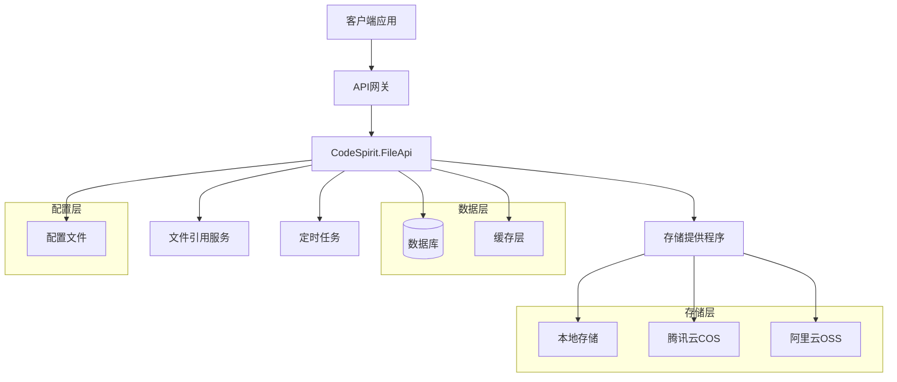
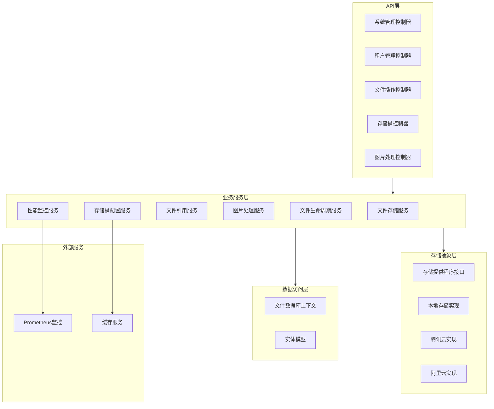
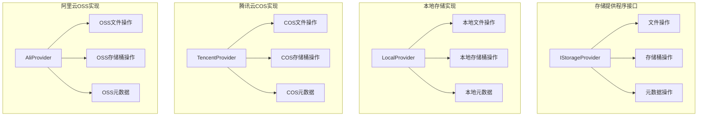
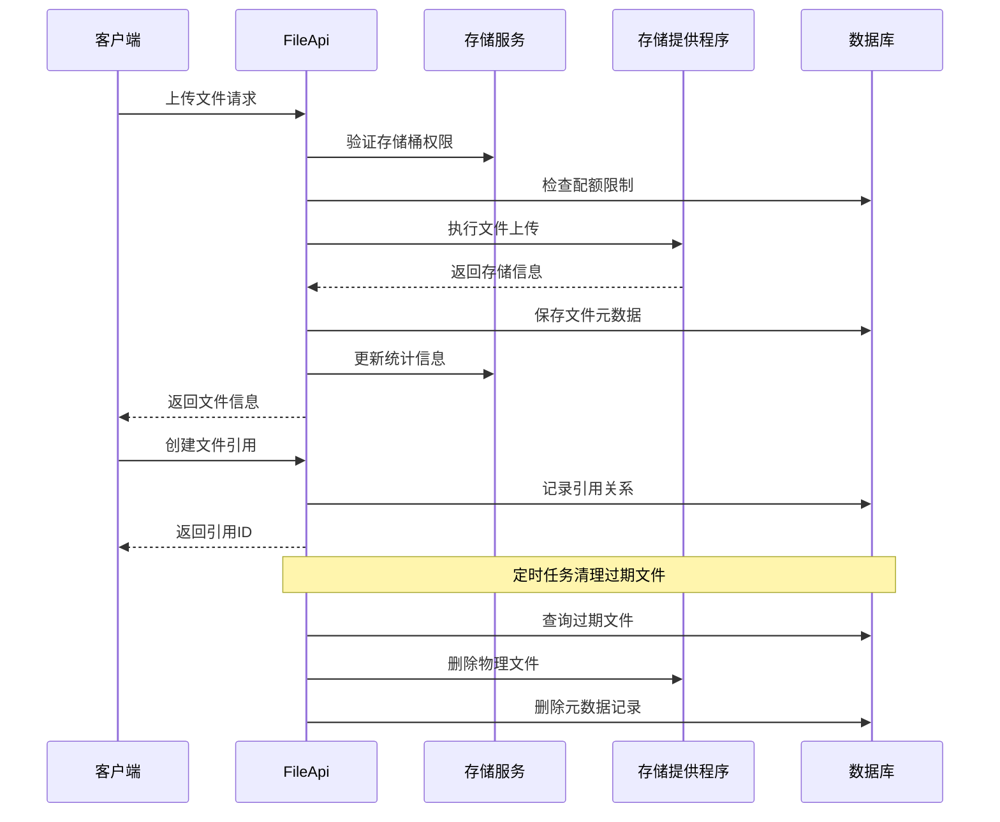

# CodeSpirit.FileApi 文件存储服务方案

## 1. 概述

### 1.1 项目背景
CodeSpirit.FileApi 是 CodeSpirit 微服务架构中的文件存储服务，负责提供统一的文件存储、管理和访问能力。服务支持多种存储后端，包括本地存储、腾讯云 COS 和阿里云 OSS，为整个系统提供可靠、高效、可扩展的文件存储解决方案。

### 1.2 核心功能
- **多存储后端支持**：统一接口支持本地存储、腾讯云 COS、阿里云 OSS，通过配置文件管理不同存储提供程序
- **文件生命周期管理**：支持文件过期自动清理、版本管理
- **存储桶管理**：通过配置文件管理存储桶，支持多种存储后端、配额控制和访问策略
- **文件引用管理**：提供文件引用的统一管理，支持引用计数和自动清理
- **多媒体支持**：为图片、视频提供专门的元数据管理和处理能力，支持缩略图生成
- **文件分类系统**：提供文件类型分类枚举（图片、视频、音频、文档等），支持快速分类查询
- **文件标签系统**：支持文件标签管理，便于文件分类和检索
- **多租户隔离**：完整的多租户数据隔离和权限控制
- **统计监控**：存储使用量统计、文件访问监控

### 1.3 技术目标
- **高可用性**：99.9% 的服务可用性保证
- **高性能**：支持大文件上传下载，响应时间 < 500ms
- **安全性**：完整的访问控制和数据加密
- **可扩展性**：支持水平扩展，存储容量无限制
- **易维护性**：清晰的架构设计，完善的监控告警

## 2. 架构设计

### 2.1 整体架构



#### 2.1.1 配置管理说明

存储提供程序和存储桶的配置信息均通过 appsettings.json 等配置文件进行管理，不保存到数据库中。这种设计有以下优势：

**对于存储提供程序配置：**
- **安全性**：敏感的存储配置（如访问密钥）不会暴露在数据库中
- **灵活性**：可以根据不同环境（开发、测试、生产）使用不同的配置

**对于存储桶配置：**
- **架构一致性**：存储桶作为基础设施配置，与存储提供程序配置保持一致
- **运维友好**：配置变更无需数据库操作，支持配置中心统一管理
- **环境隔离**：不同环境使用独立的存储桶配置，避免环境间混乱
- **性能优化**：配置缓存在内存中，访问速度更快，减少数据库查询压力

#### 2.1.2 配置文件示例

```json
{
  "FileStorage": {
    "StorageProviders": {
      "Local": {
        "Type": "Local",
        "RootPath": "wwwroot/uploads",
        "BaseUrl": "https://api.example.com/files"
      },
      "TencentCOS": {
        "Type": "TencentCOS",
        "SecretId": "AKIDxxxxxxx",
        "SecretKey": "xxxxxxx",
        "Region": "ap-beijing",
        "Domain": "https://bucket.cos.ap-beijing.myqcloud.com"
      },
      "AliOSS": {
        "Type": "AlibabaOSS",
        "AccessKeyId": "LTAIxxxxxxx",
        "AccessKeySecret": "xxxxxxx",
        "Endpoint": "oss-cn-hangzhou.aliyuncs.com"
      }
    },
    "Buckets": {
      "default": {
        "DisplayName": "默认存储桶",
        "Description": "系统默认文件存储桶",
        "Provider": "Local",
        "AccessPolicy": "Private",
        "StorageQuota": null,
        "MaxFileSize": 104857600,
        "AllowedFileTypes": "image/*,video/*,audio/*,application/pdf",
        "ForbiddenFileTypes": "application/exe,application/bat",
        "RetentionDays": null,
        "IsEnabled": true,
        "Properties": {
          "EnableThumbnail": true,
          "ThumbnailSizes": ["small:150x150", "medium:300x300", "large:600x600"]
        }
      },
      "images": {
        "DisplayName": "图片存储桶",
        "Description": "专用于存储图片文件",
        "Provider": "TencentCOS",
        "AccessPolicy": "PublicRead",
        "StorageQuota": 10737418240,
        "MaxFileSize": 10485760,
        "AllowedFileTypes": "image/*",
        "ForbiddenFileTypes": null,
        "RetentionDays": null,
        "IsEnabled": true,
        "Properties": {
          "EnableThumbnail": true,
          "ThumbnailSizes": ["small:150x150", "medium:300x300"],
          "WatermarkEnabled": true
        }
      },
      "documents": {
        "DisplayName": "文档存储桶",
        "Description": "用于存储文档文件",
        "Provider": "AliOSS",
        "AccessPolicy": "Private",
        "StorageQuota": 53687091200,
        "MaxFileSize": 104857600,
        "AllowedFileTypes": "application/pdf,application/msword,application/vnd.openxmlformats-officedocument.wordprocessingml.document",
        "ForbiddenFileTypes": null,
        "RetentionDays": 2555,
        "IsEnabled": true,
        "Properties": {
          "EnableVirusScan": true,
          "EnableEncryption": true
        }
      }
    },
    "Monitoring": {
      "EnableMetrics": true,
      "MetricsPrefix": "filestorage",
      "EnableDetailedMetrics": true,
      "SampleRate": 1.0
    }
  },
  "OpenTelemetry": {
    "Metrics": {
      "Providers": ["Prometheus"],
      "Exporters": ["PrometheusAspNetCore"]
    }
  }
}
```

### 2.2 服务层次架构



### 2.3 存储提供程序架构



### 2.4 数据流架构



## 3. 技术实现

### 3.1 核心对象抽象设计

#### 3.1.1 存储提供程序接口

```csharp
using System.ComponentModel.DataAnnotations;

/// <summary>
/// 存储提供程序接口
/// 定义统一的文件存储操作抽象
/// </summary>
public interface IStorageProvider
{
    /// <summary>
    /// 提供程序类型
    /// </summary>
    StorageProviderType ProviderType { get; }
    
    /// <summary>
    /// 上传文件
    /// </summary>
    /// <param name="bucketName">存储桶名称</param>
    /// <param name="fileName">文件名</param>
    /// <param name="stream">文件流</param>
    /// <param name="contentType">内容类型</param>
    /// <param name="metadata">自定义元数据</param>
    /// <returns>存储结果</returns>
    Task<StorageResult> UploadFileAsync(string bucketName, string fileName, 
        Stream stream, string contentType = null, 
        IDictionary<string, string> metadata = null);
    
    /// <summary>
    /// 下载文件
    /// </summary>
    /// <param name="bucketName">存储桶名称</param>
    /// <param name="fileName">文件名</param>
    /// <returns>文件流</returns>
    Task<Stream> DownloadFileAsync(string bucketName, string fileName);
    
    /// <summary>
    /// 删除文件
    /// </summary>
    /// <param name="bucketName">存储桶名称</param>
    /// <param name="fileName">文件名</param>
    /// <returns>删除结果</returns>
    Task<bool> DeleteFileAsync(string bucketName, string fileName);
    
    /// <summary>
    /// 获取文件信息
    /// </summary>
    /// <param name="bucketName">存储桶名称</param>
    /// <param name="fileName">文件名</param>
    /// <returns>文件信息</returns>
    Task<FileInfo> GetFileInfoAsync(string bucketName, string fileName);
    
    /// <summary>
    /// 生成预签名URL
    /// </summary>
    /// <param name="bucketName">存储桶名称</param>
    /// <param name="fileName">文件名</param>
    /// <param name="expirationTime">过期时间</param>
    /// <param name="operation">操作类型</param>
    /// <returns>预签名URL</returns>
    Task<string> GeneratePresignedUrlAsync(string bucketName, string fileName,
        TimeSpan expirationTime, PresignedUrlOperation operation = PresignedUrlOperation.Read);
    
    /// <summary>
    /// 创建存储桶
    /// </summary>
    /// <param name="bucketName">存储桶名称</param>
    /// <param name="options">创建选项</param>
    /// <returns>创建结果</returns>
    Task<bool> CreateBucketAsync(string bucketName, BucketCreationOptions options = null);
    
    /// <summary>
    /// 删除存储桶
    /// </summary>
    /// <param name="bucketName">存储桶名称</param>
    /// <returns>删除结果</returns>
    Task<bool> DeleteBucketAsync(string bucketName);
}

/// <summary>
/// 存储提供程序类型
/// </summary>
public enum StorageProviderType
{
    /// <summary>
    /// 本地存储
    /// </summary>
    [Display(Name = "本地存储")]
    Local = 1,
    
    /// <summary>
    /// 腾讯云COS
    /// </summary>
    [Display(Name = "腾讯云对象存储")]
    TencentCOS = 2,
    
    /// <summary>
    /// 阿里云OSS
    /// </summary>
    [Display(Name = "阿里云对象存储")]
    AlibabaOSS = 3
}

/// <summary>
/// 存储结果
/// </summary>
public class StorageResult
{
    /// <summary>
    /// 是否成功
    /// </summary>
    public bool Success { get; set; }
    
    /// <summary>
    /// 文件URL
    /// </summary>
    public string FileUrl { get; set; }
    
    /// <summary>
    /// 文件ETag
    /// </summary>
    public string ETag { get; set; }
    
    /// <summary>
    /// 文件大小
    /// </summary>
    public long Size { get; set; }
    
    /// <summary>
    /// 错误信息
    /// </summary>
    public string ErrorMessage { get; set; }
    
    /// <summary>
    /// 扩展属性
    /// </summary>
    public IDictionary<string, object> Properties { get; set; } = new Dictionary<string, object>();
}
```

#### 3.1.2 文件服务接口

```csharp
/// <summary>
/// 文件存储服务接口
/// 提供高级文件管理功能
/// </summary>
public interface IFileStorageService
{
    /// <summary>
    /// 上传文件
    /// </summary>
    /// <param name="request">上传请求</param>
    /// <returns>文件信息</returns>
    Task<FileEntity> UploadFileAsync(FileUploadRequest request);
    
    /// <summary>
    /// 下载文件
    /// </summary>
    /// <param name="fileId">文件ID</param>
    /// <returns>文件流和信息</returns>
    Task<(Stream Stream, FileEntity FileInfo)> DownloadFileAsync(long fileId);
    
    /// <summary>
    /// 获取文件下载URL
    /// </summary>
    /// <param name="fileId">文件ID</param>
    /// <param name="expirationMinutes">过期时间（分钟）</param>
    /// <returns>下载URL</returns>
    Task<string> GetDownloadUrlAsync(long fileId, int expirationMinutes = 60);
    
    /// <summary>
    /// 删除文件
    /// </summary>
    /// <param name="fileId">文件ID</param>
    /// <returns>删除结果</returns>
    Task<bool> DeleteFileAsync(long fileId);
    
    /// <summary>
    /// 获取文件信息
    /// </summary>
    /// <param name="fileId">文件ID</param>
    /// <returns>文件信息</returns>
    Task<FileEntity> GetFileInfoAsync(long fileId);
    
    /// <summary>
    /// 批量删除文件
    /// </summary>
    /// <param name="fileIds">文件ID列表</param>
    /// <returns>删除结果</returns>
    Task<BatchOperationResult> BatchDeleteFilesAsync(IEnumerable<long> fileIds);
}

/// <summary>
/// 文件上传请求
/// </summary>
public class FileUploadRequest
{
    /// <summary>
    /// 存储桶名称
    /// </summary>
    public string BucketName { get; set; }
    
    /// <summary>
    /// 文件名
    /// </summary>
    public string FileName { get; set; }
    
    /// <summary>
    /// 文件流
    /// </summary>
    public Stream FileStream { get; set; }
    
    /// <summary>
    /// 内容类型
    /// </summary>
    public string ContentType { get; set; }
    
    /// <summary>
    /// 文件描述
    /// </summary>
    public string Description { get; set; }
    
    /// <summary>
    /// 过期时间
    /// </summary>
    public DateTime? ExpirationTime { get; set; }
    
    /// <summary>
    /// 自定义标签
    /// </summary>
    public IDictionary<string, string> Tags { get; set; }
    
    /// <summary>
    /// 是否覆盖已存在文件
    /// </summary>
    public bool OverwriteExisting { get; set; }
}
```

#### 3.1.3 图片处理服务接口

```csharp
/// <summary>
/// 图片处理服务接口
/// </summary>
public interface IImageProcessingService
{
    /// <summary>
    /// 上传图片
    /// </summary>
    /// <param name="request">上传请求</param>
    /// <returns>图片信息</returns>
    Task<ImageEntity> UploadImageAsync(ImageUploadRequest request);
    
    /// <summary>
    /// 获取图片信息
    /// </summary>
    /// <param name="imageId">图片ID</param>
    /// <returns>图片信息</returns>
    Task<ImageEntity> GetImageInfoAsync(long imageId);
    
    /// <summary>
    /// 处理图片
    /// </summary>
    /// <param name="imageId">图片ID</param>
    /// <param name="operations">处理操作</param>
    /// <returns>处理后的图片</returns>
    Task<ProcessedImageResult> ProcessImageAsync(long imageId, 
        IEnumerable<ImageOperation> operations);
}

/// <summary>
/// 图片上传请求
/// </summary>
public class ImageUploadRequest : FileUploadRequest
{    
    /// <summary>
    /// 图片质量（1-100）
    /// </summary>
    public int Quality { get; set; } = 85;
    
    /// <summary>
    /// 是否提取EXIF信息
    /// </summary>
    public bool ExtractExifData { get; set; } = true;
}
```

### 3.1.4 文件类型分类实现

文件类型分类通过以下逻辑自动设置：

```csharp
/// <summary>
/// 文件类型分类工具类
/// </summary>
public static class FileTypeCategoryHelper
{
    private static readonly Dictionary<string, FileTypeCategory> ContentTypeMapping = new()
    {
        // 图片类型
        { "image/jpeg", FileTypeCategory.Image },
        { "image/png", FileTypeCategory.Image },
        { "image/gif", FileTypeCategory.Image },
        { "image/bmp", FileTypeCategory.Image },
        { "image/webp", FileTypeCategory.Image },
        { "image/svg+xml", FileTypeCategory.Image },
        
        // 视频类型
        { "video/mp4", FileTypeCategory.Video },
        { "video/avi", FileTypeCategory.Video },
        { "video/mov", FileTypeCategory.Video },
        { "video/wmv", FileTypeCategory.Video },
        { "video/flv", FileTypeCategory.Video },
        { "video/webm", FileTypeCategory.Video },
        
        // 音频类型
        { "audio/mp3", FileTypeCategory.Audio },
        { "audio/wav", FileTypeCategory.Audio },
        { "audio/flac", FileTypeCategory.Audio },
        { "audio/aac", FileTypeCategory.Audio },
        { "audio/ogg", FileTypeCategory.Audio },
        
        // 文档类型
        { "application/pdf", FileTypeCategory.Document },
        { "application/msword", FileTypeCategory.Document },
        { "application/vnd.openxmlformats-officedocument.wordprocessingml.document", FileTypeCategory.Document },
        { "application/vnd.ms-excel", FileTypeCategory.Document },
        { "application/vnd.openxmlformats-officedocument.spreadsheetml.sheet", FileTypeCategory.Document },
        { "text/plain", FileTypeCategory.Document },
        { "text/csv", FileTypeCategory.Document },
        
        // 压缩包类型
        { "application/zip", FileTypeCategory.Archive },
        { "application/x-rar-compressed", FileTypeCategory.Archive },
        { "application/x-7z-compressed", FileTypeCategory.Archive },
        { "application/gzip", FileTypeCategory.Archive }
    };
    
    /// <summary>
    /// 根据内容类型获取文件类型分类
    /// </summary>
    /// <param name="contentType">内容类型</param>
    /// <returns>文件类型分类</returns>
    public static FileTypeCategory GetCategoryFromContentType(string contentType)
    {
        if (string.IsNullOrEmpty(contentType))
            return FileTypeCategory.Unknown;
            
        // 精确匹配
        if (ContentTypeMapping.TryGetValue(contentType.ToLowerInvariant(), out var category))
            return category;
            
        // 模糊匹配
        var lowerContentType = contentType.ToLowerInvariant();
        if (lowerContentType.StartsWith("image/"))
            return FileTypeCategory.Image;
        if (lowerContentType.StartsWith("video/"))
            return FileTypeCategory.Video;
        if (lowerContentType.StartsWith("audio/"))
            return FileTypeCategory.Audio;
        if (lowerContentType.StartsWith("text/") || lowerContentType.Contains("document") || lowerContentType.Contains("pdf"))
            return FileTypeCategory.Document;
        if (lowerContentType.Contains("zip") || lowerContentType.Contains("archive") || lowerContentType.Contains("compressed"))
            return FileTypeCategory.Archive;
            
        return FileTypeCategory.Other;
    }
    
    /// <summary>
    /// 根据文件扩展名获取文件类型分类（备用方案）
    /// </summary>
    /// <param name="extension">文件扩展名</param>
    /// <returns>文件类型分类</returns>
    public static FileTypeCategory GetCategoryFromExtension(string extension)
    {
        if (string.IsNullOrEmpty(extension))
            return FileTypeCategory.Unknown;
            
        var ext = extension.TrimStart('.').ToLowerInvariant();
        
        return ext switch
        {
            "jpg" or "jpeg" or "png" or "gif" or "bmp" or "webp" or "svg" => FileTypeCategory.Image,
            "mp4" or "avi" or "mov" or "wmv" or "flv" or "webm" or "mkv" => FileTypeCategory.Video,
            "mp3" or "wav" or "flac" or "aac" or "ogg" or "wma" => FileTypeCategory.Audio,
            "pdf" or "doc" or "docx" or "xls" or "xlsx" or "ppt" or "pptx" or "txt" or "csv" => FileTypeCategory.Document,
            "zip" or "rar" or "7z" or "tar" or "gz" => FileTypeCategory.Archive,
            _ => FileTypeCategory.Other
        };
    }
}
```

在文件上传时，系统会自动调用 `GetCategoryFromContentType` 方法来设置文件的分类字段，从而实现高效的分类查询。

### 3.2 实体模型设计

#### 3.2.1 存储桶配置模型

```csharp
/// <summary>
/// 文件存储配置
/// </summary>
public class FileStorageOptions
{
    public const string SectionName = "FileStorage";
    
    /// <summary>
    /// 存储提供程序配置
    /// </summary>
    public Dictionary<string, StorageProviderOptions> StorageProviders { get; set; } = new();
    
    /// <summary>
    /// 存储桶配置
    /// </summary>
    public Dictionary<string, StorageBucketOptions> Buckets { get; set; } = new();
}

/// <summary>
/// 存储提供程序配置选项
/// </summary>
public class StorageProviderOptions
{
    /// <summary>
    /// 提供程序类型
    /// </summary>
    public StorageProviderType Type { get; set; }
    
    /// <summary>
    /// 配置属性（不同提供程序的配置参数）
    /// </summary>
    public Dictionary<string, object> Properties { get; set; } = new();
}

/// <summary>
/// 存储桶配置选项
/// </summary>
public class StorageBucketOptions
{
    /// <summary>
    /// 显示名称
    /// </summary>
    public string DisplayName { get; set; }
    
    /// <summary>
    /// 描述
    /// </summary>
    public string Description { get; set; }
    
    /// <summary>
    /// 存储提供程序名称
    /// </summary>
    public string Provider { get; set; }
    
    /// <summary>
    /// 访问策略
    /// </summary>
    public BucketAccessPolicy AccessPolicy { get; set; } = BucketAccessPolicy.Private;
    
    /// <summary>
    /// 存储配额（字节，null表示无限制）
    /// </summary>
    public long? StorageQuota { get; set; }
    
    /// <summary>
    /// 单文件大小限制（字节）
    /// </summary>
    public long? MaxFileSize { get; set; }
    
    /// <summary>
    /// 允许的文件类型
    /// </summary>
    public string AllowedFileTypes { get; set; }
    
    /// <summary>
    /// 禁止的文件类型
    /// </summary>
    public string ForbiddenFileTypes { get; set; }
    
    /// <summary>
    /// 文件保留天数
    /// </summary>
    public int? RetentionDays { get; set; }
    
    /// <summary>
    /// 是否启用
    /// </summary>
    public bool IsEnabled { get; set; } = true;
    
    /// <summary>
    /// 扩展属性
    /// </summary>
    public Dictionary<string, object> Properties { get; set; } = new();
}

/// <summary>
/// 存储桶配置服务接口
/// </summary>
public interface IBucketConfigurationService
{
    /// <summary>
    /// 获取所有存储桶配置
    /// </summary>
    IEnumerable<(string Name, StorageBucketOptions Options)> GetAllBuckets();
    
    /// <summary>
    /// 根据名称获取存储桶配置
    /// </summary>
    StorageBucketOptions GetBucketByName(string bucketName);
    
    /// <summary>
    /// 获取默认存储桶配置
    /// </summary>
    (string Name, StorageBucketOptions Options) GetDefaultBucket();
    
    /// <summary>
    /// 获取指定租户的可用存储桶
    /// </summary>
    IEnumerable<(string Name, StorageBucketOptions Options)> GetAvailableBuckets(string tenantId);
    
    /// <summary>
    /// 获取存储桶统计信息
    /// </summary>
    Task<BucketStatistics> GetBucketStatisticsAsync(string bucketName);
    
    /// <summary>
    /// 更新存储桶统计信息
    /// </summary>
    Task UpdateBucketStatisticsAsync(string bucketName, long fileCountDelta, long sizeCountDelta);
}

/// <summary>
/// 存储桶统计信息（缓存管理）
/// </summary>
public class BucketStatistics
{
    /// <summary>
    /// 存储桶名称
    /// </summary>
    public string BucketName { get; set; }
    
    /// <summary>
    /// 文件数量
    /// </summary>
    public long FileCount { get; set; }
    
    /// <summary>
    /// 存储大小（字节）
    /// </summary>
    public long StorageSize { get; set; }
    
    /// <summary>
    /// 最后更新时间
    /// </summary>
    public DateTime LastUpdateTime { get; set; }
}

/// <summary>
/// 存储桶访问策略
/// </summary>
public enum BucketAccessPolicy
{
    /// <summary>
    /// 私有（需要授权访问）
    /// </summary>
    [Display(Name = "私有访问")]
    Private = 1,
    
    /// <summary>
    /// 公开读取
    /// </summary>
    [Display(Name = "公开读取")]
    PublicRead = 2,
    
    /// <summary>
    /// 公开读写
    /// </summary>
    [Display(Name = "公开读写")]
    PublicReadWrite = 3
}
```

#### 3.2.2 文件实体

```csharp
/// <summary>
/// 文件实体
/// 存储文件的基本信息和元数据
/// </summary>
[Table("Files")]
public class FileEntity : LongKeyAuditableEntityBase, IMultiTenant
{
    /// <summary>
    /// 租户ID
    /// </summary>
    [Required]
    [MaxLength(64)]
    public string TenantId { get; set; }
    
    /// <summary>
    /// 存储桶名称（引用配置中的存储桶）
    /// </summary>
    [Required]
    [MaxLength(128)]
    public string BucketName { get; set; }
    
    /// <summary>
    /// 原始文件名
    /// </summary>
    [Required]
    [MaxLength(512)]
    public string OriginalFileName { get; set; }
    
    /// <summary>
    /// 存储文件名（在存储系统中的唯一标识）
    /// </summary>
    [Required]
    [MaxLength(512)]
    public string StorageFileName { get; set; }
    
    /// <summary>
    /// 文件路径（在存储桶内的路径）
    /// </summary>
    [MaxLength(1024)]
    public string FilePath { get; set; }
    
    /// <summary>
    /// 文件大小（字节）
    /// </summary>
    [Required]
    public long Size { get; set; }
    
    /// <summary>
    /// 内容类型（MIME类型）
    /// </summary>
    [Required]
    [MaxLength(256)]
    public string ContentType { get; set; }
    
    /// <summary>
    /// 文件哈希值（MD5）
    /// </summary>
    [Required]
    [MaxLength(128)]
    public string FileHash { get; set; }
    
    /// <summary>
    /// 文件扩展名
    /// </summary>
    [MaxLength(32)]
    public string Extension { get; set; }
    
    /// <summary>
    /// 文件类型分类
    /// </summary>
    public FileTypeCategory Category { get; set; }
    
    /// <summary>
    /// 文件描述
    /// </summary>
    [MaxLength(1000)]
    public string Description { get; set; }
    
    /// <summary>
    /// 文件状态
    /// </summary>
    public FileStatus Status { get; set; } = FileStatus.Active;
    
    /// <summary>
    /// 访问次数
    /// </summary>
    public long AccessCount { get; set; }
    
    /// <summary>
    /// 最后访问时间
    /// </summary>
    public DateTime? LastAccessTime { get; set; }
    
    /// <summary>
    /// 过期时间（null表示永不过期）
    /// </summary>
    public DateTime? ExpirationTime { get; set; }
    
    /// <summary>
    /// 是否公开访问
    /// </summary>
    public bool IsPublic { get; set; }
    
    /// <summary>
    /// 下载URL（临时或永久）
    /// </summary>
    [MaxLength(2048)]
    public string DownloadUrl { get; set; }
    
    /// <summary>
    /// ETag（用于缓存控制）
    /// </summary>
    [MaxLength(256)]
    public string ETag { get; set; }
    
    /// <summary>
    /// 文件标签（多个标签用逗号分隔）
    /// </summary>
    [MaxLength(2000)]
    public string Tags { get; set; }
    
    /// <summary>
    /// 自定义属性（JSON格式）
    /// </summary>
    [Column(TypeName = "nvarchar(max)")]
    public string Properties { get; set; }
    
    /// <summary>
    /// 文件引用
    /// </summary>
    public virtual ICollection<FileReferenceEntity> References { get; set; } = new List<FileReferenceEntity>();
    
    /// <summary>
    /// 图片元数据（如果是图片文件）
    /// </summary>
    public virtual ImageMetadataEntity ImageMetadata { get; set; }
    
    /// <summary>
    /// 视频元数据（如果是视频文件）
    /// </summary>
    public virtual VideoMetadataEntity VideoMetadata { get; set; }
}

/// <summary>
/// 文件状态
/// </summary>
public enum FileStatus
{
    /// <summary>
    /// 上传中
    /// </summary>
    [Display(Name = "上传中")]
    Uploading = 1,
    
    /// <summary>
    /// 活跃状态
    /// </summary>
    [Display(Name = "正常")]
    Active = 2,
    
    /// <summary>
    /// 已过期
    /// </summary>
    [Display(Name = "已过期")]
    Expired = 3,
    
    /// <summary>
    /// 已删除
    /// </summary>
    [Display(Name = "已删除")]
    Deleted = 4,
    
    /// <summary>
    /// 处理中
    /// </summary>
    [Display(Name = "处理中")]
    Processing = 5
}

/// <summary>
/// 文件类型分类
/// </summary>
public enum FileTypeCategory
{
    /// <summary>
    /// 未知类型
    /// </summary>
    [Display(Name = "未知")]
    Unknown = 0,
    
    /// <summary>
    /// 图片
    /// </summary>
    [Display(Name = "图片")]
    Image = 1,
    
    /// <summary>
    /// 视频
    /// </summary>
    [Display(Name = "视频")]
    Video = 2,
    
    /// <summary>
    /// 音频
    /// </summary>
    [Display(Name = "音频")]
    Audio = 3,
    
    /// <summary>
    /// 文档
    /// </summary>
    [Display(Name = "文档")]
    Document = 4,
    
    /// <summary>
    /// 压缩包
    /// </summary>
    [Display(Name = "压缩包")]
    Archive = 5,
    
    /// <summary>
    /// 其他
    /// </summary>
    [Display(Name = "其他")]
    Other = 99
}
```

#### 3.2.3 文件引用实体

```csharp
/// <summary>
/// 文件引用实体
/// 管理文件的引用关系，支持引用计数和生命周期管理
/// </summary>
[Table("FileReferences")]
public class FileReferenceEntity : LongKeyAuditableEntityBase, IMultiTenant
{
    /// <summary>
    /// 租户ID
    /// </summary>
    [Required]
    [MaxLength(64)]
    public string TenantId { get; set; }
    
    /// <summary>
    /// 文件ID
    /// </summary>
    [Required]
    public long FileId { get; set; }
    
    /// <summary>
    /// 引用来源服务
    /// </summary>
    [Required]
    [MaxLength(128)]
    public string SourceService { get; set; }
    
    /// <summary>
    /// 引用来源实体类型
    /// </summary>
    [Required]
    [MaxLength(128)]
    public string SourceEntityType { get; set; }
    
    /// <summary>
    /// 引用来源实体ID
    /// </summary>
    [Required]
    [MaxLength(128)]
    public string SourceEntityId { get; set; }
    
    /// <summary>
    /// 引用字段名
    /// </summary>
    [MaxLength(128)]
    public string FieldName { get; set; }
    
    /// <summary>
    /// 引用类型
    /// </summary>
    public ReferenceType ReferenceType { get; set; } = ReferenceType.Attachment;
    
    /// <summary>
    /// 引用状态
    /// </summary>
    public ReferenceStatus Status { get; set; } = ReferenceStatus.Pending;
    
    /// <summary>
    /// 是否为临时引用
    /// </summary>
    public bool IsTemporary { get; set; }
    
    /// <summary>
    /// 引用过期时间（临时引用）
    /// </summary>
    public DateTime? ExpirationTime { get; set; }
    
    /// <summary>
    /// 引用确认时间
    /// </summary>
    public DateTime? ConfirmedTime { get; set; }
    
    /// <summary>
    /// 引用备注
    /// </summary>
    [MaxLength(500)]
    public string Remarks { get; set; }
    
    /// <summary>
    /// 扩展属性（JSON格式）
    /// </summary>
    [Column(TypeName = "nvarchar(max)")]
    public string Properties { get; set; }
    
    /// <summary>
    /// 关联的文件
    /// </summary>
    public virtual FileEntity File { get; set; }
}

/// <summary>
/// 引用类型
/// </summary>
public enum ReferenceType
{
    /// <summary>
    /// 附件
    /// </summary>
    [Display(Name = "附件")]
    Attachment = 1,
    
    /// <summary>
    /// 头像
    /// </summary>
    [Display(Name = "头像")]
    Avatar = 2,
    
    /// <summary>
    /// 图片
    /// </summary>
    [Display(Name = "图片")]
    Image = 3,
    
    /// <summary>
    /// 文档
    /// </summary>
    [Display(Name = "文档")]
    Document = 4,
    
    /// <summary>
    /// 视频
    /// </summary>
    [Display(Name = "视频")]
    Video = 5,
    
    /// <summary>
    /// 音频
    /// </summary>
    [Display(Name = "音频")]
    Audio = 6
}

/// <summary>
/// 引用状态
/// </summary>
public enum ReferenceStatus
{
    /// <summary>
    /// 待确认
    /// </summary>
    [Display(Name = "待确认")]
    Pending = 1,
    
    /// <summary>
    /// 已确认
    /// </summary>
    [Display(Name = "已确认")]
    Confirmed = 2,
    
    /// <summary>
    /// 已取消
    /// </summary>
    [Display(Name = "已取消")]
    Cancelled = 3,
    
    /// <summary>
    /// 已过期
    /// </summary>
    [Display(Name = "已过期")]
    Expired = 4
}
```

#### 3.2.4 图片元数据实体

```csharp
/// <summary>
/// 图片元数据实体
/// 存储图片的详细信息和处理结果
/// </summary>
[Table("ImageMetadata")]
public class ImageMetadataEntity : LongKeyAuditableEntityBase
{
    /// <summary>
    /// 文件ID（一对一关系）
    /// </summary>
    [Required]
    public long FileId { get; set; }
    
    /// <summary>
    /// 图片宽度（像素）
    /// </summary>
    public int Width { get; set; }
    
    /// <summary>
    /// 图片高度（像素）
    /// </summary>
    public int Height { get; set; }
    
    /// <summary>
    /// 颜色深度（位）
    /// </summary>
    public int ColorDepth { get; set; }
    
    /// <summary>
    /// 图片格式
    /// </summary>
    [MaxLength(32)]
    public string Format { get; set; }
    
    /// <summary>
    /// 是否有透明通道
    /// </summary>
    public bool HasAlpha { get; set; }
    
    /// <summary>
    /// 是否为动画图片
    /// </summary>
    public bool IsAnimated { get; set; }
    
    /// <summary>
    /// 帧数（动画图片）
    /// </summary>
    public int FrameCount { get; set; }
    
    /// <summary>
    /// DPI水平分辨率
    /// </summary>
    public double DpiX { get; set; }
    
    /// <summary>
    /// DPI垂直分辨率
    /// </summary>
    public double DpiY { get; set; }
    
    /// <summary>
    /// 拍摄设备
    /// </summary>
    [MaxLength(256)]
    public string CameraModel { get; set; }
    
    /// <summary>
    /// 拍摄时间
    /// </summary>
    public DateTime? DateTaken { get; set; }
    
    /// <summary>
    /// GPS纬度
    /// </summary>
    public double? Latitude { get; set; }
    
    /// <summary>
    /// GPS经度
    /// </summary>
    public double? Longitude { get; set; }
    
    /// <summary>
    /// EXIF数据（JSON格式）
    /// </summary>
    [Column(TypeName = "nvarchar(max)")]
    public string ExifData { get; set; }
    
    /// <summary>
    /// 主色调信息（JSON格式）
    /// </summary>
    [Column(TypeName = "nvarchar(max)")]
    public string ColorPalette { get; set; }
    
    /// <summary>
    /// 关联的文件
    /// </summary>
    public virtual FileEntity File { get; set; }
    
    /// <summary>
    /// 缩略图
    /// </summary>
    public virtual ICollection<ThumbnailEntity> Thumbnails { get; set; } = new List<ThumbnailEntity>();
}
```

#### 3.2.5 视频元数据实体

```csharp
/// <summary>
/// 视频元数据实体
/// 存储视频文件的详细信息
/// </summary>
[Table("VideoMetadata")]
public class VideoMetadataEntity : LongKeyAuditableEntityBase
{
    /// <summary>
    /// 文件ID（一对一关系）
    /// </summary>
    [Required]
    public long FileId { get; set; }
    
    /// <summary>
    /// 视频宽度（像素）
    /// </summary>
    public int Width { get; set; }
    
    /// <summary>
    /// 视频高度（像素）
    /// </summary>
    public int Height { get; set; }
    
    /// <summary>
    /// 时长（秒）
    /// </summary>
    public double Duration { get; set; }
    
    /// <summary>
    /// 比特率（bps）
    /// </summary>
    public long Bitrate { get; set; }
    
    /// <summary>
    /// 帧率（fps）
    /// </summary>
    public double FrameRate { get; set; }
    
    /// <summary>
    /// 视频编码格式
    /// </summary>
    [MaxLength(64)]
    public string VideoCodec { get; set; }
    
    /// <summary>
    /// 音频编码格式
    /// </summary>
    [MaxLength(64)]
    public string AudioCodec { get; set; }
    
    /// <summary>
    /// 容器格式
    /// </summary>
    [MaxLength(32)]
    public string Container { get; set; }
    
    /// <summary>
    /// 是否有音频轨道
    /// </summary>
    public bool HasAudio { get; set; }
    
    /// <summary>
    /// 是否有视频轨道
    /// </summary>
    public bool HasVideo { get; set; }
    
    /// <summary>
    /// 音频采样率（Hz）
    /// </summary>
    public int AudioSampleRate { get; set; }
    
    /// <summary>
    /// 音频通道数
    /// </summary>
    public int AudioChannels { get; set; }
    
    /// <summary>
    /// 缩略图时间点（秒）
    /// </summary>
    public double ThumbnailTimePosition { get; set; }
    
    /// <summary>
    /// 创建时间
    /// </summary>
    public DateTime? CreatedTime { get; set; }
    
    /// <summary>
    /// 元数据信息（JSON格式）
    /// </summary>
    [Column(TypeName = "nvarchar(max)")]
    public string MetadataInfo { get; set; }
    
    /// <summary>
    /// 关联的文件
    /// </summary>
    public virtual FileEntity File { get; set; }
}
```

### 3.3 数据库上下文

```csharp
/// <summary>
/// 文件存储数据库上下文
/// </summary>
public class FileStorageDbContext : MultiTenantDbContext
{
    /// <summary>
    /// 文件
    /// </summary>
    public DbSet<FileEntity> Files { get; set; }
    
    /// <summary>
    /// 文件引用
    /// </summary>
    public DbSet<FileReferenceEntity> FileReferences { get; set; }
    
    /// <summary>
    /// 图片元数据
    /// </summary>
    public DbSet<ImageMetadataEntity> ImageMetadata { get; set; }
    
    /// <summary>
    /// 视频元数据
    /// </summary>
    public DbSet<VideoMetadataEntity> VideoMetadata { get; set; }
    
    /// <summary>
    /// 构造函数
    /// </summary>
    public FileStorageDbContext(
        DbContextOptions<FileStorageDbContext> options,
        IServiceProvider serviceProvider,
        ICurrentUser currentUser) : base(options, serviceProvider, currentUser)
    {
    }
    
    /// <summary>
    /// 配置实体模型
    /// </summary>
    protected override void OnModelCreating(ModelBuilder modelBuilder)
    {
        base.OnModelCreating(modelBuilder);
        
        // 配置文件
        ConfigureFile(modelBuilder);
        
        // 配置文件引用
        ConfigureFileReference(modelBuilder);
        
        // 配置图片元数据
        ConfigureImageMetadata(modelBuilder);
        
        // 配置缩略图
        ConfigureThumbnail(modelBuilder);
        
        // 配置视频元数据
        ConfigureVideoMetadata(modelBuilder);
    }
    
    /// <summary>
    /// 配置文件实体
    /// </summary>
    private static void ConfigureFile(ModelBuilder modelBuilder)
    {
        var entity = modelBuilder.Entity<FileEntity>();
        
        // 创建索引
        entity.HasIndex(e => new { e.TenantId, e.BucketName })
              .HasDatabaseName("IX_Files_TenantId_BucketName");
        
        entity.HasIndex(e => e.FileHash)
              .HasDatabaseName("IX_Files_FileHash");
        
        entity.HasIndex(e => new { e.TenantId, e.StorageFileName })
              .IsUnique()
              .HasDatabaseName("IX_Files_TenantId_StorageFileName");
        
        entity.HasIndex(e => e.ExpirationTime)
              .HasDatabaseName("IX_Files_ExpirationTime");
        
        entity.HasIndex(e => e.Status)
              .HasDatabaseName("IX_Files_Status");
        
        entity.HasIndex(e => e.Category)
              .HasDatabaseName("IX_Files_Category");
        
        entity.HasIndex(e => new { e.TenantId, e.Category })
              .HasDatabaseName("IX_Files_TenantId_Category");
    }
    
    /// <summary>
    /// 配置文件引用实体
    /// </summary>
    private static void ConfigureFileReference(ModelBuilder modelBuilder)
    {
        var entity = modelBuilder.Entity<FileReferenceEntity>();
        
        // 配置外键关系
        entity.HasOne(e => e.File)
              .WithMany(e => e.References)
              .HasForeignKey(e => e.FileId)
              .OnDelete(DeleteBehavior.Cascade);
        
        // 创建复合索引
        entity.HasIndex(e => new { e.SourceService, e.SourceEntityType, e.SourceEntityId })
              .HasDatabaseName("IX_FileReferences_Source");
        
        entity.HasIndex(e => new { e.TenantId, e.FileId })
              .HasDatabaseName("IX_FileReferences_TenantId_FileId");
        
        entity.HasIndex(e => e.Status)
              .HasDatabaseName("IX_FileReferences_Status");
        
        entity.HasIndex(e => e.ExpirationTime)
              .HasDatabaseName("IX_FileReferences_ExpirationTime");
    }
    
    /// <summary>
    /// 配置图片元数据实体
    /// </summary>
    private static void ConfigureImageMetadata(ModelBuilder modelBuilder)
    {
        var entity = modelBuilder.Entity<ImageMetadataEntity>();
        
        // 配置一对一关系
        entity.HasOne(e => e.File)
              .WithOne(e => e.ImageMetadata)
              .HasForeignKey<ImageMetadataEntity>(e => e.FileId)
              .OnDelete(DeleteBehavior.Cascade);
        
        // 创建索引
        entity.HasIndex(e => new { e.Width, e.Height })
              .HasDatabaseName("IX_ImageMetadata_Dimensions");
        
        entity.HasIndex(e => e.Format)
              .HasDatabaseName("IX_ImageMetadata_Format");
    }
    
    /// <summary>
    /// 配置缩略图实体
    /// </summary>
    private static void ConfigureThumbnail(ModelBuilder modelBuilder)
    {
        var entity = modelBuilder.Entity<ThumbnailEntity>();
        
        // 配置外键关系
        entity.HasOne(e => e.ImageMetadata)
              .WithMany(e => e.Thumbnails)
              .HasForeignKey(e => e.ImageMetadataId)
              .OnDelete(DeleteBehavior.Cascade);
        
        entity.HasOne(e => e.ThumbnailFile)
              .WithMany()
              .HasForeignKey(e => e.ThumbnailFileId)
              .OnDelete(DeleteBehavior.Restrict);
        
        // 创建复合索引
        entity.HasIndex(e => new { e.ImageMetadataId, e.SizeKey })
              .IsUnique()
              .HasDatabaseName("IX_Thumbnails_ImageMetadataId_SizeKey");
    }
    
    /// <summary>
    /// 配置视频元数据实体
    /// </summary>
    private static void ConfigureVideoMetadata(ModelBuilder modelBuilder)
    {
        var entity = modelBuilder.Entity<VideoMetadataEntity>();
        
        // 配置一对一关系
        entity.HasOne(e => e.File)
              .WithOne(e => e.VideoMetadata)
              .HasForeignKey<VideoMetadataEntity>(e => e.FileId)
              .OnDelete(DeleteBehavior.Cascade);
        
        // 创建索引
        entity.HasIndex(e => e.Duration)
              .HasDatabaseName("IX_VideoMetadata_Duration");
        
        entity.HasIndex(e => new { e.Width, e.Height })
              .HasDatabaseName("IX_VideoMetadata_Dimensions");
    }
}
```

### 3.4 性能监控指标

为保障文件存储服务的高性能和可靠性，系统集成了全面的性能监控指标，基于.NET Metrics API和OpenTelemetry标准。

#### 3.4.1 监控指标接口

```csharp
/// <summary>
/// 文件存储性能监控接口
/// </summary>
public interface IFileStorageMetrics
{
    /// <summary>
    /// 记录文件上传指标
    /// </summary>
    void RecordFileUpload(TimeSpan duration, long fileSize, string bucketName, 
                         FileTypeCategory category, StorageProviderType providerType);
    
    /// <summary>
    /// 记录文件下载指标
    /// </summary>
    void RecordFileDownload(TimeSpan duration, long fileSize, string bucketName, 
                           FileTypeCategory category, bool fromCdn);
    
    /// <summary>
    /// 记录文件删除指标
    /// </summary>
    void RecordFileDelete(string bucketName, FileTypeCategory category, bool success);
    
    /// <summary>
    /// 记录存储使用量
    /// </summary>
    void RecordStorageUsage(string bucketName, long totalSize, long fileCount);
    
    /// <summary>
    /// 记录错误数
    /// </summary>
    void RecordError(string operation, string errorType, string bucketName = null);
    
    /// <summary>
    /// 记录并发请求数
    /// </summary>
    void RecordConcurrency(string operation, int currentConcurrency);
    
    /// <summary>
    /// 记录CDN操作指标
    /// </summary>
    void RecordCdnOperation(string operation, TimeSpan duration, int urlCount, bool success);
}
```

#### 3.4.2 监控配置示例

在配置文件中添加CDN和监控配置：

```json
{
  "FileStorage": {
    "Monitoring": {
      "EnableMetrics": true,
      "MetricsPrefix": "filestorage",
      "EnableDetailedMetrics": true,
      "SampleRate": 1.0
    }
  },
  "OpenTelemetry": {
    "Metrics": {
      "Providers": ["Prometheus"],
      "Exporters": ["PrometheusAspNetCore"]
    }
  }
}
```

#### 3.4.3 关键指标类型

**计数器 (Counter)**
- `file_uploads_total` - 文件上传总数
- `file_downloads_total` - 文件下载总数
- `file_deletes_total` - 文件删除总数
- `errors_total` - 错误总数
- `cdn_operations_total` - CDN操作总数

**直方图 (Histogram)**
- `file_upload_duration_seconds` - 文件上传耗时分布
- `file_download_duration_seconds` - 文件下载耗时分布
- `file_size_bytes` - 文件大小分布

**仪表 (Gauge)**
- `storage_usage_bytes` - 存储使用量
- `file_count` - 文件数量
- `current_concurrency` - 当前并发数

## 4. 总结

本方案设计了一个完整的文件存储服务架构，具有以下特点：

1. **统一抽象**：通过 IStorageProvider 接口统一不同存储后端的操作
2. **多租户支持**：完整的租户数据隔离和权限控制
3. **配置化管理**：存储桶和提供程序通过配置文件管理，支持热更新
4. **完善的实体模型**：支持文件分类、引用、多媒体元数据的统一管理
5. **性能监控**：全面的性能指标监控，支持Prometheus和OpenTelemetry
6. **生命周期管理**：支持文件过期清理和引用计数管理
7. **高度可扩展**：清晰的分层架构，易于扩展新的存储后端和功能

该方案为构建企业级的文件存储服务提供了完整的架构指导，具备高性能、高可用、易维护的特点。
