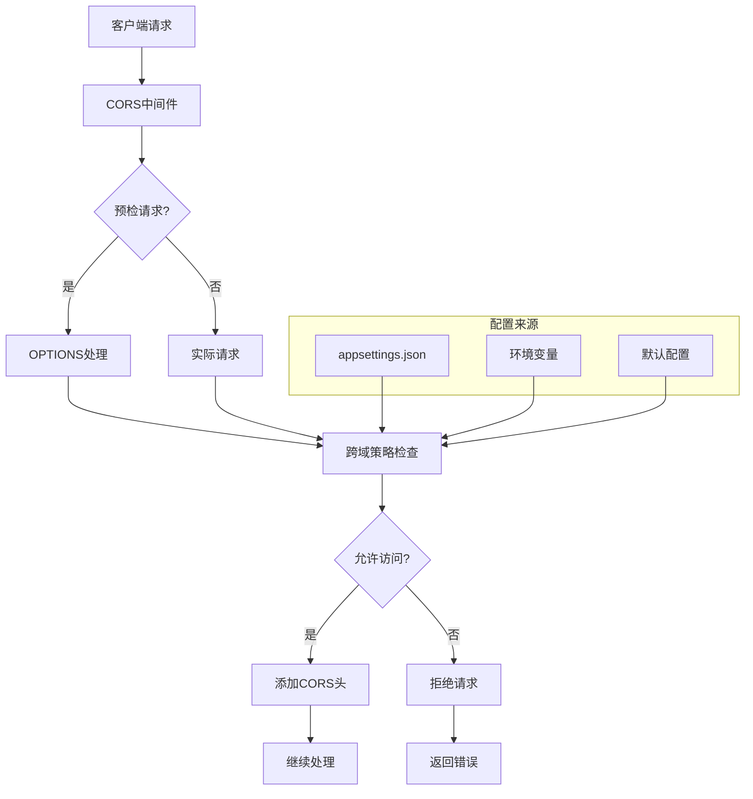

# CodeSpirit 跨域策略配置指南

## 📋 概述

CodeSpirit 框架提供了灵活的跨域资源共享（CORS）配置机制，通过 `AddCorsPolicy` 扩展方法实现统一的跨域策略管理。本文档详细介绍跨域配置的使用方法、配置选项和最佳实践。

**最后更新**: 2025年5月27日  
**负责人**: 开发团队  
**版本**: v1.0.0

## 🎯 设计目标

### 核心目标
- **配置驱动**: 通过配置文件管理跨域策略，无需硬编码
- **安全可控**: 提供细粒度的跨域控制选项
- **开发友好**: 默认配置适合开发环境，支持生产环境定制
- **通配符支持**: 支持子域名通配符匹配
- **灵活扩展**: 支持多种配置组合和自定义策略

### 技术特性
- 基于 ASP.NET Core CORS 中间件
- 支持配置文件热更新
- 提供合理的默认配置
- 支持通配符子域名
- 完整的请求头和方法控制

## 🏗️ 架构设计

### 核心组件



### 配置流程

1. **配置读取**: 从 `appsettings.json` 读取 `Cors` 配置节
2. **默认值应用**: 未配置的选项使用合理的默认值
3. **策略构建**: 根据配置构建 CORS 策略
4. **中间件注册**: 将策略注册到 ASP.NET Core 管道

## ⚙️ 配置选项详解

### 完整配置示例

```json
{
  "Cors": {
    "AllowedOrigins": [
      "http://localhost:3000",
      "https://localhost:7120",
      "https://*.xin-lai.com",
      "http://*.xin-lai.com"
    ],
    "AllowCredentials": true,
    "AllowAnyHeader": true,
    "AllowAnyMethod": true,
    "AllowWildcardSubdomains": true,
    "AllowedHeaders": [
      "Content-Type",
      "Authorization",
      "X-Requested-With"
    ],
    "AllowedMethods": [
      "GET",
      "POST",
      "PUT",
      "DELETE",
      "OPTIONS"
    ]
  }
}
```

### 配置选项说明

| 配置项 | 类型 | 默认值 | 描述 |
|--------|------|--------|------|
| `AllowedOrigins` | string[] | `["http://localhost:3000", "https://localhost:7120", "https://*.xin-lai.com", "http://*.xin-lai.com"]` | 允许的源地址列表 |
| `AllowCredentials` | bool | `true` | 是否允许发送凭据（Cookie、认证头等） |
| `AllowAnyHeader` | bool | `true` | 是否允许任意请求头 |
| `AllowAnyMethod` | bool | `true` | 是否允许任意HTTP方法 |
| `AllowWildcardSubdomains` | bool | `true` | 是否支持通配符子域名 |
| `AllowedHeaders` | string[] | - | 允许的请求头列表（当 `AllowAnyHeader` 为 false 时使用） |
| `AllowedMethods` | string[] | - | 允许的HTTP方法列表（当 `AllowAnyMethod` 为 false 时使用） |

## 💻 使用方法

### 1. 服务注册

在 `ServiceCollectionExtensions.cs` 中自动注册：

```csharp
/// <summary>
/// 添加跨域策略配置
/// 支持通过配置文件配置跨域设置
/// </summary>
/// <param name="services">服务集合</param>
/// <param name="configuration">配置对象</param>
/// <returns>服务集合</returns>
public static IServiceCollection AddCorsPolicy(this IServiceCollection services, IConfiguration? configuration = null)
{
    services.AddCors(options =>
    {
        // 从配置文件读取跨域设置
        var corsSection = configuration?.GetSection("Cors");
        var allowedOrigins = corsSection?.GetSection("AllowedOrigins")?.Get<string[]>() 
            ?? new[] { "http://localhost:3000", "https://localhost:7120", "https://*.xin-lai.com", "http://*.xin-lai.com" };
        
        var allowCredentials = corsSection?.GetValue<bool>("AllowCredentials") ?? true;
        var allowAnyHeader = corsSection?.GetValue<bool>("AllowAnyHeader") ?? true;
        var allowAnyMethod = corsSection?.GetValue<bool>("AllowAnyMethod") ?? true;
        var allowWildcardSubdomains = corsSection?.GetValue<bool>("AllowWildcardSubdomains") ?? true;

        options.AddPolicy("AllowSpecificOriginsWithCredentials", builder =>
        {
            builder.WithOrigins(allowedOrigins);
            
            if (allowWildcardSubdomains)
            {
                builder.SetIsOriginAllowedToAllowWildcardSubdomains();
            }
            
            if (allowAnyHeader)
            {
                builder.AllowAnyHeader();
            }
            else
            {
                var allowedHeaders = corsSection?.GetSection("AllowedHeaders")?.Get<string[]>();
                if (allowedHeaders?.Length > 0)
                {
                    builder.WithHeaders(allowedHeaders);
                }
            }
            
            if (allowAnyMethod)
            {
                builder.AllowAnyMethod();
            }
            else
            {
                var allowedMethods = corsSection?.GetSection("AllowedMethods")?.Get<string[]>();
                if (allowedMethods?.Length > 0)
                {
                    builder.WithMethods(allowedMethods);
                }
            }
            
            if (allowCredentials)
            {
                builder.AllowCredentials();
            }
        });
    });

    return services;
}
```

### 2. 中间件配置

在 `Program.cs` 或 `Startup.cs` 中配置中间件：

```csharp
var builder = WebApplication.CreateBuilder(args);

// 注册服务
builder.Services.AddSystemServices(builder.Configuration, typeof(Program), builder.Environment);

var app = builder.Build();

// 配置中间件管道
if (app.Environment.IsDevelopment())
{
    app.UseDeveloperExceptionPage();
}

// 启用CORS中间件（必须在路由之前）
app.UseCors("AllowSpecificOriginsWithCredentials");

app.UseRouting();
app.UseAuthentication();
app.UseAuthorization();

app.MapControllers();

app.Run();
```

## 🔧 配置场景示例

### 1. 开发环境配置

适用于本地开发，允许常见的开发端口：

```json
{
  "Cors": {
    "AllowedOrigins": [
      "http://localhost:3000",
      "http://localhost:3001",
      "http://localhost:8080",
      "https://localhost:7120"
    ],
    "AllowCredentials": true,
    "AllowAnyHeader": true,
    "AllowAnyMethod": true,
    "AllowWildcardSubdomains": false
  }
}
```

### 2. 生产环境配置

适用于生产环境，严格控制允许的源：

```json
{
  "Cors": {
    "AllowedOrigins": [
      "https://app.example.com",
      "https://admin.example.com"
    ],
    "AllowCredentials": true,
    "AllowAnyHeader": false,
    "AllowAnyMethod": false,
    "AllowWildcardSubdomains": false,
    "AllowedHeaders": [
      "Content-Type",
      "Authorization"
    ],
    "AllowedMethods": [
      "GET",
      "POST",
      "PUT",
      "DELETE"
    ]
  }
}
```

### 3. 多子域名支持

适用于支持多个子域名的场景：

```json
{
  "Cors": {
    "AllowedOrigins": [
      "https://*.example.com",
      "https://*.api.example.com"
    ],
    "AllowCredentials": true,
    "AllowAnyHeader": true,
    "AllowAnyMethod": true,
    "AllowWildcardSubdomains": true
  }
}
```

### 4. API网关配置

适用于微服务架构中的API网关：

```json
{
  "Cors": {
    "AllowedOrigins": [
      "https://gateway.example.com",
      "https://*.microservice.local"
    ],
    "AllowCredentials": false,
    "AllowAnyHeader": false,
    "AllowAnyMethod": false,
    "AllowWildcardSubdomains": true,
    "AllowedHeaders": [
      "Content-Type",
      "X-API-Key",
      "X-Request-ID"
    ],
    "AllowedMethods": [
      "GET",
      "POST",
      "PUT",
      "DELETE",
      "PATCH"
    ]
  }
}
```

### 5. 移动应用配置

适用于移动应用和桌面应用：

```json
{
  "Cors": {
    "AllowedOrigins": [
      "capacitor://localhost",
      "ionic://localhost",
      "http://localhost",
      "https://localhost"
    ],
    "AllowCredentials": true,
    "AllowAnyHeader": true,
    "AllowAnyMethod": true,
    "AllowWildcardSubdomains": false
  }
}
```

## 🔒 安全考虑

### 安全最佳实践

1. **最小权限原则**
   ```json
   {
     "Cors": {
       "AllowedOrigins": ["https://trusted-domain.com"], // 只允许信任的域名
       "AllowCredentials": false, // 如不需要凭据，设为false
       "AllowAnyHeader": false, // 明确指定允许的头部
       "AllowAnyMethod": false, // 明确指定允许的方法
       "AllowedHeaders": ["Content-Type"], // 最小化头部
       "AllowedMethods": ["GET", "POST"] // 最小化方法
     }
   }
   ```

2. **避免使用通配符**
   ```json
   // ❌ 危险：允许所有域名
   {
     "AllowedOrigins": ["*"]
   }
   
   // ✅ 安全：明确指定域名
   {
     "AllowedOrigins": ["https://app.example.com"]
   }
   ```

3. **生产环境严格配置**
   ```json
   {
     "Cors": {
       "AllowedOrigins": [
         "https://production-app.com"
       ],
       "AllowCredentials": true,
       "AllowAnyHeader": false,
       "AllowAnyMethod": false,
       "AllowWildcardSubdomains": false,
       "AllowedHeaders": [
         "Content-Type",
         "Authorization"
       ],
       "AllowedMethods": [
         "GET",
         "POST",
         "PUT",
         "DELETE"
       ]
     }
   }
   ```

### 常见安全风险

| 风险 | 描述 | 解决方案 |
|------|------|----------|
| 过度宽松的源配置 | 允许不信任的域名访问 | 明确指定信任的域名列表 |
| 凭据泄露 | 在不安全的连接中传输凭据 | 仅在HTTPS环境中启用凭据 |
| 头部注入 | 允许恶意头部通过 | 明确指定允许的头部列表 |
| 方法滥用 | 允许不必要的HTTP方法 | 仅允许业务需要的方法 |

## 🧪 测试和验证

### 1. 浏览器开发者工具测试

在浏览器开发者工具的控制台中测试跨域请求：

```javascript
// 测试简单请求
fetch('https://api.example.com/users', {
  method: 'GET',
  headers: {
    'Content-Type': 'application/json'
  }
})
.then(response => console.log('Success:', response))
.catch(error => console.error('Error:', error));

// 测试预检请求
fetch('https://api.example.com/users', {
  method: 'POST',
  headers: {
    'Content-Type': 'application/json',
    'Authorization': 'Bearer token'
  },
  body: JSON.stringify({ name: 'Test User' })
})
.then(response => console.log('Success:', response))
.catch(error => console.error('Error:', error));
```

### 2. cURL 测试

使用 cURL 测试预检请求：

```bash
# 测试预检请求
curl -X OPTIONS \
  -H "Origin: https://app.example.com" \
  -H "Access-Control-Request-Method: POST" \
  -H "Access-Control-Request-Headers: Content-Type,Authorization" \
  https://api.example.com/users

# 测试实际请求
curl -X POST \
  -H "Origin: https://app.example.com" \
  -H "Content-Type: application/json" \
  -H "Authorization: Bearer token" \
  -d '{"name":"Test User"}' \
  https://api.example.com/users
```

### 3. 自动化测试

创建单元测试验证CORS配置：

```csharp
[Test]
public async Task Cors_AllowedOrigin_ShouldReturnCorsHeaders()
{
    // Arrange
    var client = _factory.CreateClient();
    client.DefaultRequestHeaders.Add("Origin", "https://app.example.com");

    // Act
    var response = await client.GetAsync("/api/users");

    // Assert
    Assert.That(response.Headers.Contains("Access-Control-Allow-Origin"));
    Assert.That(response.Headers.GetValues("Access-Control-Allow-Origin").First(), 
                Is.EqualTo("https://app.example.com"));
}

[Test]
public async Task Cors_DisallowedOrigin_ShouldNotReturnCorsHeaders()
{
    // Arrange
    var client = _factory.CreateClient();
    client.DefaultRequestHeaders.Add("Origin", "https://malicious-site.com");

    // Act
    var response = await client.GetAsync("/api/users");

    // Assert
    Assert.That(response.Headers.Contains("Access-Control-Allow-Origin"), Is.False);
}
```

## 🔧 故障排除

### 常见问题和解决方案

#### 1. CORS 错误：请求被阻止

**错误信息**:
```
Access to fetch at 'https://api.example.com/users' from origin 'https://app.example.com' 
has been blocked by CORS policy: No 'Access-Control-Allow-Origin' header is present on the requested resource.
```

**解决方案**:
1. 检查 `AllowedOrigins` 配置是否包含请求的源
2. 确保CORS中间件在路由中间件之前注册
3. 验证配置文件格式是否正确

#### 2. 预检请求失败

**错误信息**:
```
Access to fetch at 'https://api.example.com/users' from origin 'https://app.example.com' 
has been blocked by CORS policy: Method POST is not allowed by Access-Control-Allow-Methods in response to preflight request.
```

**解决方案**:
1. 检查 `AllowedMethods` 配置
2. 确保 `AllowAnyMethod` 设置正确
3. 验证请求方法是否在允许列表中

#### 3. 凭据请求被拒绝

**错误信息**:
```
Access to fetch at 'https://api.example.com/users' from origin 'https://app.example.com' 
has been blocked by CORS policy: The value of the 'Access-Control-Allow-Credentials' header in the response is '' 
which must be 'true' when the request's credentials mode is 'include'.
```

**解决方案**:
1. 设置 `AllowCredentials: true`
2. 确保不使用通配符源（`*`）
3. 明确指定允许的源地址

#### 4. 通配符子域名不工作

**问题**: 配置了 `https://*.example.com` 但子域名请求仍被拒绝

**解决方案**:
1. 确保 `AllowWildcardSubdomains: true`
2. 检查子域名格式是否正确
3. 验证通配符语法：`https://*.example.com`

### 调试技巧

1. **启用详细日志**
   ```json
   {
     "Logging": {
       "LogLevel": {
         "Microsoft.AspNetCore.Cors": "Debug"
       }
     }
   }
   ```

2. **检查响应头**
   ```bash
   curl -I -H "Origin: https://app.example.com" https://api.example.com/users
   ```

3. **使用浏览器网络面板**
   - 查看预检请求（OPTIONS）
   - 检查响应头中的CORS相关字段
   - 验证请求头是否符合配置

## 🚀 最佳实践

### 1. 环境差异化配置

```json
// appsettings.Development.json
{
  "Cors": {
    "AllowedOrigins": [
      "http://localhost:3000",
      "https://localhost:7120"
    ],
    "AllowCredentials": true,
    "AllowAnyHeader": true,
    "AllowAnyMethod": true
  }
}

// appsettings.Production.json
{
  "Cors": {
    "AllowedOrigins": [
      "https://app.production.com"
    ],
    "AllowCredentials": true,
    "AllowAnyHeader": false,
    "AllowAnyMethod": false,
    "AllowedHeaders": ["Content-Type", "Authorization"],
    "AllowedMethods": ["GET", "POST", "PUT", "DELETE"]
  }
}
```

### 2. 配置验证

创建配置验证逻辑：

```csharp
public class CorsConfigurationValidator
{
    public static void Validate(IConfiguration configuration)
    {
        var corsSection = configuration.GetSection("Cors");
        var allowedOrigins = corsSection.GetSection("AllowedOrigins").Get<string[]>();
        
        if (allowedOrigins == null || allowedOrigins.Length == 0)
        {
            throw new InvalidOperationException("CORS AllowedOrigins cannot be empty");
        }
        
        foreach (var origin in allowedOrigins)
        {
            if (string.IsNullOrWhiteSpace(origin))
            {
                throw new InvalidOperationException("CORS AllowedOrigins cannot contain empty values");
            }
            
            if (origin == "*" && corsSection.GetValue<bool>("AllowCredentials"))
            {
                throw new InvalidOperationException("Cannot use wildcard origin with credentials");
            }
        }
    }
}
```

### 3. 性能优化

1. **缓存预检响应**
   ```csharp
   builder.WithPreflightMaxAge(TimeSpan.FromHours(1));
   ```

2. **最小化允许的头部和方法**
   ```json
   {
     "AllowedHeaders": ["Content-Type", "Authorization"],
     "AllowedMethods": ["GET", "POST"]
   }
   ```

### 4. 监控和日志

```csharp
public class CorsLoggingMiddleware
{
    private readonly RequestDelegate _next;
    private readonly ILogger<CorsLoggingMiddleware> _logger;

    public CorsLoggingMiddleware(RequestDelegate next, ILogger<CorsLoggingMiddleware> logger)
    {
        _next = next;
        _logger = logger;
    }

    public async Task InvokeAsync(HttpContext context)
    {
        if (context.Request.Headers.ContainsKey("Origin"))
        {
            var origin = context.Request.Headers["Origin"].ToString();
            _logger.LogInformation("CORS request from origin: {Origin}", origin);
        }

        await _next(context);
    }
}
```

## 📚 相关文档

- [ASP.NET Core CORS 官方文档](https://docs.microsoft.com/en-us/aspnet/core/security/cors)
- [MDN CORS 文档](https://developer.mozilla.org/en-US/docs/Web/HTTP/CORS)
- [CodeSpirit 统一异常处理指南](../01-Core-Docs/05-unified-exception-handling-zh-CN.md)
- [CodeSpirit（码灵）开发指南](../01-Core-Docs/03-development-environment-setup-zh-CN.md)

## 🔄 版本历史

### v1.0.0 (2025-05-27)
- ✅ 初始版本发布
- ✅ 支持配置文件驱动的CORS策略
- ✅ 提供通配符子域名支持
- ✅ 实现灵活的头部和方法控制
- ✅ 添加安全最佳实践指南

---

*本文档将持续更新，请定期查看最新版本* 