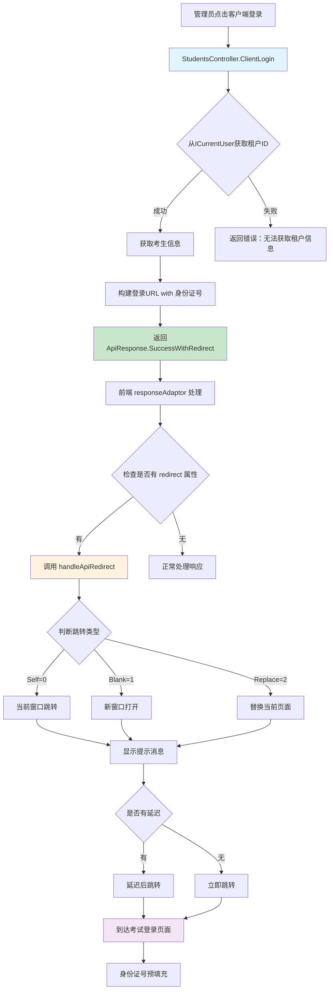

# CodeSpirit 通用 API 跳转机制使用指南

## 📋 概述

CodeSpirit 通用 API 跳转机制是一个基于 `ApiResponse` 的标准化跳转解决方案，允许后端 API 直接控制前端页面跳转，提供统一的用户体验和简化的开发模式。

### 🎯 主要特性

- ✅ **统一标准**: 基于 `ApiResponse` 的标准化跳转协议
- ✅ **多种模式**: 支持当前窗口、新窗口、替换页面等跳转方式
- ✅ **延迟跳转**: 支持可配置的延迟跳转和用户提示
- ✅ **自动处理**: 前端全局自动处理，无需额外代码
- ✅ **错误回退**: 跳转失败时的智能回退机制
- ✅ **安全可靠**: 基于已认证用户信息，避免安全隐患

## 🏗️ 架构设计

### 工作流程图



## 🔧 核心组件

### 1. RedirectType 枚举

定义跳转方式的枚举类型：

```csharp
/// <summary>
/// 跳转方式枚举
/// </summary>
public enum RedirectType
{
    /// <summary>
    /// 当前窗口跳转
    /// </summary>
    Self = 0,
    
    /// <summary>
    /// 新窗口打开
    /// </summary>
    Blank = 1,
    
    /// <summary>
    /// 替换当前页面
    /// </summary>
    Replace = 2
}
```

### 2. RedirectInfo 跳转信息类

封装跳转相关的所有信息：

```csharp
/// <summary>
/// 跳转信息
/// </summary>
public class RedirectInfo
{
    /// <summary>
    /// 跳转地址
    /// </summary>
    public string Url { get; set; }
    
    /// <summary>
    /// 跳转方式
    /// </summary>
    public RedirectType Type { get; set; } = RedirectType.Self;
    
    /// <summary>
    /// 延迟时间（毫秒）
    /// </summary>
    public int Delay { get; set; } = 0;
    
    /// <summary>
    /// 是否显示跳转提示
    /// </summary>
    public bool ShowMessage { get; set; } = true;
    
    /// <summary>
    /// 跳转提示文本
    /// </summary>
    public string Message { get; set; } = "正在跳转...";
}
```

### 3. 扩展的 ApiResponse

增强的 `ApiResponse` 类支持跳转功能：

```csharp
public class ApiResponse<T> where T : class
{
    public int Status { get; set; }
    public string Msg { get; set; }
    public T Data { get; set; }
    
    /// <summary>
    /// 跳转信息
    /// </summary>
    public RedirectInfo Redirect { get; set; }
    
    /// <summary>
    /// 创建成功响应并跳转
    /// </summary>
    public static ApiResponse<T> SuccessWithRedirect(
        T data, 
        string url, 
        string msg = "操作成功！", 
        RedirectType redirectType = RedirectType.Self, 
        int delay = 1500)
    {
        // 实现逻辑...
    }
}
```

## 📚 使用指南

### 后端使用方法

#### 1. 基础跳转

```csharp
[HttpPost("action")]
public async Task<ActionResult<ApiResponse>> SomeAction()
{
    // 执行业务逻辑...
    
    // 成功后跳转
    return Ok(ApiResponse.SuccessWithRedirect(
        url: "/target-page",
        msg: "操作成功，正在跳转..."
    ));
}
```

#### 2. 高级跳转配置

```csharp
[HttpPost("advanced-action")]
public async Task<ActionResult<ApiResponse>> AdvancedAction()
{
    // 执行业务逻辑...
    
    return Ok(ApiResponse.SuccessWithRedirect(
        url: "/external-site",
        msg: "正在打开外部页面...",
        redirectType: RedirectType.Blank,  // 新窗口打开
        delay: 2000  // 2秒后跳转
    ));
}
```

#### 3. 实际案例：考生登录跳转

```csharp
/// <summary>
/// 客户端登录跳转
/// </summary>
[HttpGet("{id}/client-login")]
[Operation("客户端登录", "ajax", null, "确定要跳转到考试登录页面吗？")]
[DisplayName("客户端登录")]
public async Task<ActionResult<ApiResponse>> ClientLogin(long id)
{
    try
    {
        // 获取考生信息
        var student = await _studentService.GetAsync(id);
        if (student == null)
        {
            return BadRequest(ApiResponse.Error(1, "考生不存在"));
        }
        
        // 从当前用户获取租户ID（安全方式）
        var tenantId = _currentUser.TenantId;
        if (string.IsNullOrEmpty(tenantId))
        {
            return BadRequest(ApiResponse.Error(1, "无法获取当前租户信息"));
        }
        
        // 构建登录URL，预填充身份证号
        var loginUrl = $"/{tenantId}/exam/login";
        if (!string.IsNullOrEmpty(student.IdNo))
        {
            loginUrl += $"?username={Uri.EscapeDataString(student.IdNo)}";
        }
        
        // 返回跳转响应
        return Ok(ApiResponse.SuccessWithRedirect(
            url: loginUrl,
            msg: "正在跳转到考试登录页面...",
            redirectType: RedirectType.Self,
            delay: 1000
        ));
    }
    catch (Exception ex)
    {
        _logger.LogError(ex, "客户端登录跳转失败，考生ID: {StudentId}", id);
        return BadRequest(ApiResponse.Error(1, "跳转失败，请重试"));
    }
}
```

### 前端自动处理

前端的 `responseAdaptor` 会自动处理包含跳转信息的 API 响应：

```javascript
responseAdaptor: function (api, payload, query, request, response) {
    // 处理 API 响应中的跳转信息
    if (payload && payload.redirect && payload.redirect.url) {
        handleApiRedirect(payload.redirect);
    }
    
    // 其他处理逻辑...
    return payload;
}
```

### 跳转处理函数

```javascript
/**
 * 处理 API 响应中的跳转信息
 * @param {Object} redirectInfo 跳转信息对象
 */
window.handleApiRedirect = function(redirectInfo) {
    if (!redirectInfo || !redirectInfo.url) {
        console.warn('跳转信息无效:', redirectInfo);
        return;
    }

    const {
        url,
        type = 0, // 默认当前窗口跳转
        delay = 0,
        showMessage = true,
        message = '正在跳转...'
    } = redirectInfo;

         // 显示跳转提示
     if (showMessage && message) {
         const amis = amisRequire('amis/embed');
         amis.toast.info(message, {
             timeout: Math.max(delay, 2000)
         });
     }

    // 执行跳转
    const doRedirect = () => {
        try {
            switch (type) {
                case 0: // Self - 当前窗口跳转
                    window.location.href = url;
                    break;
                case 1: // Blank - 新窗口打开
                    window.open(url, '_blank');
                    break;
                case 2: // Replace - 替换当前页面
                    window.location.replace(url);
                    break;
                default:
                    console.warn('未知的跳转类型:', type);
                    window.location.href = url;
            }
        } catch (error) {
            console.error('跳转失败:', error);
            // 回退到默认跳转方式
            window.location.href = url;
        }
    };

    // 延迟跳转
    if (delay > 0) {
        setTimeout(doRedirect, delay);
    } else {
        doRedirect();
    }
};
```

## 🔒 安全性考虑

### 1. 租户ID获取

**推荐方式**：从 `ICurrentUser` 获取
```csharp
var tenantId = _currentUser.TenantId;
```

**不推荐方式**：从请求头获取
```csharp
// ❌ 不安全，可能被篡改
var tenantId = HttpContext.Request.Headers["TenantId"].ToString();
```

### 2. URL验证

在跳转前应验证URL的安全性：

```csharp
private bool IsValidRedirectUrl(string url)
{
    // 验证URL格式
    if (!Uri.TryCreate(url, UriKind.RelativeOrAbsolute, out var uri))
        return false;
    
    // 限制外部域名（可选）
    if (uri.IsAbsoluteUri && !IsAllowedDomain(uri.Host))
        return false;
    
    return true;
}
```

## 🚀 使用场景

### 1. 登录后跳转

```csharp
public async Task<ActionResult<ApiResponse>> Login(LoginDto loginDto)
{
    // 登录逻辑...
    
    var redirectUrl = loginDto.ReturnUrl ?? "/dashboard";
    return Ok(ApiResponse.SuccessWithRedirect(
        url: redirectUrl,
        msg: "登录成功，正在跳转...",
        delay: 1000
    ));
}
```

### 2. 操作完成跳转

```csharp
public async Task<ActionResult<ApiResponse>> CreateUser(CreateUserDto dto)
{
    var user = await _userService.CreateAsync(dto);
    
    return Ok(ApiResponse.SuccessWithRedirect(
        url: $"/users/{user.Id}",
        msg: "用户创建成功，正在跳转到详情页面...",
        delay: 1500
    ));
}
```

### 3. 权限验证跳转

```csharp
public async Task<ActionResult<ApiResponse>> AccessProtectedResource()
{
    if (!_currentUser.IsInRole("Admin"))
    {
        return Ok(ApiResponse.SuccessWithRedirect(
            url: "/access-denied",
            msg: "权限不足，正在跳转...",
            delay: 2000
        ));
    }
    
    // 正常处理逻辑...
}
```

## 🎨 最佳实践

### 1. 合理设置延迟时间

- **即时操作**: 0-500ms
- **普通操作**: 1000-2000ms  
- **重要操作**: 2000-3000ms

### 2. 提供有意义的提示信息

```csharp
// ✅ 好的提示
msg: "正在跳转到考试登录页面..."

// ❌ 不好的提示  
msg: "跳转中..."
```

### 3. 选择合适的跳转方式

- **Self**: 同系统内的页面跳转
- **Blank**: 外部链接或独立功能页面
- **Replace**: 替换当前页面历史记录

### 4. 错误处理

```csharp
try
{
    // 业务逻辑...
    return Ok(ApiResponse.SuccessWithRedirect(...));
}
catch (Exception ex)
{
    _logger.LogError(ex, "操作失败");
    return BadRequest(ApiResponse.Error(1, "操作失败，请重试"));
}
```

## 🔍 调试和故障排除

### 1. 开启调试日志

在浏览器控制台查看跳转处理日志：

```javascript
console.log('跳转信息:', redirectInfo);
console.log('跳转URL:', url);
console.log('跳转类型:', type);
```

### 2. 常见问题

**问题**: 跳转不生效
- 检查 `responseAdaptor` 是否正确配置
- 确认 `handleApiRedirect` 函数已定义
- 验证返回的 `redirect` 对象格式

**问题**: 跳转到错误页面
- 检查URL构建逻辑
- 验证租户ID获取是否正确
- 确认参数编码是否正确

**问题**: 提示消息不显示
- 确认 `amisInstance` 是否可用
- 检查 `showMessage` 设置
- 验证消息内容是否为空

## 📖 相关文档

- [CodeSpirit.IdentityApi身份认证服务](./CodeSpirit.IdentityApi身份认证服务.md)
- [CodeSpirit.TokenManager前端认证管理器使用指南](./CodeSpirit.TokenManager前端认证管理器使用指南.md)
- [多租户登录页面使用指南](./多租户登录页面使用指南.md)

## 📝 更新日志

### v1.0.0 (2024-12-19)
- 初始版本发布
- 实现基础跳转功能
- 支持多种跳转方式
- 添加延迟跳转和用户提示
- 集成安全性验证

---

💡 **提示**: 这个跳转机制是 CodeSpirit 框架的标准组成部分，建议在所有需要页面跳转的场景中使用，以确保用户体验的一致性。 