# Exam System Complete Documentation

## 1. System Overview

The Exam System is a core business module of the CodeSpirit platform, providing a complete online examination solution. The system supports multi-tenant architecture, comprehensive anti-cheating mechanisms, real-time monitoring functions, and intelligent exam management capabilities.

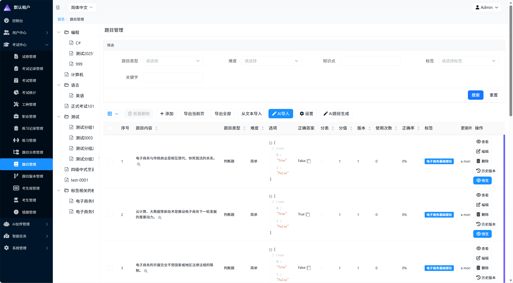

### 1.1 Core Capabilities

#### Exam Management Capabilities
- **Multi-Tenant Architecture**: Full multi-tenant support with natural data isolation, suitable for independent operation of multiple institutions
- **Flexible Paper Generation**: Supports both fixed and random paper generation modes to meet different exam scenarios
- **Multiple Question Types**: Single choice, multiple choice, true/false, short answer, essay and other question types
- **Score Conversion**: Supports automatic conversion of non-standard scores to 100-point scale, meeting national professional standards
- **Hierarchical Management**: Supports professional job category classification, adapting to vocational skill assessment scenarios

  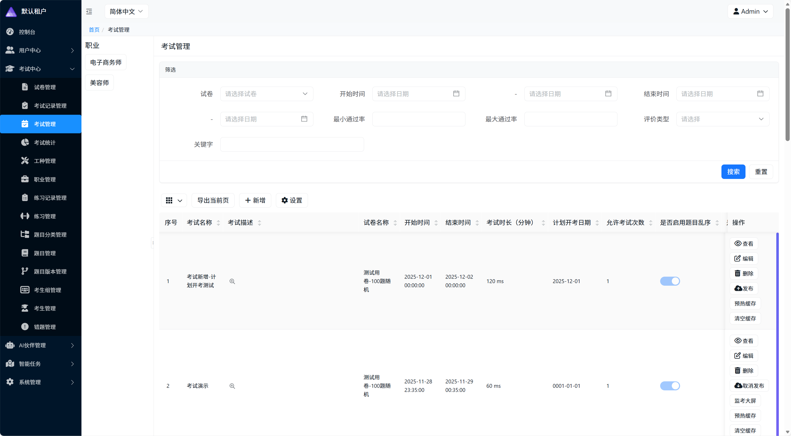

#### Intelligent Capabilities
- **AI Question Generation**: Intelligently generates high-quality questions based on knowledge points and difficulty requirements
- **AI Question Bank Import**: Supports intelligent parsing and import of Word and Excel files
- **Smart Paper Composition**: Automatically selects questions based on question type distribution and difficulty requirements
- **AI Analysis**: Intelligent analysis of exam data, providing decision support
- **Intelligent Customer Service**: AI student service officer automatically answers common student questions

  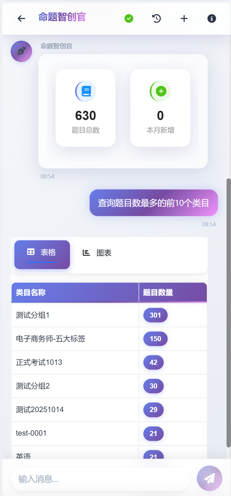

#### Security and Reliability
- **Multi-Layer Anti-Cheating**: Frontend behavior monitoring + backend data validation + anomaly detection
- **Real-Time Monitoring**: Real-time monitoring of exam process with timely warnings for abnormal behavior
- **Data Auditing**: Complete exam records and audit tracking
- **Permission Control**: Role-based fine-grained permission management

  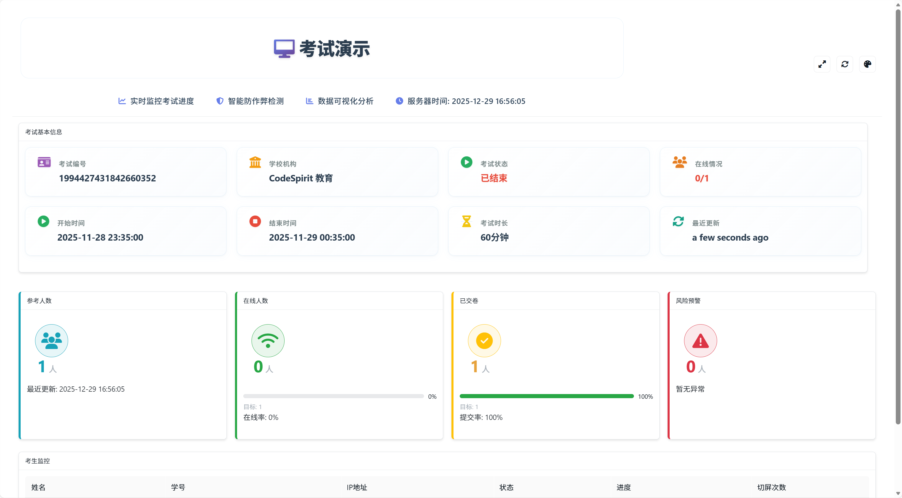

#### Business Enhancement Features
- **Public Access**: Supports generating public access codes for exam participation without login
- **Paper Export**: Supports PDF format paper and answer sheet export for archiving and distribution
- **Score Synchronization**: Supports data synchronization with external systems
- **Practice Mode**: Supports daily practice and wrong question reinforcement

  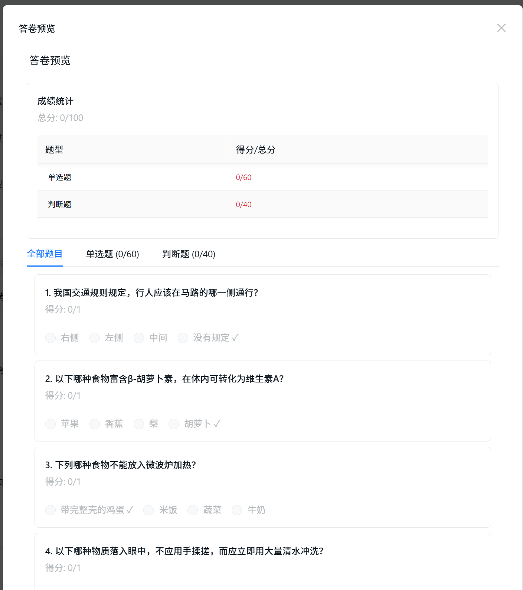

  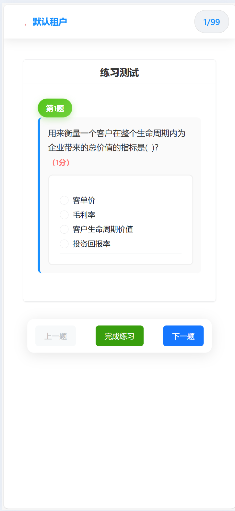

### 1.2 Application Scenarios

- **Vocational Skill Assessment**: Supports national vocational skill assessment exam business
- **Training Assessment**: Internal enterprise training effect evaluation and assessment
- **Qualification Certification**: Various professional qualification certification exams
- **Educational Training**: Online exams and assessments for educational institutions
- **Knowledge Competitions**: Organizing online knowledge competition activities

  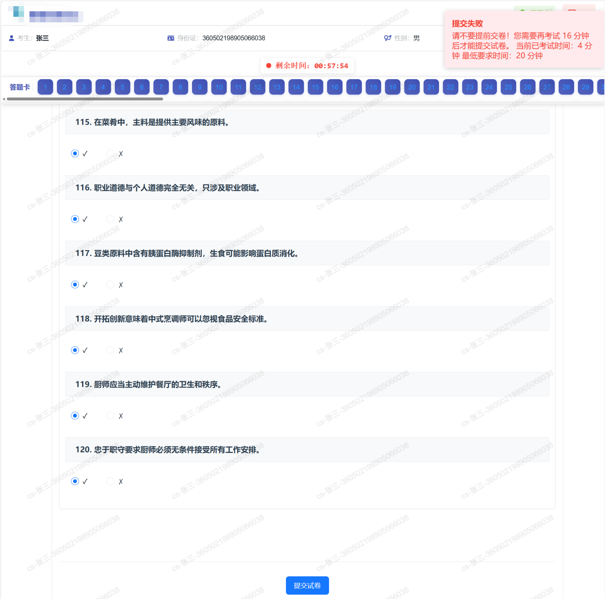

## 2. User Roles and Permissions

### 2.1 Role System

#### System Administrator
- **Role Positioning**: Responsible for overall system configuration and operation management
- **Core Permissions**:
  - Question Bank Management: Question classification, question import, question editing
  - Paper Management: Create papers, edit papers, publish papers
  - Exam Settings: Create exams, configure rules, publish exams
  - Student Management: Student information maintenance, group management
  - Data Analysis: View all exam statistics and analysis reports
  - System Configuration: Professional job category settings, evaluation type configuration

#### Exam Administrator
- **Role Positioning**: Responsible for organizing and executing specific exams
- **Core Permissions**:
  - Exam Monitoring: Real-time monitoring of exam progress
  - Exception Handling: Handle exceptions during exams
  - Score Management: View and export exam scores
  - Student Service: Handle student inquiries and appeals

#### Question Author
- **Role Positioning**: Responsible for question bank construction and paper preparation
- **Core Permissions**:
  - Question Creation: Add and edit exam questions
  - AI Assistance: Use AI to generate questions
  - Paper Preparation: Create and edit exam papers
  - Question Review: Review questions created by other teachers

#### Student
- **Role Positioning**: Take exams and view scores
- **Core Permissions**:
  - Take Exams: Log in and take published exams
  - View Scores: View exam scores and answer details
  - Practice Function: Use practice mode for daily learning
  - Wrong Question Review: View wrong question records and reinforce practice

### 2.2 AI Smart Partners

The system includes four AI smart partners to provide intelligent service support for different roles:

#### Exam Analyst (Xiao Xi)
- **Service Target**: System administrators, exam administrators
- **Core Functions**:
  - Exam Score Analysis: Automatically generate score analysis reports
  - Student Score Query: Intelligent query and comparative analysis
  - Smart Paper Export: Support batch export of papers by conditions
  - Public Paper Sharing: Generate public access codes to share exams
- **Usage Scenarios**:
  - "Analyze the score distribution of XX exam"
  - "Query all exam scores of Zhang San"
  - "Export all exam PDF answer sheets this month"
  - "Generate public access code for XX exam"

#### Question Creator (Xiao Chuang)
- **Service Target**: Question authors, system administrators
- **Core Functions**:
  - AI Question Generation: Intelligently generate questions based on knowledge points
  - Smart Question Bank Import: Parse Word/Excel/PDF files to import questions
  - Question Query Analysis: Natural language query of question bank
  - Smart Paper Composition: Automatically select questions based on requirements
- **Usage Scenarios**:
  - "Generate 5 single choice questions about data structures"
  - "Import my question bank file"
  - "Query all questions with medium difficulty"
  - "Compose a 100-point paper using e-commerce category questions"

#### Exam Supervisor (Xiao Xun)
- **Service Target**: Exam administrators
- **Core Functions**:
  - Today's Exam Summary: Real-time understanding of all exams today
  - Real-Time Monitoring: Monitor online number and answer progress of ongoing exams
  - Anomaly Alerts: Timely discover screen switching, long-term non-answering and other abnormal behaviors
- **Usage Scenarios**:
  - "What exams are there today?"
  - "View the status of ongoing exams"
  - "Are there any anomaly alerts?"
  - "What is the current progress of XX exam?"

#### Student Service (Xiao Zhu)
- **Service Target**: Students
- **Core Functions**:
  - Intelligent Customer Service: Automatically answer exam-related questions
  - Registration Query: Query exam registration status
  - Score Query: Query historical exam scores
  - Certificate Service: Certificate download and verification
- **Usage Scenarios**:
  - "View my registration records"
  - "What is my exam score?"
  - "How to download the admission ticket?"
  - "What are the exam precautions?"

## 3. System Architecture

### 3.1 Business Architecture

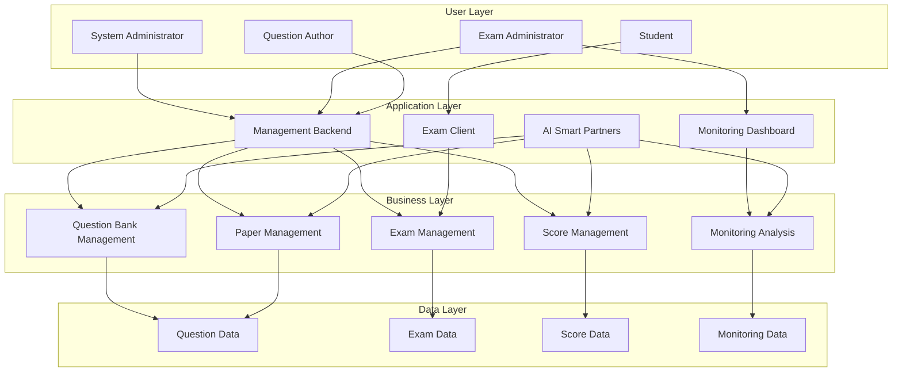

### 3.2 Module Division

#### Business Module Description

**Question Bank Management Module**
- Question category management
- Question information maintenance
- Question version control
- AI question generation
- Batch import and export

**Paper Management Module**
- Fixed paper preparation
- Random paper configuration
- Paper preview check
- Score conversion settings
- Paper publication management

**Exam Management Module**
- Exam planning
- Participant management
- Exam rule configuration
- Public access settings
- Exam status control

**Score Management Module**
- Automatic scoring
- Score query
- Score conversion
- Score export
- Score synchronization

**Monitoring Analysis Module**
- Real-time monitoring
- Anomaly alerts
- Data statistics
- Analysis reports

## 4. Core Function Description

### 4.1 Question Bank Management

#### Question Classification System
Supports multi-level classification management, can organize question banks by major, subject, chapter and other dimensions for easy question retrieval and maintenance.

#### Question Information Management
- **Question Types**: Single choice, multiple choice, true/false, short answer, essay
- **Difficulty Levels**: Easy, medium, hard three levels
- **Knowledge Tags**: Supports tagging questions for classification and retrieval
- **Score Setting**: Each question can be individually set with score
- **Answer Analysis**: Supports adding detailed answer analysis

#### Question Version Control
The system automatically records question modification history to ensure that question content in used papers will not change due to subsequent modifications, ensuring consistency and traceability of exam data.

#### AI Smart Question Generation
Through the Question Creator (Xiao Chuang), teachers can:
- Generate questions by describing requirements: such as "Generate 5 medium difficulty single choice questions about data structures"
- Generate by specific knowledge points: Batch generate questions for specific knowledge points
- Review and optimize generated results: Manual review and optimization of AI-generated questions

  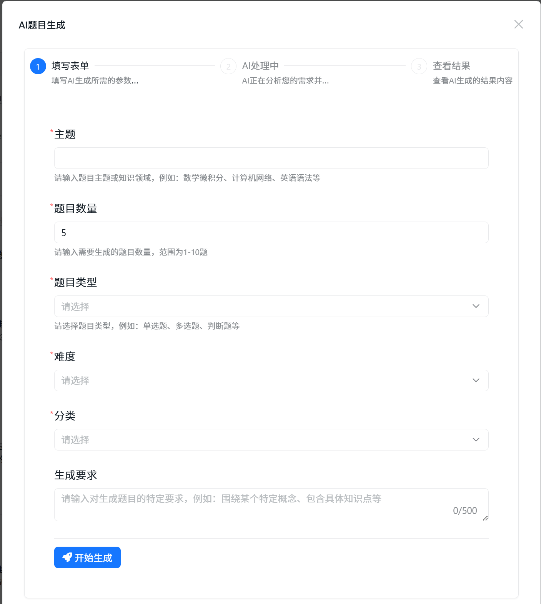

#### Question Batch Import
Supports intelligent parsing and import of three file formats:
- **Word Documents**: Recognize question content, options, answers by format
- **Excel Tables**: Import question data by column mapping
- **PDF Files**: AI intelligently recognizes and extracts question information

### 4.2 Paper Management

#### Fixed Papers
Suitable for scenarios that require precise control of questions and order:
- Manual question selection
- Custom question order
- Precise score distribution control
- Paper preview check

#### Random Papers
Suitable for preventing cheating and scenarios requiring large-scale paper generation:
- **Question Type Distribution Rules**: Set the number and score of each question type
- **Difficulty Distribution Rules**: Set the proportion of questions of different difficulties
- **Knowledge Point Coverage**: Ensure the paper covers specified knowledge points
- **Automatic Question Selection**: System automatically extracts questions from question bank according to rules

#### Score Conversion Function
For non-100-point papers, supports automatic conversion to 100-point scale:
- **Application Scenario**: Meet national vocational skill assessment requirements for 100-point scores
- **Conversion Configuration**: Set original and target scores, system automatically calculates conversion ratio
- **Dual Recording**: Save both original and converted scores simultaneously
- **Transparent Display**: Score sheet clearly shows conversion instructions

**Usage Example:**
- 120-point paper → converted to 100-point scale
- Student score 96 → converted to 80.0 after conversion
- 72 passing line → converted to 60 after conversion

#### Paper Preview and Check
After paper creation, the system provides complete preview function:
- Question content preview
- Score distribution check
- Difficulty distribution verification
- Score conversion instructions
- Mark paper as "Checked"

### 4.3 Exam Management

#### Exam Creation Process
1. **Select Paper**: Choose created paper
2. **Set Time**: Configure exam start time, end time and duration
3. **Select Students**:
   - Select by student groups
   - Support multiple groups taking the same exam
4. **Configure Rules**:
   - Allowed exam attempts
   - Question randomization setting
   - Option randomization setting
   - Minimum exam time
5. **Anti-Cheating Settings**:
   - Allowed screen switching count
   - Whether results can be viewed after submission
   - Whether to display question analysis

#### Public Access Function
Supports generating public access codes for exam participation without login:
- **Usage Scenarios**: Social recruitment exams, open assessments, questionnaires
- **Access Method**: Enter exam through short link + access code
- **Student Identification**: Take exam after entering name and ID number
- **Security Control**: Can set access code validity period and usage count limit

**Public Exam Process:**
```
Student receives exam link 
  ↓
Enter public access code
  ↓
Fill in personal information (name, ID number)
  ↓
Enter exam interface to start answering
  ↓
Submit to view scores
```

#### Exam Status Management
- **Draft**: Exam being created, can be modified freely
- **Published**: Exam published, visible to students but not started
- **In Progress**: Exam is ongoing
- **Ended**: Exam time has passed
- **Archived**: Exam data has been archived

### 4.4 Online Exam

#### Exam Login and Identity Verification
- **Tenant Isolation**: Exams of different institutions are completely independent
- **Identity Verification**: Username and password login or public access code login
- **Device Detection**: Record device information used by students
- **IP Recording**: Record student login and exam IP address

#### Exam Interface
- **Question Display**: Supports text, image, rich text formats
- **Answer Operations**: Single choice, multiple choice, true/false can be directly selected, short answer can input text
- **Progress Prompt**: Shows number of answered questions and remaining time
- **Auto Save**: Answers automatically saved in real-time to prevent accidental loss

#### Anti-Cheating Mechanism
**Frontend Monitoring:**
- Disable right-click menu
- Disable copy and paste
- Disable print function
- Detect developer tools
- Monitor page switching (screen switching detection)
- Monitor window blur

**Backend Validation:**
- Answer time reasonableness check
- Answer order anomaly detection
- IP address change detection
- Multiple submission behavior monitoring

#### Exam Submission
- **Submission Check**: Prompt for number of unanswered questions
- **Force Submit**: Can choose to force submit incomplete exam
- **Auto Submit**: Automatic submission when exam time is up
- **Submission Confirmation**: Secondary confirmation to avoid misoperation

### 4.5 Score Management

#### Automatic Scoring
Objective questions (single choice, multiple choice, true/false) are automatically scored after submission:
- Real-time score calculation
- Automatic correctness judgment
- Apply score conversion rules (if enabled)
- Determine pass/fail status

#### Manual Scoring
Subjective questions (short answer, essay) require manual scoring:
- Batch scoring interface
- Display standard answers and analysis
- Support scoring and comments
- Automatically update total score after scoring

#### Score Query
**Student Side:**
- View personal exam scores
- View answer details (if allowed)
- View question analysis (if allowed)
- View score conversion instructions (if applicable)

**Management Side:**
- View all student scores
- Filter and query by conditions
- Score statistics analysis
- Score distribution charts

#### Score Export
Supports export in multiple formats:
- **Excel Format**: Batch export score data
- **PDF Format**: Export answer sheet details and score sheets
- **Custom Filter**: Filter and export by exam, group, score range

#### Score Synchronization
Supports score data synchronization with external systems:
- **Application Scenario**: Synchronize scores to human resources department and education department systems
- **Synchronization Method**: API interface docking
- **Data Encryption**: Use SM2 algorithm for encrypted transmission
- **Synchronization Records**: Complete record of synchronization history and status

### 4.6 Practice Mode

#### Practice Function
- **Random Practice**: Randomly extract questions from question bank for practice
- **Category Practice**: Practice by question category
- **Instant Feedback**: Display correct answers and analysis immediately after answering
- **Unlimited Attempts**: Can practice the same question repeatedly

#### Wrong Question Management
- **Auto Collection**: Wrong questions automatically added to wrong question set
- **Error Statistics**: Record error count for each question
- **Targeted Practice**: Support special practice for wrong questions
- **Mastery Assessment**: Assess mastery based on practice

## 5. Real-Time Monitoring System

### 5.1 Exam Supervisor (AI Assistance)

Through dialogue with Exam Supervisor (Xiao Xun), exam administrators can quickly obtain exam monitoring information:

**Today's Exam Summary:**
- Query: "What exams are there today?"
- Get list of all planned exams today
- Display status and number of participants for each exam
- Quickly locate exams that need attention

**Real-Time Monitoring:**
- Query: "View ongoing exams"
- Real-time display of number of online students
- Display overall answer progress
- Overview of each student's answer status

**Anomaly Alerts:**
- Query: "Are there any anomaly alerts?"
- Automatically identify screen switching behavior
- Detect long-term non-answering
- Mark suspicious cheating behavior

### 5.2 Monitoring Dashboard

#### Overall Monitoring View
Provides global monitoring perspective of exams:
- **Exam Overview**: Display number of participants, submitted papers, in progress
- **Answer Progress**: Overall answer progress percentage and completion status of each question
- **Real-Time Dynamics**: Recent submissions, recent logins and other real-time information
- **Anomaly Alerts**: Highlight number and type of anomalous behaviors

#### Student Monitoring List
- Student online status
- Current answer progress
- Used time/remaining time
- Screen switching count
- Anomaly behavior marking

#### Data Visualization
- Score distribution chart
- Answer progress distribution
- Question accuracy statistics
- Anomaly behavior trend chart

### 5.3 Individual Student Monitoring

Detailed monitoring of individual student exam situation:
- **Basic Information**: Name, admission ticket number, login time
- **Device Information**: Device type, browser, IP address
- **Answer Details**: Each question's answer status, time used, answer
- **Behavior Records**: Screen switching records, long-term stays, etc.
- **Real-Time Operations**: Can force submit, send reminders, etc.

### 5.4 Anomaly Behavior Detection

The system automatically detects and records the following anomalous behaviors:

**Screen Switching:**
- Detection Method: Page blur monitoring
- Recorded Information: Screen switching time, duration
- Handling Strategy: Auto submit or mark when exceeding allowed count

**Long-Term Stay:**
- Detection Method: Long-term non-answering operations
- Recorded Information: Question number, duration
- Handling Strategy: Remind or mark as anomaly

**Answer Time Anomaly:**
- Too fast completion: May have obtained answers in advance
- Abnormal time distribution: Concentrated on certain questions
- Handling Strategy: Mark for manual review

**Device/IP Change:**
- Detect device or IP change during exam
- Possible risk of impersonation
- Serious violation

## 6. Business Processes

### 6.1 Standard Exam Process

Complete exam business process:

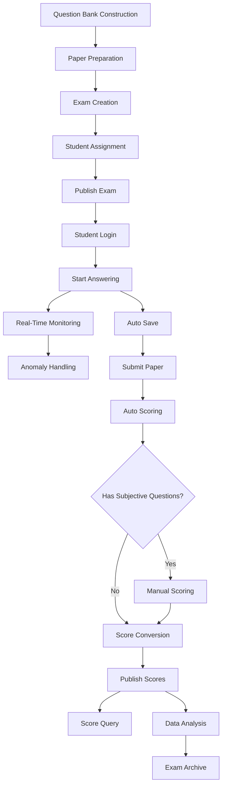

#### Detailed Step Description

**Phase 1: Pre-Exam Preparation**
1. **Question Bank Construction** (Question Authors)
   - Create question categories
   - Add exam questions
   - Can use AI assistance to generate questions
   - Batch import historical question banks

2. **Paper Preparation** (Question Authors/Administrators)
   - Select paper composition method (fixed/random)
   - Configure question type distribution and scores
   - Set score conversion rules (if needed)
   - Preview and check paper

3. **Exam Creation** (Administrators)
   - Select paper
   - Set exam time
   - Configure exam rules
   - Set anti-cheating parameters

4. **Student Assignment** (Administrators)
   - Create student groups
   - Import student information
   - Assign exam permissions
   - Generate public access code (if needed)

**Phase 2: Exam In Progress**
5. **Publish Exam** (Administrators)
   - Check exam configuration
   - Publish exam notification
   - Exam visible to students

6. **Student Login** (Students)
   - Login with account and password or
   - Login with public access code
   - Enter waiting area after identity verification

7. **Start Answering** (Students)
   - Read exam instructions
   - Click to start exam
   - Answer questions with auto-save
   - System records answer process

8. **Real-Time Monitoring** (Exam Administrators)
   - View overall situation on monitoring dashboard
   - Use Exam Supervisor to query status
   - Pay attention to anomaly alerts
   - Manually intervene if necessary

**Phase 3: Post-Exam Processing**
9. **Submit Paper** (Students)
   - Check answer status
   - Confirm paper submission
   - Or auto submit when time is up

10. **Auto Scoring** (System)
    - Automatic grading of objective questions
    - Calculate preliminary score
    - Apply score conversion (if enabled)

11. **Manual Scoring** (Scoring Teachers)
    - Grade subjective questions (if any)
    - Score and add comments
    - System updates total score

12. **Publish Scores** (Administrators)
    - Review score data
    - Publish exam scores
    - Students can query scores

**Phase 4: Data Analysis**
13. **Score Query** (Students/Administrators)
    - Students view personal scores
    - Administrators view all scores
    - Export score reports

14. **Data Analysis** (Administrators)
    - Use Exam Analyst to analyze scores
    - View statistical reports
    - Generate analysis reports

15. **Exam Archive** (Administrators)
    - Export exam data
    - Archive exam records
    - Retain audit trail

### 6.2 Public Exam Process

For public exam scenarios without login:

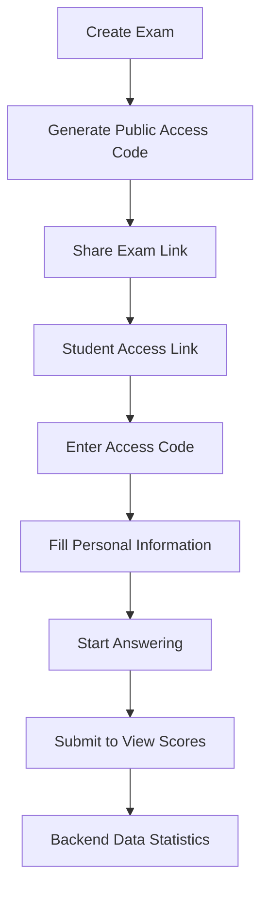

**Usage Scenarios:**
- Social recruitment written tests
- Open ability assessments
- Questionnaires
- Knowledge competitions

**Advantages:**
- No account creation needed
- Lower participation threshold
- Suitable for temporary exams
- Quick organization and implementation

### 6.3 Practice Mode Process

Daily practice and self-learning process:

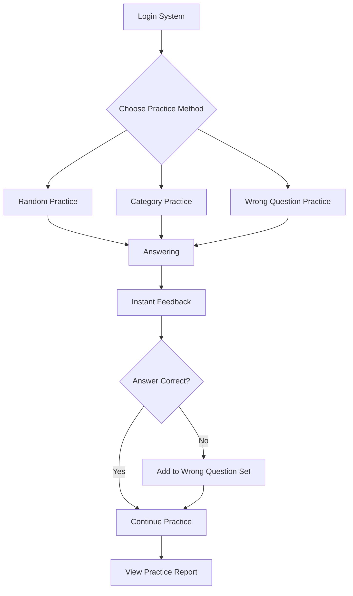

## 7. Typical Application Scenarios

### 7.1 Vocational Skill Assessment

**Scenario Description:**
A vocational training institution needs to organize e-commerce specialist vocational skill assessment exams, requiring scores in 100-point scale, and needs to synchronize scores to human resources department system.

**Solution:**
1. **Question Bank Preparation**:
   - Create question categories by professional job categories
   - Batch generate questions using Question Creator
   - Manual review to optimize question quality

2. **Paper Preparation**:
   - Create 150-point random paper
   - Set question type distribution: 40 single choice × 2 points, 10 multiple choice × 4 points, 20 true/false × 1 point, 3 short answer × 10 points
   - Enable score conversion, automatically convert to 100-point scale

3. **Exam Organization**:
   - Create exam and set exam time
   - Import student list and group
   - Configure anti-cheating rules
   - Publish exam

4. **Exam Monitoring**:
   - Use Exam Supervisor to query exam status in real-time
   - Monitoring dashboard displays overall progress
   - Timely handle anomalies

5. **Score Processing**:
   - Automatic scoring of objective questions
   - Manual grading of short answer questions
   - Scores automatically converted to 100-point scale
   - Use SM2 encryption to synchronize scores to human resources system

### 7.2 Corporate Recruitment Written Test

**Scenario Description:**
A company needs to conduct online written tests for applicants, requiring no account registration, quick organization, and timely score release.

**Solution:**
1. **Quick Paper Composition**:
   - Select existing question bank or quickly import written test questions
   - Create fixed or random paper
   - Preview to check for accuracy

2. **Generate Public Access**:
   - Create exam and generate public access code (e.g.: ABC123)
   - Get exam short link
   - Send link and access code to applicants

3. **Applicant Participation**:
   - Open page after receiving link
   - Enter access code + name + ID number
   - Start answering immediately

4. **Real-Time Monitoring**:
   - HR uses monitoring dashboard to view answer progress
   - Identify anomalous behaviors
   - View scores immediately after exam ends

5. **Score Analysis**:
   - Use Exam Analyst to analyze score distribution
   - Screen excellent applicants
   - Export score reports

### 7.3 Training Effect Assessment

**Scenario Description:**
A company completes internal training and needs to assess training effect, allowing employees to take exam multiple times and record best score.

**Solution:**
1. **Create Assessment Exam**:
   - Create paper based on training content
   - Set exam time window (e.g., within one week)
   - Allow exam attempts: 3 times
   - Enable question randomization to prevent cheating

2. **Employee Self-Arrangement**:
   - Employees choose exam time within time window
   - Can take exam multiple times, system records highest score
   - Wrong questions automatically added to wrong question set

3. **Daily Practice**:
   - Employees use practice mode for review
   - Targeted practice for wrong questions
   - Take exam again after adequate preparation

4. **Training Analysis**:
   - Statistics on overall pass rate
   - Analyze weak knowledge points
   - Provide improvement direction for next training

### 7.4 Knowledge Competition

**Scenario Description:**
Organize online knowledge competition activity, requiring random questions, instant ranking, preventing cheating.

**Solution:**
1. **Competition Question Bank**:
   - Prepare large number of questions
   - Set different difficulties
   - Use AI to quickly expand question bank

2. **Random Papers**:
   - Different question order for each contestant
   - Random option order
   - Avoid copying between contestants

3. **Real-Time Ranking**:
   - Instant ranking update after auto scoring
   - Monitoring dashboard displays Top 10
   - Create competition atmosphere

4. **Anti-Cheating Measures**:
   - Strict screen switching detection
   - Detect abnormally fast answering
   - Manual review of suspicious records

## 8. Data Statistics and Analysis

### 8.1 Exam Analyst Data Analysis

Using Exam Analyst (Xiao Xi) can quickly obtain various statistical analyses:

**Score Analysis:**
- "Analyze score distribution of XX exam"
- "Average score of all exams this month"
- "Comparison of pass rates by major"

**Student Analysis:**
- "Query all exam scores of Zhang San"
- "Top 10 students in this class"
- "Which students failed multiple exams"

**Question Analysis:**
- "10 questions with lowest accuracy rate"
- "Average accuracy rate of single choice questions"
- "Which questions need optimization"

### 8.2 Statistical Reports

#### Exam Summary Report
- Number of participants statistics
- Actual number of participants
- Number of absences
- Average score
- Highest score/lowest score
- Pass rate
- Excellence rate (≥85 points)

#### Score Distribution Analysis
- Score range statistics (0-59, 60-69, 70-79, 80-89, 90-100)
- Score distribution curve
- Comparison with historical exams
- Comparison with other groups

#### Question Quality Analysis
- Accuracy rate of each question
- Discrimination analysis
- Difficulty coefficient calculation
- Question optimization suggestions

#### Student Performance Analysis
- Personal historical score trend
- Weak knowledge point identification
- Comparison with average level
- Learning effect assessment

### 8.3 Data Export

Supports data export in multiple formats:

**Excel Export:**
- Score detail sheet
- Statistics summary sheet
- Student answer details
- Custom filter conditions

**PDF Export:**
- Exam paper (with answers and analysis)
- Student answer sheet (with annotations and scores)
- Score certificate
- Analysis report

**API Data Synchronization:**
- Interface with human resources system
- Interface with education system
- Custom interface docking
- Support SM2 encrypted transmission

## 9. System Integration

### 9.1 Multi-Tenant Data Isolation

The system adopts multi-tenant architecture to ensure complete data isolation between different institutions:
- Each tenant has independent data space
- Data between tenants is mutually invisible
- Supports tenant-level personalized configuration
- Can independently backup and restore tenant data

### 9.2 Integration with External Systems

#### Score Synchronization Interface
- Support synchronizing exam scores to external systems such as human resources and education
- Use SM2 algorithm for encrypted transmission
- Support batch synchronization and single synchronization
- Complete synchronization log and status tracking

#### Single Sign-On (SSO)
- Support integration with enterprise SSO systems
- Support OAuth 2.0 / SAML 2.0 protocols
- Automatic user information synchronization
- Unified identity authentication experience

#### Data API Interface
- RESTful API interface
- Standard JSON data format
- API key authentication
- Complete interface documentation

### 9.3 System Docking Capabilities

The system provides standardized interfaces to support docking with the following systems:
- Human Resource Management System (HR)
- Learning Management System (LMS)
- Enterprise Resource Planning System (ERP)
- Customer Relationship Management System (CRM)
- Third-party question bank systems

## 10. System Operations

### 10.1 Data Backup

**Backup Strategy:**
- Daily full database backup
- Incremental backup every 4 hours
- Off-site storage of backup files
- Regular recovery drills

**Backup Content:**
- Question bank data
- Paper data
- Exam records
- Score data
- System configuration

### 10.2 Performance Optimization

**System Level:**
- Question and paper data caching
- Database query optimization
- Static resource CDN acceleration
- Load balancing configuration

**Exam Peak Response:**
- Pre-warm cache in advance
- Increase server resources
- Traffic limiting protection mechanism
- Degradation emergency plan

### 10.3 Monitoring and Alerting

**Monitoring Metrics:**
- System availability monitoring
- Response time monitoring
- Concurrent user count monitoring
- Error rate monitoring
- Resource utilization monitoring

**Alert Mechanism:**
- Real-time alert notifications
- Multi-channel alerts (email/SMS/enterprise WeChat)
- Alert escalation mechanism
- Automatic recovery attempts

### 10.4 Security Protection

**Security Measures:**
- Prevent SQL injection
- Prevent XSS attacks
- Prevent CSRF attacks
- API access frequency limiting
- Sensitive data encryption storage

**Permission Management:**
- Role-based access control
- Principle of least privilege
- Operation audit log
- Regular permission review

## 11. FAQ

### 11.1 Exam Related Questions

**Q1: What if students can't see the exam after login?**
- Check if exam is published
- Confirm if student is in participating group
- Check if exam time settings are correct
- Confirm if tenant information matches

**Q2: What if network disconnects during exam?**
- System will automatically save answered questions
- Continue answering after reconnecting
- Remaining time continues counting
- Recommend testing network stability before exam

**Q3: Will the system automatically submit when time is up?**
- Yes, automatic submission when time is up
- 5-minute warning for insufficient time
- Recommend students check and submit in advance

**Q4: How is score conversion calculated?**
- System automatically calculates according to set conversion ratio
- Saves both original and converted scores simultaneously
- Score sheet displays conversion instructions
- Example: 120-point scale 96 points → 100-point scale 80 points

**Q5: What if public access code is forgotten?**
- Administrator can view access code in exam details
- Can regenerate new access code
- Old access code remains valid after generation

### 11.2 Anti-Cheating Related Questions

**Q1: How many screen switches will be marked as anomaly?**
- Determined according to allowed screen switch count set in exam
- Will be marked but not immediately force submitted when exceeding count
- Administrator can view screen switch records in monitoring

**Q2: What if students say normal operations are misjudged as screen switching?**
- May be browser compatibility issue
- Recommend using latest version of Chrome or Edge
- Can conduct simulation test before exam
- Can adjust detection sensitivity if necessary

**Q3: How to prevent students from taking photos with mobile phones for cheating?**
- Can combine with offline proctoring
- Enable video monitoring (requires third-party integration)
- Set random questions and option randomization
- Detect through answer time anomaly

### 11.3 Score Management Questions

**Q1: How to score subjective questions?**
- System does not automatically score subjective questions
- Requires manual grading by teachers
- Grading interface displays standard answers
- Can give scores and comments

**Q2: What if students can't see scores after publication?**
- Check if exam settings allow viewing results
- Confirm if scores are reviewed and published
- Check student permission configuration

**Q3: How to batch modify scores?**
- Not recommend directly modifying score data
- Can re-grade subjective questions
- Or adjust question scores and recalculate
- Modifications will be recorded in audit log

### 11.4 Question Bank Management Questions

**Q1: What if imported question format is incorrect?**
- Check if file format meets template requirements
- Using AI smart import can automatically recognize
- View import log to understand specific errors
- Can contact technical support for help

**Q2: How to quickly expand question bank?**
- Use Question Creator AI to generate questions
- Import historical question files
- Migrate from other question bank systems
- Organize teacher teams for collaborative creation

**Q3: Will modifying questions affect existing exams?**
- No, system uses question version control
- Created papers use question version at that time
- Modifying questions creates new version
- New papers use latest version

### 11.5 System Usage Recommendations

**Pre-Exam Preparation:**
- Publish exams and notify students in advance
- Organize simulation exams to familiarize with process
- Prepare emergency plans
- Check if server resources are sufficient

**During Exam Monitoring:**
- Pay real-time attention to monitoring dashboard
- Timely handle anomalies
- Record important events
- Maintain communication channels with students

**Post-Exam Processing:**
- Timely grade subjective questions
- Review score data
- Analyze exam situation
- Archive exam data

## 12. Future Plans

### 12.1 Feature Enhancement

- **Mobile APP**: Develop native mobile applications to optimize mobile exam experience
- **Video Proctoring**: Integrate video monitoring to support remote proctoring
- **Facial Recognition**: Pre-exam facial recognition identity verification to prevent impersonation
- **Voice Answering**: Support voice recognition to expand answering methods
- **Offline Exam**: Support offline answering, synchronize after network recovery

### 12.2 AI Capability Enhancement

- **Smart Paper Composition**: Intelligently recommend paper composition strategies based on historical data
- **Adaptive Exam**: Dynamically adjust question difficulty based on answer status
- **Learning Path Planning**: Generate personalized learning paths based on exam results
- **Cheating Pattern Recognition**: AI recognizes more complex cheating patterns

### 12.3 Data Analysis Enhancement

- **Big Data Analysis Platform**: Deep mining of exam data value
- **Predictive Analysis**: Predict student performance and pass rate
- **Benchmarking Analysis**: Comparative analysis with industry standards
- **Visualization Dashboard**: Richer data visualization display

## 13. Appendix

### 13.1 Glossary

| Term | Description |
|------|-------------|
| Tenant | Independent institution or organization using the system |
| Question Bank | Database storing exam questions |
| Fixed Paper | Paper with fixed questions and order |
| Random Paper | Paper automatically extracting questions according to rules |
| Score Conversion | Converting non-100-point scores to 100-point scale |
| Public Access Code | Access credential for taking exams without login |
| Question Version | Historical modification version record of questions |
| Screen Switch Detection | Detecting student leaving exam page behavior |
| Exam Supervisor | AI smart assistant for exam monitoring |
| Question Creator | AI smart assistant for question bank management |
| Exam Analyst | AI smart assistant for data analysis |
| Student Service | AI smart assistant for student service |

### 13.2 Related Documentation

- [Exam System Feature List](./exam-system-feature-list-zh-CN.md)
- [CodeSpirit Authorization Guide](../04-Identity-Auth/codespirit-authorization-guide-zh-CN.md)
- [CodeSpirit Multi-Tenancy Guide](../05-Multi-Tenancy/)
- [CodeSpirit Aggregator Guide](../03-Core-Components/codespirit-aggregator-guide-zh-CN.md)

### 13.3 Technical Support

If you need technical support or have any questions, please contact us through the following methods:

- **Project Repository**: https://github.com/codespirit/code-spirit
- **Issue Feedback**: Submit issues on GitHub
- **Documentation Contribution**: Welcome to submit Pull Requests to improve documentation

---

**Document Version**: v2.0  
**Update Time**: December 2024  
**Applicable Version**: CodeSpirit v1.0+

> This document comprehensively introduces the functional features, usage scenarios and business processes of CodeSpirit Exam System from a business perspective. If you have any questions or suggestions, please feel free to provide feedback.

